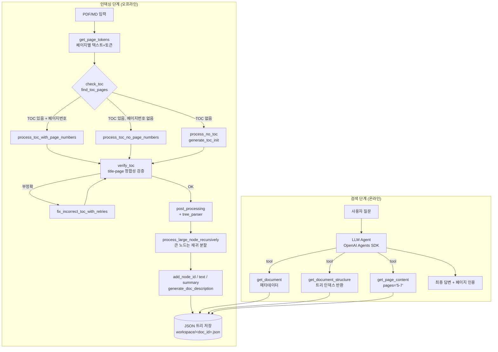
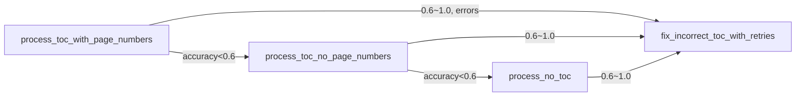

# PageIndex 분석 — Vectorless, Reasoning-based RAG

> 분석 대상: [VectifyAI/PageIndex](https://github.com/VectifyAI/PageIndex)
> 분석 시점 코드: `pageindex/` 패키지 (page_index.py 1153 LOC, page_index_md.py 341 LOC, retrieve.py 137 LOC, client.py 234 LOC)

---

## 1. 프로젝트 개요

### 1.1 핵심 정의

PageIndex는 **벡터 임베딩과 청킹(chunking)을 사용하지 않는 RAG 시스템**이다. 대신 긴 문서를 LLM으로 분석해 **계층적 트리(목차) 인덱스**를 만들고, 검색 시에는 LLM 에이전트가 그 트리를 "탐색"하면서 관련 페이지를 직접 골라낸다.

> 비유: 기존 RAG가 "임베딩 유사도로 비슷한 청크를 끌어옴"이라면, PageIndex는 "사람 전문가가 책의 목차를 펼쳐 보고 7장 3절을 펼치는" 방식이다.

### 1.2 해결하려는 문제

- **유사도 ≠ 관련성(relevance)**: 금융/법률/학술처럼 도메인 추론이 필요한 긴 문서에서 cosine similarity는 잘못된 청크를 자주 끌어온다.
- **청킹의 의미 손실**: 임의의 토큰 수로 자르면 표/섹션 경계가 깨진다.
- **불투명한 검색 근거**: 벡터 검색은 "왜 이게 나왔는지"를 설명하기 어렵다.

PageIndex의 답은: 문서의 **자연스러운 섹션 구조를 그대로 보존**하고, 검색을 **LLM이 트리를 추론하며 따라가는 행위**로 재정의한다.

### 1.3 탄생 배경 / 성과

- Vectify AI(블로그/제품)에서 출발. FinanceBench에서 [98.7% 정확도](https://github.com/VectifyAI/Mafin2.5-FinanceBench)로 SOTA 달성을 주장.
- 자체 호스팅 OSS + Cloud API + Chat 플랫폼 + MCP 서버 형태로 제공.

---

## 2. 핵심 특징 및 차별점

| 항목 | 전통적 벡터 RAG | PageIndex |
|---|---|---|
| 인덱스 구조 | 청크 임베딩(flat) | 계층 트리 (목차형) |
| 저장소 | 벡터 DB | JSON 트리 + 페이지 텍스트 |
| 청킹 | 토큰/문자 단위 분할 | **분할 없음** (페이지/섹션 단위 보존) |
| 검색 방법 | top-k similarity | LLM 에이전트의 트리 탐색 + 페이지 fetch |
| 설명 가능성 | 낮음 (스코어만) | 높음 (어느 노드/페이지를 왜 골랐는지 reasoning 출력) |
| 인덱싱 비용 | 임베딩 1회 | LLM 호출 다회 (비쌈) |
| 검색 지연 | ms 단위 | 초 단위 (LLM 추론) |

차별점 요약:
- **No Vector DB / No Chunking / Reasoning-based / Human-like**
- **추적 가능한 출처**: 모든 답변이 `page X-Y` 단위로 인용된다.

---

## 3. 아키텍처 분석

### 3.1 전체 파이프라인



### 3.2 트리 노드 모델

```jsonc
{
  "title": "Financial Stability",
  "node_id": "0006",
  "start_index": 21,        // 물리 페이지 시작 (1-indexed)
  "end_index": 22,          // 물리 페이지 끝
  "summary": "...",         // 옵션: LLM 생성 요약
  "text": "...",            // 옵션: 노드 본문 텍스트
  "nodes": [ ...자식 노드... ]
}
```

각 노드는 **물리 페이지 범위**를 가진다는 게 핵심이다. 트리 = 논리적 목차, 각 노드 = 물리 위치 포인터.

### 3.3 Markdown 모드의 차이

- 페이지 개념이 없으므로 `line_num`(라인 번호)을 페이지 좌표로 사용한다 (`retrieve.py:_get_md_page_content`).
- `#`, `##`, `###` 헤딩 레벨을 그대로 트리 깊이로 매핑(`extract_nodes_from_markdown`).
- **Tree thinning**(`tree_thinning_for_index`): 너무 작은(예: 5000 토큰 미만) 자식 노드들을 부모로 합쳐 트리를 가지치기. PDF 모드에는 없는 MD 전용 최적화.

---

## 4. 기술 스택

| 영역 | 사용 기술 |
|---|---|
| 언어 | Python 3 |
| LLM 라우팅 | **LiteLLM 1.83** (OpenAI/Anthropic/Gemini 등 멀티 프로바이더) |
| PDF 파싱 | **PyMuPDF (fitz) 1.26** + PyPDF2 3.0 (페이지 텍스트 추출) |
| 비동기 | `asyncio`, `concurrent.futures.ThreadPoolExecutor` |
| 설정 | `pyyaml` (`config.yaml` + `ConfigLoader`) |
| 환경변수 | `python-dotenv` |
| 에이전트 데모 | OpenAI Agents SDK (선택) |
| 저장 형태 | JSON 파일 (워크스페이스 디렉터리) — DB 없음 |

기본 모델: `gpt-4o-2024-11-20`. 설정으로 Claude/Gemini 등 자유 교체 (LiteLLM 덕).

---

## 5. 핵심 코드 분석

### 5.1 패키지 구성

```
pageindex/
├── __init__.py           # 공개 API
├── config.yaml           # 기본 옵션
├── client.py             # PageIndexClient (워크스페이스 영속화)
├── page_index.py         # PDF용 트리 빌더 (메인, 1153 LOC)
├── page_index_md.py      # Markdown용 트리 빌더
├── retrieve.py           # get_document/structure/page_content 도구
└── utils.py              # llm_completion, ConfigLoader, JsonLogger 등
```

### 5.2 인덱싱 핵심 함수 (page_index.py)

#### (1) `tree_parser` (line 1029)
전체 파이프라인의 진입점. `check_toc` → `meta_processor` → `post_processing` → `process_large_node_recursively`.

#### (2) `check_toc` (line 696)
- `find_toc_pages`로 처음 N(기본 20)페이지 안에서 목차 페이지 후보를 찾음
- `toc_detector_single_page` 프롬프트로 LLM에게 "이 페이지가 TOC인가?"를 묻고, **연속된 yes 흐름이 끊기면 종료**하는 그리디 탐지 (`find_toc_pages` line 341)
- TOC가 있다면 **페이지 번호가 명시되었는지**까지 LLM에게 다시 물어서 3가지 모드 분기

#### (3) `meta_processor` (line 959) — 재시도 폭포(fallback waterfall)



3가지 처리 모드를 차례로 시도하며, 정확도가 60% 미만이면 다음 모드로 강등한다. 즉 **TOC 신뢰도에 따른 단계적 fallback**.

#### (4) 모드별 처리

- **`process_toc_with_page_numbers` (622)**: 인쇄된 TOC의 페이지 번호와 실제 PDF 물리 페이지 사이의 **offset**을 계산해 보정. `extract_matching_page_pairs` → `calculate_page_offset` → `add_page_offset_to_toc_json`. (예: 책 표지/목차 때문에 "1쪽 = 물리 13쪽"인 케이스)
- **`process_toc_no_page_numbers` (597)**: TOC를 LLM으로 트리 JSON으로 변환(`toc_transformer`)한 뒤, 본문 그룹별로 LLM에게 "이 섹션은 어느 페이지에서 시작?"을 질의(`add_page_number_to_toc`).
- **`process_no_toc` (576)**: TOC 자체가 없는 문서. 본문을 토큰 기준 그룹으로 묶어 `generate_toc_init` 프롬프트로 트리를 **새로 생성**한 뒤 그룹마다 `generate_toc_continue`로 이어 붙임. 본문에 `<physical_index_X>` 태그를 삽입해 LLM이 페이지 위치를 직접 출력하도록 유도.

#### (5) `verify_toc` (line 900) + `fix_incorrect_toc_with_retries` (878)
각 항목에 대해 `check_title_appearance`로 "정말 그 페이지에 이 제목이 있나?"를 LLM에게 검증. 실패한 항목만 모아 **이전/다음의 정확한 항목 사이 페이지 범위만 LLM에게 다시 보여주고** 위치를 재추정(`single_toc_item_index_fixer`, line 740). 최대 3회 재시도.

#### (6) `process_large_node_recursively` (1000)
완성된 트리에서 한 노드의 페이지 수가 `max_page_num_each_node`(기본 10)이고 토큰 수가 `max_token_num_each_node`(기본 20000)을 초과하면, **해당 노드 내부에서 process_no_toc를 재귀 호출**해 더 잘게 쪼갠다. → 깊이가 자동으로 늘어남.

#### (7) `page_index_main` (1066)
최종 후처리:
- `write_node_id`: 4자리 zero-padded ID 부여
- `add_node_text`: 페이지 텍스트를 노드 본문으로 첨부
- `generate_summaries_for_structure`: 노드별 요약 생성
- `generate_doc_description`: 전체 문서 한 줄 설명

### 5.3 검색 도구 (retrieve.py)

검색 도구는 단 3개. 모두 동기 함수이며 LLM 에이전트가 호출한다.

```python
get_document(documents, doc_id)            # 메타데이터 (이름, 설명, 페이지수)
get_document_structure(documents, doc_id)  # 트리 JSON (text 필드 제거 — 토큰 절약)
get_page_content(documents, doc_id, pages) # 특정 페이지 텍스트 ("5-7", "3,8", "12")
```

`_parse_pages`: `"5-7,9,12"` 같은 문자열을 정렬된 정수 리스트로 파싱.
`_get_md_page_content`: MD는 `line_num` 범위로 노드를 찾아 텍스트 반환.

→ **벡터 검색 API가 아예 존재하지 않는다.** 검색의 모든 지능은 도구를 호출하는 LLM 쪽에 있다.

### 5.4 클라이언트 / 영속화 (client.py)

`PageIndexClient`는 워크스페이스 디렉터리 기반의 가벼운 문서 저장소.

- `index(file_path)`: PDF/MD 자동 감지 → 트리 생성 → `<doc_id>.json`으로 저장
- `_meta.json` 인덱스로 전체 문서 목록을 가볍게 캐시 (lazy loading: `_ensure_doc_loaded`)
- 저장 시 `structure`와 `pages`를 in-memory에서 비워 메모리 절약, 호출 시점에 JSON에서 로드
- 모델 정규화 (`_normalize_retrieve_model`): `litellm/`/`openai/` prefix 외에는 자동으로 `litellm/` 붙임 — Agents SDK가 LiteLLM을 통해 다양한 프로바이더를 호출할 수 있도록.

→ **DB 없음**. JSON 파일이 곧 인덱스다. 단일 워크스테이션/단일 사용자 시나리오에 최적화.

### 5.5 에이전트 RAG 데모 (`examples/agentic_vectorless_rag_demo.py`)

OpenAI Agents SDK로 만든 ~300줄 데모. 시스템 프롬프트의 핵심 지침:

> - `get_document()` 먼저 호출해 상태/페이지 수 확인
> - `get_document_structure()`로 관련 페이지 범위 식별
> - `get_page_content(pages="5-7")`로 **좁은 범위만** fetch, 절대 전체를 가져오지 말 것
> - 각 도구 호출 전 한 문장으로 이유를 출력

→ 에이전트의 사고 흐름: **메타 확인 → 트리 탐색 → 페이지 fetch → 답변 합성**. 사람이 책을 펼치는 절차와 동일.

---

## 6. API 및 인터페이스

### 6.1 CLI

```bash
python3 run_pageindex.py --pdf_path doc.pdf
python3 run_pageindex.py --md_path  doc.md
```

주요 옵션: `--model`, `--toc-check-pages`, `--max-pages-per-node`, `--max-tokens-per-node`, `--if-add-node-summary`, `--if-add-doc-description`, MD 전용 `--if-thinning`, `--thinning-threshold`.

### 6.2 Python API

```python
from pageindex import PageIndexClient

client = PageIndexClient(api_key="...", model="gpt-4o-2024-11-20", workspace="./ws")
doc_id = client.index("report.pdf")

print(client.get_document(doc_id))
print(client.get_document_structure(doc_id))
print(client.get_page_content(doc_id, "5-7"))
```

또는 저수준:
```python
from pageindex import page_index
result = page_index(doc="report.pdf", model="anthropic/claude-sonnet-4-6")
```

### 6.3 외부 서비스 (참고)

- Hosted API / MCP 서버 (`pageindex.ai/developer`)
- ChatGPT 스타일 웹 챗 (`chat.pageindex.ai`)
- 본 분석 범위는 OSS 자체 호스팅 패키지로 한정.

---

## 7. 확장성 / 커스터마이징

- **모델 교체**: `config.yaml`의 `model`만 바꾸면 LiteLLM이 라우팅. 인덱싱과 검색에 서로 다른 모델 (`retrieve_model`) 지정 가능.
- **트리 빌더 옵션**: 노드 크기 임계값, 요약 토글, doc description 토글 등으로 토큰 비용/품질 트레이드오프 조절.
- **새 입력 포맷**: PDF/MD 두 진입점이 분리되어 있어 동일 트리 스키마만 지키면 다른 포맷 빌더 추가 가능.
- **검색 방식**: 도구 3종 인터페이스가 단순해 OpenAI Agents SDK 외에도 LangChain Tool, Claude tool use, MCP 등 어디에든 붙일 수 있다 (실제로 데모도 이 패턴).

확장이 어려운 부분:
- 인덱스 자체가 **JSON 파일**이라 분산/멀티유저 확장은 별도 인프라 필요.
- 트리 구조가 깊이 1차원이라 그래프형 관계(섹션 간 참조 등)는 표현 못 함.

---

## 8. 성능 특성

### 8.1 인덱싱 비용

- 문서당 LLM 호출 수가 많다: TOC 탐지(N페이지), TOC 변환, 페이지 매칭, 검증, 수정, 요약, doc description, 큰 노드 재귀 분할…
- 비용은 페이지 수에 거의 비례. **수백 페이지 PDF 한 건에 수 달러** 수준이 흔하다 (모델/옵션에 따라).
- 비동기/병렬화: `verify_toc`, `check_title_appearance_in_start_concurrent`, `process_large_node_recursively`가 `asyncio.gather`로 동시 실행되어 처리량 확보.

### 8.2 검색 지연

- 벡터 검색의 ms급 응답과 달리, 검색 1회당 **에이전트 LLM 호출 수 회 → 수 초~수십 초**.
- 대신 정확도(특히 reasoning이 필요한 질의)가 높다는 트레이드오프.

### 8.3 알려진 제약

- **PDF 파싱 품질에 종속**: 복잡한 레이아웃은 PyPDF2/PyMuPDF가 잘못 추출하면 트리 품질이 급락. 그래서 Vectify는 별도의 **PageIndex OCR** 서비스를 푸시함(README에 주석 처리됨).
- **MD 모드 한계**: HTML→MD, PDF→MD 변환 결과는 헤딩 계층이 깨져 권장하지 않음.
- **`gpt-5.4` 같은 미존재 모델 ID**가 `config.yaml`에 들어있는 등 일부 설정이 prerelease 흔적.
- **JSON 단일 파일 저장**: 동시성/잠금 처리 없음.

### 8.4 벤치마크

- FinanceBench 98.7% (자체 보고). 동일 벤치 vector RAG 대비 의미 있는 격차 주장. 외부 검증은 별도 확인 필요.

---

## 9. 배포 및 운영

### 9.1 설치

```bash
pip install -r requirements.txt
echo "OPENAI_API_KEY=..." > .env
```

### 9.2 인프라 요구사항

- CPU/메모리 가벼움 (LLM은 외부 호출)
- 디스크: 워크스페이스에 JSON 트리 + 페이지 텍스트 캐시
- 네트워크: LLM 프로바이더 호출

### 9.3 운영 모델

- **단일 사용자/스크립트형**: OSS 본 패키지가 가정하는 사용 패턴
- **멀티유저/프로덕션**: Vectify의 Hosted API/MCP 사용을 권장 (별도 상용)

---

## 10. 경쟁·비교 분석

| 시스템 | 인덱스 | 검색 방식 | 특징 |
|---|---|---|---|
| 전통적 벡터 RAG (LangChain/LlamaIndex 기본형) | 청크 임베딩 | top-k similarity | 빠르고 표준적, 도메인 추론 약함 |
| **PageIndex** | 계층 트리 (LLM 생성) | 에이전트의 트리 탐색 + 페이지 fetch | 청킹/벡터 없음, 추론 강함, 인덱싱 비쌈 |
| RAPTOR (Stanford) | 청크 클러스터링 → 요약 트리 | 트리 + 벡터 하이브리드 | 트리지만 여전히 임베딩 사용 |
| GraphRAG (Microsoft) | 엔티티/관계 그래프 | 그래프 순회 + 커뮤니티 요약 | 멀티홉 강함, 그래프 구축 비쌈 |
| LlamaIndex DocumentSummaryIndex | 노드별 요약 | 요약 기반 라우팅 | 개념적으로 유사하나 트리 깊이 한정 |
| Anthropic Contextual Retrieval | 청크 + contextual prefix | 임베딩 + BM25 | 청킹 유지, 임베딩 보강 |

PageIndex의 포지션: **"청킹과 벡터를 모두 버리고 계층 + 에이전트로 간다"** 는 가장 급진적 vectorless 진영. RAPTOR/GraphRAG가 트리/그래프를 도입하면서도 임베딩을 유지하는 것과 대비된다.

---

## 11. 종합 평가

### 11.1 강점

1. **설명 가능성**: 모든 답변이 노드/페이지 단위로 추적된다. 금융·법률·의료처럼 출처가 중요한 도메인에 강력.
2. **청킹 결함 회피**: 표/섹션 경계가 깨지지 않는다.
3. **LLM 발전과 함께 자동으로 좋아짐**: 검색 품질이 모델 reasoning 능력에 비례. RAG 인프라를 갈아엎지 않아도 모델 교체만으로 개선.
4. **단순한 데이터 모델**: 트리 JSON + 페이지 텍스트가 전부. DB도 임베딩도 필요 없어 운영 단순.
5. **도구 인터페이스 3개**가 전부라 어떤 에이전트 프레임워크에도 쉽게 통합.
6. **Fallback 폭포**가 잘 설계되어 TOC 유무/품질에 강건.

### 11.2 약점 / 리스크

1. **인덱싱 비용**이 높다 — 수백 페이지 PDF를 다수 처리하면 LLM 비용이 빠르게 누적.
2. **검색 지연**이 ms가 아닌 초 단위. 인터랙티브 검색이 필요한 UX에는 부적합.
3. **PDF 추출 품질** 의존도가 높음. 복잡 레이아웃은 별도 OCR(상용 제품) 권장.
4. **단일 파일/단일 사용자** 가정 — 멀티 테넌시는 직접 구현 필요.
5. **트리 표현력의 한계** — 섹션 간 cross-reference, 표/그림 인덱스 같은 비계층 관계 표현 못 함.
6. **벤치마크가 제작사 주도** — 독립 검증 자료 제한적.

### 11.3 적합 / 부적합 시나리오

**적합**
- 금융 보고서, 10-K/연차 보고서, 법률 계약/판례, 학술 교과서, 기술 매뉴얼
- 답변에 출처가 반드시 따라야 하는 컴플라이언스 환경
- 문서 수가 적고(수십~수백) 깊은 reasoning이 중요한 워크플로

**부적합**
- 수백만 문서 규모의 검색 (인덱싱 비용/저장 모델 부적합)
- ms 단위 실시간 검색 UX
- 짧은 문서/FAQ 위주 (트리 깊이가 의미 없음)
- 임베딩 유사도만으로 충분한 키워드형 검색

### 11.4 엔지니어 관점 인사이트

PageIndex는 **"RAG의 지능을 인덱스가 아니라 검색 에이전트 쪽에 둔다"** 는 설계 철학을 끝까지 밀어붙인 사례다. 이 접근은 LLM 비용 곡선이 계속 떨어지고 reasoning 모델이 강해지는 추세와 잘 맞아떨어진다. 즉 **PageIndex의 약점(비용/지연)은 시간이 해결해줄 가능성이 큰 반면, 강점(설명 가능성, 청킹 회피)은 본질적**이다.

또한 코드 자체가 **잘 짜인 LLM 파이프라인 레퍼런스**다: fallback waterfall, 자기 검증(verify) → 자동 교정(fix) 루프, 큰 노드의 재귀 분할, asyncio 병렬화, LiteLLM 통한 멀티 프로바이더 추상화 같은 패턴을 그대로 차용해 다른 LLM 워크플로에 적용할 수 있다.

> 한 줄 요약: **"청킹과 벡터를 버리고, 트리와 에이전트의 추론으로 RAG를 다시 정의한 시스템."**

---

## 부록 A. 주요 파일 인덱스

| 파일 | 핵심 함수 | 역할 |
|---|---|---|
| `pageindex/page_index.py` | `tree_parser`(1029), `meta_processor`(959), `check_toc`(696), `verify_toc`(900), `fix_incorrect_toc_with_retries`(878), `process_large_node_recursively`(1000), `page_index_main`(1066) | PDF 트리 빌더 (전체 파이프라인) |
| `pageindex/page_index_md.py` | `md_to_tree`(243), `extract_nodes_from_markdown`(32), `tree_thinning_for_index`(135), `build_tree_from_nodes`(190) | Markdown 트리 빌더 |
| `pageindex/retrieve.py` | `get_document`, `get_document_structure`, `get_page_content`, `_parse_pages` | 검색용 도구 (에이전트가 호출) |
| `pageindex/client.py` | `PageIndexClient.index`, `_save_doc`, `_load_workspace`, `_ensure_doc_loaded` | 워크스페이스 영속화/메타 인덱스 |
| `pageindex/utils.py` | `llm_completion`, `llm_acompletion`, `ConfigLoader`, `JsonLogger`, `get_page_tokens` | LLM 추상화, 설정, 토크나이저 |
| `pageindex/config.yaml` | — | 기본 옵션 (model, 노드 크기, 토글) |
| `examples/agentic_vectorless_rag_demo.py` | — | OpenAI Agents SDK 통합 데모 |
| `run_pageindex.py` | — | CLI 진입점 |
