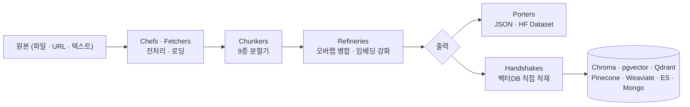
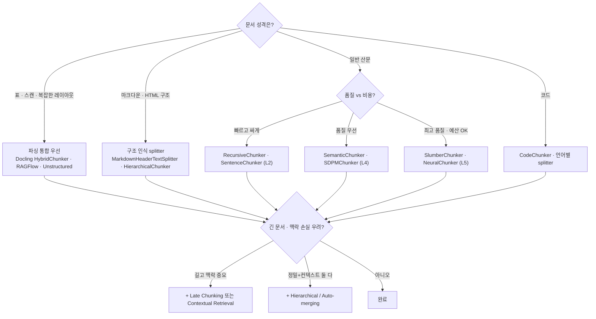

# 청킹(Chunking) 특화 오픈소스 가이드 — Bedrock KB 전략 ↔ OSS 매핑

> **목적**: Amazon Bedrock Knowledge Bases가 제공하는 청킹 전략(fixed · semantic · hierarchical · custom · advanced parsing)과 *그 이상* 을, 직접 쓸 수 있는 오픈소스로 매핑·정리
> **핵심 정의**: 청킹 = 검색·임베딩 단위로 문서를 쪼개는 단계. **RAG 품질의 첫 병목**이며, 임베딩/재랭킹 튜닝보다 청킹 개선이 더 큰 정확도 향상을 주는 경우가 많다
> **한 줄 요약**: 전용 라이브러리 **Chonkie**(9종 청커 + 파이프라인)가 가장 포괄적이고, 프레임워크 내장(LangChain·LlamaIndex) + 파싱통합(Docling·Unstructured·RAGFlow) + 고급기법(Late Chunking·Contextual Retrieval)으로 보완한다

---

## 1. 청킹 전략의 분류 (정교함의 스펙트럼)

청킹은 보통 "정교함의 5단계"로 분류한다(Greg Kamradt 분류 + 최신 기법 추가).

| 단계 | 전략 | 방식 | 비용 |
|------|------|------|------|
| **L1** | 고정 크기(Fixed) | N 문자/토큰 + 오버랩으로 기계적 분할 | 매우 낮음 |
| **L2** | 재귀(Recursive) | 문단→문장→단어 순으로 경계 보존하며 분할 | 낮음 |
| **L3** | 문서 구조(Document-aware) | 마크다운 헤더·HTML·코드 구조·표를 인식해 분할 | 낮음~중 |
| **L4** | 시맨틱(Semantic) | 문장 임베딩 코사인 거리로 의미 전환점에서 분할 | 중(임베딩 호출) |
| **L5** | 에이전트/신경망(Agentic·Neural) | LLM 또는 학습된 모델이 경계를 판단 | 높음(LLM 호출) |
| **+** | 임베딩 강화 | **Late Chunking**(먼저 임베딩 후 분할), **Contextual Retrieval**(청크에 맥락 주입) | 중~높음 |
| **+** | 계층(Hierarchical) | 부모-자식(parent-child) 청크로 검색은 작게, 컨텍스트는 크게 | 중 |

---

## 2. Bedrock KB 청킹 ↔ 오픈소스 매핑

Bedrock KB는 `fixed-size`, `semantic`, `hierarchical`, `none`, 그리고 Lambda 기반 `custom`(+ FM 기반 advanced parsing)을 제공한다. **같은 것을 OSS로** 하려면:

| Bedrock KB 옵션 | 동작 | 대응 오픈소스 |
|-----------------|------|----------------|
| **Fixed-size** (토큰 수 + 오버랩 %) | 고정 토큰 + 겹침 | Chonkie `TokenChunker` · LangChain `TokenTextSplitter`/`CharacterTextSplitter` · LlamaIndex `TokenTextSplitter` |
| **Default** (~300토큰, 문장 경계) | 문장 인식 고정 | Chonkie `SentenceChunker`/`RecursiveChunker` · LangChain `RecursiveCharacterTextSplitter` · LlamaIndex `SentenceSplitter` |
| **Semantic** (FM로 의미 분할, 추가비용) | 임베딩 거리 기반 | Chonkie `SemanticChunker`/`SDPMChunker` · LangChain `SemanticChunker`(experimental) · LlamaIndex `SemanticSplitterNodeParser` |
| **Hierarchical** (부모/자식 + 검색 시 부모로 치환) | parent-child | LlamaIndex `HierarchicalNodeParser` + `AutoMergingRetriever` · LangChain `ParentDocumentRetriever` · Docling `HierarchicalChunker` |
| **None** (파일=1청크) | 무분할 | RAGFlow `one` 템플릿 · 직접 구현 |
| **Custom** (Lambda 청킹 로직) | 임의 코드 | Chonkie/LangChain/LlamaIndex 컴포넌트를 그대로 끼움 |
| **Advanced parsing** (FM로 표·이미지 파싱) | 파싱 강화 | Docling · Unstructured · RAGFlow DeepDoc · LlamaParse |

> 핵심: Bedrock의 "custom chunking(Lambda)"은 결국 **LangChain/LlamaIndex/Chonkie 같은 OSS 컴포넌트를 끼워 넣는 자리**다. 즉 OSS만으로 Bedrock의 모든 전략 + 그 이상을 self-host로 재현할 수 있다.

---

## 3. 청킹 "전용" 오픈소스 — Chonkie (가장 포괄적)

`chonkie-inc/chonkie` — *"the no-nonsense chunking library"*. 청킹만을 위한 경량(휠 505KB) 라이브러리이자, 인제스천 파이프라인까지 포함한다. 56개 언어, SIMD 가속.

### 3.1 청커 9종

| 청커 | 설명 | 대응 단계 |
|------|------|-----------|
| `TokenChunker` | 고정 토큰 크기 분할 | L1 |
| `FastChunker` | SIMD 바이트 기반, 100+ GB/s | L1 |
| `SentenceChunker` | 문장 경계 분할 | L2 |
| `RecursiveChunker` | 커스텀 규칙으로 계층적 재귀 분할 | L2~L3 |
| `SemanticChunker` | 임베딩 유사도로 의미 묶음 | L4 |
| `SDPMChunker` | **Semantic Double-Pass Merge** — 시맨틱 2패스 병합으로 흩어진 관련 청크 재결합 | L4+ |
| `LateChunker` | **먼저 전체 임베딩 후 분할**(맥락 보존된 청크 임베딩) | 임베딩 강화 |
| `NeuralChunker` | 학습된 신경망 모델로 경계 탐지 | L5 |
| `SlumberChunker` | **LLM이 의미 경계 판단**(agentic chunking) | L5 |
| `CodeChunker` | 코드를 구조 단위(함수·클래스)로 분할 | L3(코드) |

### 3.2 파이프라인 컴포넌트

Chonkie는 청킹 전후 단계까지 모듈화했다:

- **Chefs/Fetchers**: 텍스트 전처리·데이터 로딩
- **Refineries**: 오버랩 병합, 임베딩 추가(=청크 풍부화)
- **Porters**: JSON·HuggingFace Datasets로 내보내기
- **Handshakes**: 8+ 벡터DB(Chroma, pgvector, Qdrant, Pinecone, Weaviate, Elasticsearch, MongoDB, Turbopuffer)로 직접 적재

→ **"청킹 한 가지만 깔끔하게" 원하면 Chonkie가 1순위.**

---

## 4. 프레임워크 내장 splitter (생태계가 필요할 때)

| 프레임워크 | 주요 splitter | 특징 |
|------------|---------------|------|
| **LangChain** | `RecursiveCharacterTextSplitter`(기본 권장), `TokenTextSplitter`, `MarkdownHeaderTextSplitter`, `HTMLHeaderTextSplitter`, 언어별 `CodeTextSplitter`, `SemanticChunker`(experimental) | 문서 종류별 splitter 풍부, 통합 많음 |
| **LlamaIndex** | `SentenceSplitter`, `TokenTextSplitter`, `SemanticSplitterNodeParser`, `HierarchicalNodeParser`(+`AutoMergingRetriever`), `MarkdownNodeParser`, `SentenceWindowNodeParser` | **계층/parent-child·센텐스 윈도우** 등 검색기와 결합된 노드 파서가 강점 |

> 두 프레임워크는 `LangchainNodeParser`로 상호 연결 가능 — LangChain splitter를 LlamaIndex 노드로 그대로 사용.

---

## 5. 파싱 + 청킹 통합 (복잡한 문서일 때)

청킹은 **파싱 품질에 종속**된다. 표·레이아웃이 깨진 채로 자르면 의미가 없으므로, 파싱과 청킹을 함께 보는 도구:

| 도구 | 청킹 방식 |
|------|-----------|
| **Docling** (IBM) | `HierarchicalChunker`(문서 구조 보존) + **`HybridChunker`**(구조 청킹 위에 토큰 인식 정제, 초과 시 `semchunk`로 시맨틱 분할, 인접 소형 청크 병합). PDF/DOCX/PPTX 레이아웃·표·읽기순서 보존 |
| **Unstructured** | `partition_*`로 요소 추출 후 `chunk_by_title`/`basic` 청킹. 다양한 포맷 커넥터 |
| **RAGFlow** (DeepDoc) | 자체 비전 파싱 + **문서 종류별 템플릿 청킹**(naive/paper/laws/table/qa…). 본 레포 [분석](../ragflow/analysis.md) |
| **LlamaParse** | LLM 기반 파싱(표/이미지) — 상용 무료티어 |
| **semchunk** | 빠른 시맨틱 청킹 경량 라이브러리(Docling이 내부 사용) |

---

## 6. 고급 기법 — Bedrock "그 이상"

검색 정확도를 크게 끌어올리는, Bedrock 기본엔 없는(또는 custom으로만 가능한) 기법들:

| 기법 | 핵심 | 효과 | OSS |
|------|------|------|-----|
| **Late Chunking** (Jina) | 청크별로 따로 임베딩하지 않고 **전체 문서를 먼저 임베딩한 뒤** 토큰 임베딩을 청크로 묶음 → 청크가 문서 맥락을 보존 | 문서가 길수록(≈8k 토큰) BEIR 이득 ↑, 추가 학습 불필요 | Chonkie `LateChunker`, Jina 임베딩 |
| **Contextual Retrieval** (Anthropic) | 각 청크 앞에 **LLM이 생성한 맥락 요약**을 붙여서 임베딩 | 재랭킹 결합 시 top-20 검색 실패 최대 67%↓ | Anthropic 쿡북, LangChain/LlamaIndex 구현 |
| **Hierarchical / Auto-merging** | 작은 자식으로 검색, 다수 적중 시 부모로 치환 | 정밀 검색 + 풍부한 컨텍스트 | LlamaIndex `AutoMergingRetriever`, Bedrock hierarchical |
| **Agentic / Neural chunking** | LLM·신경망이 경계 판단 | 의미 경계 최상 품질, 비용 높음 | Chonkie `SlumberChunker`/`NeuralChunker` |

> 트레이드오프: 연구에 따르면 **Contextual Retrieval은 의미 일관성↑·비용↑**, **Late Chunking은 효율↑·완전성은 다소 희생**. 문서 길이·예산으로 선택.

---

## 7. 청킹 전략 선택 가이드

**실무 추천 경로**:
1. **시작점**: LangChain `RecursiveCharacterTextSplitter` 또는 Chonkie `RecursiveChunker`로 베이스라인. (대부분 여기서 충분)
2. **품질 부족 시**: `SemanticChunker`로 승급 → 그래도 부족하면 **Contextual Retrieval** 추가.
3. **복잡한 문서**: Docling `HybridChunker` 또는 RAGFlow 템플릿으로 파싱부터 교체.
4. **청킹만 깔끔히 분리하고 싶으면**: **Chonkie** 단독 사용(파이프라인+벡터DB 적재까지).
5. **반드시 평가**: 청킹은 "정답"이 없으므로 데이터로 검증 — **Chroma chunking evaluation**, 논문 *"Reconstructing Context"* (arXiv 2504.19754) 등 활용.

---

## 8. 한눈 요약 표

| 분류 | 대표 OSS | 언제 |
|------|----------|------|
| **청킹 전용 라이브러리** | **Chonkie** (9종 청커 + 파이프라인) | 청킹을 독립 모듈로 깔끔히 |
| 프레임워크 내장 | LangChain splitters, LlamaIndex node parsers | 이미 그 생태계를 쓰는 경우 |
| 파싱+청킹 통합 | Docling, Unstructured, RAGFlow, LlamaParse | 표·레이아웃 복잡 문서 |
| 경량 시맨틱 | semchunk, semantic-text-splitter(Rust) | 빠른 시맨틱 분할 |
| 고급 기법 | Late Chunking(Jina), Contextual Retrieval(Anthropic) | 긴 문서·맥락 보존 |
| 평가 | Chroma chunking_evaluation | 전략 비교·검증 |

---

## 9. 참고

- **Chonkie**: https://github.com/chonkie-inc/chonkie
- **Bedrock KB 청킹 문서**: https://docs.aws.amazon.com/bedrock/latest/userguide/kb-chunking.html
- **Docling 청킹**: https://docling-project.github.io/docling/concepts/chunking/
- **Late Chunking** (Jina, arXiv 2409.04701) · **Contextual Retrieval** (Anthropic)
- **고급 청킹 평가** (arXiv 2504.19754)
- 본 레포 인접: [RAGFlow 분석](../ragflow/analysis.md)(템플릿 청킹) · [LightRAG](../lightrag/analysis.md) · [RAG-Anything](../rag-anything/analysis.md)
