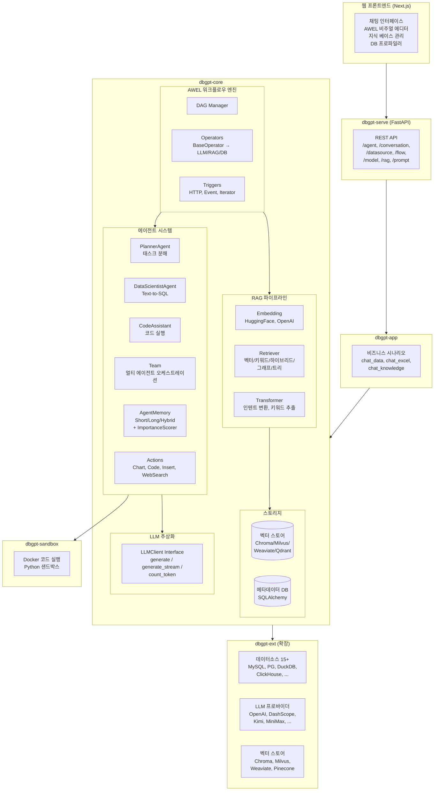
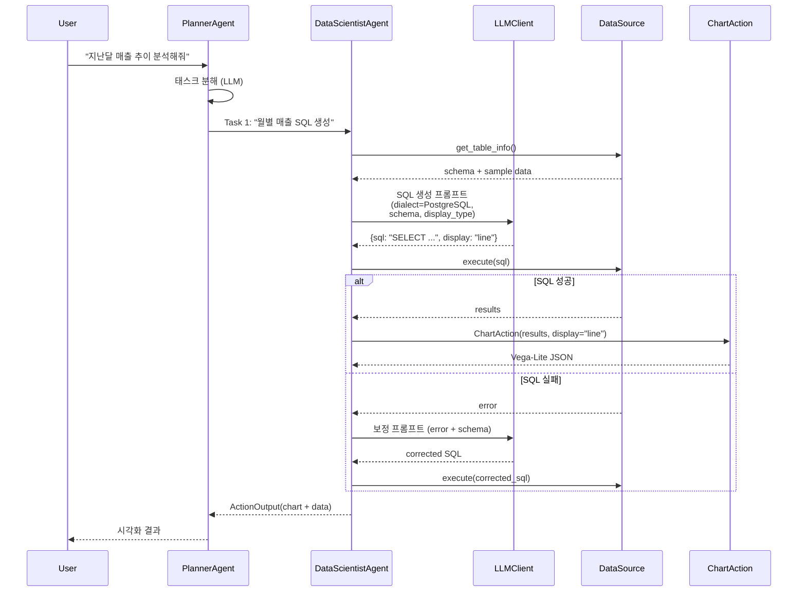
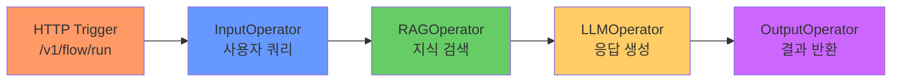

# DB-GPT 심층 분석 — AI 데이터 애플리케이션 플랫폼

> **대상**: https://github.com/eosphoros-ai/DB-GPT
> **핵심 정의**: Text-to-SQL 을 포함하되 **범용 AI 데이터 플랫폼**으로 확장된 프레임워크 — AWEL(워크플로우) + 멀티 에이전트 + RAG + 15+ 데이터소스
> **라이선스**: MIT
> **주요 언어**: Python (monorepo, 6 패키지)
> **버전**: 0.8.0 (활발한 개발 중)

---

## 1. 프로젝트 개요

### 1.1 해결하려는 문제

"데이터베이스와 자연어로 대화하기" 를 넘어, **데이터 기반 AI 애플리케이션을 구축하기 위한 풀 스택 프레임워크**를 제공한다. Text-to-SQL 은 DB-GPT 의 기능 *중 하나*일 뿐이고, 멀티 에이전트 오케스트레이션, RAG 파이프라인, 시각화, 코드 실행, 스킬 시스템까지 포괄한다.

### 1.2 WrenAI 와의 포지셔닝 차이

| 축 | WrenAI | DB-GPT |
|---|---|---|
| **범위** | Text-to-SQL 전문 (시맨틱 레이어) | 범용 AI 데이터 플랫폼 |
| **핵심 차별점** | MDL 시맨틱 레이어 | AWEL 워크플로우 + 멀티 에이전트 |
| **접근법** | "SQL 정확도를 극대화" | "데이터 기반 작업을 자율화" |
| **복잡도** | 단일 서비스 (AI Service) | 6-패키지 monorepo |
| **배포** | Docker Compose (4 서비스) | 단독 / Docker / 분산 |

### 1.3 시스템 구성 (6-패키지 monorepo)

```
packages/
├── dbgpt-core        — 핵심 추상화: 에이전트, AWEL, RAG, 모델, 스토리지, 데이터소스
├── dbgpt-app         — 애플리케이션 레이어: 비즈니스 시나리오, 챗 플로우
├── dbgpt-ext         — 확장: 데이터소스 커넥터, LLM 프로바이더, 벡터 스토어
├── dbgpt-serve       — API 서비스 레이어: REST/GraphQL 엔드포인트
├── dbgpt-client      — Python SDK (외부 통합용)
├── dbgpt-sandbox     — 코드 실행 샌드박스 (Docker 기반)
└── dbgpt-accelerator — GPU 가속 (Flash Attention 등)
```

---

## 2. 핵심 특징 및 차별점

### 2.1 AWEL (Agentic Workflow Expression Language)

DB-GPT 의 가장 독특한 아키텍처. **DAG 기반 워크플로우 시스템**으로, 복잡한 AI 파이프라인을 선언적으로 조합할 수 있다.

```python
# AWEL 워크플로우 예시 — 연산자를 파이프로 연결
input_op >> transform_op >> llm_op >> output_op
```

핵심 구성요소:
- **Operator**: 타입 안전한 비동기 태스크 (`BaseOperator[In, Out]`), 스트리밍 지원
- **DAG**: 노드 의존성 관리, 컨텍스트 전파 (`DependencyMixin` + `<<` `>>` 구문)
- **Trigger**: HTTP, 이벤트, 반복자 등 실행 시작점
- **Resource**: 임베딩 모델, 검색기, 데이터소스 등을 DAG 컴파일 시 주입
- **UI 직렬화**: JSON → DB 저장 → 비주얼 에디터에서 편집 가능

**WrenAI 의 Hamilton DAG 와 비교**:
- Hamilton: 순수 함수 → 데이터플로우 (가볍고 심플)
- AWEL: 연산자 + 리소스 + 트리거 + UI 직렬화 (무거우나 확장성 높음)
- **AWEL 은 "로우코드 AI 워크플로우 빌더" 를 지향**하고, Hamilton 은 "가벼운 비동기 DAG" 를 지향

### 2.2 멀티 에이전트 시스템

`packages/dbgpt-core/src/dbgpt/agent/`

```
agent/
├── core/
│   ├── agent.py           — Agent 인터페이스 (send, receive, think, act, review)
│   ├── base_agent.py      — ConversableAgent (1326 lines) — 핵심 구현
│   ├── base_team.py       — Team 오케스트레이션
│   ├── action/            — Action 추상화 + 구현 (Chart, Code, Insert, WebSearch)
│   ├── memory/            — 에이전트 메모리 (단기/장기/하이브리드)
│   ├── plan/              — PlannerAgent (LLM 기반 태스크 분해)
│   └── schema.py          — 에이전트 스키마 정의
├── expand/
│   ├── data_scientist_agent.py  — Text-to-SQL + 차트 (핵심 에이전트)
│   ├── code_assistant_agent.py  — 코드 실행
│   ├── summary_assistant_agent.py — 요약
│   └── ...
├── resource/              — 에이전트가 사용하는 리소스 (DB, 지식, 도구)
└── skill/                 — 스킬 로더 (Python 파일/GitHub 임포트)
```

**Agent 인터페이스**:

```python
class Agent(ABC):
    async def send(message, recipient, reviewer, request_reply, is_recovery)
    async def receive(message, sender, reviewer, request_reply)
    async def generate_reply(received_message, sender, reviewer) -> AgentMessage
    async def thinking(messages, prompt) -> str  # LLM 추론
    async def act(message, sender, reviewer) -> ActionOutput  # 도구/코드 실행
    async def review(message, sender) -> Tuple[bool, message]  # 다른 에이전트의 평가
```

**ConversableAgent** (`base_agent.py`, 1326 lines):
- Agent + Role 확장
- 액션(실행 가능한 단계) 관리
- LLMClient 통합
- 메모리 관리 (단기/장기/하이브리드)
- 리소스 바인딩
- 재시도 로직 (`max_retry_count`, `timeout`)

**Team 오케스트레이션**:
- 에이전트 그룹 + 메시지 패싱
- 에이전트 선택 로직 (라운드 로빈, LLM 선택)
- `max_round` 종료 조건

### 2.3 PlannerAgent — 자율 태스크 분해

```python
# agent/core/plan/planner_agent.py
class PlannerAgent:
    """사용자 목표 + 사용 가능한 에이전트 → LLM 기반 태스크 분해"""
    # 목표를 하위 태스크로 분할하고 의존성을 설정
    # 제약: 명확한 목표, 의존성 최소화, 리소스 인지
```

WrenAI 에는 없는 **자율 계획 수립** 기능. 사용자가 "지난달 매출 추이를 분석하고 보고서 작성해줘" 라고 하면, PlannerAgent 가:
1. "SQL 로 매출 데이터 조회" (DataScientistAgent)
2. "차트 생성" (ChartAction)
3. "보고서 작성" (SummaryAssistantAgent)
으로 분해하고 순차/병렬 실행한다.

### 2.4 Action 시스템

```python
class Action(ABC, Generic[T]):
    async def run(self, tool_input: str, ...) -> ActionOutput

class ActionOutput:
    content: str
    is_exe_success: bool
    resource_type/value: str  # 시각화용
    next_speakers: Optional[List[str]]  # 다음 에이전트 라우팅
```

내장 Action:
- **ChartAction**: SQL → Vega/ECharts 시각화
- **CodeAction**: Python 코드 실행 (샌드박스)
- **InsertAction**: 데이터 삽입
- **WebSearchAction**: 웹 검색

### 2.5 3-Tier 에이전트 메모리

`agent/core/memory/`:
- **Short-term**: 최근 메시지 (컨텍스트 윈도우)
- **Long-term**: 벡터 인덱싱 + 중요도 점수
- **Hybrid**: 단기 + 장기 결합 검색
- **ImportanceScorer**: LLM 기반 메모리 중요도 평가
- **InsightExtractor**: LLM 기반 고수준 인사이트 추출

GoClaw 의 L0/L1/L2 메모리와 유사하지만, **LLM 기반 중요도 평가(ImportanceScorer)** 가 추가된 점이 차별화.

### 2.6 RAG 파이프라인

`packages/dbgpt-core/src/dbgpt/rag/`

```
rag/
├── embedding/     — HuggingFace, OpenAI 임베딩
├── retriever/     — 검색기 (임베딩, 키워드, 하이브리드, 그래프, 트리)
├── transformer/   — 인텐트 변환, 키워드 추출
├── operators/     — AWEL RAG 연산자 (청크, 재랭크, 재작성)
├── chunk_manager  — 문서 분할 관리
└── knowledge/     — 지식 베이스 관리
```

검색 전략:
- `EMBEDDING`: 벡터 유사도
- `KEYWORD`: BM25/키워드
- `HYBRID`: 벡터 + 키워드 결합
- `GRAPH`: 지식 그래프 탐색
- `TREE`: 트리 구조 탐색
- `SEMANTIC`: 시맨틱 검색

**WrenAI 와 비교**: WrenAI 는 Qdrant 기반 스키마 검색만. DB-GPT 는 **범용 RAG 파이프라인**으로, 문서/코드/테이블/그래프 등 모든 종류의 지식을 검색한다.

### 2.7 15+ 데이터소스 커넥터

`packages/dbgpt-ext/src/dbgpt_ext/datasource/`

RDBMS: MySQL, PostgreSQL, SQLite, DuckDB, Oracle, MSSQL, ClickHouse, Hive, Vertica, StarRocks, Doris, OceanBase, TDEngine
NoSQL: Redis, Neo4j
파일: CSV, Excel

```python
class BaseConnector:
    get_table_names() -> List[str]
    get_table_info(table_names) -> str  # DDL + 메타데이터
    get_index_info() -> str
    get_database_names() -> List[str]
```

### 2.8 스토리지 추상화

벡터 스토어: Chromadb, Milvus, Weaviate, Pinecone, Qdrant (dbgpt-ext)
메타데이터 DB: SQLAlchemy 기반 (모든 SQL DB)
캐시: TTL 기반
그래프: 지식 그래프 스토어
풀텍스트: Elasticsearch 스타일

---

## 3. 아키텍처 분석

### 3.1 전체 시스템 구조



### 3.2 Text-to-SQL 흐름 (DataScientistAgent)



### 3.3 AWEL 워크플로우 실행



---

## 4. 기술 스택

| 영역 | 기술 |
|------|------|
| 코어 프레임워크 | 자체 (AWEL, Agent, Component DI) |
| LLM 통합 | LLMClient 추상화 + 프로바이더별 구현 (OpenAI SDK, DashScope 등) |
| RAG | 자체 Retriever/Embedding/Chunker + 벡터 스토어 통합 |
| 벡터 스토어 | Chromadb, Milvus, Weaviate, Pinecone, Qdrant (선택) |
| 데이터소스 | SQLAlchemy 기반 15+ DB 커넥터 |
| API | FastAPI + Uvicorn |
| 프론트엔드 | Next.js + Ant Design |
| 코드 실행 | Docker 기반 샌드박스 |
| GPU 가속 | Flash Attention (선택, dbgpt-accelerator) |
| Observability | Langfuse 지원 (선택) |

---

## 5. 핵심 코드 분석

### 5.1 Component DI 시스템

```python
# component.py — Spring-like DI container
class SystemApp:
    """서비스 레지스트리 + 라이프사이클 관리"""
    # on_init → after_init → before_start → after_start → before_stop

class BaseComponent:
    """20+ 관리 컴포넌트 타입"""
    def init_app(self, system_app: SystemApp):
        """자기 자신을 시스템에 등록"""
```

### 5.2 LLMClient 추상화

```python
# core/interface/llm.py (1225 lines)
class LLMClient(ABC):
    async def generate(self, request: ModelRequest) -> ModelOutput:
        """동기 생성"""
    async def generate_stream(self, request: ModelRequest) -> AsyncIterator[ModelOutput]:
        """스트리밍 생성"""
    async def models(self) -> List[ModelMetadata]:
        """사용 가능한 모델 목록"""
    async def count_token(self, model: str, prompt: str) -> int:
        """토큰 카운팅"""
```

- 벤더 무관: OpenAI, Kimi, DashScope, 로컬 vLLM 전환 가능
- 메트릭 수집: 토큰 수, 지연, GPU 정보 (ModelInferenceMetrics)
- 캐싱: 모델 메타데이터 TTL 캐시 (60초)
- 메시지 변환: API 형식별 플러거블 컨버터

### 5.3 AWEL Operator 패턴

```python
# core/awel/operators/base.py
class BaseOperator(Generic[In, Out]):
    """타입 안전한 비동기 연산자"""
    async def __call__(self, input: In) -> Out: ...

# 연산자 연결
input_op >> transform_op >> llm_op >> output_op
# 내부적으로 DAG 의존성 등록
```

### 5.4 DataScientistAgent — Text-to-SQL

```python
# agent/expand/data_scientist_agent.py
class DataScientistAgent(ConversableAgent):
    role = "DataScientist"
    # SQL 분석 + 차트 생성 전문 에이전트

    # 프롬프트에 동적으로 dialect 주입
    reply_message.context = {
        "display_type": self.actions[0].render_prompt(),
        "dialect": self.database.dialect  # MySQL, PostgreSQL 등
    }
```

- Role: SQL 분석 + 차트 생성
- 제약: 필드 검증, 다중 테이블 조인 인지
- Dialect-aware 템플릿 (MySQL, PostgreSQL 등)
- ChartAction 통합
- `correctness_check` 구현 (SQL 실행 성공 검증)

### 5.5 에이전트 메모리 — 중요도 기반 관리

```python
# agent/core/memory/
class AgentMemory:
    short_term: ShortTermMemory  # 최근 메시지
    long_term: LongTermMemory    # 벡터 인덱싱 + 중요도 점수
    hybrid: HybridMemory         # 결합 검색

class LLMImportanceScorer:
    """각 메모리에 LLM 기반 중요도 점수 부여"""
    # 오래되고 중요하지 않은 메모리 자동 폐기

class InsightExtractor:
    """메모리에서 고수준 인사이트 추출"""
    # 에이전트가 대화 이력에서 학습
```

---

## 6. 확장성 및 플러그인

| 확장 축 | 매커니즘 |
|---------|----------|
| **LLM Provider** | `LLMClient` 인터페이스 구현 (dbgpt-ext) |
| **데이터소스** | `BaseConnector` 인터페이스 구현 |
| **벡터 스토어** | 스토리지 추상화 레이어 |
| **에이전트** | `ConversableAgent` 상속 + 커스텀 Action |
| **워크플로우** | AWEL Operator 추가 + UI 직렬화 |
| **스킬** | Python 파일/GitHub 임포트 |
| **비즈니스 시나리오** | Scene 패턴 (dbgpt-app) |

### 의존성 격리

```toml
# pyproject.toml
[optional-dependencies]
storage_milvus = ["pymilvus"]
datasource_mysql = ["mysqlclient"]
datasource_clickhouse = ["clickhouse-connect"]
```

필요한 백엔드만 설치 → 최소 의존성 유지.

---

## 7. 성능 특성

| 메트릭 | 내용 |
|--------|------|
| **토큰 캐싱** | LLMClient 메타데이터 TTL 60초 |
| **배치 임베딩** | 벡터 일괄 생성 지원 |
| **스트리밍** | AWEL, LLM, RAG 전체에 스트리밍 지원 |
| **비동기** | 모든 I/O: async/await |
| **분산 준비** | DAGVar + ContextVar 분산 전파, JobManager 비동기 태스크 |
| **리소스 관리** | DAG 컴파일 시 의존성 주입 → 런타임 초기화 실패 방지 |

---

## 8. 배포 및 운영

- **단독 실행**: `python -m dbgpt_app` (SQLite + Chromadb)
- **Docker Compose**: `docker-compose.yml` (MySQL + Milvus + 웹)
- **분산 배포**: 직렬화 가능한 Operator 로 원격 실행 가능
- **설정**: YAML + 환경변수 + `.env`

---

## 9. 경쟁/비교 분석

### 9.1 vs WrenAI (Text-to-SQL 전문)

| 축 | DB-GPT | WrenAI |
|---|---|---|
| **범위** | 범용 AI 데이터 플랫폼 | SQL 생성 전문 |
| **시맨틱 레이어** | ❌ (스키마 직접 사용) | ✅ MDL |
| **SQL 정확도 접근** | Dialect-aware 프롬프트 + 에이전트 재시도 | MDL 기반 의미 고정 + dry-run + 자동 보정 |
| **에이전트** | ✅ 멀티 에이전트 + 계획 | ❌ |
| **워크플로우** | ✅ AWEL (비주얼 에디터) | 고정 파이프라인 |
| **Action** | Chart, Code, Insert, WebSearch | SQL 단독 |
| **메모리** | Short/Long/Hybrid + 중요도 | 세션 이력만 |
| **RAG** | 범용 (문서, 코드, 테이블, 그래프) | 스키마 검색 |
| **데이터소스** | 15+ DB + 파일 | SQL DB |
| **벡터 스토어** | 5개 (Chroma, Milvus, Weaviate, Pinecone, Qdrant) | Qdrant 단독 |
| **프론트엔드** | AWEL 비주얼 에디터 + 채팅 | SQL IDE + 차트 |
| **코드 실행** | ✅ Docker 샌드박스 | ❌ |
| **복잡도** | 높음 (6 패키지) | 낮음 (단일 서비스) |

**핵심 차이**: WrenAI 는 "SQL 하나를 정확하게" 에 집중하고 MDL 이 그 무기. DB-GPT 는 "데이터 관련 모든 작업을 에이전트가 자율적으로" 를 지향하고 AWEL + Agent 가 그 무기. **Trade-off: SQL 정확도 vs 범용성**.

### 9.2 vs LangChain / LlamaIndex

| 축 | DB-GPT | LangChain | LlamaIndex |
|---|---|---|---|
| **포커스** | 데이터 애플리케이션 | 범용 LLM 파이프라인 | RAG 특화 |
| **에이전트** | 내장 (Plan/Act/Memory) | 도구 기반 | 도구 기반 |
| **워크플로우** | AWEL (내장 DAG) | LangGraph (별도) | 없음 |
| **데이터소스** | 15+ 내장 커넥터 | 커뮤니티 커넥터 | 커뮤니티 커넥터 |
| **배포** | 단독 실행 가능 | 프레임워크 (앱 직접 구축) | 프레임워크 |
| **UI** | 내장 (Next.js) | 없음 | 없음 |
| **DI 시스템** | ✅ (SystemApp) | ❌ | ❌ |

### 9.3 vs GoClaw

| 축 | DB-GPT | GoClaw |
|---|---|---|
| **언어** | Python | Go |
| **포커스** | 데이터 분석 | 범용 챗봇/비서 |
| **에이전트 루프** | Agent + Action + Memory | 8-stage pipeline |
| **워크플로우** | AWEL DAG | (없음 — pipeline 만) |
| **메시징 채널** | ❌ | 7개 내장 |
| **병렬 도구** | async/await | 2-Phase (goroutine I/O + 순차 mutation) |
| **메모리** | 중요도 점수 기반 | L0/L1/L2 tier |
| **스킬** | Python 파일/GitHub | 5-tier 디렉토리 + BM25 |

---

## 10. 종합 평가

### 강점

1. **AWEL 이 가장 큰 차별점**: "로우코드 AI 워크플로우" 를 지원하는 오픈소스 프레임워크는 드물다. Operator + Resource + Trigger + UI 직렬화의 조합은 **비즈니스 사용자도 파이프라인을 만들 수 있게** 한다.

2. **Component DI 시스템**: Spring-like 라이프사이클 관리가 복잡한 의존성(LLM, DB, 벡터 스토어, 에이전트)을 깔끔하게 조직화. 패키지 간 결합도가 낮아 선택적 배포 가능.

3. **에이전트 메모리의 ImportanceScorer**: LLM 이 메모리의 중요도를 평가해 자동 폐기하는 것은 GoClaw 의 L0/L1/L2 보다 더 세밀하다. 토큰 윈도우 한계를 우아하게 해결.

4. **AWEL + Agent 이중 접근**: 사용자가 "워크플로우를 직접 설계" (AWEL) 하거나 "에이전트에게 위임" (PlannerAgent) 할 수 있다. **rigid pipeline 과 fully-agentic 의 중간지대**를 효과적으로 제공.

5. **15+ 데이터소스 내장**: 커뮤니티 커넥터에 의존하는 LangChain 과 달리 1급 지원.

6. **Optional dependency 격리**: `[optional-dependencies]` 패턴으로 필요한 백엔드만 설치. 최소 설치와 풀 설치의 차이가 크다.

### 약점/리스크

1. **MDL/시맨틱 레이어 없음**: Text-to-SQL 에서 WrenAI 의 MDL 이 제공하는 "비즈니스 용어 ↔ SQL 매핑" 이 없다. 스키마 직접 사용은 LLM 환각에 더 취약하다.

2. **복잡도**: 6 패키지, 수십 개의 추상화 레이어. 진입 장벽이 높고, 디버깅이 어려울 수 있다.

3. **AWEL 의 성숙도**: 비주얼 에디터가 있지만, DAG 디버깅/모니터링 도구가 Airflow 수준으로 성숙하지는 않다.

4. **SQL 검증**: WrenAI 의 dry-run + 자동 보정 루프(최대 3회) 와 달리, DB-GPT 는 에이전트의 `correctness_check` 에 의존하는데, 이것이 체계적이지 않을 수 있다.

5. **중국 중심 생태계**: DashScope, MiniMax, Kimi 등 중국 LLM 에 강하지만, 서양 엔터프라이즈(AWS Bedrock, Azure AI) 통합은 상대적으로 약할 수 있다.

### 적합 사례

- AI 기반 데이터 분석 플랫폼 구축
- 멀티 에이전트로 복잡한 데이터 워크플로우 자동화
- 로우코드 AI 파이프라인 빌더가 필요한 조직
- 다양한 데이터소스를 통합하는 BI 시스템

### 부적합 사례

- "SQL 정확도" 가 최우선인 환경 (WrenAI 가 더 적합)
- 가벼운 Text-to-SQL 만 필요한 경우 (너무 무거움)
- Go/Rust 생태계를 선호하는 팀
- 메시징 채널 통합이 필요한 경우 (GoClaw 가 적합)

---

## 11. 엔지니어 관점 인사이트

### 11.1 "AWEL + Agent = rigid pipeline 과 fully-agentic 의 중간지대"

이것이 DB-GPT 의 가장 현명한 설계 결정이다. 사용자가:
- **AWEL**: 워크플로우를 직접 설계 → 예측 가능하고 제어 가능
- **Agent**: "이 목표를 달성해" 하면 알아서 → 자율적이지만 불예측

같은 시스템에서 두 접근을 모두 지원함으로써, "agent 가 실패하면 workflow 로 fallback" 하는 hybrid 전략이 가능하다.

### 11.2 "ImportanceScorer 는 compaction 보다 정교한 메모리 관리"

GoClaw 의 L1 flush, opencode/openharness 의 compaction 은 모두 "오래된 것을 요약/폐기" 하는 접근이다. DB-GPT 의 ImportanceScorer 는 **"오래되었지만 중요한 것은 보존"** 할 수 있다. 예를 들어 "3주 전 사용자가 '매출 = 순매출 + 할인 반영' 이라고 정의한 것" 은 시간은 오래됐지만 중요도가 높아 보존된다.

### 11.3 "시맨틱 레이어(MDL) 없는 Text-to-SQL 의 한계"

DB-GPT 가 WrenAI 대비 Text-to-SQL 정확도에서 불리한 이유는 MDL 이 없기 때문이다. Dialect-aware 프롬프트와 에이전트 재시도로 보완하지만, "매출의 정의가 뭔가?" 라는 근본 질문에는 스키마만으로 답할 수 없다. **DB-GPT 에 MDL 같은 시맨틱 레이어를 붙이면 WrenAI 의 장점까지 흡수** 할 수 있을 것이다.

### 11.4 "Component DI + Optional Deps = 프로덕션급 패키지 관리"

DB-GPT 의 `SystemApp` + `[optional-dependencies]` 패턴은 **Python 에서 "필요한 것만 설치" 를 깔끔하게 구현**한 모범 사례. 보통 Python 프로젝트는 `requirements.txt` 에 모든 것을 때려넣지만, DB-GPT 는 `pip install dbgpt-core[storage_milvus,datasource_mysql]` 식으로 선택적 설치가 가능하다.

### 11.5 WrenAI 와 DB-GPT 를 함께 참고할 때

| 필요한 것 | 참고 대상 |
|-----------|-----------|
| SQL 정확도 극대화 | WrenAI (MDL + dry-run + 보정 루프) |
| 멀티 에이전트 + 계획 수립 | DB-GPT (PlannerAgent + Team) |
| 로우코드 워크플로우 | DB-GPT (AWEL) |
| RAG 파이프라인 | DB-GPT (범용 RAG) |
| 에이전트 메모리 | DB-GPT (ImportanceScorer) |
| LLM 프로바이더 추상화 (가벼운) | WrenAI (LiteLLM) |
| LLM 프로바이더 추상화 (무거운) | DB-GPT (LLMClient + 자체 구현) |
