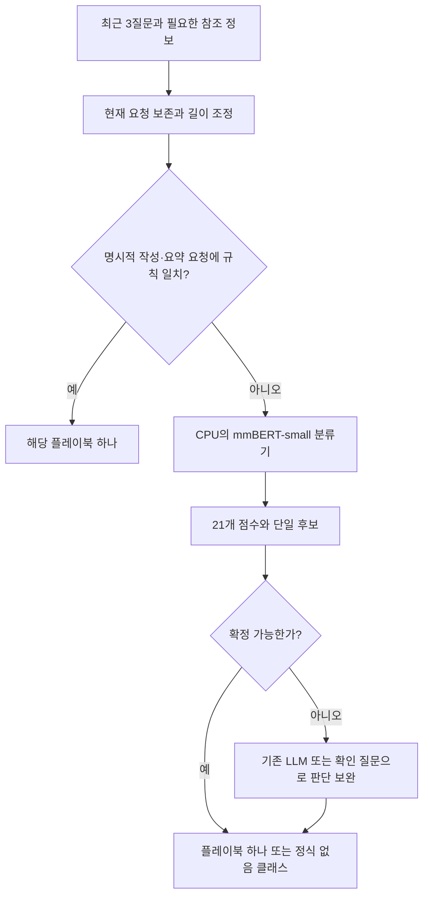

# 금융 플레이북 라우팅 — CPU에서 mmBERT와 Jevlike 선택

작성일: 2026-09-21. 입력은 사용자가 제시한 최근 3질문 묶음, 출력은 이번 턴의 플레이북 하나 또는 `플레이북 없음`이다. 운영 환경은 **CPU 서버 우선**이며 목표 지연시간과 초당 요청 수는 아직 정해지지 않았다.

2026-09-22 추가 조사: [Kev와 Laya 비교](kev-vs-laya.md). Laya-multilingual은 mmBERT-base 기반의 추가 학습 후보이며, 고정 21개 클래스·CPU 조건에서는 mmBERT-small 일반 분류기를 먼저 비교한다는 판단을 유지한다.

코드 분석 기준은 Jevlike `94f5fd1b0b11d52bbdfdf4e0ee6aa96b568f8452`, mmBERT `108ffb376ad65c2512801bb88931933dcd286baf`다. 두 저장소는 `.repos/`에 클론되어 있다. 여기서 제시하는 적합성 판단과 서버 구성은 설계 제안이다. 실제 금융 발화 원문·라벨 파일은 제공되지 않았으며 이 작업의 정확도, CPU 지연시간, 처리량을 측정한 것은 아니다.

## 1. 판단

**이 요구에는 mmBERT-small을 이용한 일반 단일 라벨 분류기를 우선한다.** Jevlike로도 구현할 수 있지만, 고정된 21개 라벨 중 하나를 고르는 작업에서는 가변 후보 scorer의 이점이 크지 않다.

- Jevlike Tiny: 비용이 매우 작은 비교 모델로 사용할 수 있다. 그러나 최근 대화와 현재 요구를 결합하는 한국어 의미 분류의 주력으로 선택하기에는 구조상 우려가 크다.
- Jevlike + mmBERT: 후보 Attention head가 단순 pooling보다 유리한지 비교할 수 있다. 기본 구현은 기반 인코더를 동결한다. 추론에서는 mmBERT 전체가 필요하고 후보 인코딩까지 추가된다.
- mmBERT-small + 분류 head: 문맥을 한 번 인코딩해 21개 점수를 출력한다. 현재 라우팅 계약에 직접 맞으며 인코더까지 파인튜닝할 수 있다.

학습 중 필요한 계산량이 작다는 것과 배포한 모델의 추론이 가볍다는 것은 다르다. Jevlike HF의 동결 인코더는 역전파 비용을 줄이지만 추론의 인코더 계산을 없애지 않는다.

## 2. 클래스와 데이터 수 재계산

사용자 표의 클래스별 건수가 서로 중복되지 않는다는 전제로 합산했다. 사용자 수는 클래스 간 중복될 수 있으므로 합산하지 않았다.

| 항목 | 계산 결과 |
|---|---:|
| 기존 클래스 수 | 24 |
| 전체 발화 합계 | 21,647 |
| 새 요청 합계 | 5,978 |
| 문서 작성·자료 요약을 규칙 경로로 제외 | 267발화, 새 요청 70개 |
| 주식 밖을 제외하고 이미 분류된 21개 클래스 | 20,945발화 |
| 주식 밖 435건을 일 기준으로 재라벨링한 후 분류기 데이터 | 최대 21,380발화 |
| 규칙 경로 제외 후 새 요청 합계 | 5,908 |
| 최종 분류기 클래스 수 | 21개 — 플레이북 없음 포함 |
| 재라벨링 전 유지 클래스 최대·최소 건수 | 보유 대응 2,337 / 실적 일정 298, 약 7.84배 |

이 규모는 사전학습 모델의 파인튜닝을 시작할 근거가 된다. 다만 21,380발화가 서로 독립적인 21,380개 요청은 아니다. 최근 3질문 창은 인접 턴과 문맥이 겹치고 동일 사용자의 반복 표현도 포함될 수 있다. 새 요청 5,908개가 독립 표본 수라는 뜻도 아니다.

21개라는 출력 수는 큰 비용 요인이 아니다. 비용의 대부분은 문맥 인코딩에서 발생한다. 10개 계열은 예측된 클래스의 metadata로 접어 집계하고, 별도 분류 모델을 둘 필요는 없다. 계열을 먼저 고르는 2단계 모델은 현재 요구에서 필수적이지 않으며 상위 단계의 오분류가 하위 선택을 막을 수 있다.

## 3. Jevlike에서 구현 가능한가

### Tiny

최근 질문들을 하나의 `context` 문자열로 묶고, 21개 플레이북을 `options`로 넣고, 정답의 인덱스를 `label`로 사용하면 데이터 인터페이스는 맞는다. 원본 텍스트 scorer는 21개 후보를 처리할 수 있다.

실제로 `TinyScorer(width=64, rank=64, context_tokens=768)`와 한국어 후보 21개를 입력해 출력 shape `[1, 21]`을 확인했다. 이는 **학습하지 않은 모델의 인터페이스 확인**이며 정확도를 확인한 결과가 아니다. 이 설정의 파라미터 수는 78,144개다. 앞서 기본 데모의 41,280개와 다른 이유는 문맥 위치 embedding을 늘렸기 때문이다.

이전에 만든 로컬 웹 데모의 16개 후보 상한은 별도로 작성한 서버·화면의 제한이다. 해당 화면에서 21개를 쓰려면 상한을 바꿔야 한다. 모델 코드의 고정 클래스 제한은 아니다.

### mmBERT를 붙이는 경로

Jevlike의 `--encoder hf --hf-model jhu-clsp/mmBERT-small` 경로를 구성할 수 있다. `AutoModel`, `config.hidden_size`, `last_hidden_state` 인터페이스가 맞는다. 실제 라이브러리·장치 호환성을 포함한 이 조합의 학습·추론은 아직 실행하지 않았다.

원본은 문맥과 후보를 각각 인코딩하고 후보 벡터가 문맥 토큰에 Attention을 적용한다. 동결한 mmBERT 위에서 이 head만 학습한다. 기존 Tiny 체크포인트를 그대로 사용하지 않으며, 금융 라벨 데이터로 새로운 head를 학습해야 한다. [Jevlike HF 구현](https://github.com/vinnylarouge/jevlike/blob/94f5fd1b0b11d52bbdfdf4e0ee6aa96b568f8452/jevlike/model.py#L66-L94).

가변 후보의 장점은 사용자별로 실행 가능한 도구가 바뀌거나 새로운 후보 설명을 매 요청 전달할 때 더 분명하다. 현재처럼 동일한 플레이북 목록을 쓰면 일반 분류기도 모델의 `id2label`에 플레이북 이름을 저장해 결과를 직접 반환할 수 있다. 숫자 인덱스는 모델 내부 표현이며 별도 업무 라벨 체계를 만들 필요는 없다.

## 4. Tiny의 정확도가 우려되는 이유

이 작업은 키워드 하나를 감지하는 문제보다 복잡하다. 다음 예시는 성능 측정이 아닌 필요한 구분을 설명한다.

| 관측해야 할 차이 | 필요한 판단 |
|---|---|
| 과거 질문에 보유 근거가 있고 현재 “왜 떨어졌어? 물타도 돼?” | 현재 받고 싶은 최종 결과와 과거 보유 근거 결합 |
| 이전 질문은 A 종목 보유, 현재 질문은 B 종목 신규 매수 | 보유 사실이 어느 종목에 관한 것인지 구분 |
| “다른 AI가 한 이 설명이 맞아?” / “네 설명이 틀렸잖아” | 주장 검증과 서비스 응답 불만 구분 |
| “PER 10 이하에서 찾아줘” / “괜찮은 회사 찾아줘” | 조건 스크리닝과 후보 찾기 구분 |
| “지금 종목 말고 내 계좌 전체를 봐줘” | 부정과 요청 대상 전환 반영 |

Tiny는 UTF-8 byte embedding과 문맥 위치 embedding으로 표현을 만들고, 작은 후보 Attention을 적용한다. **문맥 토큰 사이의 관계를 여러 Transformer 층으로 해석하는 self-attention 인코더가 없다.** 후보 문자열도 byte embedding을 평균해 순서가 사라진다. 후보 설명에 긴 경계 규칙을 써 넣어도 이미 한국어 규칙을 이해하는 모델이 되는 것은 아니다. [Tiny 구현](https://github.com/vinnylarouge/jevlike/blob/94f5fd1b0b11d52bbdfdf4e0ee6aa96b568f8452/jevlike/model.py#L46-L63).

따라서 단순한 유형은 잘 맞힐 수 있어도 대화 참조, 부정, 조건, 대상 변경과 희귀한 표현에서 사전학습 인코더보다 불리할 것으로 예상한다. 이는 구조에 근거한 가설이고, 특정 F1 차이나 정확도 비율을 실측한 것은 아니다. 입력 길이와 width를 늘려도 사전학습된 언어 표현이 자동으로 생기지 않는다.

mmBERT-small은 한국어를 포함한 다국어 사전학습 모델이다. 공식적으로 sequence classification 경로가 제공된다. 이 문제에서는 그 표현을 업무 라벨에 맞춰 조정하는 쪽이 합리적인 시작점이다. [mmBERT 모델 카드](https://huggingface.co/jhu-clsp/mmBERT-small), [분류 API](https://huggingface.co/docs/transformers/model_doc/modernbert#transformers.ModernBertForSequenceClassification).

## 5. 같은 mmBERT를 쓰면 Jevlike가 더 효율적인가

| 방식 | 한 요청의 주된 추론 계산 | 학습 범위 |
|---|---|---|
| 일반 mmBERT 분류기 | 문맥 인코딩 1회 + 21개 클래스 점수 | 인코더와 head 또는 head만 |
| 원본 Jevlike + mmBERT | 문맥 인코딩 1회 + 후보 21개 배치 인코딩 + 후보 Attention | 기본은 head만 |
| 후보 벡터 캐시를 추가한 Jevlike + mmBERT | 문맥 인코딩 1회 + 후보 Attention | 기본은 head만 |

후보 21개는 짧은 텍스트를 한 배치로 처리한다. 긴 문맥을 21번 직렬로 인코딩한다는 뜻은 아니다. 다만 일반 고정 클래스 분류에 없는 추가 계산임은 분명하다.

후보가 고정되고 인코더가 동결됐다면 후보 벡터를 미리 계산할 수 있다. mmBERT-small의 384차원 FP32 벡터 21개는 약 32 KB다. 그러나 **후보 캐시는 원본에 구현되어 있지 않다.** 모델·tokenizer·후보 문구·pooling·길이 설정을 바꾸면 캐시도 갱신해야 한다. 캐시를 추가해도 문맥을 읽는 mmBERT 비용은 남는다.

예를 들어 별도로 구현한 `mean pooling + Linear(384, 21)`의 선형층은 8,085개 파라미터다. Jevlike의 width 384, rank 64 Attention head는 75,264개다. 실제 생성해 파라미터 수를 확인했다. 이는 **단순 선형 head의 계산 예시**이며 Hugging Face 기본 ModernBERT head 전체가 8,085개라는 뜻은 아니다. 둘 다 약 140M인 인코더보다 훨씬 작으므로 이 차이가 전체 지연시간을 결정하지 않는다.

동결 인코더로 head만 학습하면 학습 메모리·역전파 비용을 줄일 수 있다. 하지만 일반 분류기도 같은 방법을 쓸 수 있으며, 동결된 문맥 표현을 미리 계산한 뒤 head를 학습하는 구성도 가능하다. Jevlike만의 이점으로 계산하면 안 된다.

또한 두 모델 모두 생성형 답변을 만들지 않는다. Jevlike의 생성형 LLM 대비 속도 홍보 수치를 mmBERT 분류기 대비 배율로 사용할 수 없다. 후보 Attention이 실제 정확도를 개선한다면 추가 연산을 감수할 가치가 있을 수 있지만, 현재 데이터로 확인된 개선은 없다.

## 6. 입력 구성과 라벨 경계

### 현재 요청을 보존하기

```text
[이전 질문 2]
삼성전자 평단 8만 원에 100주 보유 중이야.
[이전 질문 1]
최근에 왜 떨어졌는지 궁금해.
[현재 질문]
그럼 지금 물타도 돼?
```

학습과 추론에서 같은 형식으로 과거·현재를 구분한다. 최근 질문은 같은 대화 흐름 안에서 선택한다. 자산 종류를 클래스 축에서 빼는 것은 입력에서 종목명이나 대상 참조를 제거한다는 뜻이 아니다.

mmBERT에서는 먼저 총 512 tokens 정도를 **측정 시작 설정**으로 삼고 실제 문맥 길이 분포와 정확도를 보고 조정할 수 있다. 최신 질문 예산을 우선 확보한 뒤 오래된 질문을 줄인다. 단순히 위 순서로 이어 붙이고 오른쪽을 잘라 버리면 현재 질문이 사라질 수 있다. 최신 질문 자체가 예산을 넘는 경우에도 마지막 요청과 필요한 앞부분을 어떻게 보존할지 정책이 필요하다.

“최근 3질문”에 모델이 판단해야 할 단서가 실제로 있는지도 중요하다. “그 두 번째 걸로 해줘”가 앞선 assistant의 후보 설명을 가리키는데 사용자 질문만 입력하면, 어떤 모델도 보이지 않는 선택지를 확정할 수 없다. 이런 유형이 있다면 필요한 assistant 발화나 명시적인 상태 정보를 추가하는 것이 모델 교체보다 먼저다.

### 경계 규칙에 추가로 명시할 부분

- “물타” 자체를 보유 근거로 볼지, 평단·수량·“물렸어”만 인정할지 통일한다. 현재 제시한 예시와 엄격한 보유 근거 목록 사이에 해석 차이가 생길 수 있다.
- 보유 근거는 현재 요청의 자산과 연결돼야 한다. 과거 A 보유 사실로 현재 B 매수 문의를 보유 대응으로 바꾸면 안 된다.
- “마지막 문장”은 인용·부정·조건절과 구분한다. “사도 되냐는 질문은 아니고 원인만 알려줘”에서 단어 “사도”만으로 진입 판단을 붙이지 않는다.
- “언제”는 단독 규칙으로 충분하지 않다. “언제 오를까”와 “실적 발표 언제야”는 가격 예측과 실적 일정으로 다르므로 요청 대상을 함께 정의한다.
- 새 요청과 후속 질문의 라벨 원칙을 맞춘다. “그럼 어떻게 해야 해?”를 과거 라벨 그대로 복사할지 현재 요구로 다시 판정할지 일관성이 필요하다.

### URL만으로 요약 분기하지 않기

문서 작성·자료 요약을 규칙으로 빼는 것은 가능하지만, URL 존재만으로 요약을 확정하면 다음과 같은 요청을 잘못 보낼 수 있다.

- “이 기사 내용이 사실이야?” — 주장 검증.
- “이 영상에서 추천한 종목을 지금 사도 될까?” — 진입 판단 등 해당 요청.

“이 자료를 요약해 줘”, “아티클로 작성해 줘”처럼 명시적인 최종 요청을 우선한다. 해당 클래스의 데이터가 적다는 이유만으로 규칙이 충분히 정확하다고 단정할 수는 없다. 규칙이 놓치면 21개 모델에는 두 출력이 없다는 점도 처리해야 한다. 해당 발화를 계속 보유하면서 fallback으로 처리하거나, 문서 작성·자료 요약을 포함한 23개 분류기와 비교할 수 있다.

### 없음과 불확실성 구분

`플레이북 없음`은 잡담·용어 설명·불만 등 **정답 의미를 가진 클래스**다. 모델이 보유 대응과 진입 판단 사이에서 확신하지 못하는 상태와는 다르다.

외부에는 한 번에 하나의 플레이북 또는 없음만 반환하되, 내부에서는 `플레이북 없음으로 분류됨`과 `확정할 수 없어 실행하지 않음`을 구분한다. 불확실한 요청은 기존 LLM 또는 확인 질문으로 최종 라벨 하나를 확정하는 정책을 선택할 수 있다. 임의로 0.8 같은 점수 기준을 고정하지 말고 클래스별 오류와 calibration을 보고 정한다. softmax 자체는 보정된 정답 확률이 아니다.

## 7. CPU 추론 구성



그림은 제안하는 서비스 구조이며 이미 구현된 시스템을 뜻하지 않는다. 규칙이 놓친 작성·요약 요청은 별도 보완 경로 또는 23개 분류기로 처리해야 한다.

| 항목 | CPU 우선 시작 구성 제안 |
|---|---|
| 모델 | 업무 데이터로 파인튜닝한 mmBERT-small, 단일 라벨 분류 head |
| 파일 | 학습한 가중치, tokenizer, id2label·label2id, 입력 구성과 길이 설정 |
| 런타임 | 우선 Python + PyTorch + ModernBERT 지원 Transformers |
| 머신 | 4 vCPU / RAM 8 GB를 첫 실측 환경의 예로 사용 |
| 프로세스 | 모델을 한 번 로드하는 worker 1개부터 시작 |
| 연산 | `eval()`과 `inference_mode()`, CPU FP32 기준선 |
| 입력 | 실제 길이로 padding, 우선 최대 512 tokens를 측정 시작점으로 사용 |
| 최적화 후보 | 호환성을 확인한 ONNX Runtime CPU 및 INT8, thread 수·batch 조정 |

**4 vCPU / 8 GB는 최소 요구사항이나 처리량 보장이 아니다.** 실제 CPU 종류, 코어 공유, 동시 요청, 최대 길이에 따라 적정 구성이 바뀐다. 목표 지연시간·요청 수 없이 특정 서버 대수나 비용 절감률을 확정할 수 없다.

모델을 매 요청 로드하지 않는다. worker를 늘리면 모델 메모리 복제와 PyTorch 스레드 경쟁이 생길 수 있으므로 처음부터 코어 수만큼 worker를 띄우지 않는다. CPU에서 FP16이 항상 빠른 것도 아니므로 하드웨어에 맞춰 선택한다. 사용자 Mac의 이전 Tiny 실측값을 Linux CPU 서버의 mmBERT 처리량으로 환산하지 않는다.

### 메모리와 양자화

공개 모델 규모로 계산한 FP32 가중치는 Small 약 560 MB, Base 약 1.23 GB다. 프로세스 전체 RAM에는 activation·라이브러리·tokenizer·복제본 등이 추가된다. 따라서 가중치 파일 크기로 서비스 RAM 요구량을 단정할 수 없다.

INT8은 CPU 배포의 최적화 후보다. 다만 ModernBERT의 attention·RoPE와 선택한 exporter/runtime의 호환성, 변환 전후 예측 차이를 확인한 다음 채택한다. ONNX Runtime은 Transformer에 동적 양자화를 검토하도록 안내하지만, 이 mmBERT 체크포인트에서 곧바로 실행되거나 몇 배 빨라진다는 보장은 아니다. [공식 양자화 문서](https://onnxruntime.ai/docs/performance/model-optimizations/quantization.html).

특히 Linear 연산만 양자화하면 큰 vocabulary embedding이 FP32로 남을 수 있다. 모델 전체 메모리가 무조건 4분의 1이 된다고 계산하면 안 된다.

운영 CPU 추론과 학습 장비는 분리할 수 있다. mmBERT 전체 파인튜닝은 가능하면 GPU에서 수행하고 CPU에 배포하는 구성을 검토한다. CPU만 있다면 동결 mmBERT 표현 위에서 작은 head를 학습하는 방법으로 먼저 접근할 수 있으나, 전체 파인튜닝 대비 정확도 차이는 확인해야 한다.

## 8. 성능을 판단하는 최소 비교

현재 데이터 원문이 없으므로 “정확도 95%”, “요청당 10ms” 같은 수치를 예측하지 않는다. 사전학습·구조상 우선순위를 정할 수 있을 뿐이다.

비교가 필요하면 동일한 입력 창·라벨·데이터 분할로 다음을 본다.

| 구성 | 확인할 질문 |
|---|---|
| mmBERT-small + 일반 분류 head, 인코더 함께 파인튜닝 | 주력 후보의 정확도와 CPU 비용 |
| 동결 mmBERT-small + 일반 분류 head | 학습 비용을 줄일 때 정확도 손실 |
| 동결 mmBERT-small + Jevlike head | 같은 동결 조건에서 후보 Attention의 이점 |
| Jevlike Tiny | 훨씬 작은 모델로 감수할 정확도 손실 |

Jevlike 후보 캐시를 개발한다면 원본과 캐시 적용 버전을 구분한다. 일반 분류기는 전체 파인튜닝하고 Jevlike는 인코더를 동결한 결과만 비교하면, head 구조와 학습 범위의 효과가 섞인다.

핵심은 전체 정확도만이 아니라 클래스별 recall과 macro-F1, 주요 경계 쌍의 혼동, 새 요청·후속 질문별 결과다. 특히 `플레이북 없음`으로 잘못 보내는 비율과 불필요한 플레이북을 활성화하는 비율을 구분한다. 규칙 경로를 포함한 최종 라우팅도 별도로 집계해야 한다.

사용자·대화 단위로 나누고 겹치는 3질문 창이 학습과 평가 양쪽에 들어가지 않게 한다. 희귀 클래스가 평가에서 사라지지 않도록 한다. 단순 발화 랜덤 분할의 높은 점수는 실제 신규 요청 성능을 과대평가할 수 있다.

CPU에서는 모델 계산뿐 아니라 tokenizer와 요청 왕복을 포함한 p50·p95, RAM, 동시 요청 증가 시 처리량을 측정한다. 길이와 batch, 스레드 수가 다른 측정값을 하나의 속도 숫자로 합치지 않는다.

## 9. 실행 우선순위

1. 주식 밖 435건 재라벨링과 주요 경계 규칙 정리, 실제 3질문 입력에서 판단 근거가 보이는지 확인.
2. mmBERT-small 일반 분류기를 주력 기준선으로 학습. 21개 + 규칙 경로를 시작점으로 하되 규칙 미탐 처리를 포함.
3. 실제 CPU 서버에서 입력 길이·스레드·양자화 최적화와 지연시간·처리량 확인.
4. 그 후 비용 또는 정확도에 부족함이 확인되면 동결 head, Jevlike head, 더 작은 모델을 비교.

현재 요구만으로 mmBERT를 Jevlike로 바꿀 뚜렷한 근거는 없다. Jevlike가 해결하려는 가변 후보 선택 문제와 사용자의 고정 플레이북 라우팅 문제 사이의 차이를 먼저 고려하는 것이 중요하다.
