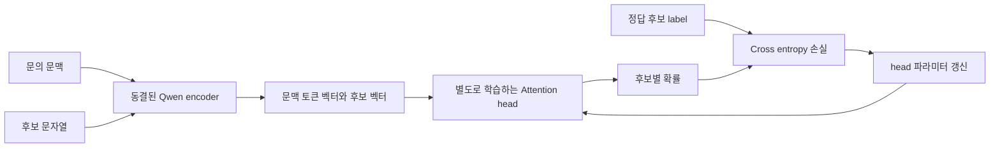
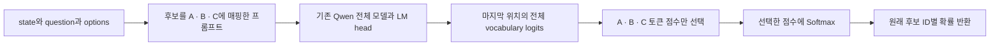
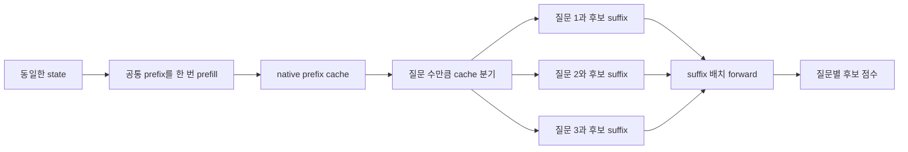

# Jevlike vs OpenJev — 학습하는 선택기와 기존 LLM의 선택 점수 추출

분석일: 2026-09-18.

- Jevlike: [`94f5fd1b0b11d52bbdfdf4e0ee6aa96b568f8452`](https://github.com/vinnylarouge/jevlike/commit/94f5fd1b0b11d52bbdfdf4e0ee6aa96b568f8452), 0.1.0.
- OpenJev: [`53e3028363509f8533d90fe82d983770da1f6c02`](https://github.com/TheoLeeCJ/openjev/commit/53e3028363509f8533d90fe82d983770da1f6c02), `openjev-phase1` 0.1.0.
- 두 저장소를 `.repos/` 아래에 클론해 소스코드로 비교했다. 클론은 기존 `.gitignore`의 `/.repos/` 규칙으로 제외된다. Jevlike의 CPU 학습은 [이전 분석](../jevlike/jevlike-analysis.md)에서 직접 실행했다. 이번 OpenJev 분석에서는 4B 모델 추론이나 브라우저 모델 다운로드를 실행하지 않았으며, 성능 수치는 작성자의 공개 결과다.

## 1. 가장 중요한 차이

**Jevlike는 자체 데이터로 후보 선택 모델을 학습하는 코드다. OpenJev는 이미 학습된 LLM을 그대로 사용하면서, 다음 토큰 점수에서 후보 선택 결과를 읽어내는 추론 코드다.**

둘 다 문장을 길게 생성하지 않고 후보별 점수를 얻으려 하지만, 점수의 출처가 다르다.

| 비교 항목 | Jevlike | OpenJev |
|---|---|---|
| 중심 목적 | 작은 가변 후보 선택기 학습 | 기존 LLM을 의사결정 함수처럼 사용하고 추론 경로 최적화 |
| 후보 점수의 출처 | 직접 학습한 attention scorer | 사전학습 LLM의 기존 vocabulary logits |
| 추가 학습 | 제공. Tiny 전체 또는 HF 기반 head 학습 | 현 버전에 학습 루프·CLI 없음 |
| 별도 판단 head | 새로 초기화하고 학습 | 추가하지 않음. 기존 LLM의 LM head 사용 |
| 기반 모델 | Tiny는 없음. HF 예시는 Qwen2.5-0.5B | Python 주력 baseline은 Qwen3.5-4B |
| 기반 모델 파인튜닝 | 기본 미지원, HF encoder는 동결 | 기본 미지원, inference mode로 실행 |
| LoRA·RLCD | 기본 미지원 | 기본 미지원 |
| 학습 데이터 없이 시작 | 새 모델로는 의미 있는 성능을 기대하기 어려움 | 기존 모델을 받아 바로 추론 가능 |
| 업무 판단 기준 전달 | 학습 데이터와 입력 문맥 | 매 요청의 자연어 `question`과 후보 설명 |
| 입력 | `context`, `options` 및 학습 시 `label` | `state`, `question`, 후보별 `id`·`description` |
| 후보 수 | 최소 2, 텍스트 입력 검증에 고정 상한 없음 | Python 2~16, 브라우저 2~20 |
| 반복 상태 처리 | 기본 캐시 없음 | state prefix 캐시와 병렬 suffix 처리 |
| 게임 강화학습 | Doom PPO·DAgger 예제 있음 | 없음 |
| 실행 환경 | 텍스트 CPU·MPS·CUDA | Python loader는 단일 CUDA GPU 요구. 별도 WebGPU 데모 있음 |

이 비교에서 “추가 학습 없음”은 OpenJev가 선택한 모델이 과거에 학습되지 않았다는 뜻이 아니다. **기존 모델의 사전학습·후속학습 결과를 이용하며 OpenJev 자체가 가중치를 갱신하지 않는다**는 뜻이다.

## 2. 같은 문의를 어떻게 처리하는가

예시 문제:

```text
문의: 결제가 두 번 됐으니 하나를 취소해주세요.
후보: 결제 오류 상담 / 신규 상품 구매 / 계정 복구
```

### Jevlike의 HF 경로

Qwen이 문의와 후보를 각각 벡터로 바꾼다. 별도로 학습한 head가 후보를 기준으로 문맥을 읽어 점수를 계산한다. “이 문의에서는 결제 오류 상담이 정답”이라는 라벨로 head를 훈련해야 한다. HF 모델의 기존 언어 생성용 LM head는 이 선택 점수 계산에 사용하지 않는다.



학습은 “각 후보가 문맥의 어떤 정보를 읽고 어떻게 점수를 줄지”를 바꾼다. Tiny 경로는 Qwen 대신 byte·position embedding을 쓰며 그 embedding까지 함께 학습한다. [Jevlike scorer 구현](https://github.com/vinnylarouge/jevlike/blob/94f5fd1b0b11d52bbdfdf4e0ee6aa96b568f8452/jevlike/model.py#L12-L94), [학습 루프](https://github.com/vinnylarouge/jevlike/blob/94f5fd1b0b11d52bbdfdf4e0ee6aa96b568f8452/jevlike/train.py#L57-L90).

### OpenJev의 Python direct 경로

입력은 아래와 같은 JSON이다. 학습 정답을 제공할 필요가 없다.

```json
{
  "id": "route-1",
  "state": "결제가 두 번 됐으니 하나를 취소해주세요.",
  "question": "어느 상담 부서로 보내야 하는가?",
  "options": [
    {"id": "billing", "description": "결제 오류 상담"},
    {"id": "sales", "description": "신규 상품 구매"},
    {"id": "access", "description": "계정 복구"}
  ]
}
```

내부에서는 후보를 `A`, `B`, `C`에 매핑하고, 질문·문맥·후보 설명을 하나의 chat prompt로 만든다. “정답 후보의 대문자 하나만 답하라”는 지시 뒤에서 다음 토큰의 전체 vocabulary logits를 구한다. **Python direct는 실제 답변 토큰을 샘플링하지 않고 `A/B/C` 위치의 점수만 가져온다.**



계산은 다음과 같다. `z(t)`는 마지막 위치에서 토큰 `t`의 logit이다.

```text
P(option i | prompt, allowed slots)
    = exp(z(letter_i)) / sum_j exp(z(letter_j))
```

따라서 기존 LLM의 언어 이해와 지시 수행 능력을 그대로 사용한다. Jevlike처럼 랜덤으로 초기화한 별도 선택 head를 훈련하는 단계가 없다. [프롬프트 구성](https://github.com/TheoLeeCJ/openjev/blob/53e3028363509f8533d90fe82d983770da1f6c02/src/openjev_phase1/core.py#L11-L56), [점수 추출](https://github.com/TheoLeeCJ/openjev/blob/53e3028363509f8533d90fe82d983770da1f6c02/src/openjev_phase1/direct.py#L25-L78).

“문장을 생성하지 않는다”는 것은 새로운 비자기회귀 모델 아키텍처를 개발했다는 의미가 아니다. **일반 causal LLM이 이미 계산하는 다음 토큰 분포를 활용하고, 뒤의 반복 디코딩을 생략한 것**이다. 장문 입력을 처리하는 LLM의 계산 비용은 남는다.

## 3. OpenJev의 핵심 코드와 추론 최적화

### 3.1 기본 모듈

| 파일 | 역할 |
|---|---|
| `core.py` | 입력 검증, 후보 A~P 매핑, chat messages, softmax, 고정 revision 모델 로딩 |
| `direct.py` | 후보 토큰 검증, 프롬프트 인코딩, 마지막 위치 logits 직접 추출 |
| `serial.py` | 같은 상태의 prefix cache를 보관하고 질문별 suffix를 순차 처리 |
| `shared.py` | 상태를 한 번 prefill한 뒤 cache를 분기해 여러 질문을 배치 처리 |
| `reranker.py` | 비교용 Qwen3-Reranker의 yes/no 점수를 후보별로 계산 |
| `cli.py` | `openjev-score` 명령. 네 가지 추론 mode를 선택 |
| `webgpu-demo/worker.js` | 브라우저의 양자화 모델 로딩과 direct·생성 결과 비교 |

`src`·`benchmarks`·패키지 정의를 확인한 범위에 optimizer, backward, Trainer, PEFT 학습 경로는 없다. 핵심 scorer는 `torch.inference_mode()`로 실행된다. `model.eval()`은 학습 모드 전환을 끄는 설정이며 여기서 가중치를 업데이트하는 것은 아니다.

### 3.2 shared mode가 유용한 이유

동일한 고객 기록에서 “결제 문제인가?”, “추가 본인확인이 필요한가?”, “재시도가 가능한가?”를 여러 번 판단하면 상태 부분의 입력이 반복된다. OpenJev는 prompt에서 evidence를 앞에 배치해 이 공통 prefix의 계산을 재사용한다.



`score_shared()`는 모든 행의 `state`가 같아야 한다. 먼저 상태 prefix를 처리하고, 모델이 반환한 native cache를 `reorder_cache()`로 분기한 뒤 suffix들을 처리한다. 하나의 질문에 후보가 여러 개 있는 것과, 하나의 상태에 질문이 여러 개인 것은 다른 축이다. [shared 구현](https://github.com/TheoLeeCJ/openjev/blob/53e3028363509f8533d90fe82d983770da1f6c02/src/openjev_phase1/shared.py#L53-L123).

이 경로는 prefill과 suffix forward로 구성되므로 전체를 물리적으로 “모델 호출 한 번”이라고 설명하면 부정확하다. cache도 모델 학습이나 장기 기억이 아니다. 같은 입력의 중간 계산을 재사용하는 추론 최적화다.

### 3.3 Reranker 경로는 별도 baseline

`--mode reranker`는 각 후보마다 “이 문맥이 이 후보 답변을 지지하는가?”라는 쌍을 만든다. 후보별 `logit(yes) - logit(no)`를 구하고, 그 log-odds를 후보 간 softmax로 정규화한다. 후보들을 한 batch에 넣더라도 각 쌍에는 문맥이 반복된다. 직접 A/B/C 점수를 읽는 방식이나 Jevlike의 attention head와 구조가 다르다. [reranker 구현](https://github.com/TheoLeeCJ/openjev/blob/53e3028363509f8533d90fe82d983770da1f6c02/src/openjev_phase1/reranker.py#L51-L125).

## 4. 자체 학습·파인튜닝 관점의 차이

| 원하는 변경 | Jevlike에서의 접근 | OpenJev에서의 접근 |
|---|---|---|
| 회사 특유의 라우팅 판단을 학습 | 자체 라벨로 Tiny 또는 HF head 학습 | 현재 trainer 없음. 규칙을 question·state에 넣거나 별도 기반 모델 학습 |
| 매 요청마다 새로운 판단 기준 적용 | context로 전달할 수 있으나 그 활용 능력은 학습 결과에 달림 | question을 바꿔 기존 LLM의 지시 수행 능력 사용 |
| 기반 Qwen을 LoRA로 도메인 적응 | encoder gradient·adapter·저장 경로 수정 | 외부 SFT·PEFT 학습을 구성한 뒤 호환 모델 로딩 |
| 실제 결과·사용자 정정으로 자동 개선 | 수집·추가 학습·교체 루프 필요 | 수집·별도 학습·교체 루프 필요 |
| 보상으로 정책 개선 | Doom 예제에는 구현 있음 | 구현 없음 |

OpenJev에서도 Qwen 자체를 외부에서 파인튜닝하고 사용할 수는 있다. 이는 **OpenJev가 제공하는 학습 기능이 아니라 확장 방안**이다. 예를 들면 다음 흐름을 설계할 수 있다.

1. OpenJev의 실제 prompt 형식으로 `state + criterion + 후보 설명`을 구성한다.
2. 올바른 후보에 대응하는 `A/B/C`를 target으로 한 학습 데이터를 만든다.
3. 외부 학습 코드에서 SFT·LoRA 또는 허용 후보 logits에 대한 loss로 기반 모델을 조정한다.
4. tokenizer·chat template·단일 토큰 slot 계약을 유지한 모델을 OpenJev에서 로드한다.

외부 SFT의 일반 vocabulary loss와 허용 후보만 정규화한 분류 loss는 서로 다르므로 목표에 맞게 정해야 한다. OpenJev loader는 로컬 모델 경로를 지원하지만 PEFT adapter를 자동 조립하는 로직은 없다. adapter를 merge한 호환 checkpoint를 쓰거나 loader를 수정해야 한다. 외부 학습·merge는 이번 분석에서 실행하지 않았다. [로컬 모델 로딩](https://github.com/TheoLeeCJ/openjev/blob/53e3028363509f8533d90fe82d983770da1f6c02/src/openjev_phase1/core.py#L72-L112).

또 다른 확장으로 OpenJev의 선택 결과를 teacher label로 삼아 Jevlike를 학습시킬 수 있다. 두 프로젝트를 연결하는 증류 파이프라인은 제공되지 않으며, teacher 오답을 그대로 넘길 수 있다. Jevlike는 현재 정수 label만 받으므로 전체 확률 분포를 증류하려면 schema와 loss 변경이 필요하다.

## 5. 성능 수치에서 판단할 수 있는 것

OpenJev 작성자는 같은 frozen Qwen3.5-4B, 한 RTX 3090, 동일 상태의 21개 질문에서 direct 병렬 readout 1.023초, 간결한 yes/no JSON 배열 생성 5.332초를 보고한다. 두 경로의 선택 일치는 18/21이다. 이것은 **답변 출력 방식의 비용 비교**이며 동일한 판단 결과가 보장된 비교는 아니다. [공개 성능 자료](https://github.com/TheoLeeCJ/openjev/blob/53e3028363509f8533d90fe82d983770da1f6c02/docs/RESULTS.md#systems-benchmark).

37개 상태 × 21개 기준의 777회 판단에서는 새로 전체 입력을 처리할 때 333.1초, prefix 재사용 순차 처리 72.3초, 병렬 suffix 38.8초를 보고한다. BF16 실행 방식이 달라지면서 fresh 대비 각각 5개·6개의 argmax도 바뀌었다. 반복 상태가 얼마나 큰지에 따라 캐시의 효용이 달라진다.

자체 작성 144행의 balanced accuracy는 0.813, WANLI 256행은 0.637이다. 공개 TypeSafe subset의 0.845 대 Jev 0.883은 20개 case·102행의 reference agreement이며 live Jev 호출 비교가 아니다. “Jev 성능을 재현했다”는 결론을 뒷받침하지 않는다. [품질 결과와 범위](https://github.com/TheoLeeCJ/openjev/blob/53e3028363509f8533d90fe82d983770da1f6c02/docs/RESULTS.md#semantic-quality).

이 수치들을 Jevlike의 합성 데이터 99.75%와 직접 비교하면 안 된다. 모델 규모, 데이터, 과제, metric이 모두 다르며 이번 분석에서 두 구현을 동일 업무 데이터로 비교한 적은 없다.

## 6. 구현 제약과 확률의 의미

- **OpenJev의 16개 제한:** Python은 `LETTERS = "ABCDEFGHIJKLMNOP"`에 맞춰 2~16개 후보만 받는다. 모델의 본질적 한계가 아니라 현 slot 설계·검증의 범위다. 확장하려면 단일 토큰과 경계 토큰화 계약도 유지해야 한다.
- **한국어 후보도 slot은 영문자:** 후보 설명은 한국어여도 출력용 A/B/C 토큰은 짧게 유지된다. 실제 한국어 판단 능력은 기반 모델과 prompt에 의존한다.
- **입력 잘림 정책:** Python OpenJev는 기본 최대 4,096 token을 넘으면 오류를 내며 자동 잘림을 허용하지 않는다. Jevlike는 설정 길이로 자른다.
- **후보 순서:** Jevlike head는 후보별로 같은 계산을 하므로 순서를 바꾸면 같은 의미 후보의 점수가 따라 이동하는 구조다. OpenJev는 후보 순서와 A/B/C 매핑이 prompt를 바꿔 판단도 변할 수 있다. 작성자 결과에서도 36개 사례 중 후보 역순 시 10개 선택 변화가 보고됐다.
- **확률 보정:** 두 구현 모두 후보 간 softmax를 반환한다고 해서 실세계 정답률과 일치하는 confidence가 되는 것은 아니다.

특히 OpenJev는 전체 vocabulary에서 A/B/C에 할당된 총 확률이 낮아도 그 셋만 다시 정규화한다. 예를 들어 모델이 다른 문장을 시작하려는 경향이 강해도 선택 후보 중 하나는 높은 상대 확률을 받을 수 있다. `serial.py`는 이를 파악할 수 있도록 `allowed_token_mass`와 전체 vocabulary argmax를 반환한다. [추가 진단값](https://github.com/TheoLeeCJ/openjev/blob/53e3028363509f8533d90fe82d983770da1f6c02/src/openjev_phase1/serial.py#L102-L123).

후보 밖 문자열을 반환하지 않는다는 구조적 성질과 판단이 옳다는 것은 별개다. 후보 목록에 정답이 없을 수 있다면 명시적인 “판단 불가” 후보 등 문제 정의가 필요하다.

## 7. Python 패키지와 브라우저 데모를 구분하기

OpenJev Python 패키지는 Python ≥3.10, PyTorch 2.10.0, Transformers 5.17.0, Accelerate 등 버전을 고정한다. loader는 정확히 하나의 CUDA GPU를 요구하고 BF16으로 모델을 읽는다. remote model은 40자리 commit revision이 필요하다. 따라서 현재 Python CLI를 Mac의 CPU·MPS에서 그대로 실행할 수 있다고 보면 안 된다. 코드는 수정 가능하지만 기본 경로는 단일 CUDA 환경이다. [패키지 정의](https://github.com/TheoLeeCJ/openjev/blob/53e3028363509f8533d90fe82d983770da1f6c02/pyproject.toml), [loader 조건](https://github.com/TheoLeeCJ/openjev/blob/53e3028363509f8533d90fe82d983770da1f6c02/src/openjev_phase1/core.py#L72-L104).

일반적인 추론 명령은 다음 형태다. 별도 학습 과정이 없다.

```bash
CUDA_VISIBLE_DEVICES=0 openjev-score \
  --mode direct \
  --model Qwen/Qwen3.5-4B \
  --revision 851bf6e806efd8d0a36b00ddf55e13ccb7b8cd0a \
  --input examples/decisions.jsonl \
  --output results-my-decisions.jsonl
```

출력 경로는 새 파일이어야 한다. 같은 상태에 대한 여러 질문을 처리할 때 `--mode shared`를 선택할 수 있다. 모델 크기 4B BF16은 가중치만 대략 8GB 규모이며 실제 필요 메모리는 cache와 실행 공간 등이 추가된다. 이는 계산상 추정으로 최소 VRAM 실측치가 아니다.

브라우저 데모는 wllama·GGUF·WebGPU 기반의 별도 실행 경로다. Qwen3-0.6B, MiniCPM5-2B, Qwen3.5-4B를 제공하며 첫 다운로드는 각각 약 639MB, 1.56GB, 3.01GB다. 정적 페이지에서 동작하고 별도 모델 서버를 사용하지 않는다. [브라우저 설명](https://github.com/TheoLeeCJ/openjev/blob/53e3028363509f8533d90fe82d983770da1f6c02/webgpu-demo/README.md).

**브라우저 direct는 Python direct와 구현이 다르다.** `createChatCompletion(max_tokens=1)`에 grammar와 label bias를 지정하고, 반환된 label logprobs를 정규화한다. 따라서 브라우저 구현까지 “토큰 생성 API를 전혀 호출하지 않는다”라고 표현하면 틀리다. 긴 문장 생성은 생략하지만 제약된 1-token readout API를 이용한다. 후보 수도 2~20개다. [worker 구현](https://github.com/TheoLeeCJ/openjev/blob/53e3028363509f8533d90fe82d983770da1f6c02/webgpu-demo/worker.js#L135-L163).

프로젝트가 제시한 native BF16 품질 결과를 브라우저 양자화 모델의 품질로 그대로 간주할 수도 없다. 모델 실행 방식과 prompt가 다르며 공개 문서도 이 둘을 구분한다.

### Qwen 이외 모델의 호환 조건

**OpenJev의 방식 자체는 Qwen 전용이 아니다.** Python loader는 기본적으로 `AutoModelForCausalLM`을 사용하고 Qwen3.5만 별도로 처리한다. `--model`로 다른 HF 모델 또는 로컬 checkpoint 경로를 지정할 수 있지만, 모든 모델의 무수정 동작을 보장하지는 않는다.

| 경로 | 필요한 호환 조건 |
|---|---|
| Python direct | 설치된 Transformers가 `trust_remote_code=False`로 모델을 로드할 수 있어야 함. system·user 메시지를 받는 chat template과 마지막 위치 vocabulary logits 필요 |
| 후보 토큰 | 사용하는 A~P 각각이 서로 다른 단일 토큰이어야 하며, prompt 바로 뒤에 붙여도 토큰화가 유지되어야 함 |
| Python 실행 환경 | 현 loader 기준 단일 CUDA GPU, BF16 로딩 지원과 충분한 메모리 |
| serial·shared 최적화 | direct 조건 외에 selective logits 및 호환 native cache 동작 필요. shared는 `reorder_cache()`를 통한 분기도 요구 |
| 브라우저 | wllama가 지원하는 모델·GGUF와 설정 필요. 현 등록 목록에 이미 Qwen 외 **MiniCPM5-2B**가 있음 |

Llama·Mistral·Gemma 등 다른 계열은 구조상 검토 대상이지만 이번 분석에서 실행 호환성을 확인하지 않았다. 특히 tokenizer와 chat template 차이 때문에 모델 이름 교체만으로 통과하지 않을 수 있다. 브라우저 모델 목록은 고정 설정이고 label token ID도 모델별로 들어 있어 임의 GGUF URL 교체만으로 지원이 완성되는 것은 아니다.

자체 파인튜닝한 모델도 위 조건을 충족하는 완전한 로컬 checkpoint라면 loader에 전달할 수 있다. PEFT adapter만 있는 디렉터리를 자동으로 기반 모델과 조합하는 기능은 현재 없다. [모델 loader](https://github.com/TheoLeeCJ/openjev/blob/53e3028363509f8533d90fe82d983770da1f6c02/src/openjev_phase1/core.py#L72-L112), [토큰 호환 검증](https://github.com/TheoLeeCJ/openjev/blob/53e3028363509f8533d90fe82d983770da1f6c02/src/openjev_phase1/direct.py#L13-L45), [브라우저 모델 등록](https://github.com/TheoLeeCJ/openjev/blob/53e3028363509f8533d90fe82d983770da1f6c02/webgpu-demo/worker.js#L6-L25).

## 8. 엔지니어 관점의 선택

**Jevlike가 맞는 경우:** 자체 라벨 데이터로 작은 도메인 선택기를 만들고 싶거나, attention 기반 선택 head를 연구·변경하려는 경우다. Tiny는 CPU에서 작동하지만 표현력이 제한적이며, HF head 방식은 별도 학습이 필요하다. 현재 텍스트 CLI의 warm start 부재와 CPU snapshot 버그도 고려해야 한다. [상세 학습 가이드](../jevlike/training-and-finetuning.md).

**OpenJev가 맞는 경우:** 아직 학습 데이터가 없고 기존 LLM의 판단 능력을 바로 활용하려는 경우, 같은 상태에 대해 다양한 자연어 질문을 많이 하는 경우다. 기준을 prompt로 전달하고 긴 출력 생성을 줄일 수 있다. 대신 기존 LLM 전체를 유지하므로 모델 크기·입력 처리 비용이 남고 prompt와 후보 순서에 영향을 받는다.

**Qwen 자체를 파인튜닝하려는 경우:** 두 프로젝트 모두 완성된 trainer를 제공하지 않는다. Jevlike는 새 선택 head 학습, OpenJev는 기존 LM head의 출력 점수 활용이 현재 중심이다. 학습 대상을 기반 모델까지 넓히려면 각각 다른 확장이 필요하다.

두 프로젝트의 원본 코드는 MIT이고 외부 모델·데이터에는 해당 출처의 조건이 적용된다. 둘 다 TypeSafe Jev의 비공개 원본 모델·가중치·RLCD 학습 방법을 공개한 프로젝트는 아니다.
