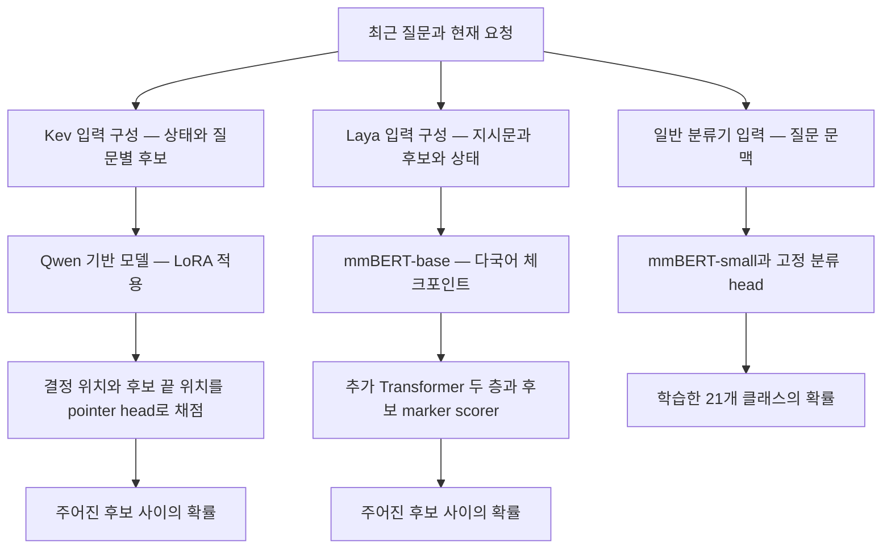

# Kev와 Laya — 학습 방식과 한국어 금융 라우팅 적합성

조사일: 2026-09-22. 사용자가 지정한 두 저장소를 `.repos/kev`, `.repos/laya`에 복제해 추론·학습 코드를 확인했다. `.repos/`는 루트 `.gitignore`에서 제외되어 있다.

같은 날 [Laya 공식 사이트](https://laya.convaiinnovations.com/)를 추가 분석해 연구 배경, 선택 다운로드, Router 기본값, 확률 보정의 측정 조건을 보완했다. 주장별 근거와 확인 결과는 [공식 사이트 상세 분석](laya-official-site-analysis.md)에 정리했다.

| 프로젝트 | 분석한 커밋 | 공개 모델 |
|---|---|---|
| [Kev](https://github.com/jaredpalmer/kev) | `90990a5fac2995b9faa3190f7d437e84f2067768` | Qwen3.5 기반 0.8B·4B·9B, 이전 Qwen3 계열도 유지 |
| [Laya](https://github.com/NandhaKishorM/laya) | `573e5b62696ba441230cd6be71d593331b5d23af` | 영어·다국어·특정 업무용 체크포인트, SDK 0.3.5 |

이 문서는 소스코드와 제작자가 공개한 실험 결과를 분석한다. 모델 가중치를 내려받아 실행하거나 금융 데이터로 학습한 결과는 아니다. 특히 **동일 CPU·동일 한국어 금융 데이터에서 두 모델을 비교한 수치는 확인하지 못했다.**

## 1. 현재 프로젝트에 대한 판단

**두 프로젝트 중에는 Laya-multilingual이 CPU 기반 한국어 의도 분류의 비교 후보로 더 적합하다. 다만 고정된 21개 플레이북을 분류하는 주력 후보는 여전히 mmBERT-small 일반 분류기다.**

핵심 이유는 Laya-multilingual 자체가 **mmBERT-base에 의사결정용 head를 붙여 학습한 모델**이기 때문이다. mmBERT를 완전히 대체하는 새로운 경량 기반 모델이 아니다. 후보 설명을 매번 바꿀 수 있는 기능을 추가한 대안으로 보는 것이 정확하다.

Kev는 Qwen에 LoRA와 선택 head를 학습한다. 공개 체크포인트에서 자체 데이터로 이어 학습하는 경로, HTTP 서버, 입력·출력 계약이 잘 갖춰져 있다. 복잡한 설명을 읽고 가변적인 업무 규칙을 적용하는 용도의 비교 후보이지만, CPU 비용과 한국어 금융 정확도는 별도로 확인해야 한다.

| 선택지 | 현재 요구에서의 역할 | 판단 근거 |
|---|---|---|
| mmBERT-small + 21개 분류 head | 우선 기준 모델 | 약 140M, 질문 문맥만 인코딩, 고정 라벨에 직접 학습 |
| Laya-multilingual 추가 학습 | 다음 비교 후보 | 약 322M, mmBERT-base 기반, 후보 설명·가변 라벨 지원 |
| Kev-0.8B 추가 학습 | Qwen 기반 비교 후보 | 최소 공개 현행 모델, LoRA 학습 경로 제공, CPU 속도 근거 부족 |
| Kev-4B·9B | GPU도 고려할 때 정확도 비교 후보 | 제작자 실험에서 0.8B보다 강하지만 추론 자원이 커짐 |

이는 구조와 공개 증거에 근거한 우선순위이지, 금융 데이터에서의 정확도 순위를 측정한 결과가 아니다. mmBERT의 기존 분석은 [금융 플레이북 라우팅](financial-playbook-routing.md)을 참고한다.

## 2. 해결하려는 문제와 공통점

일반 생성형 LLM으로 분류하면 답변 텍스트 생성과 JSON 처리까지 수행하기 쉽다. 두 프로젝트는 입력과 후보를 읽고 **후보별 점수 분포를 바로 반환**하는 인터페이스를 제공한다.

- `choice`: 후보 중 하나와 후보별 확률.
- `noul`: 예·아니오에 해당하는 참일 확률.
- `score`: 순서가 있는 등급의 분포와 기대 등급.

둘 다 생성된 자연어 답변을 후보 문장과 비교하는 방식이 아니다. 후보를 포함한 입력의 내부 표현에 학습한 head를 적용한다. 자유 생성이 없어 출력 형식은 통제하기 쉽지만, 의미 판단 자체는 틀릴 수 있다.

두 프로젝트 모두 Jev의 공식 가중치나 공식 학습 코드를 공개한 프로젝트는 아니다. Kev는 제3자의 Jev 아키텍처 재구성을 참고한다. Laya는 저자의 2025년 판매 전환 예측·신뢰도 라우팅 연구를 배경으로 설명하며, 2026년 Jev와 유사한 typed decision 모델로 범위를 확장했다. 선행 연구의 존재는 확인되지만 현재 Laya와 Jev의 기술적 동일성이나 최초 발명을 입증하는 근거로 사용하지 않는다. [연구 계보 확인](laya-official-site-analysis.md#3-선행-연구의-존재와-현재-구현의-관계)

## 3. 아키텍처 비교



### Kev: Qwen을 선택 작업에 맞게 적응시킨다

`kev/model.py`의 `DecisionModel`은 Qwen의 언어 생성 head를 사용하지 않고 backbone의 hidden state를 읽는다. 입력은 상태, 질문 지시문, 후보들의 시작·끝 표시, 최종 결정 표시로 구성된다.

`PointerHead`는 최종 결정 위치와 각 후보 끝 위치를 선형 투영하고 내적으로 점수를 만든다. 그 점수에 softmax를 적용한다. 기존 OpenJev 분석의 A/B/C 다음 토큰 확률 추출과 달리 **이 점수 계산을 위한 head와 LoRA를 별도로 학습**한다.

현행 Qwen3.5와 이전 Qwen3는 질문 병렬화 방식도 다르다.

- Qwen3는 attention mask로 상태를 공유하되 질문끼리는 읽지 못하게 하나의 입력에 묶는다.
- Qwen3.5에는 Gated DeltaNet 계층이 있어 그 mask만으로 질문을 격리할 수 없다. 질문마다 별도 행을 만들어 상태와 해당 질문을 처리한다.
- 서버의 prefix cache 조건을 만족하면 상태를 재사용한다. 현행 기본 조건은 상태 길이 384토큰 이상, 최대 네 상태 캐시다. Qwen3.5에서 캐시가 없는 첫 요청은 상태 계산과 질문 분기 계산으로 나뉠 수 있다.

따라서 “한 번에 판단한다”를 모든 설정에서 정확히 backbone 호출 한 번 또는 항상 동일한 계산 비용이라고 해석하면 안 된다. 핵심은 자유로운 답변 토큰 생성 루프가 없다는 점이다. 질문끼리의 격리와 후보 순서에 대한 불변성도 별개다. 기본 모델은 후보 순서가 바뀌면 결과가 바뀔 수 있다.

근거: [모델과 pointer head](https://github.com/jaredpalmer/kev/blob/90990a5fac2995b9faa3190f7d437e84f2067768/kev/model.py), [서버와 prefix cache](https://github.com/jaredpalmer/kev/blob/90990a5fac2995b9faa3190f7d437e84f2067768/kev/serve.py).

### Laya: mmBERT에 후보를 읽는 의사결정 계층을 붙인다

Laya의 세 체크포인트를 구분해야 한다.

| 체크포인트 | 인코더 | 전체 파라미터 | 기본 최대 길이 | 현재 프로젝트 적합성 |
|---|---|---:|---:|---|
| `convaiinnovations/laya` | ModernBERT-large | 약 421M | 512 | 영어용 |
| `convaiinnovations/laya-multilingual` | mmBERT-base | 약 322M | 1,024 | 한국어 비교 후보 |
| `convaiinnovations/laya-typed-decisions` | ModernBERT-large | 약 421M | 1,024 | 영어의 네 업무에 특화, 한국어용 아님 |

다국어 모델은 mmBERT-base 약 306.94M과 추가 계층 약 14.97M으로 구성된다. `laya/common.py`의 `DecisionModel`은 인코더 뒤에 Transformer 두 층, 질문 유형 embedding, 후보 scorer, 행동·이관 head를 둔다.

각 후보 앞에 `[MASK]` marker를 넣고 **상태와 후보를 함께** 인코딩한다. marker 위치의 표현을 scorer에 넣어 후보별 점수를 얻는다. 미리 만든 후보 embedding과 질문 embedding의 단순 유사도 비교가 아니다.

여러 질문을 한 번에 넘기면 `Agent.system_one()`은 **질문마다 상태가 들어간 별도 입력 행**을 만든 뒤 배치로 처리한다. 따라서 “단일 forward”라도 상태 인코딩을 질문 수와 무관하게 딱 한 번만 계산하는 구조는 아니다.

`Router`는 언어·문자 종류에 따라 위 체크포인트를 고르는 SDK 기능이다. 사용자의 금융 플레이북을 라우팅해 주는 학습 모델 자체가 아니다. 한국어 전용 서버에는 다국어 체크포인트 하나를 명시적으로 올리는 구성이 단순하다.

현재 `auto_task_detection=False`가 기본이다. 등록된 고객지원 질문 ID와 영어 문장을 넣어 `route()`만 실행했을 때 기본은 `english`, 명시적 선택 또는 자동 감지 활성화 시에는 `typed-decisions`를 반환했다. `preload=True`는 모델을 상주시킬 뿐 이 선택 정책을 바꾸지 않는다. 따라서 사이트의 특화 모델 76.6%를 기본 Router의 성능으로 일반화할 수 없다. [로컬 확인 결과](laya-official-site-analysis.md#4-router의-실제-역할과-기본값)

근거: [Laya 모델·입력 구성](https://github.com/NandhaKishorM/laya/blob/573e5b62696ba441230cd6be71d593331b5d23af/laya/common.py), [추론 SDK](https://github.com/NandhaKishorM/laya/blob/573e5b62696ba441230cd6be71d593331b5d23af/laya/agent.py), [체크포인트 라우터](https://github.com/NandhaKishorM/laya/blob/573e5b62696ba441230cd6be71d593331b5d23af/laya/router.py).

## 4. 자체 학습과 파인튜닝

| 항목 | Kev | Laya |
|---|---|---|
| 공개 학습 경로 | `python -m kev.train` | Kaggle 2×T4 노트북 |
| 기본 학습 범위 | Qwen의 LoRA + pointer head | 공개 추가 학습 노트북은 인코더 + 의사결정 head |
| 원래 기반 가중치 | LoRA 적용 시 기반 파라미터 자체는 동결 | 노트북에서 인코더도 optimizer에 포함 |
| 목적함수 | 기본 cross-entropy, 선택적 추가 항 | RLCD policy gradient + soft cross-entropy |
| 기존 체크포인트에서 계속 학습 | `--init_from` 명시 지원 | 저장된 Laya 전체 가중치를 읽고 시작 |
| 자체 데이터 입력 | API 요청 형태 JSONL + 정답 | 노트북의 데이터 준비 부분을 교체해야 함 |
| 자동으로 이용 로그를 학습하는가 | 아님 | 아님 |

### Kev

현행 공개 모델은 rank 16 LoRA를 사용한다. attention·MLP, Qwen3.5에서는 DeltaNet projection도 학습 대상에 포함한다. 즉 “Qwen 파인튜닝”은 맞지만 전체 원본 가중치를 모두 갱신하는 full fine-tuning과는 다르다. 추론 시에는 기반 모델 전체가 필요하며, 작은 adapter 파일 크기가 전체 실행 모델 크기는 아니다.

금융 데이터는 한 줄에 `state`, `questions`, `label`을 담을 수 있다. `choice` 정답은 후보 이름이다. 다음은 **실행하지 않은 학습 명령 예시**다. `finance-train.jsonl`과 라벨 정책이 준비되어 있어야 한다.

```bash
uv run python -m kev.train \
  --data finance-train.jsonl \
  --base Qwen/Qwen3.5-0.8B-Base \
  --init_from jaredpalmer/kev-0.8b \
  --epochs 2 --lr 2e-5 --batch 1 --accum 8 \
  --dtype bf16 --checkpointing 1 --device cuda \
  --out runs/finance-router
```

CPU 운영과 GPU 학습은 양립할 수 있다. 학습 GPU를 계속 운영해야 하는 것은 아니다. 위 값은 출발 예시이며 금융 정확도가 검증된 설정은 아니다.

자체 학습 시 놓치기 쉬운 제약이 있다. 현행 기본 학습 코드는 상태 384토큰, 상태와 한 질문을 합친 길이 1,024토큰, 전체 packed 길이 2,048토큰을 기준으로 삼는다. `--data`를 읽을 때 이 길이를 초과하는 레코드는 제외한다. 반면 서버는 더 긴 입력을 받는다. 긴 최근 3질문과 21개 후보 설명을 학습하려면 **데이터가 얼마나 제외되는지와 학습·추론 길이 차이**를 확인해야 한다.

근거: [학습 진입점·길이 필터·손실](https://github.com/jaredpalmer/kev/blob/90990a5fac2995b9faa3190f7d437e84f2067768/kev/train.py), [체크포인트 로드·warm start](https://github.com/jaredpalmer/kev/blob/90990a5fac2995b9faa3190f7d437e84f2067768/kev/checkpoint.py).

### Laya

공개 노트북은 영어 `convaiinnovations/laya`와 `LocalLLaMA/typed-decisions` 데이터를 기본으로 쓴다. 한국어 금융용으로 활용하려면 다국어 체크포인트와 사용자 데이터로 바꾸어야 한다. 정답 분포를 받는 구조이므로 사람이 붙인 단일 정답은 해당 클래스만 1인 one-hot target으로 표현할 수 있다.

노트북에서 확인한 실제 학습은 다음과 같다.

1. 기존 모델 전체 가중치를 로드한다.
2. encoder와 head를 서로 다른 학습률로 AdamW에 넣는다. head만 학습하는 코드가 아니다.
3. 출력 logits에 Gaussian noise를 넣어 여러 후보 확률 분포를 만든다.
4. 정답 분포에 대한 log·spherical score, 등급 질문에는 ranked probability score까지 사용해 보상을 계산한다.
5. 그룹 평균을 baseline으로 하는 policy gradient와 **soft cross-entropy를 함께** 최적화한다.

따라서 “강화학습이므로 라벨 없이 스스로 금융 의도를 배운다”는 의미가 아니다. 공개 추가 학습 경로에는 정답 또는 teacher 분포가 필요하다. RLCD라는 이름만으로 일반 cross-entropy 분류기보다 이 업무의 정확도나 확률 보정이 우수하다고 결론 내릴 수도 없다.

노트북을 그대로 복사할 때 고칠 부분도 있다. 데이터 tokenization 이후 학습 단계에서 길이 설정을 바꾸므로, **원하는 길이를 전처리 이전에 적용**해야 한다. 또한 temperature를 학습 데이터 일부에서 맞추고, 기존 `temperature_by_options`를 정리하지 않은 채 `temperature`만 갱신한다. SDK는 옵션 개수별 값을 우선 적용하므로, 금융 데이터에 맞춰 보정용 데이터를 분리하고 실제 적용되는 설정도 정리해야 한다. 이는 출력 confidence의 의미에 직접 영향을 준다.

근거: [공개 추가 학습 노트북](https://github.com/NandhaKishorM/laya/blob/573e5b62696ba441230cd6be71d593331b5d23af/notebooks/laya_finetune_typed_decisions_2xT4_kaggle.ipynb), [typed-decisions 모델의 알려진 제한](https://huggingface.co/convaiinnovations/laya-typed-decisions).

## 5. 한국어와 공개 정확도 수치의 의미

### Laya에는 한국어 실험이 있지만 즉시 업무 적용을 뒷받침하지는 않는다

제작자가 공개한 MASSIVE 의도 분류 결과는 다음과 같다. 금융 질문 분류 결과가 아니며, 각 사례에서 정답과 무작위 오답을 합쳐 20개 후보를 구성했다. 질문 지시문과 후보 이름은 영어다.

| 공개 실행 | 한국어 사례 수 | 영어 Laya | Laya-multilingual |
|---|---:|---:|---:|
| CPU 51개 언어 조사 | 100 | 11.0% | 45.0% |
| T4 다국어 조사 | 300 | 약 10.3% | 49.0% |

서로 다른 표본으로 수행한 실험이다. CPU와 GPU가 정확도 차이를 만들었다는 의미가 아니다. 또 이 수치를 사용자 프로젝트의 예상 정확도라고 사용할 수 없다. 확인되는 것은 **한국어에는 다국어 체크포인트를 써야 하고, 그 체크포인트도 학습 없이 충분히 정확하다고 보기 어렵다**는 점이다.

다른 공개 업무 데이터에서는 기본 다국어 모델 34.2%, 해당 업무에 추가 학습한 영어 `laya-typed-decisions` 76.6%가 보고되어 있다. 둘은 언어와 기반 모델까지 다르므로 한국어 모델의 추가 학습 개선 폭으로 해석할 수 없다. 76.6%를 다국어 Laya의 일반 성능으로 인용하는 것도 부정확하다.

근거: [CPU 원자료](https://github.com/NandhaKishorM/laya/blob/573e5b62696ba441230cd6be71d593331b5d23af/research/results/cpu_51_language_sweep.json), [T4 원자료](https://github.com/NandhaKishorM/laya/blob/573e5b62696ba441230cd6be71d593331b5d23af/research/results/t4_colab_benchmark.json), [후보 구성 코드](https://github.com/NandhaKishorM/laya/blob/573e5b62696ba441230cd6be71d593331b5d23af/research/scripts/bench_local.py).

### Kev에는 한국어 금융 판단의 근거가 부족하다

현행 모델 카드는 영어를 명시하고, 공개 실험은 여러 공개 분류 데이터와 생성한 정책 판단 문제를 중심으로 한다. Qwen 기반이라는 사실만으로 Kev의 한국어 정확도가 유지된다고 보장할 수 없다.

제작자의 동일한 미학습 출처 test 자료에서 Kev-0.8B 68.4%, Kev-4B 83.7%, Kev-9B 85.2%가 보고되어 있다. 이는 크기를 늘렸을 때의 해당 실험 결과이지 금융 의도 분류의 정확도가 아니다. Laya의 MASSIVE·typed-decisions 수치와 데이터가 달라 두 프로젝트의 순위를 정할 수도 없다. [Kev 모델 카드](https://huggingface.co/jaredpalmer/kev-0.8b), [공개 모델 비교](https://github.com/jaredpalmer/kev/blob/90990a5fac2995b9faa3190f7d437e84f2067768/README.md#models).

Laya의 “Jev보다 빠르다·정확하다” 비교는 일부 Jev 수치를 외부 보고에서 가져왔고 입력·표본도 다를 수 있다고 자체 문서에 명시한다. 로컬 GPU 연산 시간과 원격 API 시간을 나눈 수치를 CPU 비용 절감 배율로 사용하면 안 된다. [Laya 공개 비교의 조건](https://github.com/NandhaKishorM/laya/blob/573e5b62696ba441230cd6be71d593331b5d23af/BENCHMARKS.md).

## 6. 21개 플레이북에 적용할 때 중요한 차이

### 질문 하나와 후보 21개로 구성한다

현재 계약은 매 턴 주 의도 하나다. 따라서 `choice` 질문 하나에 21개 플레이북을 넣으면 된다. **21개 독립 예·아니오 질문을 만들어 병렬 판단할 필요가 없다.** 그런 구성은 여러 의도를 동시에 참으로 판정해 원래 계약과 달라진다.

이 때문에 Kev의 여러 질문 분기·상태 공유나 Laya의 여러 질문 배치가 제공하는 이득을 현재 업무에서 그대로 기대할 수 없다. 최근 3질문 묶음은 입력 상태이고, 모델이 답할 분류 질문은 하나다.

### Laya의 기본 후보 길이 제한

다국어 모델은 `max_len=1024`, `head_max_len=256`이 기본이다. `head_max_len`은 지시문과 전체 후보가 나눠 쓰는 예산이다. `build_sequence()`는 후보 하나당 텍스트를 우선 48토큰까지 자르고, 후보 전체가 길면 다시 균등하게 줄인다.

21개 후보가 예산을 넘기면 코드의 `(256 - 16) // 21` 계산에 따라 후보 하나가 **marker 포함 11토큰, 후보 텍스트는 최대 10토큰** 정도까지 잘릴 수 있다. 이 경우 지시문에 남는 예산도 25토큰뿐이다. “보유 대응”과 “진입 판단”의 긴 경계 설명을 써 넣어도 중요한 부분이 모델에 전달되지 않을 수 있다.

21개 자체가 지원 불가라는 뜻은 아니다. `head_max_len`을 늘리고 전체 길이도 함께 조정할 수 있지만 CPU 계산량도 늘어나고 정확도 향상은 보장되지 않는다. 후보를 20개로 줄이려고 정식 `플레이북 없음`을 제거해서는 안 된다. 먼저 21개를 유지한 채 실제 tokenization 결과와 설명 보존 여부를 확인하는 접근이 적절하다.

Laya의 `predict_shortlist()`는 embedding으로 일부 후보를 고른 뒤 재판단하는 선택 기능이다. 현재 21개 라벨에서 이를 먼저 넣으면 앞 단계에서 정답을 탈락시키는 문제가 추가된다. 반환 확률도 선별된 후보들 사이의 상대 확률이 된다.

### 마지막 질문과 보유 근거를 보존한다

Laya 추론은 길이가 넘으면 상태의 앞부분을 남기는 경로를 사용한다. 오래된 질문부터 나열한 긴 입력에서는 가장 중요한 현재 질문이 잘릴 수 있다. Kev도 학습 시 긴 레코드 제외와 서버의 앞부분 truncation을 구분해 다뤄야 한다.

입력은 현재 질문의 전체 내용을 우선 보존하고, 이전 질문에서 해당 자산의 보유 근거를 필요한 만큼 남기도록 구성해야 한다. 이는 어느 모델을 쓰든 동일하다. `플레이북 없음`은 정상적인 업무 클래스이며, 낮은 확신으로 판단을 보류하는 상태와도 구분해야 한다.

## 7. CPU 추론과 인프라

모델별 구체적인 시작 사양과 로딩 메모리는 [Kev 추론 하드웨어](kev-inference-hardware.md)에 정리했다.

| 항목 | Kev | Laya-multilingual |
|---|---|---|
| 공식 코드의 CPU 실행 경로 | 있음 | `laya.load(..., device="cpu")` |
| 현행 모델 크기 | 최소 0.8B, 그 위 4B·9B | 약 322M |
| 생성 연산 | 자유 생성 없음 | 자유 생성 없음 |
| 런타임 | PyTorch·Transformers·PEFT, FastAPI 서버 | PyTorch·Transformers, Python SDK |
| 표준 Ollama 모델로 바로 교체 | custom pointer head·추론 경로 때문에 그대로는 안 됨 | custom decision head 때문에 그대로는 안 됨 |
| 공개 INT8 CPU 최적화 경로 | 이번에 분석한 핵심 코드에서 확인하지 못함 | 이번에 분석한 핵심 코드에서 확인하지 못함 |
| 현재 업무에서 예상되는 부담 | 상대적으로 큰 Qwen backbone | 작은 encoder 계열이지만 일반 mmBERT 분류보다 긴 입력·추가 계층 |

기본 코드의 Laya CPU 경로는 FP32이며, 322M 가중치만 대략 **1.29GB**다. 이는 전체 프로세스 RAM이 아니다. tokenizer, 임시 tensor, attention, 동시 요청과 로딩 중 복사본이 추가된다. 비교를 위해 mmBERT-small 140M의 FP32 가중치는 약 0.56GB다. 이것으로 지연시간이 정확히 2.3배 차이 난다고 계산할 수는 없다.

Kev도 CPU fallback을 제공하지만 이를 CPU 최적화 제품과 동일시하면 안 된다. Qwen3.5의 DeltaNet 커널 지원에 따라 성능이 크게 달라진다. 제작자는 Apple M5에서조차 이전 Qwen3 모델보다 현행 모델이 느리다고 보고한다. **Apple GPU인 MPS 결과는 일반 x86 CPU 서버 결과가 아니다.**

| 제작자 공개 수치 | 조건과 해석 |
|---|---|
| Laya-multilingual 32.8ms | T4 GPU, 질문 하나, p50. CPU 수치가 아님 |
| Laya-multilingual 72.3ms / 질문 10개 | T4 GPU의 배치 전체 시간. 단일 요청 지연시간을 7.2ms라고 보면 안 됨 |
| Laya README의 CPU 193~464ms | preload한 Router에 대한 보고. 이 범위만으로 현재 서버 지연시간을 산정할 수 없음 |
| Kev-0.8B 329ms, Kev-4B 779ms, Kev-9B 약 2초 | Apple M5, BF16, 약 230토큰 상태·질문 5개·각 후보 3개, 모델 시간 |

이 조건들은 서로 다르다. Kev 대비 Laya의 CPU 속도 배율·QPS·월 비용 절감률은 아직 숫자로 결론 낼 수 없다. 자체 호스팅은 API 과금 대신 서버 비용을 부담하는 것이므로 Laya 문서의 “$0 self-hosted”를 운영비 무료로 읽으면 안 된다.

한국어 전용 서버에서는 Laya 모델 하나를 프로세스 시작 시 로드해 재사용한다. `Router(preload=True)`로 영어·다국어·특화 모델을 모두 올릴 필요는 없다. 자체 학습도 별도 GPU에서 수행하고, 완료한 가중치를 CPU 서버에 배포할 수 있다.

공식 사이트의 Hub 통합·선택 다운로드 설명은 코드와 일치한다. `laya.load("convaiinnovations/laya", subfolder="multilingual", device="cpu")`는 다국어 체크포인트 파일만 받는다. 사이트의 약 647MB 다운로드 크기를 CPU RAM 요구량으로 해석하면 안 된다. [다운로드와 메모리 구분](laya-official-site-analysis.md#5-선택-다운로드-메모리-오프라인-배포)

근거: [Laya 장치·dtype 처리](https://github.com/NandhaKishorM/laya/blob/573e5b62696ba441230cd6be71d593331b5d23af/laya/agent.py), [Kev 장치 선택](https://github.com/jaredpalmer/kev/blob/90990a5fac2995b9faa3190f7d437e84f2067768/kev/device.py), [Kev 추론 성능의 조건](https://github.com/jaredpalmer/kev/blob/90990a5fac2995b9faa3190f7d437e84f2067768/README.md#serving-performance).

## 8. 확률·API·배포 완성도

두 프로젝트의 `confidence`는 동일한 값이 아니다.

- Kev의 `choice` confidence는 최대 후보 확률을 후보 수에 따라 정규화한다.
- Laya의 `choice` confidence는 분포의 entropy를 정규화한 값이다.
- 따라서 두 시스템에 같은 `confidence >= 0.85`를 적용해 같은 오류율을 기대할 수 없다. 어느 쪽도 “85%의 실제 정답률” 그 자체가 아니다.

Kev 현행 체크포인트에는 temperature가 포함되어 있다. Laya 다국어 모델 카드는 temperature가 모두 1이며 보정되지 않은 상태라고 명시한다. 둘 다 금융 데이터로 추가 학습하면 확률 보정도 해당 데이터 분포에서 다시 판단해야 한다. `noul`, `score`, `choice`를 서로 같은 의미의 confidence로 합치지 않는다.

공식 사이트의 Laya ECE 0.081은 영어 모델의 데이터셋별 보정 실험 결과다. 공개 코드는 각 데이터셋을 나누고 질문 유형·후보 개수 구간별 temperature를 맞춘다. 다국어 모델의 같은 실험 결과는 0.106이다. 또한 ECE는 최대 후보 확률로 계산하지만 SDK의 `choice.confidence`는 entropy 기반이므로 두 값을 같은 척도로 해석하면 안 된다. [측정 조건 상세](laya-official-site-analysis.md#6-정확도-보정-confidence의-차이)

배포 인터페이스는 Kev가 더 완결되어 있다. FastAPI의 `POST /v1/systemone`, `GET /v1/models`, 공식 TypeSafe SDK와 연결되는 로컬 서버가 포함된다. Laya 핵심 패키지는 `load`, `predict`/`system_one`, `Router`, 업무별 질문 preset을 제공하는 SDK이며, 사용자 서비스용 HTTP 래퍼는 별도 통합이 필요하다.

Kev는 Python 3.12+, Transformers 5.17+, PEFT를 사용한다. Laya는 Python 3.10+, PyTorch·Transformers·safetensors 등을 사용한다. 두 저장소의 dependency 범위가 다르므로 기존 Jevlike 데모 환경에 한꺼번에 설치하기보다 별도 환경으로 관리하는 편이 적절하다.

저장소 LICENSE와 확인한 공개 모델 카드는 모두 Apache-2.0으로 표시되어 있다. Kev의 adapter·head와 Qwen3.5 기반, Laya의 공개 체크포인트를 구분해서 확인했다. 학습 데이터의 라이선스까지 자동으로 동일해지는 것은 아니다. [Kev 모델 라이선스 표기](https://huggingface.co/jaredpalmer/kev-0.8b#license), [Laya 다국어 모델 카드](https://huggingface.co/convaiinnovations/laya-multilingual).

## 9. 장단점과 선택 기준

| 프로젝트 | 강점 | 약점·현재 제약 | 더 잘 맞는 경우 |
|---|---|---|---|
| Kev | Qwen 표현력 활용, 자체 JSONL·warm start·LoRA·서버가 한 흐름으로 연결, 여러 질문 격리와 캐시 | CPU 비용, 한국어 검증 부족, 후보 순서 영향, 학습과 서버의 길이 차이 | 후보·정책 설명이 자주 바뀌며 추가 연산을 감수할 가치가 있는 판단 |
| Laya-multilingual | 실제 mmBERT 기반 다국어 모델, CPU 경로, 비교적 작은 크기, 선택·등급·이진 질문 통합 | 학습 없는 한국어 성능 부족, 기본 후보 설명 truncation, 과신, 노트북 수정 필요 | 다양한 후보 설명을 활용하면서 encoder 수준의 규모를 유지하려는 업무 |
| 일반 mmBERT 분류기 | 고정 클래스에서 단순한 계산과 명확한 학습 목표, small 선택 가능 | 새 라벨 추가 시 출력 head·학습 갱신 필요, 임의 후보를 즉석에서 받지 못함 | 지금처럼 21개 업무가 정의되어 있고 라벨 데이터가 있는 CPU 라우터 |

현재 가진 약 2만 건 규모의 발화와 명시적 경계 규칙은 고정 분류기 학습에 유리한 조건이다. 우선 mmBERT-small을 학습하고, 부족한 구분이 있으면 Laya-multilingual의 후보 설명 활용이 그 문제를 줄이는지 비교하는 순서가 합리적이다. 같은 mmBERT-base를 이용한 일반 분류기도 포함하면, Laya의 추가 계층 효과와 기반 모델 크기의 효과를 구분할 수 있다.

Kev는 CPU 배포의 첫 선택보다는 Qwen 기반 판단의 정확도 이득이 추가 자원을 정당화하는지 알아보는 후보로 둔다. 두 프로젝트 모두 데이터와 라벨 정책 없이 자동으로 사용자의 21개 플레이북 경계를 알아내는 모델은 아니다.

## 10. 핵심 코드 위치

아래 경로는 문서 맨 위 커밋 기준이다. 전체 원본은 `.repos/`에 보관한다.

| 프로젝트 | 경로 | 확인한 기능 |
|---|---|---|
| Kev | `kev/model.py` | 입력 packing, Qwen3.5 별도 행 처리, LoRA, pointer head, prefix 처리 |
| Kev | `kev/train.py` | JSONL 학습, 길이 필터, CE, 기존 체크포인트에서 계속 학습 |
| Kev | `kev/checkpoint.py` | adapter·head 로드, LoRA merge, dtype·temperature |
| Kev | `kev/api.py`, `kev/serve.py` | typed 요청·응답, HTTP 서버, confidence, cache |
| Laya | `laya/common.py` | 후보 truncation, mmBERT 결합, reward·confidence 계산 |
| Laya | `laya/agent.py` | 가중치 로드, CPU 경로, 질문 배치, temperature 적용 |
| Laya | `laya/router.py`, `laya/shortlist.py` | 체크포인트 선택과 선택적 후보 사전 선별 |
| Laya | `notebooks/laya_finetune_typed_decisions_2xT4_kaggle.ipynb` | 인코더·head 추가 학습, RL+CE, 보정·저장 |
| Laya | `research/results/*.json` | 한국어 및 지연시간 원자료 |
