# Docling과 LlamaIndex 역할 비교

## 결론

Docling과 LlamaIndex는 대체재라기보다 **서로 다른 계층의 도구**다.

- Docling은 PDF, Office, HTML, 이미지, 오디오, XBRL 같은 원천 문서를 LLM/RAG가 쓰기 좋은 구조로 바꾸는 **문서 파싱·변환 엔진**이다.
- LlamaIndex는 문서, DB, API, 벡터 DB, LLM, agent, workflow를 연결해 RAG와 agentic application을 만드는 **LLM 애플리케이션 프레임워크**다.

둘을 같이 쓰면 Docling이 원문을 잘 읽고, LlamaIndex가 그 결과를 인덱싱·검색·질의·에이전트 워크플로우로 연결한다.

```mermaid
flowchart LR
  SRC["PDF · DOCX · PPTX · HTML · 이미지 · XBRL"] --> DOCLING["Docling<br/>layout · OCR · table · formula · metadata"]
  DOCLING --> DLDOC["DoclingDocument<br/>Markdown · JSON · bbox · table metadata"]
  DLDOC --> READER["LlamaIndex DoclingReader"]
  READER --> NODEP["DoclingNodeParser<br/>Docling JSON -> LlamaIndex Nodes"]
  NODEP --> INDEX["LlamaIndex Index<br/>VectorStoreIndex · retriever"]
  INDEX --> QE["Query Engine · Chat Engine · Agent · Workflow"]
  QE --> APP["RAG · 문서 QA · agentic app"]
```



## 한 줄 비교

| 항목 | Docling | LlamaIndex |
|---|---|---|
| 기본 역할 | 문서 이해/파싱/변환 | LLM 앱/RAG/agent orchestration |
| 주 입력 | PDF, DOCX, PPTX, HTML, 이미지, 오디오, XBRL | 문서, DB, API, vector store, tool, LLM |
| 주 출력 | `DoclingDocument`, Markdown, JSON, tables, figures | `Document`, `Node`, index, retriever, query/chat engine, agent |
| 핵심 강점 | layout, OCR, table, figure, formula, provenance | connector, chunk/node, index, retrieval, rerank, query engine, workflow, agent |
| 검색/답변 생성 | 직접 담당하지 않음 | 담당함 |
| 벡터 DB 연동 | 예제/통합은 있으나 주 역할은 아님 | 핵심 사용 패턴 |
| 에이전트 | MCP/tool로 문서 변환 기능 제공 | agent/workflow 구성의 중심 프레임워크 |
| 금융 문서 관점 | 공시 PDF/XBRL/표 파싱 품질 향상 | 공시·리포트 검색, 질의응답, agent workflow 구성 |

## Docling이 담당하는 영역

Docling은 "문서를 읽는 앞단"에 가깝다. 원본 문서에서 텍스트만 뽑는 것이 아니라 layout, reading order, table structure, code, formula, image/figure artifact, page metadata를 다룬다.

엔지니어 관점에서 중요한 출력은 세 가지다.

- Markdown: 가장 쉽게 RAG에 넣을 수 있는 텍스트 표현
- JSON/`DoclingDocument`: page, bbox, provenance, document item label을 보존하는 lossless 표현
- table/figure artifact: 표, 그림, 차트, 수식처럼 텍스트만으로 손실이 큰 요소

따라서 Docling은 "PDF를 RAG에 넣기 전에 제대로 구조화하는 parser/converter"로 보는 것이 정확하다.

## LlamaIndex가 담당하는 영역

LlamaIndex는 문서 파서 하나가 아니라 LLM 애플리케이션을 만드는 프레임워크다. 로컬 README와 공식 문서 기준으로 다음 기능을 제공한다.

- data connector: 파일, PDF, SQL, API, SaaS 등 외부 데이터 로딩
- node/parser/transform: 문서를 LlamaIndex `Node`로 쪼개고 메타데이터를 붙임
- index: vector index, document summary index, graph/index 계열 등
- retriever/query engine/chat engine: 자연어 질의, 검색, 응답 생성
- agent/workflow: tool 호출과 이벤트 기반 작업 흐름 구성
- observability/evaluation integration: 실험과 평가 연동

즉 LlamaIndex는 "문서를 잘 읽는 도구"라기보다 "읽힌 데이터를 LLM 앱의 context로 쓰는 도구"다. 물론 자체 reader와 parser도 많지만, 복잡한 PDF/표/스캔 문서에서는 Docling 같은 특화 파서를 붙이는 편이 낫다.

## 둘의 공식 통합 방식

LlamaIndex에는 Docling 전용 통합 패키지가 있다.

- `llama-index-readers-docling`
- `llama-index-node-parser-docling`

코드 기준 동작은 다음과 같다.

1. `DoclingReader`가 내부적으로 Docling `DocumentConverter`를 호출한다.
2. 변환 결과를 LlamaIndex `Document`로 감싼다.
3. export 방식은 Markdown 또는 JSON을 선택할 수 있다.
4. JSON export를 쓰면 `DoclingNodeParser`가 Docling JSON을 다시 `DoclingDocument`로 로드한다.
5. `HierarchicalChunker` 같은 Docling chunker를 사용해 paragraph, heading, table 등 Docling data model 기반 chunk를 만든다.
6. 각 chunk는 LlamaIndex `TextNode`가 되고, metadata와 source relationship이 붙는다.
7. 이후에는 LlamaIndex의 index, vector store, retriever, query engine, agent로 넘어간다.

핵심은 Markdown으로 단순 ingest할 수도 있고, JSON 기반으로 Docling의 구조 정보를 보존하면서 LlamaIndex node로 변환할 수도 있다는 점이다.

## 같이 쓰는 패턴

### 1. 빠른 RAG

```text
PDF
  -> DoclingReader export_type=markdown
  -> LlamaIndex Document
  -> VectorStoreIndex
  -> query_engine
```

장점은 구현이 쉽다는 것이다. 단점은 표, bbox, page-level provenance 같은 정보가 일부 손실될 수 있다.

### 2. 문서 구조 보존 RAG

```text
PDF
  -> DoclingReader export_type=json
  -> DoclingNodeParser
  -> Docling-aware Node metadata
  -> vector DB + metadata filtering
  -> grounded answer
```

이 방식은 금융 리포트, 공시, 논문, 매뉴얼처럼 표와 페이지 근거가 중요한 경우에 더 적합하다.

### 3. Agentic document workflow

```text
문서 업로드
  -> Docling parsing
  -> LlamaIndex workflow/agent
  -> 섹션별 검색, 표 추출, 요약, tool 호출
  -> 사용자 질의 또는 자동 분석 리포트
```

여기서 Docling은 tool 또는 reader이고, LlamaIndex는 agent/workflow 실행 환경에 가깝다.

## 금융 서비스 관점

증권사 리포트, 기업 공시, 재무제표를 다루는 서비스에서는 둘의 역할을 분리하는 것이 좋다.

| 요구사항 | 더 중요한 도구 | 이유 |
|---|---|---|
| PDF 표/레이아웃을 정확히 읽기 | Docling | 원문 구조 추출 품질이 검색 품질의 상한을 결정 |
| XBRL filing 처리 | Docling | XBRL 입력과 구조화 변환 지원 |
| 문단·표 chunk를 검색 인덱스로 만들기 | LlamaIndex | index, vector DB, retriever 구성 담당 |
| "근거 페이지/표 위치" citation | Docling + LlamaIndex | Docling metadata를 LlamaIndex node metadata로 유지해야 함 |
| 질의응답 API 만들기 | LlamaIndex | query engine/chat engine 제공 |
| 리포트 분석 agent 만들기 | LlamaIndex | tool, workflow, agent orchestration 담당 |
| 표만 검색하거나 공시 항목별 필터링 | 둘 다 | Docling item metadata를 LlamaIndex retrieval filter로 연결 |

실전 구조는 다음이 가장 자연스럽다.

```text
Docling = ingestion parser
LlamaIndex = indexing/retrieval/query/agent layer
Vector DB/OpenSearch = storage/search backend
LLM = extraction/reasoning/answer generation
```

## 선택 기준

| 상황 | 선택 |
|---|---|
| PDF/Office를 Markdown/JSON으로 바꾸는 것만 필요 | Docling 단독 |
| 복잡한 PDF 파싱은 필요 없고 단순 텍스트 RAG만 필요 | LlamaIndex 단독 가능 |
| PDF 표/그림/수식/스캔 품질이 중요 | Docling + LlamaIndex |
| 벡터 DB, reranker, query engine, agent가 필요 | LlamaIndex 필요 |
| 이미 LlamaIndex 앱이 있고 문서 파싱 품질만 올리고 싶다 | DoclingReader/DoclingNodeParser 추가 |
| page/bbox/provenance 기반 citation이 중요 | Docling JSON export + DoclingNodeParser |

## 주의할 점

- LlamaIndex에도 reader가 많지만, 모든 reader가 Docling 수준의 layout/table/OCR 처리를 제공하는 것은 아니다.
- Docling을 Markdown으로만 넘기면 LlamaIndex에서는 사용이 쉬워지지만 Docling의 풍부한 구조 정보가 줄어든다.
- Docling JSON 기반 node parsing은 metadata가 많아질 수 있으므로 vector DB schema와 metadata filter 전략을 같이 설계해야 한다.
- LlamaIndex는 프레임워크이므로 선택지가 많다. 서비스에서는 reader, parser, embedding, vector store, retriever, reranker, query engine을 명시적으로 고정하는 편이 운영상 낫다.
- LlamaIndex에는 상용 LlamaParse/LlamaCloud 계열도 있다. 오픈소스 Docling을 쓰는 경우에는 로컬 파싱과 OSS 프레임워크 조합이라는 장점이 있다.

## 종합 평가

Docling과 LlamaIndex는 역할이 서로 다르다. Docling은 원문 문서의 구조를 최대한 잘 복원하는 전처리 엔진이고, LlamaIndex는 그 결과를 LLM 애플리케이션으로 연결하는 프레임워크다.

금융 문서처럼 PDF 품질, 표 구조, 공시 원문 근거가 중요한 도메인에서는 **Docling으로 파싱하고 LlamaIndex로 인덱싱·검색·질의·에이전트를 구성하는 방식**이 가장 합리적이다. 단순 텍스트 문서라면 LlamaIndex 단독으로도 충분하지만, 복잡한 문서일수록 Docling을 앞단에 두는 편이 downstream RAG 품질을 안정화한다.

## 참고 소스

- [Docling documentation](https://docling-project.github.io/docling/)
- [Docling LlamaIndex integration](https://docling-project.github.io/docling/integrations/llamaindex/)
- [LlamaIndex developer documentation](https://developers.llamaindex.ai/python/framework/)
- [LlamaIndex Docling Reader demo](https://developers.llamaindex.ai/python/examples/data_connectors/doclingreaderdemo/)
- [LlamaIndex Docling NodeParser API](https://developers.llamaindex.ai/python/framework-api-reference/node_parser/docling/)
- [LlamaIndex repository README](https://github.com/run-llama/llama_index)
