 # LightRAG와 Docling 역할 비교 및 연동 방식

## 결론

LightRAG와 Docling은 같은 범주의 대체재가 아니다. Docling은 PDF, Office, HTML, 이미지, 오디오, XBRL 같은 원천 문서를 `DoclingDocument`, Markdown, JSON, 이미지 artifact로 바꾸는 문서 이해/변환 레이어이고, LightRAG는 문서 내용을 청킹, 임베딩, 지식 그래프 추출, 저장소 인덱싱, 검색, 답변 생성까지 연결하는 RAG 엔진이다.

둘은 같이 쓸 수 있다. 더 정확히는 현재 LightRAG에는 이미 `docling` parser engine이 포함되어 있으며, 외부 `docling-serve`를 호출해서 Docling 결과물을 LightRAG sidecar와 청킹 파이프라인으로 변환한다.

## 역할 차이

| 항목 | LightRAG | Docling |
|---|---|---|
| 주 역할 | RAG/GraphRAG 실행 엔진 | 문서 파싱·변환·문서 이해 엔진 |
| 해결 문제 | 문서 코퍼스에서 근거 검색, KG 기반 관계 검색, 답변 생성 | 비정형 파일을 LLM/RAG가 처리 가능한 구조화 문서로 변환 |
| 입력 | 텍스트, 파일, 파서 산출물, API 업로드 문서 | PDF, DOCX, PPTX, XLSX, HTML, 이미지, 오디오, 이메일, EPUB, XBRL 등 |
| 출력 | 검색 결과, 컨텍스트, LLM 답변, KG/벡터/문서 저장소 | `DoclingDocument`, Markdown, HTML, JSON, DocTags, artifact |
| 임베딩 생성 | 예. embedding function을 통해 벡터화 | 기본 목적은 아님. chunker는 있으나 벡터 저장/검색 엔진은 아님 |
| 지식 그래프 | 예. entity/relation 추출과 graph storage 사용 | 아님. 문서 구조·레이아웃·표·그림·수식 추출이 중심 |
| 벡터 DB/스토리지 | 다양한 KV/vector/graph/doc storage backend 연동 | 자체 RAG 저장소가 아니라 변환 결과를 downstream에 전달 |
| 답변 생성 | 예. query mode와 LLM 호출을 통해 답변 생성 | 아님. 문서 내용을 추출·직렬화할 뿐 답변 시스템은 별도 |
| 확장 지점 | parser routing, chunking strategy, storage backend, LLM/embedding 함수 | `DocumentConverter`, pipeline option, OCR/VLM/ASR, chunker, export format |

## Docling이 하는 일

Docling은 "문서를 GenAI가 쓰기 좋은 입력으로 정리하는 전처리 계층"에 가깝다. README 기준으로 PDF, Office 문서, HTML, EPUB, 오디오, 이메일, 이미지, LaTeX, plain text를 파싱하고, PDF의 layout, reading order, table structure, code, formula, image classification을 다룬다. 또한 XBRL financial reports를 지원하므로 금융 공시/재무 리포트 파이프라인에서 특히 의미가 있다.

Docling의 핵심 추상화는 `DoclingDocument`다. 이 객체를 Markdown, HTML, lossless JSON 등으로 export하거나, Docling chunker가 직접 `DoclingDocument`를 순회해 chunk를 만든다. 다만 이것은 RAG 검색 시스템 전체가 아니라 "좋은 원문 표현과 chunk 후보를 만드는 기능"이다.

## LightRAG가 하는 일

LightRAG는 문서가 들어온 뒤 RAG 검색 가능 상태로 만드는 전체 엔진이다. 파일 처리 파이프라인은 parser engine을 통해 구조화 sidecar를 만들고, 이후 청킹, 임베딩, entity/relation 추출, KV/vector/graph storage 저장, query-time retrieval, answer generation으로 이어진다.

LightRAG의 핵심 가치는 문서 파싱 자체보다 "검색 가능한 지식 인덱스와 질의 실행"에 있다. 특히 LightRAG 계열의 장점은 텍스트 chunk 검색만이 아니라 local/global 관계, entity/relation 그래프, 문서 단위 컨텍스트를 함께 쓰는 retrieval 설계다.

## 같이 쓰는 구조

현재 LightRAG는 `native`, `mineru`, `docling`, `legacy` parser engine을 라우팅할 수 있고, `docling` engine을 선택하면 외부 `docling-serve` v1 async API를 호출한다. 최소 설정은 `DOCLING_ENDPOINT=http://localhost:5001`이며, LightRAG 코드상 Docling 호출은 `POST /v1/convert/file/async`, `GET /v1/status/poll/{task_id}`, `GET /v1/result/{task_id}` 흐름을 따른다.

```mermaid
flowchart LR
  SRC["원천 문서<br/>PDF · Office · HTML · 이미지 · XBRL"] --> DSRV["docling-serve<br/>문서 파싱 · OCR · 레이아웃 이해"]
  DSRV --> DRAW["Docling raw bundle<br/>JSON · Markdown · artifacts"]
  DRAW --> IR["LightRAG DoclingIRBuilder<br/>Docling JSON을 IR로 정규화"]
  IR --> SIDE["LightRAG sidecar<br/>blocks · tables · images · equations"]
  SIDE --> CHUNK["LightRAG chunking<br/>R · P · V · F 전략"]
  CHUNK --> INDEX["Embedding · KG extraction · storage"]
  INDEX --> QUERY["LightRAG query<br/>검색 · 컨텍스트 구성 · 답변 생성"]
```

LightRAG의 `parse_docling()`은 `<base>.docling_raw/`에 Docling 원본 bundle을 보존하고, `<base>.parsed/`에 LightRAG sidecar를 쓴다. raw bundle에는 Docling JSON, Markdown, artifact, `_manifest.json`이 들어가며, 캐시가 유효하면 `docling-serve`가 잠시 내려가 있어도 재파싱 단계는 로컬 bundle을 재사용한다.

## 연동 설정 관점

| 설정 | 의미 |
|---|---|
| `DOCLING_ENDPOINT` | LightRAG가 호출할 `docling-serve` base URL. `/v1/convert/file/async`까지 쓰지 않는다 |
| `DOCLING_DO_OCR` | OCR 사용 여부. 기본 `true` |
| `DOCLING_FORCE_OCR` | 페이지별 강제 OCR. 기본 `true` |
| `DOCLING_OCR_ENGINE` / `DOCLING_OCR_PRESET` / `DOCLING_OCR_LANG` | OCR 엔진, preset, 언어 |
| `DOCLING_DO_FORMULA_ENRICHMENT` | 수식을 LaTeX로 추출. 기본 `false`, docling-serve 측 모델 준비 필요 |
| `DOCLING_POLL_INTERVAL_SECONDS` / `DOCLING_MAX_POLLS` | async 변환 결과 polling 예산 |
| `DOCLING_ENGINE_VERSION` | 캐시 무효화용 엔진 버전 힌트 |
| `LIGHTRAG_FORCE_REPARSE_DOCLING` | `true`이면 Docling raw cache를 무시하고 재파싱 |
| `DOCLING_BBOX_ATTRIBUTES` | layout bounding box 좌표계 관련 메타 |

## 언제 무엇을 쓰나

| 상황 | 권장 |
|---|---|
| PDF/공시/보고서를 Markdown 또는 JSON으로 정리하고 싶다 | Docling 단독 |
| OCR, 표, 수식, 이미지, XBRL 파싱 품질이 중요하다 | Docling 우선 |
| 이미 정제된 텍스트를 검색·답변 시스템으로 만들고 싶다 | LightRAG 단독 가능 |
| 복잡한 원문 파일을 RAG/GraphRAG 검색 대상으로 만들고 싶다 | Docling + LightRAG |
| 문서 변환 결과를 LangChain/LlamaIndex 등 다른 RAG에 넣고 싶다 | Docling + 해당 프레임워크 |
| entity/relation 그래프 기반 검색과 답변 생성이 필요하다 | LightRAG |

## 금융 문서 관점

증권사 리포트, 기업 공시, 재무 데이터 문서에서는 둘을 같이 쓰는 쪽이 더 자연스럽다.

Docling이 앞단에서 표, 페이지 구조, OCR, 수식, XBRL financial reports를 처리하고, LightRAG가 뒤에서 문단·표 chunk, entity/relation, 기업명·지표·기간 관계, 질의 시 컨텍스트 조합을 담당하는 구조가 맞다. 예를 들어 "A사의 2025년 영업이익 가이던스 변화와 근거 문단을 찾아줘" 같은 질의는 Docling만으로는 답변 시스템이 되지 않고, LightRAG만으로는 원본 PDF/표 파싱 품질이 약하면 검색 품질이 흔들린다.

## 주의할 점

- Docling은 parser 품질을 높여주지만, 그 결과가 틀리면 downstream RAG도 틀린다. 금융 문서에서는 표 헤더, 단위, 기간, footnote가 제대로 보존되는지 샘플 검수가 필요하다.
- LightRAG의 Docling 연동은 현재 외부 `docling-serve` 기반이다. Python 라이브러리 `docling`을 같은 프로세스에서 직접 import하는 구조가 아니다.
- LightRAG 코드는 Docling 호출 상수를 `pipeline="standard"`, `target_type="zip"`, `to_formats=("json", "md")`, `image_export_mode="referenced"`로 고정한다. Docling의 모든 pipeline 옵션을 LightRAG 설정으로 그대로 노출하는 형태는 아니다.
- OCR과 formula enrichment는 비용이 크다. 특히 `DOCLING_FORCE_OCR=true`는 비스캔 PDF에도 더 많은 처리 비용을 만들 수 있다.
- Docling이 chunker를 제공하더라도 LightRAG에 들어가면 LightRAG의 sidecar와 chunking 전략으로 다시 흘러간다. 두 프로젝트의 chunking 개념을 같은 것으로 보면 안 된다.

## 종합 평가

Docling은 "문서 이해 ETL"이고 LightRAG는 "RAG/GraphRAG serving engine"이다. 서비스 설계에서는 Docling을 ingestion 전처리기로 두고, LightRAG를 검색·질의 계층으로 두는 구성이 가장 현실적이다.

금융 서비스처럼 원천 문서 품질이 들쭉날쭉하고 표·수식·공시 형식이 중요한 도메인에서는 Docling이 LightRAG의 대체재가 아니라 LightRAG 품질을 끌어올리는 앞단 컴포넌트로 보는 것이 맞다.

## 참고 소스

- [HKUDS/LightRAG](https://github.com/HKUDS/LightRAG)
- [LightRAG File Processing Pipeline](https://github.com/HKUDS/LightRAG/blob/main/docs/FileProcessingPipeline-zh.md)
- [docling-project/docling](https://github.com/docling-project/docling)
- [Docling documentation](https://docling-project.github.io/docling/)
- [docling-project/docling-serve](https://github.com/docling-project/docling-serve)
