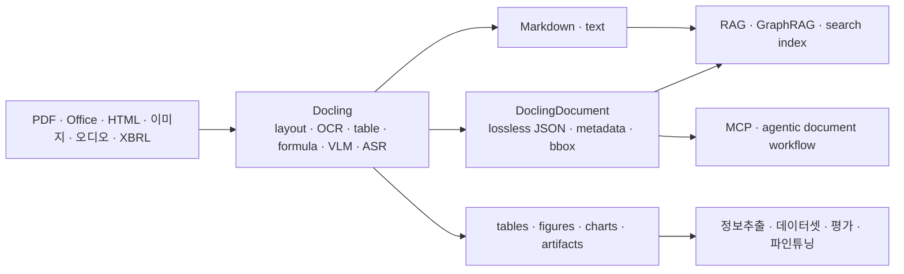

# Docling 유즈케이스 조사

## 요약

Docling은 "RAG 프레임워크"가 아니라 **문서 이해 기반 전처리 엔진**이다. 실제 유즈케이스는 대부분 원본 문서를 `DoclingDocument`, Markdown, JSON, table/image artifact로 변환한 뒤 RAG, 검색, 정보추출, 에이전트, 학습 데이터 생성 파이프라인에 넘기는 형태다.



## 주요 유즈케이스

| 유즈케이스 | 입력 | Docling 출력 | 후단 시스템 | 핵심 가치 |
|---|---|---|---|---|
| RAG 전처리 | PDF, DOCX, PPTX, HTML | Markdown, JSON, chunk metadata | LangChain, LlamaIndex, Haystack, Milvus, Weaviate, Qdrant, OpenSearch | 복잡한 문서를 검색 가능한 구조로 변환 |
| 문서 네이티브 grounding | PDF/보고서 | `DoclingDocument` JSON, page/bbox/provenance | LlamaIndex, custom RAG | 답변 근거를 페이지·영역 단위로 추적 |
| 표 중심 문서 검색 | 재무제표, 기술문서, 리포트 | table structure, table HTML/Markdown, cell metadata | OpenSearch/vector DB/RAG | 표 헤더·행·열 구조 보존 |
| 금융 XBRL 처리 | SEC filing, XBRL XML | 구조화된 `DoclingDocument`/JSON | 재무 분석, RAG, ETL | 공시/재무 데이터의 기계 판독 |
| 스캔 PDF/OCR | 스캔 문서, 이미지 | OCR text, layout item, page metadata | 검색/RAG/문서 QA | 이미지 기반 문서를 텍스트 검색 대상으로 변환 |
| 멀티모달 문서 이해 | 그림, 차트, 수식, 코드 포함 문서 | figure export, chart/table conversion, formula LaTeX | multimodal RAG, report QA | 텍스트 외 요소를 검색/설명 가능하게 변환 |
| 오디오/비디오 처리 | WAV, MP3, MP4 등 | WebVTT/text/DoclingDocument | meeting/video RAG, transcript search | 음성·영상 내용을 문서 파이프라인으로 통합 |
| 정보추출/ETL | 계약서, 논문, 보고서 | 구조화 JSON, tables, section tree | DB/warehouse/KG builder | 문서에서 구조화 데이터 생성 |
| 학습 데이터/파인튜닝 | 대량 문서 코퍼스 | 정제 Markdown/JSON/DocTags | fine-tuning, instruction data, foundation model data prep | 문서 기반 학습 코퍼스 구축 |
| 에이전트/MCP | 문서 파일, `DoclingDocument` | MCP tool 결과, editable document object | Claude Desktop, custom MCP client, agents | agent가 문서 변환·편집·검수 수행 |
| 로컬/폐쇄망 처리 | 민감 기업 문서 | local Markdown/JSON | 사내 RAG/검색 | 데이터 외부 반출 없이 변환 |

## 1. RAG 인제스천 전처리

가장 일반적인 사용 방식이다. Docling이 PDF, Office, HTML, 이미지 등을 구조화된 Markdown/JSON으로 바꾸고, RAG 시스템이 이를 청킹·임베딩·검색 인덱싱한다.

공식 예제는 다음 조합을 제공한다.

- LangChain + DoclingLoader + Milvus + sentence-transformers
- LlamaIndex + DoclingReader + Milvus
- Haystack RAG
- OpenSearch RAG
- Weaviate RAG
- Qdrant retrieval
- MongoDB + VoyageAI
- Azure AI Search

Docling의 RAG 예제는 단순 Markdown export와 JSON 기반 document-native grounding 두 방식을 모두 보여준다. Markdown 방식은 시작이 쉽고, JSON 방식은 page number, bounding box, document item label 같은 메타데이터를 보존하기 좋다.

## 2. OpenSearch 기반 하이브리드 검색

OpenSearch 공식 블로그는 Docling의 구조화 파싱과 OpenSearch vector indexing을 결합한 RAG 파이프라인을 소개한다. 여기서 핵심은 Docling chunk metadata를 OpenSearch의 vector search와 metadata filtering에 같이 쓰는 것이다.

예를 들어 질의가 정량 정보나 표에 집중되어 있다면 `doc_items.label=table` 같은 메타데이터 필터를 걸어 표 chunk를 우선 검색할 수 있다. 또한 RRF 기반 hybrid search를 사용하면 keyword search와 semantic search를 결합해 단순 vector search가 놓친 근거 문단을 찾을 수 있다.

## 3. 표·차트·수식이 많은 문서

Docling은 PDF layout, reading order, table structure, code, formulas, image classification을 다룬다. 공식 예제에도 table export, figure export, chart extraction, code/formula enrichment, visual grounding이 포함되어 있다.

이 유즈케이스는 특히 다음 도메인에 중요하다.

- 증권사 리포트와 기업 공시
- 재무제표와 XBRL 공시
- 제약/의료 논문
- 기술 매뉴얼
- 특허/법률 문서
- 표가 많은 컨설팅/감사 보고서

RAG 관점에서는 표를 단순 텍스트로 풀어버리면 열/행 의미가 깨진다. Docling을 쓰면 표를 별도 item으로 다루고, table-aware chunking이나 table-only retrieval을 구성할 수 있다.

## 4. 금융 XBRL/공시 처리

Docling은 XBRL XML을 지원하며, 공식 예제로 `xbrl_conversion.ipynb`가 제공된다. XBRL은 기업, 규제기관, 금융기관이 재무 정보를 기계 판독 가능한 형식으로 교환하는 표준이다.

금융 서비스에서는 다음 흐름이 가능하다.

```text
XBRL filing / annual report PDF
  -> Docling conversion
  -> JSON/Markdown/table artifact
  -> 재무 지표 ETL 또는 RAG/GraphRAG index
  -> "매출 성장률 변화와 근거 공시 문단" 질의
```

Docling 단독으로 재무 계산 엔진이 되는 것은 아니지만, PDF/XBRL/표를 RAG-friendly representation으로 바꾸는 앞단으로 적합하다.

## 5. 문서 기반 데이터셋 생성과 파인튜닝

Docling technical report는 RAG 외에도 foundation model training/fine-tuning 데이터 준비와 정보추출을 주요 application으로 언급한다. 문서를 Markdown/JSON/DocTags로 안정적으로 변환하면 대량 문서에서 instruction data, domain corpus, evaluation data를 만들기 쉽다.

이 방향의 통합으로는 IBM Data Prep Kit, InstructLab, RHEL AI 등이 문서화되어 있다.

## 6. Agentic workflow와 MCP

Docling은 MCP server를 통해 agent가 문서 변환 기능을 tool로 호출할 수 있게 한다. 공식 문서는 Claude Desktop, LM Studio 등 MCP client에 `docling-mcp-server`를 붙이는 흐름을 제공한다.

Red Hat Developer 사례는 한 단계 더 나아가 `DoclingDocument` 자체를 agent가 편집하는 custom MCP client를 만든 사례다. 이 사례에서는 PDF 변환 결과를 RAG-ready하게 정리하는 작업, 복잡한 리스트를 표로 바꾸는 작업, XML-tagged table description 생성 같은 작업이 agentic 문서 정제 유즈케이스로 제시된다.

## 7. 오디오/비디오 문서화

Docling은 ASR extra를 통해 WAV, MP3, M4A, AAC, OGG, FLAC 같은 오디오와 MP4, AVI, MOV 같은 비디오의 오디오 트랙을 처리할 수 있다. 결과는 WebVTT/text/DoclingDocument 형태로 후단 검색·RAG 파이프라인에 넣을 수 있다.

적용 예시는 다음과 같다.

- 회의 녹취 RAG
- 영상 강의/웨비나 검색
- 콜센터 녹취 요약과 질의응답
- 음성 기반 컴플라이언스 리뷰

## 8. 로컬·폐쇄망 문서 처리

Docling은 local execution을 강조한다. 민감 문서가 많은 기업 환경에서는 외부 SaaS parser로 파일을 보내지 않고 사내 환경에서 PDF/Office를 Markdown/JSON으로 변환할 수 있다는 점이 중요하다.

다만 OCR, VLM, formula/chart extraction을 켜면 모델 weight와 GPU/CPU 리소스 관리가 필요하다.

## 엔지니어 관점 선택 기준

| 상황 | Docling 사용 방식 |
|---|---|
| 빠르게 RAG에 넣고 싶다 | Markdown export 후 기존 chunker 사용 |
| citation과 page grounding이 중요하다 | JSON/DoclingDocument 보존 후 metadata-aware chunking |
| 표·수식·차트가 중요하다 | table/formula/chart enrichment 활성화 |
| 금융 공시·재무 데이터 | XBRL + PDF table extraction 조합 |
| 에이전트가 문서를 직접 변환/수정해야 한다 | docling-mcp 또는 custom MCP client |
| 대량 배치 처리 | batch conversion, GPU/accelerator option, Data Prep Kit 검토 |
| 민감 문서 | local/offline execution 구성 |

## 제한과 주의점

- Docling은 parser/converter이지 RAG runtime이 아니다. 검색, reranking, answer generation은 LangChain, LlamaIndex, Haystack, LightRAG, OpenSearch 등 후단이 담당한다.
- Markdown export는 쉽지만 일부 구조 정보가 손실된다. page/bbox/provenance가 중요하면 JSON/DoclingDocument를 저장해야 한다.
- 표·수식·OCR 품질은 설정과 모델에 따라 달라진다. 금융 문서에서는 단위, footnote, 표 헤더 보존을 별도로 검수해야 한다.
- 고급 enrichment는 비용이 있다. GPU, 모델 다운로드, 배치 크기, OCR 엔진 선택이 운영 성능에 영향을 준다.
- Agentic document editing은 유망하지만 아직 일반적인 안정 제품 패턴이라기보다 emerging use case에 가깝다.

## 참고 소스

- [Docling documentation](https://docling-project.github.io/docling/)
- [Docling RAG with LangChain](https://docling-project.github.io/docling/examples/rag_langchain/)
- [Docling integrations](https://docling-project.github.io/docling/integrations/)
- [IBM Research: Docling for enterprise GenAI](https://research.ibm.com/blog/docling-generative-AI)
- [Docling technical report](https://arxiv.org/html/2408.09869v1)
- [Docling toolkit paper](https://arxiv.org/html/2501.17887v1)
- [OpenSearch: RAG pipelines with Docling and OpenSearch](https://opensearch.org/blog/building-powerful-rag-pipelines-with-docling-and-opensearch/)
- [Red Hat Developer: agentic application for Docling with MCP](https://developers.redhat.com/articles/2025/08/20/how-i-built-agentic-application-docling-mcp)
