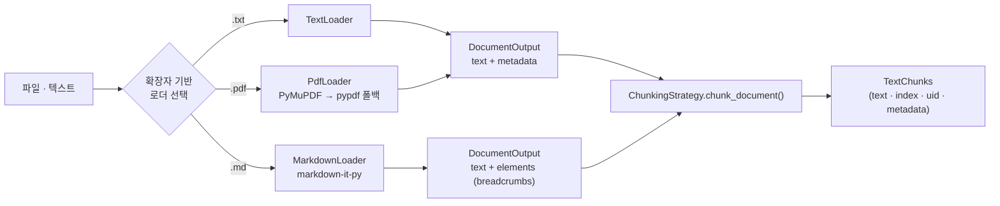

# 02. 로딩 & 청킹 (Ingestion Step 1–2)

> 소스: `ingestion/loaders/`, `ingestion/chunking_strategies/`

수집 파이프라인의 첫 두 단계. 로더가 `DocumentOutput`(텍스트 + 구조 요소)을 만들고, 청커가 `TextChunks`로 분할한다.



## 1. 로더 레이어

인터페이스 (`loaders/base.py:12-38`):

```python
class LoaderStrategy(ABC):
    async def load(self, source: str, ctx: Context) -> DocumentOutput: ...
```

### 1.1 TextLoader (`text_loader.py`)

- UTF-8 텍스트 전체 읽기. `asyncio.to_thread`로 논블로킹
- metadata: `{loader: "text", size_bytes, suffix}`

### 1.2 PdfLoader (`pdf_loader.py:55-126`)

- **PyMuPDF(fitz) 우선, pypdf 폴백** (extras: `[pdf-fast]` AGPL vs `[pdf]` Apache-2.0)
- 핵심 디테일: `page.get_text(sort=True)` — 레이아웃 순서로 정렬해 **표 컬럼 정렬을 보존** → 기술 PDF에서 엔티티 추출 recall에 직접 기여
- 페이지는 `"\n\n"`으로 연결. metadata: `{loader: "pdf", pdf_backend, page_count}`

### 1.3 MarkdownLoader (`markdown_loader.py:57-160`)

- `markdown-it-py` (CommonMark + table 플러그인)로 토큰 파싱
- 출력: 평문 text **+ `elements: list[DocumentElement]`** — StructuralChunking의 입력
- 추출 요소: `header`(h1–h6) · `paragraph` · `list` · `table` · `blockquote` · `code`
- 각 요소에 **breadcrumbs**(헤더 계층 경로, 예: `["Chapter 1", "Section A"]`) 부착
- 의도적 설계: 요소 content는 **raw markdown 원문 그대로** 보존 (표 파이프 `|`, 리스트 대시, 코드 펜스 포함) — LLM 추출기가 구조적 단서(컬럼 정렬, 들여쓰기)에 의존하기 때문

```python
# core/models.py:96-120
class DocumentElement(DataModel):
    type: str                      # "header" | "paragraph" | "list" | "table" | "code" | ...
    content: str | None
    level: int | None              # 헤더 레벨
    breadcrumbs: list[str]         # 루트부터의 헤더 경로
    children: list[DocumentElement]
```

## 2. 청킹 전략 — 5종 전체

인터페이스 (`chunking_strategies/base.py:12-52`):

```python
class ChunkingStrategy(ABC):
    async def chunk(self, text: str, ctx) -> TextChunks: ...
    async def chunk_document(self, document: DocumentOutput, ctx) -> TextChunks:
        return await self.chunk(document.text, ctx)   # 구조 요소 필요한 전략만 오버라이드
```

청크 단위 (`core/models.py:80-86`): `TextChunk(text, index, metadata, uid=uuid4())` — **콘텐츠 해시가 아닌 UUID**. 문서 단위 dedup은 lifecycle API(SHA-256 문서 해시)가 담당.

### 비교표

| 전략 | 알고리즘 | 기본 파라미터 | 토큰 카운트 | LLM 필요 |
|---|---|---|---|---|
| `FixedSizeChunking` | 문자 단위 슬라이딩 윈도우 | size=1000자, overlap=100자 | 없음 (문자) | ✗ |
| `SentenceTokenCapChunking` **(기본값)** | 문장 경계 + 토큰 캡 그리디 머지 | max_tokens=512, overlap_sentences=2 | tiktoken `cl100k_base` | ✗ |
| `StructuralChunking` | 문서 요소(헤더/문단/표) 그룹핑 + 폴백 | max_tokens=512 | tiktoken | ✗ |
| `ContextualChunking` | 베이스 청킹 + LLM 컨텍스트 prefix | max_document_tokens=16,000 | tiktoken | ✓ (청크당 1콜) |
| `CallableChunking` | 임의 함수 어댑터 (LangChain/LlamaIndex 연결) | — | — | — |

### 2.1 FixedSizeChunking (`fixed_size.py:42-75`)

```python
step = chunk_size - chunk_overlap        # overlap >= size면 ValueError
start = 0
while start < len(text):
    end = min(start + chunk_size, len(text))
    chunk_text = text[start:end]
    if chunk_text.strip():               # 공백뿐인 청크 스킵
        chunks.append(TextChunk(..., metadata={start_char, end_char, chunk_size, chunk_overlap}))
    start += step
```

베이스라인용. GraphRAG-Bench에서는 1500자/200 overlap 사용.

### 2.2 SentenceTokenCapChunking — 기본 전략 (`sentence_token_cap.py:51-111`)

**핵심 알고리즘** (이식 가치 가장 높음):

```python
# 1) 문장 분리 — 정규식 lookbehind
_SENTENCE_END = re.compile(r"(?<=[.!?])\s+")
sentences = [s.strip() for s in _SENTENCE_END.split(text.strip()) if s.strip()]

# 2) 문장별 토큰 수 사전 계산
enc = tiktoken.get_encoding("cl100k_base")
token_counts = [len(enc.encode(s)) for s in sentences]

# 3) 그리디 머지: max_tokens 안에서 문장을 누적
start = 0
while start < len(sentences):
    buf, buf_tokens, j = [], 0, start
    while j < len(sentences):
        needed = token_counts[j] + (1 if buf else 0)   # 문장 사이 공백 1토큰
        if buf_tokens + needed <= max_tokens:
            buf.append(sentences[j]); buf_tokens += needed; j += 1
        else:
            break
    if not buf:                       # 단일 문장이 캡 초과 → 그대로 방출
        buf = [sentences[start]]; j = start + 1
    chunks.append(TextChunk(" ".join(buf), ...))

    # 4) overlap: 다음 윈도우를 overlap_sentences 만큼 되감기
    start = max(j - overlap_sentences, start + 1)     # start+1 보장 → 무한루프 방지
```

- metadata: `{strategy, max_tokens, overlap_sentences, token_count, sentence_count, char_count}`
- 주의점: 문장 분리가 단순 정규식(`.!?` 뒤 공백) — 약어("Dr. Kim")·소수점에서 과분리 가능. 한국어 적용 시 kss 등으로 교체 검토

### 2.3 StructuralChunking (`structural_chunking.py:83-209`)

MarkdownLoader의 `elements`를 소비하는 유일한 전략. `chunk_document()` 오버라이드.

알고리즘:
1. 중첩 elements를 평탄화 (공백 content 제외)
2. 각 요소 텍스트에 **breadcrumb prefix** 부착: `"Chapter > Section\n{content}"` (헤더 자신은 prefix 없음 — 중복 방지)
3. 그리디 버퍼 누적: 요소를 `"\n\n"` 구분자로 합치며 max_tokens(512) 이하 유지. 버퍼의 breadcrumbs는 합집합으로 병합
4. **요소 하나가 캡 초과** → 버퍼 flush 후 해당 요소만 폴백 청커(`SentenceTokenCapChunking`)로 위임, 결과 조각에 `[Part i/N]` 표기 + breadcrumb prefix 재부착
5. metadata: `{strategy: "structural_chunking", token_count, breadcrumbs}`

생성자 제약: `fallback_chunker`를 직접 주면 `max_tokens` 등 단축 kwargs와 동시 사용 금지 (TypeError) — 파라미터가 어디에 적용되는지 모호해지는 것을 방지.

### 2.4 ContextualChunking (`contextual_chunking.py:79-213`)

Anthropic의 [Contextual Retrieval](https://www.anthropic.com/news/contextual-retrieval) 구현.

처리 순서:
1. base_chunker(기본 SentenceTokenCap)로 1차 청킹
2. 문서 전문을 `max_document_tokens=16,000` 토큰으로 truncate
3. **청크마다** 아래 프롬프트 생성 → `llm.abatch_invoke(prompts)` 일괄 호출
4. 응답(1–2문장 컨텍스트)을 청크 앞에 `"{context}\n\n{chunk}"`로 prepend. 실패한 청크는 원문 유지
5. **uid는 원본 청크 것을 보존** — 그래프 provenance 연속성

**컨텍스트 생성 프롬프트 원문** (`contextual_chunking.py:23-36`):

```
Here is a document:
<document>
{full_document}
</document>

Here is a chunk from that document:
<chunk>
{chunk_text}
</chunk>

Write a short (1-2 sentence) context that situates this chunk within 
the overall document. Focus on who/what/where so that a reader of only 
this chunk can understand its place in the document. 
Reply with ONLY the context sentences, nothing else.
```

metadata: `{contextual_enriched, context_prefix, original_chunk, strategy: "contextual_chunking", base_strategy, token_count, char_count}` — 원본 청크 텍스트를 metadata에 남겨 디버깅/재처리 가능.

비용: 청크당 LLM 1콜. 문서 전문이 매 프롬프트에 들어가므로 긴 문서 + 많은 청크 = 토큰 비용 급증 (프롬프트 캐싱 미사용 — LiteLLM 경유라 프로바이더 캐싱에 의존).

### 2.5 CallableChunking (`callable_chunking.py:17-81`)

```python
ChunkFn = Callable[[str], list[str]] | Callable[[str], Awaitable[list[str]]]
CallableChunking(fn, strategy_name="custom")
```

- sync/async 자동 감지 (`asyncio.iscoroutinefunction`)
- 외부 프레임워크 의존성을 SDK가 직접 지지 않기 위한 어댑터:

```python
# LangChain
lc = RecursiveCharacterTextSplitter(chunk_size=500, chunk_overlap=50)
chunker = CallableChunking(lc.split_text)

# LlamaIndex
splitter = SentenceSplitter(chunk_size=512, chunk_overlap=50)
chunker = CallableChunking(lambda t: [n.text for n in splitter.get_nodes_from_documents([Document(text=t)])])
```

## 3. 설계 인사이트

1. **토큰 기준 사이징이 기본** — FixedSize 외 전 전략이 tiktoken으로 카운트. 추출 LLM 프롬프트에 청크가 들어가므로 토큰 캡이 곧 추출 비용 캡
2. **합성(composition) 구조** — Structural과 Contextual 모두 내부에 SentenceTokenCap을 폴백/베이스로 합성. 새 전략을 만들 때도 같은 패턴 권장
3. **breadcrumb = 무료 컨텍스트** — ContextualChunking이 LLM으로 사는 것을 StructuralChunking은 문서 구조에서 공짜로 얻음. 구조 있는 문서(md/사내 위키)면 Structural, 비구조 텍스트면 Contextual이 적합
4. **청크 식별자 전략** — uid(UUID) + index + 문서 lifecycle 해시 조합. 콘텐츠 어드레서블 ID가 필요하면(증분 청크 dedup) 직접 추가해야 함
