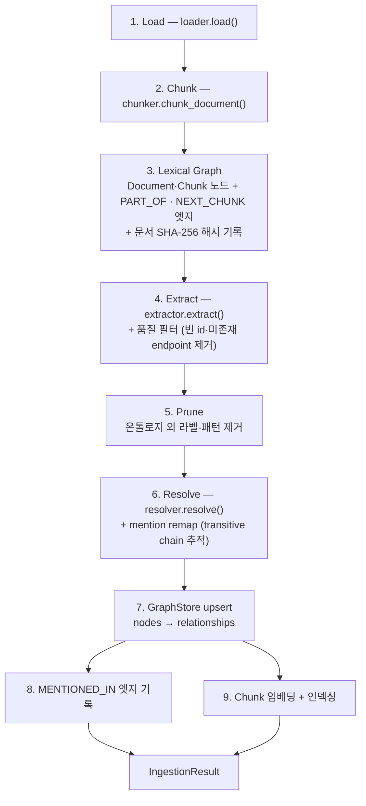
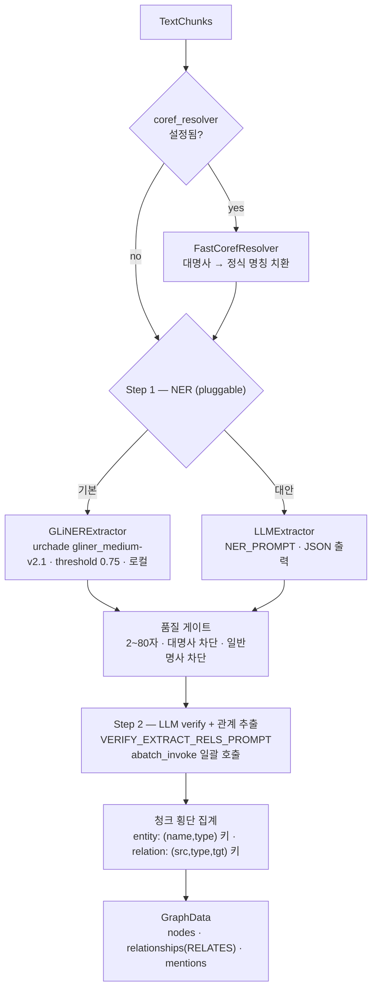

# 03. 추출 & 그래프 구축 (Ingestion Step 3–9)

> 소스: `ingestion/pipeline.py`, `ingestion/extraction_strategies/`, `ingestion/resolution_strategies/`, `storage/`

## 1. IngestionPipeline — 고정 9단계 시퀀스

`ingestion/pipeline.py:120-300`. **의도적으로 DAG가 아닌 고정 선형 시퀀스** — 디버깅 가능성을 우선한 설계 (각 단계가 `ctx.log("Step N/9: ...")` 출력).



단계별 핵심:

| Step | 코드 | 동작 |
|---|---|---|
| 3 | `_build_lexical_graph()` (pipeline.py:302-386) | Document 노드 1개(+ `content_hash` SHA-256) · Chunk 노드 N개 · `PART_OF` N개 · `NEXT_CHUNK` N-1개. **모든 청크가 그래프 노드** — provenance의 토대 |
| 4b | `_filter_quality()` (pipeline.py:474-493) | id/label 없는 노드, endpoint가 노드 집합에 없는 관계 제거 |
| 5 | `_prune()` (pipeline.py:387-472) | 온톨로지에 entities가 선언돼 있으면 그 라벨만 유지(단 "Unknown"은 항상 유지). relations의 `(src,tgt)` 패턴 불일치 관계 제거, 방향 반전 의심 시 경고 로그 |
| 6 후처리 | `_remap_mentions()` (pipeline.py:495-528) | resolver가 돌려준 `remap`(loser→survivor)을 **transitive하게 추적**해 mention의 entity_id 교체 |
| 8 | `_write_mentions()` (pipeline.py:530-558) | `(entity_id, chunk_id)` dedup 후 `MENTIONED_IN` 일괄 upsert. **run() 반환 전에 반드시 완료** — 동시 update의 고아 엔티티 정리 레이스 방지 |
| 8·9 병렬 | pipeline.py:269 | `asyncio.gather(_step_mentions(), _step_index_chunks())` |

## 2. Step 4 상세 — GraphExtraction (2단계 하이브리드 추출)

`ingestion/extraction_strategies/graph_extraction.py:398-953`



### Step 1 — 엔티티 NER (pluggable)

**GLiNERExtractor (기본)** (`entity_extractors.py:310-364`)
- 모델 `urchade/gliner_medium-v2.1`, confidence threshold **0.75**, lazy load + `threading.Lock`
- `asyncio.to_thread`로 비동기 래핑, `Semaphore(max_concurrency or 12)` 동시 실행
- LLM 0콜 — 비용 절감의 핵심. 단, 영어 중심 모델

**LLMExtractor (대안)** — `NER_PROMPT` 사용 ([06 문서](06-prompts-reference.md#1-ner-프롬프트) 원문). `abatch_invoke`로 청크 일괄 처리.

**품질 게이트** (`entity_extractors.py:45-150`) — 두 추출기 공통:
- 이름 2–80자
- 대명사 차단 리스트 (he/she/they/it/...)
- 일반 지칭 차단 리스트 (narrator/author/the man/people/story/chapter/...)
- `label_for_type()`: 타입 문자열 정규화(소문자·공백/언더스코어 제거) 후 온톨로지 타입에 매핑, 실패 시 `"Unknown"`

**기본 엔티티 타입 11종** (온톨로지 미지정 시): Person, Organization, Technology, Product, Location, Date, Event, Concept, Law, Dataset, Method

### (선택) 코어퍼런스 해소 — FastCorefResolver (`coref_resolvers.py:72-172`)

- 모델 `biu-nlp/lingmess-coref`. NER **전에** 청크 텍스트의 대명사를 정식 명칭으로 치환
- 클러스터별 canonical mention = 가장 긴 비대명사 span. 소유격은 `"Name's"`로 변환. 오프셋 보존 위해 우→좌 순서로 치환
- 실패 시 원문으로 폴백 (경고 로그만)

### Step 2 — LLM 검증 + 관계 추출

청크별로 Step 1 엔티티를 JSON으로 직렬화해 `VERIFY_EXTRACT_RELS_PROMPT`에 삽입 → `abatch_invoke` 일괄 호출. 프롬프트가 LLM에 시키는 일:

1. **VERIFY**: 텍스트에 없는 엔티티 제거, 이름 교정, 누락 추가. 특히 연산자 토큰(`+=`, `->`), 셸 약어(`cd`, `ls`), 1–2자 일반 토큰 제거 규칙 명시
2. **EXTRACT**: 검증된 엔티티 간 모든 관계. 관계 `description`은 "원문 없이 이해 가능한 standalone fact" — **이 문장이 그대로 임베딩됨**
3. span_start/span_end (증거 문장 오프셋) 요구

응답 파싱 (`_parse_step2_response()`, graph_extraction.py:680-786):
- 마크다운 펜스 제거 → JSON 파싱 (실패 시 경고 + 빈 결과, **Step 1 엔티티로 폴백**)
- 엔티티 이름 재검증, 타입에 `/()` 포함 시 거부
- 온톨로지 선언 속성은 `_coerce_attributes()`로 타입 강제 변환 (STRING/INTEGER/FLOAT/BOOLEAN/DATE/LIST — bool→int 오염 방지, ISO 날짜 파싱, 스칼라→리스트 래핑)

Step 1 메타데이터 병합 (`_merge_step1_metadata()`): GLiNER의 span·confidence를 이름 매칭으로 Step 2 결과에 이식. LLM이 새로 찾은 엔티티는 `text.lower().find()`로 span 계산.

### 집계와 GraphData 변환

- 엔티티 dedup 키: `(name.lower(), type.lower())` — description은 최장 것 유지, `source_chunk_ids`·spans 병합, attributes는 last-write-wins
- 관계 dedup 키: `(source.lower(), type.lower(), target.lower())`
- **노드 ID**: `compute_entity_id(name, type)` — 타입 한정 결정적 ID
- **관계는 전부 단일 엣지 타입 `RELATES`** + properties에 의미 보존:

```python
GraphRelationship(type="RELATES", properties={
    "rel_type": "WORKS_AT",                       # 의미적 관계 타입
    "fact": "{source, type, target}: description", # 임베딩 대상 문자열
    "description": ..., "source_chunk_ids": [...],
    "src_name": ..., "tgt_name": ..., "spans": {...},
})
```

→ 엣지 타입을 고정하면 벡터 인덱스를 `RELATES` 하나에만 만들면 되고, Cypher에서 `r.rel_type` 필터로 의미 타입을 다룬다. (트레이드오프: 타입별 그래프 알고리즘 적용은 불리)

## 3. Step 6 상세 — 엔티티 해소 4종

`ingestion/resolution_strategies/`. 모두 `(이름, 라벨)` 그룹핑 — "Paris(Person)"와 "Paris(Location)"의 오병합 방지가 공통 원칙.

| 전략 | 방식 | 주요 파라미터 | LLM | 임베더 |
|---|---|---|---|---|
| `ExactMatchResolution` **(기본)** | `(label, id)` 그룹 → 첫 노드에 병합 | resolve_property="id" | ✗ | ✗ |
| `DescriptionMergeResolution` | `(정규화 이름, label)` 그룹 + description 병합 | force_summary_threshold=3 | 선택 (요약) | ✗ |
| `SemanticResolution` | exact 병합 → 라벨 내 임베딩 fuzzy 병합 | similarity=0.95, ann_top_k=50 | 선택 | 필수 |
| `LLMVerifiedResolution` | 3-tier: hard merge / LLM 검증 / skip | hard=0.95, soft=0.80, max_llm_pairs=500 | 필수 | 필수 |

### LLMVerifiedResolution의 3-tier 분류 (가장 정교)

`llm_verified_resolution.py:42-459`

1. exact 병합 (cross-label 병합은 LLM YES/NO 검증 통과 시만 — 프롬프트는 [06 문서](06-prompts-reference.md#7-해소-프롬프트))
2. 라벨 그룹별로 이름 임베딩 → **hnswlib HNSW** (`space='ip'`, M=32, ef_construction=200) KNN
3. 쌍 분류:
   - `sim >= 0.95` → 즉시 병합 (LLM 생략)
   - `0.80 <= sim < 0.95` → **scipy 평균연결 계층 클러스터링**으로 선필터: 같은 클러스터(컷 거리 `1-hard`) 쌍은 자동 병합, 클러스터 경계 쌍만 LLM에 YES/NO 질의 (유사도 내림차순, 최대 500쌍)
   - `sim < 0.80` → skip
4. description 3개 이상 모이면 LLM 요약 (max 500토큰)

### 전역 Deduplicator (`storage/deduplicator.py`)

해소 전략이 **단일 수집 배치 내** dedup이라면, `finalize()`/`deduplicate_entities()`가 호출하는 Deduplicator는 **그래프 전체** 대상:
- Phase 1: `(정규화 이름, 라벨)` exact — survivor는 description 최장 노드. RELATES/MENTIONED_IN 엣지를 survivor로 remap하며 `source_chunk_ids` **union** (Cypher의 `old + [c IN contrib WHERE NOT c IN old]` 패턴)
- Phase 2 (fuzzy=True): 이름 임베딩 블록 단위(1000개) 코사인 행렬, threshold 0.9, 같은 라벨만

## 4. Step 7–9 상세 — 저장 레이어

### GraphStore (`storage/graph_store.py`)

노드 upsert — 라벨별 그룹핑 후 배치(500개):

```cypher
UNWIND $batch AS item
MERGE (n:`{safe_label}` {id: item.id})
SET n += item.properties
SET n:__Entity__          -- Chunk/Document 외 모든 엔티티에 공통 라벨 부여
```

- `__Entity__` 공통 라벨 덕에 검색 쿼리가 타입 무관하게 `MATCH (e:__Entity__)` 가능
- 라벨은 `sanitize_cypher_label()`(백틱 제거, `utils/cypher.py`)로 인젝션 방지 — 값은 전부 `$param` 바인딩
- 제어문자 제거(탭/개행 제외), dict 속성은 JSON 직렬화, None 드롭
- 배치 실패 시 아이템 단위 폴백

관계 upsert — RELATES만 특수 처리 (provenance union):

```cypher
UNWIND $batch AS item
MATCH (a:`{src}` {id: item.start_id}), (b:`{tgt}` {id: item.end_id})
MERGE (a)-[r:`RELATES`]->(b)
WITH r, item, coalesce(r.source_chunk_ids, []) AS old,
     coalesce(item.properties.source_chunk_ids, []) AS contrib
SET r += item.properties
SET r.source_chunk_ids = old + [c IN contrib WHERE NOT c IN old]
```

**`source_chunk_ids`를 덮어쓰지 않고 union하는 것이 핵심** — 문서 A·B가 같은 fact를 지지할 때, A 삭제 시 B의 지지가 남아 있으면 엣지를 살린다 (`delete_stale_relationships`가 old_chunks를 빼고 리스트가 비면 그때 DELETE).

### VectorStore (`storage/vector_store.py`)

벡터 인덱스 3종 — 전부 FalkorDB 네이티브 (외부 벡터 DB 없음):

```cypher
CREATE VECTOR INDEX FOR (n:Chunk)      ON (n.embedding) OPTIONS {dimension: D, similarityFunction:'cosine'}
CREATE VECTOR INDEX FOR (n:__Entity__) ON (n.embedding) OPTIONS {...}
CREATE VECTOR INDEX FOR ()-[e:RELATES]->() ON (e.embedding) OPTIONS {...}   -- 엣지 벡터 인덱스!
```

- 임베딩 쓰기: `SET c.embedding = vecf32($vector)` (UNWIND 배치 500)
- KNN 검색: `CALL db.idx.vector.queryNodes('Chunk','embedding',$top_k,vecf32($v))` / 엣지는 `queryRelationships` (FalkorDB < 4.2면 `vec.cosineDistance` 전체 스캔 폴백)
- fulltext: `CALL db.idx.fulltext.queryNodes(...)` + RediSearch 특수문자 이스케이프
- 기본 차원 **256** (1..8192)

### finalize()에서 일어나는 임베딩 (api/main.py:2955-3007)

수집 시점에는 **청크만** 임베딩(Step 9). 엔티티·관계 임베딩은 `finalize()`로 지연:
1. NULL-name stub 엔티티 제거
2. 전역 exact dedup
3. 엔티티 임베딩 backfill (name 기준)
4. **RELATES 엣지의 `fact` 문자열 임베딩** — fact 단위 벡터 검색의 재료
5. 인덱스 보장

→ dedup **후에** 임베딩하므로 중복 엔티티에 임베딩 비용을 낭비하지 않는 순서 설계.

## 5. 문서 lifecycle — update/delete의 crash-safety

`api/main.py:1916-2315` + `graph_store.py` 문서 쿼리들.

`update()` 상태 머신:
1. 새 텍스트 로드 → SHA-256 비교, 동일하면 `no_op=True` 즉시 반환
2. 스냅샷: 기존 문서의 엔티티 후보·청크 id 수집
3. **pending document id**로 새 버전 전체 수집 (기존 버전 무손상)
4. cleanup 상태를 pending 노드에 기록
5. **commit point**: `SET p.ready_to_commit = true` — 이 한 줄이 원자적 경계. 이전 크래시 = 롤백, 이후 크래시 = roll-forward
6. cutover: 구 청크 삭제, pending을 canonical로 rename
7. cleanup: stale RELATES(`source_chunk_ids`에서 구 청크 제거 → 빈 엣지 삭제) + 고아 엔티티(`NOT (e)-[:MENTIONED_IN]->()`) DETACH DELETE

`apply_changes(added, modified, deleted)`는 **deleted → modified → added** 순서 고정 — 피크 엔티티 cardinality 최소화.

## 6. BackfillExecutor (온톨로지 진화용 재스캔)

`ingestion/backfill.py:163-261` — 온톨로지에 속성/엔티티/관계 패턴이 추가될 때 기존 청크를 재스캔:
- 워커 풀(기본 4) + 큐(2×concurrency), 청크별 실패 허용(`failed_chunks` 수집)
- **멱등성**: 청크 노드의 `extracted_ops` 리스트에 결정적 `op_id` 마킹 — 재실행 시 처리된 청크 스킵
- 사용처: `add_attribute()`, `backfill_entity()`, `backfill_relation_pattern()` ([05 문서](05-ontology-discovery-evolution.md))
