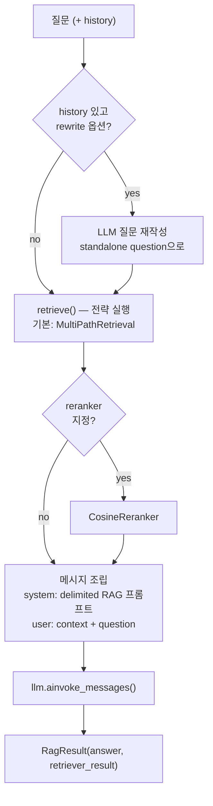
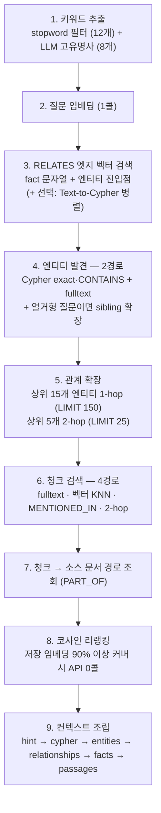

# 04. 검색 파이프라인 (질의 시점)

> 소스: `retrieval/router.py`, `retrieval/strategies/`, `retrieval/reranking_strategies/`, `api/main.py` (completion)

## 1. 질의 전체 흐름 — `completion()`

`api/main.py:2647-2774`



1. 온톨로지 lazy 로드, history 검증
2. (선택) follow-up 질문을 LLM으로 standalone 질문으로 재작성 (프롬프트: [06 문서](06-prompts-reference.md#9-질문-재작성))
3. `retrieve()` → 전략 실행 → `RetrieverResult` (섹션별 items)
4. 메시지 조립: system은 `_RAG_SYSTEM_PROMPT_DELIMITED` (컨텍스트를 untrusted로 명시), user는 `<context>{...}</context>\n\nQuestion: ...` 템플릿. 문서 텍스트 안의 literal `</context>`는 무력화 처리
5. LLM 호출 → `RagResult`

## 2. SemanticRouter — 룰 기반 라우팅

`retrieval/router.py:19-99`

- `register(name, strategy, condition)` — condition은 `Callable[[str], bool]`
- `_select()`: 등록 순서대로 첫 매치 승. 예외는 skip. 매치 없으면 default
- **LLM 라우팅 없음** (v1). 사용자가 `lambda q: "how many" in q.lower()` 같은 술어를 직접 등록

모든 전략은 Template Method 패턴 (`strategies/base.py:21-140`): `search()`가 검증·타이밍·에러 래핑을 담당하고 서브클래스는 `_execute()`만 구현.

## 3. LocalRetrieval — 단순 전략

`strategies/local.py` — 질문 임베딩 → Chunk 벡터 KNN(top_k=5) → 청크별 1-hop 연결 엔티티 부착(`MATCH (c {id:$cid})-[*1..h]-(e:__Entity__) ... LIMIT 50`).

## 4. MultiPathRetrieval — 기본 전략, 9-phase

`strategies/multi_path.py:58-415`. 생성 파라미터: `chunk_top_k=15, max_entities=30, max_relationships=20, rel_top_k=15, keyword_limit=10, enable_cypher=False`.



### Phase 1 — 키워드 추출 (multi_path.py:362-391)

이중 경로:
- **단순**: 정규식으로 구두점 제거 → 90+ 스톱워드 필터 → 3자 이상 단어 12개
- **LLM**: 1콜로 고유명사 추출 — `"Extract ALL proper nouns, character names, ... Return them comma-separated"` → 최대 8개

### Phase 3 — RELATES 엣지 벡터 검색 (entity_discovery.py:28-71)

`vector_store.search_relationships(query_vector, top_k=15)` → fact 문자열 `"Alice —[WORKS_AT]→ Acme: senior engineer"` + 양 끝 엔티티를 Phase 4 진입점으로 수확.

점수 필터 (`filter_facts_by_relevance`, result_assembly.py:86-116): **상위 3개는 무조건 유지**, 이후 `score >= 0.25`인 것만 최대 12개 — 빈 컨텍스트 방지와 노이즈 컷의 절충.

`enable_cypher=True`면 Text-to-Cypher(§5)가 `asyncio.gather`로 병렬 실행.

### Phase 4 — 엔티티 발견 (entity_discovery.py:74-217)

- **Pass A1**: `UNWIND $keywords ... MATCH (e:__Entity__) WHERE toLower(e.name) = toLower(kw) LIMIT 3` (키워드별 exact)
- **Pass A2**: `WHERE toLower(e.name) CONTAINS toLower(kw) ... ORDER BY size(e.name) ASC LIMIT 5` — **짧은 이름 우선** 정렬로 부분 일치 노이즈 억제
- **Path B**: 키워드 상위 6개 fulltext 엔티티 검색 (top 3)
- Phase 3 엣지 엔티티 + Cypher 엔티티 병합 (출처 라벨 보존: `cypher_exact`/`fulltext`/`rel_vector`)
- **열거형 질문 감지**: `every|each|list all|name all|...` 정규식 매치 시 **sibling 확장** — 이미 발견된 엔티티 2개 이상과 연결된 허브 엔티티의 다른 이웃을 최대 20개 추가 ("등장인물 전부 나열해" 류 질문의 recall 보강)

### Phase 5 — 관계 확장 (relationship_expansion.py:15-95)

```cypher
-- 1-hop: 상위 15개 엔티티
UNWIND $eids AS eid
MATCH (a:__Entity__ {id: eid})-[r:RELATES]->(b:__Entity__)
RETURN a.name, r.rel_type, b.name, COALESCE(r.fact, r.description, '') LIMIT 150

-- 2-hop: 상위 5개만 (폭발 방지)
MATCH (a {id: eid})-[r1:RELATES]->(b)-[r2:RELATES]->(c) RETURN ... LIMIT 25
```

`(src, rel, tgt)` 키로 dedup → `"A —[REL]→ B: fact"` / `"A —[R1]→ B —[R2]→ C"` 문자열.

### Phase 6 — 청크 검색 4경로 (chunk_retrieval.py:15-142)

| 경로 | 쿼리 | 비고 |
|---|---|---|
| A. fulltext | 질문 + LLM kw 6 + 단순 kw 4 각각 top-5 | |
| B. 벡터 | 질문 임베딩 KNN top-15 | |
| C. MENTIONED_IN | 엔티티 15개의 멘션 청크, **엔티티별 질문 코사인 거리 상위 3개** | `vec.cosineDistance`로 정렬 후 `COLLECT(c)[..3]` — 허브 엔티티(100+ 청크)에서 임의 3개가 아닌 질문 관련 3개 선택 (issue #258 수정) |
| D. 2-hop | 엔티티 10개 → RELATES 이웃 → 그 멘션 청크 LIMIT 20 | 간접 컨텍스트 |

마지막에 후보 청크들의 **저장된 임베딩을 일괄 fetch** — Phase 8 재료.

### Phase 8 — 코사인 리랭킹 (result_assembly.py:28-83)

- **fast path**: 저장 임베딩이 후보의 ≥90% 커버하면 그래프에서 가져온 벡터로 numpy 코사인 계산 — **임베딩 API 0콜**
- fallback: 후보 전체 재임베딩 1콜
- top `chunk_top_k=15` 선택 후 `[Source: {document.path}]` prefix 부착

### Phase 9 — 컨텍스트 조립 (result_assembly.py:119-238)

질문 유형 감지(`detect_question_type`): yes/no·who·where·when·how many 시작 패턴 → **답변 형식 힌트 문자열**을 컨텍스트 맨 앞에 삽입 (예: `"Answer format: This is a yes/no question — start with Yes or No"`).

최종 섹션 순서 (각각 `RetrieverResultItem` + `metadata.section` 태그):

```
1. hint            — 답변 형식 힌트
2. cypher_results  — ## Graph Query Results (리랭킹 미적용, LLM 직행)
3. entities        — ## Key Entities (이름: 설명, 최대 25)
4. relationships   — ## Entity Relationships (최대 20)
5. facts           — ## Knowledge Graph Facts (엣지 벡터 검색, 최대 15)
6. passages        — ## Source Document Passages ([Source: path] 포함, 최대 15)
```

## 5. Text-to-Cypher (선택 경로)

`strategies/cypher_generation.py` — `enable_cypher=True`일 때 Phase 3과 병렬.

### 스키마 직렬화 → 프롬프트

`render_ontology_block()` (cypher_generation.py:71-130): 온톨로지를 마크다운 스키마 블록으로 — 엔티티 라벨별 속성(예약 키 `name`/`description` 포함), RELATES 엣지 속성(`rel_type`/`fact`/`src_name`/`tgt_name`), 허용 `rel_type` 값 목록, 구조 엣지(MENTIONED_IN/PART_OF/NEXT_CHUNK). LangChain `Neo4jGraph.get_schema()`와 같은 접근.

프롬프트 전문은 [06 문서](06-prompts-reference.md#8-text-to-cypher) — FalkorDB 특화 규칙이 핵심:
- `shortestPath()` 금지 (FalkorDB Path 타입 미스매치), RETURN 컬럼 별칭 필수, MATCH 1–2개 + LIMIT 25, READ-ONLY만
- **rel_type 추측 대신 엔티티 타입 라벨로 라우팅** 전략 명시 + few-shot 6개

### 생성 → 검증 → 새니타이즈 → 실행 루프

```
generate_cypher() (최대 3회):
  LLM 호출 → extract_cypher (``` 펜스 파싱)
  → validate_cypher:  allowlist(MATCH/OPTIONAL MATCH/UNWIND/WITH 시작)
                      + 거부(CALL, LOAD CSV, 쓰기 키워드, 다중 statement, RETURN 누락)
                      + 라벨이 온톨로지에 존재하는지 검사
  → 실패 시 에러를 프롬프트에 피드백으로 추가해 재시도
  → _sanitize_cypher: shortestPath 제거, path= 제거, LIMIT 25 자동 부착
실행 실패/생성 실패 → 빈 결과 (silent degradation, MultiPath의 다른 경로가 보완)
```

결과 행은 ` | ` 구분 문자열로 평탄화되어 `cypher_results` 섹션으로 직행 (리랭킹 비대상).

## 6. CosineReranker (선택 후처리)

`reranking_strategies/cosine.py:18-80` — `completion(reranker=...)`로 주입하는 합성 레이어. 질문+아이템 전체를 1콜 배치 임베딩 → 코사인 정렬 → top_k(15). MultiPath는 내부 리랭킹이 이미 있어 주로 Local 등 단순 전략과 조합.

## 7. 엔지니어 관점 평가

- **recall 우선 + 후단 컷 설계**: 4경로 청크 검색·2경로 엔티티 발견으로 후보를 넓게 모은 뒤 코사인 리랭킹과 섹션별 cap(15~25)으로 자름. 정밀도는 최종 LLM의 컨텍스트 선별 능력에 위임
- **LLM 콜 수가 예측 가능**: 기본 경로에서 질의당 LLM 1콜(키워드) + 임베딩 1콜(질문) + (조건부) 리랭킹 임베딩. Text-to-Cypher 켜면 +1~3콜
- **약점**: 글로벌 질문("이 코퍼스의 주요 테마는?")에 대응하는 커뮤니티 요약/global search가 없음 — 모든 경로가 엔티티/청크 지역 검색. MS GraphRAG와의 가장 큰 기능 차이
- 자체 구현 시: Phase 6-C의 "엔티티별 멘션 청크를 질문 코사인으로 상위 3개 선별" 패턴과 Phase 8의 "저장 임베딩 재사용 fast path"는 비용 대비 효과가 커서 우선 이식 권장
