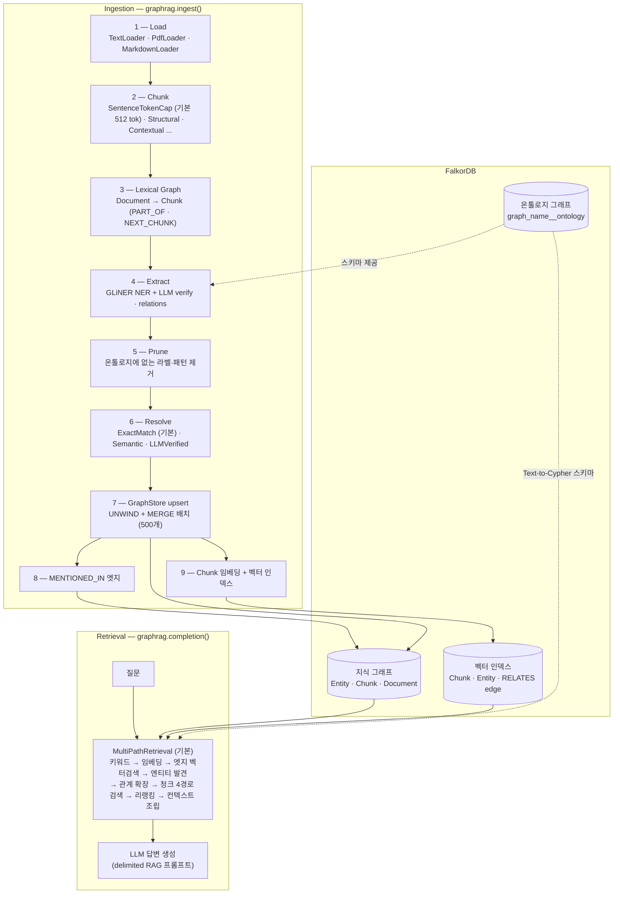

# FalkorDB GraphRAG-SDK 코드 레벨 분석

> 분석 대상: [FalkorDB/GraphRAG-SDK](https://github.com/falkorDB/GraphRAG-SDK) v1.3.0 (commit `0ab92ba`, 2026-06-04)
> 분석 방법: repo 클론 후 소스코드 단위 분석 (`.repos/GraphRAG-SDK`)
> 소스 루트: `graphrag_sdk/src/graphrag_sdk/`

FalkorDB(Redis 모듈 기반 그래프 DB) 위에 지식 그래프 + 벡터 하이브리드 RAG를 구축하는 Python SDK.
문서를 **로딩 → 청킹 → 추출 → 해소(dedup) → 저장 → 검색** 순서의 고정 파이프라인으로 처리하며,
모든 단계가 Strategy 패턴으로 교체 가능하다.

## 문서 구성 (데이터 처리 순서)

| # | 문서 | 다루는 단계 |
|---|---|---|
| 1 | [아키텍처 & 코어 레이어](01-architecture-core.md) | 공개 API(`GraphRAG` facade), 데이터 모델, LLM/임베딩 프로바이더, FalkorDB 커넥션 |
| 2 | [로딩 & 청킹](02-loading-chunking.md) | **Step 1–2**: 로더 3종, 청킹 전략 5종 (알고리즘·파라미터·토크나이저 상세) |
| 3 | [추출 & 그래프 구축](03-extraction-graph-construction.md) | **Step 3–9**: lexical graph, 2단계 엔티티/관계 추출, 온톨로지 프루닝, 엔티티 해소, 그래프/벡터 저장 |
| 4 | [검색 파이프라인](04-retrieval-pipeline.md) | 질의 시점: 라우팅, MultiPath 9단계 검색, Text-to-Cypher, 리랭킹, 답변 생성 |
| 5 | [온톨로지 자동 발견 & 진화](05-ontology-discovery-evolution.md) | `Ontology.from_sources()` 발견 파이프라인, 온톨로지 lifecycle(rename/backfill/evolve) |
| 6 | [프롬프트 레퍼런스](06-prompts-reference.md) | SDK 내 **모든 LLM 프롬프트 원문** 모음 (추출·해소·검색·발견·QA) |

## 한눈에 보는 전체 데이터 흐름

## 프로젝트 개요 (Problem Statement)

- **해결하려는 문제**: 순수 벡터 RAG는 멀티홉 질문·엔티티 중심 질문·열거형 질문에 약하다. GraphRAG-SDK는 청크(벡터)와 엔티티/관계(그래프)를 **하나의 FalkorDB 인스턴스**에 함께 저장하고, 검색 시 두 경로를 병합해 이 한계를 보완한다.
- **차별점**:
  - 단일 DB(FalkorDB)에 그래프 + 벡터 인덱스 + fulltext 인덱스를 모두 둠 — Neo4j+Pinecone식 이중 인프라 불필요
  - 추출이 **GLiNER(로컬 NER) → LLM 검증** 2단계 하이브리드 — LLM 단독 추출 대비 비용 절감
  - **관계(RELATES) 엣지 자체를 임베딩**해서 fact 단위 벡터 검색 가능 (LightRAG의 relation embedding과 유사)
  - 온톨로지(스키마)가 별도 그래프에 영속화되고, 진화(rename/add/backfill) API가 crash-safe 상태 머신으로 구현됨
  - incremental update(`update`/`delete_document`/`apply_changes`)가 SHA-256 해시 + 2-phase commit으로 동작
- **경쟁/비교 대상**: Microsoft GraphRAG(배치 중심·커뮤니티 요약), LightRAG(dual-level retrieval), neo4j-graphrag-python(Neo4j 종속), LlamaIndex PropertyGraphIndex. 이 repo의 횡단 비교는 [graphrag-comparison](../graphrag-comparison/README.md) 참고.

## 기술 스택 요약

| 레이어 | 기술 |
|---|---|
| 저장소 | FalkorDB (그래프 + 벡터 인덱스 + RediSearch fulltext) |
| LLM | LiteLLM 래퍼 (모든 프로바이더), OpenRouter 직접 지원 |
| 로컬 NER | GLiNER (`urchade/gliner_medium-v2.1`, threshold 0.75) |
| 코어퍼런스 해소 | fastcoref (`biu-nlp/lingmess-coref`, 선택적) |
| 토크나이저 | tiktoken `cl100k_base` (청킹 토큰 카운트) |
| 문서 파싱 | PyMuPDF/pypdf (PDF), markdown-it-py (Markdown) |
| ANN (엔티티 해소) | hnswlib (HNSW, inner-product) + scipy 계층 클러스터링 |
| 데이터 모델 | Pydantic v2 |
| 비동기 | asyncio 우선 설계, sync 래퍼 제공 |

## 종합 평가 (엔지니어 관점)

**강점**
- 파이프라인이 의도적으로 "고정 선형 시퀀스"(DAG 아님) — 디버깅·로깅이 단순하고 각 단계가 Strategy로 독립 교체 가능
- 청크 → 엔티티 → 관계의 **provenance 체인이 강제** (`source_chunk_ids` union, MENTIONED_IN 엣지) — 문서 업데이트 시 stale fact 정리가 정확함
- 프롬프트 인젝션 방어가 기본값 (RAG 컨텍스트 `<context>` 태그 + untrusted 명시, 발견 파이프라인의 `<<<UNTRUSTED INPUT>>>` 구분자)
- 운영 내구성: circuit breaker, latency budget, binary-split 임베딩 재시도, crash-safe 문서 업데이트

**약점/리스크**
- FalkorDB 종속 (Cypher 방언·`vecf32`·`db.idx.vector.*` 프로시저) — 다른 그래프 DB로 이식 어려움
- 라우터가 룰 기반 콜백뿐 (LLM 라우팅 없음), 커뮤니티 요약/글로벌 서치 부재 (MS GraphRAG의 global search에 해당하는 기능 없음)
- GLiNER·fastcoref는 영어 중심 모델 — 한국어 문서에는 `LLMExtractor`로 대체 필요
- 청크 ID가 UUID 기반(콘텐츠 해시 아님) — 동일 문서 재수집 시 청크 단위 dedup은 문서 lifecycle API에 의존

**우리 프로젝트에 적용 시 핵심 포인트** (자체 구현 최적화 관점)
1. 청킹: `SentenceTokenCapChunking`(문장 경계 + 토큰 캡 + 문장 overlap) 알고리즘이 단순하면서 효과적 — [02 문서](02-loading-chunking.md)의 그리디 머지 로직 그대로 이식 가능
2. 추출: 로컬 NER로 후보를 뽑고 LLM이 검증+관계 추출하는 2단계 구조가 비용/품질 균형점 — 한국어면 NER 단계를 LLM 또는 한국어 NER로 교체
3. 관계 임베딩: RELATES 엣지에 `fact` 문자열을 만들어 임베딩하는 패턴은 fact 단위 검색 품질에 직접 기여
4. 프롬프트: [06 문서](06-prompts-reference.md)의 전체 프롬프트가 출발점 — 특히 verify+extract 프롬프트의 엔티티 제거 규칙(연산자 토큰, 1–2자 토큰)이 노이즈 억제에 중요
