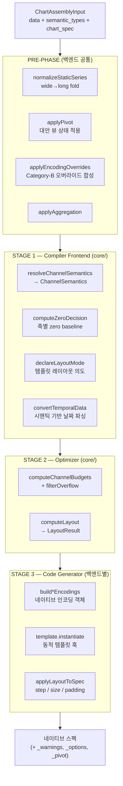
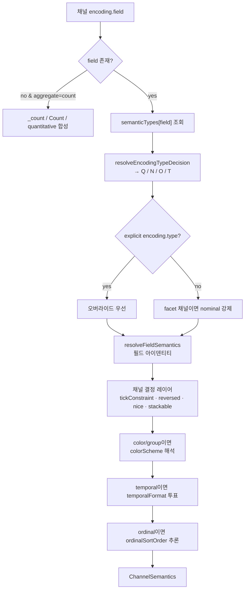
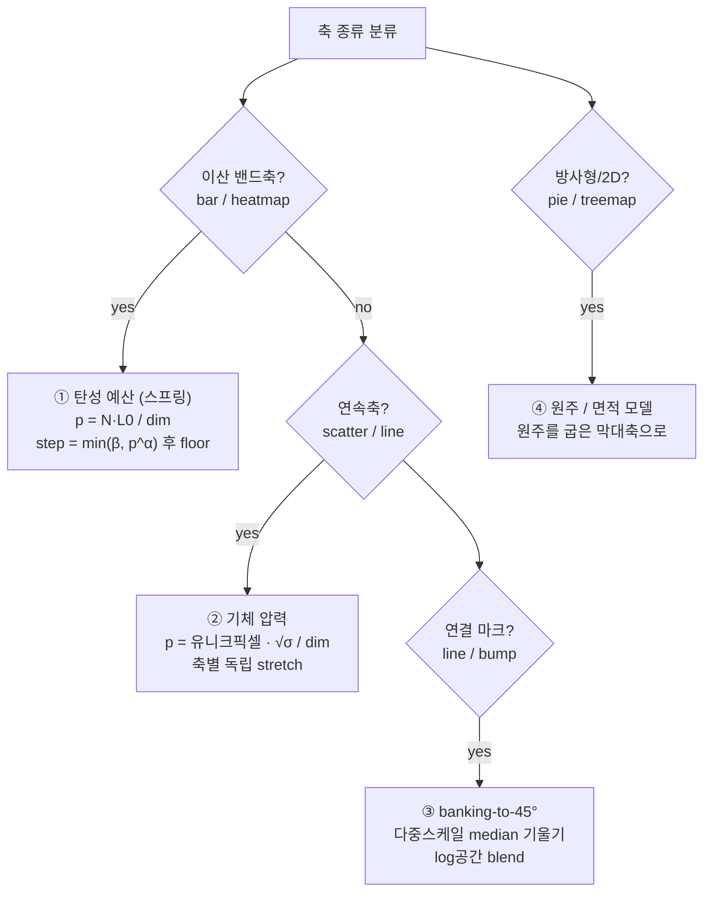
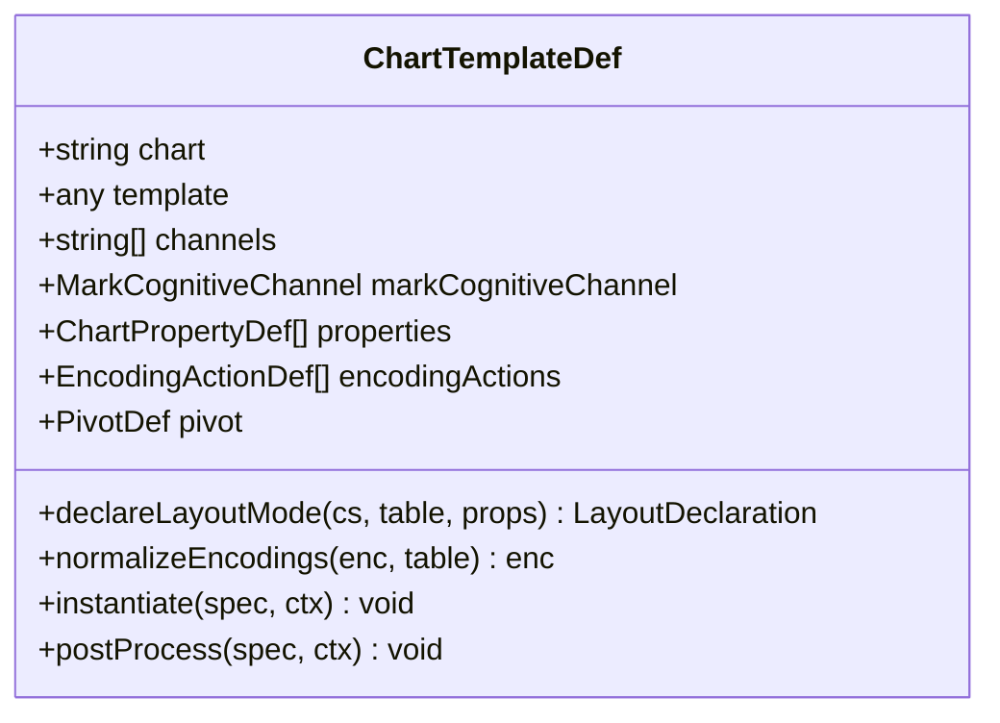
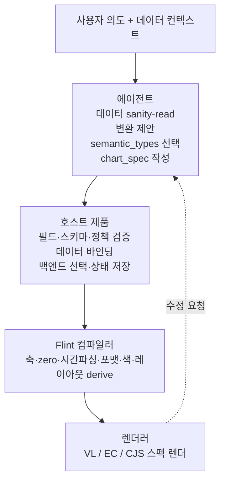
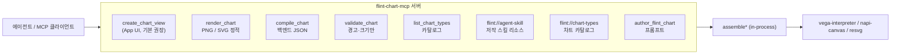
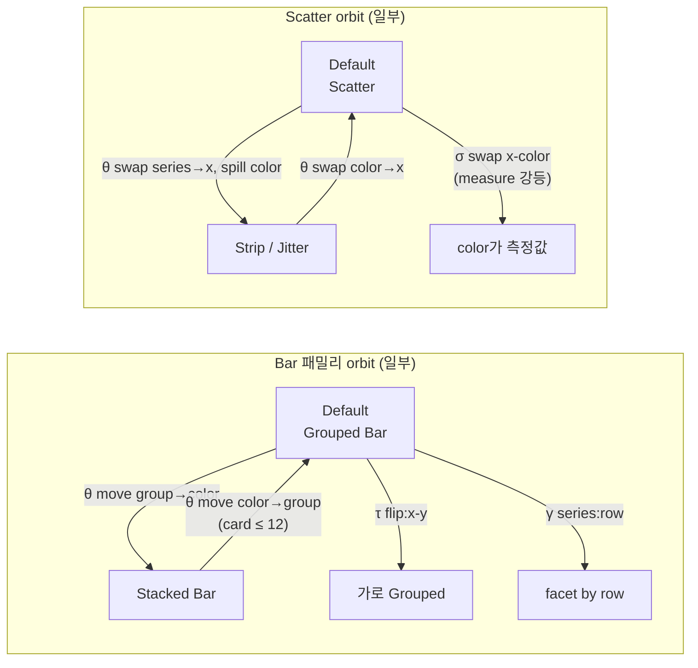

# Flint (microsoft/flint-chart) — 코드 레벨 심층 분석

> **분석 대상**: [microsoft/flint-chart](https://github.com/microsoft/flint-chart) (MIT, v0.2.0)
> **한 줄 정의**: "AI 에이전트가 간결한 시맨틱 차트 스펙으로 표현력 있고 완성도 높은 시각화를 안정적으로 생성하도록" 만드는 **시각화 중간 언어(Visualization Intermediate Language)** 이자 그 컴파일러.
> **출처**: Microsoft Research + IDEAS Lab(Renmin University of China) 협업. MSR 블로그 공개일 **2026-07-08**, 코드 최초 공개 커밋도 동일. 매우 신생 프로젝트.
> **분석 방법**: 저장소를 clone하여 `packages/flint-js`(코어), `packages/flint-mcp`(MCP 서버), `packages/flint-py`(Python 프리뷰), `docs/`, `agent-skills/`를 소스 레벨로 정독.

---

## 목차

1. [프로젝트 개요](#1-프로젝트-개요)
2. [핵심 특징 및 차별점](#2-핵심-특징-및-차별점)
3. [아키텍처 분석 — 3-스테이지 컴파일러](#3-아키텍처-분석--3-스테이지-컴파일러)
4. [기술 스택](#4-기술-스택)
5. [핵심 코드 분석](#5-핵심-코드-분석)
6. [에이전트는 어떻게 구조를 파악해 시각화하는가](#6-에이전트는-어떻게-구조를-파악해-시각화하는가)
7. [Pivot / Named Views — 군론 기반 대안 뷰 생성](#7-pivot--named-views--군론-기반-대안-뷰-생성)
8. [API 및 인터페이스](#8-api-및-인터페이스)
9. [확장성 — 시맨틱 타입·차트·백엔드 추가](#9-확장성--시맨틱-타입차트백엔드-추가)
10. [성능 특성 및 제약](#10-성능-특성-및-제약)
11. [경쟁·비교 분석](#11-경쟁비교-분석)
12. [주요 유즈케이스](#12-주요-유즈케이스)
13. [종합 평가](#13-종합-평가)

---

## 1. 프로젝트 개요

### 1.1 해결하려는 문제 (Problem Statement)

선언적 시각화 문법(Vega-Lite, ECharts, Chart.js)에는 근본적인 트레이드오프가 있다.

- **짧은 스펙** → 시스템 기본값에 의존 → 밋밋하고 완성도 낮은 차트
- **완성도 높은 차트** → 스케일·축·간격·라벨·레이아웃·색상을 일일이 조율한 **장황하고 상호 의존적인 스펙** 필요

LLM 에이전트가 이 장황한 네이티브 스펙을 직접 생성하면 두 가지가 무너진다.

1. **신뢰성** — 축 타입, zero baseline, 시간 파싱, 숫자 포맷, 색 스킴, 사이징을 전부 맞춰야 하는 코드는 깨지기 쉽고, 필드를 바꾸거나 차트 타입을 전환하면 전부 다시 써야 한다.
2. **편집 가능성** — 사람이 검사·수정하기 어렵다.

특히 `docs/overview.md`가 지적하는 것은 **"저장 표현(storage type)"과 "의미(semantic meaning)"가 어긋날 때** 문법이 취약해진다는 점이다:

- 정수 `202001`은 양적(quantitative) 크기가 아니라 **YearMonth**
- 온도·비율 같은 **비가산(non-additive)** 측정값을 stacking
- 발산(diverging) 필드를 순차(sequential) 색 램프에 매핑

### 1.2 Flint의 접근 — "시맨틱을 1급 객체로"

Flint는 컴파일러의 **IL(intermediate language)** 은유를 시각화에 그대로 가져온다. 프로그램 로직과 타깃 머신 코드를 IL이 분리하듯, **데이터 시맨틱(무엇을 의미하는가)** 과 **차트 의도(무엇을 그리고 싶은가)** 를 분리한다.

```
data  +  semantic_types  +  chart_spec   →   assemble*()   →   네이티브 스펙
(원본 행)   (필드의 "의미")     (차트 타입 + 채널 바인딩)          (VL / EC / CJS)
```

에이전트/사람은 **약 10줄의 컴팩트한 스펙**만 쓰고, 컴파일러가 데이터·시맨틱 타입·차트 타입·인코딩으로부터 스케일·축·범례·스텝 크기·색상·레이아웃을 **derive** 한다.

### 1.3 배경과 생태계 위치

- **Microsoft Research** 가 주도, **IDEAS Lab (Renmin University of China)** 과 협업. (코어 `color-decisions.ts` 등에 중국어 주석이 남아있어 협업 흔적이 보인다.)
- Flint는 이미 **Data Formulator**(MSR의 AI 기반 데이터 분석 도구)를 구동하는 시각화 레이어로 채택되었다. 즉 자체 dogfooding된 프로덕션 컴포넌트.
- 연구 논문은 "coming soon" 상태(2026-07 기준).
- 저장소는 두 개의 npm 패키지로 배포된다: `flint-chart`(라이브러리), `flint-chart-mcp`(MCP 서버).

---

## 2. 핵심 특징 및 차별점

| 특징 | 설명 | 코드 근거 |
|---|---|---|
| **시맨틱 차트 스펙** | 필드의 "의미"를 시맨틱 타입으로 포착 (`Rank`, `Temperature`, `Price`, `Country` …). 포맷·zero baseline·색 스킴·정렬 방향이 여기서 파생된다. | `core/type-registry.ts` (44개 등록) |
| **자동 레이아웃** | 물리 기반(스프링·기체압력·banking) 모델로 데이터 카디널리티·차트 디자인·캔버스 제약에 맞춰 사이징·간격·라벨·마크·범례를 자동 조정 | `core/compute-layout.ts`, `core/decisions.ts` |
| **멀티 백엔드** | 동일 입력 → Vega-Lite / ECharts / Chart.js 네이티브 스펙. 백엔드별 등록 차트 VL 34 · EC 37 · CJS 20 (전체 유니크 72종) | `vegalite/` `echarts/` `chartjs/` |
| **에이전트 친화 저작** | MCP 서버가 도구 + 저작 스킬을 제공. 에이전트가 템플릿 선택 → 검증 → 인터랙티브 차트 뷰 오픈까지 | `packages/flint-mcp/` |
| **Named Views (Pivot)** | 저작된 인코딩에서 군론적 orbit(전치·치환·이동·타입 전이)으로 대안 뷰를 자동 열거 | `core/pivot.ts` |
| **포터블·재생성 안전** | Flint 입력만 저장하면 백엔드 전환·채널 편집·재컴파일이 안전. 네이티브 JSON을 상태로 저장하지 않음 | `docs/tutorials/agent-workflows.md` |

**가장 큰 차별점**: 경쟁 도구 대부분이 "자연어 → 네이티브 차트 코드"를 **직접** 생성하는데 반해(LIDA, VegaChat 등), Flint는 그 사이에 **시맨틱 IR 레이어**를 끼워넣어 LLM의 출력 표면을 대폭 축소하고 저수준 설계 결정을 결정론적(deterministic) 컴파일러로 넘긴다.

---

## 3. 아키텍처 분석 — 3-스테이지 컴파일러

Flint는 라이브러리 무관 IL이다. 모든 `assemble*()` 진입점이 **동일한 컴파일러 프론트엔드 + 옵티마이저** 를 쓰고, **코드 생성기(백엔드)만 교체**된다.



핵심 설계 원칙(`docs/architecture.md §1`):

1. **Semantics first** — `semantic_types`가 파싱·집계·zero baseline·발산 감지·포맷을 주도. 저장 타입은 출발점일 뿐.
2. **Minimal chart surface** — `chart_spec`은 차트 타입 + 채널 바인딩만(~10줄). 축·스케일·범례·스텝은 컴파일러가 derive.
3. **Dynamic templates** — 각 `chartType`은 `ChartTemplateDef`로 매핑되고, `instantiate()` 훅이 전체 컴파일 컨텍스트를 소비해 카디널리티·시맨틱에 적응.
4. **No UI dependencies** — 코어는 순수 TypeScript. 에이전트·노트북·서버·이 데모 사이트 어디서나 실행.

### 3.1 세 개의 IR (Intermediate Representation)

Flint 파이프라인은 세 개의 **백엔드 무관 자료구조**로 스테이지를 잇는다 (`core/types.ts`):

| IR | 생성 스테이지 | 소비처 | 핵심 필드 |
|---|---|---|---|
| **`ChannelSemantics`** (채널당 1개) | Stage 1 | 레이아웃 + 모든 템플릿 | `type`(Q/N/O/T), `format`, `zero`, `scaleType`, `colorScheme`, `ordinalSortOrder`, `stackable` … |
| **`LayoutResult`** | Stage 2 | Stage 3 각 백엔드 | `subplotWidth/Height`, `xStep/yStep`, `xStepUnit`(`item`/`group`), `xLabel`(폰트·각도), `facet`, `stepPadding`, `truncations` |
| **`InstantiateContext`** | Stage 3 진입 | `template.instantiate()` | 위 둘 + `table`(overflow 필터 후) + `fullTable`(필터 전) + `resolvedEncodings` + `chartProperties` |

`LayoutResult`는 의도적으로 **"추상 픽셀"** 만 담는다. VL은 `width:{step:N}`로 선언적으로 받고, ECharts·Chart.js는 명시적 `barWidth`·grid 마진으로 곱해 쓴다 (§5.3).

---

## 4. 기술 스택

| 영역 | 스택 |
|---|---|
| **코어 언어** | TypeScript (순수, UI 의존성 0). Node ≥ 18, ESM + CJS 듀얼 빌드(tsup) |
| **렌더 백엔드(peer deps, optional)** | `vega`/`vega-lite` ^6, `echarts` ^5·^6, `chart.js` ^4 — 전부 optional peer. 필요한 것만 설치 |
| **MCP 서버** | `@modelcontextprotocol/sdk` ^1.29, `@modelcontextprotocol/ext-apps`(App UI), `zod` 스키마. 서버사이드 렌더는 `@napi-rs/canvas`(PNG) + `@resvg/resvg-js`(SVG) + `vega-interpreter`(CSP-safe) |
| **데모 사이트** | Vite + React 18, CodeMirror(에디터), KaTeX(수식 문서), react-router. `flint-chart`를 소스로 alias해 핫리로드 |
| **Python 프리뷰** | `packages/flint-py` — TS 소스 트리를 그대로 미러링한 포트. Vega-Lite 백엔드만. `python-dateutil`만 의존. **PyPI 미배포(source-only preview)** |
| **모노레포** | npm workspaces (`flint-js` + `flint-mcp` + `site`), Vitest 테스트 |

**의존성 철학**: 코어 `flint-chart`는 렌더러를 optional peer로 두어, VL만 쓰는 사용자가 echarts/chart.js를 설치하지 않아도 된다. `sideEffects: false`로 트리셰이킹 지원.

---

## 5. 핵심 코드 분석

### 5.1 Stage 1 — 시맨틱 타입 시스템

Flint의 "두뇌". `semantic_types` 문자열 + 원본 데이터 + 채널 컨텍스트를 채널별 `ChannelSemantics`로 해석한다.

#### 5.1.1 타입 레지스트리 (single source of truth)

`core/type-registry.ts`의 `TYPE_REGISTRY: Record<string, TypeRegistryEntry>`가 진실의 원천이다. **실제 등록 타입은 44개**이다. (README·문서는 "70+"를 광고하지만, `design-semantics.md`의 DAG에 나오는 `Revenue`·`Cost`·`Rating`·`Index`·`PersonName` 등은 코드에 없어 `UNKNOWN_ENTRY`로 폴백된다 — **문서의 인벤토리는 aspirational, 코드가 ground truth**.)

각 타입은 6개 T0 패밀리 × 16개 T1 카테고리로 조직되고, 다음 9개 필드의 메타데이터를 캐리한다:

```ts
interface TypeRegistryEntry {
    t0: T0Family;          // Temporal | Measure | Discrete | Geographic | Categorical | Identifier
    t1: T1Category;        // Amount | Proportion | SignedMeasure | DateGranule | Rank | ...
    visEncodings: VisCategory[];   // 선호순 [primary, ...] — 예: [quantitative, ordinal]
    aggRole: AggRole;              // additive | intensive | signed-additive | dimension | identifier
    domainShape: DomainShape;      // open | bounded | fixed | cyclic
    diverging: DivergingClass;     // none | inherent | conditional
    formatClass: FormatClass;      // currency | percent | unit-suffix | integer | decimal | plain
    zeroBaseline: ZeroBaseline;    // meaningful | arbitrary | contextual | none
    zeroPad: number;               // zero 제외 시 도메인 패딩 비율
}
```

대표 행 몇 개:

| 타입 | t0 | aggRole | diverging | formatClass | zeroBaseline | 효과 |
|---|---|---|---|---|---|---|
| `Price` | Measure | intensive | none | currency | meaningful | 통화 포맷·zero baseline·순차색 |
| `Temperature` | Measure | intensive | **conditional** | unit-suffix | arbitrary | 데이터가 0을 걸칠 때만 발산색, zero 강제 안 함 |
| `Correlation` | Measure | intensive | **inherent** | decimal | meaningful | 항상 발산색, `[-1,1]` 고정 도메인 |
| `Sentiment` | Measure | intensive | **inherent** | decimal | meaningful | 항상 발산색 (0 중심) |
| `Rank` | Discrete | dimension | none | integer | arbitrary | 축 반전(1이 위), 이산 색 |
| `Year` | Temporal | dimension | none | integer | arbitrary | temporal 축, 자동 granularity 포맷 |
| `Month` | Temporal | dimension | none | plain | none | **cyclic** ordinal, 월 이름 정렬 |
| `Percentage` | Measure | intensive | none | percent | contextual | % 포맷, 0–100 인지 |

파생 집합(`measureTypes`, `categoricalTypes`, `ordinalTypes` 등)은 하드코딩이 아니라 **레지스트리 차원을 질의해 계산**된다 (예: `measureTypes` = `aggRole ∈ {additive,intensive,signed-additive}` 이면서 `t1 !== 'Score'`). 새 타입 한 줄을 추가하면 이 집합들이 자동 반영된다.

> **레지스트리는 dimension table, `field-semantics.ts`는 rule engine**이다. `TypeRegistryEntry`는 포맷·집계·zero를 직접 담지 않고, `resolveFormat()`·`resolveScaleType()`·`resolveDivergingInfo()` 등이 (entry + 데이터 + 필드별 `SemanticAnnotation`)으로부터 `FormatSpec`·`DomainConstraint`·`TickConstraint`를 **resolve** 한다.

#### 5.1.2 `resolveChannelSemantics` — 채널별 해석 파이프라인

`core/resolve-semantics.ts`. 채널마다 다음을 수행:



**인코딩 타입(Q/N/O/T) 결정 — `resolveDefaultVisType`**:
- 미등록 타입 → `inferVisCategory(values)` (데이터 값 검사: 전부 boolean→nominal, 전부 숫자→quantitative, 전부 날짜→temporal)
- 다중 후보는 **distinct-value 개수**로 분해: `quantitative+ordinal`(Score)은 `distinct ≤ 12 ? ordinal : quantitative`, `temporal+ordinal`(Year 등)은 `distinct ≤ 6 ? ordinal : temporal`
- **가드**(`decisions.ts`): 온도/연도가 실제로 파싱되는지(≥30% 등록/≥50% 추론), 분수+고카디널리티는 quantitative로, 정수 고카디널리티는 color/x·y에서 quantitative gradient로

**Zero baseline — `computeZeroDecision`** (Stage 1 말미, 마크 타입 필요해서 assembler에서 최종 확정):
- `meaningful`(Price 등): bar/area/rect → `{zero:true, forced:true}`(구조적). scatter는 데이터 fit(데이터가 0 근처면 uncertain 토글 제공). 
- `arbitrary`(Temperature 등): bar/area가 0을 걸치면 forced zero, 아니면 데이터 fit + 패딩
- `contextual`: `dataMin/dataMax < 0.3`이면 zero 포함
- 임계값 `ZERO_BASELINE_GAP_THRESHOLD = 0.5`: 양수 데이터가 0에서 충분히 멀면 "zero 포함" 토글을 UI에 노출

**로그 스케일 — `resolveScaleType`** (매우 보수적, 세 조건 AND):
1. `aggRole === 'additive' && domainShape === 'open' && t1 !== 'GenericMeasure'`
2. 유한 숫자 ≥ 10개, 전부 비음수
3. `max / positiveMin ≥ 1_000_000` (6자릿수 이상)
→ 충족 시 `hasZeros ? 'symlog' : 'log'`, 아니면 linear.

**발산 색 — `resolveDivergingInfo`** (우선순위 체인): ① unit(°C=0, °F=32) → ② 타입 intrinsic(`diverging==='inherent'`→midpoint 0) → ③ intrinsicDomain(Rating[1,5]→3) → ④ 데이터가 0을 걸침. `inherent` 타입(Sentiment·Correlation)은 항상 발산, `conditional` 타입(Temperature·Profit)은 데이터가 midpoint를 실제로 걸칠 때만.

**시간 포맷 — 투표 시스템**: `analyzeTemporalField`가 샘플 ≤100개를 보고 어느 컴포넌트(월/일/시/분/초)가 상수인지 검사 → `computeDataVotes`가 6개 granularity에 점수 → 시맨틱 타입이 해당 레벨에 +3 → `%Y`, `%b %Y`, `%b %d`, `%H:%M` 등 d3 포맷 산출.

### 5.2 Stage 2 — 자동 레이아웃 옵티마이저 (물리 기반)

`docs/design-stretch-model.md`가 정식화한 **"pressure = 수요 ÷ 공급 → 탄성 stretch → clamp"** 공통 패턴을 네 개의 기하 모델로 구현한다. 파이프라인 순서:

```
computeChannelBudgets → filterOverflow → computeLayout
```



#### ① 탄성 예산 / 스프링 모델 — 이산 밴드축 (`decisions.ts` `computeElasticBudget`)

N개 아이템을 상자 안 스프링 N개로 보는 물리 은유. 힘 균형 방정식의 hardening-spring 근사가 멱법칙이 된다:

```ts
pressure = (itemCount * defaultStepSize) / baseDimension;
if (pressure <= 1) return { budget: baseDimension, stretchFactor: 1 };
stretchFactor = Math.min(maxStretch, Math.pow(pressure, elasticity));  // α=0.5
step = Math.floor(budget / itemCount);   // [minStep, defaultStepSize]로 clamp
```
스티프니스 비 κ가 elasticity 지수 α에 매핑된다. 세 regime(맞음/절단/탄성) 중 절단은 `filterOverflow`, 탄성은 이 함수가 담당.

#### ② 기체 압력 — 연속 비밴드축 (`decisions.ts` `computeGasPressure`)

마크가 슬롯을 소유하지 않고 **밀도**가 사이징을 결정. 축별 독립:
```ts
// 위치 모드: ~1px 버킷으로 유니크 위치를 세고 각자 √σ px 필요
pxPerUnit = baseDim / range;
seen = new Set(values.map(v => Math.round((v - domain[0]) * pxPerUnit)));
pressure = (seen.size * sigma1d) / baseDim;   // σ1d = √30 ≈ 5.5
raw = Math.pow(pressure, 0.3);                 // 이산보다 완만
return [Math.min(1.5, raw), raw];              // [capped, raw-uncapped]
```
시리즈 개수 모드(`seriesCountAxis`)에서는 σ를 √하지 않고 직접 쓴다(시리즈 개수는 본질적 1D). `β_c = 1.5`가 이산 `β = 2.0`보다 작은 이유는 위치 인코딩이 밴드 길이보다 압축에 강하기 때문.

#### ③ banking-to-45° — 연결 마크 (`compute-layout.ts` `computeBankingAR`)

Heer & Agrawala(2006) 다중스케일 banking. 시리즈별로 X 정렬 후 옥타브 스케일(`2^k`)마다 box-filter 스무딩 → normalized 절대 기울기의 median → 스케일 간 **기하평균**으로 결합. `W/H = combinedSlope`. gas AR과 **log 공간에서 50:50 blend**:
```ts
blendedAR = Math.exp(0.5*Math.log(gasAR) + 0.5*Math.log(bankingAR));
```
데이터가 도메인의 <20%만 덮으면(`BANKING_COVERAGE_THRESHOLD=0.2`) banking 스킵. **line/area 템플릿은 애초에 τ(전치)를 선언하지 않아 세로 라인차트를 절대 만들지 않는다**.

#### ④ 원주 / 면적 모델 — 방사형·2D (`decisions.ts` `computeCircumferencePressure`)

원주를 "굽은 막대축"으로 취급: `pressure = (N_eff · minArcPx) / (2π·r₀)`, `minArcPx=45`. `computeEffectiveBarCount`가 파이/선버스트는 `total / min(value)`(가장 얇은 슬라이스가 원을 몇 개 채우나)로 유효 개수 산출. 반지름이 커지면 W·H를 1:1로 함께 키움. **treemap의 면적 모델은 코어가 아니라 `echarts/templates/treemap.ts`에 인라인**되어 있다(문서와 코드 위치 불일치).

#### 오버플로우 처리 — `filterOverflow` + 전략

`computeChannelBudgets`가 가장 보수적 가정(minStep·maxStretch)으로 채널별 `maxValues`를 먼저 계산 → `filterOverflow`가 레이아웃 수학 없이 **어떤 값을 남길지**만 결정하고 행을 필터링. 전략(`defaultOverflowStrategy`, pluggable):
- 연결 마크(line/area) → 자연 순서 앞 N개
- 사용자 sort → sort 필드·방향 존중
- **집계 sort**: bar는 **SUM**(막대 높이 총합), 그 외 MAX로 정렬 후 상위 N개
- **color 채널만 예외**: 모든 행을 남기고 범례만 스타일링(데이터 필터 안 함)

절단 시 `TruncationWarning`(kept values, omitted count, `"...N items omitted"` placeholder)을 붙여 **읽을 수 없는 차트 대신 경고를 반환**한다.

#### 라벨 사이징 결정 — `computeLabelSizing` (`decisions.ts`)

effective step에서 폰트·라벨 limit·회전각을 파생:
```
fontSize = clamp(step - 1, 6, 10)
step < 10px  → -90° (세로), 10~16px → -45°, ≥16px → 수평
```
숫자형 라벨(연도·bin·ID)은 밴드 안에 들어가면 수평, 안 들어가면 먼저 밴드를 stretch 예산 내에서 넓혀보고 그래도 안 되면 -45° 회전.

### 5.3 Stage 3 — 백엔드 코드 생성기 (동적 템플릿)

각 `chartType`이 `ChartTemplateDef`로 등록된다. **모든 백엔드가 같은 인터페이스를 구현**하고, `template` 스켈레톤과 `instantiate()`가 쓰는 내용만 다르다.



대표 예 — Bar Chart 템플릿(`vegalite/templates/bar.ts`):

```ts
export const barChartDef: ChartTemplateDef = {
    chart: "Bar Chart",
    template: { mark: "bar", encoding: {} },          // 최소 스켈레톤
    channels: ["x","y","color","group","opacity","column","row"],
    markCognitiveChannel: 'length',                    // → zero baseline 유지
    declareLayoutMode: (cs, table) => {
        const r = detectBandedAxisFromSemantics(cs, table, { preferAxis: 'x' });
        return { axisFlags: r ? { [r.axis]:{banded:true} } : { x:{banded:true} },
                 resolvedTypes: r?.resolvedTypes };
    },
    instantiate: (spec, ctx) => {
        defaultBuildEncodings(spec, ctx.resolvedEncodings);   // resolved 인코딩 → spec.encoding
        if (ctx.chartProperties?.cornerRadius > 0)
            spec.mark = setMarkProp(spec.mark, 'cornerRadius', ctx.chartProperties.cornerRadius);
        adjustBarMarks(spec, ctx);
    },
    properties: [{ key:"cornerRadius", type:"continuous", min:0, max:15, defaultValue:0 }],
    encodingActions: [makeSortAction()],
    pivot: makeCartesianPivot({ transpose:[['x','y']], permute:[['x','y','color']],
                               shift:['color','group','column','row'] }),
};
```

**`markCognitiveChannel`이 핵심 설계 결정**이다 — 마크가 값을 어떻게 인코딩하는지(지각 정확도 순위: position > length > area > color)를 선언해 zero baseline·스케일 tightness·압축 클래스를 결정한다. Bar/Histogram/Lollipop=`length`, Scatter/Line/Boxplot=`position`, Area/Streamgraph=`area`, Heatmap=`color`.

#### 5.3.1 백엔드별 번역 차이 (`instantiate-spec.ts`)

target-agnostic `LayoutResult`를 네이티브로 번역하는 "applier". **여기서 3-백엔드 차이가 가장 크게 드러난다**:

| | Vega-Lite (얇음) | ECharts (두꺼움 ~960줄) | Chart.js |
|---|---|---|---|
| **이산 스텝** | `width:{step:N}` 선언 → Vega가 자동 성장 | 명시적 픽셀 곱: `plotWidth = xStep · xItemCount` | 명시적 픽셀 |
| **막대 폭** | VL이 step에서 native 계산 | `barWidth = floor(step·(1-pad)/(series+1))`, `barCategoryGap` % | 명시적 |
| **zero baseline** | `scale.zero = decision.zero` | `axis.scale = !decision.zero` (**부호 반대**) + 명시적 `min/max` | 명시적 도메인 |
| **색상** | 스킴 문자열 하나 | `option.color=[...palette]` 명시 배열 + 시리즈별 `itemStyle.color` | 명시적 |
| **라벨 회전** | `labelAngle` | `axisLabel.rotate = -labelAngle` (부호 반대) + formatter 절단 | 명시적 |
| **facet y-gutter** | native | grid 마진 계산 | `estimateYAxisGutter(domain)`로 px 추정, 안쪽 컬럼 y축 숨김 |

요약: **VL은 선언적(`width:{step}`·스킴 문자열·`scale.zero`), EC/CJS는 명시적 픽셀·barWidth·grid 마진·색 배열·`axis.min/max`를 직접 계산**해야 한다. 이것이 Stage 1·2를 공유하고 Stage 3만 백엔드별인 이유다.

#### 5.3.2 레지스트리 패턴

각 백엔드 `templates/index.ts`가 동일한 3-함수 형태(`vl`/`ec`/`cjs` 접두사만 다름):
```ts
export const vlTemplateDefs = { "Points":[scatterPlotDef, ...], "Bars":[barChartDef, ...], ... };
export const vlAllTemplateDefs = Object.values(vlTemplateDefs).flat();
export function vlGetTemplateDef(chartType) { return vlAllTemplateDefs.find(t => t.chart === chartType); }
```
등록 = ① `*Def` import → ② 카테고리 배열에 추가 → ③ 선형 `find` 조회. **VL만의 특징**: `withInjectedProperties`가 템플릿이 자격 있는 횡단 속성(`independentYAxis`, `logScale_x/y`, `includeZero_x/y`, `xAxisType/yAxisType`)을 idempotent하게 주입한다. EC/CJS는 이 주입 없음.

---

## 6. 에이전트는 어떻게 구조를 파악해 시각화하는가

이 섹션이 질문의 핵심이다. Flint에서 **"구조 파악"은 LLM과 결정론적 컴파일러가 역할을 나눠 갖는다**. LLM은 시맨틱 레이어에서만 판단하고, 저수준 설계는 컴파일러가 담당한다.

### 6.1 역할 분리 — 에이전트는 "무엇"만, 컴파일러가 "어떻게"

`docs/tutorials/agent-workflows.md`의 핵심 명제:

> **에이전트에게 Vega-Lite/ECharts/렌더러 코드를 쓰게 하지 말고, Flint `ChartAssemblyInput`을 쓰게 하라.**



| 레이어 | 책임 |
|---|---|
| **에이전트** | 요청 해석, 데이터 컨텍스트 검사, 변환 제안, 시맨틱 타입 선택, `chart_spec` 작성·수정 |
| **호스트 제품** | 데이터 변환 실행, 행 바인딩, 필드 검증, 정책 강제, 상태 저장, UI 컨트롤 노출, 백엔드 선택 |
| **Flint** | 시맨틱 차트 요청 → 결정론적 디자인 기본값을 가진 백엔드 스펙 |
| **렌더러** | 브라우저·노트북·서비스·export에서 렌더 |

이 분리가 견고성의 근거다 — LLM은 "언어 모델이 잘하는" 시맨틱 레벨에서만 일하고, 실행·상태·보안·저수준 시각화 규칙은 프롬프트 밖(컴파일러)에 산다.

### 6.2 에이전트 저작 스킬 (`agent-skills/flint-chart-author/SKILL.md`)

에이전트가 스펙을 작성하기 위해 읽는 **저작 계약서**. MCP 서버는 이 스킬을 `flint://agent-skill` 리소스와 `author_flint_chart` 프롬프트로 제공한다. 스킬이 규정하는 3단계 절차:

**Step 0 — 데이터 sanity-read (blind 차트 금지)**: 컬럼명뿐 아니라 실제 값을 검사. 주의할 함정:
- **임베디드 총계**: 카테고리 컬럼에 집계 레벨(`all`, `Total`)이 부분과 섞이면 stacked/grouped에서 이중 집계
- **단위**: 비율이 분수(0–1)인지 퍼센트(0–100)인지 확인 후 `Percentage` 태깅
- **단일 엔티티**: breakdown 컬럼의 distinct가 1이면 마크 1개로 붕괴

**Step 1 — `chartType` 선택**: 등록된 이름을 정확히 사용. 스킬에는 각 차트의 채널·필수 채널·튜닝 속성 표가 있다. (예: bar 3형제 구분 — Bar=2번째 카테고리 없음, Stacked=color에 부분-전체, Grouped=**group** 채널에 나란히 비교)

**Step 2 — 필드 → 채널 매핑**: `{ x:{field:"weight"}, y:"mpg", color:{field:"origin"} }`. wide→long은 `y:["sales","profit"]` 배열 폴드가 **유일한 내장 reshape**.

**Step 3 — 시맨틱 타입 주석 (가장 중요)**: 가장 구체적인 타입 선택. "잘 고르면 자동으로 얻는 것":
- `Price`→통화 포맷·zero baseline·순차색 / `Temperature`→발산색·zero 강제 안 함 / `Correlation`→`[-1,1]` 발산 / `Rank`→반전축 / `Date`→temporal 자동 granularity

**하지 말 것(스킬 명시)**: 큰 데이터 재출력 / 백엔드 스펙 직접 작성 / transform 발명 / 필드명 발명 / 색·폰트·틱 지정(컴파일러가 derive) / 시맨틱 타입 이름 발명.

### 6.3 MCP 서버 (`packages/flint-mcp`) — 에이전트의 실행 표면



5개 도구:
- **`create_chart_view`** — **기본 권장**. MCP App UI를 지원하는 호스트에서 인터랙티브 차트 뷰를 연다(라이브 SVG 렌더 + 차트타입·채널·속성·정렬 커스터마이징 패널). 렌더·편집이 전부 호스트 UI(Vega-Lite)에서 일어나 데이터가 호스트를 떠나지 않음.
- **`render_chart`** — 정적 PNG/SVG. App UI 없거나 정적 이미지 요청 시. Chart.js는 PNG만.
- **`compile_chart`** — 렌더 없이 백엔드 네이티브 JSON 반환.
- **`validate_chart`** — 조립만 하고 유효성·경고·계산된 크기 보고(절대 throw 안 함).
- **`list_chart_types`** — 백엔드별 차트 타입 + 채널 카탈로그.

서버 인스트럭션이 에이전트에게 **"기본적으로 `create_chart_view`를 선호하라"** 고 명시.

**렌더링은 완전 in-process**: `vega-interpreter`(CSP-safe, `Function` 생성 없이 Vega 표현식 평가) + `@napi-rs/canvas`(PNG) + `@resvg/resvg-js`(SVG). 데이터가 호스트를 떠나지 않는다.

### 6.4 데이터 바인딩 & 보안 모델 (`render/data-source.ts`)

- **인라인 `data.values`** — 작은/이미 변환된 테이블
- **로컬 `data.url`** — `.json`/`.csv`/`.tsv` 파일. 상대경로는 cwd 기준. 자체 CSV/TSV 파서(따옴표·BOM·타입 강제 포함)
- **원격 URL은 항상 차단** (`isRemoteReference`가 `file:` 외 프로토콜 거부)
- **DoS 가드**: `MAX_DATA_ROWS=100_000`, `MAX_CANVAS_DIM=4000px`, `MAX_DATA_FILE_BYTES=10MB`
- **하드닝 모드**: `--disable-file-reference`(또는 env)로 로컬 파일 참조 전면 거부 → 인라인만. **http transport는 기본적으로 파일 참조 차단**(원격 서버는 로컬 파일이 유저가 아니라 서버 소유이므로)

### 6.5 에이전트 저작 검증 루프 (`validate_chart`)

에이전트가 렌더 전에 `validate_chart`를 호출하면 `assembleForBackend`가 실행되어:
- 채널이 템플릿에 허용되는지, 필수 채널(x+y, KPI→metric/value)이 있는지
- 모든 `field`가 데이터에 실존하는지
- `chartProperties`가 범위 내인지
검증하고 **throw 없이** 경고·에러·계산된 크기를 반환. 이 계약(`ChartOption`의 `applicable`/`value`)이 호스트가 어떤 컨트롤을 노출할지 결정하는 단일 소스다 (`getChartOptions`).

### 6.6 흥미로운 메타 포인트 — VLM 시각 검증 루프

저장소는 `.github/agents/add-chart-type.agent.md`에 **새 차트 타입을 추가하는 에이전트**를 동봉한다. 이 에이전트는 새 차트를 렌더한 뒤 **Vision Language Model로 시각적 결함(빈 차트·잘린 마크·겹친 라벨·읽을 수 없는 범례·깨진 스케일)을 검사**하고, 발견을 리뷰 피드백으로 삼아 루트 원인을 고친다. 즉 Flint는 "에이전트가 차트를 만든다"는 자기 명제를 **라이브러리 확장 자체에도 적용**한다.

---

## 7. Pivot / Named Views — 군론 기반 대안 뷰 생성

Flint의 가장 독창적인 기능. 저작된 인코딩 하나에서 **관련 뷰들의 orbit(궤도)** 을 자동 열거한다. 사용자/에이전트에게 "차트 스펙을 다시 쓰라"고 요구하는 대신, 인코딩 할당의 작은 변환들(축 전치·채널 치환·시리즈 이동·형제 차트 전이)을 finite orbit으로 제시한다.

> **문서 위치 주의**: 이 군론 모델은 `docs/architecture.md`의 "Named View Transformations"에 있다(`design-semantics.md` 아님). 코드 주석의 `§4.6`·`§3.6.1 Young-block` 참조는 실재하지 않는 섹션을 가리킨다(aspirational).

### 7.1 네 개의 생성자 (generator)

| 기호 | 생성자 | 예시 id | 의미 |
|---|---|---|---|
| **τ** | transpose (전치) | `flip:x-y` | 두 축 슬롯을 통째로 교환(occupancy 보존, profile 무관) |
| **σ** | permute (치환) | `swap:y-color` | 같은 profile 채널 간 필드 재배치(measure↔measure는 position 마크만) |
| **γ** | shift (이동) | `series:row` | 이산 시리즈 필드를 color/group/facet 채널 사이로 라우팅 |
| **θ** | transition (전이) | `type:Strip Plot` | 같은 필드를 형제 차트 타입으로 재렌더 |

각 생성자는 순수 함수(`base → neighbor | null`)다.

- **τ (`transposeState`)**: 두 슬롯의 전체 인코딩을 서로에게 캐리. 둘 중 하나 unbound거나 연속-temporal 축이 수평 유지해야 하면 `null`. `markCognitiveChannel !== 'position'`이면 시간축이 밴드되므로 τ 허용(bar/heatmap), position 마크(line/area/scatter)는 억제 → **세로 시간축 방지**. 두 슬롯이 계속 점유되므로 필수 채널을 절대 떨어뜨리지 않음.
- **σ (`permuteSwapState`)**: position 축과 auxiliary(color/size) 사이 필드 재배치. **Young-block 규칙** — 양 끝이 같은 `channelProfile`(measure/category/time)일 때만. measure profile은 position 마크에서만(scatter가 정밀 축을 color/size로 강등), category profile은 aux가 color여야(bar). time profile은 항상 `null`.
- **γ (`seriesRoutingStates`)**: 단일 이산 시리즈 필드를 찾아, 템플릿이 선언하고 비어있고 카디널리티 예산 내인 다른 shift 타깃으로 라우팅. **stacked(color)/grouped(group)/faceted(column·row)를 한 템플릿의 상태로 통합**.
- **θ (`transitionState`)**: 형제 차트 타입으로 전환하며 선택적으로 한 필드 재라우팅. `move`(타깃 비어야) 또는 `swap`(밀린 필드는 `spill` 채널로).

### 7.2 Orbit 열거 — `computePivot` (BFS + stabilizer quotient)

저작 identity에서 시작해 생성자 orbit을 너비우선 탐색한다:
- FIFO 큐, `MAX_PIVOT_STATES = 12` 상한
- 각 상태를 `encodingKey`(점유 채널의 정렬된 `ch=field/type/aggregate` 지문 + 유효 chartType)로 dedup
- **이 dedup이 "stabilizer quotient"**: σ∘σ=id는 default로 접히고, facet-후-jitter는 jitter-직접과 같은 지문에 도달하며, Scatter→Strip→Scatter 왕복은 identity로 붕괴
- θ는 템플릿을 교차(주입된 `resolveTemplate`으로 형제 템플릿의 생성자가 다음에 적용). `authoredChart`로 돌아오면 `undefined`로 정규화("back home")
- `isRenderableState` 유효성 검사: x·y 둘 다 있는 템플릿은 둘 다 바인딩 유지(cartesian invariant)

결과 `PivotSurface { key, label, length, index, ids, labels }`가 `_pivot`로 스펙에 부착된다. **호스트는 상태 id 문자열 하나만** `chartProperties['pivot']`에 저장; stale/부재 id는 조용히 identity로 폴백; 상태가 2개 이상일 때만 컨트롤 렌더.

### 7.3 구체 예시 — Grouped Bar ↔ Stacked Bar, Scatter ↔ Strip



Grouped Bar 템플릿(`bar.ts`):
```ts
transitions: [{ to:'Stacked Bar Chart', label:'Stacked',
                route:{ from:'group', to:'color', mode:'move' }, requireDiscreteSource:true }]
```
Stacked Bar는 역방향(`color→group`, `maxSourceCardinality:12` — 나란히 그릴 만큼 작을 때만).

Scatter → Strip(`scatter.ts`): `route:{ from:'series', to:'x', mode:'swap', spill:'color' }` — 이산 시리즈가 x 카테고리 축으로, 밀린 양적 x는 color 그라데이션으로 spill.

### 7.4 Category A vs Category B — 두 종류의 컨트롤

```
Category B (EncodingActionDef): (인코딩 + 오버라이드) ─set()→ 변환된 인코딩 ─► assemble ─► 스펙
Category A (ChartPropertyDef):   인코딩 ─► assemble ─► 스펙 ─► (instantiate가 스펙 tweak)
```

- **Category A** (`properties`, `check` 규칙): 이미 조립된 스펙만 수정. 시각 장식만(cornerRadius·opacity·curve·stackMode·binCount).
- **Category B** (`encodingActions`, `get`/`set`): **조립 입력**을 변환 → 전체 파이프라인 재실행. sort(오버플로우 생존 카테고리 변경)·aggregate(데이터 값 변경)·orientation(밴드축 변경)처럼 구조적인 것은 반드시 여기. 유일 구현체 `makeSortAction`(측정값으로 카테고리축 정렬).

**공통 저장 모델**: 값은 인코딩 맵이 아니라 `chartProperties[key]`에 **오버라이드**로 저장. `set`은 선언적("새 맵을 내놔라"). `applyEncodingOverrides`가 조립 최상단에서 합성. Pivot도 같은 규율(호스트는 오버라이드만 저장, 컴파일러가 permutation 소유).

### 7.5 차트 추천 — `recommendation.ts` (타입 랭킹은 아님)

**주의**: 이 모듈은 "주어진 차트 타입의 인코딩을 추천"하고 타입 전환 시 "인코딩을 adapt"하지만, **"이 데이터엔 어떤 차트?"를 랭킹하지 않는다**. 에이전트가 타깃 차트 타입을 공급해야 한다.
- `recommendChannels(chartType, data, semanticTypes)`: 필드 분류(inferVisCategory·시맨틱·카디널리티·식별자명 휴리스틱) 후 per-type `switch`로 채널 채움. 단순 차트는 greedy `pick*`, 축 타입이 빡빡한 차트(Heatmap·Streamgraph)는 preference-scoring 솔버(branch-and-bound).
- `adaptChannels(source, target)`: 차트 타입 전환 시 **시맨틱 role 모델**(`category/measure/series/facet…`)로 최소비용 재배치. 데이터 있으면 min-cost assignment, 없으면 role 우선순위 구조적 remap.
- 타입 선택 자체는 caller 또는 pivot orbit의 θ 전이(형제 타입 열거)에 위임.

---

## 8. API 및 인터페이스

### 8.1 라이브러리 API (`flint-chart`)

```ts
import { assembleVegaLite, assembleECharts, assembleChartjs } from 'flint-chart';

const spec = assembleVegaLite({
  data: { values: myRows },
  semantic_types: { weight: 'Quantity', mpg: 'Quantity', origin: 'Country' },
  chart_spec: {
    chartType: 'Scatter Plot',
    encodings: { x:{field:'weight'}, y:{field:'mpg'}, color:{field:'origin'} },
    baseSize: { width: 400, height: 300 },
  },
  options: { addTooltips: true },
});
```

**동일 입력 → 백엔드만 교체**. 서브패스 export도 제공(`flint-chart/core`, `/vegalite`, `/echarts`, `/chartjs`, `/gallery`, `/test-data`).

부가 진입점:
- `getChartOptions(input)` → 이 스펙+데이터에 적용 가능한 속성 목록(`applicable`/`value` 태깅). 호스트가 어떤 컨트롤을 그릴지 결정.
- `getChartPivot(input)` → 대안 뷰 surface(ids/labels/active index).

### 8.2 `ChartAssemblyInput` 스키마

```ts
interface ChartAssemblyInput {
  data: { values: any[] } | { url: string };
  semantic_types?: Record<string, string | SemanticAnnotation>;  // 필드 → 의미
  chart_spec: {
    chartType: string;                         // "Bar Chart" 등 정확한 등록명
    encodings: Record<string, RawEncodingValue>; // 채널 → {field,...} (또는 배열/문자열 shorthand)
    baseSize?: { width, height };              // 목표 크기(기본 400×320)
    canvasSize?: { width, height };            // 하드 상한(stretch 천장)
    chartProperties?: Record<string, any>;     // 차트별 튜닝 + pivot/오버라이드 상태
  };
  options?: AssembleOptions;                    // 레이아웃 튜닝(elasticity·maxStretch·minStep·σ…)
  field_display_names?: Record<string, string>; // 축·범례 표시명
}
```

**사이징 모델**: `baseSize`(지향 목표) + `canvasSize`(초과 불가 천장). 밀집 데이터는 base→ceiling으로 stretch. canvasSize만 주면 그 슬롯에 맞춰 채우고 넘치지 않게 축소("what you ask for is what you get").

### 8.3 CLI / 배포

```bash
npx -y flint-chart-mcp                    # stdio transport(기본)
flint-chart-mcp --transport http --port 8080   # 원격 서버(파일참조 기본 차단)
flint-chart-mcp --backends vegalite,echarts    # 백엔드 서브셋
```
MCP 클라이언트 설정: `{ "command":"npx", "args":["-y","flint-chart-mcp"] }`. Docker 이미지도 동봉.

---

## 9. 확장성 — 시맨틱 타입·차트·백엔드 추가

Flint의 3-스테이지 경계가 확장 지점을 깔끔히 가른다.

### 9.1 새 시맨틱 타입 (`docs/adding-a-semantic-type.md`)

1. T1 부모와 **컴파일 동작이 달라야** 정당화(동의어는 alias, 스케일/단위만 다르면 `SemanticAnnotation` 메타데이터로)
2. `type-registry.ts`에 **한 행** 추가(9개 필드)
3. `semantic-types.ts`에 상수 키 동기화
4. **나머지는 자동** — `resolveFormat`·집계·발산·zero·파생 집합이 레지스트리를 동적으로 읽음
5. 예외(수동 편집 필요): ordinal 시퀀스(`ORDINAL_SEQUENCES`), 통화/단위 맵, 타입명 특수분기(`if (type === 'Price')` 류)

### 9.2 새 차트 템플릿 (`docs/adding-a-chart-template.md`)

`ChartTemplateDef` export → `templates/index.ts` 등록. **하드 규칙: `field.type === 'temporal'`이나 raw 필드명으로 분기 금지** — 그런 결정은 `core/`로 밀어넣고 템플릿은 `ctx.channelSemantics`/`.layout`만 읽는다(템플릿은 "형태"만, "결정"은 코어).

### 9.3 새 백엔드 (`docs/adding-a-backend.md`)

`<backend>/` 디렉터리에 `assemble.ts`(오케스트레이터, 파이프라인 순서 준수) + `instantiate-spec.ts`(applier) + `templates/`. **Stage 3만 구현하면 되고 프론트엔드·옵티마이저는 불변**. 수용 기준: Bar/Line/Area/Scatter가 갤러리에서 렌더, smoke 테스트 통과. 전 차트 parity는 병합 전제조건 아님(`supported-backends.ts`가 백엔드별 가시성 필터).

### 9.4 차트 타입 커버리지 매트릭스

**총계: VL 34 · ECharts 37 · Chart.js 20 (전체 유니크 72종)**

| 그룹 | 차트 |
|---|---|
| **3-백엔드 공통** | Scatter, Connected Scatter, Strip, Bar, Grouped/Stacked Bar, Line, Slope, Area, Range Area, Pie, Rose, Radar, Histogram, ECDF, Waterfall, Gantt |
| **VL 전용 (6)** | Violin Plot, Sparkline, Bar Table, KPI Card, Map, Choropleth |
| **ECharts 전용 (9)** | Calendar Heatmap, Funnel, Treemap, Sunburst, Tree, Parallel Coordinates, Gauge, Sankey, Network Graph |
| **Chart.js 전용 (3)** | Bubble, Combo, Doughnut |

ECharts가 계층/흐름/지표 차트(Sankey·Treemap·Gauge)에서 가장 넓고, VL이 지리·테이블·통계 차트(Choropleth·Violin·KPI)에서 강하며, Chart.js가 가장 좁다(Boxplot·Heatmap·Candlestick 등 다수 미지원).

---

## 10. 성능 특성 및 제약

**성능**
- 컴파일은 **순수 인메모리** 계산(스케일·레이아웃 수학). 렌더 라이브러리 없이 스펙만 생성하면 가볍다.
- 오버플로우 필터가 카디널리티를 캔버스 예산으로 캡(`MAX_DATA_ROWS=100_000`)해 "읽을 수 없는 거대 차트"를 방지.
- MCP 서버 렌더는 `vega-interpreter`(CSP-safe)로 in-process.

**알려진 제약 / 리스크**
- **문서-코드 불일치**: "70+ 시맨틱 타입"(실제 44), 레이아웃 문서의 area 모델이 코어 아닌 treemap 템플릿에 인라인, pivot 문서 섹션 참조가 실재하지 않음 — 문서가 코드보다 앞서가는 aspirational 상태.
- **데이터 랭글링은 범위 밖**: 집계·조인·pivot·파생 컬럼은 **Flint 이전에** 호스트 도구로 해야 함. 유일 내장 reshape은 wide→long 배열 폴드.
- **차트 타입 자동 선택 없음**: `recommendation.ts`는 인코딩만 채우고 타입은 caller가 결정.
- **백엔드 parity 미보장**: `normalizeEncodings` 훅은 현재 VL assembler만 지원(EC/CJS 후속). Chart.js는 다수 차트 미지원.
- **Python은 source-only 프리뷰**(PyPI 미배포).
- **신생 프로젝트**: 커밋 1개(스쿼시 배포), v0.2.0, 논문 미공개 — API 안정성·생태계 성숙도는 아직.

---

## 11. 경쟁·비교 분석

Flint의 포지션은 **"자연어/의도 → 네이티브 차트"의 중간에 시맨틱 IR을 끼우는 레이어"** 다. 이 관점에서 경쟁을 3층으로 본다.

### 11.1 기능·아키텍처 비교표

| 항목 | **Flint** | 원 문법 (Vega-Lite / ECharts) | **LIDA** (Microsoft) | **VegaChat / 직접 LLM→VL** | Data Formulator |
|---|---|---|---|---|---|
| 핵심 접근 | 시맨틱 IR 컴파일러 | 선언적 문법 | LLM 그래머-무관 codegen | LLM이 VL 스펙 직접 생성 | 인터랙티브 AI 분석(내부에 Flint 채택) |
| LLM 출력 표면 | **작음(~10줄 시맨틱 스펙)** | 큼(장황한 네이티브) | 중간(코드/goal) | 큼(전체 VL JSON) | 작음(Flint 위임) |
| 저수준 결정 | **결정론적 컴파일러** | 사용자/기본값 | LLM+휴리스틱 | LLM(취약) | Flint 컴파일러 |
| 멀티 백엔드 | **VL·EC·CJS 동일 입력** | 각 문법 고정 | 그래머-무관(다양) | VL 위주 | Flint 통해 다중 |
| 시맨틱 타입 | **1급 객체(44종)** | 없음(storage type) | 데이터 요약 기반 | 없음 | Flint 상속 |
| 자동 레이아웃 | **물리 기반 옵티마이저** | 부분(기본값) | LLM/렌더러 의존 | 없음 | Flint 상속 |
| 재생성 안전성 | **높음(포터블 IR)** | 낮음(스펙 취약) | 중간 | 낮음 | 높음 |
| 대안 뷰 | **군론 orbit(pivot)** | 수동 재작성 | 재프롬프트 | 재프롬프트 | Flint pivot |
| 에이전트 통합 | **MCP + 저작 스킬** | 없음 | 파이썬 API | 프레임워크별 | 자체 UI |

### 11.2 핵심 차별점 정리

1. **IR 레이어의 존재**: 대부분 도구가 LLM에게 최종 산출물(네이티브 스펙/코드)을 맡기는데, Flint는 그 사이 시맨틱 IR을 두어 (a) LLM 오류 표면 축소, (b) 저수준을 결정론화, (c) 백엔드 이식성, (d) 사람 편집성을 동시에 얻는다.
2. **시맨틱 타입 = 스케일·색·zero·포맷의 단일 원천**: Vega-Lite/ECharts는 storage type(Q/N/O/T)만 알아 온도 stacking·발산 필드 순차색 같은 실수를 그대로 통과시킨다. Flint는 `Temperature`·`Correlation`을 알아 방지.
3. **물리 기반 자동 레이아웃**: 스프링·기체압력·banking-to-45°는 경쟁 라이브러리에 없는 정량 모델. 밀집 데이터에서 자동 stretch/절단.
4. **Named Views의 군론 정식화**: 전치/치환/이동/전이를 orbit으로 열거하고 stabilizer quotient로 중복 제거 — 대안 뷰를 재프롬프트 없이 유한 컨트롤로 제공.
5. **MCP 네이티브 + 저작 스킬**: 에이전트 통합이 애드온이 아니라 1급 배포 산물(`flint-chart-mcp`).

### 11.3 언제 Flint가 적합/부적합한가

- **적합**: 에이전트/코파일럿이 차트를 생성하는 제품(Data Formulator류), 여러 렌더러를 지원해야 하는 BI, 차트 상태를 포터블하게 저장·재생성해야 하는 워크플로우, 시맨틱이 storage type과 자주 어긋나는 도메인(금융·기후·설문).
- **부적합**: 고도로 커스텀한 일회성 프레젠테이션 그래픽(Flint escape hatch로 VL JSON을 편집해야 함), Flint가 표현 못 하는 인터랙션/애니메이션 중심, 데이터 랭글링이 주 목적(Flint는 컴파일러이지 변환 레이어 아님).

---

## 12. 주요 유즈케이스

1. **에이전트 차트 저작 (MCP)**: 채팅/IDE에서 "이 데이터로 X 차트 그려줘" → 에이전트가 `create_chart_view` 호출 → 인터랙티브 뷰 + 커스터마이징 패널.
2. **AI 데이터 분석 제품의 시각화 엔진**: Data Formulator처럼 에이전트가 `chart_spec`을 제안하고 호스트가 실행·상태·렌더를 소유. Flint 입력을 차트 상태로 저장.
3. **멀티 백엔드 BI 라이브러리**: 하나의 시맨틱 스펙으로 VL(에디터)·ECharts(대시보드)·Chart.js(경량 임베드)를 선택 렌더.
4. **탐색적 시각화**: `semantic_types`(dataSpec)를 고정하고 `chart_spec`만 바꿔 line→heatmap→grouped bar→waterfall→sunburst를 한 시맨틱 레이어 위에서 순회.
5. **노트북/스크립트 임베딩**: 라이브러리로 설치해 런타임 변수를 `data.values`로 바인딩, 필요한 렌더러 peer만 설치.

---

## 13. 종합 평가

### 강점

- **설계의 명료함**: "시맨틱 IR + 3-스테이지 컴파일러" 은유가 코드 전반에 일관되게 관철된다. IR(`ChannelSemantics`/`LayoutResult`/`InstantiateContext`)이 백엔드 무관 경계를 깔끔히 긋고, 확장 지점(타입/차트/백엔드)이 스테이지 경계와 정확히 일치한다.
- **에이전트 시대에 맞춘 문제 정의**: "LLM에게 장황한 네이티브 스펙을 맡기면 취약하다"는 진단이 정확하며, 시맨틱 IR로 출력 표면을 줄이는 해법이 우아하다. MCP + 저작 스킬이 이를 실제 배포 가능한 형태로 완성.
- **정량적 레이아웃 모델**: 물리 은유(스프링·기체·banking)를 실제 공식으로 구현한 것은 경쟁 라이브러리에서 보기 드문 깊이. 밀집 데이터·facet에서 자동으로 합리적 사이징.
- **Pivot의 이론적 우아함**: 대안 뷰를 군론 orbit + stabilizer quotient로 정식화하고 인코딩 IR 위에서 백엔드 이식 가능하게 구현.
- **dogfooding**: Data Formulator가 실제로 채택 → 프로덕션 검증된 컴포넌트.

### 약점 / 리스크

- **문서-코드 괴리**: 시맨틱 타입 개수(70+ vs 44), area 모델 위치, pivot 문서 섹션 참조 등 문서가 aspirational하게 앞서감 — 채택 시 코드를 진실로 삼아야 함.
- **미성숙**: v0.2.0, 논문 미공개, Python source-only, 백엔드 parity 미완(`normalizeEncodings` VL 전용, Chart.js 커버리지 좁음). API 안정성 미검증.
- **범위의 명확한 한계**: 데이터 랭글링·차트 타입 자동 선택은 의도적으로 밖에 둠 → 에이전트/호스트가 그 갭을 메워야 함.

### 엔지니어 관점 인사이트

- Flint의 진짜 기여는 "차트 라이브러리 하나 더"가 아니라 **"LLM ↔ 렌더러 사이의 시맨틱 계약을 정의"** 한 것이다. 이는 컴파일러의 IR이 프론트엔드·백엔드를 분리하듯, 시각화에서 "의도"와 "구현"을 분리하는 아키텍처 패턴을 제시한다.
- 자신의 프로덕트를 만들 때 참고할 점: (1) `markCognitiveChannel`처럼 **지각 이론을 타입으로 인코딩**해 결정을 데이터화, (2) `ChartOption.check`처럼 **"규칙 vs 답"을 같은 descriptor로 공유**해 호스트/컴파일러 계약이 어긋나지 않게 함, (3) 오버라이드를 인코딩 상태가 아니라 **선언적 override로 저장·합성**해 상태 관리를 단순화.
- MCP를 애드온이 아니라 배포 1급 산물로 다루고, 저작 스킬을 리소스·프롬프트로 노출하는 방식은 **"에이전트 통합 가능한 라이브러리"의 레퍼런스 설계**로 참고할 만하다.

---

### 부록 — 파일 레퍼런스 (코어)

| 역할 | 파일 |
|---|---|
| IR 타입 정의 | `packages/flint-js/src/core/types.ts` |
| 시맨틱 레지스트리 | `core/type-registry.ts` (44 entry) |
| 필드 규칙 엔진 | `core/field-semantics.ts` |
| 채널 시맨틱 해석 | `core/resolve-semantics.ts` |
| Zero/스케일/색 결정 | `core/semantic-types.ts`, `core/color-decisions.ts` |
| 레이아웃 옵티마이저 | `core/compute-layout.ts`, `core/decisions.ts` |
| 오버플로우 필터 | `core/filter-overflow.ts` |
| Pivot orbit 엔진 | `core/pivot.ts` |
| 인코딩 액션/오버라이드 | `core/encoding-actions.ts`, `core/encoding-overrides.ts` |
| 차트 추천 | `core/recommendation.ts` |
| VL 오케스트레이터 | `vegalite/assemble.ts`, `vegalite/instantiate-spec.ts` |
| EC/CJS 백엔드 | `echarts/assemble.ts`, `chartjs/assemble.ts` |
| MCP 서버 | `packages/flint-mcp/src/server.ts`, `tools/*`, `render/*` |
| 에이전트 저작 스킬 | `agent-skills/flint-chart-author/SKILL.md` |
</content>
</invoke>
