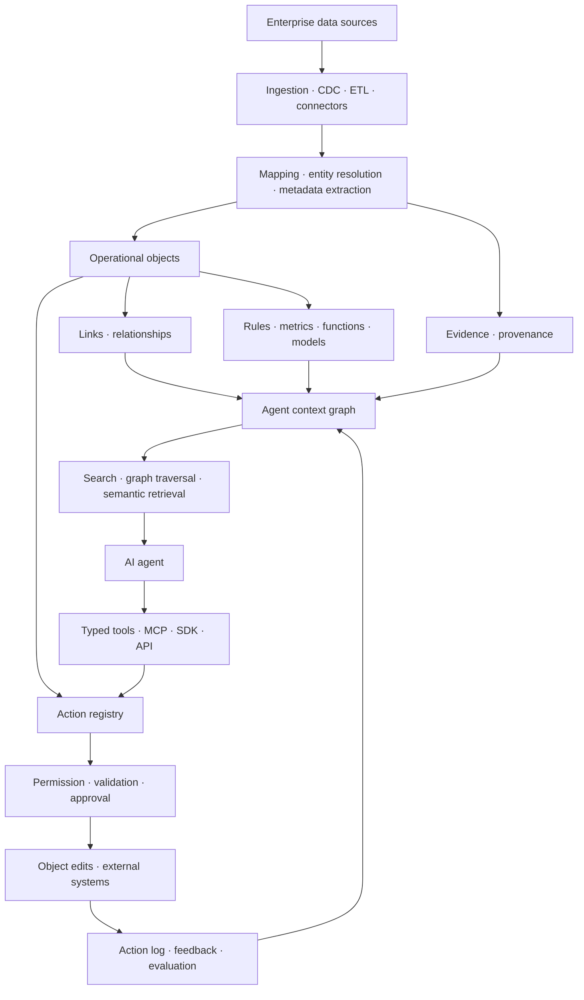
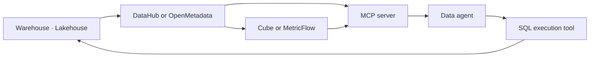
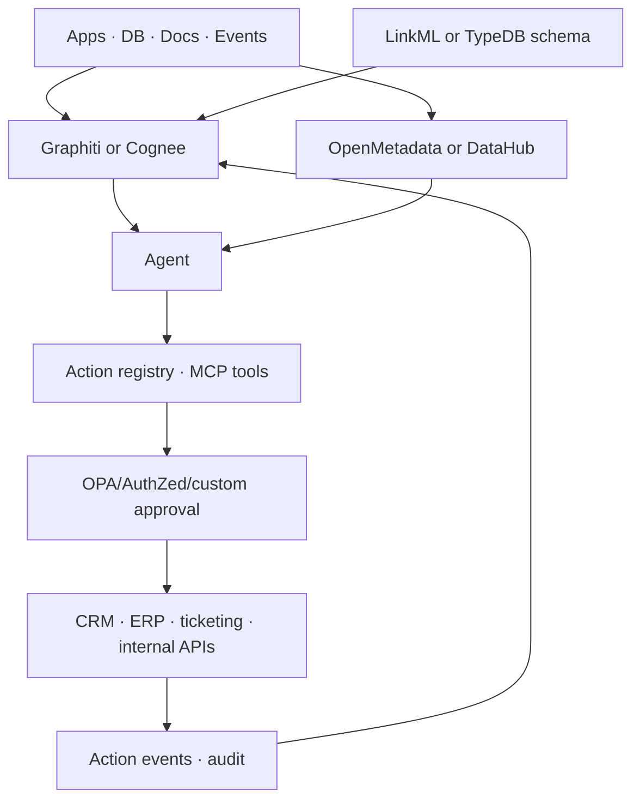
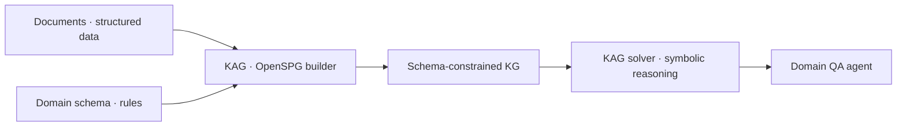
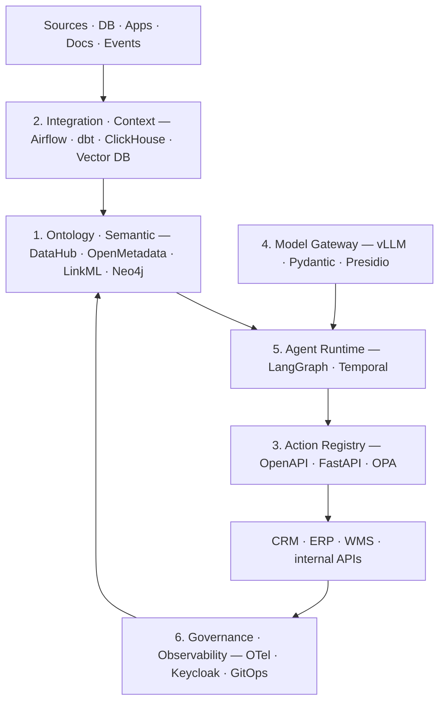

# AI 에이전트 시대의 온톨로지 — 운영 객체 · 데이터 활용 · 액션 레이어

작성일: 2026-06-08

## 결론 요약

최근 AI 에이전트 맥락에서 말하는 온톨로지는 과거 Semantic Web의 OWL/RDF 이론 체계만을 뜻하지 않는다. Palantir식으로 보면 온톨로지는 **기업의 현실 세계를 객체, 관계, 로직, 액션, 권한으로 모델링한 운영 레이어**다. 에이전트는 이 레이어를 통해 "어떤 데이터가 있는지"뿐 아니라 "이 객체가 무엇을 의미하는지", "어떤 관계와 규칙이 있는지", "어떤 행동을 안전하게 실행할 수 있는지"를 이해한다.

핵심 변화는 다음과 같다.

- 과거 온톨로지: 클래스, 관계, 공리, 추론 중심의 의미 모델
- 최근 에이전트 온톨로지: **agent-facing operational model**. 즉 객체 API, 관계 그래프, 지표/규칙, provenance, 권한, 액션, 감사 로그까지 포함
- Palantir Ontology의 차별점: data + logic + action을 같은 객체 모델에 묶고, 에이전트와 사람이 동일한 운영 객체 위에서 의사결정과 실행을 수행
- 오픈소스 생태계: Palantir 전체를 대체하는 단일 OSS는 없지만, **Graphiti/Cognee/TrustGraph + OpenSPG/KAG/TypeDB/TerminusDB + DataHub/OpenMetadata + Cube/MetricFlow + LinkML** 조합으로 유사한 구조를 만들 수 있다

**2026 업데이트로 추가된 축** (이번 라운드 보강):

- Palantir 2026 framing: 의사결정 = data + logic + action + **security**, 객체=명사 / 액션=동사, 온톨로지를 **"tool factory"** 로 보고 scenario·writeback·decision lineage로 변경을 안전하게 닫는다
- **온톨로지 ≠ 시맨틱 레이어**: 온톨로지는 "customer가 무엇인가", 시맨틱 레이어는 "revenue가 얼마인가" — 프로덕션 에이전트는 둘을 하나의 context layer로 묶어야 한다
- **OSI(Open Semantic Interchange)**: 2026-01-27 v1.0 확정된 벤더 중립 시맨틱 메타데이터 표준(Apache-2.0). metric/관계 상호운용의 OSS 표준화
- **에이전트 기반 온톨로지 자동 생성**: 멀티 에이전트 구축·Ontogenia·neurosymbolic으로 모델링 비용이 분 단위로 축소, 병목이 "작성"에서 "검증·거버넌스"로 이동
- **하이퍼스케일러 진입**: Microsoft Fabric IQ **Ontology(Preview)** 가 운영 온톨로지를 Azure 데이터 스택 기본 기능으로 흡수, Fluree·Dashjoin/d.AP·Stardog·RelationalAI·Timbr 등 신규 플랫폼 부상

## Palantir식 온톨로지의 핵심

Palantir 공식 문서 기준, Ontology는 단순히 데이터를 나타내는 것이 아니라 **기업의 의사결정(decisions)을 표현**하도록 설계되어 있다. decision은 data, logic, action으로 분해되며, Ontology는 이를 AI가 접근 가능한 운영 환경으로 통합한다.

| 계층 | Palantir식 의미 | 에이전트 관점 |
|---|---|---|
| Objects | `Customer`, `Order`, `Aircraft`, `Machine`, `Shipment` 같은 운영 객체 | 자연어 질문을 실제 엔터프라이즈 객체로 grounding |
| Properties | 객체의 상태와 속성 | 에이전트가 조건 판단, 필터링, 설명에 사용 |
| Links | 객체 간 관계 | multi-hop 탐색, 영향 분석, planning |
| Logic | 규칙, 함수, 모델, 예측, metric | 판단 근거, 계산, 정책, 추천 |
| Actions | 객체를 변경하거나 외부 시스템에 효과를 내는 동사 | 에이전트 tool/action 실행의 안전한 인터페이스 |
| Permissions | 객체/속성/action별 권한 | agent 권한 범위, human-in-the-loop, 감사 |
| Provenance | 데이터 출처, lineage, action log | 답변 신뢰도, 변경 추적, roll back |

이 관점에서 온톨로지는 "시맨틱 웹 파일"이 아니라 **기업 운영을 위한 object-action graph**에 가깝다.

### 2026 업데이트 — "Connecting Agents to Decisions"

Palantir이 2026년 4월 공개한 관점은 온톨로지를 더 명시적으로 **의사결정 중심(decision-centric) 아키텍처**로 규정한다. 모든 운영 의사결정은 네 요소로 분해된다 (이전 doc의 3요소에서 security가 1급으로 승격).

- **Data** — 의사결정에 쓰이는 정보 (객체·속성·링크)
- **Logic** — 의사결정을 평가하는 휴리스틱과 계산 과정 (rule·function·ML model·최적화)
- **Action** — 의사결정의 실행 (orchestration·writeback)
- **Security** — 정책 준수와 거버넌스 (marking·role·purpose 기반, **런타임에 동적 계산**)

핵심 비유는 **semantic(nouns) vs kinetic(verbs)** 이다. 객체와 링크는 기업의 "명사"이고, 액션은 그것을 움직이게 하는 "동사"다 — 이전 절의 object-action graph 관점과 정확히 일치한다.

2026 framing에서 새로 강조되는 구체 요소:

- **Ontology as a "tool factory"** — 객체 쿼리, 모델/로직 호출, 액션 실행을 모두 사람과 에이전트가 쓰는 *typed tool* 로 노출한다. 즉 RAG(텍스트 검색)만이 아니라 ML 모델·최적화·업무 로직까지 AI-ready tool로 surfacing 한다.
- **Scenarios** — 변경을 바로 commit하지 않고 sandbox에 staging해 상호 의존 시스템까지 영향을 미리 평가한다. 에이전트에게 "review-required vs autonomous"의 **graduated autonomy** 를 부여하는 메커니즘.
- **Writeback connectors** — API 기반 업데이트, native ontology 커넥터, 비동기 file ingestion 등 수신 시스템(WMS·ERP 등)에 맞춰 변경을 라우팅.
- **Decision lineage** — 어떤 데이터 버전·앱·시점에 결정이 내려졌는지 end-to-end로 추적하고, 이 lineage 자체를 미래 최적화의 학습 데이터로 사용.
- 액션도 데이터·로직과 **동일한 거버넌스**(누가 invoke 가능한지, 단계적 배포, 이벤트 로깅)를 받는다.

→ 엔지니어 관점 정리: Palantir 2026 온톨로지의 핵심은 "객체 모델"이 아니라 **data·logic·action·security가 같은 거버넌스 평면 위에서 typed tool로 통합되고, 변경이 scenario → writeback → lineage로 안전하게 닫히는 루프**다.

## Agentic Ontology 참조 아키텍처

### 왜 에이전트에 필요한가

LLM 에이전트는 raw table, raw document, raw API만 받으면 대부분을 추측해야 한다. 운영 온톨로지는 추측 영역을 줄인다.

| 문제 | 온톨로지 없는 에이전트 | 온톨로지 있는 에이전트 |
|---|---|---|
| 데이터 발견 | 테이블명/문서명 기반 검색 | 비즈니스 객체와 관계 기반 탐색 |
| 의미 이해 | `cust_id`, `acct_id`를 추측 | `Customer`, `Account`, `Household` 구분 |
| 검색 | chunk/vector top-k | 객체 + 관계 + provenance + vector hybrid |
| 액션 | 임의 API/tool 호출 | typed action, validation, permission, audit |
| 안전성 | prompt/tool 설명에 의존 | 정책, object permission, action log |
| 지속성 | 대화 기록 중심 memory | 변화하는 객체 상태와 temporal fact 관리 |

## 온톨로지 vs 시맨틱 레이어 — 무엇이 다른가

"AI 에이전트 온톨로지"를 이야기할 때 자주 혼동되는 두 계층이 있다. 둘 다 raw 데이터 위에 "의미"를 얹지만 푸는 문제가 다르다.

| 구분 | 온톨로지 (Ontology) | 시맨틱 레이어 (Semantic Layer) |
|---|---|---|
| 답하는 질문 | "Customer란 무엇인가" (개념·관계·규칙) | "revenue는 얼마인가" (지표·계산) |
| 모델링 대상 | entity type, relationship, 논리 공리, 추론 | metric, dimension, 계산식, 접근 제어 |
| 추론 | 형식 논리 기반 inference (자동 분류·이상 탐지) | 사전 정의된 계산만 (inference 없음) |
| 표준 | OWL, RDF, SHACL, LinkML | OSI, dbt/MetricFlow, Cube schema |
| 에이전트에 주는 것 | 도메인 이해, cross-system 의미 정합, 관계 추론 | 결정적 metric 정의, governed SQL, 계산 일관성 |

한 줄 요약(Atlan): **"시맨틱 레이어는 revenue가 얼마인지 말해주고, 온톨로지는 customer가 무엇인지 말해준다."**

프로덕션 AI 에이전트는 보통 **둘 다** 필요하다. metric hallucination은 시맨틱 레이어가, 개념·관계 추론은 온톨로지가 막는다. 실무 권장 패턴은 둘을 분리해서 고르는 게 아니라 하나의 **context layer**로 묶어 MCP 같은 프로토콜로 에이전트에 노출하는 것이다.

- Phase 1: 시맨틱 레이어 먼저 (metric governance, 2~6개월 내 ROI)
- Phase 2: glossary·data product로 온톨로지 능력 점진 추가
- Phase 3: 통합 context를 MCP로 에이전트에 노출

> 주의: "MCP만 붙이면 agentic analytics가 된다"는 접근은 위험하다. 업계 전망은 시맨틱 레이어 없이 프로토콜에만 의존한 agentic analytics 프로젝트의 상당수가 2028년까지 실패할 것으로 본다. Palantir Ontology가 강한 이유도 결국 객체(온톨로지)와 metric/logic(시맨틱)을 한 평면에서 governance와 함께 닫았기 때문이다.

## 핵심 기술 트렌드

### 1. Context Graph

에이전트용 온톨로지는 정적 지식 그래프보다 **context graph**에 가깝다. 문서, 대화, 업무 이벤트, 외부 시스템 상태를 객체와 관계로 계속 갱신하고, 시간과 출처를 보존한다. Graphiti, Cognee, TrustGraph가 이 흐름에 있다.

중요한 특징:

- entity/relationship extraction
- temporal fact 관리
- provenance와 evidence link
- hybrid retrieval
- agent memory와 tool/MCP 통합
- custom entity type 또는 prescribed ontology 지원

### 2. Semantic Metadata Graph

기업 데이터 활용 관점에서 가장 현실적인 온톨로지는 데이터 catalog/metadata graph다. DataHub와 OpenMetadata는 테이블, 컬럼, dashboard, pipeline, owner, lineage, glossary, metric, policy를 연결한다. AI agent는 이 graph를 통해 "어떤 테이블을 써야 하는지", "이 컬럼이 PII인지", "변경하면 어떤 dashboard가 깨지는지"를 판단할 수 있다.

이 계층은 Palantir Ontology의 `data + governance + lineage` 부분에 대응한다.

### 3. Semantic Layer for AI

BI/analytics 영역에서는 Cube Core, MetricFlow, dbt Semantic Layer, OSI(Open Semantic Interchange)가 중요하다. 여기서 온톨로지는 그래프보다 **business metric ontology**에 가깝다. `revenue`, `active_user`, `retention`, `gross_margin` 같은 지표를 일관된 계산 규칙과 차원/조인 관계로 정의한다.

에이전트가 SQL을 생성하거나 분석을 수행할 때 semantic layer가 없으면 metric hallucination이 발생한다.

### 4. Typed Knowledge Graph and Schema-Constrained Extraction

KAG/OpenSPG, TypeDB, LinkML은 "무엇을 추출하고 저장할 수 있는가"를 명확히 정의하는 쪽이다. LLM 기반 OpenIE가 만든 noisy graph를 바로 쓰는 대신, domain schema와 entity normalization, relation constraints, rule reasoning을 추가한다.

이 계층은 Palantir Ontology의 `object/link type + logic` 부분에 대응한다.

### 5. Action Ontology

Palantir식 온톨로지에서 가장 중요한 차별점은 **Action**이다. 데이터/관계 모델만 있으면 에이전트는 잘 검색할 수 있지만, 실행하려면 안전한 동사가 필요하다.

Action ontology는 다음을 포함한다.

- action name과 natural-language description
- input parameter schema
- 대상 object type과 precondition
- validation rule
- permission rule
- idempotency/transaction boundary
- side effects
- human approval 정책
- audit log와 rollback 전략

MCP/OpenAPI/tool calling은 action을 노출하는 인터페이스가 될 수 있지만, action ontology 자체는 별도 계층으로 설계해야 한다.

### 6. 시맨틱 상호운용 표준 — OSI (Open Semantic Interchange)

2025년 9월 Snowflake·Salesforce·dbt Labs·BlackRock·RelationalAI가 발족하고 **2026년 1월 27일 v1.0 스펙이 확정**된 OSI는, 시맨틱 메타데이터(데이터셋·metric·dimension·relationship·context)를 벤더 중립 형식으로 교환하는 표준이다.

- 선언적 YAML 모델, **Apache-2.0** (`github.com/open-semantic-interchange/OSI`)
- "데이터 의미의 universal translator" — 한 곳에서 정의한 metric/관계를 BI·AI 도구가 동일하게 해석
- 파트너: Snowflake, Salesforce, dbt Labs, Cube, RelationalAI, Alation, Atlan, ThoughtSpot, Sigma, Hex, Mistral AI 등 + 2026년 Databricks·AtScale·Qlik·Lightdash 합류
- 로드맵: Phase 2(2026)에서 50+ 플랫폼 네이티브 지원, Phase 3(2027~)에서 사실상 표준화 목표

엔지니어 관점에서 OSI는 "에이전트가 회사마다 다른 시맨틱 레이어를 매번 새로 학습"하는 비용을 없애는 쪽이다. 온톨로지(객체 모델) 자체의 표준은 아니지만, **metric/관계 레이어의 상호운용**이라는 Palantir Ontology의 한 축을 OSS 표준으로 끌어올린 흐름이다.

### 7. 에이전트 기반 온톨로지 자동 생성

"최근 AI 발전" 관점에서 가장 새로운 축은, 온톨로지를 사람이 수개월에 걸쳐 손으로 만드는 대신 **LLM 에이전트가 초안을 분 단위로 생성**하는 흐름이다.

- **멀티 에이전트 온톨로지 구축**: Domain Expert·Manager·Coder·Quality Assurer 같은 artifact 기반 역할로 분해해 비정형 텍스트에서 온톨로지를 합성하고, judge LLM이 평가 (2026 arXiv).
- **Ontogenia**: metacognitive prompting + Ontology Design Pattern으로 self-reflection·구조 교정을 수행해 일관성·복잡도 향상.
- **Neurosymbolic**: "Ontology-Constrained Neural Reasoning"처럼 온톨로지로 LLM 추론을 제약해 도메인 grounding과 hallucination 억제를 동시에 노리는 enterprise agentic 아키텍처.
- **제품화**: Stardog Voicebox는 LLM 에이전트로 온톨로지 초안 생성·매핑을 가이드하고, Fluree는 기존 스키마에서 AI-assisted discovery 또는 GIST·FIBO 같은 upper ontology에서 출발하도록 지원.

핵심 시사점: 온톨로지의 병목이 "모델링 비용"에서 "검증·거버넌스"로 이동한다. 에이전트가 schema-free OpenIE로 noisy graph를 만들고(Graphiti/Cognee), schema-constrained로 정제하며(KAG/OpenSPG/LinkML), 사람이 review하는 **점진적 온톨로지 루프**가 표준 패턴이 된다.

## 오픈소스 후보 분류

### 에이전트 Context Graph · Memory

| 프로젝트 | 라이선스 | 핵심 역할 | Palantir식 대응 |
|---|---|---|---|
| Graphiti | Apache-2.0 | temporal context graph for AI agents | 객체/관계/시간/provenance 기반 agent memory |
| Cognee | Apache-2.0 | memory control plane for agents | 회사 brain, ontology grounding, graph/vector memory |
| TrustGraph | Apache-2.0 | semantic deployment platform | context graph + OntologyRAG + agent orchestration |

### Knowledge Graph · Reasoning · Schema

| 프로젝트 | 라이선스 | 핵심 역할 | Palantir식 대응 |
|---|---|---|---|
| OpenSPG | Apache-2.0 | semantic-enhanced programmable graph | SPG schema, rule reasoning, knowledge construction |
| KAG | Apache-2.0 | OpenSPG 기반 Knowledge Augmented Generation | schema-constrained KG + logical form reasoning |
| TypeDB CE | MPL-2.0 | typed knowledge database | entity/relation/attribute type system |
| TerminusDB | Apache-2.0 | versioned document + knowledge graph DB | git-for-data, schema, temporal reasoning |
| LinkML | Apache-2.0 | YAML 기반 linked data modeling language | portable object/schema definition |

### Metadata · Data Context Graph

| 프로젝트 | 라이선스 | 핵심 역할 | Palantir식 대응 |
|---|---|---|---|
| DataHub | Apache-2.0 | metadata platform and graph | 데이터 자산, lineage, glossary, ownership, MCP |
| OpenMetadata | Apache-2.0 | semantic context platform | metadata KG, ontology standards, MCP, governance |

### Analytics Semantic Layer

| 프로젝트 | 라이선스 | 핵심 역할 | Palantir식 대응 |
|---|---|---|---|
| Cube Core | Apache-2.0/MIT 혼합 | headless semantic layer | metric/dimension/join/access rule API |
| MetricFlow | Apache-2.0 | dbt semantic metric compiler | metric definition to SQL plan |

### 온톨로지 기반 시맨틱·그래프 플랫폼 (2026 관찰)

위 12개 외에, "Palantir Ontology 대체/유사"를 직접 표방하며 2025~2026에 부상한 플랫폼들.

| 프로젝트 | 라이선스/형태 | 핵심 역할 | Palantir식 대응 |
|---|---|---|---|
| Fluree | 오픈소스 (RDF·JSON-LD·OWL·SHACL) | 시맨틱 레이어 + GraphRAG, SPARQL/REST/MCP | 객체·관계·provenance + agent-facing query |
| Dashjoin / d.AP | 오픈소스 (RDF/OWL, low-code) | linked-data graph + 데이터 통합·앱 빌드 | Foundry형 ontology+integration+app |
| RelationalAI | 상용 (OSI 공동 창립) | knowledge graph 위 relational reasoning | logic/rule reasoning 레이어 |
| Stardog | 상용 (EKG + Voicebox) | enterprise knowledge graph + agentic 답변 엔진 | 온톨로지 + semantic layer + agent |
| Timbr | 상용 (SQL 온톨로지) | SQL 기반 ontology semantic layer | 객체·관계를 SQL로 노출 |

> 주의: Fluree·Dashjoin은 오픈소스지만 이번 라운드에서 소스 단위 분석은 하지 않았다(landscape 수준). 깊은 분석이 필요하면 별도 round에서 clone 후 진행한다.

### 벤더·매니지드 온톨로지 — 하이퍼스케일러의 진입

2026년 가장 큰 변화는 Palantir 전용에 가깝던 "운영 온톨로지" 개념이 **하이퍼스케일러 데이터 플랫폼에 기본 기능으로** 들어오기 시작했다는 점이다.

- **Microsoft Fabric — Ontology (Preview, Fabric IQ 워크로드)**: entity type·property·relationship으로 기업 어휘를 정의하고 OneLake(lakehouse·eventhouse·Power BI semantic model)에 **data binding**. 관계·lineage·validity("when they were true")를 1급 객체로 두고, **ontology graph**(Graph in Microsoft Fabric, 질의를 GQL/KQL로 자동 라우팅)와 **NL2Ontology** 자연어 질의를 제공. Fabric 에이전트·Copilot의 cross-domain reasoning과 "decision-ready action" 컨텍스트로 설계됨. → Palantir Ontology의 object/link/semantic-layer 축을 Azure 스택에 흡수한 형태.

엔지니어 시사점: 이제 "운영 온톨로지"는 Palantir만의 것이 아니라 (1) self-hosted OSS 조합, (2) Fluree/Dashjoin 같은 ontology-native OSS, (3) Fabric IQ 같은 매니지드 플랫폼의 3갈래로 선택지가 넓어졌다.

## 주요 OSS 분석

### Graphiti

- Local source: `_repos/graphiti`, commit `9f2b63d`
- 역할: AI agent를 위한 temporal context graph engine
- 핵심 개념: entities, facts/relationships, episodes, custom types
- 기술 포인트:
  - facts에 validity window를 부여해 "현재 사실"과 "과거 사실"을 구분
  - source episode로 provenance 유지
  - prescribed ontology와 learned ontology 모두 지원
  - semantic + keyword + graph traversal hybrid retrieval
  - MCP server 제공
- 적합한 경우:
  - 사용자/조직별 agent memory
  - 대화와 업무 이벤트가 계속 변하는 agent
  - temporal reasoning이 필요한 assistant
- 한계:
  - Palantir식 enterprise action layer는 직접 만들어야 함
  - 운영 governance, object-level permission은 상위 시스템 필요

### Cognee

- Local source: `_repos/cognee`, commit `cfb0aa4`
- 역할: agent memory control plane
- 핵심 개념: remember, recall, forget, improve
- 기술 포인트:
  - documents, tables, transcripts, app data를 graph/vector memory로 변환
  - ontology grounding, multimodal, provenance, tenant isolation을 강조
  - Claude Code/OpenClaw/MCP 등 agent runtime 통합
  - session memory와 permanent graph memory를 구분
- 적합한 경우:
  - 여러 agent가 공유하는 회사/프로젝트 brain
  - coding agent, support agent, data analyst agent의 장기 메모리
- 한계:
  - enterprise data catalog나 action execution layer라기보다 memory layer에 가까움

### TrustGraph

- Local source: `_repos/trustgraph`, commit `97453d9`
- 역할: semantic deployment platform for agents
- 핵심 개념: context graph, OntologyRAG, Context Core
- 기술 포인트:
  - ontology-driven graph construction
  - graph-grounded retrieval
  - Context Core를 portable/versioned context bundle로 다룸
  - Cassandra, Qdrant, Garage, Pulsar 등 포함형 배포
  - MCP, REST, WebSocket, Python API
- 적합한 경우:
  - self-contained semantic RAG/agent platform
  - ontology + context graph + agent orchestration을 한 번에 실험
- 한계:
  - 아직 생태계 성숙도는 DataHub/TypeDB 등보다 검증이 덜 됨

### OpenSPG / KAG

- Local source: `_repos/openspg`, commit `ceeb3ef`
- Local source: `_repos/kag`, commit `fdab15b`
- 역할: 산업용 knowledge graph와 LLM reasoning 결합
- 핵심 개념: SPG-Schema, SPG-Builder, SPG-Reasoner, KGDSL, KNext, kg-builder, kg-solver
- 기술 포인트:
  - LPG의 단순성과 RDF의 semantic modeling을 절충한 SPG
  - domain schema customization
  - schema-constrained extraction
  - entity linking, concept standardization, normalization
  - logical form guided reasoning and retrieval
  - MCP protocol integration
- 적합한 경우:
  - 전문 도메인 QA
  - 금융/의료/공급망처럼 도메인 규칙과 다중 홉 추론이 중요한 영역
- 한계:
  - 운영 적용 난도 높음
  - 문서와 생태계 일부가 중국어/영어 혼재
  - Palantir식 action application layer는 별도 구현 필요

### TypeDB

- Local source: `_repos/typedb`, commit `c8e2e2e`
- 역할: strong type system 기반 knowledge database
- 핵심 개념: entity, relation, attribute, inheritance, interface, TypeQL
- 기술 포인트:
  - 객체-관계-속성을 데이터베이스의 native type system으로 표현
  - polymorphic query와 declarative TypeQL
  - 복잡한 domain model을 물리 schema보다 높은 수준에서 다룸
- 적합한 경우:
  - 도메인 타입과 관계의 정확성이 중요한 agent backend
  - "Customer plays Buyer role in Purchase" 같은 역할 기반 모델링
- 한계:
  - Palantir의 data integration/action/governance platform은 아님
  - 라이선스는 MPL-2.0

### TerminusDB

- Local source: `_repos/terminusdb`, commit `f1b101b`
- 역할: versioned document + knowledge graph database
- 핵심 개념: git-for-data, JSON/JSON-LD document, schema constraints, WOQL/Datalog, GraphQL
- 기술 포인트:
  - commit/diff/push/pull/clone 모델
  - time-travel query
  - schema constraints와 temporal reasoning
  - document API와 graph query 결합
- 적합한 경우:
  - agent가 수정하는 지식의 버전관리
  - domain graph를 branch/merge/rollback 해야 하는 환경
- 한계:
  - agent runtime이나 action permission 체계는 직접 구성해야 함

### LinkML

- Local source: `_repos/linkml`, commit `b74eefd`
- 역할: portable schema/ontology modeling language
- 핵심 개념: YAML model, class, slot, enum, generator
- 기술 포인트:
  - JSON Schema, RDF, OWL, SQL DDL, Pydantic 등으로 변환 가능
  - 과거 Semantic Web보다 개발자 친화적인 ontology/schema authoring
  - agent extraction schema와 API contract 생성에 적합
- 적합한 경우:
  - 에이전트가 추출/저장/수정할 객체 타입을 코드로 관리
  - domain ontology를 RDF/JSON Schema/Pydantic 사이에서 재사용
- 한계:
  - runtime DB나 action engine은 아님

### DataHub

- Local source: `_repos/datahub`, commit `5dc7ca13`
- 역할: metadata graph and AI data catalog
- 핵심 개념: dataset, schema, glossary, ownership, lineage, assertions, domains, MCP
- 기술 포인트:
  - metadata graph를 실시간/배치 ingest로 유지
  - GraphQL/OpenAPI/SDK
  - MCP server를 통해 coding assistant가 catalog context 조회
  - analytics agent 예시 제공
- 적합한 경우:
  - 데이터/분석 에이전트가 기업 데이터 맥락을 이해해야 하는 경우
  - SQL generation 전에 schema, owner, lineage, glossary, PII 정보를 확인해야 하는 경우
- 한계:
  - business action execution은 직접 연결해야 함
  - Palantir Ontology의 operational object/action model 전체를 제공하지는 않음

### OpenMetadata

- Local source: `_repos/openmetadata`, commit `c913cd5d`
- 역할: open semantic context platform
- 핵심 개념: metadata KG, glossary, classification, metrics, domains, data products, MCP
- 기술 포인트:
  - 120+ connectors
  - technical metadata + lineage + quality + policy + business semantics
  - RDF/OWL ontologies, JSON-LD contexts, SHACL shapes를 포함한 OpenMetadata Standards
  - MCP server와 AI SDK로 agent-facing context 제공
- 적합한 경우:
  - 데이터 governance와 AI agent context를 같은 플랫폼에서 관리
  - schema/owner/lineage/quality/policy를 에이전트에게 제공
- 한계:
  - 운영 객체/action layer는 metadata 중심으로 제한됨

### Cube Core / MetricFlow

- Local source: `_repos/cube`, commit `590146f`
- Local source: `_repos/metricflow`, commit `86d1538`
- 역할: business metric semantic layer
- 핵심 개념: metric, dimension, measure, join, access rule, SQL planning
- 기술 포인트:
  - Cube는 SQL/REST/GraphQL API로 agent/BI에 metric model 제공
  - MetricFlow는 metric definitions를 reusable SQL로 compile
  - OSI 흐름과 연결되어 AI/BI semantic interoperability를 지향
- 적합한 경우:
  - 분석/BI/SQL agent가 revenue, retention, margin 같은 metric을 일관되게 계산해야 하는 경우
- 한계:
  - 객체/관계/action ontology가 아니라 metric ontology에 가까움

## Palantir Ontology와 OSS 비교

| 역량 | Palantir Ontology | OSS 조합 |
|---|---|---|
| Operational objects | native object/link type | TypeDB, TerminusDB, LinkML, OpenSPG |
| Data integration | Foundry pipeline/connectors | DataHub/OpenMetadata connectors, dbt, Airbyte 등 |
| Metadata/lineage | Foundry integrated | DataHub, OpenMetadata, OpenLineage |
| Semantic search/vector | Ontology primitives | Graphiti, Cognee, TrustGraph, vector DB |
| Logic/functions/models | Functions, Rules, Model adapters | KAG/OpenSPG, Cube/MetricFlow, custom service |
| Actions/writeback | Action types, OSDK/API, permissions | MCP/OpenAPI + custom action registry + policy engine |
| Agent runtime | AIP agents, evals, observability | LangGraph/AutoGen/CrewAI + MCP + Phoenix/Langfuse 등 |
| Governance/security | integrated RBAC/markings/purpose controls | OpenMetadata/DataHub policy + OPA/AuthZed/custom |
| Audit/feedback | action log, evals, object edits | event log + metadata graph + observability stack |

단일 OSS만으로 Palantir Ontology를 대체하기는 어렵다. Palantir의 강점은 object model보다 **object model, action execution, permission, audit, app builder, agent lifecycle이 한 플랫폼 안에서 닫혀 있다는 점**이다. OSS에서는 이를 조합해야 한다.

## 구현 패턴

### 1. Data Agent용 최소 스택

적합:

- 자연어 SQL/BI agent
- metric hallucination 방지
- schema/lineage/owner/PII context 제공

### 2. Operational Agent용 Palantir-lite 스택

적합:

- 업무 자동화 agent
- 고객지원, IT ops, 내부 운영
- action writeback이 필요한 에이전트

### 3. Domain Reasoning용 KG 스택

적합:

- 의료, 금융, 법무, 공급망
- domain rule과 multi-hop reasoning이 중요한 QA
- schema-free OpenIE noise를 줄여야 하는 경우

### 4. Palantir-lite 풀스택 (6-layer OSS 매핑)

Palantir Foundry+AIP를 OSS로 근사할 때 자주 제안되는 6계층 매핑. 단일 제품이 아니라 계층별 조합이다.

| 계층 | 역할 | OSS 후보 |
|---|---|---|
| 1. Ontology/Semantic | 비즈니스 개념을 실행 가능한 contract로 | DataHub·OpenMetadata + dbt + Postgres + Neo4j/ArangoDB + LinkML/TypeDB |
| 2. Data Integration/Context | 의사결정용 operational snapshot 조립 | Airflow·Prefect·Argo + dbt + ClickHouse + Qdrant/Milvus/Weaviate |
| 3. Action Registry/Tools | typed·governed 동사 | OpenAPI/JSON Schema + FastAPI + OPA |
| 4. Model Gateway | LLM을 교체 가능한 통제 컴포넌트로 격리 | vLLM/TGI + FastAPI gateway + Pydantic + Presidio(PII) |
| 5. Agent Runtime | 실행·상태·재시도·승인 게이트 | LangGraph/LlamaIndex + Temporal/Camunda + Kafka |
| 6. Governance/Observability | 추적·정책·ID | OpenTelemetry + Keycloak + OPA + GitOps(Argo/Flux) |

핵심 원칙(이 매핑의 전제):

- **온톨로지 = contract**, **모델 = untrusted** — LLM 출력은 항상 schema 검증·정책 통과 후에만 효력을 갖는다.
- RAG는 "텍스트 검색"만 푼다. 도메인 의미·액션 거버넌스·재현성·감사는 별도 계층이 책임진다.
- 모든 산출물(온톨로지·프롬프트·tool schema·정책)을 GitOps로 버전 관리한다.

## 설계 원칙

1. **테이블이 아니라 의사결정 객체에서 시작한다.** `orders` 테이블이 아니라 `Order`, `Customer`, `Shipment`, `RiskCase` 같은 운영 객체를 먼저 정의한다.
2. **관계는 retrieval 전략이다.** 관계는 설명용 다이어그램이 아니라 에이전트가 탐색할 경로다.
3. **액션은 tool이 아니라 권한 있는 transaction이다.** tool calling만으로는 부족하고 precondition, permission, validation, audit가 필요하다.
4. **provenance를 객체와 fact에 붙인다.** 에이전트 답변과 액션은 근거를 거슬러 올라갈 수 있어야 한다.
5. **semantic layer와 metadata catalog를 분리하지 않는다.** metric, glossary, lineage, schema, ownership이 따로 있으면 agent context가 깨진다.
6. **ontology는 한 번에 완성하지 않는다.** Graphiti의 learned ontology, KAG의 schema-free + schema-constrained 병행처럼 점진적 진화가 필요하다.
7. **읽기와 쓰기를 다르게 설계한다.** 조회는 graph/vector/search hybrid로 열어두되, writeback은 action registry로 강하게 통제한다.

## 최종 평가

AI 에이전트 시대의 온톨로지는 "도메인 개념 사전"이 아니라 **에이전트가 기업 데이터를 이해하고, 검색하고, 판단하고, 안전하게 행동하기 위한 런타임 계약**이다. Palantir이 이를 가장 잘 제품화한 사례이고, OSS에서는 다음 조합이 현실적이다.

| 목표 | 추천 OSS |
|---|---|
| agent memory/context graph | Graphiti, Cognee |
| ontology-driven GraphRAG | TrustGraph, KAG/OpenSPG |
| strict typed domain model | TypeDB, LinkML |
| versioned operational KG | TerminusDB |
| enterprise data context | DataHub, OpenMetadata |
| metrics/analytics semantics | Cube Core, MetricFlow |
| action layer | MCP/OpenAPI + custom action registry + policy engine |
| RDF/OWL 시맨틱 레이어 | Fluree, Dashjoin/d.AP |
| metric 상호운용 표준 | OSI (Open Semantic Interchange) |
| 매니지드 운영 온톨로지 | Microsoft Fabric IQ Ontology |

가장 중요한 공백은 **Action Ontology**다. OSS 생태계는 context graph와 metadata graph는 빠르게 좋아지고 있지만, Palantir처럼 "객체를 바꾸고 외부 시스템에 영향을 주는 액션을 permission/audit와 함께 모델링"하는 오픈소스 통합 레이어는 아직 뚜렷하지 않다. 따라서 자체 agent platform을 만든다면 action registry를 별도 핵심 모듈로 설계해야 한다.

## 참고 자료

- [Palantir Platform Overview](https://www.palantir.com/docs/foundry/platform-overview)
- [Palantir AIP Architecture](https://www.palantir.com/docs/foundry/architecture-center/aip-architecture)
- [Palantir Object edits and materializations](https://www.palantir.com/docs/foundry/object-edits/overview)
- [Palantir Ontology SDK](https://www.palantir.com/docs/foundry/ontology-sdk/overview)
- [Graphiti GitHub](https://github.com/getzep/graphiti)
- [Zep Temporal Knowledge Graph paper](https://arxiv.org/abs/2501.13956)
- [Cognee](https://www.cognee.ai/)
- [OpenSPG](https://github.com/OpenSPG/openspg)
- [KAG](https://github.com/OpenSPG/KAG)
- [TypeDB](https://github.com/typedb/typedb)
- [TerminusDB](https://github.com/terminusdb/terminusdb)
- [LinkML](https://linkml.io/)
- [DataHub](https://github.com/datahub-project/datahub)
- [OpenMetadata](https://github.com/open-metadata/OpenMetadata)
- [Cube Core](https://github.com/cube-js/cube)
- [MetricFlow](https://github.com/dbt-labs/metricflow)
- [TrustGraph](https://github.com/trustgraph-ai/trustgraph)

### 2026 보강 자료

- [Palantir Blog — Connecting Agents to Decisions (2026-04)](https://blog.palantir.com/connecting-agents-to-decisions-277dee8ddb40)
- [Palantir Ontology platform](https://www.palantir.com/platforms/ontology/)
- [Open Semantic Interchange (OSI)](http://open-semantic-interchange.org/) · [OSI v1.0 spec finalized (Snowflake)](https://www.snowflake.com/en/blog/open-semantic-interchanges-specs-finalized/) · [OSI GitHub](https://github.com/open-semantic-interchange/OSI)
- [What the OSI spec means for metrics, semantics, and AI (dbt Labs)](https://www.getdbt.com/blog/the-osi-spec-updates)
- [Atlan — Ontology vs. Semantic Layer (2026)](https://atlan.com/know/ontology-vs-semantic-layer/) · [Atlan — Ontology in AI](https://atlan.com/know/what-is-ontology-in-ai/)
- [Microsoft Fabric — Ontology (Preview)](https://learn.microsoft.com/en-us/fabric/iq/ontology/overview)
- [Fluree — Semantic Layer / Enterprise Knowledge Graph](https://flur.ee/solutions/semantic-layer)
- [Dashjoin — Demystifying Palantir: open source alternatives](https://dashjoin.medium.com/demystifying-palantir-features-and-open-source-alternatives-ed3ed39432f9)
- [Stardog — Powering Agentic AI with Knowledge Graphs](https://www.stardog.com/agentic-ai-knowledge-graph/)
- [Inside Palantir's Agent Platform Architecture on Open Source (Medium, 2026-02)](https://medium.com/@grom_65116/inside-palantirs-agent-platform-architecture-how-to-build-enterprise-ai-on-open-source-b529ec763058)
- [Towards Automated Ontology Generation from Unstructured Text: A Multi-Agent LLM Approach (arXiv)](https://arxiv.org/abs/2604.23090)
- [LLM-empowered knowledge graph construction: A survey (arXiv)](https://arxiv.org/pdf/2510.20345)
