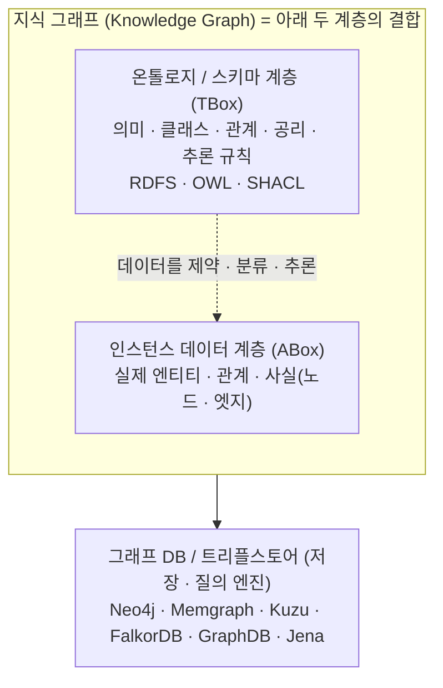
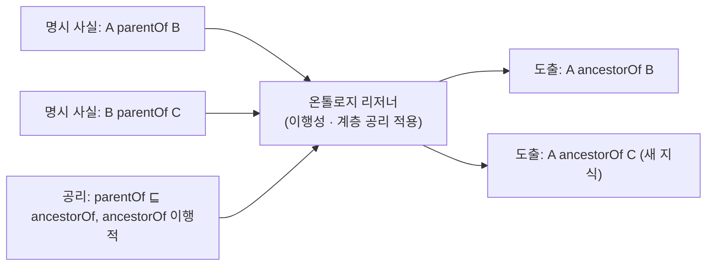

# 그래프 DB vs 온톨로지 vs 지식 그래프 — 계층 정리

> **목적**: 자주 혼동되는 세 개념(그래프 DB · 온톨로지 · 지식 그래프)이 *서로 경쟁이 아니라 다른 계층* 임을 엔지니어 관점에서 정리
> **한 줄 요약**: **그래프 DB = "어떻게 저장·질의하는가"(엔진)** · **온톨로지 = "무엇을 의미하는가"(의미 스키마)** · **지식 그래프 = 온톨로지 + 인스턴스 데이터를 그래프 DB에 담은 것**

---

## 1. 핵심 명제

세 가지는 같은 질문에 답하지 않는다. 계층이 다르다.

| 질문 | 답하는 것 |
|------|-----------|
| "데이터를 어디에 두고 어떻게 빨리 탐색하나?" | **그래프 DB** (기술/엔진) |
| "이 데이터가 무엇을 의미하고 어떤 규칙을 따르나?" | **온톨로지** (의미 모델) |
| "의미 + 실제 사실을 합친 결과물은?" | **지식 그래프** (산출물) |

관계형 세계에 빗대면:

```
온톨로지   :  그래프 DB    ≈   (ER 모델 + 제약 + 추론 규칙)  :  PostgreSQL
지식 그래프                ≈   실제로 데이터가 채워진 운영 DB
```



---

## 2. 그래프 DB — 저장·질의 기술

데이터를 **노드와 엣지로 저장하고 트래버설하는 데이터베이스**. 관심사는 *저장·인덱싱·질의 성능·경로 탐색* 이다. 두 계열로 나뉜다.

| 모델 | 데이터 단위 | 질의 언어 | 대표 제품 | 스키마 |
|------|-------------|-----------|-----------|--------|
| **LPG (Labeled Property Graph)** | 라벨 + 속성을 가진 노드/관계 | Cypher · Gremlin · GQL | Neo4j, Memgraph, Kuzu, FalkorDB, JanusGraph, TigerGraph | 느슨하거나 없음(schema-optional) |
| **RDF / 트리플스토어** | `주어-술어-목적어` 트리플 | SPARQL | GraphDB(Ontotext), Apache Jena, Virtuoso, Stardog, AllegroGraph, Amazon Neptune | 온톨로지로 명시 가능 |

핵심: 그래프 DB는 **명시적으로 넣은 것만 저장·질의**한다. 스스로 새 사실을 추론하지 않는다(원하면 쿼리나 그래프 알고리즘을 직접 작성). LPG는 보통 형식 온톨로지 없이 운영되고, RDF 계열은 온톨로지와 자연스럽게 결합된다.

---

## 3. 온톨로지 — 의미 모델(스키마 + 논리)

어떤 도메인의 **개념·관계·규칙을 형식적으로 정의한 의미 명세**. 데이터 자체가 아니라 *데이터가 따라야 할 의미 체계* 다. DB가 아니라 **파일/명세**(예: `.owl`, `.ttl`)일 수 있다.

정의하는 것:
- **클래스(개념·타입)**: `Person`, `Company`, `Disease`
- **관계/속성**: `worksFor`, `hasParent`, `treats`
- **계층**: `subClassOf`, `subPropertyOf` — 예: `Manager ⊑ Employee ⊑ Person`
- **공리/제약**: domain·range, 카디널리티, 대칭성(symmetric), 이행성(transitive), 서로소(disjoint), 역관계(inverseOf)

표준 언어:

| 언어 | 역할 | 특징 |
|------|------|------|
| **RDFS** | 경량 어휘·계층 | class/subClassOf/domain/range 수준 |
| **OWL** (Web Ontology Language) | 풍부한 논리 | 기술논리(Description Logic) 기반, **추론용**, 개방세계(OWA) |
| **SHACL** | 형상(shape) 검증 | 데이터 제약 **검증용**, 폐쇄세계(CWA)에 가까움 |

> **OWL vs SHACL** 은 자주 혼동된다. OWL은 *"새 사실을 추론하기 위한"* 개방세계 논리, SHACL은 *"데이터가 규칙을 위반하지 않는지 검증하기 위한"* 제약이다. 목적이 정반대에 가깝다.

---

## 4. 비교표

| 관점 | 그래프 DB | 온톨로지 |
|------|-----------|----------|
| **계층** | 저장·실행 (엔진) | 의미·스키마 (모델) |
| **주 관심사** | 어디 저장 · 얼마나 빨리 탐색 | 무엇을 의미 · 어떻게 분류·추론 |
| **다루는 대상** | 주로 인스턴스(실제 사실) | 주로 개념·타입·규칙(메타 수준) |
| **추론(inference)** | 없음 — 명시된 것만 | **있음** — 리저너가 새 사실 도출 |
| **세계 가정** | **폐쇄세계(CWA)**: DB에 없으면 거짓 | **개방세계(OWA)**: 명시 안 됐으면 "모름" |
| **형태** | 동작하는 서버/엔진 | 명세 파일(.owl/.ttl), 코드 아님 |
| **변경 빈도** | 데이터는 수시로 변함 | 스키마는 상대적으로 안정 |

가장 본질적인 차이는 **추론**과 **개방세계 가정(OWA)** 두 가지다.

### 4.1 추론(Inference)이 결정적이다

온톨로지가 다음을 선언하면:
- `ancestorOf` 는 이행적(transitive)
- `parentOf ⊑ ancestorOf` (parentOf는 ancestorOf의 하위)

리저너(HermiT, Pellet, ELK 등)는 `A parentOf B`, `B parentOf C` 만 저장돼 있어도 **`A ancestorOf C` 를 자동 도출**한다. 일반 그래프 DB는 이걸 추론하지 않으며, 같은 결과를 원하면 가변길이 경로 쿼리(`MATCH (a)-[:parentOf*]->(c)`)나 알고리즘을 직접 짜야 한다.



### 4.2 개방세계(OWA) vs 폐쇄세계(CWA)

- **그래프 DB(CWA)**: "테이블/그래프에 없으면 존재하지 않는다(거짓)". 운영 질의에 적합.
- **온톨로지(OWA)**: "기록이 없을 뿐 사실일 수도 있다(모름)". 불완전 데이터 통합·추론에 적합.

예: "철수에게 형제 기록이 없다" → 그래프 DB는 *"형제 없음"* 으로 답하고, OWL 온톨로지는 *"형제가 없다고 명시되지 않았으므로 단정 불가"* 로 본다.

---

## 5. 둘은 어떻게 만나는가 — TBox / ABox

겹치는 지점은 **RDF/시맨틱 웹** 세계다. 트리플스토어는 온톨로지와 데이터를 **같은 저장소에 함께** 둔다.

- **TBox** (Terminological Box) = 온톨로지 = 클래스·관계·공리 (스키마)
- **ABox** (Assertional Box) = 인스턴스 데이터 = 개별 사실(individuals)

```
지식 그래프  =  온톨로지(TBox · 의미 골격)  +  인스턴스 데이터(ABox · 실제 사실)
                └──────────────── 그래프 DB / 트리플스토어에 저장 ────────────────┘
```

- **RDF 계열**(GraphDB, Stardog, Jena): TBox·ABox를 모두 트리플로 한 저장소에 두고 SPARQL + 리저너로 질의·추론.
- **LPG 계열**(Neo4j 등): 보통 형식 온톨로지 없이 느슨한 스키마로 운영. 필요 시 `neosemantics(n10s)` 같은 도구로 RDF/OWL과 다리를 놓는다.

**비유**: 온톨로지는 *"설계도 + 건축 법규"*, 그래프 DB는 *"그 설계대로 지어진 실제 건물과 자재"* 다. 설계도만으론 살 수 없고, 건물만으론 의미·규칙이 없다.

---

## 6. GraphRAG · LLM과의 연결

최근 RAG 흐름(RAGFlow · LightRAG · Microsoft GraphRAG · KAG)에서 *"엔티티/관계 추출"* 이 바로 이 계층 구분 위에서 일어난다.

- LLM에게 *"Person, Company, Product 타입과 worksFor, produces 관계로 뽑아라"* 라고 주는 **추출 스키마가 곧 (경량) 온톨로지** 다.
- 추출된 실제 엔티티·관계 인스턴스는 **그래프 DB(또는 RAGFlow처럼 문서 엔진)에 저장** 된다 = ABox.
- **온톨로지 강도(强度)** 가 시스템 성격을 가른다:

| 온톨로지 강도 | 성격 | 예 |
|----------------|------|-----|
| 거의 없음 | 단순 엔티티 추출 그래프 | 기본 LightRAG, nano-graphrag |
| 경량(타입 집합) | 추출 스키마로서의 온톨로지 | Microsoft GraphRAG, RAGFlow GraphRAG |
| 강함(형식 + 추론) | 논리형 하이브리드 추론 | **KAG / OpenSPG**, 시맨틱 웹 시스템 |

> 본 레포 [RAGFlow 분석](../ragflow/analysis.md)·[LightRAG 분석](../lightrag/analysis.md) 참조.

---

## 7. 실무 선택 가이드 — 언제 형식 온톨로지가 필요한가

| 상황 | 권장 |
|------|------|
| 빠른 탐색·연결 질의, 스키마가 자주 변함 | **LPG 그래프 DB**(Neo4j 등), 온톨로지 최소화 |
| 다중 출처 데이터 통합 · 표준 어휘 공유 필요 | **RDF + 온톨로지(OWL/RDFS)** |
| 규제·의료·금융 등 **추론의 정확성·설명가능성**이 중요 | **온톨로지 + 리저너**(KAG/OpenSPG, Stardog) |
| 데이터 품질 **검증·계약**이 목적(추론 아님) | **SHACL** |
| LLM 기반 GraphRAG로 비정형 문서 QA | 경량 온톨로지(추출 타입) + 그래프/벡터 하이브리드 |

핵심 판단: **추론과 의미 표준화가 가치의 핵심이면 온톨로지에 투자**하고, **연결 탐색·성능이 핵심이면 그래프 DB에 집중**한다. 둘은 함께 쓸 수 있으며, 지식 그래프는 그 결합물이다.

---

## 8. 용어 요약

- **그래프 DB**: 노드·엣지로 데이터를 저장·질의하는 DB 엔진 (LPG / RDF)
- **온톨로지**: 도메인의 개념·관계·규칙을 형식 정의한 의미 모델 (RDFS/OWL/SHACL)
- **지식 그래프(KG)**: 온톨로지(의미) + 인스턴스(사실)를 그래프로 결합한 산출물
- **TBox / ABox**: 스키마(개념) / 인스턴스(사실)
- **리저너(Reasoner)**: 온톨로지 공리로 새 사실을 도출하는 추론 엔진
- **OWA / CWA**: 개방세계(명시 안 되면 모름) / 폐쇄세계(없으면 거짓)
- **SPARQL / Cypher**: RDF 질의어 / LPG 질의어
