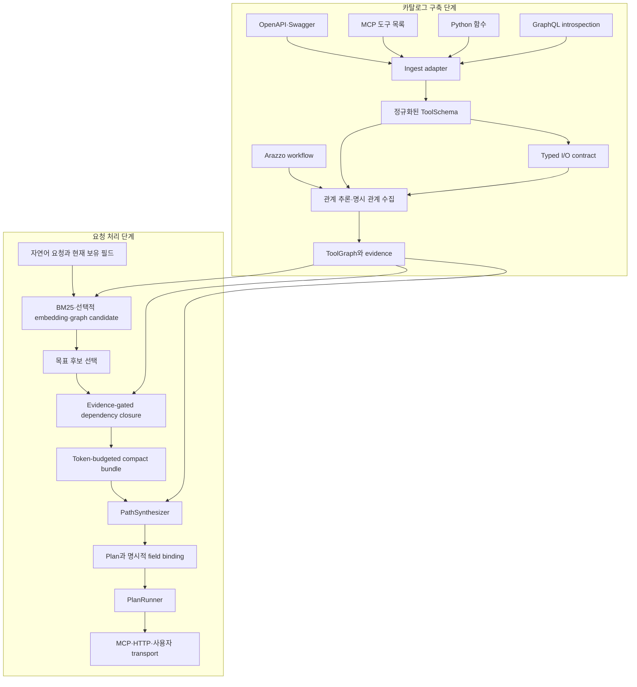
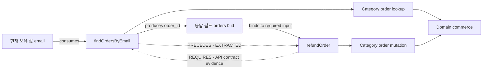
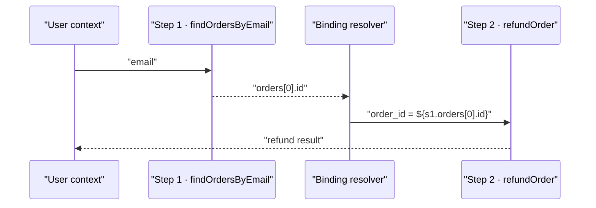

# graph-tool-call 코드·아키텍처 분석

> 분석 기준: `SonAIengine/graph-tool-call` main `beba2f12003975a607436b323e3ad2e3f069eedd`  
> 패키지 버전: `0.36.0` 다음 커밋(`v0.36.0-1-gbeba2f1`)  
> 분석일: 2026-08-03

## 결론부터 보기

`graph-tool-call`이 해결하려는 문제는 단순히 **질문과 가장 비슷한 도구 하나를 찾는 것**이 아니다. 실제 도구 호출에서는 목표 도구가 요구하는 `order_id`, `cart_id` 같은 입력을 현재 대화가 가지고 있지 않아, 그 값을 만들어 줄 선행 도구까지 함께 찾아야 한다. 이 프로젝트는 이를 다음 세 단계로 분리한다.

1. 자연어 질의로 **목표 도구(target)** 후보를 검색한다.
2. 목표 도구의 typed input contract를 역추적해 **필수 생산자 도구(dependency)** 를 닫힘 집합으로 완성한다.
3. 생산자의 출력과 소비자의 입력을 `${s1.order_id}` 같은 명시적 바인딩으로 연결해 결정론적 실행 계획을 만든다.

핵심은 “벡터 검색을 그래프로 교체”하는 데 있지 않다. **검색(relevance), 의존성 완성(correctness), 실행 계획(binding)을 서로 다른 단계로 분리**하고, OpenAPI·MCP·Python 함수 등에서 추출한 입출력 계약과 근거가 있는 관계 그래프로 단계를 연결하는 것이 핵심이다.

한 줄로 평가하면, **대규모 도구 카탈로그용 검색기와 경량 typed workflow synthesizer 사이의 중간 계층**이다. 50개 이상의 구조화된 API 도구와 반복적인 ID 전달 체인에는 잘 맞지만, 분기·병렬·전체 배열 fan-out이 필요한 범용 워크플로 엔진을 대체하지는 않는다.

## 1. 프로젝트 개요와 문제 정의

### 1.1 해결하려는 실패 유형

LLM에 모든 도구 스키마를 그대로 넣는 방식은 도구 수가 커질수록 다음 문제를 만든다.

- 도구 정의가 컨텍스트를 많이 차지한다.
- 이름과 설명이 비슷한 도구 사이에서 잘못 고르기 쉽다.
- 벡터 유사도만으로는 의미적으로 멀리 떨어진 선행 도구를 찾기 어렵다.
- 목표 도구를 맞게 골라도 필수 입력을 만드는 호출 체인을 누락할 수 있다.
- LLM이 암묵적으로 필드 매핑을 추측하면 실행 시점에 깨지기 쉽다.

예를 들어 “이 이메일 사용자의 주문을 환불해 줘”라는 요청에서 `refundOrder(order_id)`는 목표와 의미적으로 가깝다. 그러나 사용자가 가진 값은 `email`뿐이다. 실행 가능한 해답에는 `findOrdersByEmail(email) -> order_id`가 반드시 포함돼야 한다. `findOrdersByEmail`은 “환불”과 의미적으로 가까운 도구가 아니므로 top-k 의미 검색만으로는 자주 빠진다.

프로젝트 README는 이를 “tool selection”이 아니라 “tool chaining” 문제로 정의하며, v0.36.0은 이 경로를 재현 가능한 오프라인 데모와 release evidence로 고정했다. [프로젝트 README](https://github.com/SonAIengine/graph-tool-call), [v0.36.0 릴리스](https://github.com/SonAIengine/graph-tool-call/releases/tag/v0.36.0)

### 1.2 설계 목표

| 목표 | 구현 방향 |
|---|---|
| 큰 카탈로그 축소 | BM25·선택적 임베딩·그래프 후보 확장 |
| 선행 도구 누락 방지 | typed producer-consumer dependency closure |
| 잘못된 그래프 관계 억제 | edge confidence와 evidence 보존 |
| 실행 가능성 | 출력 JSON path를 다음 입력에 명시적으로 바인딩 |
| 안전성 | 변경 도구를 선행 조건으로 자동 추가하지 않도록 정책 적용 |
| 경량 배포 | 필수 런타임 의존성이 없는 Python core와 `DictGraph` 기본값 |
| 다양한 진입점 | OpenAPI, MCP, Python 함수, GraphQL, LangChain 통합 |

## 2. 핵심 아이디어

### 2.1 도구를 설명문이 아니라 typed I/O 노드로 모델링한다

각 도구는 `ToolSchema`로 정규화된다. 이름·설명·태그뿐 아니라 파라미터, 도메인, 원본 callable, MCP annotation과 확장 metadata를 보존한다. Graphify 경로는 여기에 더해 요청과 응답 스키마를 평탄화한 I/O contract를 만든다.

- `consumes`: 도구가 받는 필드, 위치, 타입, required 여부, semantic tag
- `produces`: 응답이 만드는 필드와 JSON path
- 필드 분류: entity ID, auth/context, paging, search filter 등
- 도구 관계: `REQUIRES`, `PRECEDES`, `COMPLEMENTARY`, `SIMILAR_TO`, `CONFLICTS_WITH`, `BELONGS_TO`

따라서 그래프 edge는 단순한 “두 설명이 비슷하다”가 아니라, “A의 출력 `order_id`가 B의 필수 입력 `order_id`를 만족한다”는 데이터 흐름을 표현할 수 있다.

### 2.2 목표 선택과 의존성 완성을 분리한다

이 분리가 프로젝트의 가장 중요한 설계 결정이다.


검색 점수 경쟁에 목표와 선행 도구를 한꺼번에 넣으면, 관련성이 낮은 생산자 도구가 떨어질 수 있다. `complete_target_dependencies()`는 목표를 고정한 뒤 필수 입력마다 생산자를 별도로 탐색한다. 즉, 목표 도구의 relevance와 선행 도구의 necessity를 다른 기준으로 판단한다.

### 2.3 관계마다 근거와 신뢰도를 유지한다

관계는 대략 다음 근거에서 만들어진다.

- OpenAPI Link와 명시적 API contract
- 공유 schema `$ref`, path 계층, CRUD 순서
- 요청·응답 필드명, 타입, semantic tag 일치
- 프로젝트 확장 metadata의 pair hint
- 수동 관계 또는 LLM enrichment
- 관찰된 실행 결과

Graphify는 관계를 `EXTRACTED`, `INFERRED`, `AMBIGUOUS`로 구분한다. 의존성 완성은 semantic tag, 필드명, 타입 호환성과 graph evidence를 함께 사용하며, 이름만 맞는 약한 후보를 조용히 확정하지 않는다. 이는 잘못된 edge 하나가 연쇄 호출 전체로 증폭되는 문제를 줄이기 위한 장치다.

### 2.4 LLM은 선택적 의미 보강재이고 핵심 계획기는 결정론적이다

프로젝트에는 선택적 LLM ontology enrichment가 있지만 필수 경로는 아니다. 기본 동작은 스펙 파싱, BM25, 규칙 기반 관계 추론, typed closure, 결정론적 binding이다. 실행 계획을 매번 LLM에게 자유 형식으로 생성시키는 대신, LLM은 필요할 때 의미 태그나 관계 후보를 보강하는 역할에 가깝다.

이 구조는 오프라인 재현성과 설명 가능성에는 유리하다. 반대로 스펙의 필드명과 응답 schema가 부실하면 규칙 기반 추론의 품질도 함께 낮아진다.

## 3. 전체 아키텍처

### 3.1 빌드 시점과 요청 시점의 분리



카탈로그 구축과 런타임 검색이 분리돼 있어 그래프를 미리 만들고 재사용할 수 있다. 다만 현재 코드에는 ingest부터 execute까지 한 번에 감싸는 단일 고수준 orchestrator가 없다. 데모, benchmark, MCP proxy가 공개 컴포넌트를 서로 다른 방식으로 조합한다. 라이브러리 사용자는 어떤 retrieval 경로와 closure/planner 조합을 표준으로 삼을지 결정해야 한다.

### 3.2 그래프 데이터 모델



실제 내부 표현에는 도구·카테고리·도메인 노드가 있고, 관계 타입별 기본 weight와 edge별 confidence/evidence가 있다. dependency closure에서는 관계 방향을 추상화해 소비자에게 필요한 생산자를 찾는다. 보고서나 확장 코드에서 `REQUIRES`와 `produces_for`의 저장 방향을 동일하다고 가정하면 안 된다.

### 3.3 모듈 구조

| 영역 | 역할 | 핵심 코드 |
|---|---|---|
| `core/` | 공통 ToolSchema, edge, 그래프 protocol과 zero-dependency 구현 | [`ToolSchema`](https://github.com/SonAIengine/graph-tool-call/blob/beba2f12003975a607436b323e3ad2e3f069eedd/graph_tool_call/core/tool.py#L88), [`DictGraph`](https://github.com/SonAIengine/graph-tool-call/blob/beba2f12003975a607436b323e3ad2e3f069eedd/graph_tool_call/core/dict_graph.py#L9) |
| `ingest/` | OpenAPI, MCP, Python, GraphQL, Arazzo 입력 정규화 | [`ingest/openapi.py`](https://github.com/SonAIengine/graph-tool-call/blob/beba2f12003975a607436b323e3ad2e3f069eedd/graph_tool_call/ingest/openapi.py) |
| `analyze/` | 구조·이름·schema 기반 dependency, similarity, conflict 추론 | [`analyze/dependency.py`](https://github.com/SonAIengine/graph-tool-call/blob/beba2f12003975a607436b323e3ad2e3f069eedd/graph_tool_call/analyze/dependency.py) |
| `ontology/` | node·relation type과 ontology graph 구성 | [`RelationType`](https://github.com/SonAIengine/graph-tool-call/blob/beba2f12003975a607436b323e3ad2e3f069eedd/graph_tool_call/ontology/schema.py#L8) |
| `retrieval/` | 범용 BM25·embedding·graph candidate·reranker pipeline | [`RetrievalEngine`](https://github.com/SonAIengine/graph-tool-call/blob/beba2f12003975a607436b323e3ad2e3f069eedd/graph_tool_call/retrieval/engine.py#L162) |
| `graphify/` | evidence가 있는 production artifact, I/O contract, target closure와 compact bundle | [`build_io_contract`](https://github.com/SonAIengine/graph-tool-call/blob/beba2f12003975a607436b323e3ad2e3f069eedd/graph_tool_call/graphify/io_contract.py#L158), [`complete_target_dependencies`](https://github.com/SonAIengine/graph-tool-call/blob/beba2f12003975a607436b323e3ad2e3f069eedd/graph_tool_call/graphify/dependency_closure.py#L125) |
| `plan/` | target부터 producer chain 합성, binding, 실행과 제한적 복구 | [`PathSynthesizer`](https://github.com/SonAIengine/graph-tool-call/blob/beba2f12003975a607436b323e3ad2e3f069eedd/graph_tool_call/plan/synthesizer.py#L158), [`PlanRunner`](https://github.com/SonAIengine/graph-tool-call/blob/beba2f12003975a607436b323e3ad2e3f069eedd/graph_tool_call/plan/runner.py#L242) |
| `execute/` | OpenAPI 기반 HTTP request 생성·검증·실행 | [`HttpExecutor`](https://github.com/SonAIengine/graph-tool-call/blob/beba2f12003975a607436b323e3ad2e3f069eedd/graph_tool_call/execute/http_executor.py#L108) |
| integration | MCP proxy/server, OpenAI·Anthropic middleware, LangChain gateway | [`MCPProxy`](https://github.com/SonAIengine/graph-tool-call/blob/beba2f12003975a607436b323e3ad2e3f069eedd/graph_tool_call/mcp_proxy.py#L124) |

## 4. 카탈로그와 관계 그래프 구축

### 4.1 입력 정규화

OpenAPI importer는 Swagger 2.0, OpenAPI 3.0·3.1의 operation, path/query/header parameter, request body, response schema, security, content type, Link를 정규화한다. HTTP method로부터 read-only, destructive, idempotent 성격도 추정한다. MCP, Python 함수, GraphQL introspection은 같은 `ToolSchema` 형태로 맞춰진다.

OpenAPI의 Link Object는 응답 값을 다른 operation의 파라미터에 전달하는 관계를 명시하기 위한 표준 객체다. 따라서 Link가 있으면 이름 유사도보다 강한 근거로 사용할 수 있다. [OpenAPI 3.1.1 Link Object](https://spec.openapis.org/oas/v3.1.1.html#link-object)

Arazzo는 API 호출 순서와 단계 간 의존성을 별도 workflow 문서로 표현한다. 프로젝트가 이를 ingest할 수 있다는 점은 장점이지만, 현재 최신 표준은 Arazzo 1.1.0이고 저장소 구현은 1.0 계열 형식에 맞춰져 있어 호환 범위를 확인해야 한다. [Arazzo Specification 1.1.0](https://spec.openapis.org/arazzo/latest.html)

### 4.2 I/O contract 추출

`build_io_contract()`는 중첩 request·response schema를 field row로 평탄화한다. 각 row에는 대략 다음 정보가 들어간다.

- `name`, `type`, `required`, `location`
- 응답 값을 꺼낼 `json_path`
- entity를 식별하는 `semantic_tag`
- auth, context, paging, filter 등을 구분하는 `kind`

모든 응답 leaf를 무조건 관계로 승격하지는 않는다. 일반적인 `status`, `message`, `data` 같은 필드는 거짓 연결을 폭발시키기 때문이다. `promote_api_contract_signals()`는 의미가 있는 계약 신호만 선별해 그래프 신호로 올린다.

### 4.3 관계 추론

`analyze/dependency.py`는 다음 신호를 조합한다.

- path hierarchy와 CRUD 순서
- 공유 `$ref`와 resource 이름
- output field와 required input의 이름·타입 일치
- `get/search/list/create/update/delete` 같은 RPC verb
- cross-resource ID provider 패턴
- OpenAPI Link와 프로젝트 확장 metadata

여기서 가장 큰 품질 변수는 API 명세의 충실도다. 응답 schema가 생략되거나 모든 필드가 `string`이고 operation 설명도 빈약하면 typed closure가 쓸 근거 자체가 없다. 선택적 LLM enrichment는 이 빈틈을 보완할 수 있지만, 추론 관계의 검증 책임을 없애지는 않는다.

## 5. 검색과 의존성 완성

### 5.1 두 개의 검색 경로

현재 저장소에는 목적이 겹치는 두 검색 경로가 있다.

| 경로 | 검색 방식 | 용도와 특징 |
|---|---|---|
| `RetrievalEngine` | BM25·clause·선택적 embedding·annotation을 weighted RRF로 결합하고 graph 후보를 별도 주입 | `ToolGraph.retrieve*()`의 범용 검색 API, reranker·MMR·prefilter 지원 |
| `retrieve_graphify()` | BM25 seed 후 confidence-weighted BFS, evidence와 token-budgeted node·edge 출력 | graphify artifact에 맞춘 zero-vector 검색과 설명 가능한 후보 확장 |

중요한 구현상 세부사항은 **현재 범용 `RetrievalEngine`에서 graph score가 weighted RRF의 한 입력이 아니라 독립 candidate injection으로 작동한다**는 것이다. README 일부는 아직 “4-source wRRF”로 설명하지만 코드 주석은 graph noise가 lexical·embedding rank를 오염시키지 않도록 분리했다고 명시한다.

Graphify BFS는 관계 weight, edge confidence, 거리 감쇠를 곱한다. 현재 계수는 `EXTRACTED=1.0`, `INFERRED=0.7`, `AMBIGUOUS=0.4`이고, 거리가 멀수록 낮아진다. 과거에 이미 사용한 도구는 history penalty를 받아 반복 추천을 줄인다.

### 5.2 target selection

검색 결과의 1등을 무조건 목표로 확정하지 않는다. selector는 질의의 action, resource, 입력 shape, 계약 신호, retrieval score와 equivalence group을 함께 본다. 이 단계의 결과가 `refundOrder` 같은 목표다.

### 5.3 evidence-gated dependency closure

`complete_target_dependencies()`는 목표의 required `consumes`를 재귀적으로 해결한다.

1. 사용자가 이미 제공한 값인지 확인한다.
2. auth·request context 성격이면 자동 생산자 대신 user slot으로 남긴다.
3. semantic tag 또는 field name과 type이 맞는 생산자를 찾는다.
4. graph evidence의 신뢰 수준을 확인한다.
5. 생산자 자신에게 필요한 입력을 다시 역추적한다.
6. cycle, unresolved field, alternative producer와 선택 경로를 diagnostics에 남긴다.

안전 정책도 closure 단계에 들어간다. 변경 가능한 선행 도구는 `allow_mutation=True`이면서 질의에도 write/delete 의도가 있을 때만 자동으로 채택한다. 단, MCP tool annotation은 안전 보장 수단이 아니라 힌트다. MCP 명세도 클라이언트가 신뢰할 수 없는 서버의 annotation만으로 판단해서는 안 된다고 규정한다. 실제 권한 통제는 인증·인가와 실행 transport에서 별도로 해야 한다. [MCP schema](https://modelcontextprotocol.io/specification/2025-06-18/schema), [MCP Tool Annotations 안내](https://blog.modelcontextprotocol.io/posts/2026-03-16-tool-annotations/)

### 5.4 compact bundle

`assemble_tool_bundle()`은 결과를 다음 역할로 구분한다.

- 목표 도구
- 목표의 대안
- 필수 의존 도구
- 선택적 보조 도구
- 사용자에게 받아야 하는 unresolved slot

스키마도 필요한 파라미터 중심으로 축소한다. token budget이 부족할 때 선택 도구는 버릴 수 있지만 required closure를 조용히 잘라내지는 않는다. 이것은 “짧지만 실행 불가능한 컨텍스트”를 만드는 것보다 명시적으로 실패하는 쪽을 선택한 설계다.

## 6. 계획 합성과 실행

### 6.1 bottom-up PathSynthesizer

`PathSynthesizer`는 목표에서 시작해 required input을 producer까지 역으로 탐색하고, 실행 단계는 producer부터 target 순으로 다시 정렬한다. 생산자 선택 점수에서 가장 강한 신호는 이미 계산된 dependency closure와 exact semantic tag이며, 그 뒤에 extracted graph, exact field, inferred graph, description alias가 온다.



계획 스키마는 `Plan`, `PlanStep`, `depends_on`, `args`, `output_binding`, retry metadata로 구성된다. 바인딩은 dotted key와 list index를 지원하지만 완전한 JSONPath 엔진은 아니다.

### 6.2 PlanRunner와 transport 분리

`PlanRunner`는 `call_tool` 함수를 주입받는 transport-agnostic 실행기다. step별로 binding을 해석하고, 선택적 type coercion과 retry를 적용하며, 실패한 producer는 제한적으로 재합성할 수 있다. 목표 도구 자체가 실패한 경우에는 임의의 다른 목표로 바꾸지 않는다.

HTTP 실행은 별도 `HttpExecutor`가 담당한다. OpenAPI operation에 맞춰 path/query/header/body를 직렬화하고 응답 envelope를 정규화한다. MCP에서는 proxy가 backend 호출을 라우팅한다. 이 분리는 검색·계획 코드가 HTTP나 MCP session 수명 주기에 결합되지 않게 한다.

### 6.3 현재 계획 모델의 한계

- 실행기는 기본적으로 선형 실행이다. `depends_on` 정보가 있어도 병렬 DAG scheduler가 아니다.
- wildcard 배열 바인딩은 첫 원소 중심으로 축약되며 전체 fan-out을 하지 않는다.
- 조건 분기, loop, compensating transaction은 없다.
- binding 문법은 JSONPath filter, function, cast 전체를 제공하지 않는다.
- 복잡한 장기 workflow는 Arazzo·LangGraph·전용 orchestration engine이 더 적합하다.

## 7. API와 통합 방식

### 7.1 Python API

가장 직접적인 사용법은 importer로 `ToolSchema`를 만들고 `ToolGraph`에 넣은 뒤, 검색·target selection·closure·synthesizer를 조합하는 것이다. 기본 그래프 구현은 adjacency dictionary 기반 `DictGraph`다. NetworkX는 optional dependency이며 기본 core가 아니다.

### 7.2 MCP proxy

MCP proxy는 stdio, SSE, Streamable HTTP backend를 묶는다. 도구 수가 threshold보다 적으면 pass-through하고, 많으면 gateway 모드로 전환해 다음 meta tool을 노출한다.

- `search_tools`
- `get_tool_schema`
- `call_backend_tool`

검색된 backend tool을 동적으로 `tools/list`에 반영하고 실제 호출은 원래 backend로 전달한다. 이름 충돌은 backend prefix로 구분한다. 이 구조는 MCP host가 처음부터 모든 스키마를 모델 컨텍스트에 넣지 않도록 한다.

### 7.3 SDK·프레임워크 통합

- OpenAI Responses·Chat 및 Anthropic SDK middleware
- LangChain gateway와 toolkit
- LangGraph BigTool의 custom retrieval 함수로 연결
- 단일 MCP source를 감싸는 MCP server
- CLI와 Docker·Kubernetes 예제

middleware 중 일부는 SDK client의 호출 경로를 감싸거나 monkey patch한다. SDK 내부 API 변화에 민감할 수 있으므로 production에서는 버전 고정과 호출 경계 검증이 필요하다.

## 8. 기술 스택

| 구분 | 기술 |
|---|---|
| 언어·런타임 | Python 3.10 이상 |
| 기본 그래프 | 자체 `DictGraph`, adjacency map과 BFS |
| 기본 검색 | 자체 BM25, clause scoring |
| 선택적 그래프 | NetworkX |
| 선택적 의미 검색 | sentence-transformers, OpenAI, Ollama, vLLM, custom callable |
| 선택적 reranking | cross-encoder, RapidFuzz, MMR |
| 프로토콜·입력 | OpenAPI·Swagger, MCP, GraphQL introspection, Arazzo, Python callable |
| 통합 | MCP Python SDK, LangChain, LangGraph, OpenAI·Anthropic SDK |
| HTTP 실행 | Python 표준 라이브러리 `urllib` 중심 |
| 패키징 | Poetry, PyPI |

필수 설치 의존성이 0개라는 점이 구조적 특징이다. PyPI의 최신 공개 버전은 분석 시점 기준 `0.36.0`, Python 3.10 이상이며 개발 상태는 Alpha로 표시돼 있다. [PyPI graph-tool-call](https://pypi.org/project/graph-tool-call/)

## 9. 데모와 성능 evidence 검증

### 9.1 로컬 재현 결과

clone한 현재 main에서 다음을 직접 실행했다.

```bash
python3 -m graph_tool_call demo dependency-chain
python3 -m benchmarks.release_evidence --check
python3 -m compileall -q graph_tool_call
```

모두 성공했다. dependency-chain 데모는 6개 도구에서 `findOrdersByEmail -> refundOrder` 2개를 골랐고, 프로젝트 추산 컨텍스트는 1,476 tokens에서 160 tokens로 89% 줄었다.

단, 이 데모는 소규모 in-memory catalog에 관계 metadata와 evidence가 이미 들어 있는 설명용 경로다. raw OpenAPI ingest부터 실제 backend 실행까지의 종단 성능을 증명하지는 않는다.

### 9.2 v0.36.0 release evidence

저장소의 release artifact는 11개 commerce 도구, 13개 edge, 7개 고정 case를 사용한다.

| 지표 | target-only baseline | graph chain |
|---|---:|---:|
| target recall at 5 | 1.000 | 1.000 |
| producer recall | 0.143 | 1.000 |
| plan coverage | 0.476 | 1.000 |
| binding support | 0.143 | 1.000 |
| 불필요 확장 case | - | 0 |

이 결과는 목표 도구 검색 자체보다 **필수 producer 회수와 binding 완성**에서 그래프의 가치가 생긴다는 프로젝트 주장을 잘 보여준다. artifact와 생성 스크립트는 현재 checkout에서도 동일 결과를 재현했다. [release evidence artifact](https://github.com/SonAIengine/graph-tool-call/blob/beba2f12003975a607436b323e3ad2e3f069eedd/benchmarks/results/releases/v0.36.0/dependency-chain-evidence.json)

그러나 일반화된 품질 수치로 해석하면 안 된다.

- 모델을 사용하지 않는 deterministic 7-case commerce fixture다.
- fixture의 모든 operation에는 `x-graph-tool-call.ai_metadata`가 있고 semantic tag와 pair hint가 큐레이션돼 있다.
- 따라서 수치는 “좋은 semantic metadata가 있을 때 closure가 의도대로 동작함”을 증명한다.
- raw third-party OpenAPI에서 관계를 자동 추출하는 precision·recall은 별도로 측정해야 한다.
- 저장소가 언급하는 일부 과거 benchmark는 원래 case-level 산출물이 남지 않아 현재 release claim으로 채택되지 않았다.

## 10. 경쟁·대안 비교

| 접근 | 강점 | graph-tool-call 대비 차이 |
|---|---|---|
| 모든 도구를 프롬프트에 제공 | 구현이 가장 단순하고 작은 카탈로그에 충분 | 도구 수와 schema 크기에 비례해 컨텍스트·선택 혼동 증가 |
| vector-only tool RAG | 자연어와 목표 도구의 의미 유사도 검색에 강함 | 의미적으로 먼 필수 producer를 놓칠 수 있고 typed binding을 보장하지 않음 |
| LangGraph BigTool | store 기반 semantic search, LangGraph 생태계와 persistence, custom retrieval | 기본 초점은 대규모 도구 검색이며 typed producer-consumer closure는 사용자가 추가해야 함 |
| Graph RAG-Tool Fusion | vector seed 후 dependency graph로 확장하는 유사한 연구 구조 | 사전 정의된 graph 중심인 반면 이 프로젝트는 OpenAPI·MCP ingest, evidence, I/O contract, planner와 gateway를 제품화 |
| OpenAPI Links·Arazzo | 제작자가 명시한 정확한 호출 관계와 workflow | 모든 API가 이를 제공하지 않으므로 프로젝트는 heuristic inference로 빈틈을 보완 |
| LangGraph·Temporal 등 workflow engine | 분기·병렬·재시도·상태·장기 실행에 강함 | 이 프로젝트는 자연어 질의에서 필요한 작은 도구 집합과 짧은 호출 체인을 발견하는 데 초점 |

LangGraph BigTool은 embedding으로 도구 설명을 store에서 찾고, agent가 검색 도구를 호출해 실제 도구를 동적으로 로드하는 구조다. custom retrieval을 받을 수 있어 graph-tool-call을 경쟁재이면서 보완재로 사용할 수 있다. [LangGraph BigTool 공식 저장소](https://github.com/langchain-ai/langgraph-bigtool)

Graph RAG-Tool Fusion은 2025년에 vector 1차 검색과 dependency graph 확장을 결합한 유사한 아이디어를 제시했다. 따라서 “tool graph 확장” 자체를 이 저장소의 독점적 발명으로 보기는 어렵다. graph-tool-call의 차별점은 그 아이디어를 여러 schema importer, confidence/evidence, typed closure, planner, MCP gateway로 구현한 범위에 있다. [Graph RAG-Tool Fusion 논문](https://arxiv.org/abs/2502.07223)

## 11. 구현과 문서 사이의 주의할 차이

현재 main은 빠르게 변하고 있으며, 일부 문서는 과거 구조를 설명한다.

1. **그래프 결합 방식**: README는 BM25·graph·embedding·annotation의 4-source weighted RRF로 설명하지만 현재 `RetrievalEngine` 코드는 graph를 별도 candidate injection으로 처리한다.
2. **기본 그래프 backend**: 오래된 architecture 문서는 NetworkX를 core처럼 표현하지만 현재 `ToolGraph` 기본값은 자체 `DictGraph`이고 NetworkX는 선택 사항이다.
3. **annotation weight**: embedding이 없는 기본 adaptive weight에서는 annotation 점수가 사실상 비활성화되는 경로가 있다. README의 일반 설명처럼 언제나 독립 신호로 기여하지 않는다.
4. **중복 파이프라인**: 범용 `retrieval/`과 production artifact 성격의 `graphify/`가 검색·관계 처리 책임을 일부 중복한다.
5. **복구 설명**: 일부 runner 문서는 automatic replanning이 없다고 적혀 있지만 현재 코드는 opt-in producer repair 경로를 포함한다.

통합 전에 README만 보지 말고 사용할 API 경로의 현재 source와 version을 기준으로 동작을 고정하는 편이 안전하다.

## 12. 장단점과 적용 판단

### 강점

- target relevance와 dependency necessity를 분리한 설계가 문제에 정확히 맞는다.
- typed I/O와 명시적 binding 덕분에 호출 가능성을 정적으로 점검할 수 있다.
- edge evidence와 confidence로 추론 관계의 불확실성을 노출한다.
- zero-dependency core가 가볍고 오프라인에서 재현 가능하다.
- OpenAPI·MCP·Python·GraphQL과 여러 agent SDK를 폭넓게 연결한다.
- 안전한 user slot, mutation gating, cycle·unresolved diagnostics가 있다.
- token budget을 단순 top-k가 아니라 필수 closure 보존과 함께 다룬다.

### 약점과 리스크

- 관계 품질이 API schema와 semantic metadata 품질에 크게 의존한다.
- 잘못 추론한 edge가 BFS와 recursive closure에서 연쇄적으로 증폭될 수 있다.
- 공개 benchmark가 작고 큐레이션되어 자동 graph construction 품질을 보여주지 못한다.
- 범용 retrieval과 graphify라는 두 경로가 있어 개념·API 표면이 넓다.
- 한 번에 쓰는 고수준 end-to-end orchestrator와 안정된 canonical pipeline이 부족하다.
- 선형 plan은 병렬, 조건 분기, 전체 배열 fan-out을 처리하지 못한다.
- Alpha 단계이고 main과 문서 간 drift가 있어 version upgrade 비용을 고려해야 한다.
- MCP annotation과 tool description은 신뢰할 수 있는 authorization 경계가 아니다.

### 적합한 경우

- OpenAPI 또는 MCP 기반 도구가 50개 이상이고 매 요청에는 일부만 필요할 때
- `email -> user_id -> order_id -> mutation` 같은 구조화된 데이터 전달이 반복될 때
- 로컬·오프라인 검색, 짧은 컨텍스트, 호출 근거 설명이 중요할 때
- LLM에게 전체 계획을 자유 생성시키지 않고 deterministic guardrail을 두고 싶을 때

### 부적합하거나 보완이 필요한 경우

- 도구가 소수라 전체 schema 제공이 더 단순할 때
- 출력 schema가 없거나 대부분 비정형 텍스트인 도구만 있을 때
- 동적 조건 분기, 병렬 fan-out, 장기 실행과 보상 트랜잭션이 필요할 때
- tool metadata만으로 보안 정책과 권한 결정을 내리려 할 때
- 큐레이션 없이 임의의 저품질 OpenAPI를 넣고 정확한 dependency graph를 기대할 때

## 13. 엔지니어 관점의 최종 평가

이 프로젝트의 좋은 부분은 “그래프를 쓴다”는 사실보다 **어떤 판단을 그래프에 맡기고 어떤 판단을 분리했는지**에 있다.

- BM25·embedding은 사용자의 의도와 목표를 찾는다.
- typed contract와 graph evidence는 목표를 실행하기 위한 생산자를 찾는다.
- deterministic synthesizer는 값의 이동을 명시적 binding으로 만든다.
- runner와 transport는 계획을 실제 호출로 바꾼다.

따라서 이 프로젝트는 vector tool retrieval의 대체재라기보다 그 뒤에 붙는 **dependency completion layer**로 볼 때 가장 설득력이 있다. 실제 도입 시에는 명시적인 OpenAPI Link·Arazzo·수동 semantic tag를 우선 신뢰하고, heuristic edge는 confidence threshold와 관측 데이터로 승격시키는 운영 모델이 적합하다.

현재 구현은 핵심 메커니즘을 재현 가능하게 제시하지만, 범용 성능을 입증한 상태는 아니다. production 도입 판단에는 자신의 실제 API 명세로 다음 세 지표를 별도로 측정해야 한다.

1. 목표 도구 정확도
2. 필수 producer precision·recall
3. 생성된 field binding의 실행 성공률

이 세 지표를 분리해야 검색 실패, graph construction 실패, planner 실패를 각각 진단할 수 있다.

## 참고 자료

- [SonAIengine/graph-tool-call 저장소](https://github.com/SonAIengine/graph-tool-call)
- [graph-tool-call v0.36.0 릴리스](https://github.com/SonAIengine/graph-tool-call/releases/tag/v0.36.0)
- [PyPI graph-tool-call](https://pypi.org/project/graph-tool-call/)
- [OpenAPI Specification 3.1.1](https://spec.openapis.org/oas/v3.1.1.html)
- [Arazzo Specification](https://spec.openapis.org/arazzo/latest.html)
- [Model Context Protocol Schema](https://modelcontextprotocol.io/specification/2025-06-18/schema)
- [LangGraph BigTool](https://github.com/langchain-ai/langgraph-bigtool)
- [Graph RAG-Tool Fusion](https://arxiv.org/abs/2502.07223)
