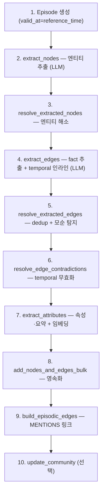

# 03. 수집 파이프라인 (add_episode)

> 소스: `graphiti_core/utils/maintenance/{node_operations,edge_operations,community_operations}.py`, `content_chunking.py`, `bulk_utils.py`

## 1. add_episode 전체 흐름

`graphiti.py:980-1228`. episode 1개를 받아 그래프를 증분 갱신한다.



단계별 함수 (file:line):

| # | 함수 | 위치 | 동작 |
|---|---|---|---|
| 1 | (inline) | graphiti.py:1099 | EpisodicNode 생성, `valid_at`=reference_time |
| 2 | `extract_nodes()` | node_operations.py:70 | episode 타입별 LLM 추출 → `ExtractedEntity`(name, type_id, episode_indices) |
| 3 | `resolve_extracted_nodes()` | node_operations.py:627 | 아래 §2 (해소 3단) |
| 4 | `extract_edges()` | edge_operations.py:117 | fact 추출 + valid_at/invalid_at 인라인. self-edge 제거, 엔티티명 검증 |
| 5 | `resolve_extracted_edges()` | edge_operations.py:325 | dedup + 모순 후보 검색 |
| 6 | `resolve_edge_contradictions()` | edge_operations.py:538 | 아래 §3 (무효화) |
| 7 | `extract_attributes_from_nodes()` | node_operations.py:726 | 커스텀 속성 + 요약 + 임베딩 |
| 8 | `add_nodes_and_edges_bulk()` | bulk_utils.py | 배치 영속화 |
| 9 | `build_episodic_edges()` | edge_operations.py:52 | Entity ←MENTIONS← Episode |
| 10 | `update_community()` | community_operations.py:325 | 신규 노드의 커뮤니티 갱신 |

## 2. 엔티티 해소 — 3단 (LightRAG 대비 강점)

`resolve_extracted_nodes()` (node_operations.py:627) + `dedup_helpers.py`. **LLM 호출 전에 결정적으로 최대한 거른다**:

**1단계 — 결정적 해소** (dedup_helpers.py:220-279)
- **정규화 exact**: `_normalize_string_exact()`(공백 축약·소문자화). 정확히 1개 매치면 즉시 해소
- **엔트로피 게이트**: 이름이 6자 미만 또는 2토큰 미만이면 엔트로피 ≥ 1.5 bits일 때만 fuzzy로 escalate (저변별 이름의 오병합 방지)
- **MinHash/LSH fuzzy**:
  - 정규화 이름의 3-gram shingle → MinHash 서명(32 순열) → LSH 밴딩(밴드 폭 4)으로 O(1) 후보 버킷
  - **Jaccard ≥ 0.9** (90% 겹침)일 때 매치

**2단계 — 의미 검색**: 임베딩 cosine로 기존 노드 질의, **NODE_DEDUP_COSINE_MIN_SCORE = 0.6**, 후보 최대 15개(NODE_DEDUP_CANDIDATE_LIMIT)

**3단계 — LLM dedup**: 모호한 케이스만 `dedupe_nodes.nodes()` 프롬프트로. 추출 노드별 `duplicate_candidate_id`(또는 -1=신규) 선택. 더 구체적 라벨(Person > Entity)이면 승격

→ 결과: 해소된 노드 + `uuid_map`(추출 uuid → canonical uuid). **MinHash/LSH 결정적 1차 필터가 LightRAG·SDK에 없는 비용 절감 포인트**.

상수 정리:

| 상수 | 값 | 의미 |
|---|---|---|
| NODE_DEDUP_COSINE_MIN_SCORE | 0.6 | 의미 검색 임계 |
| _FUZZY_JACCARD_THRESHOLD | 0.9 | MinHash/LSH 매치 |
| _NAME_ENTROPY_THRESHOLD | 1.5 bits | 저변별 이름 fuzzy 게이트 |
| _MINHASH_PERMUTATIONS / _BAND_SIZE | 32 / 4 | LSH 파라미터 |
| NODE_DEDUP_CANDIDATE_LIMIT | 15 | LLM에 보낼 후보 수 |

## 3. 엣지 모순 무효화 (핵심 temporal 기능)

`resolve_extracted_edge()` (edge_operations.py:623-847) — 3 phase:

**Phase 1 — 중복 탐지**: 정규화 fact 텍스트 exact 매치(빠른 경로) → 없으면 `dedupe_edges.resolve_edge()` LLM이 `duplicate_facts` 판정

**Phase 2 — 모순 탐지**: 두 종류 검색
- 관련 엣지(related_edges): 같은 source/target 노드쌍 (dedup용)
- 무효화 후보(existing_edges): 더 넓은 집합 (contradiction용)
- LLM이 **연속 인덱스**로 두 리스트를 받아 `contradicted_facts` 판정 ([05 프롬프트](05-prompts-reference.md))

**Phase 3 — temporal 무효화** (edge_operations.py:538-573, 820-844):
```python
# 모순된 옛 엣지 E가 새 엣지 N보다 먼저 참이 됐으면
if E.valid_at < N.valid_at:
    E.invalid_at = N.valid_at   # E는 N 시작 시점에 거짓이 됨 (event time)
    E.expired_at = utc_now()    # 무효화 기록 (transaction time)
# 새 엣지가 더 오래된 사실이면(역방향) N 자신이 invalid 처리될 수도
```
시간 구간이 겹치지 않으면(이미 무효였거나 미래) skip — 잘못된 무효화 방지.

## 4. Temporal 추출 (valid_at/invalid_at 결정)

두 군데서 발생:

1. **엣지 추출 중 인라인** (extract_edges `edge` 프롬프트) — fact와 함께 valid_at/invalid_at을 ISO8601로 추출. "ongoing(현재형)이면 valid_at=episode 타임스탬프, 변화/종료 표현이면 invalid_at 설정"
2. **dedup 후 보충** (`_extract_edge_timestamps()`, edge_operations.py:576) — 타임스탬프 없는 신규 엣지에 경량 LLM(`extract_timestamps`)으로 채움

**reference_time는 `episode.valid_at`(event time)을 사용** — created_at 아님. 백필 episode(과거 valid_at, 현재 created_at)도 시간순으로 올바르게 정렬됨. "지난주", "2년 전" 같은 상대 표현을 reference_time 기준으로 해소.

## 5. 커뮤니티 빌드 — Label Propagation

`community_operations.py`. **Leiden이 아니라 label propagation** (MS GraphRAG보다 단순):

1. `get_community_clusters()` (30-90): group_id별 인접 투영(노드→이웃+엣지수) → `label_propagation()`
2. Label propagation: 각 노드가 이웃 커뮤니티 중 다수(엣지수 가중)를 채택, 동률은 큰 ID, 변화 없을 때까지 반복
3. `build_community()` (174-213): 클러스터 멤버 요약을 **pairwise LLM 병합**(`summarize_pair`)으로 재귀 축약 → 1개 요약 + `generate_summary_description()`로 이름
4. `update_community()` (325-352): 신규 노드 추가 시 해당 커뮤니티 요약·이름 재계산 + HAS_MEMBER 엣지
- 동시성: MAX_COMMUNITY_BUILD_CONCURRENCY = 10

## 6. 청킹 — episode는 보통 안 자름

`content_chunking.py`. episode는 대개 짧아서 **`should_chunk()`(59-83)가 true일 때만** 청킹:
- content ≥ CHUNK_MIN_TOKENS(~512) **그리고** 엔티티 밀도 높음(대문자 단어/JSON 요소 임계 초과)
- 타입별: JSON(요소/키 경계), text(문단→문장→문자), message(메시지 경계 보존)
- 파라미터: CHUNK_TOKEN_SIZE=2048, CHUNK_OVERLAP_TOKENS=256, CHUNK_MIN_TOKENS=512

> LightRAG/SDK가 "문서→청크"가 기본인 것과 달리, Graphiti는 **episode가 곧 처리 단위**이고 청킹은 예외적(큰 입력만). 문서 RAG와 가장 결이 다른 부분 — 우리 DART 섹션 md를 넣으려면 "섹션=episode"로 매핑하거나 큰 섹션은 청킹에 의존.

## 7. 동시성 & 배치

- `SEMAPHORE_LIMIT=20`(기본), `semaphore_gather()`로 LLM/검색/임베딩 병렬 제한
- `add_episode_bulk()` (graphiti.py:1230): episode 다수를 공유 dedup 컨텍스트로 — 추출·dedup 병렬, 같은 `resolve_extracted_edges()`를 거쳐 무효화도 배치 적용

## 8. 자체 구현에 가져갈 것

1. **3단 엔티티 해소** — 정규화 exact → MinHash/LSH(Jaccard 0.9) → 임베딩(0.6) → LLM. 앞 2단이 결정적이라 LLM 비용을 크게 줄임. LightRAG의 "이름 완전일치"와 SDK의 "임베딩 ANN+LLM" 사이의 실용적 절충
2. **모순 탐지 + temporal 무효화** — 새 fact가 옛 fact를 무효화하는 로직(시간 구간 비교 + LLM 판정). 정정공시·실적 갱신 처리의 핵심
3. **reference_time = event time** — 백필이 시간순을 깨지 않게 하는 설계
4. **MinHash/LSH dedup** 자체 — 대량 엔티티에서 LLM 호출 전 O(1) 후보 추림
