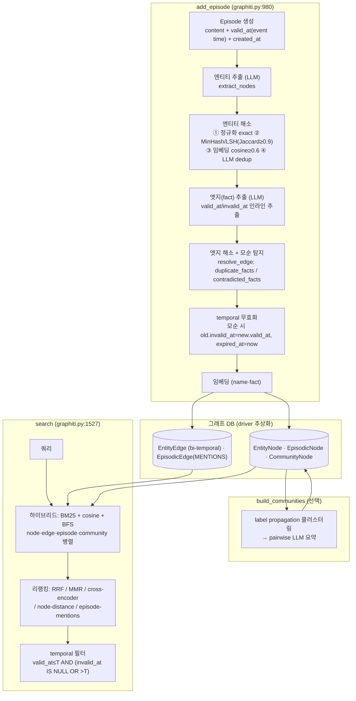

# Graphiti (Zep) 코드 레벨 분석

> 분석 대상: [getzep/graphiti](https://github.com/getzep/graphiti) (commit `623cd33`, 2026-06-09 — 분석일 기준 최신)
> 원본 논문: [Zep: A Temporal Knowledge Graph Architecture for Agent Memory](https://arxiv.org/abs/2501.13956) (2025)
> 분석 방법: repo 클론 후 소스 단위 분석 (`.repos/graphiti`, 코어 `graphiti_core/` 약 36,500줄)
> 목적: **LightRAG의 약점 ⑥(시간성/수치) 보완 레퍼런스** — [LightRAG 08 약점·보완 맵](../lightrag/08-weaknesses-and-complements.md)의 후속. [LightRAG](../lightrag/README.md)·[GraphRAG-SDK](../falkordb-graphrag-sdk/README.md) 분석과 같은 깊이.

Graphiti는 Zep의 에이전트 메모리 엔진으로, **bi-temporal(이중 시간) 지식 그래프**가 핵심이다. 사실(fact)을 삭제하지 않고 "언제 참이었나(event time)"와 "언제 시스템이 알았나(transaction time)"를 분리 추적해, 모순되는 새 사실이 들어오면 옛 사실을 **무효화(invalidate)**하되 이력은 보존한다. 공시처럼 시점별로 값이 바뀌는(분기 실적·임원 변동·정정공시) 도메인에 직결되는 설계다.

## 문서 구성

| # | 문서 | 다루는 것 |
|---|---|---|
| 1 | [논문 & bi-temporal 모델](01-paper-and-bitemporal.md) | Zep 논문 핵심, 3계층(episode·entity/edge·community), **bi-temporal 4 타임스탬프**, edge invalidation, 평가(DMR·LongMemEval) |
| 2 | [아키텍처 & 데이터 모델](02-architecture-data-model.md) | Graphiti 클래스 공개 API, 노드/엣지 전체 필드, group_id 멀티테넌시, 드라이버 추상화(Neo4j/FalkorDB/Kuzu/Neptune), 동시성 |
| 3 | [수집 파이프라인](03-ingestion-pipeline.md) | add_episode 전체 흐름, 엔티티 추출·해소(MinHash/LSH + LLM), 엣지 추출, **temporal 추출·모순 무효화**, 커뮤니티(label propagation), 청킹 |
| 4 | [검색 시스템](04-search-system.md) | search vs search_, 4개 차원(node/edge/episode/community), 리랭킹 5종(RRF·MMR·cross-encoder·node-distance·episode-mentions), **temporal 필터링**, 레시피 |
| 5 | [프롬프트 레퍼런스](05-prompts-reference.md) | 전체 프롬프트 원문 (추출·dedup·**모순 탐지**·temporal·요약) |

## 한눈에 보는 데이터 흐름

## 핵심 차별점 (논문 + 코드)

1. **Bi-temporal 모델** — 모든 fact(EntityEdge)가 4개 타임스탬프를 가짐: `valid_at`/`invalid_at`(현실에서 참인 구간 = event time), `created_at`/`expired_at`(시스템이 알았던 구간 = transaction time). "2024년 6월 시점에 우리가 알던 사실"같은 point-in-time 질의가 가능.
2. **모순 무효화(edge invalidation)** — 새 사실이 옛 사실과 모순되면 옛 엣지를 삭제하지 않고 `invalid_at`을 새 사실의 `valid_at`으로, `expired_at`을 현재로 마킹. **감사 추적(audit trail) 보존**.
3. **Episode 중심 증분** — 입력 단위가 "episode"(메시지/텍스트/JSON/fact triple + 타임스탬프). 배치 재계산 없이 순차 증분, 그래프는 단조 증가.
4. **정교한 엔티티 해소** — 결정적(정규화 exact → MinHash/LSH Jaccard≥0.9) + 의미적(임베딩 cosine≥0.6) + LLM의 3단. LightRAG의 "이름 완전일치"보다 강함.
5. **다중 백엔드** — Neo4j / FalkorDB / Kuzu / Neptune 드라이버 추상화.

상세는 [01 문서](01-paper-and-bitemporal.md).

## LightRAG·GraphRAG-SDK와의 비교 (자체 플랫폼 관점)

| 축 | Graphiti | LightRAG | GraphRAG-SDK |
|---|---|---|---|
| 입력 단위 | **episode**(타임스탬프 필수) | 문서→청크 | 문서→청크 |
| 시간성 | **bi-temporal 4 타임스탬프 + 모순 무효화** | created_at만 (시점 의미 약함) | 없음 |
| 엔티티 해소 | 정규화+MinHash/LSH+임베딩+LLM (4단) | 이름 완전일치 | (이름,타입)+임베딩 ANN+LLM (4종) |
| 엔티티 ID | uuid (이름과 분리) | 이름=ID | type-qualified id |
| 검색 | 하이브리드 + 리랭킹 5종 + temporal 필터 | dual-level + 토큰예산 | MultiPath 9단계 + Text-to-Cypher |
| 커뮤니티 | label propagation + pairwise 요약 | 없음 | 없음 |
| 백엔드 | Neo4j/FalkorDB/Kuzu/Neptune | 12종 ABC | FalkorDB 단일 |
| 청킹 | episode는 보통 작음; 큰 것만 밀도 기반 청킹 | 4종 전략 | 5종 전략 |

## 종합 평가 (엔지니어 관점)

**강점**
- **시점 정확성** — fact마다 valid/invalid 구간을 두는 bi-temporal이 공시 도메인의 "언제 기준 정보냐"를 구조적으로 해결. LightRAG에서 "연도가 엔티티로 잡히던" 문제를 시점 속성으로 흡수
- **모순 자동 처리** — 정정공시·실적 갱신이 옛 fact를 자동 무효화하되 이력 보존 → 감사·시계열 질의에 강함
- **엔티티 해소가 3단**으로 정교 — MinHash/LSH로 LLM 호출 전 결정적 dedup (비용↓)
- **에이전트 메모리에 최적** — episode 단위 증분, group_id 멀티테넌시, MCP 서버 내장

**약점/리스크**
- **episode 모델이 문서 RAG와 결이 다름** — 우리의 DART 섹션 md를 그대로 넣기보다 "episode"로 재구성 필요. 대량 문서 일괄 적재보다 스트리밍 대화/이벤트에 최적화
- **LLM 비용** — 추출·dedup·모순탐지·temporal·요약이 전부 LLM. episode당 다수 콜
- **그래프 DB 필수** — Neo4j/FalkorDB 등 실제 그래프 DB 요구 (LightRAG처럼 OpenSearch 단일로는 안 됨)
- 커뮤니티가 label propagation(MS GraphRAG의 Leiden보다 단순) — 글로벌 요약 품질은 MS 대비 약할 수 있음

**자체 플랫폼에 가져갈 것**
1. **bi-temporal 4 타임스탬프 스키마** — fact에 valid/invalid(event) + created/expired(transaction). 공시 RAG의 정확성 기반. [01 문서](01-paper-and-bitemporal.md)
2. **모순 무효화 로직** — `resolve_edge_contradictions()`의 시간 구간 비교 + LLM contradiction 탐지 프롬프트 ([05 문서](05-prompts-reference.md))
3. **MinHash/LSH 결정적 dedup** — LLM 호출 전 저비용 1차 필터. LightRAG·SDK에 없는 부분
4. **temporal 검색 필터** — `valid_at≤T AND (invalid_at IS NULL OR >T)` 패턴을 검색에 일급으로
