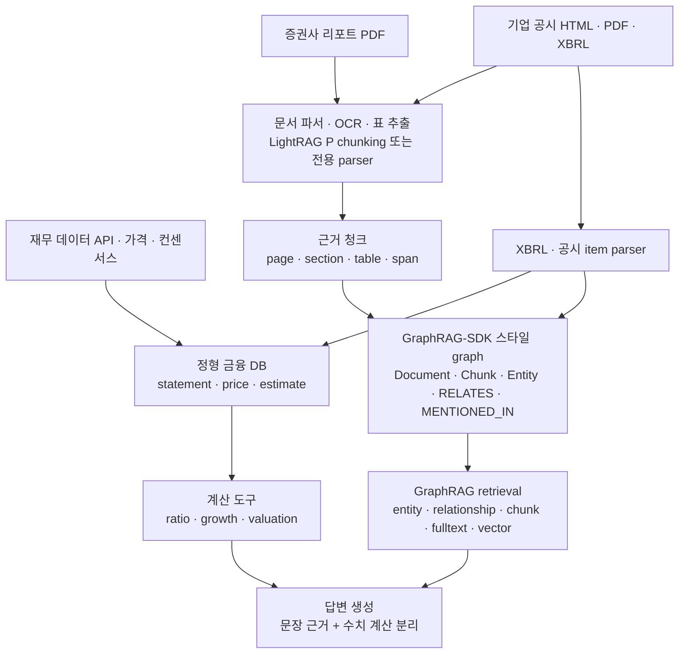

# 금융 서비스 관점 LightRAG vs GraphRAG-SDK 평가

작성일: 2026-06-09  
대상: 증권사 리포트, 기업 공시, 재무 데이터, 종목/기업/인물/이벤트 관계를 다루는 금융 RAG/GraphRAG 서비스

## 결론 요약

금융 서비스에서는 **LightRAG와 GraphRAG-SDK 중 하나만 고르는 문제로 보면 안 된다.** 금융 데이터는 크게 세 계층으로 나뉜다.

| 계층 | 예시 | 핵심 요구 |
|---|---|---|
| 비정형 문서 | 증권사 PDF 리포트, IR 자료, 실적발표 스크립트, 뉴스 | 표/문단/페이지 구조 보존, 인용, 문서별 업데이트 |
| 반정형 공시 | 사업보고서, 분기보고서, 8-K/10-K/10-Q, XBRL, DART/EDGAR HTML | 항목/섹션 구조, 근거 위치, 기업/기간/계정 매핑 |
| 정형 재무 데이터 | 손익계산서, 재무상태표, 현금흐름, 주가, 밸류에이션, 컨센서스 | 수치 정합성, 기간/단위/통화, 계산 재현성 |

**리포트와 공시 문서 처리 자체는 LightRAG가 더 유리하다.** 특히 `Paragraph Semantic` chunking은 heading, table, sidecar, table header reinjection을 고려하므로 PDF/리포트류에 강하다.

**서비스의 신뢰 가능한 질의·근거 추적·도메인 그래프 운영은 GraphRAG-SDK가 더 유리하다.** `Document -> Chunk -> Entity`, `MENTIONED_IN`, `RELATES`, ontology pruning, update/delete/apply_changes는 금융 서비스에서 중요한 provenance와 schema governance에 맞다.

따라서 실무 추천은 다음이다.

1. **단일 선택**이라면: 금융 QA/리서치 서비스의 production core는 **GraphRAG-SDK**가 더 적합하다. 단, 별도의 문서 파서와 table/XBRL 처리기를 붙여야 한다.
2. **문서 ingestion 품질이 최우선**이면: **LightRAG**가 더 적합하다. 특히 PDF 리포트, 표, 복잡한 heading 구조가 많을 때 유리하다.
3. **가장 현실적인 구조**는: LightRAG식 구조 인식 청킹/파싱 + GraphRAG-SDK식 provenance/ontology graph + 별도 정형 재무 DB 조합이다.

## 권장 아키텍처

핵심은 **수치 답변을 RAG 청크에서 바로 생성하지 않는 것**이다. 매출 성장률, 영업이익률, PER, PBR, YoY/QoQ 같은 값은 정형 DB/계산 도구에서 산출하고, RAG/GraphRAG는 "왜 그런지", "어느 문서가 근거인지", "경영진이 어떻게 설명했는지"를 보강해야 한다.

## 항목별 평가

### 1. 증권사 리포트 PDF

| 관점 | LightRAG | GraphRAG-SDK | 판단 |
|---|---|---|---|
| PDF/복잡 문서 구조 | MinerU/Docling/native parser와 `P` chunking 흐름이 강함 | PDF loader는 있지만 table-aware chunking은 제한적 | LightRAG 우세 |
| 표 처리 | `Paragraph Semantic`에서 table row split, header reinjection, bridge text 처리 | 구조 chunking은 있으나 표 전용 처리가 약함 | LightRAG 우세 |
| 리포트 섹션 보존 | heading/path 기반 chunking 가능 | structural breadcrumbs 가능하지만 단순 | LightRAG 우세 |
| 원문 근거 추적 | chunk metadata, source span, file path | graph-native `Document/Chunk/PART_OF/MENTIONED_IN` | GraphRAG-SDK 우세 |
| 분석 질의 | local/global/mix mode로 문서+KG 검색 | multi-path retrieval로 entity/fact/chunk 통합 | 근소하게 GraphRAG-SDK |

리포트는 긴 narrative와 표가 섞여 있고, "투자의견 변경 이유", "목표주가 산정 근거", "리스크 요인"처럼 섹션 기반 답변이 많다. 이 단계에서는 LightRAG의 문서 구조 청킹이 유리하다.

하지만 리포트를 서비스에서 계속 쌓고, 특정 기업/산업/애널리스트/이벤트별로 근거를 추적하려면 GraphRAG-SDK의 graph-native provenance가 더 낫다. 따라서 리포트만 놓고도 **ingestion은 LightRAG 스타일, retrieval graph는 GraphRAG-SDK 스타일**이 좋은 조합이다.

### 2. 기업 공시

| 관점 | LightRAG | GraphRAG-SDK | 판단 |
|---|---|---|---|
| 공시 HTML/PDF 섹션 chunking | 문서 구조 기반 chunking이 강함 | loader/structural chunking 커스터마이징 필요 | LightRAG 우세 |
| 계정/기간/법인/entity schema | prompt 중심으로 느슨함 | `Ontology`, entity/relation patterns, pruning 제공 | GraphRAG-SDK 우세 |
| update/delete | 문서 삭제와 KG regeneration 지원 | `update`, `delete_document`, `apply_changes`, content hash no-op | GraphRAG-SDK 우세 |
| 공시 revision 대응 | 가능하지만 운영 설계 필요 | pending document cutover와 stale fact cleanup 설계가 명확 | GraphRAG-SDK 우세 |
| 근거 그래프 | graph storage 선택 가능 | Document/Chunk/Entity provenance 강제 | GraphRAG-SDK 우세 |

공시는 리포트보다 **schema와 lifecycle**이 더 중요하다. 같은 회사의 분기보고서가 계속 쌓이고, 정정공시/수정 filing이 발생하며, `Company`, `Filing`, `ReportingPeriod`, `Metric`, `Segment`, `RiskFactor`, `Subsidiary`, `Executive` 같은 타입이 반복된다.

이 관점에서는 GraphRAG-SDK가 더 적합하다. 이유는 다음이다.

- ontology로 entity/relation type을 제한할 수 있다.
- off-schema extraction을 pruning할 수 있다.
- 문서 업데이트와 삭제에 대한 public API가 명확하다.
- `source_chunk_ids`와 `MENTIONED_IN`으로 stale fact cleanup을 설계하기 좋다.

다만 공시 원문이 HTML table, XBRL, PDF table로 복잡하다면 GraphRAG-SDK 기본 loader만으로는 부족하다. 별도 filing parser를 만들어 `DocumentOutput.elements` 또는 custom `LoaderStrategy`/`ChunkingStrategy`로 넣는 전제가 필요하다.

### 3. 정형 재무 데이터

| 관점 | LightRAG | GraphRAG-SDK | 판단 |
|---|---|---|---|
| 수치 저장소 | RAG/vector 중심, 별도 DB 필요 | FalkorDB graph에 넣을 수 있으나 columnar/OLAP는 아님 | 둘 다 단독 부적합 |
| 계산 정확성 | LLM/RAG로 계산하면 위험 | LLM/RAG로 계산하면 위험 | 별도 정형 DB 필수 |
| metric ontology | 별도 설계 필요 | `Ontology`로 metric/account relation 표현 가능 | GraphRAG-SDK 보조 우세 |
| 수치 근거 연결 | chunk/source metadata | `Metric -> Filing -> Chunk` 같은 graph modeling 쉬움 | GraphRAG-SDK 우세 |

재무 수치는 RAG의 주 저장소로 두면 안 된다. 다음은 정형 DB나 analytics layer에서 처리해야 한다.

- 매출/영업이익/순이익/FCF.
- YoY/QoQ/CAGR.
- PER/PBR/EV/EBITDA.
- 부문별 매출, 지역별 매출.
- 컨센서스 대비 surprise.
- 주가/거래량/시가총액.

GraphRAG는 이 숫자의 **출처와 의미**를 연결하는 데 써야 한다.

예:

- `Company -[FILED]-> Filing`
- `Filing -[HAS_PERIOD]-> ReportingPeriod`
- `Filing -[DISCLOSES]-> Metric`
- `Metric -[EVIDENCED_BY]-> Chunk`
- `Company -[MENTIONED_IN]-> AnalystReport`
- `AnalystReport -[HAS_RATING]-> Rating`
- `AnalystReport -[HAS_TARGET_PRICE]-> TargetPrice`

이 모델링은 GraphRAG-SDK 쪽이 더 자연스럽다.

## 금융 서비스 요구사항별 점수

5점 만점의 엔지니어링 적합도다. 라이선스/운영 정책은 별도 검토가 필요하다.

| 요구사항 | LightRAG | GraphRAG-SDK | 코멘트 |
|---|---:|---:|---|
| PDF 리포트 ingestion | 5 | 3 | LightRAG의 parser/paragraph semantic chunking 우세 |
| 표/heading 보존 | 5 | 3 | 리포트와 사업보고서에 중요 |
| 공시 schema extraction | 3 | 5 | GraphRAG-SDK ontology/pruning 우세 |
| 근거 추적/audit trail | 4 | 5 | GraphRAG-SDK는 provenance가 graph-native |
| 재무 수치 계산 | 2 | 2 | 둘 다 단독 부적합. 별도 DB/tool 필요 |
| 기업/인물/이벤트 관계 그래프 | 4 | 5 | GraphRAG-SDK가 schema와 traversal에 더 맞음 |
| 리포트 검색 UX | 5 | 4 | LightRAG WebUI/API 장점 |
| production update/delete | 4 | 5 | GraphRAG-SDK incremental API가 더 명확 |
| backend 선택권 | 5 | 2 | LightRAG 우세 |
| 운영 단순성 | 3 | 4 | FalkorDB 고정이면 GraphRAG-SDK가 단순 |
| 금융 domain customization | 4 | 5 | GraphRAG-SDK Strategy/Ontology 구조가 명시적 |
| 라이선스 단순성 | 5 | 3 | SDK는 Apache-2.0이나 FalkorDB DB 서버 라이선스 별도 검토 |

## 사용 시나리오별 추천

### A. "증권사 리포트 검색/요약" 중심

추천: **LightRAG 우선**

이유:

- PDF/표/heading 구조가 품질을 좌우한다.
- 리포트는 narrative가 길고 섹션 맥락이 중요하다.
- `P` chunking과 multimodal parser가 유리하다.
- WebUI/API로 내부 PoC가 빠르다.

주의:

- 기업/종목/산업 entity normalization은 별도 보강이 필요하다.
- 수치 계산은 RAG 답변에 맡기지 말고 structured tool을 붙여야 한다.

### B. "공시 기반 기업 지식 그래프" 중심

추천: **GraphRAG-SDK 우선**

이유:

- 공시는 ontology가 명확하다.
- `Company`, `Filing`, `Period`, `Metric`, `Risk`, `Segment`, `Executive` 같은 타입이 반복된다.
- 정정/삭제/update lifecycle이 중요하다.
- 답변에서 "어느 filing의 어느 chunk에서 나온 fact인가"가 중요하다.

주의:

- XBRL/HTML table parser는 직접 붙이는 것이 좋다.
- 기본 chunker만으로 공시 표를 안정적으로 처리하기는 어렵다.

### C. "재무 데이터 Q&A/계산" 중심

추천: **둘 중 하나만으로 만들지 말 것**

권장 구조:

- 정형 DB: financial statements, price, estimates.
- 계산 tool: ratio/growth/valuation.
- GraphRAG: entity resolution, 문서 근거, 설명/리스크/가이던스 맥락.

GraphRAG-SDK가 이 구조의 graph orchestration에는 더 잘 맞고, LightRAG는 문서 ingestion 보조로 쓰기 좋다.

### D. "내부 애널리스트 리서치 어시스턴트"

추천: **혼합 구조**

권장:

- LightRAG: 리포트/IR/PDF ingestion, paragraph/table-aware chunking.
- GraphRAG-SDK: canonical graph, ontology, provenance, retrieval.
- 별도 Finance DB: 수치와 계산.

이 구조가 질문 유형을 가장 잘 나눈다.

| 질문 유형 | 처리 경로 |
|---|---|
| "삼성전자 2025년 CAPEX 가이던스가 어떻게 바뀌었나?" | 공시/IR chunk + event graph |
| "최근 3개 리포트의 목표주가 상향 이유는?" | report chunks + analyst/target price graph |
| "영업이익률 YoY 변화는?" | structured financial DB 계산 |
| "사업보고서상 주요 리스크는?" | filing section chunks + risk ontology |
| "A사가 B사 공급망에 노출된 근거는?" | entity/relation graph + source chunks |

## 금융 도메인 ontology 예시

GraphRAG-SDK를 쓴다면 최소 ontology는 다음처럼 잡는 것이 좋다.

| Entity | 설명 |
|---|---|
| `Company` | 상장사, 자회사, 경쟁사, 고객사, 공급사 |
| `Security` | 주식, 채권, ETF 등 |
| `AnalystReport` | 증권사 리포트 |
| `Filing` | 공시 문서 |
| `ReportingPeriod` | FY, Q, 반기, 날짜 범위 |
| `Metric` | 매출, 영업이익, EPS, FCF 등 |
| `Segment` | 사업부, 지역, 제품군 |
| `Person` | 경영진, 애널리스트 |
| `Event` | 실적발표, M&A, 증자, 소송, 규제 |
| `RiskFactor` | 리스크 요인 |
| `Guidance` | 회사 가이던스 |
| `Rating` | Buy/Hold/Sell, 목표주가 |

| Relation | 패턴 |
|---|---|
| `FILED` | `Company -> Filing` |
| `COVERS` | `AnalystReport -> Company` |
| `AUTHORED_BY` | `AnalystReport -> Person` |
| `HAS_TARGET_PRICE` | `AnalystReport -> Rating` |
| `DISCLOSES` | `Filing -> Metric` |
| `HAS_PERIOD` | `Metric -> ReportingPeriod` |
| `HAS_SEGMENT` | `Company -> Segment` |
| `MENTIONS_EVENT` | `Filing/AnalystReport -> Event` |
| `HAS_RISK` | `Company/Filing -> RiskFactor` |
| `SUPPLIES_TO` | `Company -> Company` |
| `COMPETES_WITH` | `Company -> Company` |

## 최종 선택

금융 서비스의 우선순위가 **정확한 근거 추적, 공시 업데이트, schema 기반 관계 그래프, 답변 auditability**라면 GraphRAG-SDK가 더 좋은 중심축이다.

반대로 우선순위가 **PDF 리포트/IR 자료의 chunk 품질, 표와 heading 보존, 빠른 RAG UI/API 구성**이라면 LightRAG가 더 좋은 출발점이다.

실무적으로는 다음 조합이 가장 안정적이다.

1. LightRAG 또는 별도 parser로 리포트/공시를 구조화한다.
2. 정형 재무 수치는 별도 DB에 넣는다.
3. GraphRAG-SDK/FalkorDB 스타일 graph로 `Document`, `Chunk`, `Company`, `Metric`, `Filing`, `Report`, `Event` 관계와 provenance를 관리한다.
4. 답변 생성 시 "수치 계산"과 "문서 근거 설명"을 분리한다.

한 줄로 정리하면: **금융 서비스의 core graph/runtime은 GraphRAG-SDK 쪽이 더 맞고, 금융 문서 ingestion 품질은 LightRAG 쪽이 더 좋다.**
