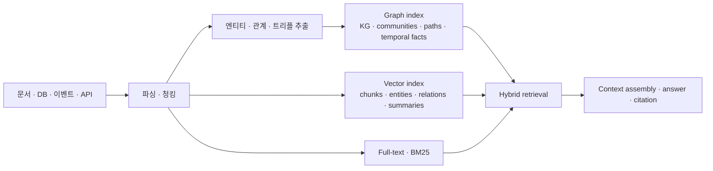

# 그래프+벡터 하이브리드 RAG 오픈소스 조사

## 조사 기준

이 문서는 LightRAG처럼 **문서/데이터 ingest → 청킹/추출 → 그래프·벡터 인덱싱 → 하이브리드 조회/RAG 응답** 흐름을 제공하는 오픈소스를 찾기 위한 조사다. 단순 graph DB, 단순 vector DB, 블로그 예제, 특정 벤치마크 재현 스크립트는 제외하거나 낮은 등급으로 분류했다.

평가 기준은 다음과 같다.

- **인제스천**: 파일, 텍스트, URL, DB, API 입력을 직접 받을 수 있는가
- **청킹/파싱**: 내장 chunker 또는 문서 parser 연동이 있는가
- **KG 구성**: entity/relation, triple, property graph, ontology, temporal fact 등을 생성하는가
- **벡터 인덱싱**: chunk/entity/relation/summary embedding을 저장·검색하는가
- **그래프 조회**: graph traversal, Cypher/SPARQL, PPR, community report, relation expansion이 있는가
- **하이브리드 조회**: vector + graph + keyword/fulltext를 query-time에 결합하는가
- **서비스화**: SDK/API/UI/MCP/증분 업데이트/멀티테넌시 등 운영 표면이 있는가

## 한눈에 결론

가장 LightRAG와 직접 비교할 수 있는 후보는 **nano-graphrag, MiniRAG, HiRAG, FastGraphRAG, Microsoft GraphRAG, FalkorDB GraphRAG-SDK, Youtu-GraphRAG, Vector Graph RAG**다. 이 중 **nano-graphrag → LightRAG / MiniRAG / HiRAG**는 코드 계보가 직접 이어지는 "LightRAG 직계 가족"이다. 서비스/플랫폼 관점까지 넓히면 **R2R, Flexible GraphRAG, Cognee, TrustGraph, AWS graphrag-toolkit, Graphiti, KAG**가 더 넓은 운영 표면을 가진다.

### LightRAG 직계 계보 (반드시 같이 보는 그룹)

LightRAG가 "청킹 + LLM entity/relation 추출 + 그래프+벡터 인덱싱 + local/global/hybrid/mix 질의"를 한 객체(`rag.insert()` / `rag.query()`)로 묶은 것처럼, **같은 코드 뿌리(nano-graphrag)를 공유하면서 거의 동일한 사용 경험을 주는** 프로젝트가 따로 있다. "LightRAG처럼 쓰고 싶다"면 가장 먼저 봐야 할 그룹이다.

| 프로젝트 | 계보 | LightRAG 대비 한 줄 |
|---|---|---|
| **nano-graphrag** | LightRAG의 코드 뿌리(조상) | ~1.1천 라인 최소 GraphRAG. MS GraphRAG의 community-summary/global search를 유지 |
| **LightRAG** | nano-graphrag 기반 | dual-level keyword retrieval, 증분 업데이트, parser routing, 다수 storage backend, WebUI/API |
| **MiniRAG** | LightRAG·nano-graphrag 기반 (같은 HKUDS 연구실) | **소형/온디바이스 LLM**용. chunk+entity 이종 그래프 + 토폴로지 검색으로 LLM 의존을 줄임 (ACL 2026) |
| **HiRAG** | nano-graphrag 기반 | **계층형 KG**(상위 summary entity) + community 간 최단경로 bridge 추론 (EMNLP 2025 Findings) |

> 참고: Graphiti, KAG, HippoRAG2, Fast GraphRAG, FalkorDB GraphRAG-SDK, Neo4j GraphRAG Python, Docling, TypeGraph의 **코드 레벨 심층 분석**은 [`../rag-graphrag-expansion/2026-landscape.md`](../rag-graphrag-expansion/2026-landscape.md)에 별도로 정리되어 있다. 이 문서는 "LightRAG 동급 엔진"이라는 관점에서 더 넓게 후보를 모으고 등급화하는 데 집중한다.

## 후보 등급

### Tier 1 — LightRAG 대체/경쟁 후보

| 프로젝트 | 성격 | 강점 | 약점 | 라이선스 | 적합도 |
|---|---|---|---|---|---|
| LightRAG | 경량 GraphRAG 엔진 | parser routing, 4종 chunking, KG+vector, local/global/hybrid/mix query, WebUI/API, 다양한 storage | KG 품질은 LLM 추출 품질에 의존, 운영자가 storage consistency를 직접 설계해야 함 | MIT | 기준점 |
| FalkorDB GraphRAG-SDK | FalkorDB 기반 GraphRAG SDK | `ingest`, `completion`, source citation, schema/ontology, incremental update, FalkorDB graph traversal | FalkorDB 종속, 문서 파싱 범위는 LightRAG/RAGFlow보다 좁음 | Apache-2.0 | 매우 높음 |
| Microsoft GraphRAG | batch indexing + local/global/DRIFT query | entity/relation/claim extraction, Leiden community, community reports, vector store, 전역 요약 질의 품질 | 인덱싱 비용 큼, batch 중심, 서비스 API/UI는 별도 구현 필요 | MIT | 높음 |
| FastGraphRAG | PageRank 기반 경량 GraphRAG | 내장 chunker, HNSW vector, igraph graph, incremental update, PPR 기반 query | 문서 parser/운영 표면은 얇음, 생태계는 작음 | MIT | 높음 |
| nano-graphrag | 작은 GraphRAG 구현 (LightRAG 조상) | 1천여 라인대 경량 구현, token/text chunking, NetworkX/Neo4j, nano-vectordb/HNSW/faiss 예제, MS식 community report/global search 유지 | production 기능은 제한적, community report 재계산 비용, 유지보수 느슨(2024 말 이후) | MIT | 중상 |
| MiniRAG | 소형 LLM용 경량 GraphRAG (HKUDS) | LightRAG·nano-graphrag 기반. chunk+entity **이종 그래프** + topology-enhanced retrieval로 SLM·온디바이스에서 동작, 저장량 ~25%로 유사 정확도 주장(ACL 2026) | 문서 parser/운영 표면은 LightRAG 상속분 수준, community report 미사용 | MIT | 높음 |
| HiRAG | 계층형 KG GraphRAG (연구형) | nano-graphrag 기반. 상위 summary entity 계층(GMM 클러스터링) + local/global/**bridge(최단경로)** 검색, LightRAG 대비 우위 주장(EMNLP 2025 Findings) | 연구 코드(서버/UI 없음), 기본 backend는 NetworkX+nano-vectordb 추정 | MIT | 중상 |
| Youtu-GraphRAG | schema-guided 에이전틱 GraphRAG (Tencent) | seed schema로 추출 bound, 4레벨 지식트리(attr·relation·keyword·community), `DualFAISSRetriever`+`KTRetriever`+agentic decomposer, LightRAG 직접 벤치마크(ICLR 2026) | 연구 출신이라 production hardening 초기, 토큰비용·정확도 수치는 벤더 자체 보고 | MIT | 높음 |
| Vector Graph RAG | Milvus-only graph-like RAG | 문서 loader, 자동 chunking, triplet extraction, entity/relation을 vector로 저장, subgraph expansion, REST/UI | 실제 graph DB가 아니라 graph를 vector DB에 인코딩, 그래프 질의/정합성은 제한 | MIT | 중상 |

### Tier 2 — 플랫폼/프레임워크형 강후보

| 프로젝트 | 성격 | 강점 | 약점 | 라이선스 | 적합도 |
|---|---|---|---|---|---|
| R2R (SciPhi) | RESTful agentic RAG 서버 | 멀티모달 ingest, hybrid(vector+keyword, RRF), 자동 KG build+community summary, agentic/deep-research retrieval, 인증·멀티테넌시·대시보드 | KG가 Postgres+pgvector에 저장(전용 graph DB 아님), 라이브러리보다 제품 서버, 운영 무게감 | MIT | 매우 높음 |
| Flexible GraphRAG | 풀스택 AI context platform | Docling/LlamaParse, KG auto-build, ontology/RDF, 15 graph DB, 10 vector DB, fulltext, hybrid search, REST/UI/MCP, incremental sync | 통합 범위가 매우 넓어 복잡도 큼, 자체 엔진이라기보다 LlamaIndex/LangChain 조립 플랫폼 | Apache-2.0 | 매우 높음 |
| Cognee | AI memory platform | `remember/recall`, 데이터 ingest, self-hosted KG, vector embeddings, graph reasoning, ontology generation, UI/CLI | 문서 QA 제품보다 agent memory 성격, 검색 모드와 스키마 이해 필요 | Apache-2.0 | 높음 |
| TrustGraph | graph-native context platform | 7단계 파이프라인(chunk→extract→embed→store→retrieve→traverse→generate), RDF 트리플, ontology workbench(OWL/Turtle), provenance, "context cores" | 마이크로서비스 플랫폼이라 무겁고 임베드형 라이브러리는 아님 | Apache-2.0 | 높음 |
| AWS graphrag-toolkit | 클라우드 lexical-graph 툴킷 | LlamaIndex 기반 ingest, 계층형 lexical graph(chunk→topic→statement→fact→entity), Traversal/SemanticGuided 두 하이브리드 retriever, 멀티테넌시 | Neptune/OpenSearch/S3 Vectors 등 AWS 친화, proposition 중심 그래프(트리플 아님) | Apache-2.0 | 높음 |
| Morphik | 멀티모달 RAG/문서 스토어 | ColPali 비주얼 검색(PDF/이미지/표/다이어그램), `ingest_file`, opt-in `create_graph`(LLM entity/relation), 캐싱·룰엔진 | 그래프는 보조(핵심은 멀티모달 벡터), graph+vector 융합 명세 약함, **BSL 1.1**(4년 후 Apache 전환) | BSL-1.1 | 중상 |
| Graphiti | temporal context graph engine | episode ingest, bi-temporal facts, provenance, learned/prescribed ontology, semantic+BM25+graph traversal, Neo4j/FalkorDB/Neptune/Kuzu | chunked document RAG보다는 동적 agent memory에 최적화, 답변 생성/문서 citation은 직접 구성 필요 | Apache-2.0 | 높음 |
| KAG | OpenSPG 기반 Knowledge Augmented Generation | schema-constrained KG, chunk-KG mutual indexing, logical-form guided hybrid retrieval, KG reasoning + vector/text retrieval, 제품형 UI | OpenSPG 포함 인프라가 무겁고 학습 비용 큼, 중국어 문서/생태계 비중 큼 | Apache-2.0 | 높음 |
| RAGFlow | 제품형 RAG 플랫폼 | DeepDoc 문서 이해, dataset ingestion, RAPTOR/GraphRAG 옵션, Elasticsearch/Infinity/MinIO/Redis/MySQL 기반 운영형 | GraphRAG는 핵심 엔진이라기보다 dataset indexing 옵션, graph DB 중심 설계는 아님 | Apache-2.0 | 중상 |
| Neo4j GraphRAG Python | Neo4j 공식 GraphRAG 라이브러리 | SimpleKGPipeline, schema 기반 KG build, Neo4j vector index, Vector/Hybrid/Text2Cypher retriever | Neo4j 중심 부품 라이브러리, LightRAG식 end-to-end app은 직접 조립 | Apache-2.0 | 중상 |
| LlamaIndex PropertyGraphIndex | RAG 프레임워크 컴포넌트 | PropertyGraphIndex, Simple/Schema/Implicit extractor, LLMSynonym + VectorContext + TextToCypher retriever 조합 | 범용 프레임워크라 운영형 GraphRAG 제품은 아님 | MIT | 중상 |

### Tier 3 — 특수 목적/연구/보조 후보

| 프로젝트 | 성격 | 강점 | 약점 | 라이선스 | 적합도 |
|---|---|---|---|---|---|
| HippoRAG 2 | 연구형 memory/RAG framework | OpenIE + dense retrieval + Personalized PageRank, multi-hop retrieval 강점 | 문서 파싱/서비스 API/DB backend는 제한적, 연구 재현 성격 강함 | MIT | 중 |
| AutoSchemaKG / AtlasRAG | 자율 schema 유도 + web-scale KG | 사전 schema 없이 triple+event 추출 후 schema 자동 induction, 십억 규모 ATLAS KG, `atlas-rag`로 RAG(FAISS+Neo4j/NetworkX) | construction이 주역, 검색부(`atlas_rag`) 완성도·named retriever는 README로 확인 어려움 | MIT | 중 |
| E²GraphRAG | 효율 중심 GraphRAG (연구) | LLM summary tree + SpaCy entity graph, entity↔chunk 양방향 인덱스, adaptive local/global, 인덱싱 ~10×·검색 ~100× 속도 주장 | 연구 코드, 운영 표면 얇음, 효과성은 competitive 수준 | (repo 확인 필요) | 중 |
| txtai | 임베딩 DB + semantic graph 프레임워크 | 벡터(dense+sparse)+graph+RDBMS 통합, 문서 파이프라인, vector-SQL, LLM workflow | 기본 graph는 **유사도 엣지**(LLM 추출은 옵션), 턴키 GraphRAG가 아니라 직접 조립 | Apache-2.0 | 중 |
| Synaptic Memory | LLM-free graph memory + MCP | CSV/JSONL/DB/docs ingest, CDC sync, HNSW vector, FTS, MCP, Korean FTS, zero LLM index | LLM 기반 KG 추출이 아니라 결정적/스키마 기반 그래프에 가까움 | Apache-2.0 | 중 |
| WhyHow Knowledge Graph Studio | RAG-native KG studio | rule-based entity resolution, modular graph construction, flexible ingestion, MongoDB 기반 API/SDK | 최근 activity가 약하고 full hybrid RAG runtime보다는 KG 생성/관리 성격 | MIT | 중 |
| LangChain graph QA 계열 | 범용 framework 부품 | Neo4j/Cypher QA, graph query chain, 다른 retriever와 조립 가능 | 현재 repo 기준 LightRAG 같은 GraphVectorStore end-to-end 흐름은 약함 | MIT | 낮음 |

## 개별 분석

### 1. FalkorDB GraphRAG-SDK

**문제 정의**: FalkorDB를 GraphRAG 전용 graph store로 두고, raw document에서 cited answer까지 짧은 코드로 연결한다.

**핵심 구조**

- `GraphRAG.ingest()`로 문서 로딩, 청킹, entity/relation extraction, FalkorDB upsert 수행
- source chunk와 entity/relation을 연결해 답변 provenance를 추적
- schema를 직접 줄 수 있고, ontology discovery/grounded discovery 파이프라인도 존재
- `apply_changes`, `update`, `delete_document`로 문서 단위 증분 업데이트 지원
- retrieval strategy/router 구조가 있어 vector, traversal, Text-to-Cypher 같은 경로를 확장 가능

**LightRAG 대비**

LightRAG가 storage abstraction과 query mode가 넓은 경량 엔진이라면, GraphRAG-SDK는 **FalkorDB에 최적화한 production-oriented SDK**다. 그래프 DB를 FalkorDB로 확정할 수 있으면 강한 후보지만, vector/graph backend 선택 자유도는 LightRAG보다 낮다.

### 2. Microsoft GraphRAG

**문제 정의**: private text corpus를 entity graph와 community hierarchy로 변환해 naive vector RAG가 약한 전역 요약/테마 질의를 처리한다.

**핵심 구조**

- indexing pipeline이 raw text에서 text unit, entity, relationship, claim을 추출
- Leiden community detection으로 hierarchy 생성
- community report를 LLM으로 생성하고, text unit/entity/community report embedding을 vector store에 기록
- query는 Local, Global, DRIFT를 제공한다
- 기본 산출물은 Parquet table이며 vector store는 LanceDB, Azure AI Search, Cosmos DB 등을 지원

**LightRAG 대비**

품질 기준점이지만 batch indexing 비용과 지연이 크다. 서비스 내부에 얇게 넣는 엔진이라기보다는 **오프라인 인덱싱/분석 파이프라인**에 가깝다.

### 3. Flexible GraphRAG

**문제 정의**: GraphRAG/RAG를 하나의 선택 가능한 platform으로 묶고, 데이터 소스, parser, graph DB, vector DB, fulltext engine, ontology, UI, MCP를 모두 바꿀 수 있게 한다.

**핵심 구조**

- Docling 또는 LlamaParse로 문서 처리
- LlamaIndex/LangChain을 stage별로 선택
- property graph, RDF/SPARQL, vector DB, fulltext engine을 조합
- REST API, Angular/React/Vue UI, MCP server 제공
- 13개 data source와 일부 source의 incremental auto-sync 제공

**LightRAG 대비**

LightRAG보다 훨씬 넓은 플랫폼이다. 대신 엔진 단순성은 떨어진다. 이미 Neo4j/Qdrant/OpenSearch/Docling 같은 사내 표준이 있고 “조립 가능한 운영 플랫폼”을 원하면 가장 넓은 후보지만, 작은 서비스에 임베드하기엔 무겁다.

### 4. Cognee

**문제 정의**: agent에게 장기 기억을 제공하기 위해 데이터를 ingest하고 self-hosted knowledge graph와 vector embedding을 함께 유지한다.

**핵심 구조**

- `remember`, `recall`, `forget`, `improve` API
- add/cognify/search 계열 파이프라인
- graph DB와 vector DB를 별도 설정 가능
- Docling, Unstructured, PDF, text/image loader 등 외부 loader 계층
- graph/vector/relational store를 함께 쓰는 memory platform

**LightRAG 대비**

문서 QA 엔진보다 **AI memory control plane**에 가깝다. 대화/행동/문서/구조화 데이터를 계속 누적하는 agent 시스템에는 적합하지만, 리포트 PDF 중심 citation QA만 놓고 보면 RAGFlow/LightRAG/Flexible GraphRAG가 더 직접적이다.

### 5. Graphiti

**문제 정의**: 동적으로 변하는 사실을 시간 그래프에 저장하고, agent가 최신/과거 맥락을 모두 검색할 수 있게 한다.

**핵심 구조**

- `add_episode`로 text, message, JSON 등 episode ingest
- entity, edge, fact validity window, provenance를 유지
- semantic embedding, BM25 fulltext, graph traversal, reranker를 결합
- Neo4j, FalkorDB, Neptune, Kuzu backend 지원
- MCP server 제공

**LightRAG 대비**

정적 문서 GraphRAG가 아니라 **temporal agent memory**다. 금융 서비스에서도 “기업 이벤트가 시간에 따라 바뀜”, “애널리스트 의견 변경”, “사용자 조사 맥락 축적” 같은 동적 상태에는 강하다. 반면 PDF chunk citation RAG는 별도 parser/문서 저장 계층을 붙여야 한다.

### 6. KAG

**문제 정의**: vector similarity의 모호성, OpenIE GraphRAG의 noise를 줄이기 위해 OpenSPG 기반 domain schema, logical form, KG reasoning을 결합한다.

**핵심 구조**

- kg-builder: structured/unstructured data에서 KG build
- kg-solver: planning, reasoning, retrieval operator로 logical-form guided solving
- Chunk, KnowledgeUnit, Outline, Summary, AtomicQuery, Table 등 index type
- graph와 original chunk의 mutual indexing
- FR/CS/vector retriever, PPR chunk retriever 등 hybrid path

**LightRAG 대비**

KAG는 더 **온톨로지/스키마/논리 추론 중심**이다. 금융/법률/의료 같은 전문 도메인에는 장기적으로 매력적이지만 OpenSPG 인프라와 개념 모델을 받아들여야 해서 도입 장벽이 높다.

### 7. Vector Graph RAG

**문제 정의**: graph DB 없이 Milvus vector search만으로 entity/relation graph-like retrieval을 구현한다.

**핵심 구조**

- text, URL, PDF, DOCX importer와 automatic chunking
- LLM triplet extraction 또는 pre-extracted triplet 입력
- entities와 relations를 vector로 Milvus에 저장
- query entity extraction → vector search → subgraph expansion → LLM reranking → answer
- FastAPI backend와 React frontend 제공

**LightRAG 대비**

Graph DB 운영을 피하려는 팀에 좋다. 다만 graph traversal/constraint/정합성은 실제 graph DB보다 약하고, 복잡한 Cypher/SPARQL 류 질의는 어렵다.

### 8. FastGraphRAG

**문제 정의**: GraphRAG의 비용과 복잡도를 줄이면서 graph exploration의 이점을 유지한다.

**핵심 구조**

- default chunking service: token 기반 chunk size/overlap
- LLM extraction으로 entity/relation 생성
- HNSW vector storage, igraph graph storage
- personalized PageRank 기반 graph exploration
- incremental updates와 checkpointing 지원

**LightRAG 대비**

LightRAG처럼 lightweight GraphRAG 엔진에 가깝다. 다만 문서 parser, API 서버, storage backend 다양성은 아직 약하다. 라이브러리로 실험하거나 내장 엔진을 직접 확장하려는 경우 적합하다.

### 9. Neo4j GraphRAG Python

**문제 정의**: Neo4j를 중심으로 KG build, vector index, retrieval, generation을 Python package로 제공한다.

**핵심 구조**

- `SimpleKGPipeline`과 `Pipeline`로 text/PDF에서 KG build
- schema 기반 node/relationship extraction
- Neo4j vector index 생성/upsert
- VectorRetriever, HybridRetriever, Text2CypherRetriever, GraphRAG generation wrapper
- 외부 vector DB extra로 Weaviate/Pinecone/Qdrant 지원

**LightRAG 대비**

Neo4j 기반을 전제로 하면 안정적인 선택이다. 하지만 LightRAG처럼 parser/chunking/query mode/storage abstraction을 한 객체에 모두 묶은 형태는 아니고, 개발자가 retrieval pipeline을 조립해야 한다.

### 10. LlamaIndex PropertyGraphIndex

**문제 정의**: LLM 앱 프레임워크 안에서 property graph index를 만들고 다양한 retriever를 조합한다.

**핵심 구조**

- `PropertyGraphIndex.from_documents`
- `SimpleLLMPathExtractor`, `SchemaLLMPathExtractor`, `ImplicitPathExtractor`
- `LLMSynonymRetriever`, `VectorContextRetriever`, `TextToCypherRetriever`, `CypherTemplateRetriever`
- graph store가 vector query를 지원하면 synonym + vector context retriever를 기본 결합

**LightRAG 대비**

엔진이 아니라 조립 키트다. 사내 pipeline을 세밀하게 짜려면 좋지만, LightRAG처럼 바로 쓰는 단일 GraphRAG runtime은 아니다.

### 11. Synaptic Memory

**문제 정의**: LLM 호출 없이 CSV/JSONL/DB/docs를 지식 그래프로 만들고 MCP tool로 agent에게 노출한다.

**핵심 구조**

- `SynapticGraph.from_data`, `from_database`, `from_chunks`
- SQLite/PostgreSQL/MySQL/MariaDB CDC sync
- SQLite FTS5, Korean FTS, optional HNSW vector
- MCP server와 LangChain retriever
- PDF/DOCX/PPTX/XLSX/HWP는 optional `xgen-doc2chunk` 또는 custom chunker 사용

**LightRAG 대비**

LLM 기반 entity/relation extraction보다 결정적 구조화/스키마/FK edge에 강하다. 업무 DB + 문서 검색을 agent tool로 주는 경우 좋지만, 오픈 도메인 문서에서 의미 관계를 뽑는 GraphRAG와는 목표가 다르다.

### 12. MiniRAG (HKUDS, LightRAG 직계)

**문제 정의**: 소형/온디바이스 LLM은 entity 추출과 요약 능력이 약해 기존 LLM-heavy GraphRAG를 그대로 쓰기 어렵다. MiniRAG는 LLM 의존을 줄이고 **그래프 토폴로지**에 검색을 더 맡긴다.

**핵심 구조**

- LightRAG·nano-graphrag 코드 기반(`pip install minirag-hku`)이라 ingest/storage/query 골격을 그대로 상속한다.
- **semantic-aware 이종 그래프**: 텍스트 chunk 노드와 named entity 노드를 한 그래프에 함께 둔다(entity-only 그래프가 아님).
- **lightweight topology-enhanced retrieval**: 쿼리 entity를 그래프에 localize한 뒤 chunk-node↔entity-node 경로를 걸으며 답을 찾고, 임베딩 검색과 결합한다.
- GraphRAG/nano-graphrag식 LLM community report에 **의존하지 않는다**.
- Neo4j/PostgreSQL/TiDB 등 LightRAG의 넓은 backend matrix를 상속한다.

**LightRAG 대비**

같은 연구실의 "경량화 버전"이다. 정확도는 비슷하게 유지하면서 저장량을 ~25%로 줄였다고 주장(ACL 2026, arXiv 2501.06713). 로컬 SLM, 엣지/온프레미스, 저장 비용이 중요한 경우 LightRAG보다 MiniRAG가 직접적이다. 반대로 큰 LLM과 global summarization 품질이 중요하면 LightRAG/MS GraphRAG가 낫다.

### 13. HiRAG

**문제 정의**: 평면 KG는 "지엽적 사실"은 잘 잡지만 "전역 테마/추상화"는 약하다. HiRAG는 entity 위에 **요약 entity 계층**을 쌓아 local과 global 지식을 한 그래프에서 연결한다.

**핵심 구조**

- nano-graphrag 기반(`pip install -e .`, `HiRAG().insert()/.query()`).
- **HiIndex**: LLM entity/relation 추출 → 비지도 계층 클러스터링(GMM/반복 요약)으로 상위 layer에 새 summary 노드 생성 → 다층 KG.
- **HiRetrieval**: local(기본 entity) + global(상위 summary/community) + **bridge**(검색된 community 간 최단경로로 추론 체인 공급).
- 기본 storage는 nano-graphrag 계보를 따라 NetworkX(GraphML)+nano-vectordb로 추정(코드 확인 권장).

**LightRAG 대비**

LightRAG의 local/global keyword retrieval을 **명시적 계층 + 최단경로 bridge**로 바꾼 변형이다. 저자 표는 Mix/CS/Legal/Agriculture에서 LightRAG 대비 우위를 주장하나 자가 보고이므로 일반적 회의가 필요하다. 서버/UI가 없는 연구 코드라 "엔진을 직접 확장"하는 용도에 맞다.

### 14. Youtu-GraphRAG (Tencent)

**문제 정의**: schema-free 추출은 노이즈가 많고, 복잡한 multi-hop 질문에는 단순 그래프 검색이 약하다. Youtu-GraphRAG는 **seed schema로 추출을 bound**하고 **agentic decomposition**으로 질문을 분해한다.

**핵심 구조**

- 4레벨 계층: Level 1 속성, Level 2 관계(triple), Level 3 keyword index, Level 4 community(dually-perceived community detection).
- **Seed Graph Schema**로 entity/relation/attribute 타입을 제한, "Scalable Schema Expansion"으로 미지 도메인까지 확장.
- 검색: `DualFAISSRetriever`(dense) + `KTRetriever`(knowledge tree) + `Agentic Decomposer`(schema-aware sub-query 분해), 벤치마크 누설 방지용 "Anonymity Reversion".
- storage: FAISS(vector) + Neo4j(4레벨 트리/시각화).

**LightRAG 대비**

LightRAG가 schema-free dual-level 추출이라면 Youtu는 **schema-guided + 계층 지식트리 + 에이전틱 분해**다. 토큰비용 ~90%↓, 정확도 ~16%↑를 주장(ICLR 2026, 벤더 자체 수치)하며 LightRAG/GraphRAG/HippoRAG를 직접 벤치마크한다. production 성숙도는 아직 초기다.

### 15. R2R (SciPhi)

**문제 정의**: GraphRAG demo는 많지만, ingest·hybrid 검색·KG·인증·멀티테넌시를 갖춘 **운영 가능한 RAG 서버**는 드물다. R2R은 "RAG계의 Supabase"를 표방한다.

**핵심 구조**

- 멀티모달 ingest(.txt/.pdf/.png/.mp3 등) → 파싱/청킹 파이프라인.
- LLM entity/relation 추출 + **GraphRAG식 community detection/summarization**(번들 graph-clustering 서비스).
- hybrid retrieval: semantic + full-text(BM25) + **RRF**, 여기에 KG(entity/relation/community) 검색을 agent가 조합. agentic/deep-research 모드.
- **PostgreSQL + pgvector 단일 저장소**에 벡터·메타데이터·KG를 모두 둔다(별도 graph DB 없음).
- REST API, 인증/유저 관리, 멀티테넌시, React 대시보드, S3 provider.

**LightRAG 대비**

"라이브러리"인 LightRAG보다 훨씬 "제품"이다. 바로 띄울 수 있는 운영형 RAG 백엔드가 필요하면 R2R이 가장 직접적인 production peer다. 단 전용 graph DB traversal 엔진은 없고(Postgres 기반), SciPhi의 유지보수 cadence는 확인이 필요하다.

### 16. TrustGraph

**문제 정의**: 에이전트에게 줄 지식을 **graph-native 인프라**로 저장·강화·재사용하고, ontology와 provenance까지 다루는 "Context OS"를 지향한다.

**핵심 구조**

- 7단계: Chunk → Knowledge Extraction → Embed → Store(graph) → Retrieve(semantic entry point) → Traverse → Generate.
- LLM 자동 entity/relation 추출 → **RDF subject-predicate-object 트리플** 저장.
- 3개 파이프라인: DocumentRAG, GraphRAG(ontology-free), **OntologyRAG**(OWL/Turtle ontology workbench).
- backend가 넓다 — graph: Cassandra/Neo4j/Memgraph/FalkorDB/ArangoDB, vector: Qdrant(기본)/Pinecone/Milvus/Chroma/Weaviate, 스트리밍: Pulsar/Kafka.
- 버전·공유 가능한 "context cores"(ontology+추출지식+graph 번들)와 provenance/explainability DAG.

**LightRAG 대비**

LightRAG가 임베드형 엔진이라면 TrustGraph는 **온프레미스 graph 플랫폼**이다. RDF/ontology, provenance, 주권형 배포가 중요한 엔터프라이즈에 맞지만, 작은 서비스에 얇게 넣기엔 무겁다.

### 17. AWS graphrag-toolkit (lexical-graph)

**문제 정의**: AWS-native 스택(Neptune/OpenSearch/S3)에서 **proposition 중심 lexical graph**로 graph-enhanced RAG를 표준화한다.

**핵심 구조**

- LlamaIndex reader로 ingest, source chunk에서 **statement(독립 명제)** 추출 후 topic·fact·entity로 묶는 계층형 lexical graph(chunk→topic→statement→fact→entity).
- 두 하이브리드 retriever — **TraversalBasedRetriever**(top-down 벡터→그래프 + bottom-up keyword→그래프), **SemanticGuidedRetriever**(semantic 검색 + beam search 경로분석 + rerank).
- graph: Neptune Analytics/Database, **Neo4j**, **FalkorDB**(semantic-guided만). vector: Neptune/OpenSearch Serverless/**S3 Vectors**/**pgvector**.
- 멀티테넌시(한 store에 여러 lexical graph).

**LightRAG 대비**

entity-relation 트리플 대신 **명제(statement) 중심 그래프**라는 점이 구조적 차이다. AWS 클라우드 표준과 멀티테넌시가 필요하면 강하지만, 로컬/소형 임베드형으로는 LightRAG가 가볍다.

## 선택 가이드

| 요구사항 | 우선 검토 |
|---|---|
| LightRAG와 비슷한 경량 Python GraphRAG 엔진 | LightRAG, nano-graphrag, FastGraphRAG, HiRAG |
| 소형/온디바이스 LLM, 저장 비용 최소화 | MiniRAG |
| 바로 띄우는 운영형 RAG 서버(API·인증·멀티테넌시) | R2R, RAGFlow |
| FalkorDB를 graph store로 확정 | FalkorDB GraphRAG-SDK, Graphiti |
| Neo4j 표준화 | Neo4j GraphRAG Python, LlamaIndex PropertyGraphIndex, Flexible GraphRAG |
| 제품형 UI/API/문서 처리 | RAGFlow, Flexible GraphRAG, R2R |
| 복잡한 PDF/Office ingest + 그래프/벡터 검색 | Flexible GraphRAG, RAGFlow + 별도 GraphRAG 엔진 |
| 멀티모달(비주얼 PDF·이미지·표) 검색 | Morphik, RAGFlow |
| 시간에 따라 변하는 agent memory | Graphiti, Cognee, Synaptic Memory |
| schema-guided 추출 + multi-hop 추론 | Youtu-GraphRAG, KAG |
| RDF/ontology 기반 엔터프라이즈 graph 플랫폼 | TrustGraph, KAG, Flexible GraphRAG |
| AWS(Neptune/OpenSearch/S3) 클라우드 표준 | AWS graphrag-toolkit |
| 자율 schema 유도 + web-scale KG | AutoSchemaKG / AtlasRAG |
| 인덱싱·검색 비용 극단 최적화 | E²GraphRAG, FastGraphRAG, MiniRAG |
| graph DB 없이 Milvus 기반으로 가볍게 시작 | Vector Graph RAG |
| 연구/벤치마크 기반 multi-hop retrieval | HippoRAG 2, Youtu-GraphRAG, Vector Graph RAG |

## 엔지니어 관점 추천

### 서비스에 바로 넣을 후보

1. **LightRAG**: 이미 분석한 기준 후보. storage 확장성과 query mode가 명확하다.
2. **MiniRAG**: LightRAG와 거의 동일한 사용 경험에 소형 LLM·저장비용 최적화가 필요하면 1순위 대안(같은 HKUDS 계보).
3. **R2R**: API·인증·멀티테넌시·대시보드까지 갖춘 운영형 RAG 서버를 바로 띄우고 싶을 때 가장 직접적이다.
4. **FalkorDB GraphRAG-SDK**: FalkorDB를 채택할 수 있으면 가장 직접적인 GraphRAG SDK 후보다.
5. **Flexible GraphRAG**: 인프라와 UI/API까지 포함해 플랫폼으로 운영하려면 가장 넓다.
6. **Cognee**: RAG보다 agent memory/knowledge infra가 목적이면 강하다.
7. **Graphiti**: 동적/시간성 있는 사실 그래프가 필요하면 독보적이다.

### 금융 서비스 관점

증권사 리포트, 기업 공시, 재무 데이터 서비스를 기준으로 보면 단일 프로젝트만 고르기보다 다음 조합이 현실적이다.

- **문서 파싱/테이블/OCR**: Docling 또는 RAGFlow/Flexible GraphRAG의 parser 계층
- **도메인 KG와 retrieval runtime**: LightRAG 또는 FalkorDB GraphRAG-SDK
- **시간성 이벤트/사용자 조사 메모리**: Graphiti 또는 Cognee
- **스키마·온톨로지 기반 엄격 추론**: KAG 또는 LlamaIndex PropertyGraphIndex + Neo4j

복잡한 표·주석·기간·단위가 많은 금융 문서에서는 parser 품질이 retrieval 품질을 좌우한다. 따라서 LightRAG류 GraphRAG 엔진을 쓰더라도 앞단에 Docling/RAGFlow/Flexible GraphRAG 같은 문서 이해 계층을 붙이는 설계가 좋다.

## 인접하지만 "LightRAG 동급 엔진"은 아닌 프로젝트

검색 과정에서 자주 같이 언급되지만, **청킹+ingest+그래프+벡터 하이브리드 조회를 한 패키지로 제공**한다는 기준에서는 직접 peer가 아니다. 다만 조합해서 쓰면 LightRAG식 스택을 구성할 수 있어 함께 기록한다.

| 프로젝트 | 성격 | 왜 직접 peer가 아닌가 | 어떻게 쓰나 |
|---|---|---|---|
| iText2KG / ATOM | 증분·temporal KG **구축** 라이브러리 | retrieval/벡터검색/RAG 질의가 **없음**(KG 빌더). ATOM은 atomic fact 분해로 5-tuple temporal KG 생성 | 별도 retriever와 묶어야 LightRAG 대체 가능 |
| Microsoft PIKE-RAG | 도메인 지식 **분해/추론** 프레임워크 | knowledge atomizing + task decomposition 중심. graph는 advanced 단계의 보조이고 entity-graph traversal retriever가 아님 | multi-hop 전문 QA에 강함, GraphRAG와 직교 |
| kotaemon | RAG **UI/오케스트레이션** | 자체 graph 엔진 없음. MS GraphRAG / nano-graphrag / **LightRAG**(`USE_LIGHTRAG=true`)를 백엔드로 *감싼다* | LightRAG를 띄워 쓰는 프런트엔드 |
| DeepSearcher (Zilliz) | 에이전틱 deep-research | **그래프 없음**. ChainOfRAG로 쿼리 분해 후 순수 벡터검색 반복 | "에이전트가 hop을 돈다" — graph 인코딩과 대조군 |
| Chonkie | 청킹 전용 라이브러리 | 11종 chunker만 제공, graph/추출/검색 없음 | LightRAG가 내장한 청킹 단계를 분리·고도화 |
| LangChain `LLMGraphTransformer`+`Neo4jVector` | 프레임워크 DIY 조립 | 단일 인덱스/패키지가 아님. 추출→Neo4j 적재→벡터+Cypher 병합을 직접 배선. (`Neo4jVector` "hybrid"는 vector+**fulltext**이지 graph traversal 아님) | 부품으로 GraphRAG 조립 |
| `langchain-graph-retriever` (DataStax) | 메타데이터 엣지 traversal | **LLM KG 추출 없음**. 기존 청크의 metadata 필드로 엣지를 정의해 순회(graph DB 불필요) | "graph DB 없는 graph traversal" |
| Haystack | 범용 파이프라인 프레임워크 | core에 graph RAG **미내장**. 커뮤니티 `neo4j-haystack`로만 vector+Cypher 가능, 추출 계층 없음 | 그래프 RAG 스토리는 약함 |

## 제외 또는 보류한 범주

- **순수 graph DB**: Neo4j, Memgraph, FalkorDB, Kuzu, ArangoDB 등은 backend 후보지만 RAG ingest/query 엔진은 아니다.
- **순수 vector DB**: Milvus, Qdrant, Weaviate 등은 backend 후보지만 그래프 추출/조회 파이프라인이 없다.
- **단일 demo repo**: 특정 notebook이나 toy app은 재사용 가능한 framework/API가 약하면 제외했다.
- **LangChain 단독**: graph QA chain은 유용하지만 LightRAG식 graph+vector hybrid ingest runtime으로 보기엔 현재 조사 범위에서 약하다.

## 참고 소스

**LightRAG 직계 계보 및 신규 보강 peer**

- [HKUDS/LightRAG](https://github.com/HKUDS/LightRAG)
- [gusye1234/nano-graphrag](https://github.com/gusye1234/nano-graphrag)
- [HKUDS/MiniRAG](https://github.com/HKUDS/MiniRAG) · [paper arXiv:2501.06713](https://arxiv.org/abs/2501.06713)
- [hhy-huang/HiRAG](https://github.com/hhy-huang/HiRAG) · [paper arXiv:2503.10150](https://arxiv.org/abs/2503.10150)
- [TencentCloudADP/youtu-graphrag](https://github.com/TencentCloudADP/youtu-graphrag) · [paper arXiv:2508.19855](https://arxiv.org/abs/2508.19855)
- [SciPhi-AI/R2R](https://github.com/SciPhi-AI/R2R)
- [trustgraph-ai/trustgraph](https://github.com/trustgraph-ai/trustgraph)
- [awslabs/graphrag-toolkit](https://github.com/awslabs/graphrag-toolkit)
- [HKUST-KnowComp/AutoSchemaKG](https://github.com/HKUST-KnowComp/AutoSchemaKG) · [paper arXiv:2505.23628](https://arxiv.org/abs/2505.23628)
- [morphik-org/morphik-core](https://github.com/morphik-org/morphik-core)
- [neuml/txtai](https://github.com/neuml/txtai)
- [YiboZhao624/E-2GraphRAG](https://github.com/YiboZhao624/E-2GraphRAG) · [paper arXiv:2505.24226](https://arxiv.org/abs/2505.24226)

**인접/보조 프로젝트**

- [AuvaLab/itext2kg](https://github.com/AuvaLab/itext2kg)
- [microsoft/PIKE-RAG](https://github.com/microsoft/PIKE-RAG)
- [Cinnamon/kotaemon](https://github.com/Cinnamon/kotaemon)
- [zilliztech/deep-searcher](https://github.com/zilliztech/deep-searcher)
- [chonkie-inc/chonkie](https://github.com/chonkie-inc/chonkie)
- [datastax/graph-rag (`langchain-graph-retriever`)](https://github.com/datastax/graph-rag)

**기존 조사 후보(이 문서에서 등급화)**

- [FalkorDB/GraphRAG-SDK](https://github.com/FalkorDB/GraphRAG-SDK)
- [microsoft/graphrag](https://github.com/microsoft/graphrag)
- [stevereiner/flexible-graphrag](https://github.com/stevereiner/flexible-graphrag)
- [topoteretes/cognee](https://github.com/topoteretes/cognee)
- [getzep/graphiti](https://github.com/getzep/graphiti)
- [OpenSPG/KAG](https://github.com/OpenSPG/KAG)
- [neo4j/neo4j-graphrag-python](https://github.com/neo4j/neo4j-graphrag-python)
- [circlemind-ai/fast-graphrag](https://github.com/circlemind-ai/fast-graphrag)
- [zilliztech/vector-graph-rag](https://github.com/zilliztech/vector-graph-rag)
- [OSU-NLP-Group/HippoRAG](https://github.com/OSU-NLP-Group/HippoRAG)
- [PlateerLab/synaptic-memory](https://github.com/PlateerLab/synaptic-memory)
- [whyhow-ai/knowledge-graph-studio](https://github.com/whyhow-ai/knowledge-graph-studio)
- [run-llama/llama_index](https://github.com/run-llama/llama_index)
- [InfiniFlow/ragflow](https://github.com/infiniflow/ragflow)

**큐레이션·벤치마크**

- [DEEP-PolyU/Awesome-GraphRAG](https://github.com/DEEP-PolyU/Awesome-GraphRAG)
- [GraphRAG-Bench/GraphRAG-Benchmark (ICLR'26)](https://github.com/GraphRAG-Bench/GraphRAG-Benchmark)

> 코드 레벨 심층 분석(Graphiti·KAG·HippoRAG2·Fast GraphRAG·FalkorDB SDK·Neo4j·Docling·TypeGraph): [`../rag-graphrag-expansion/2026-landscape.md`](../rag-graphrag-expansion/2026-landscape.md). LightRAG 단독 분석: [`../lightrag/analysis.md`](../lightrag/analysis.md). RAGFlow·문서 이해: [`../ragflow/`](../ragflow/).
