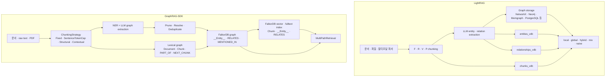

# LightRAG vs FalkorDB GraphRAG-SDK — 청킹 · 임베딩 · 지원 기능 비교

작성일: 2026-06-09  
분석 기준:

| 프로젝트 | 로컬 소스 | Commit | 라이선스 |
|---|---|---:|---|
| HKUDS/LightRAG | `_repos/lightrag` | `38c482a` | MIT |
| FalkorDB/GraphRAG-SDK | `_repos/graphrag-sdk` | `0ab92ba` | Apache-2.0 |

## 결론 요약

두 프로젝트는 모두 "문서 → 청크 → 엔티티/관계 추출 → 그래프+벡터 검색 → 답변"을 지향하지만 설계 중심이 다르다.

**LightRAG**는 더 넓은 RAG 플랫폼이다. 청킹 전략이 `F/R/V/P` 4종으로 세분화되어 있고, 멀티모달 파서, 다양한 vector/graph/KV storage, 역할별 LLM, reranker, API/WebUI까지 포함한다. 특히 2026년 5월 이후 `Vector`와 `Paragraph` chunking이 들어오면서 문서 구조와 의미 경계를 더 많이 고려한다. 대신 storage가 분산되어 있어 운영 구성은 더 복잡하다.

**GraphRAG-SDK**는 더 좁고 단단한 FalkorDB 중심 GraphRAG SDK다. 청킹 알고리즘 자체는 상대적으로 단순하지만, 모든 원문 청크를 FalkorDB 그래프 안에 `Document`, `Chunk`, `PART_OF`, `NEXT_CHUNK`, `MENTIONED_IN`으로 남기는 **zero-loss provenance**가 핵심이다. 임베딩도 `Chunk`, `__Entity__`, `RELATES`에 직접 저장하고 FalkorDB vector/fulltext index로 검색한다. "여러 backend를 지원하는 범용 RAG 플랫폼"보다 "FalkorDB 위에서 정확도 높은 GraphRAG 앱을 빠르게 만드는 SDK"에 가깝다.

짧게 고르면 다음과 같다.

| 요구 | 더 적합 |
|---|---|
| 여러 DB/vector backend 선택권 | LightRAG |
| 문서 구조 기반 청킹, 표/heading 보존 | LightRAG |
| FalkorDB를 전제로 단순한 production GraphRAG | GraphRAG-SDK |
| provenance를 그래프 안에 강제 저장 | GraphRAG-SDK |
| semantic/vector chunking 자체가 필요 | LightRAG |
| ontology/schema-guided extraction이 중요 | GraphRAG-SDK |
| 멀티모달 문서 파싱까지 포함 | LightRAG |
| RAG pipeline을 커스텀 strategy로 갈아끼우기 | 둘 다 가능, GraphRAG-SDK가 ABC 구조는 더 명시적 |

## 전체 아키텍처 차이

### 핵심 설계 관점

| 축 | LightRAG | GraphRAG-SDK |
|---|---|---|
| 기본 철학 | Graph+Vector RAG 플랫폼 | FalkorDB-native GraphRAG SDK |
| 그래프 저장 | pluggable graph storage | FalkorDB 고정 |
| 벡터 저장 | pluggable vector storage namespace 3개 | FalkorDB node/edge property vector index |
| 청킹 초점 | 전략 다양성, 문서 구조·의미 경계 | provenance 안정성, extraction-friendly chunk |
| 검색 초점 | `local/global/hybrid/mix/naive` 모드 | multi-path fusion |
| schema/ontology | LLM extraction prompt 중심, KG schema는 느슨함 | `Ontology`로 entity/relation type과 pruning 명시 |
| production surface | REST API, WebUI, Docker, storage 선택 | Python SDK, FalkorDB 연결, async strategy pipeline |

## 1. 청킹 방식 비교

### LightRAG 청킹

LightRAG는 2026년 5월 README 기준 `Fix`, `Recursive`, `Vector`, `Paragraph` 4개 청킹 전략을 제공한다. 실제 selector는 `process_options`의 `F/R/V/P` 문자로 선택된다.

| 전략 | 코드 | 방식 | 기본/주요 파라미터 | 특징 |
|---|---|---|---|---|
| Fixed Token (`F`) | `lightrag/chunker/token_size.py` | token window + token overlap | `CHUNK_F_SIZE`, 기본 1200 tokens / overlap 100 | 기본값. 빠르고 예측 가능. `_source_span`으로 원문 위치 추적 가능 |
| Recursive Character (`R`) | `recursive_character.py` | LangChain RecursiveCharacterTextSplitter 기반, tokenizer length function 사용 | `CHUNK_R_SIZE`, `CHUNK_R_SEPARATORS`, overlap | 문단, 줄바꿈, 문장부호, 공백 등 separator cascade. 구조 없는 plain text에 적합 |
| Semantic Vector (`V`) | `semantic_vector.py` | LangChain SemanticChunker 기반 sentence embedding distance breakpoint | `CHUNK_V_SIZE`, threshold type, buffer size | 문장 임베딩으로 의미 단절 지점 탐지. embedding 비용이 들며 초과 청크는 `R`로 재분할 |
| Paragraph Semantic (`P`) | `paragraph_semantic.py` | `.blocks.jsonl` sidecar 기반 heading/table/anchor/level merge | `CHUNK_P_SIZE`, 기본 2000 tokens / overlap 100 | 문서 구조 보존에 가장 강함. 표 row split, table header reinjection, heading hierarchy merge |

LightRAG의 청킹은 단순히 text split이 아니라 **문서 처리 pipeline 일부**다. `process_single_document`는 다음 순서로 동작한다.

1. 파일별 `process_options`를 해석해 `F/R/V/P` chunker 선택.
2. `chunk_options` snapshot을 문서에 저장해 나중에 어떤 chunking 설정이 쓰였는지 추적.
3. chunk 결과가 embedding token limit을 넘으면 `enforce_chunk_token_limit_before_embedding()`으로 hard fallback split.
4. chunk는 `text_chunks` KV와 `chunks_vdb`에 저장되고, 같은 chunk에서 KG extraction이 수행된다.

#### LightRAG Fixed Token

`chunking_by_token_size()`는 전체 text를 tokenizer로 encode한 뒤 `chunk_token_size - chunk_overlap_token_size` step으로 순회한다. `split_by_character`가 있으면 delimiter로 먼저 나누고, 긴 segment만 token window로 다시 자른다.

장점:

- LLM extraction 비용 예측이 쉽다.
- token 기준이라 model context 제약과 직접 맞는다.
- 원문 span을 계산해 citation/source 추적에 쓰기 쉽다.

단점:

- heading, paragraph, table 구조를 모른다.
- 의미 단절보다 token 경계를 우선한다.

#### LightRAG Recursive Character

`chunking_by_recursive_character()`는 LangChain splitter를 감싸되 LightRAG tokenizer를 `length_function`으로 넣는다. 따라서 character splitter이지만 크기 판단은 token 기준이다. 기본 separator는 CJK 문장 종결 기호까지 포함한다.

적합한 경우:

- Markdown, code, log, plain text.
- embedding 비용 없이 fixed token보다 자연스러운 경계가 필요할 때.
- `V/P`가 실패했을 때 fallback.

#### LightRAG Semantic Vector

`chunking_by_semantic_vector()`는 문장을 나누고 sentence embedding 간 distance가 threshold를 넘는 지점을 breakpoint로 본다. threshold 방식은 `percentile`, `standard_deviation`, `interquartile`, `gradient`를 지원한다.

중요한 제약:

- embedding function이 없으면 recursive character로 fallback한다.
- SemanticChunker는 max chunk size를 강제하지 않으므로, LightRAG가 초과 chunk를 다시 `R`로 쪼갠다.
- 모든 sentence embedding이 필요하므로 ingestion 비용이 증가한다.

#### LightRAG Paragraph Semantic

`P` 전략은 문서 구조가 있는 DOCX/PDF류에 특화되어 있다. native/mineru/docling parser가 만든 `.blocks.jsonl` sidecar를 읽고, heading-driven block을 기준으로 처리한다.

핵심 규칙:

- heading block을 기본 단위로 삼는다.
- 큰 table은 row boundary 중심으로 쪼갠다.
- table header를 split slice에 다시 넣어 단독 recall 가능성을 높인다.
- short paragraph를 anchor로 삼아 긴 section을 자연스럽게 자른다.
- 작은 section은 hierarchy-aware level merge로 합친다.
- sidecar가 없거나 읽을 수 없으면 recursive character로 fallback한다.

엔지니어 관점에서 `P`는 가장 복잡하지만, 표/heading/계약서/규정집 같은 문서에서는 단순 token window보다 훨씬 실용적이다.

### GraphRAG-SDK 청킹

GraphRAG-SDK는 `ChunkingStrategy` ABC를 중심으로 chunker를 교체한다. 기본 문서에서는 `FixedSizeChunking`을 설명하지만, benchmark recipe와 최신 코드에서는 `SentenceTokenCapChunking`을 주요 권장 전략으로 둔다.

| 전략 | 코드 | 방식 | 기본/주요 파라미터 | 특징 |
|---|---|---|---|---|
| FixedSizeChunking | `fixed_size.py` | character sliding window | 1000 chars / overlap 100 | 가장 단순. token cap이 아니라 character cap |
| SentenceTokenCapChunking | `sentence_token_cap.py` | sentence boundary + hard token cap | 512 tokens / overlap 2 sentences | benchmark 권장. 문장 중간 split 방지 |
| StructuralChunking | `structural_chunking.py` | loader의 `DocumentElement` 구조를 flatten/group | 512 tokens, fallback chunker | Markdown/PDF loader가 구조를 줄 때 heading breadcrumbs 보존 |
| ContextualChunking | `contextual_chunking.py` | base chunker 후 LLM-generated context prefix 추가 | max doc 16k tokens | Anthropic contextual retrieval 방식. chunk당 LLM call 비용 |
| CallableChunking | `callable_chunking.py` | user callable adapter | custom | LlamaIndex/LangChain/spaCy 등 외부 splitter 연결 |

GraphRAG-SDK의 chunking에서 더 중요한 것은 chunk 이후의 **lexical graph 강제 생성**이다. `IngestionPipeline.run()`은 chunk 이후 반드시 다음을 만든다.

- `Document` node
- `Chunk` node
- `Document -[:PART_OF]-> Chunk`
- `Chunk -[:NEXT_CHUNK]-> Chunk`

이후 entity extraction 결과는 `Entity -[:MENTIONED_IN]-> Chunk`로 연결된다. 즉 청크는 단순 embedding 대상이 아니라 graph provenance의 1급 노드다.

#### GraphRAG-SDK FixedSize

`FixedSizeChunking`은 char 기반 window다. token이 아니라 character 기준이므로 LLM token 예산과 정확히 맞지는 않는다. 대신 구현이 단순하고 빠르며, 각 chunk metadata에 `start_char`, `end_char`, `chunk_size`, `chunk_overlap`을 남긴다.

#### GraphRAG-SDK SentenceTokenCap

`SentenceTokenCapChunking`은 `tiktoken`으로 sentence별 token 수를 계산하고, cap을 넘지 않는 선에서 greedy merge한다. 다음 window는 `overlap_sentences`만큼 rollback한다.

장점:

- 문장 중간을 자르지 않는다.
- token cap이 명확하다.
- LLM/entity extraction에 적합한 보수적 기본값이다.

제약:

- sentence regex가 `(?<=[.!?])\s+`라 영어 문장부호 중심이다.
- 단일 sentence가 cap을 넘으면 그대로 emit한다.
- 문서 구조나 embedding 기반 semantic breakpoint는 기본 제공하지 않는다.

#### GraphRAG-SDK Structural/Contextual

`StructuralChunking`은 `DocumentOutput.elements`가 있을 때 구조를 활용한다. element breadcrumbs를 chunk에 prefix로 넣고, oversized element는 fallback chunker로 넘긴다.

`ContextualChunking`은 base chunker로 만든 chunk마다 LLM에게 "이 chunk가 전체 문서에서 어떤 맥락인지"를 1~2문장으로 쓰게 하고 이를 chunk 앞에 붙인다. 검색 품질은 좋아질 수 있지만 chunk 수만큼 LLM call이 추가된다.

### 청킹 비교표

| 비교 항목 | LightRAG | GraphRAG-SDK |
|---|---|---|
| 기본 chunk 단위 | token window | character window 또는 sentence-token cap |
| token cap 강제 | `F/R/P`는 강함, `V`는 후처리로 강제 | `SentenceTokenCap`은 강함, `FixedSize`는 아님 |
| semantic chunking | 내장 (`V`) | 내장 없음. `CallableChunking`으로 외부 연결 |
| structure-aware chunking | 매우 강함 (`P`, sidecar 기반) | 있음 (`StructuralChunking`)이나 단순한 element grouping |
| table 처리 | `P`에서 row split/header reinjection/bridge context | 별도 table-aware split은 아직 약함 |
| chunk context enrichment | heading path, sidecar refs, content headings | `ContextualChunking`의 LLM prefix |
| source span/provenance | `_source_span`, chunk metadata, KV | graph-native `Document/Chunk/PART_OF/NEXT_CHUNK/MENTIONED_IN` |
| fallback | V/P 실패 시 R, embedding 전 hard split | oversized structural element를 fallback chunker로 |
| 커스텀 chunker | legacy `chunking_func`, addon params | `ChunkingStrategy` subclass 또는 `CallableChunking` |

## 2. 임베딩 방식 비교

### LightRAG 임베딩 구조

LightRAG는 `EmbeddingFunc` wrapper를 중심으로 임베딩을 추상화한다. 이 wrapper는 다음을 담당한다.

- `embedding_dim` 검증.
- `model_name + embedding_dim` 기반 vector collection suffix 생성.
- `max_token_size` 전달.
- query/document asymmetric embedding을 위한 `context="query" | "document"` 전달.
- nested wrapper 자동 unwrap.
- batch 결과의 vector count/dimension mismatch 감지.

LightRAG는 세 종류의 vector namespace를 만든다.

| Namespace | 저장 내용 | content 구성 |
|---|---|---|
| `chunks_vdb` | 원문 chunk | chunk content |
| `entities_vdb` | entity 검색용 vector | `entity_name + "\n" + description` |
| `relationships_vdb` | relation 검색용 vector | `keywords`, `src_id`, `tgt_id`, `description` 조합 |

지원 provider도 폭넓다. 코드상 OpenAI/Azure OpenAI, Ollama, HuggingFace, Jina, Gemini, VoyageAI, Bedrock, NVIDIA OpenAI-compatible, Zhipu, LlamaIndex adapter 등이 있고, storage는 NanoVectorDB, FAISS, Milvus, Qdrant, OpenSearch, PostgreSQL, MongoDB 등으로 확장된다.

LightRAG의 중요한 운영 제약은 README가 명시하듯 **embedding model은 indexing 전에 결정해야 하며 query phase에서도 같은 모델을 써야 한다**는 점이다. 모델이나 dimension을 바꾸면 chunk/entity/relation vector를 다시 만들어야 한다. 일부 backend는 dimension이 table/collection 생성 시 고정된다.

### LightRAG asymmetric embedding

LightRAG는 기본적으로 symmetric embedding을 유지하지만, 명시적으로 설정하면 query/document asymmetric embedding을 지원한다.

예:

- query embedding: `context="query"`
- document/chunk/entity/relation embedding: `context="document"`
- provider별 task parameter 또는 prefix를 적용할 수 있음.

이 기능은 Jina v3/v4, Gemini embedding, 일부 Ollama/OpenAI-compatible prefix 기반 모델처럼 query/document task가 다른 embedding model에 유리하다.

### GraphRAG-SDK 임베딩 구조

GraphRAG-SDK는 `Embedder` ABC를 사용한다.

필수 메서드:

- `model_name`
- `embed_query(text)`
- `embed_documents(texts)`
- async wrapper: `aembed_query`, `aembed_documents`

기본 구현:

| Provider | 클래스 | 특징 |
|---|---|---|
| LiteLLM | `LiteLLMEmbedder` | OpenAI, Azure OpenAI, Cohere 등 LiteLLM이 지원하는 provider |
| OpenRouter | `OpenRouterEmbedder` | OpenRouter API |
| Custom | `Embedder` subclass | 로컬 sentence-transformers 등 직접 구현 |

GraphRAG-SDK는 embedding dimension을 `GraphRAG(..., embedding_dimension=...)`와 `VectorStore`에 명시한다. 기본 README 예시는 `text-embedding-3-large`를 `dimensions=256`으로 줄여 사용한다. 이 dimension은 FalkorDB vector index 생성 시 필요하다.

### GraphRAG-SDK embedding 대상

GraphRAG-SDK도 세 종류를 embed한다. 다만 저장 위치가 LightRAG와 다르다.

| 대상 | 저장 위치 | 생성 시점 | 검색 방식 |
|---|---|---|---|
| Chunk | `(:Chunk {embedding: vecf32(...)})` | ingestion step 9 | `db.idx.vector.queryNodes('Chunk', 'embedding', ...)` |
| Entity | `(:__Entity__ {embedding: vecf32(...)})` | `finalize()`의 backfill | `db.idx.vector.queryNodes('__Entity__', 'embedding', ...)` |
| Relationship | `()-[:RELATES {embedding: vecf32(...)}]->()` | `finalize()`의 `embed_relationships()` | `db.idx.vector.queryRelationships('RELATES', 'embedding', ...)` |

`VectorStore.ensure_indices()`는 다음 index를 만든다.

- Chunk vector index
- `__Entity__` vector index
- `RELATES` edge vector index
- Chunk fulltext index
- Entity fulltext index

`VectorStore.index_chunks()`는 chunk text를 `aembed_documents()`로 batch embed하고, 실패하면 chunk별 sequential embedding으로 fallback한다. entity/relationship embedding도 batch 중심으로 처리한다.

### 임베딩 비교표

| 비교 항목 | LightRAG | GraphRAG-SDK |
|---|---|---|
| abstraction | `EmbeddingFunc` dataclass wrapper | `Embedder` ABC |
| embedding 대상 | chunks/entities/relationships | Chunk/__Entity__/RELATES |
| 저장 위치 | 별도 vector storage namespace | FalkorDB graph node/edge property |
| vector backend | NanoVectorDB, FAISS, Milvus, Qdrant, OpenSearch, PostgreSQL, MongoDB 등 | FalkorDB vector index |
| dimension 검증 | wrapper가 result dimension/count 검증 | `embedding_dimension` 범위 검증, provider 출력은 index dimension과 맞아야 함 |
| batch embedding | storage별 upsert에서 사용, 일부 deferred embedding | `aembed_documents()` 중심, batch 실패 시 fallback |
| asymmetric embedding | 명시 지원 | 별도 query/document task 추상은 없음. custom embedder로 구현 가능 |
| model 변경 | 재임베딩 필요, tool 부재 명시 | graph config/model validation 존재, 재임베딩은 finalize/backfill 단위 |
| rerank | 외부 reranker API 지원 + vector score | cosine rerank, 저장된 chunk embedding 재사용 |

## 3. 검색·검색 모드 비교

### LightRAG query mode

LightRAG는 `QueryParam.mode`로 검색 방식을 고른다.

| 모드 | 방식 | 주요 입력 |
|---|---|---|
| `naive` | chunk vector search만 사용 | `chunks_vdb` |
| `local` | low-level keyword → entity vector search → graph expansion | `entities_vdb`, KG |
| `global` | high-level keyword → relationship vector search → related entities | `relationships_vdb`, KG |
| `hybrid` | local + global 병합 | entity/relation vector + KG |
| `mix` | hybrid + naive chunk vector + rerank | 모든 vector namespace |

LightRAG는 keyword extraction에서 low-level/high-level keywords를 나누고, mode에 따라 entity/relation vector search를 선택한다. `mix`는 chunk vector도 함께 가져와 RAG 품질을 높인다.

### GraphRAG-SDK MultiPathRetrieval

GraphRAG-SDK 기본 검색은 `MultiPathRetrieval`이다.

1. keyword extraction: stopword filter + LLM proper nouns.
2. question embedding 1회.
3. `RELATES` edge vector search로 fact와 entity entry point 확보.
4. entity discovery: Cypher `CONTAINS` + entity fulltext + 관계 vector 결과 병합.
5. 1-hop/2-hop relationship expansion.
6. chunk retrieval 4경로: fulltext, vector, `MENTIONED_IN`, 2-hop entity-neighbor-chunk.
7. document mapping.
8. stored chunk embedding 기반 cosine rerank.
9. context assembly.

GraphRAG-SDK는 mode를 사용자가 고르는 방식보다 **여러 retrieval path를 기본적으로 합치는 방식**이다. 선택적으로 text-to-Cypher path를 켤 수 있다.

### 검색 비교표

| 항목 | LightRAG | GraphRAG-SDK |
|---|---|---|
| 검색 라우팅 | 사용자가 mode 선택 | MultiPath 기본 통합 |
| keyword 분해 | high-level / low-level LLM keywords | simple keyword + LLM keywords |
| graph traversal | entity/relation 결과에서 source chunk와 edge 확장 | entity discovery 후 1-hop/2-hop + MENTIONED_IN |
| relation vector | `relationships_vdb` | `RELATES.embedding` edge vector index |
| chunk vector | `chunks_vdb` | `Chunk.embedding` |
| fulltext | backend별 지원, core mode에는 덜 중심 | Chunk/Entity fulltext index가 기본 path |
| text-to-Cypher | 핵심 기능은 아님 | experimental option |
| rerank | Jina/Cohere/BGE/Aliyun/custom 등 | cosine rerank, 저장 embedding 재사용 |

## 4. 지원 기능 비교

| 기능 | LightRAG | GraphRAG-SDK |
|---|---|---|
| 라이선스 | MIT | Apache-2.0 |
| Python package | `lightrag-hku` | `graphrag-sdk` |
| API server | 있음 | Python SDK 중심 |
| Web UI | 있음 | 없음 |
| Docker | 있음 | FalkorDB docker 필요 |
| Graph backend | NetworkX, Neo4j, Memgraph, PostgreSQL, MongoDB, OpenSearch 등 | FalkorDB |
| Vector backend | NanoVectorDB, FAISS, Milvus, Qdrant, OpenSearch, PostgreSQL, MongoDB 등 | FalkorDB vector index |
| KV/cache backend | JSON, Redis, PostgreSQL, MongoDB, OpenSearch 등 | FalkorDB graph 중심 |
| Document status | 별도 doc status storage | Document node 상태/metadata |
| Incremental insert | 있음 | 있음 |
| Document update/delete | 있음. 삭제 시 KG regeneration 관련 로직 | 있음. `update`, `delete_document`, `apply_changes` |
| Crash safety | pipeline status/locking 중심 | pending Document cutover, content hash no-op |
| Ontology/schema | prompt/profile 중심, graph schema 느슨함 | `Ontology`, `Entity`, `Relation`, pruning, ontology discovery/evolution |
| Entity resolution | 같은 entity merge + summary | Exact, semantic, LLM-verified, description merge |
| Multimodal | MinerU/Docling/native, RAG-Anything merge | PDF loader 중심, roadmap상 structured/table 확장 |
| Citation/provenance | chunk source, file path, source id, heading path | graph-native provenance edges |
| Observability | RAGAS, Langfuse, API status | telemetry/tracer, latency budget |
| Role-specific LLM | EXTRACT/QUERY/KEYWORDS/VLM | LLM provider + strategy별 사용 |
| Local embedding/rerank infra | setup wizard, vLLM docker | custom provider 가능, 기본은 LiteLLM/OpenRouter |
| Benchmark positioning | LightRAG 논문/일반 GraphRAG 대안 | GraphRAG-Bench 상위 성능 주장 |

### GraphRAG-SDK와 FalkorDBLite 호환성

GraphRAG-SDK는 **기본적으로 FalkorDB 서버 연결을 전제**한다. 현재 코드의 `ConnectionConfig`는 `host`, `port`, `username`, `password`, `graph_name` 중심이고, `FalkorDBConnection`은 `falkordb.asyncio.FalkorDB`와 `redis.asyncio.BlockingConnectionPool`로 `host:port`에 접속한다. 공식 quickstart도 `docker run -p 6379:6379 ... falkordb/falkordb:latest`를 안내한다.

따라서 **FalkorDBLite 객체를 GraphRAG-SDK에 그대로 넘기는 방식은 공식 지원 경로가 아니다.** FalkorDBLite는 기본적으로 Python 패키지가 Redis+FalkorDB child process를 띄우고 Unix domain socket으로 통신하는 wrapper다. SDK의 `ConnectionConfig`에는 Unix socket path 필드가 없고, `GraphRAG` 생성자도 `ConnectionConfig` 또는 `FalkorDBConnection`만 받는다.

다만 엔진과 프로토콜은 FalkorDB 계열이므로 다음 두 방식은 가능성이 있다.

| 방식 | 가능성 | 평가 |
|---|---:|---|
| FalkorDBLite를 기본 Unix socket 모드로 띄우고 SDK에 그대로 연결 | 낮음 | SDK 연결 클래스가 socket path를 받지 않음 |
| FalkorDBLite/redislite를 TCP port로 노출하고 `ConnectionConfig(host, port)`로 연결 | 중간 | Lite가 Redis server config로 port를 열 수 있으므로 실험 가능. 공식 GraphRAG-SDK 지원 조합은 아님 |
| `FalkorDBConnection` 호환 adapter를 만들어 Lite의 async graph client를 감싸기 | 중간 | SDK storage layer가 주로 `query`, `ping`, `delete_graph`, `close` 형태를 쓰므로 가능하지만 유지보수 부담 있음 |
| 운영/프로덕션에서 Docker/Cloud FalkorDB 사용 | 높음 | SDK 문서와 예제가 의도하는 기본 경로 |

엔지니어링 판단: **개발 노트북·로컬 PoC에서 Lite를 쓰고 싶다면 TCP 노출 또는 adapter 실험은 가능**하지만, 금융 서비스처럼 문서 ingestion, vector/fulltext index, incremental update를 장시간 돌릴 환경이면 서버형 FalkorDB를 쓰는 편이 낫다. Lite는 GraphRAG-SDK의 공식 운영 대상이라기보다 "FalkorDB API와 Cypher를 로컬에서 빠르게 시험하는 임베드형 wrapper"로 보는 것이 맞다.

### LightRAG와 Weaviate 커스텀 vector storage

LightRAG는 현재 Weaviate vector backend를 기본 제공하지 않는다. `VECTOR_STORAGE` registry에는 `NanoVectorDBStorage`, `MilvusVectorDBStorage`, `PGVectorStorage`, `FaissVectorDBStorage`, `QdrantVectorDBStorage`, `MongoVectorDBStorage`, `OpenSearchVectorDBStorage`가 등록되어 있고 Weaviate 항목은 없다.

하지만 **자체 개발해서 붙일 수 있는 인터페이스는 있다.** `BaseVectorStorage`가 vector backend contract 역할을 하며, LightRAG는 같은 vector storage class를 `entities_vdb`, `relationships_vdb`, `chunks_vdb` 세 namespace로 생성한다. Weaviate 구현체는 최소한 다음 async 메서드를 맞춰야 한다.

| 메서드 | 역할 | Weaviate 구현 시 고려점 |
|---|---|---|
| `initialize()` | collection/class 생성, index schema 준비 | namespace별 collection 또는 단일 collection + tenant/workspace 필터 선택 |
| `upsert(data)` | `content`를 embedding 후 vector+metadata 저장 | LightRAG의 `embedding_func` 사용. Weaviate 내장 vectorizer와 중복 생성하지 않도록 주의 |
| `query(query, top_k, query_embedding=None)` | top-k vector search | `query_embedding`이 있으면 재임베딩 생략 |
| `delete(ids)` | id 기반 삭제 | chunk/entity/relation 삭제 경로에서 사용 |
| `delete_entity(entity_name)` | entity vector 삭제 | `entity_name` metadata filter 필요 |
| `delete_entity_relation(entity_name)` | entity가 포함된 relation vector 삭제 | `src_id`/`tgt_id` metadata filter 필요 |
| `get_by_id(id)` / `get_by_ids(ids)` | metadata 조회 | LightRAG의 graph utility와 export 경로에서 사용 |
| `get_vectors_by_ids(ids)` | 저장 vector 회수 | rerank·chunk selection 일부 경로에서 사용 |
| `index_done_callback()` | buffered write commit | 즉시 write면 no-op 가능, batch buffer를 두면 flush 구현 |
| `drop()` | namespace/workspace 데이터 삭제 | 운영 환경에서는 workspace 범위 삭제가 안전 |

제약은 **공식 plugin entrypoint가 따로 없다는 점**이다. backend 선택은 `lightrag/kg/__init__.py`의 `STORAGE_IMPLEMENTATIONS`와 `STORAGES` dict, 그리고 `kg/factory.py::get_storage_class()`의 동적 import로 결정된다. 따라서 제품 코드에서 안정적으로 쓰려면 LightRAG fork에 `weaviate_impl.py`를 추가하고 registry에 `WeaviateVectorDBStorage`를 등록하는 방식이 가장 단순하다. 패키지 외부에서 monkey patch로 registry를 주입하는 것도 가능하지만, API 서버/멀티프로세스 배포에서는 초기화 순서가 깨지기 쉬워 권장하기 어렵다.

실무 구현 모델은 Qdrant나 Milvus backend를 템플릿으로 삼는 것이 좋다. 특히 Qdrant 구현은 workspace 필터, namespace별 collection, deferred embedding/upsert, delete filter가 Weaviate 설계와 가장 가깝다.

## 5. 장단점

### LightRAG 장점

- 청킹 전략이 풍부하다. 특히 `P`는 표/heading/문서 구조 보존이 강하다.
- storage backend 선택권이 넓다.
- vector, graph, KV, doc status를 분리해 다양한 운영 환경에 맞출 수 있다.
- API server와 WebUI가 있어 제품화 PoC가 빠르다.
- role-specific LLM, reranker, multimodal parser, deletion/rebuild 등 기능 폭이 넓다.
- asymmetric embedding처럼 모델별 embedding 특성을 세밀하게 다룬다.

### LightRAG 약점

- 기능 폭이 넓은 만큼 구성 복잡도가 높다.
- vector storage namespace와 graph storage가 분리되어 일관성/운영 경계가 많다.
- semantic vector chunking은 sentence embedding 비용이 크다.
- `P` chunking은 sidecar 의존성이 있어 parser pipeline까지 맞아야 한다.
- embedding model 변경 시 재임베딩 부담이 크고, 공식적으로 쉬운 re-embedding tool은 부족하다.

### GraphRAG-SDK 장점

- FalkorDB 하나에 graph, vector, fulltext, provenance를 통합한다.
- ingestion pipeline이 9단계로 명확하고 strategy ABC가 깔끔하다.
- `Document -> Chunk -> Entity` provenance chain을 강제해 source trace가 좋다.
- `RELATES` edge vector search와 `MENTIONED_IN` traversal이 검색 pipeline에 잘 녹아 있다.
- `finalize()`가 dedup, entity/relationship embedding, index 생성을 분리해 batch ingestion에 유리하다.
- update/delete/apply_changes 설계가 문서 동기화 워크플로우에 맞다.

### GraphRAG-SDK 약점

- FalkorDB에 강하게 묶인다.
- 청킹 알고리즘 다양성은 LightRAG보다 좁다.
- semantic vector chunking은 내장되어 있지 않다.
- table-aware/sidecar-aware chunking은 LightRAG `P`만큼 강하지 않다.
- WebUI/API server보다는 SDK 중심이라 완성형 앱 서버는 직접 붙여야 한다.
- FalkorDB 라이선스와 운영 조건은 별도 검토가 필요하다. SDK 자체는 Apache-2.0이지만 DB 서버까지 permissive OSS라는 뜻은 아니다.

## 6. 구현 선택 가이드

### LightRAG를 우선 볼 때

- PDF/DOCX/표/수식/이미지까지 포함된 문서를 처리한다.
- chunk boundary 품질이 retrieval 품질에 큰 영향을 준다.
- vector DB, graph DB, KV backend를 조직 표준에 맞게 고르고 싶다.
- WebUI/API server까지 포함한 RAG platform을 원한다.
- query/document asymmetric embedding이나 외부 reranker를 적극 쓰고 싶다.

### GraphRAG-SDK를 우선 볼 때

- FalkorDB를 그래프 DB로 채택할 계획이 있다.
- source trace와 graph provenance가 가장 중요하다.
- schema/ontology-constrained extraction이 필요하다.
- CI나 문서 저장소 변경분을 `apply_changes()`로 계속 반영하고 싶다.
- 복잡한 backend 조합보다 단일 graph DB 위에서 retrieval path를 잘 짜는 것이 중요하다.

## 7. 엔지니어 관점 최종 평가

LightRAG는 **GraphRAG platform**이다. 청킹·임베딩·스토리지·API·멀티모달·reranking을 넓게 제공하고, 특히 chunking 품질에 많은 설계를 투자했다. 문서 구조가 복잡하거나 backend 선택권이 중요한 팀에는 LightRAG가 더 유리하다.

GraphRAG-SDK는 **FalkorDB-native GraphRAG runtime**이다. 청킹은 비교적 실용적인 수준에 머물지만, chunk를 그래프의 1급 노드로 만들고, entity/fact/chunk vector를 FalkorDB index로 통합하는 방식이 명확하다. graph provenance와 multi-path retrieval을 안정적으로 제품 코드에 넣고 싶다면 GraphRAG-SDK가 더 단단하다.

둘의 가장 큰 차이는 "어디에 복잡성을 둘 것인가"다.

- LightRAG: chunking/parser/storage 선택권 쪽에 복잡성을 둔다.
- GraphRAG-SDK: FalkorDB graph schema와 retrieval path fusion 쪽에 복잡성을 둔다.

## 참고 소스

- HKUDS/LightRAG GitHub: https://github.com/HKUDS/LightRAG
- FalkorDB/GraphRAG-SDK GitHub: https://github.com/FalkorDB/GraphRAG-SDK
- LightRAG local source: `_repos/lightrag`, commit `38c482a`
- GraphRAG-SDK local source: `_repos/graphrag-sdk`, commit `0ab92ba`
- LightRAG key files: `lightrag/chunker/*.py`, `lightrag/pipeline.py`, `lightrag/utils.py`, `lightrag/kg/*_impl.py`
- GraphRAG-SDK key files: `ingestion/chunking_strategies/*.py`, `ingestion/pipeline.py`, `storage/vector_store.py`, `retrieval/strategies/*.py`
