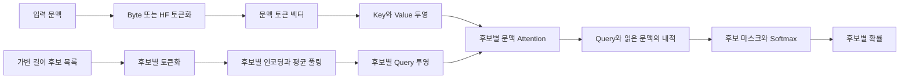
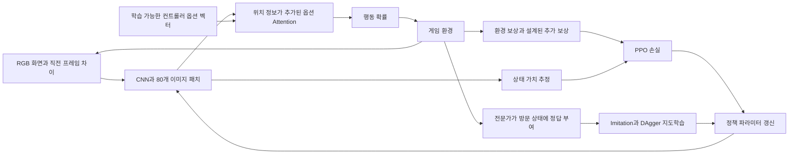

# Jevlike 소스코드 분석 — 자체 학습과 파인튜닝 가능성

분석일: 2026-09-18 · 버전: 0.1.0 · 분석 커밋: [`94f5fd1b0b11d52bbdfdf4e0ee6aa96b568f8452`](https://github.com/vinnylarouge/jevlike/commit/94f5fd1b0b11d52bbdfdf4e0ee6aa96b568f8452)

저장소를 `.repos/jevlike/`에 클론해 코드를 읽고, 격리된 가상환경에서 CPU 학습과 추론을 실행했다. 해당 클론은 루트 `.gitignore`의 `/.repos/` 규칙으로 제외된다. **코드에서 확인한 지원 범위**, **직접 실행한 결과**, **확장을 위한 제안**을 구분한다. 실제 명령과 파인튜닝 변경 지점은 [학습·파인튜닝 가이드](training-and-finetuning.md)에 정리했다.

## 1. 결론

**자체 데이터로 작은 선택 모델을 학습하는 데 사용할 수 있다. 다만 범용 LLM 학습 프레임워크나 사용하면서 자동으로 지식을 습득하는 시스템은 아니다.** 입력 문맥과 후보 목록에서 정답 하나를 고르는 문제에 맞춰져 있다.

| 사용자가 원하는 학습 | 현재 지원 | 정확한 의미 |
|---|---|---|
| 정답이 있는 자체 데이터로 처음부터 학습 | 지원 | `TinyScorer`의 byte embedding, position embedding, attention head 전체 학습 |
| 사전학습 언어모델을 활용한 도메인 적응 | 지원 | Hugging Face 인코더는 동결하고 새 scorer head만 학습 |
| 기존 텍스트 체크포인트를 이어 학습 | Python 코드로 가능 | `load_checkpoint()`로 로드 후 optimizer 구성. 기본 학습 CLI에는 초기화·재개 옵션 없음 |
| Qwen 등 기반 모델 전체 파인튜닝 | 기본 미지원 | gradient 차단 해제, 학습·저장 방식 변경 필요 |
| LoRA·QLoRA | 기본 미지원 | PEFT 연동, gradient 경로, adapter 저장·로드 등을 구현해야 함 |
| 문서를 넣고 무라벨로 스스로 지식 학습 | 미지원 | 텍스트 학습에는 매 행 `label`이 필수 |
| 실행 로그에서 지속적으로 자동 개선 | 기본 미지원 | 로그 수집, 정답·보상 획득, 재학습 루프를 별도로 만들어야 함 |
| 환경과 상호작용하는 강화학습 | 게임 예제에서 지원 | Doom PPO, imitation, DAgger 코드 제공. 범용 텍스트 RL API는 없음 |
| TypeSafe Jev 원본 모델 파인튜닝 | 이 저장소로는 불가 | 원본 Jev 가중치나 비공개 학습 방법을 제공하는 프로젝트가 아님 |

근거: [텍스트 학습 전체 흐름](https://github.com/vinnylarouge/jevlike/blob/94f5fd1b0b11d52bbdfdf4e0ee6aa96b568f8452/jevlike/train.py#L33-L91), [HF 인코더 동결](https://github.com/vinnylarouge/jevlike/blob/94f5fd1b0b11d52bbdfdf4e0ee6aa96b568f8452/jevlike/model.py#L66-L94), [Doom PPO](https://github.com/vinnylarouge/jevlike/blob/94f5fd1b0b11d52bbdfdf4e0ee6aa96b568f8452/examples/doom/train_ppo.py#L261-L299).

## 2. 프로젝트 개요와 해결하려는 문제

일반적인 텍스트 생성 모델로 분류·라우팅을 하면, 후보 하나를 고르는 문제에도 출력 토큰 생성과 결과 해석이 필요하다. Jevlike는 이 작업을 다음 함수로 표현한다.

```text
f(context, [option_0, ..., option_N-1]) -> [p_0, ..., p_N-1]
```

예를 들어 고객 문의와 `[환불 처리, 기술 지원, 영업 문의]`를 주면 각 후보에 대한 확률을 계산한다. 학습 데이터는 그중 정답 후보의 인덱스를 제공한다. 후보 수와 후보 문자열이 요청마다 달라도 같은 모델을 사용한다.

TypeSafe는 Jev를 구조화된 판단용 상용 모델로 소개하고 자체 학습 방법을 RLCD라고 부른다. Jevlike는 비슷한 입력·출력 형태를 실험하는 **독립적인 연구용 구현**이다. Jev의 지능, 확률 보정 성능, 아키텍처를 재현했다고 볼 근거는 없다. [TypeSafe 공식 발표](https://typesafe.ai/blog/introducing-system-one-models-and-jev), [Jevlike 프로젝트 설명](https://github.com/vinnylarouge/jevlike#jevlike).

적합한 문제는 도구 선택, 요청 라우팅, 다음 링크 선택, 제한된 행동 선택이다. 자유로운 문장 생성, 코드 작성, 장문 답변, 문서 자체의 지식 저장은 별도 시스템이 필요하다. 여러 정답을 동시에 고르는 multi-label API도 제공하지 않는다.

## 3. 핵심 특징과 아키텍처

### 3.1 텍스트 모델



`AttentionHead`는 후보 벡터를 query로, 문맥의 각 토큰 벡터를 key와 value로 사용한다. 후보마다 관련 문맥을 한 번 읽고 점수를 계산한다.

```text
C: 문맥 벡터 [B, L, d]
O: 후보 벡터 [B, N, d]
Q = Wq LayerNorm(O)               [B, N, r]
K = Wk LayerNorm(C)               [B, L, r]
V = Wv LayerNorm(C)               [B, L, r]
A = softmax(Q Kᵀ / sqrt(r))       [B, N, L]   # 문맥 축
H = A V                          [B, N, r]
z_i = dot(Q_i, H_i) / sqrt(r)     [B, N]
p = softmax(z)                   [B, N]      # 후보 축
```

`B`는 배치 크기, `L`은 문맥 길이, `N`은 후보 수, `d`는 인코더 차원, `r`은 scorer 폭이다. padding 후보는 매우 작은 logit으로 마스킹한다. 손실은 정답 인덱스에 대한 cross entropy다. [AttentionHead 코드](https://github.com/vinnylarouge/jevlike/blob/94f5fd1b0b11d52bbdfdf4e0ee6aa96b568f8452/jevlike/model.py#L12-L43).

**설계에서 나오는 특성:**

- 후보별 고정 출력 뉴런이 없다. 새로운 후보 문자열도 입력할 수 있다. 다만 처음 보는 후보의 의미를 잘 이해한다는 보장은 없다.
- 후보 순서를 바꾸면 그에 맞춰 출력 순서도 바뀌는 구조다. Tiny 경로에서 후보 내부의 글자 순서를 잃는 문제와는 별개다.
- 후보들 사이의 직접 attention은 없다. 각 logit은 문맥과 해당 후보로 결정되고, 마지막 softmax에서 경쟁한다.
- 후보 목록이 달라지면 같은 후보의 확률도 달라진다. 반환 확률은 후보 집합 안에서의 상대 확률이다.
- 후보 외의 문자열을 생성하지 않는 구조여도 잘못된 후보를 고를 수 있다. softmax 자체가 정확도나 확률 보정을 보장하지 않는다.

### 3.2 두 인코더 경로의 차이

| 항목 | `tiny` | `hf` |
|---|---|---|
| 입력 단위 | UTF-8 byte + 1, 0은 padding | 선택한 HF tokenizer의 token |
| 문맥 인코딩 | byte embedding + 학습 가능한 위치 embedding | 사전학습 모델의 `last_hidden_state` |
| 후보 표현 | byte embedding의 평균 | 후보별 hidden state의 masked mean |
| 기반 언어지식 | 없음 | 사전학습 인코더의 기존 표현 |
| 갱신되는 파라미터 | 모델 전체 | scorer head만 |
| 체크포인트 | 학습된 전체 tiny 파라미터 | scorer 파라미터와 인코더 이름 |
| 주요 장점 | 아주 작고 CPU에서 학습 가능 | 사전학습 언어 표현 활용 |
| 주요 한계 | 약한 언어 표현, 후보 순서 정보 손실 | 인코더 비용은 남고 도메인별 표현 개선은 안 됨 |

기본 `width=64`, `rank=64`, 문맥 길이 192에서 Tiny 모델은 **41,280개 파라미터**다. 일반식은 `(257 + L) × d + 3dr + 4d`다. 마지막 항은 두 LayerNorm의 scale과 bias다. [두 scorer 구현](https://github.com/vinnylarouge/jevlike/blob/94f5fd1b0b11d52bbdfdf4e0ee6aa96b568f8452/jevlike/model.py#L46-L94).

여기서 “one-pass”는 출력 토큰을 순차 생성하지 않는다는 의미다. HF 경로는 코드상 **문맥 인코딩 1회 + 펼친 후보 배치 인코딩 1회**를 호출한 뒤 head를 실행한다. 전체 연산이 단일 Transformer 호출이라는 뜻은 아니다. 후보 embedding 캐시도 기본 구현에는 없다.

### 3.3 시각 모델과 학습 루프



`DoomScorerV2`는 160×120 RGB + motion 입력을 convolution으로 8×10 패치로 바꾼다. 옵션은 텍스트 인코딩이 아니라 학습 가능한 embedding table이다. 공유 게임 모델은 Doom 7개, 체스 5개 컨트롤러 옵션을 사용한다. 따라서 임의의 새 텍스트 행동을 이해하는 시각 언어 모델로 볼 수 없다. [시각 모델 코드](https://github.com/vinnylarouge/jevlike/blob/94f5fd1b0b11d52bbdfdf4e0ee6aa96b568f8452/jevlike/vision.py#L15-L127).

- **Imitation:** 전문가 행동을 정답으로 학습한다.
- **DAgger:** 현재 정책이 방문한 상태에도 전문가가 정답을 붙여 학습한다. 모델의 예측을 그대로 정답으로 삼는 무감독 자기학습이 아니다.
- **PPO:** 환경 보상과 사람이 설계한 추가 보상을 이용해 정책과 value head를 갱신한다. 본문 텍스트 scorer의 학습 방식과 구분해야 한다.
- **체스:** Stockfish가 고른 수를 커서 이동과 선택 버튼 시퀀스로 변환해 지도학습한다.

PPO는 discount 0.99의 return, 정규화된 advantage, 0.8~1.2 ratio clipping, value loss와 entropy 보너스를 사용한다. 완성된 일반 RL 플랫폼보다는 해당 게임을 위한 작은 연구 스크립트에 가깝다. [PPO 업데이트](https://github.com/vinnylarouge/jevlike/blob/94f5fd1b0b11d52bbdfdf4e0ee6aa96b568f8452/examples/doom/train_ppo.py#L261-L299), [DAgger 정답 수집](https://github.com/vinnylarouge/jevlike/blob/94f5fd1b0b11d52bbdfdf4e0ee6aa96b568f8452/examples/doom/train_dagger.py#L105-L153).

## 4. 기술 스택과 핵심 코드

Python ≥3.10, PyTorch ≥2.2, NumPy ≥1.26, setuptools 기반 패키지다. HF 경로에는 Transformers ≥4.45가 추가된다. 게임 예제는 ViZDoom, python-chess, Pillow, imageio 등을 사용하고 체스 데이터 생성에는 Stockfish가 필요하다. [패키지 정의](https://github.com/vinnylarouge/jevlike/blob/94f5fd1b0b11d52bbdfdf4e0ee6aa96b568f8452/pyproject.toml).

| 모듈 | 역할과 설계 |
|---|---|
| `jevlike/data.py` | JSONL 전체를 메모리로 로드. 최소 2개 후보·정수 정답 검증, byte/HF collator, 배치 padding, synthetic·Wikispeedia 생성 |
| `jevlike/model.py` | AttentionHead, TinyScorer, FrozenTransformerScorer, 디바이스 선택, 생성·저장용 state·로드 |
| `jevlike/train.py` | AdamW, cross entropy, gradient clipping 1.0, 검증 손실 기준 state 선택 |
| `jevlike/eval.py` | top-1·top-3·ECE 및 배치 내 문맥을 이동시킨 대조 결과 |
| `jevlike/predict.py` | 단일 문맥과 반복 `--option` 인자를 받아 후보 확률 JSON 출력 |
| `jevlike/vision.py` | 공유 시각 모델, value head, attention trace, 기본 CNN 비교 정책 |
| `examples/doom/` | imitation·DAgger·PPO·두 게임 공동 학습 |
| `examples/chess/` | Stockfish 데이터 생성, 키 시퀀스 학습, DAgger 상태 수집 |

핵심 공개 접점은 CLI 4개다. Python에서는 `jevlike.model.load_checkpoint`, `jevlike.data.ChoiceExample` 등을 직접 import할 수 있다. HTTP 서버, 에이전트 프레임워크 연동, 도구 실행, 모델 관리 서버는 제공하지 않는다. `__init__.py`의 명시적 export는 오히려 시각 모델 중심이며, 성숙한 SDK 계층은 얇다.

플러그인 registry는 없지만 PyTorch 모듈이라 인코더·head·loss 교체는 가능하다. 인코더를 바꾸려면 `make_system()`, collator, checkpoint config를 함께 맞춰야 한다. 외부에서 파인튜닝한 HF 모델도 호환되는 `AutoModel`, tokenizer, `config.hidden_size`, `last_hidden_state`를 제공하면 인코더로 사용할 수 있으나, 현재 scorer 안에서는 다시 동결된다.

## 5. 실제 실행 결과와 성능 해석

### 5.1 이번 분석에서 직접 실행한 결과

환경은 macOS arm64, Python 3.13.2, PyTorch 2.14.0, CPU다. 공식 synthetic 생성기로 학습 2,000건, 검증 400건, 별도 평가 400건을 만들고 기본 Tiny 설정으로 8 epoch 학습했다. 명령과 재현 조건은 [별도 가이드](training-and-finetuning.md#6-이번에-실행한-실험)에 있다.

| 항목 | 결과 |
|---|---:|
| 학습 파라미터 | 41,280 |
| 저장 체크포인트 크기 | 169,063 bytes |
| 평가 top-1 | 99.75% — 399/400 |
| 문맥을 바꿔 넣은 대조군 top-1 | 22.75% |
| 평가 top-3 | 100% |
| 제공 평가 코드의 ECE | 약 0.00411 |
| 기존 체크포인트를 로드한 뒤 1배치 추가 학습 | 실제 가중치 갱신 확인 |
| 추가 학습 결과 저장·재로딩 후 logits 최대 차이 | 0 |

이 데이터는 8가지 색과 8가지 동물 조합을 문맥에서 후보로 매칭하는 문제다. **자체 학습 기능의 동작 확인이며, 새로운 도메인의 의미 이해·한국어 성능·상용 Jev 수준을 입증하지 않는다.** ECE도 작은 합성 분포에서 제공 구현으로 계산한 값이다.

HF 모델 다운로드·학습, 실제 업무 데이터 학습, 게임 실행·강화학습은 이번에 수행하지 않았다. 해당 경로의 판단은 코드 분석과 작성자 자료에 근거한다.

### 5.2 작성자가 제시한 수치

작성자는 선행 로컬 실험에서 합성 메뉴 약 98%, Wikispeedia에서 frozen Qwen head 약 26%, 4만 클릭으로 처음부터 학습한 작은 모델 약 29%를 보고한다. 8개 후보에서 400토큰을 강제로 출력하는 소형 decoder 대비 약 100배 속도 차이도 제시한다. **이번 실행의 결과도, 동등한 지능·동등한 출력 조건에서의 비교도 아니다.** [상류 README 성능 설명](https://github.com/vinnylarouge/jevlike#what-to-expect).

체스 예제의 제공 체크포인트는 작성자 측 50게임에서 random mover 상대 4승 46무, Stockfish level 0 상대 0승 2무 48패다. 제어 방식은 배웠지만 강한 체스 전략을 학습했다고 볼 수 없다. 공동 학습 때 체스 성능을 잃는 문제도 기록돼 있어, 지속 학습이 자동으로 누적 성능 향상을 가져온다는 증거는 없다. [체스 결과](https://github.com/vinnylarouge/jevlike/blob/94f5fd1b0b11d52bbdfdf4e0ee6aa96b568f8452/examples/chess/README.md#results), [Doom 공동 학습 설명](https://github.com/vinnylarouge/jevlike/blob/94f5fd1b0b11d52bbdfdf4e0ee6aa96b568f8452/examples/doom/README.md#joint-training).

### 5.3 스케일링 특성

head의 attention 연산은 대략 `O(BNLr)`, attention 행렬 메모리는 `O(BNL)`다. 이것은 **인코더 비용을 제외한** 추정이다. HF 경로는 추가로 문맥과 모든 후보의 Transformer 추론 비용 및 토큰 hidden state 메모리가 든다.

모든 후보를 한 번에 제공해야 하고 큰 후보 수에 대한 검색·분할 계층이 없다. 최대 255개 같은 상용 Jev의 제한을 이 구현에 적용하면 안 된다. 텍스트 validation에 명시적 상한은 없고 실제 한계는 메모리·길이·배치 크기에서 온다. Wikispeedia builder의 기본 64개 후보 제한은 데이터 생성 설정이다.

수만 개 후보에서는 외부 검색기로 후보를 줄이거나, 반복 후보의 embedding을 캐시하는 확장이 합리적이다. 캐시는 현재 기능이 아니라 제안이다.

## 6. 도입 판단에 영향을 주는 코드 제약

### 6.1 Tiny 후보 표현은 순서를 잃는다 — 직접 재현

후보의 byte embedding을 평균내며 후보 위치 embedding을 넣지 않는다. 그래서 잘리지 않은 `ab`와 `ba`처럼 동일한 byte multiset을 가진 후보는 같은 벡터가 된다. 학습된 모델에 두 후보를 넣은 결과도 **0.5 / 0.5**였다. 이 표현 충돌은 학습량을 늘려 해결할 수 없다. 후보 의미와 어순이 중요하면 contextual encoder나 순서를 표현하는 별도 option encoder가 필요하다. [문제 지점](https://github.com/vinnylarouge/jevlike/blob/94f5fd1b0b11d52bbdfdf4e0ee6aa96b568f8452/jevlike/model.py#L57-L59).

### 6.2 기본 길이는 한국어에서 특히 짧다

Tiny의 `--context-tokens 192`, `--option-tokens 32`는 실제로 byte 수다. 일반적인 한글 음절만 있다면 대략 문맥 64자, 후보 10자 수준이며, UTF-8 문자 중간에서 잘릴 수도 있다. 공백·ASCII가 섞이면 길이는 달라진다. HF 경로에서는 같은 플래그가 tokenizer token 수를 뜻한다. [byte 처리와 두 collator](https://github.com/vinnylarouge/jevlike/blob/94f5fd1b0b11d52bbdfdf4e0ee6aa96b568f8452/jevlike/data.py#L49-L84).

Tiny 문맥은 byte와 위치 벡터의 합이며 Transformer의 문맥화 계층이 없다. 문장 구성, 부정, 조건 결합 등을 이해하는 범용 언어모델로 기대하기 어렵다.

### 6.3 CPU의 최적 체크포인트 보존 버그 — 직접 재현

`trainable_state()`가 `parameter.detach().cpu()`를 반환한다. CPU 학습에서는 복사되지 않아 파라미터와 메모리를 공유한다. 최적 epoch에서 저장해 둔 `best_state`가 다음 optimizer update에 따라 바뀐다. [state 추출](https://github.com/vinnylarouge/jevlike/blob/94f5fd1b0b11d52bbdfdf4e0ee6aa96b568f8452/jevlike/model.py#L129-L133), [best state 보관](https://github.com/vinnylarouge/jevlike/blob/94f5fd1b0b11d52bbdfdf4e0ee6aa96b568f8452/jevlike/train.py#L81-L90).

이번 실행에서도 최저 검증 손실은 epoch 7의 `0.0079900225`였지만, 저장 모델을 다시 측정하니 epoch 8의 `0.0080541139`였다. `detach().cpu().clone()`으로 독립 snapshot을 만들어야 한다. 학습 자체는 동작하지만 “가장 좋았던 모델이 저장된다”는 의도가 CPU에서 보장되지 않는다. 상류 소스는 수정하지 않고 개선 지점을 기록했다.

### 6.4 HF head 학습을 기반 모델 파인튜닝으로 혼동하기 쉽다

`requires_grad_(False)`와 `torch.no_grad()`가 모두 적용된다. 앞의 동결 플래그만 바꿔도 forward에서 gradient가 끊긴다. 또한 `--rank`는 scorer의 투영 차원이며 LoRA rank가 아니다. `--width`는 Tiny 모델 설정이고 HF hidden size를 바꾸지 않는다.

기본 checkpoint에는 동결된 인코더의 가중치가 없고, HF 모델 이름만 있다. 모델 revision 고정, tokenizer 파일 동봉, 외부 모델의 변경과 독립적인 배포는 추가 구현이 필요하다. 오프라인 사용 시에는 해당 모델과 tokenizer를 미리 확보해야 한다. [생성과 checkpoint 로딩](https://github.com/vinnylarouge/jevlike/blob/94f5fd1b0b11d52bbdfdf4e0ee6aa96b568f8452/jevlike/model.py#L107-L142).

### 6.5 게임과 텍스트 체크포인트는 서로 다르다

텍스트는 `config + state_dict`, 게임은 `model + width + rank + version` 등을 저장한다. 공개된 3개 `.pt`는 게임 정책이며 범용 텍스트 체크포인트가 아니다. 텍스트 CLI에 게임 체크포인트를 그대로 넣을 수 없다.

게임의 재개 옵션도 optimizer 상태까지 복원하는 완전한 학습 재개와 다르다. 예를 들어 Doom PPO는 weights와 episode 기록을 불러온 뒤 AdamW를 새로 만든다. [재개 처리](https://github.com/vinnylarouge/jevlike/blob/94f5fd1b0b11d52bbdfdf4e0ee6aa96b568f8452/examples/doom/train_ppo.py#L133-L161).

## 7. 경쟁·대안과 생태계 위치

다음은 구조 비교이며 동일 데이터에서 측정한 성능 순위가 아니다.

| 대안 | 잘 맞는 문제 | Jevlike와의 차이 |
|---|---|---|
| 고정 라벨 classifier | 환불·영업·지원처럼 고정된 클래스 | 클래스 의미를 고정된 출력층에 학습. Jevlike는 후보 텍스트와 가변 후보 집합을 입력으로 받음 |
| Sentence Transformers bi-encoder | 큰 후보 집합의 의미 검색 | 후보를 독립 임베딩해 사전 색인하기 좋음. Jevlike head는 후보마다 문맥 토큰을 읽음 |
| CrossEncoder reranker | 줄여 놓은 후보 간 정밀 관련도 판단 | 각 문맥·후보 쌍을 공동 인코딩. Jevlike HF는 독립 인코딩 후 작은 head에서 상호작용 |
| 사전학습 모델 + PEFT | 기반 모델의 표현·판단 자체를 도메인에 적응 | Jevlike의 현재 HF 경로는 기반 모델을 갱신하지 않음 |
| TypeSafe Jev | 상용 API의 구조화된 의사결정 | 별도 제품·별도 모델. Jevlike는 로컬 학습 가능한 연구 코드 |

Bi-encoder와 CrossEncoder의 구조적 차이 및 검색 후 재순위화 조합은 [Sentence Transformers 공식 문서](https://sbert.net/examples/sentence_transformer/applications/retrieve_rerank/README.html)에 설명돼 있다. LoRA는 동결된 기반 가중치에 학습 가능한 저랭크 갱신 행렬을 추가하는 방법으로, Jevlike의 독립 attention head 학습과는 다르다. [PEFT 공식 문서](https://huggingface.co/docs/peft/main/package_reference/lora).

엔지니어 관점에서 Jevlike는 **동적 후보 목록을 입력으로 받는 경량 ranker·policy 실험 코드**에 위치한다. RAG 저장소, 에이전트 장기 메모리, 범용 LLM trainer와 직접 경쟁하는 범주는 아니다.

## 8. 설치·배포와 활용 판단

핵심 텍스트 모델은 `uv pip install -e .`로 설치할 수 있고 CPU·Apple MPS·CUDA를 선택한다. 게임 스크립트는 같은 지원 범위를 가정하면 안 된다. Doom 일부 CLI는 CPU·MPS만 노출하며, 체스 `train.py`는 MPS를 하드코딩한다. [텍스트 device 선택](https://github.com/vinnylarouge/jevlike/blob/94f5fd1b0b11d52bbdfdf4e0ee6aa96b568f8452/jevlike/model.py#L97-L104), [체스 학습 device](https://github.com/vinnylarouge/jevlike/blob/94f5fd1b0b11d52bbdfdf4e0ee6aa96b568f8452/examples/chess/train.py#L47-L65).

HF 경로는 head가 작아도 기반 모델 메모리가 필요하다. 예시 Qwen2.5-0.5B는 약 0.49B 파라미터이므로 가중치만 단순 계산하면 FP32 약 2GB, 16bit 약 1GB 규모다. 실제 프로세스 메모리에는 hidden state와 연산 공간 등이 더해진다. 현재 Jevlike CLI에 양자화·dtype 옵션은 없다. 이것은 메모리 측정치가 아닌 규모 추정이다. [Qwen 공식 모델 카드](https://huggingface.co/Qwen/Qwen2.5-0.5B).

프로젝트 코드는 MIT이며 외부 데이터와 HF 모델에는 각각의 이용 조건이 적용된다. [저장소 라이선스](https://github.com/vinnylarouge/jevlike/blob/94f5fd1b0b11d52bbdfdf4e0ee6aa96b568f8452/LICENSE).

**강점:** 코드가 작아 구조를 바꾸기 쉽고, 가변 후보 선택이라는 목표가 명확하다. 자체 데이터 학습·로컬 추론·게임 정책 실험을 시작할 실체가 있다.

**약점:** 기본 언어 표현이 매우 제한적이고 HF 파인튜닝·LoRA·범용 지속학습은 빠져 있다. CPU snapshot 버그와 플랫폼별 예제 제약도 있어 그대로 완성형 학습 플랫폼으로 쓰기 어렵다.

**권장 판단:** “자체 데이터로 빠른 라우터나 도구 선택기를 만들고 싶다”면 검토할 만하다. 한국어 의미 이해가 중요하면 Tiny를 기능 확인용으로 사용하고 HF 인코더 경로와 reranker를 비교하는 편이 낫다. “회사 문서를 넣어 자체 챗봇을 학습하고 싶다”면 필요한 기능이 이 프로젝트의 범위를 벗어난다. “사용할수록 스스로 개선되는 에이전트”가 목표라면 정답·보상 수집과 재학습 구조를 별도로 설계해야 한다.
