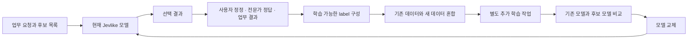

# Jevlike 자체 데이터 학습·파인튜닝 가이드

분석 기준: 2026-09-18, 커밋 `94f5fd1b0b11d52bbdfdf4e0ee6aa96b568f8452`. 전체 구조·제약·비교는 [분석 보고서](jevlike-analysis.md)를 참고한다.

## 1. 무엇을 학습시키려는지부터 구분하기

Jevlike로 직접 학습하는 대상은 **문맥과 후보를 보고 정답 후보에 높은 점수를 주는 함수**다.

```json
{"context":"어제 결제했는데 중복 청구됐습니다.","options":["결제 오류 상담","신규 상품 구매","로그인 문제 해결"],"label":0}
{"context":"비밀번호를 잊어버려 접속할 수 없습니다.","options":["반품 신청","계정 접근 복구"],"label":1}
```

위 예시는 데이터 형식을 설명하기 위한 것이며 두 건만으로 유용한 모델을 학습할 수 있다는 뜻은 아니다.

| 데이터 요소 | 요구 사항 |
|---|---|
| `context` | 문자열. 판단에 필요한 정보가 포함돼야 함 |
| `options` | 최소 2개 비어 있지 않은 문자열. 행마다 개수·내용이 달라도 됨 |
| `label` | 해당 행 후보 중 정답의 0-based 정수 인덱스 |
| 학습 문제 | 여러 후보 중 정답 하나를 선택 |

일반 문서·대화 로그만 있고 어떤 선택이 맞았는지 정보가 없으면 그대로 학습할 수 없다. 상담원의 실제 분류, 사용자의 정정, 규칙으로 계산한 정답, 전문가가 지정한 행동 등을 이 형식으로 변환해야 한다. 후보 순서를 바꾸면 `label`도 바꿔야 한다. [JSONL 검증 코드](https://github.com/vinnylarouge/jevlike/blob/94f5fd1b0b11d52bbdfdf4e0ee6aa96b568f8452/jevlike/data.py#L17-L46).

후보에는 실제로 혼동하기 쉬운 오답도 포함해야 한다. 서로 관련된 고객·문서·대화에서 생성한 행을 학습과 평가에 나눠 넣으면 근접 중복을 외우는 효과가 섞인다. 데이터 양의 보편적인 최소치를 이 프로젝트에서 도출할 수는 없다. 단순한 문자열 매칭과 복잡한 업무 판단은 요구량이 다르다.

## 2. 자체 데이터로 처음부터 학습

다음은 **Jevlike 클론 루트에서 실행하는 명령**이다. `data/company/` 아래에 JSONL 세 개를 먼저 준비한다.

```bash
uv venv
source .venv/bin/activate
uv pip install -e .

jevlike-train data/company/train.jsonl \
  --validation data/company/validation.jsonl \
  --output runs/company-tiny.pt \
  --encoder tiny \
  --context-tokens 768 \
  --option-tokens 192 \
  --width 64 --rank 64 \
  --epochs 8 --batch-size 64 \
  --learning-rate 0.002 \
  --device cpu

jevlike-eval runs/company-tiny.pt data/company/test.jsonl --device cpu

jevlike-predict runs/company-tiny.pt \
  --context "카드 결제가 두 번 처리됐습니다." \
  --option "결제 오류 상담" \
  --option "신규 상품 구매" \
  --option "로그인 문제 해결" \
  --device cpu
```

길이 768/192는 짧은 한국어 예제를 위한 시작 설정이며 최적값으로 측정한 수치는 아니다. Tiny 경로에서는 byte 단위이므로 실제 데이터의 잘림 정도를 보고 정한다. 길이를 늘려도 후보 내부 순서가 사라지는 구조적 한계는 해결되지 않는다.

학습 CLI를 실행할 때마다 모델은 새로 생성된다. `--output`에 기존 파일을 지정해도 기존 가중치를 불러와 학습하는 것이 아니라 마지막 저장 시 덮어쓴다. 현재 CLI에 `--resume`이나 `--init`은 없다. [학습 모델 생성 부분](https://github.com/vinnylarouge/jevlike/blob/94f5fd1b0b11d52bbdfdf4e0ee6aa96b568f8452/jevlike/train.py#L33-L67).

CPU로 가장 좋은 epoch를 보존하려면 [분석 보고서의 snapshot 버그](jevlike-analysis.md#63-cpu의-최적-체크포인트-보존-버그--직접-재현)를 먼저 수정하는 것이 좋다.

## 3. 사전학습 인코더를 활용한 head 학습

```bash
uv pip install -e '.[transformers]'

jevlike-train data/company/train.jsonl \
  --validation data/company/validation.jsonl \
  --output runs/company-hf-head.pt \
  --encoder hf \
  --hf-model Qwen/Qwen2.5-0.5B \
  --context-tokens 512 \
  --option-tokens 64 \
  --rank 256 \
  --batch-size 8 \
  --epochs 8 \
  --device auto
```

これは 저장소가 사용하는 모델 예시를 따른 구성 제안이며 **이번 분석에서 실행한 HF 실험은 아니다.** Qwen2.5 모델 카드는 한국어를 포함한 다국어 지원을 설명하지만, 이 scorer를 붙인 특정 업무의 한국어 정확도는 별도 확인이 필요하다. [Qwen 모델 카드](https://huggingface.co/Qwen/Qwen2.5-0.5B).

동작은 다음과 같다.

1. tokenizer와 `AutoModel`로 사전학습 가중치를 읽는다.
2. 문맥과 후보 각각의 hidden state를 계산한다.
3. Q/K/V projection과 LayerNorm을 가진 작은 head를 학습한다.
4. head와 설정만 `.pt`에 저장한다.

따라서 **사전학습 표현 위에 새 판단기를 학습하는 transfer learning**은 지원한다. 기반 Qwen의 지식·표현을 바꾸는 full fine-tuning은 수행하지 않는다. `--rank 256`은 LoRA 설정이 아니다. [FrozenTransformerScorer 구현](https://github.com/vinnylarouge/jevlike/blob/94f5fd1b0b11d52bbdfdf4e0ee6aa96b568f8452/jevlike/model.py#L66-L94).

설치와 모델 다운로드 후에는 자체 장비에서 학습·추론할 수 있다. HF checkpoint를 배포할 때는 같은 기반 모델과 tokenizer도 로컬 경로나 캐시에 있어야 한다. 현재 config는 모델 이름을 저장하고 revision은 고정하지 않는다.

## 4. 기존 체크포인트를 추가 학습하는 방법

### 4.1 텍스트 모델의 warm start

현재 CLI에는 없지만 `load_checkpoint()`는 일반 PyTorch 모델과 collator를 반환한다. 다음은 이를 이용하는 **별도로 작성할 최소 학습 코드 예시**다. 기존 config와 토큰 길이를 유지한다.

```python
from pathlib import Path

import torch
from torch.nn import functional as F
from torch.utils.data import DataLoader

from jevlike.data import JsonlDataset
from jevlike.model import load_checkpoint
from jevlike.train import mean_loss, move

device = torch.device("cpu")
model, collator, config = load_checkpoint("runs/company-tiny.pt", device)
train_loader = DataLoader(
    JsonlDataset("data/company-new/train.jsonl"),
    batch_size=32, shuffle=True, collate_fn=collator,
)
validation_loader = DataLoader(
    JsonlDataset("data/company-new/validation.jsonl"),
    batch_size=32, collate_fn=collator,
)
parameters = [p for p in model.parameters() if p.requires_grad]
optimizer = torch.optim.AdamW(parameters, lr=1e-4, weight_decay=1e-4)

def snapshot():
    return {
        name: parameter.detach().cpu().clone()
        for name, parameter in model.named_parameters()
        if parameter.requires_grad
    }

best_loss = mean_loss(model, validation_loader, device)
best_state = snapshot()
for _ in range(3):
    model.train()
    for host_batch in train_loader:
        batch = move(host_batch, device)
        loss = F.cross_entropy(model(batch), batch["labels"])
        optimizer.zero_grad(set_to_none=True)
        loss.backward()
        torch.nn.utils.clip_grad_norm_(parameters, 1.0)
        optimizer.step()
    current = mean_loss(model, validation_loader, device)
    if current < best_loss:
        best_loss, best_state = current, snapshot()

output = Path("runs/company-adapted.pt")
output.parent.mkdir(parents=True, exist_ok=True)
torch.save({"config": config, "state_dict": best_state}, output)
```

이 코드는 모델 weights를 시작점으로 쓰는 warm start다. 원래 optimizer 상태·random state·epoch를 복원하는 완전한 resume는 아니다. 낮은 학습률 `1e-4`와 3 epoch는 예시이고 데이터에 맞춰 조정해야 한다.

동일한 형태로 HF-head 체크포인트를 불러올 수도 있지만 기반 HF 인코더는 계속 동결된다. Tiny의 문맥 최대 길이를 늘리면 position embedding 모양이 달라지므로 기존 checkpoint config만 수정하는 방식으로 해결할 수 없다.

이번 분석에서는 위 접근의 핵심인 **load → 1배치 gradient update → save → reload**를 제공 synthetic 데이터에 실제 실행했다. 위 회사 데이터용 전체 예시 자체를 실행한 것은 아니다.

### 4.2 Full fine-tuning 또는 LoRA로 확장

다음은 현재 지원 기능이 아닌 구현 변경 범위다.

| 변경 지점 | Full fine-tuning | LoRA |
|---|---|---|
| 인코더 파라미터 | 필요한 기반 파라미터의 `requires_grad=True` | 기반 가중치는 동결하고 adapter를 추가 |
| forward | 인코더 호출의 `torch.no_grad()` 제거 | adapter gradient가 흘러야 하므로 동일하게 제거 |
| train/eval mode | forward의 강제 `encoder.eval()` 조정 | adapter dropout 등을 쓸 경우 적절한 mode 전환 필요 |
| optimizer | encoder와 head에 서로 다른 학습률 고려 | adapter와 head를 optimizer에 포함 |
| 저장·복원 | 변경한 encoder weights와 config·tokenizer 보존 | 기반 모델 식별 정보 + adapter 설정·가중치 + head 보존 |
| 메모리 | encoder 역전파용 activation·optimizer 상태 추가 | 학습 파라미터는 줄지만 activation 비용은 남음 |

PEFT adapter를 붙이기만 하고 기존 `no_grad()`를 남기면 adapter가 학습되지 않는다. 또한 현재 `make_system()`은 LoRA module을 재구성하지 않으므로 학습된 adapter tensor만 현 checkpoint에 넣는 것으로는 충분하지 않다. [현 gradient 차단 코드](https://github.com/vinnylarouge/jevlike/blob/94f5fd1b0b11d52bbdfdf4e0ee6aa96b568f8452/jevlike/model.py#L66-L94), [PEFT 공식 LoRA 설명](https://huggingface.co/docs/peft/main/package_reference/lora).

Full fine-tuning을 구현하더라도 목적함수는 후보 선택 cross entropy다. 자유로운 답변 생성용 SFT나 문서 코퍼스의 next-token continued pretraining이 자동으로 생기지는 않는다. 그 목적이라면 언어모델용 학습 구조가 필요하다.

## 5. “자체 학습”을 자동 개선으로 확장하려면

기본 텍스트 추론 함수는 `eval()`과 `no_grad()`로 실행돼 가중치를 바꾸지 않는다. 지속 개선을 원한다면 다음과 같은 별도 흐름이 필요하다.



이 그림은 **제안하는 외부 설계**다. 저장소의 자동화 기능을 나타내는 것이 아니다. 스스로 낸 예측을 정답으로 그대로 재학습하면 잘못된 선택도 강화할 수 있다. 사용자 수정, 결과에 대한 명확한 보상, 전문가 판정 등 추가 정보가 필요하다.

LLM을 teacher로 써서 각 후보의 정답 인덱스를 만들고 Jevlike에 학습시키는 hard-label distillation도 데이터 변환으로 구성할 수 있다. 그러나 teacher 호출·정답 확인·soft-label loss는 내장돼 있지 않다. 현재 `label`은 정수 하나이므로 teacher의 확률 분포를 활용하려면 데이터 schema와 loss를 바꿔야 한다.

보상만 얻는 도구 선택 문제라면 contextual bandit 또는 RL로 확장할 수 있지만, Doom PPO 코드를 그대로 텍스트 업무에 꽂는 인터페이스는 없다. 환경 adapter, 상태·행동·보상 정의, rollout 수집과 학습을 추가해야 한다.

게임 예제에는 이미 제한된 환경에서 위와 유사한 루프가 있다. 다만 DAgger는 외부 전문가가 필요하고, PPO는 환경 및 설계된 reward가 필요하다. 자동으로 정답과 목표까지 발명하는 시스템은 아니다.

## 6. 이번에 실행한 실험

저장소 원본 소스 수정 없이, 클론 내 `runs/research/`에만 데이터·로그·checkpoint를 만들었다. Python 3.13.2, PyTorch 2.14.0, macOS arm64 CPU를 사용했다. upstream synthetic 함수가 `set`을 list로 바꾸므로 생성 과정의 순서를 고정하기 위해 `PYTHONHASHSEED=0`을 지정했다.

클론 루트에서 실제 사용한 주요 명령:

```bash
PYTHONHASHSEED=0 .venv/bin/jevlike-data synthetic \
  --output runs/research/synthetic

PYTHONHASHSEED=0 OMP_NUM_THREADS=2 .venv/bin/jevlike-train \
  runs/research/synthetic/train.jsonl \
  --validation runs/research/synthetic/validation.jsonl \
  --output runs/research/synthetic.pt \
  --device cpu

.venv/bin/jevlike-eval runs/research/synthetic.pt \
  runs/research/synthetic/test.jsonl --device cpu

.venv/bin/jevlike-predict runs/research/synthetic.pt \
  --context "Choose the exact badge amber badger. Badge: amber badger." \
  --option "azure crane" \
  --option "amber badger" \
  --option "gold heron" \
  --device cpu
```

| 결과 | 값 |
|---|---:|
| train / validation / evaluation | 2,000 / 400 / 400 |
| encoder / width / rank | tiny / 64 / 64 |
| context / option 최대 byte | 192 / 32 |
| epochs / batch size / learning rate | 8 / 64 / 0.002 |
| 평가 top-1 | 0.9975 |
| shuffled-context top-1 | 0.2275 |
| 예제 추론 최고 후보 | `amber badger` |
| `ab`, `ba` 후보 표현 충돌 결과 | 0.5, 0.5 |
| CPU snapshot의 원본 파라미터 메모리 공유 | 확인 |
| 로그상 최저 validation NLL | 0.007990022491430864 |
| 저장 모델 재로딩 후 validation NLL | 0.008054113858379423 |
| warm start 1배치 후 query weight 최대 변화 | 약 0.000100285 |
| warm start 저장·재로딩 후 logits 최대 차이 | 0 |

로그는 클론 안의 `runs/research/train.jsonl`, `eval.json`, `predict.json`, `diagnostics.json`에 남겨 두었다. 원본 모델은 `synthetic.pt`, 추가 학습 모델은 `warm-start.pt`다. 이 파일들은 분석 저장소에 추적되지 않는다.

## 7. 목표별 선택

| 실제 목표 | 판단 |
|---|---|
| 자체 라벨 데이터로 빠른 소규모 라우터 만들기 | Jevlike를 시도할 수 있음. 고정 라벨이면 일반 classifier와도 비교 |
| 후보가 매번 바뀌는 도구·링크 선택 | 이 프로젝트의 구조적 장점이 잘 맞음 |
| 한국어 문의의 복잡한 의미 판단 | HF head 경로와 사전학습 reranker를 우선 비교. Tiny만으로 판단하지 않음 |
| Qwen의 도메인 표현 자체를 파인튜닝 | 현 구현 보완 또는 별도 PEFT 기반 학습 필요 |
| 회사 문서를 넣어 지식형 챗봇 만들기 | Jevlike 단독으로 충족하지 않음. 검색·생성 모델 구조가 별도로 필요 |
| 사용자 피드백을 누적해 자동 개선 | 정답 수집과 재학습 루프를 추가하면 구현 가능 |
| 게임에서 보상으로 정책 개선 연구 | 제공 PPO·DAgger가 출발점. 현재 예제 성능과 플랫폼 제약을 감안 |

도입 가치의 핵심은 “작은 모델을 직접 소유하고 학습하는 가변 후보 선택기”다. 학습·추론의 최소 기능은 실제 동작하지만, 기반 언어모델의 본격적인 파인튜닝과 자율 지속학습은 별도 개발 범위다.
