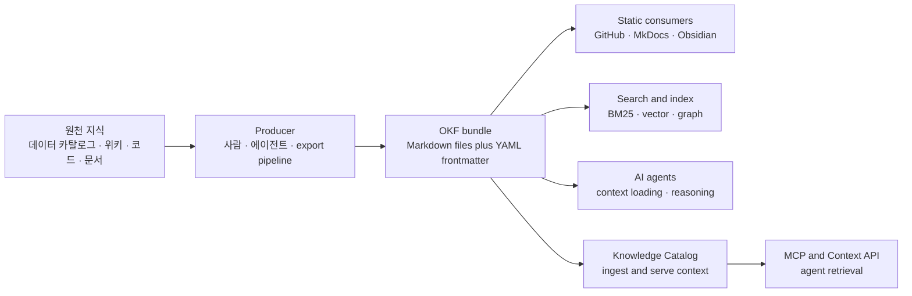
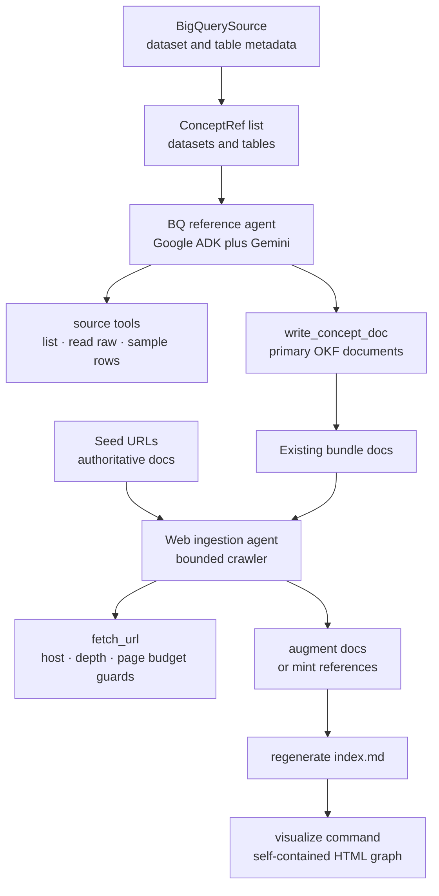
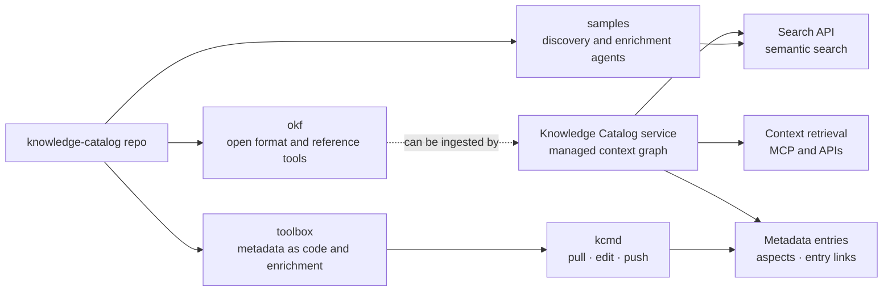
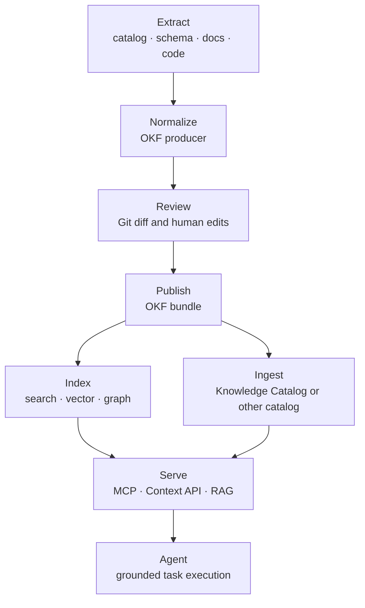

# Google Cloud Knowledge Catalog · Open Knowledge Format 분석

## 분석 기준

- 대상 레포: [GoogleCloudPlatform/knowledge-catalog](https://github.com/GoogleCloudPlatform/knowledge-catalog)
- 로컬 분석 커밋: `d44368c` (`okf: refocus README title and intro on the format`)
- 기준일: 2026-06-22
- 외부 문맥: Google Cloud OKF 공개 글, Knowledge Catalog 공식 문서, 레포의 `okf/SPEC.md`, reference agent 코드, 샘플 번들, `toolbox/` 코드

## 핵심 요약

Open Knowledge Format(OKF)는 새로운 데이터베이스나 지식 그래프 엔진이 아니라, 조직 지식을 Markdown 파일과 YAML frontmatter로 교환하기 위한 최소 규격이다. 핵심 목표는 에이전트가 필요한 스키마, 메트릭 정의, 조인 경로, 런북, API 설명, 비즈니스 용어 같은 컨텍스트가 카탈로그, 위키, 코드, 사람 머릿속에 흩어진 문제를 해결하는 것이다.

Google Cloud의 Knowledge Catalog는 이 컨텍스트를 서비스로 수집, 보강, 검색, MCP로 제공하는 제품이고, OKF는 그 컨텍스트를 특정 벤더나 서비스에 묶지 않고 파일 단위로 주고받기 위한 포맷이다. 이 레포는 OKF v0.1 초안 스펙, BigQuery 기반 reference producer agent, 정적 HTML visualizer, 3개 샘플 번들, 그리고 Knowledge Catalog용 discovery/enrichment/metadata-as-code 도구를 제공한다.

## 1. 프로젝트 개요

### Knowledge Catalog

Knowledge Catalog는 Dataplex Universal Catalog의 새 이름이다. Google 공식 문서 기준으로 2026-04-10부터 명칭이 바뀌었고, API endpoint, client library, `gcloud dataplex` 명령, IAM 이름은 유지된다. 제품 포지셔닝은 기존의 수동 메타데이터 카탈로그에서 AI agent를 grounding하기 위한 동적 context graph로 이동했다.

Knowledge Catalog의 공식 핵심 축은 다음과 같다.

| 축 | 의미 |
|---|---|
| Governance foundation | BigQuery, Spanner, Cloud SQL, AlloyDB, Cloud Storage 등에서 기술 메타데이터와 거버넌스 정보를 수집 |
| Context curation | Gemini로 스키마, query log, semantic model, 비정형 지식에서 설명, 관계, verified SQL pattern을 생성 |
| Context retrieval | semantic search, Context API, local/remote MCP server로 에이전트에 조직 지식을 제공 |

### Open Knowledge Format

OKF는 Knowledge Catalog 제품 자체보다 작은 범위의 공개 포맷이다. Google Cloud 블로그는 OKF를 LLM-wiki 패턴을 표준화한 portable, interoperable format으로 설명한다. 레포의 `okf/SPEC.md`는 OKF v0.1을 draft로 정의하며, "metadata, context, curated insight that surrounds data and systems"를 표현하는 파일 포맷으로 둔다.

짧게 말하면 다음과 같다.

| 질문 | 답 |
|---|---|
| OKF는 무엇인가 | 지식을 `directory of markdown files with YAML frontmatter`로 표현하는 vendor-neutral 파일 포맷 |
| 최소 필수 필드는 무엇인가 | concept 문서의 frontmatter에 `type` 하나 |
| 단위는 무엇인가 | bundle, concept, concept ID, markdown link, citation |
| 관계는 어떻게 표현하는가 | Markdown link를 directed relationship로 해석 |
| 저장소나 런타임이 필요한가 | 필요 없다. Git repo, tarball, static file server, 일반 파일시스템으로 배포 가능 |
| Knowledge Catalog와 관계는 | Knowledge Catalog가 OKF를 ingest하고 에이전트에 제공할 수 있지만, OKF 자체는 Google Cloud에 종속되지 않는다 |

## 2. 해결하려는 문제

### Problem Statement

AI agent가 신뢰 가능한 작업을 하려면 모델 자체 지식보다 조직 내부 컨텍스트가 더 중요하다. 예를 들어 "이 event stream에서 weekly active users를 어떻게 계산하지?"라는 질문에 정확히 답하려면 다음이 필요하다.

- 어떤 테이블이 authoritative source인지
- user identifier가 무엇인지
- event grain과 timezone이 무엇인지
- 활성 사용자의 비즈니스 정의가 무엇인지
- 중복 제거 규칙과 제외 조건이 무엇인지
- 검증된 SQL 패턴이나 과거 쿼리가 있는지
- 관련 메트릭, glossary, dashboard, runbook이 어디에 있는지

현실에서는 이 정보가 서로 다른 시스템에 흩어져 있다.

| 컨텍스트 위치 | 문제 |
|---|---|
| 메타데이터 카탈로그 | 제품별 API와 schema가 달라 portable하지 않음 |
| Wiki, Docs, Drive | 사람에게는 읽히지만 agent가 구조적으로 순회하기 어렵고 stale 가능성이 큼 |
| 코드 주석, notebook | 특정 repo나 실행 환경에 묶임 |
| BI semantic layer | 메트릭과 차원 정의는 있지만 operational context와 연결이 약함 |
| 숙련자 암묵지 | 검색, 버전관리, 재사용이 불가능 |

OKF가 해결하려는 핵심은 "지식을 더 잘 저장하는 서비스"가 아니라 "지식을 agent와 사람이 공통으로 읽고, diff하고, 교환할 수 있는 기본 파일 형태"를 제공하는 것이다.

### 왜 Markdown과 YAML인가

OKF의 설계 선택은 의도적으로 보수적이다.

- Markdown은 사람, IDE, GitHub, static site generator, LLM이 모두 읽을 수 있다.
- YAML frontmatter는 query/filter/index에 필요한 소수의 structured field를 담기에 충분하다.
- 디렉터리 구조는 bundle의 progressive disclosure를 만든다.
- Markdown link는 파일 트리를 넘어 graph 관계를 표현한다.
- Git은 review, blame, history, branch, PR workflow를 무료로 제공한다.

이는 agent context를 "데이터베이스에 감춘 객체"가 아니라 "코드처럼 관리되는 지식 파일"로 다루려는 방향이다.

## 3. OKF 포맷 분석

### 핵심 개념

| 개념 | 설명 |
|---|---|
| Knowledge Bundle | 배포 단위. Markdown concept 문서들의 self-contained directory tree |
| Concept | 하나의 지식 단위. 테이블, API, 메트릭, playbook, business process 등 무엇이든 가능 |
| Concept ID | bundle root 기준 파일 경로에서 `.md`를 제거한 값. 예: `tables/users` |
| Frontmatter | 파일 상단의 YAML block |
| Body | frontmatter 이후의 Markdown 본문 |
| Link | concept 간 관계. 관계 타입은 link 자체가 아니라 주변 문맥이 설명 |
| Citation | 외부 source를 가리키는 링크 |

### Bundle 구조

```text
bundle/
├── index.md
├── log.md
├── datasets/
│   ├── index.md
│   └── sales.md
├── tables/
│   ├── index.md
│   ├── orders.md
│   └── customers.md
└── metrics/
    ├── index.md
    └── weekly_active_users.md
```

`index.md`와 `log.md`는 reserved filename이다. `index.md`는 directory listing과 progressive disclosure를 위한 파일이고, `log.md`는 변경 이력을 위한 선택 파일이다. 그 외 `.md`는 concept 문서다.

### Concept 문서 형식

```markdown
---
type: BigQuery Table
title: Customer Orders
description: One row per completed customer order across all channels.
resource: https://console.cloud.google.com/bigquery?p=acme&d=sales&t=orders
tags: [sales, orders, revenue]
timestamp: 2026-05-28T14:30:00Z
---

# Schema

| Column | Type | Description |
|---|---|---|
| `order_id` | STRING | Globally unique order identifier. |

# Citations

[1] [BigQuery table schema](https://console.cloud.google.com/bigquery)
```

OKF v0.1 스펙에서 conformant bundle의 하드 요구사항은 매우 작다.

1. reserved 파일이 아닌 모든 `.md` 파일은 parseable YAML frontmatter를 가진다.
2. 모든 concept frontmatter는 비어 있지 않은 `type` 필드를 가진다.
3. `index.md`, `log.md`가 있으면 각 섹션의 구조를 따른다.

나머지는 permissive consumption 모델이다. consumer는 unknown type, unknown frontmatter key, missing optional field, broken link, missing index를 이유로 bundle을 거부하면 안 된다.

### 스펙과 레퍼런스 구현의 차이

레포 코드에서 중요한 차이가 보인다.

- 스펙상 필수 frontmatter는 `type` 하나다.
- `okf/src/reference_agent/bundle/document.py`의 `REQUIRED_FRONTMATTER_KEYS`는 `type`, `title`, `description`, `timestamp` 네 개다.
- `write_concept_doc()` 도구도 동일한 네 필드를 요구한다.

이는 OKF 스펙 자체의 conformance 요구사항이 아니라 reference agent가 생성하는 문서의 품질 기준이다. 외부 producer를 만들 때는 `type`만으로도 OKF conformant가 될 수 있지만, 이 repo의 reference agent와 visualizer experience를 매끄럽게 쓰려면 `title`, `description`, `timestamp`, `resource`, `tags`를 채우는 편이 실용적이다.

### OKF가 아닌 것

| 오해 | 실제 |
|---|---|
| 지식 그래프 데이터베이스 | 아니다. Markdown link로 graph를 표현할 수 있지만 저장·질의 엔진은 아니다 |
| RDF · OWL · Schema.org 대체 | 아니다. domain schema를 대체하지 않고 참조한다 |
| MCP 대체 | 아니다. MCP는 agent-tool protocol이고, OKF는 context artifact 포맷이다 |
| `llms.txt` 대체 | 아니다. `llms.txt`는 사이트/문서 안내에 가깝고 OKF는 typed concept bundle이다 |
| Google Cloud 전용 포맷 | 아니다. Knowledge Catalog가 ingest할 수 있지만 포맷은 vendor-neutral을 목표로 한다 |
| 완성된 표준 | 아니다. v0.1 draft이며 producer/consumer 생태계 확장을 전제로 한다 |

## 4. 아키텍처 분석

### OKF 생태계 구조



이 구조에서 OKF의 위치는 "context serving system" 앞단의 교환 포맷이다. 어떤 시스템이든 OKF를 만들 수 있고, 어떤 시스템이든 OKF를 읽을 수 있어야 한다는 producer/consumer independence가 핵심이다.

### 레포의 OKF reference agent 흐름



레퍼런스 구현은 두 pass로 구성된다.

1. BQ pass: BigQuery dataset/table metadata를 읽어 concept별 OKF 문서를 생성한다.
2. Web pass: seed URL에서 출발해 authoritative documentation을 제한적으로 fetch하고, 기존 concept 문서를 보강하거나 `references/` 문서를 만든다.

마지막으로 `index.md`를 재생성하고, `visualize` 명령으로 HTML graph viewer를 만들 수 있다.

### Knowledge Catalog와 레포 도구의 관계



`okf/`는 공개 포맷과 reference implementation이고, `toolbox/mdcode`는 Knowledge Catalog service와 sync하는 metadata-as-code 도구다. 둘 다 Markdown/YAML을 쓰지만, OKF는 vendor-neutral bundle이고 `kcmd` snapshot은 Knowledge Catalog의 Entry/Aspect 모델에 더 직접적으로 맞춘다.

## 5. 레포에서 제공하는 것

### 디렉터리별 제공물

| 위치 | 제공물 | 역할 |
|---|---|---|
| `README.md` | Knowledge Catalog 소개 | 레포가 Knowledge Catalog feature, context management, enrichment, retrieval sample을 제공한다고 설명 |
| `okf/SPEC.md` | OKF v0.1 draft spec | bundle, concept, frontmatter, cross-link, index, log, citation, conformance 정의 |
| `okf/README.md` | OKF guide | 설치, 실행, sample, visualizer 사용법 |
| `okf/src/reference_agent/` | Python reference agent | BigQuery metadata와 web docs로 OKF bundle 생성 |
| `okf/bundles/` | ready-to-browse OKF sample bundles | GA4, Stack Overflow, Bitcoin public datasets의 생성 결과 |
| `okf/samples/` | sample recipes | 각 sample bundle 재현 명령과 seed URL |
| `samples/discovery/` | Knowledge Catalog Discovery Agent | Dataplex Catalog Search API semantic search wrapper agent |
| `samples/enrichment/` | Python enrichment sample | metadata snapshot을 다운로드, 에이전트로 문서 보강, publish하는 예제 |
| `toolbox/mdcode/` | `kcmd` Metadata as Code | Knowledge Catalog metadata snapshot을 local YAML/Markdown으로 pull/push, MCP server 제공 |
| `toolbox/enrichment/` | `kcagent` enrichment tool | `kcmd` snapshot과 external tools를 사용해 metadata documentation을 보강 |

### OKF sample bundle

| Bundle | Markdown 파일 수 | 특징 |
|---|---:|---|
| `okf/bundles/ga4/` | 17 | GA4 e-commerce dataset. 단일 sharded events table과 metrics/join references |
| `okf/bundles/stackoverflow/` | 53 | Stack Overflow public dataset. 여러 table과 enum/reference 문서가 많음 |
| `okf/bundles/crypto_bitcoin/` | 8 | Bitcoin blocks/transactions/inputs/outputs. tightly related fact table 구조 |

샘플을 보면 OKF가 단순 schema dump가 아니라 table grain, schema, common query pattern, citations, metrics, joins를 한 파일 트리 안에 엮는 방식임을 확인할 수 있다.

### 실행 가능한 OKF CLI

`okf/pyproject.toml`은 Python package `reference-agent`를 정의한다.

```bash
reference-agent enrich \
  --source bq \
  --dataset <project>.<dataset> \
  --web-seed-file <path/to/seeds.txt> \
  --out ./bundles/<name>
```

```bash
reference-agent visualize \
  --bundle ./bundles/<name> \
  --out ./bundles/<name>/viz.html
```

현재 구현된 source는 `bq` 하나다. 즉 포맷은 범용이지만 reference producer는 BigQuery public/private dataset을 대상으로 설계되어 있다.

## 6. 핵심 코드 분석

### Source abstraction

`okf/src/reference_agent/sources/base.py`는 `Source` 추상 클래스를 둔다.

- `list_concepts()`는 source가 노출하는 concept 목록을 반환한다.
- `read_concept(ref)`는 concept의 raw metadata를 반환한다.
- `sample_rows(ref, n)`는 선택적으로 샘플 row를 반환한다.

`BigQuerySource`는 이를 구현해 dataset concept 1개와 table concept N개를 만든다. `events_20240101` 같은 shard suffix는 `events_` family concept로 묶는다. table metadata에는 schema, partitioning, clustering, row count, byte size, timestamp 등이 포함된다.

설계상 새로운 producer를 붙이려면 `Source` 구현체를 추가하고 CLI source selector를 확장하면 된다. 예를 들어 PostgreSQL, OpenAPI, dbt manifest, LookML, DataHub, Collibra export, filesystem docs를 source로 만들 수 있다.

### Agent construction

`okf/src/reference_agent/agent.py`는 두 agent를 만든다.

| Agent | 목적 | 도구 |
|---|---|---|
| `okf_bq_reference_agent` | BigQuery raw metadata를 OKF concept doc으로 작성 | `list_concepts`, `read_concept_raw`, `sample_rows`, `read_existing_doc`, `write_concept_doc` |
| `okf_web_ingestion_agent` | seed URL 기반 문서 보강 | `list_concepts`, `read_concept_raw`, `read_existing_doc`, `write_concept_doc`, `fetch_url` |

기본 모델은 `gemini-flash-latest`이고, Google ADK의 `Agent`, `Runner`, `FunctionTool`을 사용한다.

### Runner orchestration

`okf/src/reference_agent/runner.py`의 `ReferenceRunner.enrich_all()`은 다음 순서로 동작한다.

1. source에서 concept 목록을 얻는다.
2. `--concept` 옵션이 있으면 대상 concept만 필터링한다.
3. concept별로 BQ agent session을 만들고 한 번씩 실행한다.
4. seed가 있으면 web pass를 실행한다.
5. `regenerate_indexes()`로 bundle 내부 `index.md`를 다시 쓴다.

세션은 `InMemorySessionService`를 사용하므로 장기 상태 저장용 runner는 아니다. 각 concept 작업은 독립 invocation에 가깝다.

### Document writer와 보강 guard

`okf/src/reference_agent/tools/bundle_tools.py`의 `write_concept_doc()`가 문서 write path의 핵심이다.

주요 설계는 다음과 같다.

- frontmatter key order를 `type`, `resource`, `title`, `description`, `tags`, `timestamp` 순서로 정렬한다.
- timestamp가 없으면 현재 UTC timestamp를 채운다.
- reference implementation 기준 필수 field가 없으면 write를 거부한다.
- web pass에서 기존 BigQuery table doc을 보강할 때 `# Schema` field set이 줄어들면 write를 거부한다.
- web pass에서 기존 citation count가 줄어들면 write를 거부한다.

이 guard는 LLM이 웹 문서를 요약하면서 BigQuery metadata에서 얻은 schema를 덮어써 버리는 문제를 막기 위한 실용적인 장치다.

### Web fetcher

`okf/src/reference_agent/tools/web_tools.py`와 `web/fetcher.py`는 agent crawler를 제한한다.

- scheme은 `http`와 `https`만 허용한다.
- seed host와 추가 allowed host만 fetch한다.
- optional path prefix allow-list와 denied substring blocklist를 둔다.
- session별 max pages와 max depth를 강제한다.
- 이미 방문한 URL은 재방문하지 않는다.
- HTML이 아닌 response는 거부한다.
- HTML은 `markdownify`로 Markdown으로 변환하고 40 KiB로 truncate한다.

이 구조는 agent autonomy를 완전히 열어두지 않고, authoritative docs 중심의 bounded enrichment를 유도한다.

### Index generator

`okf/src/reference_agent/bundle/index.py`는 bundle의 모든 directory를 순회하며 `index.md`를 만든다. 각 concept의 `type`, `title`, `description`으로 section을 그룹화하고, subdirectory도 entry로 포함한다. directory description은 Gemini 호출로 한 문장 요약을 시도하고 실패하면 fallback 문자열을 쓴다.

### Visualizer

`okf/src/reference_agent/viewer/generator.py`는 bundle을 읽어 concept node와 link edge를 만들고, `viz.html` template에 JSON, CSS, JS를 embed한다. browser side는 Cytoscape.js와 marked를 CDN에서 불러 graph와 detail panel을 보여준다.

주의할 점은 `_extract_links()`가 상대 `.md` 링크만 edge로 추출하고, `/tables/foo.md` 같은 absolute bundle-relative link는 graph edge에서 건너뛴다는 점이다. OKF spec은 absolute bundle-relative link를 recommended form으로 설명하지만, reference agent prompt는 GitHub rendering을 위해 relative link만 쓰라고 지시한다. 여기에도 스펙과 구현의 실제 선택 차이가 있다.

## 7. API 및 인터페이스

### OKF spec 인터페이스

OKF의 가장 중요한 API는 파일 시스템 자체다.

| 인터페이스 | 설명 |
|---|---|
| Concept file | `.md` 파일 + YAML frontmatter |
| Concept ID | bundle root 기준 path |
| Relationship | Markdown link |
| Directory index | `index.md` |
| Change log | `log.md` |
| Citation | `# Citations` section의 외부 URL 또는 bundle path |

### `reference-agent` CLI

| Command | 역할 |
|---|---|
| `enrich` | source metadata와 optional web pass로 OKF bundle 생성 |
| `visualize` | bundle을 self-contained HTML graph로 렌더링 |

주요 옵션은 `--source bq`, `--dataset`, `--billing-project`, `--concept`, `--web-seed`, `--web-seed-file`, `--web-max-pages`, `--web-allowed-host`, `--web-allowed-path-prefix`, `--web-denied-path-substring`, `--web-max-depth`, `--no-web`, `--model`이다.

### `kcmd` Metadata-as-Code CLI와 MCP

`toolbox/mdcode`는 `kcmd` binary를 제공한다.

| Command | 역할 |
|---|---|
| `kcmd init` | BigQuery dataset, EntryGroup, Knowledge Base scope로 local snapshot manifest 생성 |
| `kcmd pull` | Knowledge Catalog service에서 metadata snapshot 다운로드 |
| `kcmd status` | local modification 확인 |
| `kcmd push` | local metadata 변경을 service로 publish |
| `kcmd mcp` | agent가 snapshot을 조작할 수 있는 MCP server 실행 |

MCP tool은 `pull`, `push`, `list-entries`, `lookup-entry`, `modify-entry`를 제공한다. 이 도구는 OKF보다 Knowledge Catalog의 Entry/Aspect model에 가깝다.

### Discovery sample

`samples/discovery`는 Knowledge Catalog Search API를 호출하는 ADK agent다. `knowledge_catalog_search(query)` 도구는 `dataplex_v1.CatalogServiceClient.search_entries()`를 `semantic_search=True`로 호출하고, entry name, system, resource id, display name을 반환한다.

## 8. 기술 스택

| 영역 | 기술 |
|---|---|
| OKF spec | Markdown, YAML frontmatter, file tree, Markdown links |
| Reference agent | Python 3.11+, Google ADK, Google GenAI, Gemini, Pydantic, PyYAML |
| Source integration | `google-cloud-bigquery` |
| Web ingestion | `urllib.request`, `markdownify`, bounded crawler state |
| Visualization | self-contained HTML, Cytoscape.js, marked, embedded JSON/CSS/JS |
| Metadata-as-Code | TypeScript, Bun, `cac`, `zod`, `yaml`, raw HTTP client |
| MCP | `@modelcontextprotocol/sdk` |
| Knowledge Catalog API | Dataplex APIs, Catalog Search API, Entry/Aspect model |

## 9. 확장성 및 플러그인 포인트

### OKF producer 확장

가장 자연스러운 확장점은 `Source` 구현체다.

| 후보 source | 생성 가능한 concept |
|---|---|
| dbt manifest | models, sources, metrics, exposures, lineage |
| LookML | explores, views, dimensions, measures, joins |
| OpenAPI | services, endpoints, schemas, auth flows |
| PostgreSQL/MySQL | schemas, tables, columns, constraints, views |
| DataHub/Collibra export | datasets, glossary terms, ownership, lineage |
| Git repo docs | ADR, runbook, code module docs |
| Cloud logs/runbooks | incident playbooks, SLO docs, troubleshooting recipes |

### OKF consumer 확장

OKF consumer는 단순 파일 reader부터 복잡한 context system까지 넓다.

- static site renderer
- graph viewer
- BM25/vector hybrid search indexer
- MCP server exposing bundle search and concept lookup
- IDE plugin
- LLM context packer
- Knowledge Catalog importer
- policy scanner or link checker

현재 레포의 visualizer는 proof-of-concept consumer다. production consumer라면 link resolver, schema validation, search ranking, access control, incremental indexing이 추가로 필요하다.

## 10. 성능 및 스케일링 특성

OKF 자체는 파일 포맷이라 성능 특성은 consumer 구현에 달려 있다. 그래도 포맷 설계상 다음 trade-off가 있다.

| 항목 | 장점 | 제약 |
|---|---|---|
| 파일 단위 concept | git diff와 부분 로딩이 쉬움 | 수만 개 이상이면 filesystem scan과 repo UX가 무거워질 수 있음 |
| Markdown body | LLM과 사람이 바로 읽음 | 구조적 질의는 frontmatter나 별도 indexer 없이는 제한적 |
| Markdown links | graph 추출이 단순함 | relationship type이 link 주변 prose에 있어 기계적으로 모호함 |
| `index.md` | agent가 계층적으로 탐색 가능 | index freshness를 producer가 관리해야 함 |
| permissive conformance | partial/generated bundle을 받아들이기 쉬움 | strict interoperability는 consumer별 관례에 의존 |

reference agent의 web pass는 max pages, max depth, allowed host로 bounded되어 있지만, concept 수가 많으면 BQ pass가 concept별 LLM invocation을 수행하므로 비용과 시간이 concept 수에 선형으로 증가한다. 샘플 규모는 8~53개 Markdown 파일 수준으로 작다. 대규모 enterprise catalog를 직접 OKF로 export하려면 batch generation, incremental update, deterministic template generation, LLM 호출 최소화가 필요하다.

## 11. 배포 및 운영 관점

OKF bundle 배포 방식은 단순하다.

- Git repository에 commit
- release artifact로 zip/tarball 배포
- object storage나 static file server에 host
- Knowledge Catalog로 ingest
- local MCP server나 search indexer가 mount

reference agent 실행에는 BigQuery credential과 Gemini credential이 필요하다.

```bash
gcloud auth application-default login
gcloud config set project <billing-project>
export GEMINI_API_KEY=<key>
# 또는 Vertex AI 사용
export GOOGLE_GENAI_USE_VERTEXAI=true
export GOOGLE_CLOUD_PROJECT=<project>
export GOOGLE_CLOUD_LOCATION=<region>
```

레포 루트 README에는 이 저장소와 내용물이 공식 Google product가 아니며 Apache 2.0 license로 제공된다고 명시되어 있다. Knowledge Catalog 자체는 Google Cloud managed service이고, OKF reference tools는 별도의 sample/reference code로 보는 것이 맞다.

## 12. 경쟁 및 비교 분석

| 대상 | OKF와의 관계 | 차이 |
|---|---|---|
| RDF · OWL | 지식 표현 표준 | OKF는 formal ontology보다 낮은 진입장벽의 file convention. reasoning semantics는 약함 |
| JSON-LD · Schema.org | 웹 structured data vocabulary | OKF는 vocabulary가 아니라 directory/file container와 concept convention |
| OpenAPI · AsyncAPI | API contract format | OKF는 API뿐 아니라 table, metric, runbook, glossary 등 일반 지식을 표현 |
| dbt docs · manifest | analytics engineering metadata | dbt 생태계에 강하지만 범용 agent knowledge bundle은 아님 |
| DataHub · OpenMetadata · Amundsen | metadata catalog platform | OKF는 service가 아니라 import/export 가능한 artifact format |
| Collibra · Atlan | enterprise catalog | OKF는 vendor-neutral exchange layer를 목표로 함 |
| Obsidian vault · Notion export | Markdown/wiki knowledge base | OKF는 최소 frontmatter와 reserved files를 표준화해 agent interoperability를 높임 |
| `llms.txt` | LLM용 사이트 안내 | OKF는 single entrypoint가 아니라 typed concept corpus |
| MCP | agent tool protocol | OKF bundle은 MCP server가 serve할 수 있는 content artifact |

엔지니어 관점에서 가장 가까운 비교 대상은 "metadata-as-code + LLM wiki"다. OKF는 기존 기술을 새로 발명하지 않고, agent가 공유할 수 있는 작은 contract를 부여한다는 점이 차별점이다.

## 13. 장단점

### 강점

- 매우 낮은 구현 비용: text file writer만 있어도 producer를 만들 수 있다.
- Git-native: review, history, branch, PR workflow가 그대로 작동한다.
- Human-agent shared artifact: 사람이 읽는 문서와 agent context가 분리되지 않는다.
- Vendor-neutral: Knowledge Catalog와 연결되지만 포맷 자체는 특정 API에 묶이지 않는다.
- Progressive disclosure: `index.md`로 agent가 전체 corpus를 한 번에 load하지 않고 탐색할 수 있다.
- Graph extraction 가능: Markdown link에서 directed graph를 만들 수 있다.
- 기존 도구와 호환: GitHub, MkDocs, Obsidian, static site generator, 일반 grep/search와 맞는다.

### 약점과 리스크

- v0.1 draft라 ecosystem convention이 아직 얇다.
- 관계 타입이 formal하지 않아 "joins-with", "depends-on", "defines", "deprecated-by" 같은 의미를 안정적으로 추출하기 어렵다.
- frontmatter 필수 필드가 너무 적어 consumer별 기대치가 갈릴 수 있다.
- Markdown flavor가 엄격히 고정되어 있지 않아 renderer 차이가 생길 수 있다.
- access control과 sensitive context 관리는 포맷 밖의 문제다.
- large-scale bundle에서 indexing, incremental update, link validation, ownership workflow가 별도 구현 필요하다.
- reference implementation은 BigQuery 중심이라 범용 producer ecosystem은 아직 직접 만들어야 한다.
- reference visualizer의 link extraction은 현재 relative `.md` link 중심이라 spec의 absolute bundle-relative recommendation과 완전히 일치하지 않는다.

## 14. 엔지니어 관점 종합 평가

OKF의 가치는 기술적 새로움보다 "합의 가능한 최소 단위"에 있다. 대부분의 팀은 이미 Markdown 문서, dbt docs, catalog description, glossary, runbook, wiki를 가지고 있다. 문제는 이들이 agent에게 일관된 corpus로 보이지 않는다는 점이다. OKF는 이 흩어진 지식을 얇은 규격으로 묶어 agent context supply chain의 중간 포맷으로 만들려 한다.

좋은 적용 사례는 다음과 같다.

- 데이터셋, 테이블, 메트릭, 조인 경로를 에이전트가 안정적으로 참조해야 하는 분석 플랫폼
- dbt/LookML/BigQuery/카탈로그 지식을 Git workflow로 review하고 싶은 데이터 팀
- RAG index나 MCP server가 ingest할 source-of-truth 문서 bundle이 필요한 팀
- 여러 catalog/vendor 사이에서 metadata와 business context를 교환해야 하는 조직
- AI coding/data agent에게 repo-local knowledge base를 제공하려는 프로젝트

부적합한 사례는 다음과 같다.

- 강한 ontology reasoning, constraint validation, typed relationship query가 핵심인 시스템
- row-level security, policy enforcement, audit가 포맷 레벨에서 필요한 시스템
- sub-second search serving 자체가 필요한 경우
- 이미 성숙한 catalog platform 안에서만 metadata가 소비되고 외부 교환 필요가 없는 경우

실무적으로는 OKF를 단독 제품으로 보기보다 다음 구조의 한 레이어로 보는 것이 맞다.



이 레포는 그 중 `Normalize`, `Publish`, `Visualize`를 작게 증명한다. Knowledge Catalog 제품은 `Ingest`, `Index`, `Serve`를 managed service로 제공하는 쪽에 가깝다.

## 15. 참고 자료

- [Google Cloud Blog: Introducing the Open Knowledge Format](https://cloud.google.com/blog/products/data-analytics/how-the-open-knowledge-format-can-improve-data-sharing) (2026-06-13)
- [Google Cloud Docs: Knowledge Catalog overview](https://docs.cloud.google.com/dataplex/docs/introduction) (last updated 2026-06-18)
- [Google Cloud Blog: Introducing the Google Cloud Knowledge Catalog](https://cloud.google.com/blog/products/data-analytics/introducing-the-google-cloud-knowledge-catalog) (2026-04-23)
- [GitHub: GoogleCloudPlatform/knowledge-catalog](https://github.com/GoogleCloudPlatform/knowledge-catalog)
- 로컬 분석 경로: `.repos/knowledge-catalog/okf/SPEC.md`
- 로컬 분석 경로: `.repos/knowledge-catalog/okf/src/reference_agent/`
- 로컬 분석 경로: `.repos/knowledge-catalog/toolbox/mdcode/`
