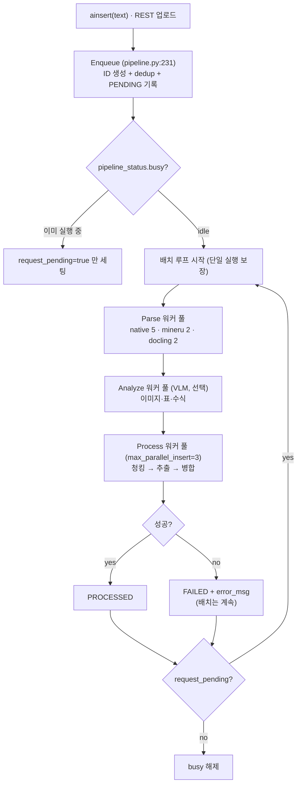

# 03. 수집 파이프라인 & 청킹

> 소스: `lightrag/pipeline.py`(4,753줄), `chunker/`, `parser/`, `chunk_schema.py`

## 1. 수집 상태 머신 — enqueue → parse → analyze → process



### Enqueue (`apipeline_enqueue_documents`, pipeline.py:231-833)

1. ID 생성: 원문이면 `doc-MD5(content)`, 파일이면 `doc-MD5(정규화 경로)`
2. 텍스트 정화 (surrogate·제어문자 제거), RAW 포맷이면 `content_hash` 계산
3. **이중 dedup** (`enqueue_serialize_lock` 안에서): 같은 파일명 basename → FAILED(`duplicate_kind="filename"`), 같은 content_hash → FAILED(`duplicate_kind="content_hash"`). 중복은 `dup-` 접두사 레코드로 남겨 추적 가능
4. `full_docs` upsert + 즉시 flush, `doc_status`에 PENDING 기록, `track_id` 반환

### 처리 루프 (`apipeline_process_enqueue_documents`, pipeline.py:909-1120)

- **단일 실행 보장**: `pipeline_status_lock`으로 `busy` 획득. 동시 호출은 `request_pending`만 세팅 → 현재 배치 끝나면 같은 루프가 이어서 처리
- **크래시 복구**: 시작 시 일관성 검사 — PROCESSING/PARSING 상태로 남은 문서를 PENDING으로 리셋 (멱등 재처리), `full_docs` 없는 status 레코드 정리
- **3단 캐스케이드 큐**: parse(엔진별 풀) → analyze(VLM) → process. 문서별 실패는 FAILED 마킹 후 배치 지속, 스토리지 flush 실패는 배치 중단 + 보류 버퍼 폐기(`drop_pending_index_ops`)

### Process 단계 (`process_single_document`, pipeline.py:1918+)

```
1. 청킹 (process_options의 F/R/V/P 선택자 → 해당 청커 디스패치)
2. 청크 dedup: chunk-MD5(content)가 text_chunks에 이미 있으면 스킵 (filter_keys)
3. text_chunks(KV) + chunks_vdb(임베딩) upsert
4. extract_entities() — [04 문서]
5. merge_nodes_and_edges() — [04 문서]
6. full_entities/full_relations에 문서→엔티티 목록 기록 (삭제 추적)
7. PROCESSED 전이
```

> GraphRAG-SDK와의 대비: SDK는 "문서 단위 2-phase commit"으로 원자성을 보장하고, LightRAG은 "상태 머신 + 멱등 재처리(콘텐츠 해시 dedup)"로 보장한다. LightRAG 방식이 구현이 단순하고, 콘텐츠 해시 덕에 재처리 비용도 낮다.

## 2. 청킹 전략 4종 (F / R / V / P)

호출 계약: 신규 파일-청커 계약 `(tokenizer, content, chunk_token_size, **kwargs)` / 레거시 `chunking_func` 6-인자 계약 공존. 선택자 없으면 레거시 F가 기본.

| | F 고정토큰 | R 재귀구분자 | V 시맨틱벡터 | P 단락시맨틱 |
|---|---|---|---|---|
| 경계 기준 | 토큰 수만 | 구조 구분자 계층 | 문장 임베딩 거리 | 헤딩 구조 + 표 인식 |
| overlap | O (100tok) | O | X (비중첩) | 블록 의존 |
| 비동기 | X | X | **O** (임베딩 콜) | X |
| 입력 요구 | 평문 | 평문 | 평문 + embedding_func | **`.blocks.jsonl` 사이드카** (파서 산출) |
| 기본 크기 | 1200 | 1200 | 1200 | **2000** |

### 2.1 F — `chunking_by_token_size` (`chunker/token_size.py`)

1. 전체를 `tokenizer.encode()` → 토큰 윈도우 슬라이딩 (`chunk_token_size`씩, `size - overlap`만큼 전진)
2. `split_by_character` 지정 시: 문자로 먼저 분할 후, 초과 세그먼트만 토큰 윈도우 재분할 (`_only=True`면 초과 시 에러)
3. **소스 span 추적**: 토큰 윈도우를 문자 오프셋으로 역매핑 (`_token_window_source_span` — BPE가 비연결적이라 prefix 디코딩 + fuzzy 탐색 폴백)

출력 스키마: `{"content", "tokens", "chunk_order_index", "_source_span"?}`

### 2.2 R — `chunking_by_recursive_character` (`recursive_character.py`)

LangChain RecursiveCharacterTextSplitter의 재구현 + span 추적. 구분자 캐스케이드가 **중국어 문장부호 포함**:

```python
DEFAULT_R_SEPARATORS = ("\n\n", "\n", "。", "！", "？", "；", "，", " ", "")
```

토큰 기준 길이 측정(`len(tokenizer.encode(text))`), 작은 조각은 그리디 병합 + overlap. 내부적으로 하드 캡 강제 안 함 — 임베딩 직전 `enforce_chunk_token_limit_before_embedding`이 최종 분할.

> 한국어 적용: 구분자에 한국어 종결부호가 이미 포함된 구조라 그대로 동작. 필요 시 separators 튜플만 교체.

### 2.3 V — `chunking_by_semantic_vector` (`semantic_vector.py`)

1. 문장 분리: `DEFAULT_SENTENCE_SPLIT_REGEX = r"(?<=[.?!])\s+|(?<=[。？！])"` (영어+중국어)
2. 인접 문장 윈도우(buffer_size=1) 임베딩 → 코사인 거리 계산
3. breakpoint 결정: percentile(기본)/standard_deviation/interquartile/gradient 임계
4. 캡 초과 조각은 R(overlap=0)로 재분할. `embedding_func` 없으면 R로 폴백

### 2.4 P — `chunking_by_paragraph_semantic` (`paragraph_semantic.py`, 2,143줄 — 플래그십)

파서가 만든 헤딩 블록 사이드카(`.blocks.jsonl`)를 입력으로 받아 **문서 구조를 보존하며 청킹**. LLM 미사용, 순수 알고리즘. 5단계:

1. **블록 로드**: `{"heading", "level", "content", ...}` 행들 (헤딩 계층 단위)
2. **TableRowSplit**: 캡(`max_token × 0.625`) 초과 표를 **행 경계에서** 분할 (JSON 행 배열·HTML `<tr>` 모두 지원). **헤더 복구**: `.tables.json` 사이드카의 반복 헤더를 모든 분할 조각에 재주입 (헤더 토큰을 예산에서 선차감). 분할 조각에 first/middle/last 역할 태그 → 이후 병합 단계에서 재병합 금지 (헤더 중복 방지)
3. **AnchorSplit**: 캡 초과 텍스트 블록을 짧은 단락(≤100자)을 앵커 삼아 균등 분할, 앵커는 부제목으로 승격. 앵커 없는 밀집 산문은 표 행 분할 → 그리디 패킹 폴백
4. **HeadingGlue**: 본문 없는 헤딩을 첫 하위 블록에 접합 (고아 헤더 방지)
5. **LevelMerge**: 같은 헤딩 경로의 미달 블록 병합(Phase A) → 얕은 블록이 깊은 미달 자손 흡수(Phase B) → 잔여 꼬리(`< max × 0.125`) 흡수

비율 기반 내부 파라미터: 목표 크기 = `max_token × 0.75`, 표 이상 크기 = `× 0.375` 등.

> GraphRAG-SDK의 StructuralChunking(breadcrumb 청킹)의 대폭 강화판. **표 행 분할 + 헤더 재주입**은 표 많은 사내 문서에서 결정적 — 자체 구현 시 P의 이 두 단계만 발췌해도 가치 큼.

### 청크 스키마 (`chunk_schema.py`)

```python
{
  "content": str, "tokens": int, "chunk_order_index": int,
  "heading": {"level": int, "heading": str, "parent_headings": [str]},  # P 전략
  "_source_span": {"start": int, "end": int},      # 원문 오프셋
  "full_doc_id": str, "file_path": str, "timestamp": int,
  "llm_cache_list": [str],                          # 이 청크의 추출 LLM 캐시 키 (삭제 rebuild용)
}
```

`enable_content_headings=True`(기본)면 질의 컨텍스트에 헤딩 경로(`h1 → h2`)가 함께 노출된다.

## 3. 파서 레이어 (개요)

ParserSpec 레지스트리로 엔진 선택 (`parser/registry.py`):

| 엔진 | 대상 | 방식 |
|---|---|---|
| `native` | .docx | 자체 구현 (OMML 수식, 넘버링, 표/그림 추출) |
| `legacy` | 텍스트·코드·오피스 38+ 확장자 | 로컬 단순 추출 |
| `mineru` / `docling` | PDF·이미지·오피스 | 외부 API (캐시 지원) |

파서 산출 = markdown 본문 + **IR 사이드카** (`.blocks.jsonl` 헤딩 블록, `.tables.json` 표+반복헤더, `.drawings.json` 이미지). 표/이미지/수식은 본문에 `<table id=...>`, `<drawing ...>`, `<equation ...>` 태그로 인라인되고, VLM analyze 단계가 이를 설명 텍스트로 치환할 수 있다 (`vlm_process_enable`).

## 4. 자체 구현에 가져갈 것

1. **enqueue/process 분리 + 상태 머신** — 업로드 응답은 즉시(track_id), 처리는 단일 루프가 배치로. `request_pending` 패턴으로 루프 단일성 보장
2. **콘텐츠 해시 청크 dedup** — 문서 수정 시 변하지 않은 청크는 추출 LLM 콜 자체가 발생하지 않음 (증분 비용 최소화의 실체)
3. **P 전략의 표 처리** (행 경계 분할 + 헤더 재주입) 와 **R 전략의 CJK 구분자** — 한국어 문서 청킹의 출발점
4. 사이드카(IR) 설계 — 파싱 산출물(블록/표/이미지)을 본문과 분리 보존하면 청킹·멀티모달·재처리가 모두 단순해짐
