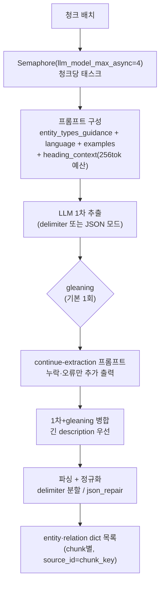

# 04. 추출 & 그래프 병합

> 소스: `lightrag/operate.py` 수집 절반 (extract_entities: 3320-3783, merge: 2000-3313, rebuild: 908-1834)

## 1. extract_entities() — 청크 → 엔티티/관계



### 출력 포맷 — 듀얼 모드

- **delimiter 모드 (기본)**: `entity<|#|>이름<|#|>타입<|#|>설명` / `relation<|#|>src<|#|>tgt<|#|>키워드<|#|>설명` 행 + 종료 마커 `<|COMPLETE|>`. 구분자 오염 복구 로직(`fix_tuple_delimiter_corruption`) 내장
- **JSON 모드** (`entity_extraction_use_json=True`): `{"entities":[...], "relationships":[...]}` — `response_format={"type":"json_object"}` 지원 프로바이더에서 더 안정적, json_repair 폴백

### Gleaning 루프 (논문의 "gleaning" 그대로)

1차 추출 후 `entity_continue_extraction_user_prompt`로 **대화 이어가기** — "이전에 맞게 뽑은 건 다시 내지 말고, 누락·형식오류만". 토큰 가드: (시스템 + 히스토리 + 계속 프롬프트) > 20,480토큰이면 gleaning 스킵. 병합 시 같은 엔티티는 **더 긴 description 채택**, 신규는 추가.

### 정규화 (한국어 관점에서 주목)

`sanitize_and_normalize_extracted_text()` (utils.py:2803):
- 따옴표(영문·중문)·괄호 제거, **CJK 문자 사이 공백 제거**, **전각→반각 변환**
- 순수 숫자 3자 미만, 숫자+점 6자 미만 패턴 필터
- 이름 상한: 256자 / UTF-8 512바이트
- 관계 keywords의 중문 쉼표 `，` → `,` 변환

엔티티 타입은 소문자 정규화. **이름의 대소문자는 유지** (프롬프트가 title case를 지시).

### 추출 단위 데이터

```python
entity   = {entity_name, entity_type, description, source_id(=chunk_key), file_path, timestamp}
relation = {src_id, tgt_id, weight(기본 1.0, LLM이 출력 가능), keywords, description, source_id, file_path, timestamp}
```

### 추출 LLM 캐시

청크 내용+프롬프트 해시를 키로 캐싱 (`{mode}:extract:{hash}`), 캐시 키 목록을 **청크 레코드의 `llm_cache_list`에 저장** — §5의 삭제 rebuild가 이걸 재사용한다. 같은 청크 재처리(재시도·재수집) 시 LLM 콜 0회.

## 2. merge_nodes_and_edges() — 그래프 병합

추출 결과를 이름 단위로 모아 그래프·VDB에 upsert. 엔티티/관계별 keyed lock으로 병렬 처리 (`graph_max_async = llm_max_async × 2`).

### 엔티티 병합 (`_merge_nodes_then_upsert`, operate.py:2000-2327)

1. 기존 노드 조회 (graph의 노드 키 = entity_name)
2. **source_id 병합**: 기존+신규 청크 ID를 순서 보존 dedup → `max_source_ids_per_entity(200)` 상한 적용 (KEEP=오래된 것 유지 / FIFO=최신 유지)
3. entity_type 결정: 다수결 (`Counter`)
4. description 병합: 내용 dedup → (timestamp, -길이) 정렬 → **요약 트리거 판단**:
   - 조각 < 8개(`force_llm_summary_on_merge`) 그리고 총 토큰 < 1200(`summary_max_tokens`) → LLM 없이 `<SEP>` join
   - 초과 → `summarize_entity_descriptions` 프롬프트로 LLM 요약 (목표 600토큰)
   - 12,000토큰(`summary_context_size`) 초과 시 **map-reduce**: 조각을 나눠 부분 요약 → 재귀 결합
5. 그래프 upsert: `{entity_id, entity_type, description, source_id("<SEP>" join), file_path, created_at, truncate}`
6. 엔티티 VDB upsert: id=`ent-MD5(name)`, **임베딩 텍스트 = `"{name}\n{description}"`**

### 관계 병합 (`_merge_edges_then_upsert`, operate.py:2329-2911)

- 무방향 — (src,tgt)/(tgt,src) 양방향 조회
- **weight = 합산** (`sum(new + existing)`) — 여러 청크에서 반복 등장한 관계일수록 무거워짐 → 질의 시 랭킹 신호
- keywords: 쉼표 분리 → set dedup → 정렬 join
- description 병합·요약은 엔티티와 동일
- **누락 endpoint 자동 생성**: 관계가 참조하는 엔티티가 없으면 `entity_type="UNKNOWN"` 노드 생성
- 관계 VDB upsert: id=`rel-MD5(src+tgt)`, **임베딩 텍스트 = `"{keywords}\t{src}\n{tgt}\n{description}"`** — 논문의 "관계 key = 글로벌 테마 키워드" 구현체

> **GraphRAG-SDK와의 핵심 차이**: SDK는 추출 단계에서 resolution 전략(임베딩 ANN + LLM 검증)으로 표기 변형을 병합하지만, LightRAG은 **이름 완전 일치**만 병합한다. 대신 병합 자체는 저렴하고 결정적. 자체 구현은 "LightRAG식 이름 병합 + SDK식 임베딩 resolution을 후처리(finalize)로" 조합이 합리적.

## 3. 설명 병합 정책 비교 (구현 선택지)

| | LightRAG | GraphRAG-SDK |
|---|---|---|
| 누적 | `<SEP>` 구분 누적 | description 최장 1개 유지 |
| 요약 시점 | 병합 중 즉시 (조각 8개↑) | finalize 일괄 |
| 대용량 | map-reduce 요약 | — |
| 장점 | 정보 손실 없음, 질의 시 항상 최신 요약 | 수집 중 LLM 콜 없음 |

LightRAG 방식은 허브 엔티티(수백 청크 등장)에서 요약 콜이 반복 발생할 수 있다 — `force_llm_summary_on_merge`를 높이거나 SDK처럼 지연 요약하는 절충 가능.

## 4. 상한 제어 (운영 안전장치)

- 응답당 추출 상한: 총 100행 / 엔티티 40행 (프롬프트에 명시 — LLM 폭주 방지)
- 엔티티당 source_id 200개, file_path 75개 (초과 시 placeholder)
- 엔티티 이름 256자/512바이트

## 5. 삭제 시 rebuild — `rebuild_knowledge_from_chunks` (operate.py:908-1050)

문서 삭제(`adelete_by_doc_id`) 흐름:

1. 문서의 chunks_list 확보 → 각 청크가 닿는 엔티티/관계 분류:
   - 남은 source가 없음 → 그래프·VDB에서 **완전 삭제**
   - 다른 문서의 청크가 남음 → **rebuild 대상**
2. rebuild: 남은 청크들의 `llm_cache_list`에서 **과거 추출 결과를 캐시로 복원** → 해당 엔티티/관계의 description을 남은 조각만으로 재병합·재요약 → 그래프·VDB 갱신
3. 청크·문서 레코드·LLM 캐시 정리

**재추출 LLM 콜 없이** (캐시 재사용) 삭제 후 일관성을 복구하는 것이 포인트. GraphRAG-SDK의 `source_chunk_ids` 빼기 방식과 목적은 같지만, LightRAG은 description까지 재구성한다는 점에서 더 철저하다.

## 6. 자체 구현에 가져갈 것

1. **gleaning 1회** — 논문 ablation 없이도 업계 표준이 된 패턴. 대화 이어가기 + "누락만 추가" 지시 + 토큰 가드
2. **관계 임베딩 텍스트에 keywords 포함** — high-level 검색의 품질이 여기서 나옴
3. **weight 합산** — 반복 등장 = 중요 관계라는 무료 랭킹 신호
4. **추출 캐시를 청크에 매달기** (`llm_cache_list`) — 재처리·삭제 rebuild·감사가 전부 이 위에 섬. 자체 구현에서 가장 먼저 넣을 인프라
5. 추출 상한(행 수)을 **프롬프트에 명시** — 파서가 아니라 LLM 단에서 폭주를 막는 이중 방어
