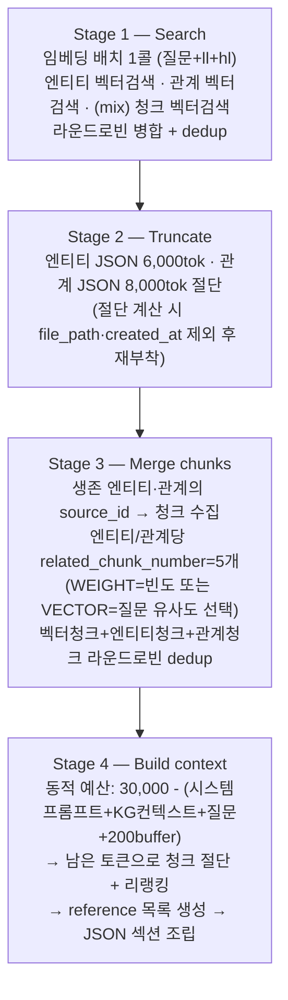

# 05. 질의 파이프라인

> 소스: `lightrag/operate.py` 질의 절반 (kg_query: 3859+, 컨텍스트 구축: 4315-5141), `base.py`(QueryParam), `rerank.py`

## 1. QueryParam — 질의 설정 전체 (`base.py:82-158`)

| 필드 | 기본값 | 의미 |
|---|---|---|
| `mode` | **"mix"** | local / global / hybrid / mix / naive / bypass |
| `top_k` | 40 | 엔티티(local)·관계(global) 검색 수 |
| `chunk_top_k` | 20 | 청크 검색·최종 포함 수 |
| `max_entity_tokens` / `max_relation_tokens` / `max_total_tokens` | 6000 / 8000 / **30000** | 통합 토큰 예산 |
| `hl_keywords` / `ll_keywords` | [] | 키워드 직접 주입 (LLM 추출 생략) |
| `enable_rerank` | True | 청크 리랭킹 |
| `response_type` | "Multiple Paragraphs" | 답변 형식 지시 |
| `conversation_history` / `user_prompt` | [] / None | 멀티턴 / 추가 지시 |
| `only_need_context` / `only_need_prompt` | False | 컨텍스트만 / 프롬프트만 반환 (디버깅·외부 LLM용) |
| `include_references` | False | 인용 목록 포함 |
| `stream` | False | 스트리밍 |

## 2. 질의 모드 6종

| 모드 | 검색 경로 |
|---|---|
| `local` | ll_keywords → **엔티티 벡터검색** → 엔티티의 관계·청크 수집 |
| `global` | hl_keywords → **관계 벡터검색** → 관계의 endpoint 엔티티·청크 수집 |
| `hybrid` | local + global 병렬, 라운드로빈 병합 |
| `mix` (기본) | hybrid + **청크 벡터검색(naive)** 추가 — 3원 병합 |
| `naive` | 청크 벡터검색만 (KG 미사용) |
| `bypass` | 검색 없이 LLM 직행 |

논문의 dual-level: low-level = local, high-level = global, 결합 = hybrid/mix.

## 3. 키워드 추출 (`extract_keywords_only`, operate.py:4156-4255)

- `keywords_extraction` 프롬프트 + `response_format=json_object` LLM 1콜 → `{"high_level_keywords": [...], "low_level_keywords": [...]}`
- 파싱: 마크다운 펜스 제거 → strict JSON → **json_repair 폴백** → 키워드 리스트 정규화 (CSV/개행 문자열도 수용)
- 캐싱: `{mode}:keywords:{hash(query+language+llm)}` 키 — 같은 질문 반복 시 0콜
- 폴백: 둘 다 비고 질문 < 50자 → `ll_keywords = [질문 원문]`, 50자 이상 → fail_response

## 4. 컨텍스트 구축 — 4단계 (`_build_query_context`, operate.py:5024-5141)

핵심 디테일:

- **Stage 1**: local 결과(엔티티 + 그 관계는 (degree, weight) 정렬), global 결과(관계 + endpoint 엔티티)를 **라운드로빈으로 교차 병합** — 한쪽 레벨이 독식하지 않게. `chunk_tracking`에 청크 출처(E/R/C)·빈도·순서 기록
- **Stage 3**: 엔티티의 source_id(청크 목록)에서 청크를 고를 때 `kg_chunk_pick_method="VECTOR"`(기본)면 **질문 임베딩과의 유사도 상위** 선택 — GraphRAG-SDK가 issue #258로 고친 것과 동일한 문제의식
- **Stage 4 동적 예산**: 청크 예산이 고정이 아니라 "총 30K에서 나머지를 뺀 잔여" — 엔티티/관계가 적은 질문은 청크가 그만큼 늘어남. **컨텍스트 총량이 항상 상수로 캡**되는 게 운영상 중요 (비용·지연 예측 가능)

최종 컨텍스트 포맷 (`kg_query_context` 템플릿): 엔티티 JSON 줄 단위 + 관계 JSON + 청크 JSON(`reference_id`, `content_headings` 포함) + Reference Document List. CSV가 아닌 **JSON-lines** — LLM 인용 정확도를 위해.

## 5. 답변 생성

- 시스템 프롬프트: `rag_response` (naive 모드는 `naive_rag_response`) — `{response_type}`, `{user_prompt}`, `{context_data}` 주입
- **인용 내장**: 프롬프트가 청크의 reference_id를 추적해 답변 끝 `### References` 섹션(최대 5개) 생성을 지시 — 후처리 아닌 프롬프트 레벨 인용
- 질의 캐시: mode+질문+파라미터 전체 해시 → 동일 질의 0콜. 스트리밍 응답은 캐시 제외
- 응답 언어: "질문과 같은 언어로" 지시 — 한국어 질문 → 한국어 답변

## 6. 리랭킹 (`rerank.py`)

- 프로바이더: Cohere(rerank-v3.5) / Jina(multilingual) / Aliyun gte-rerank-v2 / generic API
- 적용 지점: Stage 4의 청크 절단 **전** (`process_chunks_unified`) — 절단이 "상위 N"이 되도록
- 긴 문서는 분할 리랭크 후 max 집계, `min_rerank_score`로 컷

## 7. 질의 비용 모델 (기본 mix 모드)

| 연산 | 횟수 |
|---|---|
| LLM 콜 | **2** (키워드 추출 + 답변) — 캐시 히트 시 0~1 |
| 임베딩 콜 | 1 배치 (질문+키워드) |
| 벡터 검색 | 3 (엔티티·관계·청크) |
| 그래프 연산 | degree·이웃 조회 (배치) |
| 리랭크 | 1 (옵션) |

GraphRAG-SDK MultiPath와 비교하면 경로 수는 적지만(SDK: fulltext+CONTAINS+2-hop 추가) LLM 콜 수는 동일(2)하고, **토큰 예산 통합 제어**는 LightRAG에만 있다.

## 8. 자체 구현에 가져갈 것

1. **4단계 분리 (Search→Truncate→Merge→Build)** — 각 단계가 순수 함수에 가깝고 예산 제어 지점이 명확. 검색 파이프라인의 뼈대로 그대로 채택 권장
2. **통합 토큰 예산 + 동적 잔여 배분** — "컨텍스트는 항상 ≤30K"라는 불변식이 비용·지연 SLO의 기반
3. **라운드로빈 병합** — 출처(레벨/경로)별 결과를 교차 배치해 다양성 보장하는 저비용 기법
4. **키워드 직접 주입 옵션** (`hl/ll_keywords`) + `only_need_context` — 검색기와 생성기를 분리 테스트할 수 있는 디버깅 인터페이스
5. 인용을 프롬프트 레벨에서 (reference_id 체계) — 후처리 attribution보다 단순하고 충분히 동작
