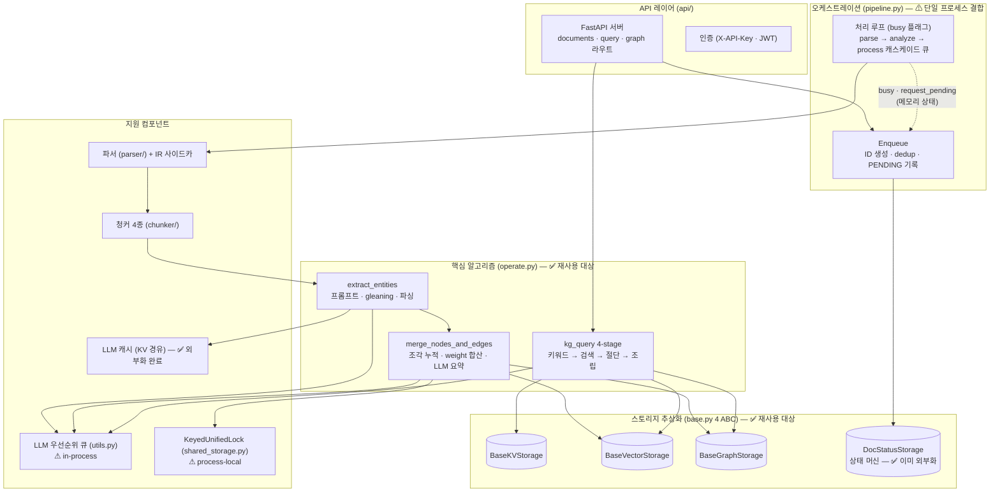
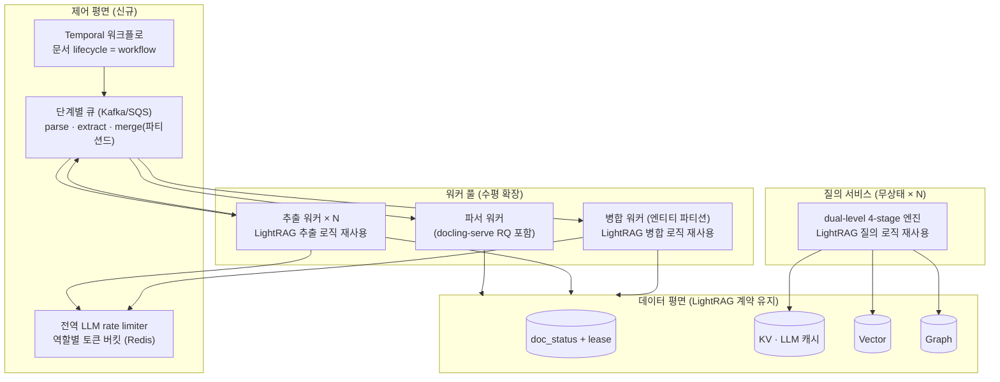

# 07. 소프트웨어 컴포넌트 구조와 분산 플랫폼 재설계 가이드

> 목적: LightRAG의 핵심 기술을 재사용하되 **분산처리 가능한 플랫폼**으로 재구성할 때의 설계 레퍼런스.
> "무엇이 단일 프로세스에 결합돼 있는가 → 무엇으로 교체하는가 → 무엇은 그대로 가져가는가"를 컴포넌트 단위로 정리.

## 1. 소프트웨어 컴포넌트 구조도

핵심 관찰: **데이터 상태는 이미 전부 외부 스토리지에 있고**(doc_status, 콘텐츠 해시 dedup, LLM 캐시, 그래프/벡터), **제어 상태만 프로세스 메모리에 있다**(busy 플래그, 락, LLM 큐, 단계별 asyncio 큐). 분산화 작업의 본질은 "제어 평면의 외부화"이며, 데이터 평면은 손댈 필요가 거의 없다.

## 2. 단일 프로세스 결합점 인벤토리 (교체 대상)

| # | 결합점 | 현재 구현 | 분산 불가 이유 | 교체 설계 |
|---|---|---|---|---|
| 1 | 파이프라인 단일 실행 | `pipeline_status.busy` — asyncio/Manager 메모리 플래그 | 인스턴스 간 비가시 → 다중 워커 시 동시 처리 충돌 | **문서 단위 lease/claim** — doc_status에 `claimed_by, lease_until` 컬럼, 워커가 원자적 UPDATE로 클레임 (SELECT FOR UPDATE SKIP LOCKED 또는 조건부 업데이트) |
| 2 | 단계 캐스케이드 큐 | parse→analyze→process가 asyncio.Queue | 프로세스 내부 큐 | **외부 큐** (SQS/Kafka) — 단계별 토픽, 워커풀 독립 스케일. Temporal을 쓴다면 단계 = activity로 자연 분해 |
| 3 | 엔티티 병합 락 | `KeyedUnifiedLock(entity_name)` — process-local | 두 워커가 같은 엔티티를 동시 병합하면 lost update | 아래 §4 (분산화의 핵심 난제) |
| 4 | LLM 우선순위 큐 | `asyncio.PriorityQueue` in-process | 인스턴스별 독립 큐 → 전역 동시성 제어 불가 | 전역 rate limiter (Redis 토큰 버킷) + 역할별 워커풀. 우선순위(질의>요약>추출) 개념은 큐 분리로 유지 |
| 5 | 배치 커밋 버퍼 | `_pending_*` 버퍼 + `index_done_callback` | 프로세스 메모리 | DB 트랜잭션/벌크 업서트로 대체 (PG라면 자연 해소) |
| 6 | 기본 스토리지 (Json/NetworkX/nano) | 파일 + 단일 writer 전제 | 파일 락 모델 | 외부 백엔드 강제 (PG/OpenSearch 등) — ABC 계약 덕에 코드 변경 없음 |

**이미 분산-친화적인 것** (교체 불필요): doc_status 상태 머신(외부 저장), `doc-/chunk-` 콘텐츠 해시 dedup(전역 유일성), LLM 캐시(외부 KV, 멱등 재처리의 기반), 스토리지 ABC 전체.

## 3. 재사용 / 교체 / 보충 맵

### ✅ 그대로 재사용 (LightRAG의 핵심 가치)

| 자산 | 위치 | 비고 |
|---|---|---|
| 프롬프트 세트 전체 | prompt.py ([06 문서](06-prompts-reference.md)) | `{language}` 파라미터화 포함 |
| KV 프로파일링 — 임베딩 텍스트 조성 | 엔티티 `name\ndesc`, 관계 `keywords\tsrc\ntgt\ndesc` | dual-level 검색의 기반 ([01 문서](01-paper-analysis.md)) |
| 병합 알고리즘 | weight 합산, `<SEP>` 조각 누적, 요약 트리거(8조각/1200tok), map-reduce 요약 | §4에서 분산 버전으로 변형 |
| 질의 4-stage + 통합 토큰 예산 | operate.py ([05 문서](05-query-pipeline.md)) | 질의 측은 무상태라 그대로 수평 확장 가능 |
| 추출 흐름 | gleaning, 듀얼 포맷 파싱, 정규화 필터 | |
| 스토리지 4 ABC × 네임스페이스 | base.py | 자체 백엔드 매핑의 계약으로 |
| 청커 4종 (특히 P의 표 처리) | chunker/ | 순수 함수라 어디서든 실행 가능 |

### 🔄 교체 (제어 평면)

- 오케스트레이션: pipeline.py 루프 → **워크플로 엔진** (이미 운용 중인 Temporal이 적격 — xgram-signal-collector 패턴 그대로: 문서 = workflow, 단계 = activity, 재시도/재개 무료)
- 락·큐·rate limit: §2의 1~5번

### ➕ 보충 (분석에서 확인된 단점)

| 단점 | 보충 설계 | 근거 |
|---|---|---|
| 엔티티 동일성 = 이름 완전 일치 (표기 변형 분열, 교차 언어 미연결) | GraphRAG-SDK식 **임베딩 ANN + LLM 검증 resolution**을 비동기 후처리 잡으로 | [SDK 분석 03 §3](../falkordb-graphrag-sdk/03-extraction-graph-construction.md) |
| 관계/엔티티 타입 무제약 (junk 방어가 프롬프트뿐) | SDK식 **온톨로지 타입 패턴 프루닝**을 추출 후 필터로 | SDK Step 5 `_prune()` |
| 페이지/오프셋 provenance 미전파 | 청크 스키마에 `page_start/end`, `_source_span` 일급화 → 응답까지 전파 | 파서 IR에 재료 이미 존재 |
| 인용이 LLM 생성 (검증 없음) | reference_id 사후 검증 (인용된 id ∈ 제공 목록) | |
| 단일 언어 인스턴스 (`SUMMARY_LANGUAGE` 전역) | 문서별 언어 메타 + 추출 시 언어 라우팅 | KR/US 공시 혼재 요구 |

## 4. 분산화의 핵심 난제 — 병합(merge) 단계

추출은 청크 단위 완전 병렬(공유 상태 없음)이라 자명하게 분산되지만, **병합은 "같은 엔티티"가 동시성 단위**라서 설계 결정이 필요하다. 세 가지 옵션:

**옵션 A — 파티션 라우팅 (권장)**
추출 결과를 `hash(entity_name)` 키로 파티셔닝된 큐(Kafka)에 발행 → 같은 엔티티는 항상 같은 병합 워커가 처리 → **락 자체가 불필요**. 처리량은 파티션 수로 스케일. LightRAG의 keyed lock을 일관 해싱으로 치환하는 것과 등가.

**옵션 B — append-then-compact (LightRAG 구조가 자연 지원)**
LightRAG의 `<SEP>` 조각 누적 구조를 그대로 활용: 병합 워커 없이 **조각을 append-only로 적재**(충돌 없음, 멱등)하고, 주기적 **컴팩션 잡**이 엔티티별로 dedup·요약·임베딩 갱신. 수집 latency는 최고, 검색은 컴팩션 전까지 다소 중복 조각을 봄. LightRAG의 "요약 트리거(8조각)"가 컴팩션 정책으로 변신.

**옵션 C — DB 낙관적 동시성**
그래프 저장소의 조건부 업데이트(버전 컬럼)로 충돌 감지 + 재시도. 구현 단순하나 허브 엔티티(삼성전자류)에서 재시도 폭풍 — 비권장.

A+B 혼합이 실전적: 평시엔 A로 즉시 병합, 백필 대량 적재 시엔 B 모드로 전환.

## 5. 목표 아키텍처 스케치

마이그레이션 경로: ① 질의 서비스 분리(무상태, 즉시 가능) → ② 수집을 Temporal activity로 분해(기존 signal-collector 패턴 재사용) → ③ 병합 파티셔닝 도입 → ④ 보충 기능(resolution·프루닝·provenance)을 비동기 잡으로 추가. 각 단계가 독립 배포 가능하고, 데이터 평면 계약(ABC + 네임스페이스)이 변하지 않아 LightRAG 운영본과 병행 검증이 가능하다.
