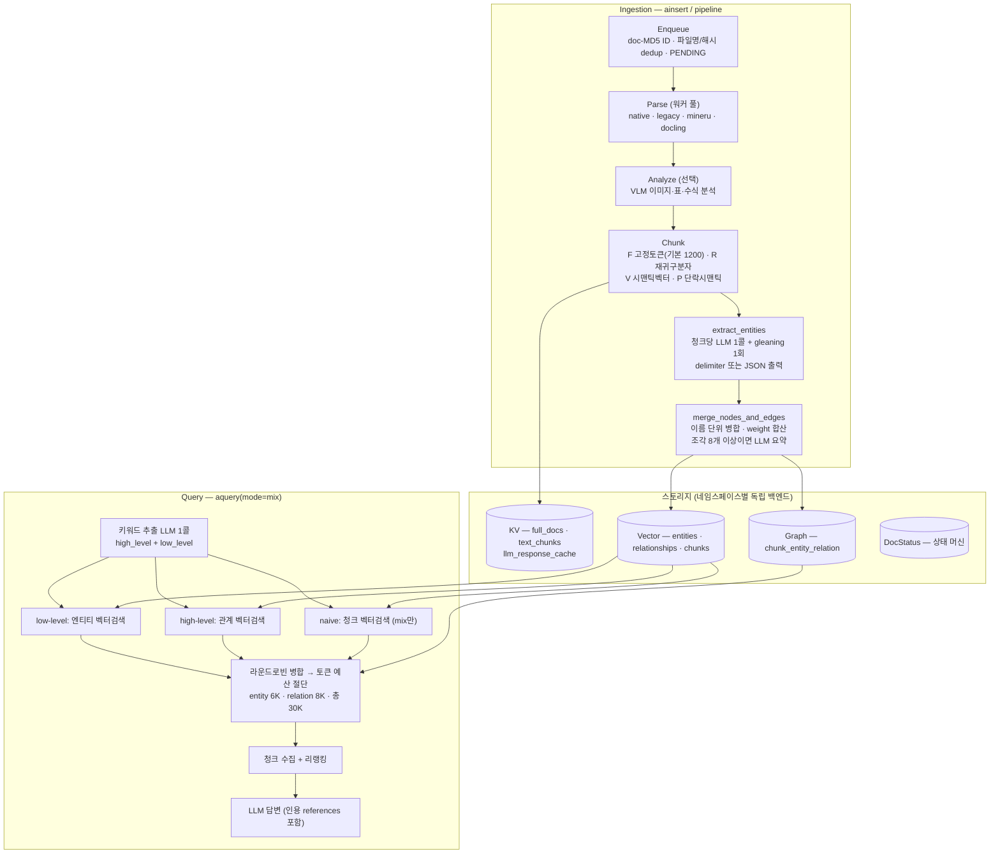

# LightRAG 코드 레벨 분석

> 분석 대상: [HKUDS/LightRAG](https://github.com/HKUDS/LightRAG) (commit `2935d0c`, 2026-06-11 — 분석일 기준 최신)
> 원본 논문: [LightRAG: Simple and Fast Retrieval-Augmented Generation](https://arxiv.org/abs/2410.05779) (EMNLP 2025)
> 분석 방법: repo 클론 후 소스 단위 분석 (`.repos/LightRAG`, 코어 `lightrag/` 약 28,000줄)
> 목적: **자체 RAG 전처리기 구현의 설계 레퍼런스** — [GraphRAG-SDK 분석](../falkordb-graphrag-sdk/README.md)과 쌍을 이룸

LightRAG은 그래프 + 벡터 이중 인덱스 위에 **dual-level retrieval**(구체적 질문은 엔티티에서, 추상적 질문은 관계에서 출발)을 구현한 RAG 프레임워크.
논문 발표 후 1년여 만에 학술 프로토타입에서 프로덕션 시스템(4단계 문서 상태 머신, 4종 청킹 전략, 12개 스토리지 백엔드, 멀티모달)으로 진화했다.

## 문서 구성 (데이터 처리 순서)

| # | 문서 | 다루는 것 |
|---|---|---|
| 1 | [논문 분석](01-paper-analysis.md) | 핵심 아이디어: KV 프로파일링, dual-level retrieval, 증분 갱신, GraphRAG 대비 비용 분석, 평가 결과 |
| 2 | [아키텍처 & 코어](02-architecture-core.md) | LightRAG 클래스 전체 설정값, 스토리지 추상화(4종 ABC × 12 구현체), 동시성 모델, LLM 우선순위 큐 |
| 3 | [수집 파이프라인 & 청킹](03-ingestion-chunking.md) | enqueue→parse→analyze→process 상태 머신, **청킹 전략 4종(F/R/V/P) 알고리즘 상세**, 문서/청크 dedup |
| 4 | [추출 & 그래프 병합](04-extraction-merge.md) | extract_entities(gleaning 루프), 응답 파싱, merge(가중치 합산·설명 병합·LLM 요약 트리거), 삭제 시 rebuild |
| 5 | [질의 파이프라인](05-query-pipeline.md) | 6개 질의 모드, 키워드 추출, 4단계 컨텍스트 구축, 토큰 예산 제어, 리랭킹, LLM 캐시 |
| 6 | [프롬프트 레퍼런스](06-prompts-reference.md) | **전체 프롬프트 원문** (추출·요약·키워드·RAG 응답·멀티모달) |
| 7 | [분산 플랫폼 재설계 가이드](07-distributed-rearchitecture.md) | 컴포넌트 구조도, 단일 프로세스 결합점 인벤토리, 재사용/교체/보충 맵, 병합 분산화 설계 |
| 8 | [약점과 보완 기술·OSS 맵](08-weaknesses-and-complements.md) | 실데이터 검증 약점 6종 → 보완 방법·OSS 매핑 (GraphRAG-SDK·Graphiti·nano-graphrag), 자체 플랫폼 우선순위 |
| — | [기존 개요](analysis.md) | 이전 조사 문서 (high-level 개요) |

## 한눈에 보는 전체 데이터 흐름

## 논문이 주장하는 기술적 차별점 (요약)

1. **Dual-level retrieval** — 질문을 키워드 추출로 low-level(구체적 엔티티)·high-level(추상적 테마)로 분해, 각각 엔티티 벡터·관계 벡터에 매칭. ablation에서 두 레벨 결합이 단일 레벨보다 일관되게 우수
2. **검색 비용**: GraphRAG가 커뮤니티 610개 × 1,000토큰 순회(수백 API 콜)일 때 LightRAG은 키워드 추출 100토큰 미만 + **단일 API 콜**
3. **증분 갱신**: 새 문서를 동일 파이프라인으로 처리 후 그래프 **합집합(union)** — GraphRAG식 커뮤니티 전체 재구축 불필요
4. **평가**: UltraDomain 4개 도메인에서 NaiveRAG 대비 60~85% 승률, GraphRAG 대비 ~50~55% 승률 (GPT-4o-mini judge)

상세 수치·ablation은 [01 문서](01-paper-analysis.md).

## GraphRAG-SDK와의 구조 비교 (자체 구현 관점)

| 축 | LightRAG | GraphRAG-SDK (FalkorDB) |
|---|---|---|
| 저장 모델 | **스토리지 추상화 4종 ABC** — 네임스페이스별 백엔드 자유 조합 (JSON/NetworkX/nano-vectordb 기본, PG/Neo4j/Milvus 등 12종) | FalkorDB 단일 (그래프+벡터+fulltext 통합) |
| 추출 | LLM 단독 (청크당 1콜 + gleaning) — delimiter/JSON 듀얼 포맷 | GLiNER 로컬 NER + LLM 검증 2단계 |
| 엔티티 동일성 | **이름 = ID** (graph 노드 키가 entity_name) — 별도 resolution 없음, 병합은 이름 단위 | `(이름, 타입)` 키 + 4종 resolution 전략 (임베딩 ANN + LLM 검증) |
| 설명 병합 | `<SEP>` 누적 → 조각 8개↑ 또는 1200토큰↑이면 LLM 요약 (map-reduce) | description 최장 유지 + finalize 시 일괄 요약 |
| 관계 표현 | 무방향, weight 합산(반복 등장 = 강한 관계), keywords 필드 | 방향성, 단일 RELATES 타입 + rel_type 속성, fact 임베딩 |
| 검색 | dual-level (엔티티/관계 벡터) + mix 모드, **토큰 예산 통합 제어** | MultiPath 9단계 (엣지 벡터·fulltext·CONTAINS·2-hop) + Text-to-Cypher |
| 증분 갱신 | 문서 상태 머신 + 삭제 시 **LLM 캐시 기반 rebuild** | 2-phase commit + source_chunk_ids union 기반 정리 |
| 언어 | **`{language}` 파라미터가 모든 프롬프트에 내장** — 한국어 출력 설정만으로 가능 | 프롬프트 영어 하드코딩 (패치 필요) |
| 온톨로지 | 없음 (entity_type 가이던스만) | 별도 그래프에 영속화 + 진화 API |

**자체 구현에 가져갈 것 — 두 프로젝트 종합**은 각 문서 말미와 [01 문서 §6](01-paper-analysis.md)에 정리.

## 종합 평가 (엔지니어 관점)

**강점**
- 검색 비용 구조가 우월 — 질의당 LLM 2콜(키워드+답변), 나머지는 벡터 연산. 토큰 예산(30K) 통합 제어로 비용 상한 보장
- `{language}` 파라미터, 다국어 entity name 처리(CJK 공백, 전각 변환), 무방향 관계 등 **한국어 데이터에 GraphRAG-SDK보다 훨씬 친화적**
- 스토리지 추상화가 깨끗해서 (4 ABC × 네임스페이스) 자체 스택(pgvector 등)에 매핑하기 쉬움
- 삭제 시 LLM 캐시에서 추출 결과를 재사용해 rebuild — 재추출 비용 없이 그래프 일관성 유지

**약점/리스크**
- 엔티티 동일성이 "이름 완전 일치" — 표기 변형(삼성전자/삼성電子/Samsung Electronics)이 별도 노드로 분열. GraphRAG-SDK의 임베딩 기반 resolution이 보완재
- 28K 줄로 비대해짐 — API 서버·멀티모달·12개 백엔드가 코어와 한 패키지. 코어 로직(operate.py 6K줄)만 발췌 이식이 현실적
- 커뮤니티 요약 없음(MS GraphRAG 대비) — 추상 질문은 관계 키워드 벡터로 우회하나, 코퍼스 전역 요약 질문엔 한계
- graph 노드 키가 이름이라 rename = 노드 재생성, 동명이인 구분 불가

