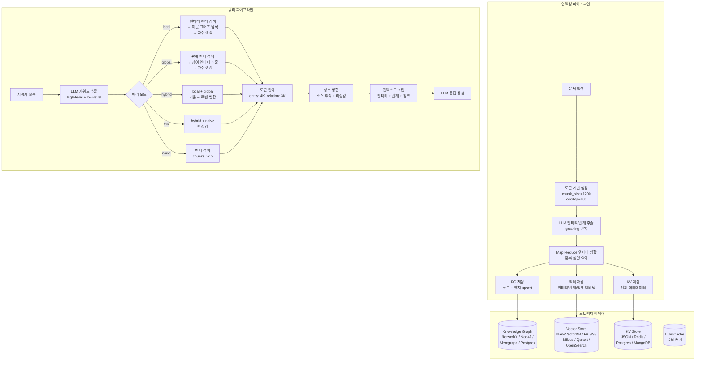
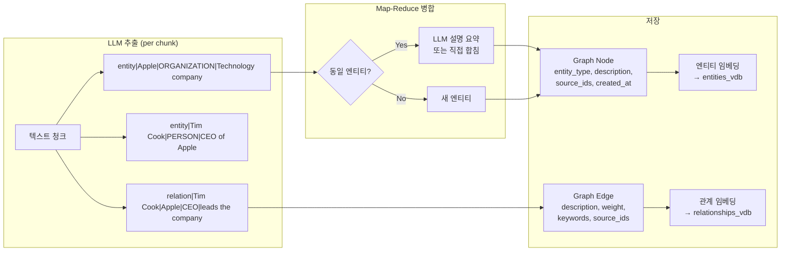
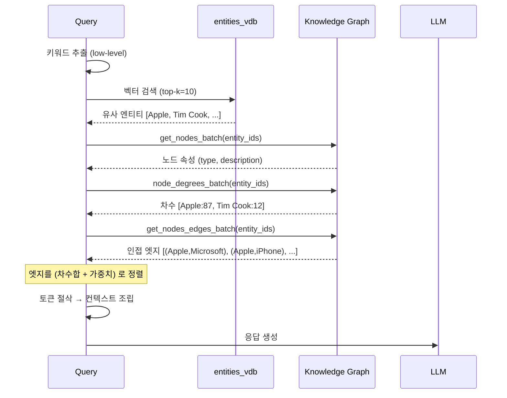
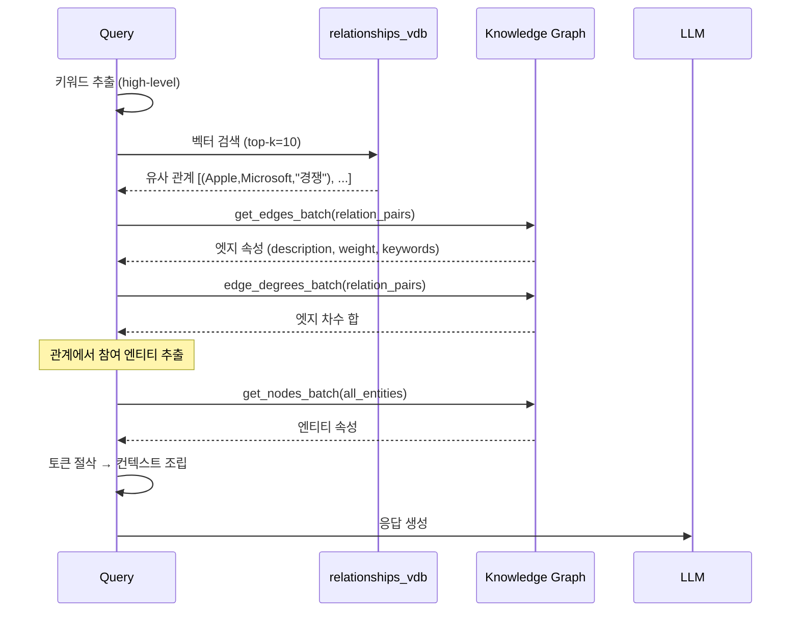

# LightRAG 심층 분석 — Knowledge Graph 기반 하이브리드 RAG 시스템

> **대상**: https://github.com/HKUDS/LightRAG
> **핵심 정의**: 벡터 검색 + 지식 그래프(KG) 탐색을 결합하여 **멀티홉 추론이 가능한 RAG** 시스템
> **출처**: 홍콩대학교 데이터 사이언스 연구실 (HKUDS)
> **라이선스**: MIT
> **언어**: Python (~17K LOC 코어)

---

## 1. 프로젝트 개요

### 1.1 해결하려는 문제

**표준 벡터 RAG 의 두 가지 근본 한계**:

1. **거짓 관련성 (False Relevance)**: 코사인 유사도가 높은 청크가 실제로는 질문과 *의미적으로 무관한* 경우. "Apple 의 매출" 을 물었는데 "사과 농장의 수확량" 청크가 검색되는 류의 문제.

2. **정보 파편화 (Information Fragmentation)**: 답에 필요한 정보가 여러 청크에 흩어져 있어 단일 벡터 검색으로는 모을 수 없는 문제. 예: "A 사의 CEO 가 B 사와 어떤 관계인가?" — A 사 청크와 B 사 청크를 각각 검색해도, 둘 사이의 *관계*는 어디에도 명시적으로 없을 수 있다.

**LightRAG 의 해법**: 문서에서 **엔티티(개체)와 관계(관계)를 LLM 으로 추출** 하여 **지식 그래프(KG)** 를 구축하고, 검색 시 벡터 유사도 + 그래프 탐색을 결합하여 **구조화된 멀티홉 컨텍스트** 를 제공한다.

### 1.2 핵심 컨셉 요약

```
문서 → 청킹 → [LLM: 엔티티/관계 추출] → 지식 그래프 구축 + 벡터 인덱싱
                                             ↓
질문 → [LLM: 키워드 추출] → 5가지 검색 모드 → 토큰 예산 관리 → LLM 응답 생성
```

### 1.3 Microsoft GraphRAG 와의 핵심 차이

| 축 | LightRAG | Microsoft GraphRAG |
|---|---|---|
| **커뮤니티 감지** | ❌ 없음 (단순 KG) | ✅ Leiden 알고리즘 |
| **인덱싱 속도** | 빠름 (스트리밍/증분) | 느림 (전체 전처리) |
| **쿼리 모드** | 5가지 (naive/local/global/hybrid/mix) | 3가지 (local/global/mixed) |
| **리랭킹** | ✅ 모듈러 (Jina/BGE/Cohere) | ❌ LLM 기반 스코어링 |
| **토큰 예산** | 세분화 (엔티티/관계/청크별) | 글로벌 예산 |
| **스토리지** | 10+ 백엔드 (Neo4J, Postgres, Redis, Milvus 등) | 파일 기반 |
| **프로덕션 준비** | REST API, Docker, K8s | 연구용 |

---

## 2. 핵심 특징 및 차별점

### 2.1 하이브리드 검색 — 벡터 + 그래프의 결합

LightRAG 의 가장 핵심적인 차별점. 단순 벡터 검색과 KG 탐색을 **동일한 파이프라인** 에서 결합한다.

- **entities_vdb**: 엔티티 설명의 벡터 인덱스 → "이 질문과 관련된 개체는?"
- **relationships_vdb**: 관계 설명의 벡터 인덱스 → "이 질문과 관련된 관계는?"
- **chunks_vdb**: 원본 텍스트 청크의 벡터 인덱스 → 표준 RAG 와 동일
- **knowledge_graph**: 엔티티 간 관계 그래프 → "이 개체와 연결된 다른 개체는?" (그래프 탐색)

검색 시 벡터로 시작점을 찾고, 그래프로 확장한다.

### 2.2 5가지 쿼리 모드

| 모드 | 설명 | 적합한 질문 |
|------|------|-------------|
| **naive** | 순수 벡터 검색 (청크 기반) | 단순 사실 질문 |
| **local** | 엔티티 벡터 검색 → 이웃 엔티티/관계 탐색 | "X 는 무엇인가?", "X 의 속성은?" |
| **global** | 관계 벡터 검색 → 관련 엔티티 추출 | "X 와 Y 의 관계는?", "이 분야의 트렌드는?" |
| **hybrid** | local + global 동시 실행 → 라운드 로빈 병합 | 복합 질문 |
| **mix** | hybrid + naive 결합 → 리랭킹 | 최고 품질 (가장 느림) |

### 2.3 4-단계 검색 파이프라인

```
Stage 1: 검색 (Search)
  - 벡터 유사도로 엔티티/관계/청크 검색
  - 그래프 탐색으로 이웃 확장
  - 노드 차수(degree) 기반 중요도 랭킹

Stage 2: 토큰 절삭 (Truncation)
  - max_entity_tokens (기본 4000)
  - max_relation_tokens (기본 3000)
  - max_total_tokens (기본 12000)

Stage 3: 청크 병합 (Merge)
  - 검색된 엔티티/관계의 소스 청크를 추적
  - "WEIGHT" (빈도 기반) 또는 "VECTOR" (유사도 기반) 으로 관련 청크 선택
  - 리랭킹 적용 (선택)

Stage 4: 컨텍스트 조립 (Build)
  - 엔티티 + 관계 + 청크를 구조화된 텍스트로 조합
  - 참조 ID 부여 (원문 추적 가능)
  - LLM 프롬프트에 삽입
```

### 2.4 Map-Reduce 엔티티 요약

동일 엔티티가 여러 청크에서 추출되면 설명이 중복된다. LightRAG 는 **Map-Reduce 패턴** 으로 병합:

1. 설명 목록이 `summary_context_size` 이내면 → 직접 합침 (LLM 호출 없음)
2. 넘으면 → 청크로 분할 → 각 청크를 LLM 으로 요약 → 요약 결과를 재귀적으로 병합
3. `force_llm_summary_on_merge` 임계값 (기본 3) 미만이면 LLM 스킵

이 패턴은 **증분 인덱싱** 을 가능하게 한다 — 새 문서가 추가되면 기존 엔티티의 설명에 새 설명을 병합하기만 하면 된다.

### 2.5 노드 차수(Degree) 기반 랭킹

KG 에서 검색된 엔티티를 **그래프 차수** 로 랭킹한다:

```python
# 엔티티 랭킹: 차수가 높을수록 "허브" 개체 → 더 많은 정보를 통합
node_datas.sort(key=lambda x: x["rank"], reverse=True)  # rank = node_degree

# 관계 랭킹: 양쪽 노드의 차수 합 + 엣지 가중치
all_edges_data.sort(key=lambda x: (x["rank"], x["weight"]), reverse=True)
# rank = degree(src) + degree(tgt)
```

**왜 차수가 중요한가**: 높은 차수 = 많은 관계에 참여 = "허브" 개체. "Apple" 이 100개의 관계에 연결되어 있다면, 이 개체는 다양한 맥락을 통합하는 핵심 노드이다.

### 2.6 세분화된 토큰 예산 관리

```python
@dataclass
class QueryParam:
    max_entity_tokens: int = 4000   # 엔티티 컨텍스트 예산
    max_relation_tokens: int = 3000 # 관계 컨텍스트 예산
    max_total_tokens: int = 12000   # 총 LLM 컨텍스트 예산
```

표준 RAG 는 "top-k 청크" 로 예산을 관리하지만, LightRAG 는 **엔티티/관계/청크 각각에 별도 예산** 을 둔다. 이것은 "엔티티 정보는 풍부하게, 관계는 핵심만, 원문은 보조적으로" 같은 세밀한 제어를 가능하게 한다.

### 2.7 모듈러 리랭킹

```python
# rerank.py — 범용 리랭커 API
async def generic_rerank_api(query, documents, model, base_url, top_n):
    # 토큰 초과 시 문서를 sub-chunk 로 분할
    chunked_docs, doc_indices = chunk_documents_for_rerank(
        documents, max_tokens=480, overlap_tokens=32)
    # API 호출 (Jina, Cohere, BGE, Aliyun 등)
    reranked = await api_call(...)
    # sub-chunk 점수를 원본 문서로 집계 (max/mean/first)
    return aggregate_chunk_scores(reranked, doc_indices, aggregation="max")
```

지원 리랭커: Jina Reranker, Cohere, BGE-reranker-v2, Aliyun, 커스텀 API.

---

## 3. 아키텍처 분석

### 3.1 전체 시스템 구조



### 3.2 지식 그래프 구축 흐름



### 3.3 LOCAL 모드 검색 — 엔티티 중심



### 3.4 GLOBAL 모드 검색 — 관계 중심



---

## 4. 기술 스택

| 영역 | 기술 |
|------|------|
| 코어 | Python (async/await 전면) |
| 그래프 스토리지 | NetworkX (기본, 파일), Neo4J, Memgraph, PostgreSQL |
| 벡터 스토리지 | NanoVectorDB (기본, 인메모리), FAISS, Milvus, Qdrant, OpenSearch |
| KV 스토리지 | JSON 파일 (기본), Redis, PostgreSQL, MongoDB |
| LLM | OpenAI, Anthropic, Gemini, Ollama, Bedrock, Azure, Zhipu, lmdeploy, HuggingFace |
| 임베딩 | OpenAI, Jina, HuggingFace, Ollama |
| 리랭킹 | Jina, Cohere, BGE-reranker, Aliyun |
| API | FastAPI + Gunicorn |
| 토크나이저 | tiktoken (o200k_base, cl100k_base) |
| 프론트엔드 | Gradio 기반 WebUI (lightrag_webui/) |

---

## 5. 핵심 코드 분석

### 5.1 스토리지 추상화 (`base.py`)

```python
class BaseVectorStorage(ABC):
    async def query(self, query: str, top_k: int,
                    query_embedding: list[float] = None) -> list[dict]:
        """코사인 유사도 검색. embedding 제공 시 인코딩 스킵."""
    async def upsert(self, data: dict[str, dict]) -> None:
    async def get_by_id(self, id: str) -> dict | None:

class BaseKVStorage(ABC):
    async def get_by_id(self, id: str) -> dict | None:
    async def get_by_ids(self, ids: list[str]) -> list[dict]:
    async def upsert(self, data: dict[str, dict]) -> None:
    async def filter_keys(self, keys: set[str]) -> set[str]:
        """존재하지 않는 키 반환 — 중복 방지."""

class BaseGraphStorage(ABC):
    async def upsert_node(self, node_id: str, node_data: dict) -> None:
    async def upsert_edge(self, src: str, tgt: str, edge_data: dict) -> None:
    async def node_degree(self, node_id: str) -> int:
    async def get_node_edges(self, node_id: str) -> list[tuple[str, str]]:
    async def get_nodes_batch(self, ids: list[str]) -> dict[str, dict]:
    async def get_edges_batch(self, pairs: list) -> dict:
    async def edge_degrees_batch(self, pairs: list) -> dict:
```

**6개의 스토리지 인스턴스** 가 시스템을 구성:
- `entities_vdb`, `relationships_vdb`, `chunks_vdb` (벡터)
- `full_entities`, `full_relations`, `text_chunks` (KV)
- `chunk_entity_relation_graph` (그래프)
- `llm_response_cache` (KV, 선택)

### 5.2 엔티티/관계 추출 (`operate.py`)

```python
# LLM 이 추출한 결과 파싱
def _handle_single_entity_extraction(record_attributes, chunk_key, timestamp):
    """entity<|#|>entity_name<|#|>entity_type<|#|>description 파싱"""
    if len(record_attributes) != 4 or "entity" not in record_attributes[0]:
        return None
    entity_name = sanitize_and_normalize_extracted_text(record_attributes[1])
    entity_type = sanitize_and_normalize_extracted_text(record_attributes[2])
    if "," in entity_type:
        entity_type = entity_type.split(",")[0].strip()  # 첫 번째 타입만
    entity_description = sanitize_and_normalize_extracted_text(record_attributes[3])
    return dict(
        entity_name=entity_name, entity_type=entity_type,
        description=entity_description, source_id=chunk_key,
    )

def _handle_single_relationship_extraction(record_attributes, chunk_key, timestamp):
    """relation<|#|>src<|#|>tgt<|#|>keywords<|#|>description 파싱"""
    if len(record_attributes) != 5 or "relation" not in record_attributes[0]:
        return None
    return dict(
        src_id=sanitize(record_attributes[1]),
        tgt_id=sanitize(record_attributes[2]),
        keywords=record_attributes[3],
        description=sanitize(record_attributes[4]),
        source_id=chunk_key, weight=1.0,
    )
```

### 5.3 LOCAL 검색 — 엔티티 + 이웃 탐색 (`operate.py`)

```python
async def _get_node_data(query, knowledge_graph_inst, entities_vdb, query_param, query_embedding=None):
    # 1. 벡터 유사도로 top-k 엔티티 검색
    results = await entities_vdb.query(query, top_k=query_param.top_k,
                                       query_embedding=query_embedding)
    node_ids = [r["entity_name"] for r in results]

    # 2. 노드 속성 + 차수를 병렬 fetch
    nodes_dict, degrees_dict = await asyncio.gather(
        knowledge_graph_inst.get_nodes_batch(node_ids),
        knowledge_graph_inst.node_degrees_batch(node_ids),
    )

    # 3. 인접 엣지 검색
    batch_edges_dict = await knowledge_graph_inst.get_nodes_edges_batch(node_ids)

    # 4. 엣지를 (차수합, 가중치) 로 정렬
    all_edges_data = sorted(
        all_edges_data,
        key=lambda x: (x["rank"], x["weight"]),  # rank = degree(src) + degree(tgt)
        reverse=True
    )[:query_param.top_k]

    return node_datas, all_edges_data
```

### 5.4 Map-Reduce 엔티티 요약 (`operate.py`)

```python
async def _handle_entity_relation_summary(description_list, global_config):
    """여러 청크에서 추출된 동일 엔티티의 설명을 Map-Reduce 로 병합"""
    if len(description_list) < force_llm_summary_on_merge and total_tokens < summary_max_tokens:
        return separator.join(description_list), False  # LLM 없이 합침

    # Map: 설명을 context_size 이내 청크로 분할
    chunks = split_descriptions_into_chunks(description_list, summary_context_size)

    # Reduce: 각 청크를 LLM 으로 요약
    new_summaries = []
    for chunk in chunks:
        if len(chunk) == 1:
            new_summaries.append(chunk[0])
        else:
            summary = await _summarize_descriptions(chunk, global_config)
            new_summaries.append(summary)

    # 재귀: 요약 결과가 아직 크면 다시 Map-Reduce
    return await _handle_entity_relation_summary(new_summaries, global_config)
```

### 5.5 쿼리 모드 라우팅 (`operate.py`)

```python
async def _perform_kg_search(query, ll_keywords, hl_keywords, ...):
    # 임베딩 사전 계산 (query, low-level, high-level 동시)
    all_embeddings = await embedding_func(
        [q for q in [query, ll_keywords, hl_keywords] if q], _priority=5)

    mode = query_param.mode
    if mode == "local" and ll_keywords:
        local_entities, local_relations = await _get_node_data(ll_keywords, ...)
    elif mode == "global" and hl_keywords:
        global_relations, global_entities = await _get_edge_data(hl_keywords, ...)
    elif mode in ("hybrid", "mix"):
        # local + global 동시 실행
        local_entities, local_relations = await _get_node_data(ll_keywords, ...)
        global_relations, global_entities = await _get_edge_data(hl_keywords, ...)
        if mode == "mix" and chunks_vdb:
            vector_chunks = await _get_vector_context(query, chunks_vdb, ...)

    # 라운드 로빈 병합 (local + global 인터리브)
    final_entities = round_robin_merge(local_entities, global_entities)
    return {"final_entities": final_entities, "final_relations": final_relations, ...}
```

### 5.6 토큰 예산 절삭 (`operate.py`)

```python
async def _apply_token_truncation(search_result, query_param, global_config):
    tokenizer = global_config["tokenizer"]

    # 엔티티 컨텍스트를 토큰 예산으로 절삭
    truncated_entities = truncate_list_by_token_size(
        entities_context,
        key=lambda x: f"{x['entity']} {x['type']} {x['description']}",
        max_token_size=query_param.max_entity_tokens,  # 기본 4000
        tokenizer=tokenizer,
    )
    # 관계 컨텍스트도 동일하게 절삭
    truncated_relations = truncate_list_by_token_size(
        relations_context,
        max_token_size=query_param.max_relation_tokens,  # 기본 3000
        tokenizer=tokenizer,
    )
    return {"entities_context": truncated_entities, "relations_context": truncated_relations, ...}
```

### 5.7 캐싱 전략 (`lightrag.py`)

```python
# LLM 응답 캐시
if enable_llm_cache:
    cache_key = compute_args_hash(
        mode, query, top_k, chunk_top_k,
        max_entity_tokens, max_relation_tokens, max_total_tokens,
        hl_keywords, ll_keywords, enable_rerank
    )
    cached_result = await handle_cache(hashing_kv, cache_key, ...)
    if cached_result:
        return cached_response

# 임베딩 캐시 (선택)
embedding_cache_config = {
    "enabled": False,
    "similarity_threshold": 0.95,
    "use_llm_check": False,
}

# 엔티티 추출 캐시 (재인덱싱 시 LLM 재호출 방지)
if enable_llm_cache_for_entity_extract:
    # 청크별 추출 결과를 캐시
```

---

## 6. API 및 인터페이스

### 6.1 Python API

```python
from lightrag import LightRAG, QueryParam

rag = LightRAG(
    working_dir="./my_index",
    llm_model_func=openai_complete_if_cache,
    embedding_func=openai_embedding,
    graph_storage="NetworkXStorage",     # 또는 "Neo4JStorage"
    vector_storage="NanoVectorDBStorage", # 또는 "MilvusStorage"
    kv_storage="JsonKVStorage",           # 또는 "RedisKVStorage"
)

# 인덱싱
await rag.ainsert("Document text here...")
await rag.ainsert_file("path/to/document.pdf")

# 쿼리
result = await rag.aquery(
    "Apple 과 Microsoft 의 관계는?",
    param=QueryParam(mode="hybrid", top_k=10, enable_rerank=True),
)
```

### 6.2 REST API (`api/lightrag_server.py`)

| Endpoint | Method | 설명 |
|----------|--------|------|
| `/documents` | POST | 문서 인덱싱 |
| `/query` | POST | 검색 + 응답 생성 |
| `/query/stream` | POST | 스트리밍 응답 |
| `/graphs` | GET | KG 노드/엣지 조회 |
| `/documents/{id}` | DELETE | 문서 삭제 (KG 도 업데이트) |
| `/health` | GET | 헬스 체크 |

---

## 7. 확장성 및 플러그인

| 확장 축 | 매커니즘 |
|---------|----------|
| **그래프 스토리지** | `BaseGraphStorage` 구현 (15개: NetworkX, Neo4J, Memgraph, Postgres 등) |
| **벡터 스토리지** | `BaseVectorStorage` 구현 (7개: NanoVectorDB, FAISS, Milvus, Qdrant, OpenSearch 등) |
| **KV 스토리지** | `BaseKVStorage` 구현 (5개: JSON, Redis, Postgres, MongoDB 등) |
| **LLM** | 함수 기반 (12개: OpenAI, Anthropic, Gemini, Ollama, Bedrock 등) |
| **임베딩** | 함수 기반 (OpenAI, Jina, HuggingFace, Ollama 등) |
| **리랭커** | 함수 기반 (Jina, Cohere, BGE, Aliyun 등) |
| **엔티티 타입** | 설정 가능 (`entity_types` 파라미터) |

---

## 8. 성능 특성

### 8.1 인덱싱

- **청크 크기**: 기본 1200 토큰, 오버랩 100 토큰
- **병렬 처리**: `priority_limit_async_func_call` 로 LLM 호출 동시성 제한
- **증분 인덱싱**: 새 문서 추가 시 기존 KG 에 merge (전체 재인덱싱 불필요)
- **Map-Reduce 요약**: 큰 엔티티도 재귀 요약으로 처리

### 8.2 쿼리

| 모드 | LLM 호출 | 벡터 검색 | 그래프 탐색 | 상대 지연 |
|------|----------|-----------|-------------|-----------|
| naive | 1 (응답) | 1 (chunks) | 없음 | 가장 빠름 |
| local | 1 (키워드) + 1 (응답) | 1 (entities) | 이웃 탐색 | 보통 |
| global | 1 (키워드) + 1 (응답) | 1 (relations) | 엔티티 추출 | 보통 |
| hybrid | 1 (키워드) + 1 (응답) | 2 (entities + relations) | 이웃 + 추출 | 느림 |
| mix | 1 (키워드) + 1 (응답) + 리랭킹 | 3 (entities + relations + chunks) | 이웃 + 추출 | 가장 느림 |

### 8.3 스케일링 특성

- **NetworkX (기본)**: 인메모리 → <100K 노드 적합. 파일 직렬화 (GraphML).
- **Neo4J / Memgraph**: 수백만 노드 지원. 프로덕션 권장.
- **NanoVectorDB (기본)**: 인메모리 → <100K 벡터 적합.
- **Milvus / Qdrant**: 수백만 벡터 지원. 프로덕션 권장.

---

## 9. 배포 및 운영

- **로컬**: `python -m lightrag` (NetworkX + NanoVectorDB, 외부 의존 없음)
- **Docker**: `docker-compose.yml` (Neo4J + Milvus/Qdrant + Redis)
- **K8s**: `k8s-deploy/` 매니페스트
- **설정**: `config.ini` 또는 환경변수
- **인증**: API 키 기반 (Bearer token)

---

## 10. 경쟁/비교 분석

### 10.1 vs 표준 벡터 RAG (LangChain, LlamaIndex)

| 축 | LightRAG | 표준 벡터 RAG |
|---|---|---|
| **검색 방식** | 벡터 + KG 탐색 | 벡터만 |
| **멀티홉 추론** | ✅ 그래프 이웃 탐색 | ❌ 단일 검색 |
| **엔티티 해석** | ✅ 구조화된 엔티티/관계 | ❌ 비구조화 청크 |
| **토큰 예산** | 세분화 (엔티티/관계/청크별) | 단순 (top-k) |
| **증분 업데이트** | ✅ Map-Reduce merge | 전체 재인덱싱 |
| **인덱싱 비용** | 높음 (LLM 추출 필요) | 낮음 (임베딩만) |

### 10.2 vs Microsoft GraphRAG

| 축 | LightRAG | GraphRAG |
|---|---|---|
| **커뮤니티 감지** | ❌ 없음 | ✅ Leiden 알고리즘 |
| **인덱싱** | 증분 가능 | 전체 전처리 필수 |
| **쿼리 모드** | 5가지 | 3가지 |
| **리랭킹** | ✅ 모듈러 | ❌ |
| **토큰 예산** | 세분화 | 글로벌 |
| **스토리지** | 10+ 백엔드 | 파일 기반 |
| **프로덕션** | REST API, Docker, K8s | 연구용 |
| **지연** | 낮음 (커뮤니티 없음) | 높음 (커뮤니티 계산) |
| **멀티홉 정확도** | 좋음 | 우수 (커뮤니티 기반) |

### 10.3 vs WrenAI / DB-GPT (Text-to-SQL)

완전히 다른 도메인. LightRAG 는 **비구조화 문서에서 지식을 추출하고 검색** 하는 것이고, WrenAI/DB-GPT 는 **구조화된 데이터베이스에 SQL 을 생성** 하는 것.

그러나 **KG 구축 패턴** 은 공유 가능: WrenAI 의 MDL 이 "수동으로 정의한 시맨틱 레이어" 라면, LightRAG 의 KG 는 "LLM 이 자동으로 구축한 시맨틱 레이어" 라고 볼 수 있다.

---

## 11. 종합 평가

### 강점

1. **KG + 벡터의 우아한 결합**: "벡터로 시작점 찾기 → 그래프로 확장" 패턴이 멀티홉 질문에서 표준 RAG 대비 월등한 성능을 보인다. Microsoft GraphRAG 보다 구현이 간결하면서도 실전 성능은 비슷하다.

2. **5가지 쿼리 모드**: 질문 유형에 따라 최적 모드를 선택할 수 있다. naive(단순) → local(개체 중심) → global(관계 중심) → hybrid(결합) → mix(최고 품질). 이런 세밀한 제어를 제공하는 RAG 는 드물다.

3. **증분 인덱싱**: Map-Reduce 엔티티 병합 덕분에 새 문서를 추가할 때 전체 KG 를 재구축할 필요가 없다. GraphRAG 의 가장 큰 약점(전체 전처리)을 해결.

4. **세분화된 토큰 예산**: 엔티티/관계/청크 각각에 별도 예산을 두는 것은 "어떤 종류의 정보를 더 많이 넣을지" 를 제어할 수 있게 해준다.

5. **10+ 스토리지 백엔드**: NetworkX(개발) → Neo4J(프로덕션) 전환이 설정 변경만으로 가능. 벡터/KV 도 마찬가지.

6. **노드 차수 기반 랭킹**: "많은 관계에 참여하는 허브 개체가 더 중요하다" 는 직관적이면서도 효과적인 휴리스틱.

### 약점/리스크

1. **인덱싱 비용**: 모든 청크에 대해 LLM 으로 엔티티/관계를 추출해야 한다. 10만 페이지 문서면 LLM 비용이 상당하다. 표준 벡터 RAG (임베딩만) 대비 10-100배.

2. **추출 품질 의존**: KG 의 품질이 LLM 의 엔티티/관계 추출 정확도에 전적으로 의존한다. "잘못된 관계" 가 KG 에 들어가면 검색 결과가 오히려 나빠질 수 있다.

3. **커뮤니티 감지 없음**: GraphRAG 의 Leiden 알고리즘은 "토픽 클러스터" 를 자동으로 감지하여 글로벌 질문에 강하다. LightRAG 는 이것이 없어서 "이 문서 전체의 주요 주제가 뭐야?" 같은 질문에는 GraphRAG 보다 약할 수 있다.

4. **그래프 규모 한계**: NetworkX 기본 모드는 인메모리 → 대규모 문서에 부적합. Neo4J 로 전환해야 하는데, 추가 인프라 비용.

5. **단일 호스트**: 분산 인덱싱/검색은 지원하지 않는다. 스토리지 백엔드가 분산(Milvus, Neo4J)이어도 파이프라인 자체는 단일 프로세스.

### 적합 사례

- 기업 지식 베이스 (사내 문서 + 관계 추출)
- 법률/의료/금융 문서 분석 (엔티티 간 관계가 중요한 도메인)
- 멀티홉 QA 가 필요한 연구
- 기존 벡터 RAG 의 정확도가 부족한 경우

### 부적합 사례

- 실시간 대화 (인덱싱 지연이 수 초~분)
- 구조화된 데이터 쿼리 (→ WrenAI/DB-GPT)
- LLM 비용이 극도로 제한된 환경
- 매우 대규모 문서 (수십만 페이지) + 빈번한 업데이트

---

## 12. 엔지니어 관점 인사이트

### 12.1 "벡터로 시작, 그래프로 확장" 은 범용 패턴이다

LightRAG 의 핵심 알고리즘 — "벡터 유사도로 시작점 찾기 → 그래프 이웃으로 컨텍스트 확장" — 은 RAG 뿐 아니라 **에이전트 메모리** 에도 적용 가능하다. GoClaw 의 L2 KG 메모리나 DB-GPT 의 InsightExtractor 가 이 방향을 향하고 있다.

### 12.2 "Map-Reduce 엔티티 병합" 은 증분 KG 구축의 핵심

GraphRAG 의 최대 약점(전체 재인덱싱)을 해결하는 패턴. 새 문서에서 "Apple" 이 또 나오면 기존 "Apple" 설명에 새 설명을 LLM 으로 병합하기만 하면 된다. 이 패턴은 **에이전트의 장기 메모리** 에도 직접 적용할 수 있다 — "사용자에 대한 새로운 정보" 를 기존 메모리와 LLM 으로 병합.

### 12.3 "토큰 예산의 세분화" 는 컨텍스트 품질의 열쇠

표준 RAG 의 "top-k 청크" 는 너무 조잡하다. LightRAG 처럼 엔티티/관계/청크에 별도 예산을 두면, "구조화된 지식(엔티티/관계)을 충분히 주되, 원문은 보조적으로" 같은 전략이 가능하다. 이것은 에이전트의 시스템 프롬프트 설계에도 적용할 수 있다.

### 12.4 "노드 차수 = 중요도" 는 간단하지만 강력하다

PageRank 같은 복잡한 알고리즘 없이도, 단순 차수(degree)만으로 "허브 개체" 를 식별하는 것은 실전에서 매우 효과적이다. 에이전트 메모리에서 "자주 언급되는 개념" 을 우선시하는 것과 같은 원리.

### 12.5 이전 분석 프로젝트와의 연결

| LightRAG 패턴 | 유사 패턴이 있는 프로젝트 |
|---------------|--------------------------|
| KG + 벡터 하이브리드 검색 | GoClaw: L0(벡터) + L2(KG) 메모리 |
| Map-Reduce 엔티티 병합 | DB-GPT: AgentMemory ImportanceScorer |
| 토큰 예산 세분화 | GoClaw: Budget Nudge 70%/90% |
| 다중 쿼리 모드 | GoClaw: 5 쿼리 모드 (LightRAG 와 독립적으로 같은 수!) |
| 모듈러 리랭킹 | WrenAI: (없음), DB-GPT: RAG retriever |
| 스토리지 추상화 | DB-GPT: 5 벡터 스토어, WrenAI: Qdrant 단일 |
