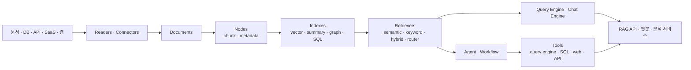

# LlamaIndex 유즈케이스와 활용 방식

## 요약

LlamaIndex는 단순한 "인덱스 라이브러리"가 아니라 **내 데이터로 LLM 애플리케이션을 만드는 오픈소스 프레임워크**다. 문서, DB, API, 웹, SaaS에서 데이터를 가져오고, 이를 `Document`/`Node`/`Index`/`Retriever`/`Query Engine`/`Agent` 같은 추상화로 연결한다.

한 줄로 보면 다음과 같다.

```text
LlamaIndex = RAG와 에이전트 앱을 만들기 위한 데이터 연결 · 인덱싱 · 검색 · 질의 · 도구 호출 SDK
```

Docling이 "문서를 잘 읽는 파서"라면, LlamaIndex는 "읽은 데이터를 LLM 앱으로 연결하는 프레임워크"다. RAGFlow처럼 완성된 제품형 UI 플랫폼도 아니고, LightRAG처럼 특정 GraphRAG 엔진도 아니다. 개발자가 Python/TypeScript 코드로 원하는 RAG/agent 파이프라인을 조립하는 도구에 가깝다.



## 왜 필요한가

LLM API만 직접 쓰면 다음 문제가 생긴다.

- 사내 문서나 DB 내용을 모델이 모른다.
- 모든 문서를 프롬프트에 넣을 수 없다.
- PDF, DB, API, vector DB, reranker, citation, tool call을 매번 직접 연결해야 한다.
- 질문에 따라 "어떤 데이터 소스를 찾아야 하는지"를 판단하는 로직이 필요하다.
- 단순 Q&A를 넘어 여러 단계의 검색, 요약, 추출, 검증, 도구 호출이 필요해진다.

LlamaIndex는 이 반복 구현을 줄여준다. 핵심은 "LLM에게 필요한 context를 찾아서 넣어주는 계층"이다.

## 핵심 개념을 예시로 이해하기

### 1. `Document`

외부 데이터를 LlamaIndex 안으로 가져온 원문 단위다.

예를 들어 `/reports/2025_Q4.pdf`를 읽으면 내부적으로 이런 개념이 된다.

```text
Document(
  text="2025년 4분기 매출은 ...",
  metadata={"file_name": "2025_Q4.pdf", "source": "ir_report"}
)
```

### 2. `Node`

검색 가능한 chunk 단위다. 긴 문서를 그대로 임베딩하지 않고, 문단/섹션/표 단위로 쪼갠다.

```text
Node(
  text="영업이익은 전년 대비 12% 증가...",
  metadata={"page": 12, "section": "손익 분석"}
)
```

### 3. `Index`

Node를 검색 가능한 구조로 만든 것이다. 가장 흔한 것은 `VectorStoreIndex`다. 하지만 summary index, keyword index, property graph index, SQL index 등도 있다.

### 4. `Retriever`

사용자 질문에 맞는 Node를 가져오는 컴포넌트다. vector similarity, BM25, hybrid retrieval, router retrieval, recursive retrieval 등을 조합할 수 있다.

### 5. `Query Engine`

Retriever가 찾은 context를 LLM에 넣고 최종 답변을 만드는 인터페이스다.

### 6. `Agent`와 `Workflow`

질문 하나에 검색 한 번으로 끝나지 않을 때 쓴다. Agent는 어떤 tool을 쓸지 LLM이 결정하는 루프이고, Workflow는 여러 단계를 이벤트 기반으로 명시적으로 연결하는 방식이다.

## 가장 단순한 유즈케이스: 사내 문서 Q&A

### 문제

"우리 회사 제품 매뉴얼과 정책 문서에 대해 질문하면 답해주는 API를 만들고 싶다."

### LlamaIndex 사용 방식

```python
from llama_index.core import VectorStoreIndex, SimpleDirectoryReader

documents = SimpleDirectoryReader("./docs").load_data()
index = VectorStoreIndex.from_documents(documents)
query_engine = index.as_query_engine()

response = query_engine.query("환불 정책에서 예외 조항은 뭐야?")
print(response)
```

이 코드가 하는 일은 다음과 같다.

```text
./docs 파일 로딩
-> Document 생성
-> chunk/Node 생성
-> embedding 생성
-> vector index 구성
-> 질문 embedding
-> 관련 chunk 검색
-> LLM 답변 생성
```

직접 구현한다면 파일 로딩, 청킹, 임베딩, vector DB 저장, top-k 검색, 프롬프트 구성, 답변 합성을 모두 만들어야 한다. LlamaIndex는 이 기본 파이프라인을 추상화한다.

## 유즈케이스 1: RAG 기반 문서 검색/질의응답

가장 대표적인 사용 사례다.

| 예시 | 설명 |
|---|---|
| 제품 매뉴얼 Q&A | 사용자가 "에러 코드 E21 해결법"을 물으면 관련 매뉴얼 chunk를 찾아 답변 |
| 법무/계약 검토 | 계약 조항, 정책, 판례 문서를 검색해 근거와 함께 요약 |
| 금융 리포트 검색 | 증권사 리포트/공시 문서에서 특정 기업, 지표, 기간 관련 근거 검색 |
| 기술 문서 어시스턴트 | 개발 문서와 ADR을 검색해 "이 API는 왜 deprecated됐나" 답변 |

이때 LlamaIndex는 문서 parser 자체보다 **검색 파이프라인과 질의 인터페이스**가 중심이다. 복잡한 PDF는 Docling이나 LlamaParse 같은 parser를 앞단에 붙이고, LlamaIndex는 그 결과를 인덱싱한다.

## 유즈케이스 2: 여러 데이터 소스를 라우팅하는 Q&A

### 문제

사용자 질문이 어떤 데이터에 관한 것인지 매번 다르다.

- "A사 2025년 매출 가이던스는?" → 공시/리포트 검색
- "A사 최근 주가는?" → 시세 API
- "A사 매출총이익률 추이는?" → 재무 DB/SQL
- "A사에 대한 내부 투자 메모는?" → 내부 문서 검색

단일 vector index만으로는 부족하다.

### LlamaIndex 활용

각 데이터 소스를 query engine 또는 tool로 만들고, router나 agent가 적절한 도구를 고르게 한다.

```text
사용자 질문
  -> RouterQueryEngine 또는 Agent
  -> 리포트 RAG / 공시 RAG / SQL query engine / 외부 API tool 중 선택
  -> 결과 통합
  -> 답변 생성
```

예시 구조:

```python
report_engine = report_index.as_query_engine()
filing_engine = filing_index.as_query_engine()
financial_sql_engine = sql_index.as_query_engine()

# 각 engine을 Tool로 감싼 뒤 router/agent가 선택하게 구성
```

여기서 LlamaIndex의 가치는 "질문을 보고 어느 retriever/query engine/tool을 쓸지 결정하는 추상화"다.

## 유즈케이스 3: 챗봇

문서 Q&A와 비슷하지만 대화 이력이 중요하다.

예를 들어 사용자가 다음처럼 묻는다.

```text
사용자: A사 2025년 CapEx 계획 알려줘.
사용자: 그게 작년 대비 늘어난 거야?
사용자: 근거 문단도 보여줘.
```

두 번째 질문의 "그게"는 이전 질문의 A사 CapEx를 가리킨다. LlamaIndex의 chat engine은 대화 이력을 고려해 질문을 재작성하거나, retrieval context와 함께 답변을 만든다.

적합한 사례:

- 고객지원 챗봇
- 내부 지식 챗봇
- 리서치 어시스턴트
- 문서 기반 코파일럿

## 유즈케이스 4: 구조화 데이터 추출

### 문제

문서에서 특정 필드를 뽑아 DB에 저장하고 싶다.

예:

```text
기업 공시 PDF
-> 회사명, 보고기간, 매출, 영업이익, 리스크 요인, 주요 계약 정보 추출
-> JSON으로 저장
```

LlamaIndex는 LLM structured output, Pydantic 모델, extraction pipeline과 결합해 문서에서 구조화 데이터를 뽑는 흐름을 만들 수 있다.

단, PDF 표 인식이나 layout 복원은 Docling 같은 parser가 더 적합하고, LlamaIndex는 그 결과를 받아 추출/검증/저장하는 orchestration 쪽이 강하다.

## 유즈케이스 5: SQL + 문서 혼합 질의

### 문제

정량 데이터는 DB에 있고, 설명/근거는 문서에 있다.

예:

```text
"A사의 2025년 영업이익률이 하락한 이유를 수치와 리포트 근거로 설명해줘."
```

이 질문은 두 종류의 데이터가 필요하다.

- SQL/warehouse: 매출, 영업이익, 마진 계산
- 문서 RAG: 경영진 코멘트, 애널리스트 리포트, 공시 주석

LlamaIndex에서는 SQL query engine과 document query engine을 각각 만들고, agent나 workflow가 순서대로 호출하게 할 수 있다.

```text
질문
  -> SQL tool로 지표 계산
  -> 문서 RAG tool로 원인/근거 검색
  -> LLM이 수치와 근거를 합성
```

이런 형태는 금융 서비스에서 특히 현실적이다.

## 유즈케이스 6: 에이전트가 RAG를 도구로 사용

LlamaIndex에서 RAG는 agent가 쓸 수 있는 여러 tool 중 하나가 될 수 있다.

예를 들어 "A사 실적 발표 후 투자 메모 초안 작성" 에이전트는 다음 순서로 동작할 수 있다.

```text
1. 공시 RAG에서 실적 발표 자료 검색
2. 리포트 RAG에서 애널리스트 의견 검색
3. SQL tool로 재무 지표 계산
4. 웹 검색 tool로 최신 뉴스 확인
5. 초안 작성
6. 근거 부족한 부분 재검색
```

LlamaIndex의 agent/workflow는 이런 tool 호출 흐름을 코드로 구성할 수 있게 한다.

## 유즈케이스 7: 고급 검색 전략 실험

단순 vector top-k 검색만으로 부족할 때가 많다.

LlamaIndex 예제와 모듈은 다음 검색 전략을 지원한다.

- BM25 keyword retrieval
- vector retrieval
- hybrid retrieval
- reciprocal rank fusion
- router retriever
- recursive retriever
- auto-merging retriever
- query transformation
- HyDE
- sub-question query engine
- reranker/postprocessor
- property graph retrieval

이런 기능은 "RAG 품질 개선 실험을 빠르게 해보는 SDK"로 LlamaIndex를 쓰게 만드는 큰 이유다.

## 금융 서비스 예시: 리포트/공시 분석 어시스턴트

### 목표

증권사 리포트, 기업 공시, 재무 DB를 연결해 다음 질문에 답하는 서비스.

```text
"삼성전자의 최근 3개 분기 영업이익률 추이와,
그 변화에 대해 애널리스트들이 언급한 주요 원인을 근거와 함께 정리해줘."
```

### 구성

```text
Docling
  -> 리포트 PDF와 공시 PDF 파싱

LlamaIndex
  -> 리포트 Document/Node 생성
  -> 공시 Document/Node 생성
  -> VectorStoreIndex 또는 hybrid retriever 구성
  -> SQL query engine으로 재무 DB 조회
  -> agent/workflow로 검색 순서 제어

Vector DB / OpenSearch
  -> 문서 chunk 저장과 검색

LLM
  -> 검색 결과와 SQL 결과를 종합해 답변 생성
```

### 흐름

```text
사용자 질문
  -> company, metric, period 추출
  -> SQL tool로 영업이익률 계산
  -> report retriever로 애널리스트 원인 검색
  -> filing retriever로 회사 공시 근거 검색
  -> citation 포함 답변 생성
```

이때 LlamaIndex는 "공시를 파싱하는 엔진"도 아니고 "재무 DB"도 아니다. 여러 데이터 소스와 LLM을 묶어 질문에 답하는 애플리케이션 계층이다.

## 언제 LlamaIndex가 적합한가

| 상황 | 적합도 | 이유 |
|---|---:|---|
| Python 코드로 RAG API를 직접 만들고 싶다 | 높음 | 기본 RAG 추상화가 잘 갖춰져 있음 |
| 여러 데이터 소스를 query engine/tool로 묶고 싶다 | 높음 | router, agent, workflow 조합 가능 |
| vector DB, embedding, LLM provider를 바꿔가며 실험하고 싶다 | 높음 | 통합 패키지 생태계가 넓음 |
| UI까지 있는 완성형 RAG 제품을 원한다 | 낮음 | RAGFlow/Dify 쪽이 더 제품형 |
| 복잡한 PDF 파싱 자체가 핵심이다 | 중간 | Docling/LlamaParse 같은 parser와 같이 쓰는 편이 좋음 |
| GraphRAG 전용 엔진을 원한다 | 중간 | PropertyGraphIndex는 있지만 LightRAG/MS GraphRAG와 목적이 다름 |
| 아주 단순한 "파일 몇 개 Q&A"만 필요하다 | 중간 | 가능하지만 더 단순한 래퍼로도 충분할 수 있음 |

## LlamaIndex를 무엇으로 봐야 하나

잘못된 이해:

- "그냥 vector DB wrapper다"
- "PDF parser다"
- "RAGFlow 같은 완성형 서비스다"
- "LangChain과 완전히 같은 도구다"

더 정확한 이해:

- LLM 앱에 필요한 data/context layer SDK
- RAG 파이프라인 조립 도구
- query engine/retriever 실험 프레임워크
- agent가 사용할 데이터 tool을 만드는 프레임워크
- 문서, DB, API, 그래프, 벡터 검색을 LLM 앞에 붙이는 접착 계층

## 경쟁/비교 감각

| 비교 대상 | 차이 |
|---|---|
| LangChain | LangChain은 범용 LLM chain/tool orchestration 성격이 강하고, LlamaIndex는 데이터/RAG/index/query abstraction이 더 중심 |
| RAGFlow | RAGFlow는 UI·문서 처리·운영 컴포넌트 포함 제품형 RAG 플랫폼, LlamaIndex는 코드 SDK |
| Docling | Docling은 문서 파서, LlamaIndex는 parser 결과를 검색/질의/agent로 연결 |
| LightRAG | LightRAG는 graph-enhanced RAG 엔진, LlamaIndex는 여러 RAG 방식을 조립하는 범용 프레임워크 |
| Haystack | Haystack은 검색/QA pipeline 프레임워크 성격이 강하고, LlamaIndex는 LLM 앱 추상화와 agent/workflow까지 넓음 |

## 엔지니어 관점 결론

LlamaIndex는 "LLM에게 어떤 데이터를 어떻게 찾아서 넣을 것인가"를 코드로 설계하는 프레임워크다. 처음에는 `VectorStoreIndex.from_documents()` 같은 간단한 RAG로 시작하고, 서비스가 복잡해질수록 retriever, router, query engine, SQL engine, agent, workflow를 붙여간다.

금융 서비스에서는 다음처럼 보는 것이 가장 실용적이다.

```text
Docling = PDF/공시/리포트 파싱 품질
LlamaIndex = 문서/DB/API를 묶는 RAG·agent 애플리케이션 계층
Vector DB/OpenSearch = 검색 저장소
LLM = 추론과 답변 생성
```

따라서 LlamaIndex를 도입할 이유는 "PDF를 읽기 위해서"가 아니라 **여러 데이터 소스를 LLM 질의 시스템으로 엮고, 검색 전략과 에이전트 흐름을 코드 레벨에서 제어하기 위해서**다.

## 참고 소스

- [LlamaIndex developer documentation](https://developers.llamaindex.ai/python/framework/)
- [LlamaIndex use cases](https://developers.llamaindex.ai/python/framework/use_cases/)
- [LlamaIndex Question-Answering RAG](https://developers.llamaindex.ai/python/framework/use_cases/q_and_a/)
- [LlamaIndex retriever guide](https://developers.llamaindex.ai/python/framework/module_guides/querying/retriever/)
- [LlamaIndex query engine guide](https://developers.llamaindex.ai/python/framework/module_guides/deploying/query_engine/)
- [LlamaIndex agents guide](https://developers.llamaindex.ai/python/framework/use_cases/agents/)
- [LlamaIndex high-level concepts](https://developers.llamaindex.ai/python/framework/getting_started/concepts/)
- [LlamaIndex repository README](https://github.com/run-llama/llama_index)
