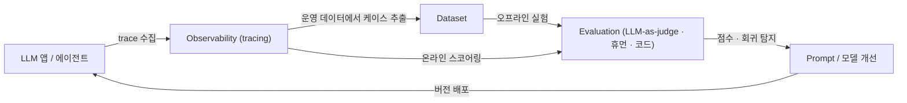
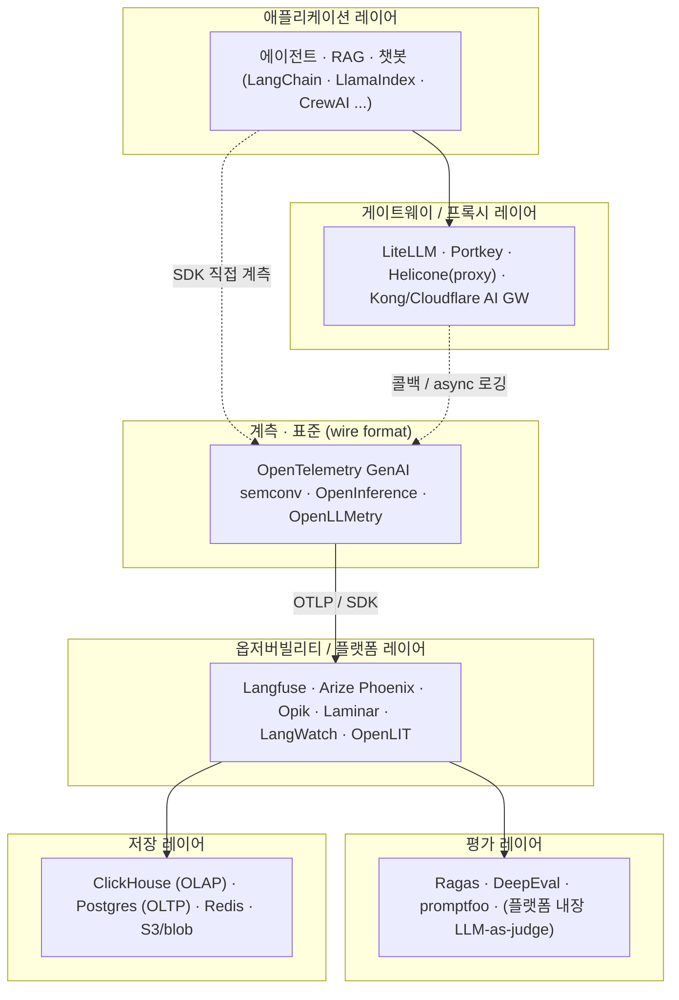
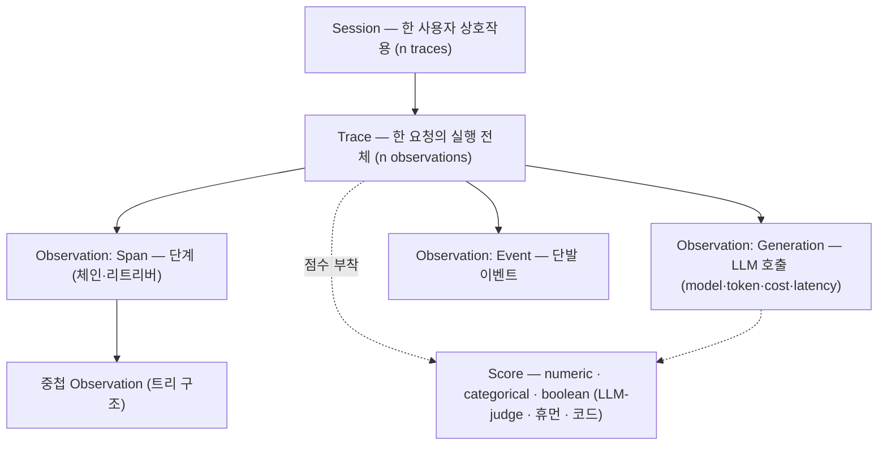
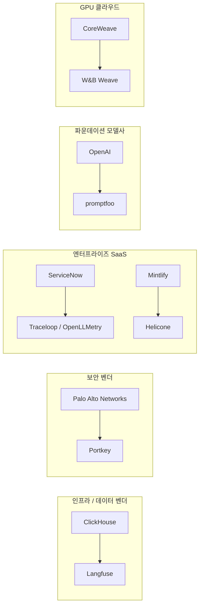
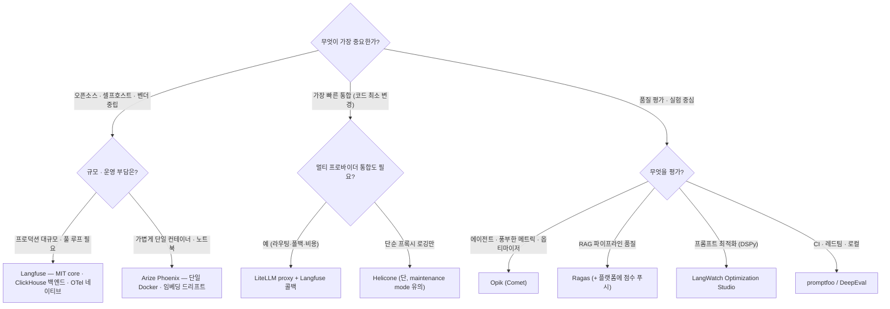

# LLM Observability · LLMOps 오픈소스 지형도 (2026)

> LLM 애플리케이션을 운영하기 위한 **관측(Observability)·평가(Evaluation)·프롬프트 관리·게이트웨이** 레이어의 오픈소스 도구를 엔지니어 관점에서 정리한다. Langfuse를 기준점(reference)으로 두고, 경쟁/대체 도구와 표준 레이어, 인접 스택까지 횡단 비교한다.
>
> 조사 시점: **2026-06**. 이 분야는 2026 상반기에 인수·통합이 집중적으로 일어나 지형이 크게 흔들렸으므로, 각 도구의 *현재 상태(active / maintenance / sunset)* 를 명시한다.

## 이 디렉터리 구성

| 문서 | 내용 |
|------|------|
| **README.md** (이 문서) | 전체 지형도 · 스택 분류 · 종합 비교표 · 2026 인수 지형 · 선택 가이드 |
| [langfuse.md](langfuse.md) | **Langfuse 심층 분석** — v3/v4 아키텍처, ClickHouse 기반 데이터스택, 데이터 모델, 라이선스, 셀프호스팅, OTel |
| [platforms.md](platforms.md) | 오픈소스 옵저버빌리티 **플랫폼별 심층** — Arize Phoenix · Opik · Helicone · Laminar · LangWatch · OpenLIT · (deprecated: Lunary · Literal AI) |
| [standards-and-ecosystem.md](standards-and-ecosystem.md) | **표준 레이어**(OTel GenAI semconv · OpenInference · OpenLLMetry) + **인접 스택**(게이트웨이 LiteLLM/Portkey · 평가 Ragas/DeepEval/promptfoo · 프롬프트 관리 · 상용 레퍼런스 LangSmith/Datadog/Weave/Braintrust) |

---

## 1. 무엇을 해결하는가 (Problem Statement)

전통적인 소프트웨어는 결정론적(deterministic)이라 입력→출력이 코드로 고정된다. LLM 애플리케이션은 다르다.

- **비결정성** — 같은 입력에도 출력이 달라진다. "정상 동작"의 기준 자체가 모호하다.
- **멀티스텝·에이전트화** — 단일 LLM 호출이 아니라 *체인/에이전트/툴 호출/리트리버* 가 중첩된 트리 구조로 실행된다. 어디서 실패했는지 추적이 어렵다.
- **비용·지연이 런타임에 결정됨** — 토큰 단위 과금, 모델·프롬프트 버전에 따라 비용/지연이 출렁인다. APM 메트릭만으로는 안 보인다.
- **품질을 코드로 단언할 수 없음** — `assert resp == expected` 가 안 통한다. 환각·관련성·안전성을 *별도의 평가(eval)* 로 측정해야 한다.
- **프롬프트가 곧 배포 단위** — 프롬프트 한 줄 수정이 동작을 바꾼다. 재배포 없이 버전·롤백을 관리해야 한다.

LLM Observability / LLMOps 도구는 이 다섯 가지 공백을 메운다. 한 문장으로: **"LLM 앱의 디버깅·측정·반복(iteration) 피드백 루프"** 를 제공한다.

전형적 피드백 루프:

---

## 2. LLMOps 스택 레이어 분류

"LLM observability 도구"라고 뭉뚱그리지만 실제로는 **여러 레이어**가 겹쳐 있다. 도구를 비교할 때는 *어느 레이어를 주력으로 하는지* 를 먼저 봐야 한다.

**레이어별 역할**

| 레이어 | 역할 | 대표 OSS |
|--------|------|----------|
| **게이트웨이/프록시** | 모든 LLM 호출을 단일 엔드포인트로 통합 → 라우팅·폴백·캐시·비용추적·**로깅 주입점** | LiteLLM, Portkey, Helicone(proxy) |
| **계측/표준** | trace를 어떤 속성·스팬 규격으로 표현할지 (벤더 종속 회피) | OTel GenAI semconv, OpenInference, OpenLLMetry |
| **옵저버빌리티/플랫폼** | trace 수집·저장·시각화 + 프롬프트 관리 + 데이터셋 + 평가 오케스트레이션 | **Langfuse**, Phoenix, Opik, Laminar, LangWatch |
| **평가** | 환각·관련성·안전성 등 품질 측정 (오프라인 실험 + 온라인 스코어링) | Ragas, DeepEval, promptfoo |
| **저장** | trace(대용량 OLAP) + 트랜잭션 메타데이터(OLTP) | ClickHouse, Postgres, Redis, S3 |

> 핵심: 성숙한 플랫폼(Langfuse·Opik·LangWatch 등)은 **옵저버빌리티 + 프롬프트 관리 + 평가 + 데이터셋을 한 제품에** 담는다. 반면 게이트웨이(LiteLLM)나 평가 프레임워크(Ragas)는 *단일 레이어 특화* 라, 플랫폼과 **결합**해서 쓰는 게 일반적이다 (예: LiteLLM proxy → Langfuse 콜백 로깅, Ragas 점수 → Langfuse trace에 푸시).

---

## 3. 공통 데이터 모델 — trace / observation / score

대부분의 플랫폼이 공유하는 핵심 개념 모델 (Langfuse 용어 기준, Phoenix·Opik 등도 거의 동형):

- **Trace**: 요청 1건의 실행 전체. 트리 구조의 root.
- **Observation**: trace 내부의 한 노드. 타입은 `span`(일반 단계) / `generation`(LLM 호출, 토큰·비용·모델 메타 포함) / `event`(단발).
- **Score**: trace 또는 observation에 부착되는 평가 결과. LLM-as-judge·휴먼 어노테이션·코드 평가가 모두 같은 Score로 수렴.
- **Session / User**: trace를 사용자·대화 단위로 묶는 상위 그룹.

이 모델이 **OpenTelemetry 스팬 트리** 와 자연스럽게 매핑되기 때문에, 2026 현재 거의 모든 신규 SDK가 OTel 기반으로 재작성되고 있다 (→ [standards-and-ecosystem.md](standards-and-ecosystem.md)).

---

## 4. 표준 레이어 한눈에 (상세는 standards 문서)

trace를 "어떤 속성 이름으로" 기록할지에 대한 3개 규격이 경쟁·수렴 중이다.

| 규격 | 주체 | 위치 | 상태(2026-06) |
|------|------|------|----------------|
| **OTel GenAI semantic conventions** | OpenTelemetry GenAI SIG | `gen_ai.*` 속성, 별도 repo로 분리 | **Development(미stable)**. 사실상의 수렴 방향이나 계약이 동결되진 않음 |
| **OpenInference** | Arize | OTel 스팬 위 `openinference.span.kind` 등 자체 네임스페이스 | Apache-2.0, Phoenix 네이티브 |
| **OpenLLMetry** | Traceloop | OTel 위 `gen_ai.*` + `llm.*` + `traceloop.*` | Apache-2.0, OTel WG에 상류 기여 |

**핵심 흐름**: 세 규격 모두 *OTLP + OpenTelemetry 스팬* 위에 올라가며, 차이는 **속성 네임스페이스** 뿐이다. 업계는 **`gen_ai.*` 를 공용어(lingua franca)** 로 수렴 중이고, OpenInference/OpenLLMetry는 변환 브리지를 제공한다. 단 OTel GenAI semconv는 아직 **Development** 상태라 속성명이 바뀐다 (예: `gen_ai.system` → `gen_ai.provider.name`, `gen_ai.prompt`/`completion` → 구조화된 `gen_ai.input.messages`/`output.messages`로 v1.38 deprecate). Langfuse는 이 4종(gen_ai·OpenInference·MLflow·자체 `langfuse.*`)을 모두 수용해 가장 유연하다.

---

## 5. 오픈소스 도구 종합 비교표

> ⚠️ **상태(Status)** 컬럼이 가장 중요하다. 2026 상반기에 다수 도구가 인수·중단됐다.

| 도구 | 라이선스 | 주력 레이어 | 백엔드 언어 / 데이터스토어 | 통합 방식 | 차별점 | 상태 (2026-06) |
|------|----------|-------------|----------------------------|-----------|--------|----------------|
| **Langfuse** | **MIT** core + EE 게이트 | 플랫폼(풀 루프) | TS · ClickHouse+Postgres+Redis+S3 | SDK(OTel 기반) + OTLP 수신 | OTel 네이티브 · 풀 루프 · 단위과금 · ClickHouse 인수 | ✅ Active (ClickHouse 인수, 2026-01) |
| **Arize Phoenix** | server **Elastic-2.0** / SDK **Apache-2.0** | 플랫폼(eval 중심) | Python+TS · SQLite/Postgres | OTel + OpenInference | 임베딩 드리프트 분석 · 노트북 친화 · PXI 인앱 에이전트 | ✅ Active (매우 활발) |
| **Opik** (Comet) | **Apache-2.0** | 플랫폼(eval 중심) | **Java/Dropwizard** · ClickHouse+MySQL+Redis | SDK(OTel) | 가장 풍부한 eval + Agent Optimizer · 처리속도 우위 | ✅ Active (관대한 open-core) |
| **Laminar** (lmnr) | **Apache-2.0** | 플랫폼(에이전트 특화) | **Rust** · Postgres+ClickHouse+RabbitMQ+Quickwit | OTel 네이티브 SDK | Rust 성능 · **브라우저 에이전트 세션 리플레이** | ✅ Active ($3M seed, 2026-03) |
| **LangWatch** | core **Apache-2.0** / SDK MIT | 플랫폼(eval+최적화) | TS+Go+Python · Postgres+Redis+ClickHouse+OpenSearch | OTel 네이티브 | **DSPy Optimization Studio** · Scenario 에이전트 시뮬 | ✅ Active |
| **OpenLIT** | **Apache-2.0** | 플랫폼(OTel 네이티브) | TS+Python+Go · ClickHouse | 1줄 자동계측 | **GPU 모니터링** · 프롬프트 허브·Vault 번들 | ✅ Active (소규모 커뮤니티) |
| **OpenLLMetry** (Traceloop) | **Apache-2.0** | 계측 라이브러리 | Python(+JS/Go/Ruby) | OTel 자동계측 SDK | 벤더 중립 계측 · 30+ 통합 · OTel WG 상류 기여 | ⚠️ Active이나 **ServiceNow 인수**(2026-03), OSS 거버넌스 불확실 |
| **Helicone** | **Apache-2.0** | 게이트웨이/프록시 | TS/Cloudflare Workers · ClickHouse+Postgres | **프록시**(1줄) + async OTel | 최단 통합 · 엣지 캐시 | ⚠️ **Maintenance mode** (Mintlify 인수, 2026-03) |
| **Lunary** | Apache-2.0 | 플랫폼 | TS · **Postgres 단일** | SDK | 단일 데이터스토어(과거 최경량) | ❌ **OSS repo 삭제**(~2025-12), SaaS만 잔존 |
| **Literal AI** | Apache-2.0(Data Layer만) | 플랫폼 | — | — | Chainlit 연계 | ❌ **Sunset**(2025-10-31), 제품 종료 |

**참고 — 인접 레이어 OSS** (상세는 [standards-and-ecosystem.md](standards-and-ecosystem.md))

| 도구 | 라이선스 | 레이어 | 상태 |
|------|----------|--------|------|
| **LiteLLM** | MIT + enterprise | 게이트웨이(100+ provider 통합, 로깅 주입점) | ✅ Active |
| **Portkey** gateway | MIT/Apache | 게이트웨이 | ⚠️ **Palo Alto Networks 인수**(2026-05) |
| **Ragas** | Apache-2.0 | RAG 평가 | ✅ Active (org명 Vibrant Labs로 변경) |
| **DeepEval** | Apache-2.0 | 평가(pytest 스타일) | ✅ Active |
| **promptfoo** | MIT | 평가 + 레드팀 | ⚠️ **OpenAI 인수**(2026-03), MIT 유지 표명 |
| **Agenta** | MIT open-core | 프롬프트 관리·플레이그라운드 | ✅ Active |
| **Pezzo** | Apache-2.0 | 프롬프트 관리 | ❌ 사실상 방치(2024-05 이후 릴리스 없음) |

### 5.1 스토리지 · 데이터 백엔드 매트릭스

도구를 셀프호스트할 때 *어떤 데이터스토어를 띄워야 하는지* 가 운영 부담을 좌우한다. 역할별로 정리하면:

- **OLAP(분석/trace)** — 대용량 trace의 집계 쿼리용 컬럼형 스토어. **ClickHouse가 사실상 표준.**
- **OLTP(메타데이터)** — users·projects·prompts 등 트랜잭션 데이터. Postgres/MySQL.
- **캐시/큐** — Redis(캐시·락), RabbitMQ(작업 큐).
- **객체/검색** — S3/MinIO(원본 페이로드·첨부), OpenSearch/Quickwit(풀텍스트 검색).

**옵저버빌리티 플랫폼**

| 도구 | OLAP (trace/분석) | OLTP (메타데이터) | 캐시/큐 | 객체/검색 | 최소 자체호스트 의존성 |
|------|-------------------|-------------------|---------|-----------|------------------------|
| **Langfuse** | ClickHouse | Postgres | Redis/Valkey | S3/blob | **4 스토어** (⚠️ 전부 UTC) |
| **Arize Phoenix** | — (없음) | **SQLite(기본)** / Postgres | — | — | **단일 컨테이너** (가장 가벼움) |
| **Opik** | ClickHouse | MySQL | Redis | MinIO (+ZooKeeper) | 4+ 스토어 (Java 백엔드) |
| **Laminar** | ClickHouse | Postgres 16 | RabbitMQ | Quickwit (검색) | 4 스토어 (Rust 백엔드) |
| **LangWatch** | ClickHouse | Postgres | Redis | OpenSearch (검색) | **4 스토어** |
| **OpenLIT** | ClickHouse | — | — | (+ OTel Collector) | ClickHouse 중심 (경량) |
| **Helicone** | ClickHouse | Postgres / Supabase | — | MinIO | 멀티컴포넌트 (CF Workers) |
| **Lunary** | — | **Postgres 단일** | — | — | 단일 스토어 (단 OSS 종료) |

**평가 · 게이트웨이 · 프롬프트 관리 (인접 레이어)**

| 도구 | 레이어 | 저장 백엔드 | 비고 |
|------|--------|-------------|------|
| **promptfoo** | 평가 | **SQLite** (`~/.promptfoo/promptfoo.db`, Drizzle ORM) | **로컬 파일 단일** — 별도 DB 서비스 불필요. `PROMPTFOO_CONFIG_DIR`로 경로 변경. 단일/소규모 팀 설계 |
| **DeepEval** | 평가 | **로컬 JSON 캐시** (`.temp-deepeval-cache.json`, `DEEPEVAL_RESULTS_FOLDER`) | DB 없음. Confident AI 클라우드 푸시는 선택 |
| **Ragas** | 평가 | **없음** (순수 라이브러리) | 점수를 계산해 Langfuse/Phoenix 등 trace에 푸시 |
| **LiteLLM** | 게이트웨이 | Postgres (Prisma: virtual key·spend) + Redis (캐시·라우터 상태) | **SDK 단독은 무DB**, 프록시 서버 모드에서만 필요 |
| **Portkey** gateway | 게이트웨이 | **무상태(stateless)** | OSS 게이트웨이는 DB 불요. 로그/분석은 외부 로그스토어 또는 상용 플랫폼 |
| **Agenta** | 프롬프트 관리 | Postgres + Redis(캐시) + RabbitMQ(워커 큐) | 워커 아키텍처 |
| **Pezzo** | 프롬프트 관리 | ClickHouse + Postgres + Redis | (방치) |

> **읽는 법**: ① **가장 가벼운 셀프호스트 = Phoenix**(단일 컨테이너, SQLite) 또는 평가 CLI(promptfoo SQLite / DeepEval JSON). ② **풀 플랫폼은 거의 4-스토어**(ClickHouse + Postgres/MySQL + Redis/RabbitMQ + S3/검색) — 운영 부담이 실제 선택 기준이 된다. ③ ClickHouse는 trace 분석 OLAP의 공용 선택, Postgres/MySQL은 OLTP 메타데이터, 둘을 분리하는 패턴이 지배적.

---

## 6. 2026 인수·통합 지형도

이 분야의 가장 큰 2026년 사건은 **대규모 인수 물결** 이다. 인프라 벤더(ClickHouse)·보안 벤더(Palo Alto)·엔터프라이즈 SaaS(ServiceNow)·파운데이션 모델사(OpenAI)가 LLMOps 스택을 흡수했다.

| 시점 | 인수 대상 | 인수 주체 | 의미 |
|------|-----------|-----------|------|
| 2026-01 | **Langfuse** | **ClickHouse** | Langfuse가 이미 ClickHouse 위에서 돌던 차에 정식 흡수. ClickHouse의 "Agentic Data Stack" 핵심 레이어로. MIT core 유지 천명. $400M Series D와 동시 발표 |
| 2026-03 | **Traceloop (OpenLLMetry)** | **ServiceNow** | ServiceNow AI Control Tower의 "Observe" 축으로. OSS OpenLLMetry의 향후는 명시 안 됨 (릴리스는 인수 후에도 지속) |
| 2026-03 | **Helicone** | **Mintlify** | 유지보수 모드 전환 — 보안/버그/신규 모델만, 신기능 없음 |
| 2026-03 | **promptfoo** | **OpenAI** | OpenAI Frontier에 흡수. "MIT·오픈소스 유지" 표명 |
| 2026-05 | **Portkey** | **Palo Alto Networks** | Prisma AIRS로 흡수. OSS 게이트웨이 repo 향후 불명 |
| 2025-05 | **Weights & Biases (Weave)** | **CoreWeave** | ~$1.7B. 리브랜드 없이 "W&B Weave" 유지, Weave SDK는 Apache-2.0 OSS |

**자발적 종료 / 방치**

| 도구 | 상태 |
|------|------|
| **Literal AI** | 2025-10-31 클라우드·셀프호스트 모두 종료. 차별화 실패가 사유. OSS "Data Layer"와 Chainlit 프레임워크만 잔존 |
| **Lunary** | OSS repo 삭제(~2025-12). SaaS만 잔존 → 신규 OSS 채택 부적합 |
| **Pezzo** | 2024-05 이후 릴리스 없음, 창업자 이직 → 사실상 방치 |

> **시사점**: ① LLMOps는 더 이상 독립 스타트업이 단독 생존하기 어려운, *인프라·보안·플랫폼 벤더의 전략 자산* 이 됐다. ② **벤더 중립(OTel 네이티브 + 셀프호스트 가능)** 의 가치가 역설적으로 더 커졌다 — 인수된 도구에 락인되지 않으려면 OTLP 표준으로 빠질 수 있어야 한다. ③ "OSS sibling" 패턴(상용 플랫폼 + OSS 코어)이 지배적: Phoenix↔Arize AX, Weave SDK↔W&B, LangChain↔LangSmith.

---

## 7. 선택 가이드

**상황별 추천 (2026-06 기준)**

| 상황 | 추천 | 이유 |
|------|------|------|
| 범용 OSS LLM 옵저버빌리티, 프로덕션 규모 | **Langfuse** | MIT core·OTel 네이티브·풀 루프·ClickHouse 스케일. 인수 후에도 OSS 유지 |
| 가볍게 시작 / 노트북 / 임베딩·RAG 품질 시각화 | **Arize Phoenix** | 단일 컨테이너, 라이선스 게이트 없음. 단 server는 Elastic-2.0(source-available) |
| 평가·에이전트 최적화가 핵심 | **Opik** | 30+ eval 메트릭 · Agent Optimizer · 완전 Apache-2.0 |
| 브라우저/장시간 에이전트 디버깅 | **Laminar** | Rust 성능 + 세션 리플레이 |
| 프롬프트 최적화·에이전트 시뮬레이션 | **LangWatch** | DSPy Optimization Studio · Scenario |
| GPU·인프라까지 한 화면에 | **OpenLIT** | OTel 네이티브 + GPU 모니터링 번들 |
| 멀티 프로바이더 통합 + 로깅 | **LiteLLM** (게이트웨이) + 위 플랫폼 콜백 | 모든 호출의 단일 주입점 |
| **신규 채택 비권장** | Helicone(유지보수), Lunary·Literal AI·Pezzo(종료/방치) | 상태 참조 |

---

## 8. 핵심 인사이트 (엔지니어 관점)

1. **OTel 네이티브가 기본값이 됐다.** 2026 현재 신규/리뉴얼 SDK는 거의 모두 OpenTelemetry 스팬 기반이다. 이는 *벤더 락인 회피* 의 실질적 보험이다 — 플랫폼이 인수·종료돼도 OTLP로 다른 백엔드(Grafana·Datadog·다른 OSS)로 빠질 수 있다. 도구 선택 시 **"OTLP를 수신/송신하는가"** 를 1순위 체크포인트로.

2. **ClickHouse가 사실상의 표준 trace 스토어.** Langfuse·Opik·Laminar·LangWatch·Helicone·OpenLIT 모두 trace/분석 데이터를 ClickHouse(컬럼형 OLAP)에 넣고, 트랜잭션 메타데이터만 Postgres/MySQL에 둔다. 대용량 trace의 분석 쿼리 특성이 OLAP에 맞기 때문. (Langfuse가 ClickHouse에 인수된 것이 상징적.)

3. **"풀 루프 플랫폼" vs "단일 레이어 도구"** 를 구분하라. Langfuse·Opik·LangWatch는 trace+eval+prompt+dataset을 한 제품에 담는다. 반면 LiteLLM(게이트웨이)·Ragas(평가)는 특화 도구라 플랫폼과 **조합** 한다. 흔한 실전 조합: `LiteLLM proxy(통합·라우팅) → Langfuse(관측) + Ragas/DeepEval(평가 점수 푸시)`.

4. **라이선스를 정확히 읽어라.** "오픈소스"라는 단어가 함정이 많다. Langfuse=MIT core(+EE 게이트), **Phoenix server=Elastic-2.0(OSI 오픈소스 아님, 매니지드 서비스 금지)**, Opik/Laminar/OpenLLMetry/OpenLIT=깨끗한 Apache-2.0. 셀프호스트 시 RBAC·SSO·SCIM·감사로그·데이터 보존은 대부분 EE/상용 게이트 뒤에 있다.

5. **상태(maintenance/sunset)를 최우선으로 확인하라.** 2026 상반기 인수 물결로 Helicone(유지보수)·Lunary·Literal AI·Pezzo는 신규 채택 부적합. 활발히 유지되며 자금이 있는 **Langfuse·Phoenix·Opik·Laminar·LangWatch** 가 안전한 선택지다.

6. **평가(eval)는 별도 1급 시민이다.** 옵저버빌리티만으로는 "동작했다"만 알 뿐 "좋았는가"를 모른다. 오프라인 실험(dataset 기반 회귀 방지) + 온라인 스코어링(프로덕션 trace에 LLM-judge 점수)을 CI에 엮는 것이 성숙한 LLMOps의 핵심.

---

### 출처 (주요)

- Langfuse: [github.com/langfuse/langfuse](https://github.com/langfuse/langfuse), [docs.langfuse.com](https://langfuse.com/docs), [ClickHouse 인수 발표](https://clickhouse.com/blog/clickhouse-acquires-langfuse-open-source-llm-observability)
- Arize Phoenix: [github.com/Arize-ai/phoenix](https://github.com/Arize-ai/phoenix), [arize.com/docs/phoenix](https://arize.com/docs/phoenix)
- Opik: [github.com/comet-ml/opik](https://github.com/comet-ml/opik)
- Laminar: [github.com/lmnr-ai/lmnr](https://github.com/lmnr-ai/lmnr)
- LangWatch: [github.com/langwatch/langwatch](https://github.com/langwatch/langwatch)
- OpenLIT: [github.com/openlit/openlit](https://github.com/openlit/openlit)
- OpenLLMetry/Traceloop: [github.com/traceloop/openllmetry](https://github.com/traceloop/openllmetry)
- 비교 기사: [SigNoz](https://signoz.io/comparisons/llm-observability-tools/), [MLflow Top LLM Observability 2026](https://mlflow.org/articles/top-llm-observability-tools-in-2026-a-pro-guide/), [bigdataboutique](https://bigdataboutique.com/blog/llm-observability-tools-compared-langfuse-vs-langsmith-vs-opik), [Laminar — Langfuse alternatives 2026](https://laminar.sh/article/langfuse-alternatives-2026)
