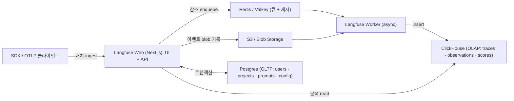
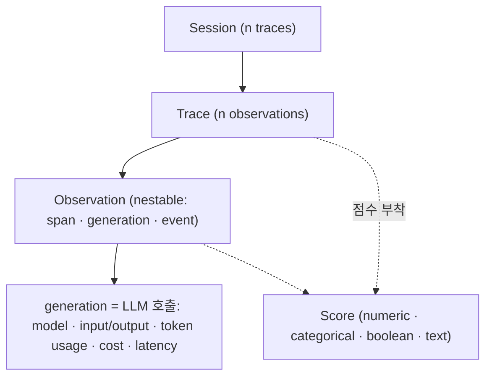

# Langfuse 심층 분석 — 오픈소스 LLM Engineering 플랫폼

> 상위 지형도: [README.md](README.md) · 표준/인접 스택: [standards-and-ecosystem.md](standards-and-ecosystem.md)
>
> 조사 시점 **2026-06**. Langfuse는 2026-01 ClickHouse에 인수됐으나 **MIT core 오픈소스 + 독립 운영** 을 유지한다.

## 1. 프로젝트 개요

**한 줄 정의**: LLM 애플리케이션의 *트레이싱 · 평가 · 프롬프트 관리 · 분석* 을 한 제품에 담은 **오픈소스(MIT core) LLM Engineering 플랫폼**. "오픈소스 LangSmith" 포지션 — 프레임워크 비종속, 셀프호스트 가능.

**탄생 배경**
- 창업자 **Marc Klingen · Max Deichmann · Clemens Rawert** (베를린).
- **Y Combinator W23**. YC 기간 중 여러 LLM 아이디어를 거쳐(원래 SaaS 빌링 → 코드젠 에이전트 등) **LLM 옵저버빌리티/분석** 으로 피벗.
- 자금: **$4M Seed**(2023-11, Lightspeed·La Famiglia·YC). Series A 없이 **Seed → 인수**(ClickHouse, 2026-01)로 직행.
- 인수 시점 트랙션(발표 기준): GitHub ~29K stars, SDK 월 26M+ 설치, **Fortune 500 중 63개사 고객**, 셀프호스트 ClickHouse 배포 1,000+.

**해결하는 문제** — [README §1](README.md#1-무엇을-해결하는가-problem-statement)의 다섯 공백(비결정성·멀티스텝·런타임 비용·품질 단언 불가·프롬프트=배포단위)을 *하나의 피드백 루프* 로 묶는다.

## 2. 핵심 기능

| 기능 | 상세 |
|------|------|
| **Tracing / Observability** | 계층적 trace → observation 트리. input/output·model·token usage·cost·latency·error 캡처 |
| **Prompt Management** | 버전 관리 + **라벨 기반 배포**(`production`/`latest`), text/chat 프롬프트, `{{변수}}` 템플릿 `compile()`, SDK측 캐싱, **재배포 없이 라벨 변경으로 롤백**, 버전별 성능을 trace와 연결 분석 |
| **Evaluations** | **LLM-as-a-judge**(프로덕션 trace 온라인 스코어링) · **휴먼 어노테이션 큐** · **코드/결정론 평가** · Scores API(numeric/categorical/boolean/text) |
| **Datasets & Experiments** | 오프라인 평가: 프로덕션 예시로 테스트셋 구성 → 프롬프트/모델/코드 버전 나란히 실험 → **CI/CD 게이팅으로 회귀 차단** |
| **Playground** | 프롬프트/모델 인터랙티브 반복 |
| **Analytics / Dashboards** | 비용·지연·볼륨·품질 추이. 수억 trace 집계 Metrics API |
| **Sessions & Users** | trace를 사용자·대화 단위로 묶기, tag·metadata·release·environment 부착 |

## 3. 아키텍처 — v3 데이터스택과 v4 재설계

Langfuse의 가장 중요한 아키텍처 결정은 **Postgres-only → 듀얼 OLTP/OLAP + 비동기 수집(async ingestion)** 으로의 전환(v3, 2024 말 GA)이다.

### 3.1 v3 아키텍처 (현행 기반)

**구성요소 4개 스토어 + 2개 앱 서비스**

| 컴포넌트 | 역할 |
|----------|------|
| **Postgres (OLTP)** | users·projects·prompts·configs 등 트랜잭션 메타데이터 |
| **ClickHouse (OLAP)** | traces·observations·scores — 컬럼형, 수십억 행. "Postgres 확장 vs OLAP 전환"을 비교한 끝에 쓰기 처리량+분석 쿼리 때문에 ClickHouse 채택 |
| **Redis/Valkey** | 수집 큐 + 캐시 |
| **S3 / blob** | 원본 이벤트 페이로드, 멀티모달 첨부, 대용량 export |
| **Langfuse Web** | Next.js — UI + 공개 API + ingest 엔드포인트 |
| **Langfuse Worker** | 비동기 수집 처리 (Web과 별도 컨테이너) |

**수집 패턴의 핵심**: 배치를 곧장 **S3에 쓰고 Redis엔 *참조만* 넣는다** → Worker가 S3에서 읽어 ClickHouse로. 트래픽 스파이크를 DB에서 분리(decouple)하는 설계. v3 마이그레이션은 1,000+ 셀프호스터를 위해 무중단 + Postgres→ClickHouse 가이드 마이그레이션 제공.

### 3.2 v4 "Simplify for Scale" (2026-03-10)

에이전트 앱(한 trace에 수천 ops)을 겨냥해 데이터 모델을 **trace 중심 → observation 중심** 으로 전환:

- **새 wide·거의 불변(immutable) ClickHouse 테이블** — input/output/context를 각 observation 행에 **비정규화(denormalize)** → **읽기 시 join/dedup 제거**.
- 모든 LLM 호출/툴/에이전트 스텝이 **직접 쿼리 가능한 단일 행**.
- **Observations API v2 + Metrics API v2** 도입.
- 실시간("Fast Preview") 데이터는 **Python SDK v4 / JS-TS SDK v5** 필요.

### 3.3 데이터 모델

## 4. 기술 스택

- **언어 구성(repo, 2026 중반)**: TypeScript **98.7%**, 나머지 JS/Shell/Python/CSS/Dockerfile. 프론트+백 모두 **Next.js / TypeScript 모노레포**.
- **SDK**: Python(v4)·JS/TS(v5) — **둘 다 OpenTelemetry 기반으로 재작성됨**. Python은 `@observe()` 데코레이터 + `start_as_current_observation()` 컨텍스트 매니저 + 전역 `get_client()`. trace/span ID는 **W3C Trace Context** 준수.
- **네이티브 통합**: LangChain·LangGraph·LlamaIndex·**OpenAI SDK wrapper(drop-in)**·LiteLLM·Vercel AI SDK·CrewAI·AutoGen·Semantic Kernel·Pydantic AI·Spring AI·Haystack·DSPy·Instructor·Google ADK·smolagents. Anthropic 등은 third-party OTel 계측(`opentelemetry-instrumentation-anthropic`)으로 수용.

## 5. 라이선스 모델 (정밀)

**오픈코어 · 단일 repo 듀얼 라이선스**:

- **Core = MIT.** *트레이싱·평가·프롬프트 관리·실험·어노테이션·플레이그라운드·공개 API 등 모든 제품 기능* 이 MIT, 사용량 제한 없음.
- **EE 카브아웃**: `ee/`, `web/src/ee/`, `worker/src/ee/` 하위는 `ee/LICENSE`(상용) 적용. EE 코드는 소스로 동봉되나 **라이선스 키 체크로 게이팅** — 키 없이 core 이미지만 돌리면 EE 코드는 실행 안 됨.
- **EE 게이트 기능(셀프호스트 시 상용 키 필요)**: **SCIM**, **확장 감사 로그**, **데이터 보존 정책**, **프로젝트 단위 fine-grained RBAC** (목록은 비망라적).
- **3가지 배포 모델, 동일 코드베이스**: OSS 셀프호스트(MIT only) → 엔터프라이즈 셀프호스트(MIT+EE 키) → Langfuse Cloud(매니지드, 전 기능). 언제든 전환 가능.
- **인수 후**: ClickHouse가 "MIT core는 MIT로 유지, 기존 배포에 변화 없음" 재확인.

## 6. 배포 / 셀프호스팅

- **필수 인프라**: Postgres + ClickHouse + Redis/Valkey + S3 호환 blob. ⚠️ **모든 컴포넌트는 UTC로 실행해야 함** (non-UTC는 쿼리 결과 오류 — 흔한 함정).
- **옵션**: Docker Compose(개발/테스트) · **Kubernetes Helm 차트**(프로덕션) · AWS/Azure/GCP Terraform 모듈 · Railway 템플릿.
- **Cloud 티어(2026)**: Hobby Free(50k units/월·30일 보존·2 users) / Core $29(100k·90일·무제한 users) / Pro $199(3년 보존·SOC2·ISO27001·HIPAA) / Enterprise $2,499(SSO·fine-grained RBAC·감사로그·SCIM). **단위/이벤트 기반 과금**(per-seat 아님).

## 7. OpenTelemetry 포지션 (핵심 차별점)

- **OTLP 백엔드로 동작**. ingest 엔드포인트 **`/api/public/otel`**(`/v1/traces`). **OTLP over HTTP — HTTP/JSON · HTTP/protobuf** 지원. ⚠️ **gRPC 미지원**. 인증 = Basic Auth(`pk-lf-…:sk-lf-…` base64).
- **시맨틱 컨벤션 매핑**: OTel **GenAI**(주) · **OpenInference**(`input.value`/`output.value`) · **MLflow**(`mlflow.spanInputs/Outputs`) · 자체 `langfuse.*`(우선순위). → 4종을 모두 수용해 **컨벤션 유연성 최고**.
- **호환 계측**: OpenLLMetry(Traceloop)·OpenLIT·OpenInference(Arize)·MLflow → Java/Go 커버리지와 40+ provider/framework를 Langfuse 네이티브 계측 없이 확보.
- **SDK 자체가 OTel 네이티브** → 임의의 OTel 계측 라이브러리 스팬이 Langfuse trace에 자동 중첩되고, 동시에 Grafana/Jaeger/Datadog로 fan-out 가능.

## 8. 강점 · 약점 (엔지니어 관점)

**강점**
- **MIT core·사용량 무제한** 셀프호스트 — 옵저버빌리티 도구 중 드묾. 락인·조달 마찰 회피.
- **OTel 네이티브** → 가장 넓은 프레임워크 커버리지 + 독자 와이어 포맷 없음.
- **프로덕션 스케일**(ClickHouse 컬럼형 + S3/Redis 비동기 수집, 수십억 이벤트).
- **풀 루프**(trace+eval+prompt+dataset+playground) 단일 제품.
- **단위 기반 과금**(per-seat 아님) — 대규모 팀에 유리.

**약점 · 한계**
- **무거운 셀프호스트 풋프린트**: 4개 stateful 스토어(Postgres+ClickHouse+Redis+S3) + 2개 앱 컨테이너. Postgres-only 경쟁자(Phoenix 단일 컨테이너) 대비 운영 부담 큼. UTC-only 요구는 오설정 위험.
- **프레임워크별 깊이는 LangSmith보다 얕음**: LangChain/LangGraph 노드별 state diff·재실행(replay against new models) 같은 깊은 디버깅은 약함. 깊이를 *넓이* 와 맞바꾼 설계.
- **EE 게이팅**: RBAC·SCIM·감사로그·보존 정책은 보안 민감 엔터프라이즈 셀프호스트 시 상용 키 필요.
- **gRPC OTLP 미지원** — HTTP 전용 수집.
- **v4 마이그레이션 churn**: 실시간 데이터에 Python v4 / TS v5 필요, 구 SDK는 가시성 지연.
- **인수 불확실성(flag)**: ClickHouse 소유는 단기적으론 안정적이나 12~24개월 전략 방향은 모니터링 대상.

## 9. 2026 주요 동향

- **2026-01-16 — ClickHouse 인수.** ClickHouse "Agentic Data Stack"의 LLM 옵저버빌리티 축. MIT core 유지, Cloud SLA 유지. $400M Series D와 동시 발표.
- **2026-03-10 — v4 "Simplify for Scale"**: observation 중심 wide ClickHouse 테이블, Observations/Metrics API v2, Python SDK v4 + JS/TS SDK v5, 실시간 Fast Preview.
- **현행 core 릴리스**: v3.192.2 (2026-06-18) 수준.
- **로드맵 신호**: ClickHouse가 "더 깊은 네이티브 통합" 예고, 커뮤니티 우선 유지 약속.

## 10. 경쟁 비교 (요약)

| 도구 | Langfuse 대비 |
|------|----------------|
| **LangSmith** | LangChain/LangGraph 최심층 트레이싱(state diff·replay)이나 **폐쇄/상용**(per-seat $39 + $0.50/1k trace), OTel 제한적. Langfuse=오픈·OTel 네이티브·단위 과금 |
| **Arize Phoenix** | 완전 셀프호스트·경량(단일 컨테이너)·OTel/OpenInference 우선. Langfuse는 더 풍부한 프롬프트 관리 + 매니지드 클라우드 + 넓은 기능면. 단 Phoenix server는 Elastic-2.0 |
| **Helicone** | 프록시 기반 최단 비용추적, eval 약함. Langfuse는 SDK/OTel 기반 풀 eval (단 Helicone은 2026 maintenance mode) |
| **Opik / Braintrust / Galileo** | eval·실험 중심. Langfuse는 오픈소스 + 옵저버빌리티 넓이로 경쟁 |

→ 상세 경쟁 도구는 [platforms.md](platforms.md), 상용 레퍼런스는 [standards-and-ecosystem.md](standards-and-ecosystem.md#d-상용-레퍼런스).

## 11. 종합 평가

**적합**: 프레임워크 다양한 환경에서 *벤더 중립적이고 셀프호스트 가능한* 풀 루프 LLM 옵저버빌리티가 필요한 팀. 프로덕션 대규모 trace + 프롬프트 버저닝 + 평가 파이프라인을 한 제품으로 묶고 싶을 때.

**부적합/주의**: ① 운영 인력이 빈약해 4-스토어 스택을 감당하기 어려운 소규모 팀(→ Phoenix 단일 컨테이너 고려). ② LangChain/LangGraph 단일 스택의 *노드별 깊은 디버깅* 이 최우선이면 LangSmith가 더 깊다. ③ 보안 규제로 RBAC/SCIM/감사로그가 필수면 EE 상용 키 비용을 계산에 넣어야 한다.

**한 줄 결론**: *MIT-core 오픈소스 + OTel 네이티브 + ClickHouse 스케일 + 풀 루프* 의 조합은 2026 현재 오픈소스 LLM 옵저버빌리티의 사실상 기준점이며, ClickHouse 인수로 인프라 스택 통합 측면에서 오히려 입지가 강화됐다.

---

### 출처
- [github.com/langfuse/langfuse](https://github.com/langfuse/langfuse) (+ [LICENSE](https://github.com/langfuse/langfuse/blob/main/LICENSE))
- [docs.langfuse.com](https://langfuse.com/docs) — data-model · open-source · evaluation · prompt-management · self-hosting · integrations/native/opentelemetry
- changelog: [OTel SDK(2025-05-23)](https://langfuse.com/changelog/2025-05-23-otel-based-python-sdk) · [TS v4 GA(2025-08-28)](https://langfuse.com/changelog/2025-08-28-typescript-sdk-v4-ga) · [Simplify for Scale(2026-03-10)](https://langfuse.com/changelog/2026-03-10-simplify-for-scale)
- [ClickHouse 인수 발표](https://clickhouse.com/blog/clickhouse-acquires-langfuse-open-source-llm-observability) · [ClickHouse–Langfuse 데이터스택](https://clickhouse.com/blog/langfuse-and-clickhouse-a-new-data-stack-for-modern-llm-applications) · [Series D](https://clickhouse.com/blog/clickhouse-raises-400-million-series-d-acquires-langfuse-launches-postgres)
- [PostHog 스타트업 스포트라이트](https://posthog.com/spotlight/startup-langfuse) · [pricing](https://langfuse.com/pricing)
