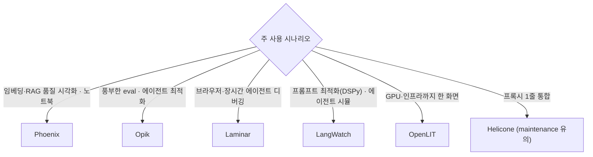

# 오픈소스 LLM 옵저버빌리티 플랫폼 심층 비교

> 상위 지형도: [README.md](README.md) · Langfuse 단독: [langfuse.md](langfuse.md)
>
> 조사 시점 **2026-06**. Langfuse를 제외한 주요 OSS 옵저버빌리티 플랫폼을 도구별로 정리한다. **상태(Status)** — active / maintenance / sunset — 를 각 절 머리에 명시한다.

## 0. 한눈에 보기

| 도구 | 상태 | 라이선스 | 백엔드 | 데이터스토어 | 통합 | 시그니처 차별점 |
|------|------|----------|--------|--------------|------|-----------------|
| Arize Phoenix | ✅ Active | server **ELv2** / SDK Apache-2.0 | Python+TS (FastAPI) | SQLite/Postgres | OTel + OpenInference | 임베딩 드리프트 · 노트북 · PXI 에이전트 |
| Opik | ✅ Active | **Apache-2.0** | **Java/Dropwizard** | ClickHouse+MySQL+Redis | SDK(OTel) | 30+ eval · Agent Optimizer · 속도 |
| Laminar | ✅ Active | **Apache-2.0** | **Rust** | Postgres+ClickHouse+RabbitMQ+Quickwit | OTel 네이티브 | 브라우저 에이전트 세션 리플레이 |
| LangWatch | ✅ Active | core Apache-2.0/SDK MIT | TS+Go+Python | Postgres+Redis+ClickHouse+OpenSearch | OTel 네이티브 | DSPy Optimization Studio · Scenario |
| OpenLIT | ✅ Active | **Apache-2.0** | TS+Python+Go | ClickHouse | 1줄 자동계측 | GPU 모니터링 · 번들 |
| Helicone | ⚠️ Maintenance | Apache-2.0 | TS/CF Workers | ClickHouse+Postgres+MinIO | **프록시** + async OTel | 최단 통합 · 엣지 캐시 |
| Lunary | ❌ OSS 삭제 | Apache-2.0 | TS | Postgres | SDK | (과거) 단일 스토어 경량 |
| Literal AI | ❌ Sunset | Apache-2.0(부분) | — | — | — | Chainlit 연계 |

---

## 1. Arize Phoenix — ✅ Active (eval·드리프트 중심)

**문제·기원**: Arize AI(2020 창립, 전통 ML 옵저버빌리티 출신)가 2023-04 내놓은 **노트북 우선** OSS. "LangSmith급 기능을 *셀프호스트 + 개방 표준(OTel/OpenInference)* 으로, 제3자 SaaS에 텔레메트리를 보내지 않고" 쓰려는 수요를 겨냥.

**⚠️ 라이선스 — 가장 자주 오해되는 지점 (분할 라이선스)**

| 패키지 | 라이선스 |
|--------|----------|
| `arize-phoenix` (서버/UI) | **Elastic License 2.0 (ELv2)** — source-available, **OSI 오픈소스 아님**. 매니지드 서비스로 제공 금지 |
| `arize-phoenix-evals` | Elastic-2.0 |
| `arize-phoenix-otel` · `arize-phoenix-client` | **Apache-2.0** |
| OpenInference 계측(`Arize-ai/openinference`) | **Apache-2.0** |

→ 앱에 임베드하는 **SDK는 Apache-2.0(안전)**, **서버/evals는 ELv2**. 많은 블로그가 "Phoenix = MIT/permissive"라고 잘못 표기하므로 주의. 셀프호스트(단일 Docker)는 **라이선스 키·기능 게이트 없이** 전 기능 무료, 단 ELv2 제약(SaaS 재판매 불가) 적용.

**아키텍처·스택**
- 서버: **FastAPI** + 3개 API 표면 — Strawberry **GraphQL**(`/graphql`, UI용) · REST v1(`/v1`) · **gRPC/OTLP 수신**(4317).
- 저장: SQLAlchemy over **SQLite(기본) / PostgreSQL**, 고처리량용 `BulkInserter` 큐, Postgres read-replica 라우팅(v14).
- 프론트: React SPA(FastAPI StaticFiles). distroless Docker, Helm.
- **OpenInference 데이터 모델**: 모든 스팬에 `openinference.span.kind`(LLM/Chain/Tool/Agent/Retriever/Embedding/Reranker/Guardrail/Evaluator). 50+ 프레임워크 자동계측. v15.10에서 서버측 OTel-GenAI→OpenInference 변환.
- **Evals**: `arize-phoenix-evals` — LLM-judge 템플릿(relevance·hallucination·toxicity·Q&A) + 결정론 코드 평가, 기본 설명(explanation) 제공. v16에서 샌드박스 코드 평가.
- **임베딩/RAG 드리프트(ML 유산 차별점)**: UMAP 3D 투영, 유클리드 centroid 드리프트, HDBSCAN 클러스터링. LangSmith·Langfuse엔 대체로 없음.

**2026 헤드라인 — PXI(Phoenix Intelligence, v17, 2026-06)**: 인앱 AI 엔지니어링 에이전트. trace 조사 → 프롬프트 개선을 리뷰 가능한 diff로 제안 → 실험 실행 → 평가자 작성, 승인 통제. 이후 v17.x에서 슬래시 커맨드·병렬 서브에이전트·플레이그라운드 오케스트레이션.

**Arize AX(상용 SaaS)와의 경계**: Phoenix=무료 셀프호스트/클라우드. AX 전용 = Alyx Copilot·온라인/프로덕션 평가·실시간 알림·커스텀 대시보드·전통 ML/CV 모니터링·HIPAA. Phoenix→AX는 티어 토글이 아니라 별도 계약.

**Pros**: 진짜 무료 풀기능 셀프호스트, 개방 표준, 강한 evals + 고유 임베딩 드리프트, 노트북 친화, SDK가 Apache-2.0(임베드 안전).
**Cons**: 서버가 ELv2(source-available, OSI 아님), 온라인 평가/알림/대시보드/Copilot은 AX 유료, SQLite→Postgres 스케일은 본인 몫, 분할 라이선스 오해 쉬움.

---

## 2. Opik (Comet) — ✅ Active (eval 최강 + 에이전트 최적화)

**문제·기원**: MLOps 벤더 **Comet** 의 OSS LLM **평가 우선** 옵저버빌리티 + 에이전트 최적화 + 프로덕션 모니터링. 매우 활발(누적 ~490 릴리스, v2.0.70 @ 2026-06-18).

**라이선스**: **Apache-2.0 — 이례적으로 관대한 open-core.** 전 기능(트레이싱·evals·온라인 평가 규칙·프롬프트 관리)이 OSS, 운영/스케일/지원(사용량 한도·보존·SSO·RBAC·SLA·컴플라이언스)만 게이트.

**기능**
- OTel 기반 트레이싱(40M+ trace/day 설계).
- **LLM-as-a-judge 메트릭**: Hallucination · Moderation · Answer Relevance · Context Precision/Recall · **G-Eval** 등 30+.
- **Online Evaluation Rules**: 프로덕션 trace 실시간 스코어링.
- 프롬프트 관리 + 플레이그라운드.
- **Agent Optimizer**: Bayesian / evolutionary / MetaPrompt 전략.
- 데이터셋·실험·가드레일(PII).

**스택(확인)**: **백엔드 = Java 21 + Dropwizard 4**(R2DBC reactive ClickHouse 클라이언트). 저장: **ClickHouse**(trace/분석) + **MySQL**(트랜잭션) + **Redis**(캐시/락/스트리밍). 평가 판정 실행용 Python/Flask 샌드박스. SDK: Python + TypeScript.
**셀프호스트**: docker-compose(개발) · **Kubernetes + Helm**(프로덕션, MySQL·Redis·ZooKeeper·MinIO·Altinity ClickHouse operator 번들).

**Pros**: OSS 중 가장 강한 eval 세트(완전 Apache-2.0), 활발히 유지·벤더 백업, 스케일러블.
**Cons**: 셀프호스트 스택 무거움, SDK 계측 우선(프록시 없음), 매니지드 경로는 Comet 종속.

> 참고: 한 벤치마크(comet 측)에서 trace 로깅+평가 ~23s로 Phoenix ~170s·Langfuse ~327s 대비 빠르다는 주장 — *벤더 측 수치이므로 방향성 참고용*.

---

## 3. Laminar (lmnr) — ✅ Active (에이전트·브라우저 특화, Rust)

**문제·기원**: AI **에이전트**(특히 장시간·브라우저 에이전트) 특화 OSS 옵저버빌리티. "오픈소스 DataDog + PostHog for LLM apps". **YC S24**, repo 2024-08 생성.

**라이선스**: **Apache-2.0.** 셀프호스트 1급, 클라우드(laminar.sh)는 상용.

**기능**
- OTel 네이티브 SDK(1줄) — Vercel AI SDK·Browser Use·Stagehand·LangChain·Playwright 자동계측.
- **브라우저 에이전트 세션 리플레이 ↔ trace 동기화**(대표 차별점).
- evals(SDK + CLI, CI/CD), 자연어 정의 AI 모니터링.
- 내장 **SQL 에디터** + SQL 기반 대시보드, 어노테이션/데이터셋, 빠른 풀텍스트 검색.
- *(파이프라인 빌더는 레거시/비중 축소로 보임 — flag.)*

**스택**: **백엔드 = Rust**(~27%), TS 프론트(~71%). 저장: **PostgreSQL 16 + ClickHouse + RabbitMQ + Quickwit**(풀텍스트). PII redactor 동봉. (구 문서의 "Qdrant" 언급은 outdated — 현 compose는 Quickwit.)
**셀프호스트**: docker-compose 우선(`docker compose up -d`, UI :5667), 풀스택은 `docker-compose-full.yml`. 공식 Helm 없음.

**자금**: **$3M seed**(2026-03-16, Atlantic.vc 리드, YC·AAL.vc + 엔젤 Ben Sigelman(OTel 공동창시자)·Ant Wilson(Supabase CTO)).
**Pros**: Rust 성능 + 리얼타임 엔진, 진짜 OTel 네이티브, 동급 최강 브라우저 에이전트 리플레이, 작동하는 OSS 셀프호스트.
**Cons**: 멀티 데이터스토어로 단일-Postgres 도구보다 무거움, 공식 Helm 없음, 생태계 젊음, 일부 문서 드리프트.

---

## 4. LangWatch — ✅ Active (평가 + 최적화)

**문제·기원**: 옵저버빌리티 + evals + **에이전트 시뮬레이션** + **DSPy 최적화** + AI 게이트웨이까지 묶은 엔드투엔드. 암스테르담(Rogerio Chaves·Manouk Draisma).

**라이선스**: **core = Apache-2.0 · SDK = MIT.** `langwatch/ee/`(SCIM·감사로그·라이선스/빌링)만 상용. *Elastic/SSPL 아님 — 깨끗한 open-core.*

**기능**
- OTel/OTLP 네이티브 트레이싱.
- 노코드 eval UI(PM/QA용).
- **Scenario** — 에이전트 시뮬레이션 테스트(User Simulator + Agent-Under-Test + Judge, 2026-03-04 오픈소스화).
- **Optimization Studio** — **DSPy 기반** 프롬프트/파이프라인 최적화 + 시각화.
- 데이터셋·어노테이션 큐, **Go AI Gateway**(virtual key·예산·가드레일·폴백·Anthropic cache passthrough), MCP 서버.

**스택**: TS(~79%) + Go(~5%, 게이트웨이) + Python(~4%, SDK/DSPy). 저장: **PostgreSQL + Redis + ClickHouse + OpenSearch**(Elasticsearch 아님).
**셀프호스트**: docker-compose(UI :5560) · **Helm 차트**(`charts/`) · AWS/GCP/Azure OnPrem 문서.

**Pros**: 깨끗한 Apache-2.0, OTel 네이티브, 차별화된 DSPy 최적화 + Scenario 시뮬레이션, 풀 셀프호스트, 노코드 eval UI.
**Cons**: 무거운 풋프린트(4 데이터스토어), 작은 커뮤니티, SCIM/감사/빌링은 EE 필요.

---

## 5. OpenLIT — ✅ Active (OTel 네이티브 + GPU 모니터링)

**문제·기원**: OpenTelemetry 네이티브 "AI 엔지니어링 플랫폼". 옵저버빌리티 + 비용 + evals + 가드레일 + 프롬프트 허브 + Vault + **GPU 모니터링** + 플릿 관리. 2024-01 생성, 활발(openlit-1.22.0 @ 2026-06).

**라이선스**: **Apache-2.0.**

**기능**
- LLM 트레이싱 + 메트릭(토큰/지연/에러/비용 대시보드).
- **비용 추적**(커스텀/파인튜닝 모델 가격 JSON).
- **GPU 모니터링**(NVIDIA + AMD Radeon): 사용률·메모리·온도·전력 — 전용 `otel-gpu-collector`. **LLM-obs 도구 중 드문 차별점.**
- **Prompt Hub**(버저닝·A/B·롤백), **Secrets Vault**(암호화·RBAC), **Evaluations**(11종 LLM-judge: hallucination·bias·toxicity·safety…; 온라인+오프라인), **Guardrails**(AND/OR 규칙·PII 차단·rate limit), 예외 모니터링, **OpenGround** 플레이그라운드, **Fleet Hub**(OpAMP collector 관리).
- 1줄 `openlit.init()` 자동계측(monkey-patch — init *이전* 생성된 클라이언트는 미추적, 순서 민감). 40~50+ 통합.

**스택**: 셀프호스트 3컨테이너 — OpenLIT Platform(`ghcr.io/openlit/openlit`, 3000/4317/4318) + **ClickHouse** + OTel Collector. Docker Compose·Helm·K8s Operator(AutoInstrumentation CR).
- ⚠️ **OpenLIT은 CNCF/LF 프로젝트 아님**(샌드박스 신청 없음 — 검증됨). 따르는 *OTel GenAI semconv* 가 CNCF 거버넌스일 뿐.

**Pros**: 진짜 OTel 네이티브(락인 없음), 1줄로 40-50+ 라이브러리, 단일 Apache-2.0 패키지에 가장 많은 기능 번들, GPU 모니터링, 경량 풀 셀프호스트.
**Cons**: 메이저 중 성숙도·커뮤니티 가장 작음, monkey-patch 순서 민감, 문서 경로 churn, 단일 벤더 거버넌스 리스크.

---

## 6. Helicone — ⚠️ Maintenance mode (프록시 기반 최단 통합)

**문제·기원**: **프록시/게이트웨이 우선** LLM 옵저버빌리티 + AI 게이트웨이. base-URL 한 줄 교체로 통합. YC W23(Justin Torre·Cole Gottdank).

**라이선스**: **Apache-2.0.** open-core 경계가 명확히 문서화되진 않음(flag) — Helm·일부 엔터프라이즈 기능은 유료 클라우드 게이트.

**기능·통합 모델**
- AI Gateway(통합 OpenAI 호환 엔드포인트, 100+ 모델, 라우팅/폴백/단일 키), 요청 로깅 + 비용 추적, **캐싱(Cloudflare edge)**, rate limiting.
- **로깅 모드 2종**: 프록시/게이트웨이 모드(인라인, 호출 경로에 네트워크 홉 추가) vs **async 로깅**(OpenLLMetry/OTel, 크리티컬 패스 밖).
- *(실험/A-B UI는 2025-09-01 deprecated.)*

**스택**: TypeScript(~91%), Next.js, **Cloudflare Workers** 게이트웨이. 저장: **ClickHouse**(분석) + Supabase/Postgres(앱) + MinIO(객체). 셀프호스트: docker-compose 권장, Helm은 엔터프라이즈.

**⚠️ 2026 상태**: **Mintlify에 인수(2026-03), 유지보수 모드** — 보안/버그/신규 모델만, 신기능·신규 통합·로드맵 없음. OSS repo는 동작하나 **신규 장기 의존 기반으로는 부적합.**
**Pros**: 최단 통합(프록시 1줄), 게이트웨이단 캐시/rate-limit/비용, ClickHouse 스케일.
**Cons**: 정체된 개발 속도, 프록시의 지연/가용성 의존, 멀티컴포넌트 스택.

---

## 7. Lunary — ❌ OSS 중단 (참고용)

- **상태**: OSS repo `lunary-ai/lunary` **삭제(~2025-12, 404 확인)**. Python SDK 아카이브, SaaS(lunary.ai)만 잔존. **신규 OSS 채택 부적합.**
- (과거) 옵저버빌리티 + 프롬프트 관리 + 분석. 구 LLMonitor. Apache-2.0.
- 스택: TS(~92%), React, Node/Bun, **PostgreSQL 단일**(이 셋 중 과거 최경량). 단, **Docker/K8s 배포 자체가 유료 Enterprise 기능** 이었음(SSO·RBAC·PII 마스킹 포함) — open-core 마찰의 반면교사.

## 8. Literal AI (by Chainlit) — ❌ Sunset (참고용)

- **상태**: **인수가 아니라 자발적 종료.** 2025-05-01 원팀 이탈 → Chainlit 커뮤니티 유지로 전환, **2025-10-31 Literal AI 클라우드·Docker 셀프호스트 모두 종료.** 사유: 충분한 차별화로 지속 매출을 못 냄.
- **잔존**: OSS **"Data Layer"**(자체 DB에 trace/dataset/prompt 저장, UI/플랫폼 없음) + **Chainlit**(챗 UI 프레임워크, Apache-2.0, 커뮤니티 유지, v2.11.1 @ 2026-04).
- **공식 마이그레이션 경로**: LangSmith · **Langfuse** · 임의 OTel 호환 플랫폼.
- → Literal AI = 죽은 제품(신규 구축 금지). Chainlit(별개 제품, 챗 UI) = 생존하나 커뮤니티 거버넌스.

---

## 9. 종합 — 선택 관점 요약

**안전 채택 순위(2026-06)**: **Opik · LangWatch**(활발·자금·깨끗한 라이선스) ≳ **Phoenix**(활발·강력, 단 server ELv2) ≳ **Laminar**(자금·활발·소규모) ≳ **OpenLIT**(활발·소규모) ≫ **Helicone**(유지보수) ⋙ **Lunary · Literal AI**(종료).

**공통 패턴**
- **데이터스토어**: ClickHouse가 분석 스토어의 사실상 표준(Phoenix만 SQLite/Postgres로 예외 — 경량성과 맞바꿈). 가장 무거운 스택은 LangWatch·Laminar(각 4 스토어).
- **백엔드 언어 다양성**: Helicone(TS/CF Workers)·Opik(**Java**)·Laminar(**Rust**)·LangWatch(TS+Go)·OpenLIT(TS+Python+Go).
- **통합 모델**: 프록시 우선은 Helicone뿐, 나머지는 SDK/OTel 계측 우선. LangWatch·Laminar·OpenLIT은 명시적 OTel 네이티브(락인 없음).

---

### 출처
- Phoenix: [github.com/Arize-ai/phoenix](https://github.com/Arize-ai/phoenix) · [arize.com/docs/phoenix](https://arize.com/docs/phoenix) · [Phoenix vs Arize FAQ](https://arize.com/docs/phoenix/resources/frequently-asked-questions/what-is-the-difference-between-phoenix-and-arize)
- Opik: [github.com/comet-ml/opik](https://github.com/comet-ml/opik)
- Laminar: [github.com/lmnr-ai/lmnr](https://github.com/lmnr-ai/lmnr) · [laminar.sh](https://laminar.sh)
- LangWatch: [github.com/langwatch/langwatch](https://github.com/langwatch/langwatch)
- OpenLIT: [github.com/openlit/openlit](https://github.com/openlit/openlit)
- Helicone: [github.com/Helicone/helicone](https://github.com/Helicone/helicone)
- Lunary/Literal: [docs.literalai.com 마이그레이션 가이드](https://docs.literalai.com) · [github.com/Chainlit/chainlit](https://github.com/Chainlit/chainlit)
