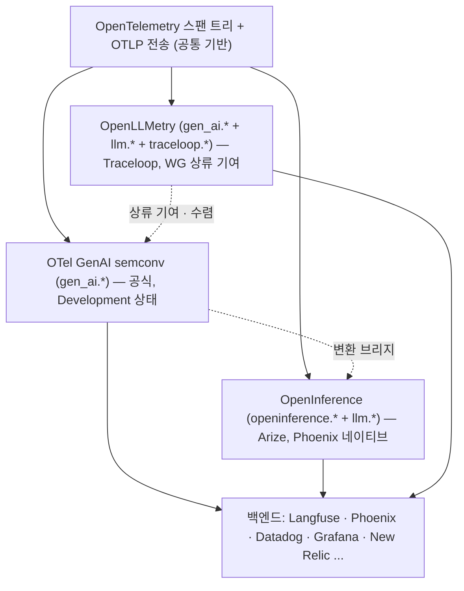

# 표준 레이어와 인접 LLMOps 스택

> 상위 지형도: [README.md](README.md)
>
> 조사 시점 **2026-06**. ① trace를 어떤 규격으로 기록할지의 **표준 레이어**(OTel GenAI semconv · OpenInference · OpenLLMetry)와 ② 옵저버빌리티와 결합해 쓰는 **인접 스택**(게이트웨이 · 평가 프레임워크 · 프롬프트 관리 · 상용 레퍼런스)을 정리한다.

---

# A. 표준 레이어 — gen_ai 시맨틱 컨벤션

## TL;DR

**OTel `gen_ai.*` 가 떠오르는 표준이지만 2026 중반 현재 공식 상태는 여전히 "Development"(미stable, stable 일정 미발표).** OpenInference와 OpenLLMetry는 둘 다 *OTel 스팬/OTLP 위에* 올라가며, 차이는 오직 **속성 네임스페이스** 다.

## A.1 OpenTelemetry GenAI semantic conventions (공식)

- **GenAI SIG**: 2024-04 결성. 범위가 LLM 스팬 → 임베딩·에이전트·프레임워크·MCP·콘텐츠 캡처·평가까지 확장.
- **구조 변화**: `open-telemetry/semantic-conventions`에서 **전용 repo `semantic-conventions-genai`** 로 분리(구 경로 redirect).
- **핵심 속성 리네임 (최신성 주의)**:
  - `gen_ai.system` → **`gen_ai.provider.name`** (~v1.37, 둘 다 현장 혼재)
  - `gen_ai.prompt` / `gen_ai.completion` → **v1.38.0 deprecated** → 구조화된 `gen_ai.input.messages` / `gen_ai.output.messages` / `gen_ai.system_instructions`
  - `gen_ai.operation.name` 필수 (chat · embeddings · execute_tool · invoke_agent · memory…)
- **콘텐츠 캡처 3모드**: 미기록 / 스팬 속성 / 외부 URI 참조. (이벤트와 스팬 속성은 *공존* — "이벤트가 log record로 deprecate" 라는 프레이밍은 부분적으로만 사실.)
- **안정성**: 모든 스팬/이벤트 문서가 `Status: Development`. **stable 없음.** 버전 cadence v1.37 → ~v1.41(2026-05).
- **공식 계측**: `opentelemetry-python-contrib/instrumentation-genai/`(openai-v2·google-genai·langchain·vertexai·weaviate 등) — 모두 **beta**("프로덕션 비권장").

## A.2 OpenInference (Arize)

- Apache-2.0. **OTel 위에** 구축(스팬 모델 + OTLP 사용)하되 자체 네임스페이스(`openinference.*`·`llm.*`·`embedding.*`·`message.*`·`tool.*`·`reranker.*`·`agent.*`).
- 핵심: **모든 스팬에 `openinference.span.kind` 필수**(LLM/EMBEDDING/CHAIN/RETRIEVER/RERANKER/TOOL/AGENT/GUARDRAIL/EVALUATOR/PROMPT) — OTel(span.kind 분류 없이 `gen_ai.operation.name` 사용)과의 최대 구조 차이.
- Python·JS/TS·Java, ~40 계측 패키지. Phoenix 네이티브.
- **수렴은 폐기가 아니라 변환으로**: `@arizeai/openinference-genai`가 `gen_ai.*` → OpenInference 변환. Phoenix는 raw `gen_ai.*` 도 수용하나 *fidelity 감소*(span.kind·구조화 메시지 인덱싱 없음).

## A.3 OpenLLMetry (Traceloop)

- **상류 피더/레퍼런스 구현** 격 — `gen_ai.*` 상당 부분을 seed. Traceloop이 WG 공동 리드, OTel 블로그가 계측 기증자로 명시.
- 혼합 네임스페이스: `gen_ai.*`(OTel 정렬) + `llm.*`(Traceloop 확장) + `traceloop.*`(span.kind·workflow). 과거엔 상류 deprecation을 *뒤따라가는* 시점차가 있었으나 v0.60.0(2026-04)에서 정렬.
- ⚠️ **ServiceNow 인수(2026-03)** 이후 OSS OpenLLMetry 거버넌스 향방은 공식 미발표(릴리스는 지속).

## A.4 백엔드의 OTLP gen_ai 수용

| 백엔드 | `gen_ai.*` 네이티브 | 비고 |
|--------|---------------------|------|
| Datadog LLM Obs | ✅ (v1.37+, 2025-12-01) | OTLP를 자체 스키마로 변환 |
| New Relic / Dynatrace / Honeycomb | ✅ | Dynatrace는 OpenLLMetry도 문서화 |
| Grafana/Tempo | ✅ (OTLP generic) | |
| **Langfuse** | ✅ | **gen_ai + OpenInference + MLflow + 자체 langfuse.*** → 가장 유연 |
| **Phoenix** | ✅ (fidelity 감소) | OpenInference 네이티브 |
| SigNoz/Uptrace/OpenObserve | ✅ (verbatim) | OTel 네이티브는 속성 그대로 보존 |

> **OTel-네이티브 백엔드**는 속성을 그대로 보존, **OTel-호환 벤더(Datadog·NR·Dynatrace·Elastic)**는 OTLP를 독자 스키마로 번역(속성 rename/drop 가능).

**종합**: 업계는 **OTLP + `gen_ai.*` 를 공용어** 로 수렴 중이나, "canonical = 합의된 방향" 일 뿐 *동결된 계약은 아니다*(pre-Stable). 도구를 고를 때 **OTLP 입출력 지원** 을 락인 회피의 1순위 체크포인트로 삼는 게 합리적.

---

# B. LLM 게이트웨이 / 프록시 (OSS)

게이트웨이는 모든 LLM 호출을 단일 엔드포인트로 통합하면서 **로깅/옵저버빌리티 주입점** 을 겸한다 → 옵저버빌리티 플랫폼과 짝을 이룬다.

## B.1 LiteLLM (BerriAI/litellm) — ✅ Active

- **라이선스**: **MIT core + 상용 enterprise.** Python. ~50K stars.
- 100+ 프로바이더를 **OpenAI 호환 단일 API** 로 통합. Python SDK + **프록시 서버** 양형.
- OSS: 라우팅·폴백·로드밸런싱·캐싱·예산·virtual key·spend 추적 + **옵저버빌리티 콜백**(Langfuse·OTel·Prometheus·Arize/Phoenix·MLflow·Helicone).
- Enterprise: SSO/SAML·RBAC·감사로그·JWT.
- **LLMOps에서 중심적인 이유**: 모든 호출이 통과하므로 *로깅/옵저버빌리티 삽입 지점* 을 겸한다. 전형 조합 — `LiteLLM proxy → Langfuse 콜백`.

## B.2 Portkey (Portkey-AI/gateway) — ⚠️ 인수됨

- **라이선스**: OSS 게이트웨이 MIT/Apache(LICENSE 직접 확인 권장), 플랫폼은 상용. TS, 경량(<1ms 지연 주장). 1,600+ 모델/250+ 프로바이더, 재시도·폴백·로드밸런싱·가드레일·virtual key.
- 상용 컨트롤 플레인 = 영속 옵저버빌리티/대시보드 + 시맨틱 캐시 + RBAC + 컴플라이언스.
- ⚠️ **Palo Alto Networks 인수(2026-05, Prisma AIRS로 흡수)** — OSS 게이트웨이 repo 향후 불명.

## B.3 기타
- **Cloudflare AI Gateway** — 독점 SaaS(OSS repo 없음). 코어 무료(대시보드·캐싱·rate limit·폴백·DLP), Unified Billing +5%.
- **Kong AI Gateway** — Kong core + 6개 기본 AI 플러그인 = **Apache-2.0**(Lua/OpenResty). 프로덕션 멀티-LLM 기능(AI Proxy Advanced·token rate-limit·semantic cache·GUI)은 Enterprise.

---

# C. 오픈소스 평가 프레임워크

평가는 LLMOps의 핵심 축이다. 이들은 *옵저버빌리티 플랫폼 안으로 점수를 푸시* 하는 방식으로 결합한다.

## C.1 Ragas (vibrantlabsai/ragas) — ✅ Active
- **라이선스**: **Apache-2.0**(org명 explodinggradients → **Vibrant Labs** 변경). Python. v0.4.3(2026-01).
- RAG 평가 특화: faithfulness·response relevancy·context precision/recall·noise sensitivity·factual correctness + 에이전트(tool-call/goal accuracy) + 결정론(BLEU·ROUGE·semantic similarity·SQL equivalence).
- **통합**: 점수를 계산해 **Langfuse/LangSmith/Phoenix trace의 스코어 API로 푸시.**

## C.2 DeepEval (confident-ai/deepeval) — ✅ Active
- **라이선스**: **Apache-2.0.** Python(+TS). **pytest 스타일**("LLM 단위 테스트"). 50+ 메트릭 — 대표 **G-Eval**(CoT LLM-judge) + DAG·RAG·hallucination·bias·toxicity·agentic·conversational·multimodal.
- **레드팀은 별도 형제 repo DeepTeam**(OWASP/NIST/MITRE). 상용 **Confident AI** 가 호스팅 트레이싱·온라인 평가·대시보드 추가.

## C.3 promptfoo (promptfoo/promptfoo) — ⚠️ 인수됨(MIT 유지)
- **라이선스**: **MIT.** TS, local-first, YAML 구동. 55+ assertion(결정론: equals/contains/regex/JSON-schema/BLEU/ROUGE; 모델-grade: G-Eval·llm-rubric·factuality).
- 내장 **레드팀 모드**(50+ 공격 플러그인 + OWASP LLM Top 10). CLI + 웹 UI + CI. "프롬프트가 머신을 떠나지 않음."
- ⚠️ **OpenAI 인수(2026-03)** — repo는 "MIT·오픈소스 유지" 표명, 기술은 OpenAI Frontier에 흡수.

---

# D. 프롬프트 관리 (OSS) & 상용 레퍼런스

## D.1 프롬프트 관리 OSS

| 도구 | 라이선스/상태 | 요약 |
|------|----------------|------|
| **Agenta** (Agenta-AI/agenta) | MIT open-core · ✅ Active(v0.104, 4.2K★) | LLM 플레이그라운드 · Git-유사 프롬프트 버저닝(variant/commit/env) · 20+ evaluator · **OTel 네이티브 옵저버빌리티**(OpenLLMetry/OpenInference 호환) · 프롬프트 레지스트리. 셀프호스트 무제한 + 무료 클라우드. RBAC/SSO/감사로그는 Enterprise |
| **Pezzo** (pezzolabs/pezzo) | Apache-2.0 · ❌ 방치 | 프롬프트 버저닝·옵저버빌리티·비용/지연. 2024-05 이후 릴리스 없음, 창업자 이직 → **신규 채택 비권장** |
| **Athina AI** | 주로 상용 SaaS · 협소 OSS | `athina-evals` SDK는 **라이선스 미선언(법적 모호 — flag)**, `athina-logger`만 MIT. 플랫폼(프롬프트·Flows·Datasets·Evals·옵저버빌리티)은 클라우드, 셀프호스트는 Enterprise |

## D.2 상용 레퍼런스 (비-오픈소스 — 비교 기준)

> 오픈소스가 아니지만, OSS 도구의 위치를 가늠하려면 비교 기준이 필요하다.

| 플랫폼 | 라이선스 | 요약 |
|--------|----------|------|
| **LangSmith** (LangChain) | **폐쇄 SaaS** | 시장 리더. 프레임워크 비종속이나 OSS LangChain/LangGraph(둘 다 MIT)와 거의 무설정 결합 — **노드별 state diff·replay** 가 강점. 트레이싱·디버깅·evals·Prompt Hub·datasets·어노테이션. Developer $0(5K trace 후 $2.50/1k) · Plus $39/seat · **셀프호스트는 Enterprise 한정** |
| **Datadog LLM Observability** | 폐쇄 | APM 통합(LLM 스팬을 인프라 trace와 동일 trace에). 프롬프트/응답 클러스터링·내장 evals·Sensitive Data Scanner(PII)·800+ 모델 비용. **LLM 스팬 수로만 과금**(~$1.70/M 스팬, 100K 이후) on top of APM |
| **W&B Weave** (CoreWeave) | **하이브리드** | Weave SDK는 **Apache-2.0 OSS**, 호스팅 플랫폼은 상용. **CoreWeave 인수(2025-05 종료, ~$1.7B), 리브랜드 없음.** Traces·Evaluations·Monitors·Playground·Guardrails |
| **Braintrust** | 폐쇄 | eval 우선. $80M Series B(~$800M, 2026-02). evals·실험·플레이그라운드·로깅·datasets·CI 스코어 게이팅. **사용량 기반 과금**(per-seat 아님): Free / Pro $249 / Enterprise(on-prem 옵션) |
| **Arize AX** | 폐쇄(OSS 형제 = **Phoenix**) | Copilot·온라인 evals·드리프트/bias·HIPAA |
| **HoneyHive** | 폐쇄, OTel 네이티브 | 하이브리드 auto + human-in-the-loop eval, VPC 배포 옵션 |
| **PromptLayer** | 폐쇄 | 비기술자용 프롬프트 관리, $12/seat~ |

**상용 vs OSS를 가르는 축**:
1. **데이터 거주성** — OSS는 자유 셀프호스트, 상용은 Enterprise 게이트.
2. **과금 모델** — 상용은 per-trace/span/score 또는 per-seat 미터링, OSS는 인프라 비용만.
3. **엔터프라이즈 기능**(SSO·RBAC·SLA·컴플라이언스·Copilot)이 유료 티어에 집중.
4. **OSS-sibling 패턴이 지배적** — Arize AX↔Phoenix, Weave SDK↔W&B, LangChain↔LangSmith. OSS로 채택을 끌고, 호스팅으로 수익화.
5. **OTel 수렴** 이 락인을 좁히는 중(Phoenix·HoneyHive·LiteLLM·Agenta 모두 OTel 네이티브).

---

## 종합 인사이트

1. **표준은 아직 동결 전이다.** `gen_ai.*` 는 방향이지 stable 계약이 아니다(2026-06 Development). 속성명이 바뀌므로(`system`→`provider.name`, `prompt/completion`→구조화 messages) SDK·백엔드 버전 호환을 주시해야 한다.
2. **OTLP 입출력 지원 = 락인 회피의 핵심 보험.** 2026 인수 물결(Traceloop→ServiceNow, Portkey→PANW, promptfoo→OpenAI)에서 살아남는 전략은 표준 와이어로 다른 백엔드에 빠질 수 있는 능력.
3. **레이어 결합이 정석.** 단일 도구로 다 하려 말고 — `게이트웨이(LiteLLM) + 옵저버빌리티(Langfuse/Phoenix) + 평가(Ragas/DeepEval, 점수 푸시)` 처럼 레이어별 최적 도구를 OTel/스코어 API로 엮는다.
4. **인수가 OSS 종료를 뜻하진 않지만 거버넌스 리스크는 실재.** Weave SDK는 인수 후에도 Apache-2.0 유지, promptfoo도 MIT 유지 표명. 그러나 OSS 거버넌스가 명시되지 않은 케이스(Traceloop·Portkey)는 모니터링 대상.

---

### 출처
- OTel GenAI: [github.com/open-telemetry/semantic-conventions-genai](https://github.com/open-telemetry/semantic-conventions-genai) · [opentelemetry.io GenAI](https://opentelemetry.io/docs/specs/semconv/gen-ai/)
- OpenInference: [github.com/Arize-ai/openinference](https://github.com/Arize-ai/openinference)
- OpenLLMetry: [github.com/traceloop/openllmetry](https://github.com/traceloop/openllmetry) · [ServiceNow 인수](https://www.servicenow.com/company/media/press-room.html)
- LiteLLM: [github.com/BerriAI/litellm](https://github.com/BerriAI/litellm) · [enterprise](https://docs.litellm.ai/docs/proxy/enterprise) · [Langfuse 통합](https://langfuse.com/integrations/gateways/litellm)
- Portkey: [github.com/Portkey-AI/gateway](https://github.com/Portkey-AI/gateway) · [PANW 인수](https://www.paloaltonetworks.com/company/press/2026/palo-alto-networks-completes-acquisition-of-portkey-to-secure-ai-agents)
- Ragas: [github.com/vibrantlabsai/ragas](https://github.com/vibrantlabsai/ragas) · DeepEval: [github.com/confident-ai/deepeval](https://github.com/confident-ai/deepeval) · promptfoo: [github.com/promptfoo/promptfoo](https://github.com/promptfoo/promptfoo) · [OpenAI 인수](https://techcrunch.com/2026/03/09/openai-acquires-promptfoo-to-secure-its-ai-agents/)
- Agenta: [github.com/Agenta-AI/agenta](https://github.com/Agenta-AI/agenta)
- LangSmith: [langchain.com/pricing-langsmith](https://www.langchain.com/pricing-langsmith) · Datadog: [datadoghq.com/product/ai/llm-observability](https://www.datadoghq.com/product/ai/llm-observability/2/) · Weave: [wandb.ai/site/weave](https://wandb.ai/site/weave/) · Braintrust: [braintrust.dev/pricing](https://www.braintrust.dev/pricing)
