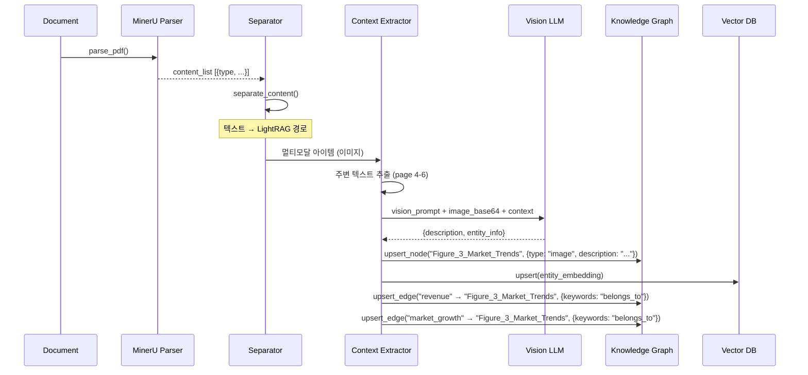
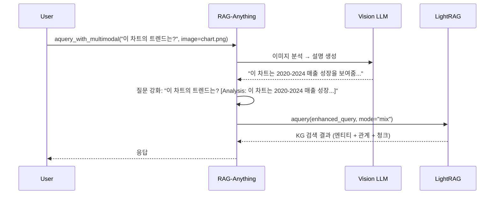

# RAG-Anything 심층 분석 — 멀티모달 Knowledge Graph RAG

> **대상**: https://github.com/HKUDS/RAG-Anything
> **핵심 정의**: LightRAG 위에 **멀티모달 문서 이해 파이프라인**을 얹어, 이미지/표/수식을 KG 의 1급 엔티티로 처리하는 RAG 시스템
> **출처**: 홍콩대학교 데이터 사이언스 연구실 (HKUDS) — LightRAG 와 동일 팀
> **라이선스**: MIT
> **언어**: Python (~11K LOC)
> **의존성**: LightRAG (KG+벡터 RAG), MinerU (문서 파싱), Vision LLM (이미지 분석)

---

## 1. 프로젝트 개요

### 1.1 해결하려는 문제

LightRAG 는 **텍스트 전용** KG-RAG 이다. 하지만 현실의 문서(논문, 기술 보고서, 금융 보고서)에는 **이미지, 표, 수식, 코드 블록** 이 텍스트와 뒤섞여 있다. 표준 RAG 와 LightRAG 모두 이 멀티모달 콘텐츠를 처리하지 못한다:

- **이미지/다이어그램**: 파일명만 남거나 완전히 무시됨
- **표**: 텍스트로 납작하게 펴지면서 구조적 정보가 유실
- **수식**: LaTeX 문자열이 의미적으로 해석되지 않음
- **모달 간 관계**: "이 표가 저 수식을 증명한다" 같은 cross-modal 연결이 포착되지 않음

### 1.2 핵심 혁신 — "멀티모달 콘텐츠를 KG 의 1급 엔티티로"

RAG-Anything 은 LightRAG 의 KG 인프라를 그대로 쓰되, 이미지/표/수식을 **Vision LLM 으로 분석하여 의미적 설명을 생성** 하고, 이 설명을 **KG 노드로 삽입** 한다. 결과적으로:

- "Figure 3" 이 `Figure_3_Market_Trends` 라는 엔티티 노드가 됨
- 이 노드가 "revenue", "market_growth" 같은 텍스트 엔티티와 `belongs_to` 관계로 연결됨
- 쿼리 시 "Figure 3 이 보여주는 트렌드는?" 으로 물으면 KG 탐색으로 관련 엔티티 + 원본 텍스트가 함께 검색됨

---

## 2. 핵심 특징 및 차별점

### 2.1 LightRAG 대비 확장 요약

| 축 | LightRAG | RAG-Anything |
|---|---|---|
| **입력** | 텍스트만 | 텍스트 + 이미지 + 표 + 수식 + PDF |
| **문서 파싱** | 외부 (사용자 책임) | 내장 (MinerU + 포맷 변환기) |
| **엔티티 타입** | 텍스트에서 추출된 개념 | 추출 개념 + 멀티모달 (이미지, 표, 수식) |
| **엔티티 설명** | LLM 텍스트 요약 | Vision LLM 멀티모달 분석 |
| **엔티티 관계** | 텍스트 추론 | 텍스트 추론 + cross-modal `belongs_to` |
| **쿼리 모달리티** | 텍스트만 | 텍스트 + 멀티모달 (이미지 첨부 가능) |
| **설정** | 최소 | 상세 (파서, 모달리티, 컨텍스트, 배치) |
| **관찰성** | 로깅 | 콜백 시스템 (모든 단계) |

### 2.2 지원 모달리티

| 모달리티 | 프로세서 | 핵심 동작 | 출력 |
|----------|----------|-----------|------|
| **이미지** | `ImageModalProcessor` | Vision 모델 분석 (GPT-4V, Claude Vision) | 풍부한 캡션 + 엔티티 추출 |
| **표** | `TableModalProcessor` | 구조 분석 + 통계 | 의미 주석이 달린 데이터 |
| **수식** | `EquationModalProcessor` | 수학 표현식 파싱 | 변수 식별 + 의미 설명 |
| **일반** | `GenericModalProcessor` | 폴백 처리 | 일반 콘텐츠 설명 |

### 2.3 컨텍스트 인지 처리 (Context-Aware Processing)

RAG-Anything 의 **핵심 차별화 패턴**: 멀티모달 콘텐츠를 분석할 때 **주변 텍스트를 함께 제공** 한다.

```python
class ContextExtractor:
    def extract_context(self, content_source, current_item_info, content_format="auto"):
        if self.config.context_mode == "page":
            return self._extract_page_context(content_list, current_item_info)
        elif self.config.context_mode == "chunk":
            return self._extract_chunk_context(content_list, current_item_info)
```

예: 5페이지의 이미지를 분석할 때 4-6페이지의 텍스트를 컨텍스트로 제공 → Vision 모델이 "이 다이어그램이 이전 논의에서 뭘 설명하는지" 를 이해한다.

설정 파라미터:
- `context_window`: 주변 페이지/청크 수 (기본 1)
- `context_mode`: `page` / `chunk` / `token`
- `max_context_tokens`: 최대 컨텍스트 토큰 (기본 2000)
- `include_headers`, `include_captions`: 선택적 포함

### 2.4 MinerU 기반 문서 파싱

```
PDF/Office/텍스트/이미지
    ↓ MinerU 2.0
구조화된 content_list:
[
    {"type": "text", "text": "...", "page_idx": 0},
    {"type": "image", "img_path": "...", "image_caption": [...], "page_idx": 1},
    {"type": "table", "table_body": "...", "table_caption": [...], "page_idx": 2},
    {"type": "equation", "text": "...", "latex": "...", "page_idx": 2}
]
```

- **PDF**: MinerU 직접 파싱
- **Office 문서**: LibreOffice 로 PDF 변환 → MinerU 파싱
- **텍스트**: ReportLab 로 PDF 변환 → MinerU 파싱
- **이미지**: 미지원 포맷(BMP, GIF, WebP) → PNG 변환 후 파싱
- **MinerU 1.x/2.0 호환**: 필드 별명 자동 매핑 (`img_caption` → `image_caption`)

### 2.5 Robust JSON 파싱 — Vision LLM 의 불안정한 출력 대응

Vision LLM 은 종종 불완전한 JSON 을 반환한다 (LaTeX 특수문자, 스마트 따옴표 등). RAG-Anything 은 **4단계 파싱 전략** 으로 대응:

```python
def _robust_json_parse(self, response: str) -> dict:
    # 전략 1: 직접 파싱
    # 전략 2: 기본 정리 (스마트 따옴표, 후행 쉼표)
    # 전략 3: LaTeX 이스케이프 진행형 수정 (\alpha → \\alpha)
    # 전략 4: 정규식 필드 추출 (최후 수단)
    return self._extract_fields_with_regex(response)
```

그리고 `<think>` 태그(reasoning 모델 출력)도 사전 제거한다.

---

## 3. 아키텍처 분석

### 3.1 전체 시스템 구조

```mermaid
flowchart TB
    subgraph Input["문서 입력"]
        PDF[PDF]
        OFFICE[Word/Excel/PPT]
        IMG[이미지]
        TXT[텍스트]
    end

    subgraph Parsing["문서 파싱 (MinerU)"]
        MINERU[MinerU 2.0<br/>구조 추출]
        CONVERT[포맷 변환<br/>Office→PDF<br/>BMP→PNG]
        CACHE[파싱 캐시<br/>mtime + method 기반]
    end

    subgraph Separation["콘텐츠 분리"]
        SEP{type?}
        TEXT_PARTS[텍스트 부분]
        MM_ITEMS[멀티모달 아이템<br/>이미지/표/수식]
    end

    subgraph TextPath["텍스트 경로 (LightRAG)"]
        LR_INSERT[LightRAG.ainsert()<br/>엔티티/관계 추출<br/>KG 구축]
    end

    subgraph ModalPath["멀티모달 경로"]
        CTX[ContextExtractor<br/>주변 페이지/청크 추출]
        PROC{모달리티 타입?}
        IMG_PROC[ImageModalProcessor<br/>Vision LLM 분석]
        TBL_PROC[TableModalProcessor<br/>구조 분석]
        EQ_PROC[EquationModalProcessor<br/>수식 파싱]
        GEN_PROC[GenericModalProcessor<br/>폴백]

        ENTITY[엔티티 생성<br/>KG 노드 + 벡터 임베딩]
        RELS[관계 추출<br/>cross-modal belongs_to]
    end

    subgraph KG["LightRAG Knowledge Graph"]
        NODES[(엔티티 노드<br/>텍스트 + 멀티모달)]
        EDGES[(관계 엣지<br/>텍스트 + cross-modal)]
        VDB[(벡터 인덱스<br/>entities/relations/chunks)]
    end

    subgraph Query["쿼리"]
        Q[사용자 질문<br/>+ 선택적 이미지/표]
        ENHANCE[멀티모달 쿼리 강화<br/>이미지→설명 변환]
        LR_QUERY[LightRAG.aquery()<br/>5가지 모드]
    end

    Input --> Parsing
    PDF --> MINERU
    OFFICE --> CONVERT --> MINERU
    MINERU --> CACHE --> SEP
    SEP -->|text| TEXT_PARTS --> LR_INSERT --> KG
    SEP -->|image/table/eq| MM_ITEMS --> CTX --> PROC
    PROC -->|image| IMG_PROC --> ENTITY
    PROC -->|table| TBL_PROC --> ENTITY
    PROC -->|equation| EQ_PROC --> ENTITY
    PROC -->|other| GEN_PROC --> ENTITY
    ENTITY --> KG
    ENTITY --> RELS --> KG

    Q --> ENHANCE --> LR_QUERY --> KG
```

### 3.2 멀티모달 엔티티가 KG 에 들어가는 흐름



### 3.3 멀티모달 쿼리 흐름



---

## 4. 기술 스택

| 영역 | 기술 |
|------|------|
| RAG 엔진 | **LightRAG** (KG + 벡터 하이브리드) |
| 문서 파싱 | **MinerU 2.0** (PDF 구조 추출) |
| Vision LLM | GPT-4V, Claude Vision (멀티모달 분석) |
| 포맷 변환 | LibreOffice (Office→PDF), ReportLab (텍스트→PDF), Pillow (이미지 변환) |
| Markdown | WeasyPrint, Pandoc (Enhanced Markdown → PDF) |
| 비동기 | asyncio + Semaphore (배치 동시성 제어) |

---

## 5. 핵심 코드 분석

### 5.1 콘텐츠 분리 — 텍스트 vs 멀티모달

```python
# utils.py:13-56
def separate_content(content_list: List[Dict]) -> Tuple[str, List[Dict]]:
    """핵심 패턴: 텍스트와 멀티모달을 분리"""
    text_parts = []
    multimodal_items = []
    for item in content_list:
        if item.get("type") == "text":
            text_parts.append(item.get("text", ""))
        else:  # image, table, equation, etc.
            multimodal_items.append(item)
    text_content = "\n\n".join(text_parts)
    return text_content, multimodal_items
```

텍스트는 LightRAG 의 기존 `ainsert()` 경로로, 멀티모달은 RAG-Anything 의 새 경로로.

### 5.2 컨텍스트 인지 Vision 모델 호출

```python
# modalprocessors.py:848-940
async def generate_description_only(self, modal_content, content_type, item_info=None):
    image_path = content_data.get("img_path")
    captions = content_data.get("image_caption", [])

    # 주변 컨텍스트 추출 (전후 페이지의 텍스트)
    context = ""
    if item_info and self.content_source:
        context = self._get_context_for_item(item_info)

    # 컨텍스트가 있으면 enriched prompt 사용
    if context:
        vision_prompt = PROMPTS["vision_prompt_with_context"].format(
            context=context, image_path=image_path, captions=captions or "None")
    else:
        vision_prompt = PROMPTS["vision_prompt"].format(
            image_path=image_path, captions=captions or "None")

    # Vision 모델 호출 (GPT-4V / Claude Vision)
    image_base64 = self._encode_image_to_base64(image_path)
    response = await self.modal_caption_func(
        vision_prompt, image_data=image_base64,
        system_prompt=PROMPTS["IMAGE_ANALYSIS_SYSTEM"])

    enhanced_caption, entity_info = self._parse_response(response, entity_name)
    return enhanced_caption, entity_info
```

### 5.3 KG 엔티티 생성 — 멀티모달 노드

```python
# modalprocessors.py:465-545
async def _create_entity_and_chunk(self, modal_chunk, entity_info, file_path, doc_id, chunk_order_index):
    chunk_id = compute_mdhash_id(str(modal_chunk), prefix="chunk-")

    # 1. 텍스트 청크 저장
    await self.text_chunks_db.upsert({chunk_id: {
        "tokens": len(self.tokenizer.encode(modal_chunk)),
        "content": modal_chunk, "full_doc_id": doc_id}})
    await self.chunks_vdb.upsert({chunk_id: chunk_vdb_data})

    # 2. KG 에 엔티티 노드 생성
    await self.knowledge_graph_inst.upsert_node(entity_info["entity_name"], {
        "entity_id": entity_info["entity_name"],   # "Figure_3_Market_Trends"
        "entity_type": entity_info["entity_type"],  # "image"
        "description": entity_info["summary"],
        "source_id": chunk_id, "file_path": file_path})

    # 3. 엔티티 벡터 DB 에 삽입
    await self.entities_vdb.upsert({
        compute_mdhash_id(entity_info["entity_name"]): {
            "entity_name": entity_info["entity_name"],
            "content": f"{entity_info['entity_name']}\n{entity_info['summary']}"}})

    # 4. cross-modal 관계 추출 — "belongs_to" 엣지
    chunk_results = await self._process_chunk_for_extraction(chunk_id, entity_info["entity_name"])
    for entity_name in chunk_results.entities:
        if entity_name != modal_entity_name:
            await self.knowledge_graph_inst.upsert_edge(
                entity_name, modal_entity_name,
                {"description": f"Entity belongs to {modal_entity_name}",
                 "keywords": "belongs_to,part_of,contained_in"})
```

### 5.4 4단계 Robust JSON 파싱

```python
# modalprocessors.py:597-640
def _extract_all_json_candidates(self, response: str) -> list:
    candidates = []
    # <think> 태그 제거 (reasoning 모델 출력)
    cleaned = re.sub(r"<think>.*?</think>", "", response, flags=re.DOTALL)

    # 방법 1: 코드 블록 내 JSON
    json_blocks = re.findall(r"```(?:json)?\s*(\{.*?\})\s*```", cleaned, re.DOTALL)
    candidates.extend(json_blocks)

    # 방법 2: 균형 잡힌 중괄호
    brace_count = 0
    start_pos = -1
    for i, char in enumerate(cleaned):
        if char == "{":
            if brace_count == 0: start_pos = i
            brace_count += 1
        elif char == "}":
            brace_count -= 1
            if brace_count == 0 and start_pos != -1:
                candidates.append(cleaned[start_pos:i+1])

    # 방법 3: 단순 정규식
    simple_match = re.search(r"\{.*\}", cleaned, re.DOTALL)
    if simple_match:
        candidates.append(simple_match.group(0))
    return candidates
```

### 5.5 멀티모달 쿼리

```python
# query.py:194-288
async def aquery_with_multimodal(self, query, multimodal_content=None, mode="mix", **kwargs):
    if not multimodal_content:
        return await self.aquery(query, mode=mode, **kwargs)

    # 캐시 확인
    cache_key = self._generate_multimodal_cache_key(query, multimodal_content, mode, **kwargs)
    if self.lightrag.llm_response_cache:
        cached = await self.lightrag.llm_response_cache.get_by_id(cache_key)
        if cached: return cached.get("return")

    # 멀티모달 콘텐츠 → 설명 생성 → 질문 강화
    enhanced_query = await self._process_multimodal_query_content(query, multimodal_content)
    # "이 차트의 트렌드는?" → "이 차트의 트렌드는? [Analysis: 2020-2024 매출 성장 차트...]"

    # KG 쿼리
    result = await self.aquery(enhanced_query, mode=mode, **kwargs)

    # 캐시 저장
    if self.lightrag.llm_response_cache:
        await self.lightrag.llm_response_cache.upsert({cache_key: {"return": result}})
    return result
```

---

## 6. 확장성

| 축 | 매커니즘 |
|---|---|
| **새 모달리티 추가** | `BaseModalProcessor` 상속 + `get_processor_for_type()` 등록 |
| **문서 파서 교체** | `parser` 설정 (mineru / docling / paddleocr) |
| **Vision 모델 교체** | `modal_caption_func` 콜백 (GPT-4V, Claude Vision, 로컬 VLM) |
| **스토리지** | LightRAG 의 10+ 백엔드 그대로 활용 |
| **배치 처리** | `max_concurrent_files` Semaphore + 폴더 재귀 스캔 |
| **언어** | `prompts_zh.py` 로 중국어 프롬프트 별도 관리, `prompt_manager.py` 로 동적 전환 |

---

## 7. 성능 특성

### 7.1 인덱싱 비용

| 단계 | LLM 호출 | 비고 |
|------|----------|------|
| 문서 파싱 (MinerU) | 0 | 로컬 실행 |
| 텍스트 엔티티 추출 | LightRAG 와 동일 | 청크당 1회 |
| **이미지 분석** | **Vision LLM 1회/이미지** | **추가 비용** |
| **표 분석** | **LLM 1회/표** | **추가 비용** |
| **수식 분석** | **LLM 1회/수식** | **추가 비용** |
| cross-modal 관계 추출 | LLM 1회/멀티모달 엔티티 | **추가 비용** |

**요약**: 텍스트 경로는 LightRAG 와 동일하지만, 멀티모달 아이템 1개당 **Vision/LLM 호출 1-2회** 가 추가된다. 이미지 50개가 있는 논문이면 ~50회 추가 호출.

### 7.2 캐싱 전략

| 캐시 | 대상 | 키 |
|------|------|---|
| 파싱 캐시 | MinerU 결과 | file_mtime + parser + method |
| 쿼리 캐시 | LLM 응답 | query + multimodal_content + mode hash |
| LightRAG 캐시 | LLM 응답 / 임베딩 | LightRAG 기본 캐시 그대로 |

### 7.3 배치 처리

```python
async def aprocess_folder(self, folder_path, mode="concurrent", **kwargs):
    semaphore = asyncio.Semaphore(self.config.max_concurrent_files)
    for file in folder_path.glob("**/*" if recursive else "*"):
        async with semaphore:
            content_list, doc_id = await self.parse_document(file)
            text_content, multimodal_items = separate_content(content_list)
            await self._process_multimodal_content(multimodal_items, file, doc_id)
```

---

## 8. 경쟁/비교 분석

### 8.1 vs LightRAG (텍스트 전용)

| 축 | LightRAG | RAG-Anything |
|---|---|---|
| 입력 | 텍스트 | 텍스트 + 이미지 + 표 + 수식 + PDF |
| 엔티티 | 텍스트 추출 개념 | 텍스트 + 멀티모달 (이미지, 표, 수식) |
| 관계 | 텍스트 추론 | 텍스트 + cross-modal `belongs_to` |
| 쿼리 | 텍스트 | 텍스트 + 멀티모달 첨부 |
| 인덱싱 비용 | 텍스트 LLM 만 | + Vision LLM (모달리티당) |
| 문서 파싱 | 외부 | MinerU 내장 |
| JSON 파싱 | 표준 | 4단계 robust 파싱 |
| 코드 규모 | ~17K LOC | ~11K LOC (+ LightRAG 의존) |

### 8.2 vs 다른 멀티모달 RAG

| 축 | RAG-Anything | Unstructured.io + LangChain | ColPali/ColQwen |
|---|---|---|---|
| **접근** | 구조적 파싱 → KG 엔티티화 | 파싱 → 플랫 청크 | 비전 임베딩 직접 검색 |
| **KG** | ✅ LightRAG KG | ❌ | ❌ |
| **cross-modal 관계** | ✅ `belongs_to` 엣지 | ❌ | ❌ |
| **컨텍스트 인지** | ✅ 주변 페이지 텍스트 제공 | ❌ | ❌ |
| **수식 처리** | ✅ 전용 프로세서 | 부분적 | ❌ |
| **검색 정확도** | KG 탐색 + 벡터 | 벡터만 | 비전 임베딩 |

### 8.3 vs WrenAI / DB-GPT

완전히 다른 도메인. RAG-Anything 은 **비구조화 문서** 에서 지식을 추출/검색하고, WrenAI/DB-GPT 는 **구조화된 DB** 에 SQL 을 생성한다.

다만 개념적 유사점이 있다:
- RAG-Anything 의 "멀티모달 엔티티 → KG 노드" = WrenAI 의 "비즈니스 용어 → MDL 모델"
- 둘 다 **비구조화된 것을 구조화** 하여 LLM 이 더 정확하게 작업하도록 돕는다

---

## 9. 종합 평가

### 강점

1. **LightRAG 위의 깔끔한 레이어링**: 11K LOC 으로 LightRAG 의 모든 기능을 유지하면서 멀티모달을 추가. 아키텍처가 깔끔하고 비침습적.

2. **컨텍스트 인지 처리**: "이미지만 분리해서 분석" 하는 게 아니라 **주변 텍스트를 함께 제공** 하는 것은 실제 문서 이해에서 매우 중요하다. 논문의 Figure 3 을 분석할 때 "Section 2.3 에서 논의한 결과를 시각화" 라는 맥락이 없으면 의미 있는 분석이 불가능하다.

3. **cross-modal `belongs_to` 관계**: "이 수식이 저 표에서 계산된다", "이 다이어그램이 이 개념을 설명한다" 같은 관계를 KG 에 명시적으로 인코딩하는 것은 **다른 멀티모달 RAG 에서는 볼 수 없는** 기능.

4. **Robust JSON 파싱**: Vision LLM 의 불안정한 출력을 4단계 전략으로 안정적으로 처리. LaTeX 이스케이프, reasoning 태그 제거 등 실전 문제를 잘 풀었다.

5. **MinerU 통합**: PDF 구조 추출의 최신 SOTA 를 직접 통합. Unstructured.io 대비 더 정확한 레이아웃 분석.

### 약점/리스크

1. **Vision LLM 비용**: 이미지 50개짜리 문서면 ~50회 Vision API 호출. GPT-4V 기준 이미지당 ~$0.01-0.03 → 문서당 $0.5-1.5 추가. 대규모 문서 라이브러리에서는 비용이 급증.

2. **MinerU 의존성**: MinerU 는 별도 설치가 필요하고 (PyTorch + PaddleOCR), 환경 설정이 까다로울 수 있다.

3. **Vision 모델 품질 의존**: 이미지 분석의 품질이 Vision LLM 에 전적으로 의존. 복잡한 기술 다이어그램이나 손글씨는 정확도가 떨어질 수 있다.

4. **`belongs_to` 관계의 정밀도**: LLM 이 추출한 텍스트 엔티티와 멀티모달 엔티티 사이의 `belongs_to` 관계가 항상 정확하지는 않을 수 있다.

5. **쿼리 시 멀티모달 강화의 한계**: 이미지를 첨부해 쿼리할 때 "이미지 → 설명 → 텍스트 쿼리" 로 변환하므로, 시각적 세부사항(색상, 레이아웃)은 유실될 수 있다.

### 적합 사례

- **학술 논문 분석**: 그림, 표, 수식이 핵심인 STEM 논문
- **기술 보고서**: 아키텍처 다이어그램 + 성능 표 + 코드
- **금융 보고서**: 차트 + 재무제표 + 텍스트 분석
- **의료 문서**: 의학 이미지 + 검사 결과 표 + 진단 텍스트

### 부적합 사례

- 텍스트만 있는 문서 (LightRAG 로 충분)
- 실시간 처리가 필요한 경우 (Vision LLM 지연)
- 비용에 극도로 민감한 환경
- 이미지가 매우 많은 문서 (사진 앨범 등)

---

## 10. 엔지니어 관점 인사이트

### 10.1 "비구조화된 것을 구조화하는 것이 AI 시스템의 핵심 패턴"

- **WrenAI**: 비즈니스 용어를 MDL 로 *수동* 구조화 → SQL 정확도 향상
- **LightRAG**: 텍스트에서 엔티티/관계를 *자동* 구조화 → 검색 정확도 향상
- **RAG-Anything**: 멀티모달 콘텐츠를 KG 엔티티로 *자동* 구조화 → 멀티모달 검색 가능

이 패턴은 **에이전트 시스템의 메모리** 에도 적용된다: 대화를 단순 저장하는 것보다 엔티티/관계로 구조화하면 검색 품질이 높아진다 (GoClaw L2 KG, DB-GPT InsightExtractor).

### 10.2 "컨텍스트 인지 처리는 멀티모달 AI 의 필수"

이미지를 독립적으로 분석하는 것과 **주변 텍스트와 함께** 분석하는 것은 품질 차이가 크다. 이것은 에이전트의 "system reminder" 나 "conversation history injection" 과 같은 원리 — **맥락이 있어야 정확한 판단이 가능하다**.

### 10.3 "LightRAG + RAG-Anything = 멀티모달 KG-RAG 풀 스택"

두 프로젝트를 결합하면:
- LightRAG: 텍스트 기반 KG 구축 + 5가지 쿼리 모드 + 10+ 스토리지
- RAG-Anything: 멀티모달 파싱 + Vision 분석 + cross-modal 관계

이것은 "범용 문서 이해 플랫폼" 에 가장 가까운 OSS 조합이다.

### 10.4 이전 분석 프로젝트와의 연결

| RAG-Anything 패턴 | 유사 패턴 |
|---|---|
| cross-modal `belongs_to` 관계 | GoClaw: Vault AfterWrite → 자동 문서 등록 + 메타데이터 |
| 컨텍스트 인지 처리 | GoClaw: ContextStage 의 L0 메모리 자동 주입 |
| robust JSON 파싱 | GoClaw: 원래 tool_call 파싱 에러 처리 |
| 캐싱 전략 | WrenAI: 쿼리 결과 TTL 캐시 |
| 배치 Semaphore | openharness: asyncio.gather + 동시성 제한 |
