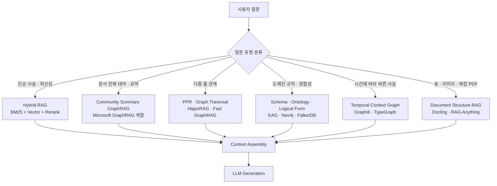
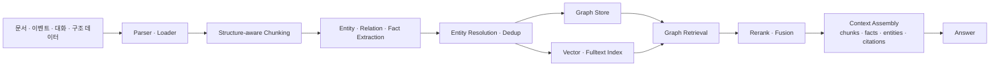
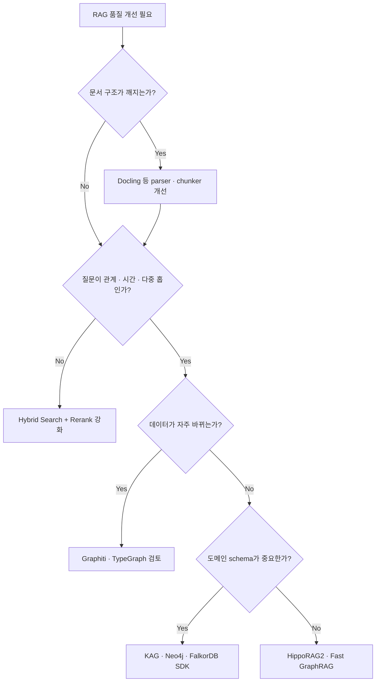

# RAG · GraphRAG 최신 기술 및 오픈소스 확장 조사

> 작성일: 2026-06-07
> 범위: 기존 조사에서 이미 다룬 Microsoft GraphRAG, LightRAG, RAG-Anything, RAGFlow, Agentic RAG, chunking 분석을 반복하지 않고, 2025-2026년에 주목도가 높아진 RAG · GraphRAG 계열 기술과 오픈소스를 확장 조사한다.

## 1. 프로젝트 개요

### Problem Statement

기존 RAG의 핵심 한계는 여전히 세 가지다.

1. **청크 단위 의미 손실**: 문서 구조, 표, 이미지, 계층, 시간 관계가 평평한 텍스트 청크로 깨진다.
2. **관계형 질문의 약함**: "A가 B에 영향을 준 경로", "여러 문서에 흩어진 원인과 결과", "시간에 따라 바뀐 사실"처럼 다중 홉 추론이 필요한 질문에서 단순 벡터 검색은 흔들린다.
3. **운영 비용과 갱신성**: GraphRAG는 품질을 높일 수 있지만, LLM 기반 KG 구축, community summarization, 전량 재인덱싱 비용이 커서 동적 데이터에 부담이 된다.

최근의 흐름은 "GraphRAG가 Vector RAG를 대체한다"가 아니라, **질문 유형과 데이터 형태에 따라 retrieval primitive를 조합하는 방향**이다. GraphRAG-Bench 같은 벤치마크도 이 질문을 정면으로 다룬다. 즉, 엔지니어링 관점에서는 다음 질문이 중요하다.

- 관계, 시간, provenance가 실제로 답 품질을 높이는 도메인인가?
- 그래프를 매번 새로 만들지 않고 증분 갱신할 수 있는가?
- LLM 추출 노이즈를 schema, ontology, reranking, entity resolution으로 제어할 수 있는가?
- 문서 파싱과 chunking이 graph retrieval보다 먼저 병목이 되는가?

### 기존 조사와의 중복 제외

| 기존 문서 | 이번 문서에서의 처리 |
|---|---|
| `ai-infrastructure/agentic-rag/agentic-rag-research.md` | Self-RAG, CRAG, adaptive routing은 반복하지 않고 GraphRAG 쪽 routing과 비교에만 사용 |
| `ai-infrastructure/graph-rag-ontology/` | 온톨로지·Graph DB·KG 개념 설명은 반복하지 않고 구현체의 schema/ontology 사용 방식만 비교 |
| `ai-infrastructure/lightrag/analysis.md` | LightRAG는 baseline 비교 기준으로만 사용 |
| `ai-infrastructure/rag-anything/analysis.md` | 멀티모달 KG-RAG는 이미 분석되어 있어 Docling 중심의 문서 파싱 계층만 추가 |
| `ai-infrastructure/ragflow/analysis.md` | RAG application platform 분석은 반복하지 않음 |
| `ai-infrastructure/chunking/chunking-oss-guide.md` | chunking 일반론은 반복하지 않고 layout-aware chunking만 연결 |

## 2. 핵심 특징 및 차별점

### 2.1 최신 흐름 요약

| 흐름 | 핵심 아이디어 | 대표 OSS |
|---|---|---|
| Temporal Graph Memory | 사실의 유효 기간과 변경 이력을 그래프 edge에 넣고, 최신/과거 상태를 질의 | Graphiti, TypeGraph |
| KG-first · Schema-first RAG | OpenIE 노이즈를 줄이기 위해 schema, ontology, logical form으로 추출과 추론을 제약 | KAG, Neo4j GraphRAG, FalkorDB GraphRAG-SDK |
| Low-cost Graph Retrieval | expensive community summarization 대신 PPR, graph traversal, late ranking으로 추론 | HippoRAG2, Fast GraphRAG, TypeGraph |
| Graph-native Production SDK | 특정 graph DB 위에서 ingestion, entity resolution, vector/fulltext/graph search를 SDK화 | Neo4j GraphRAG Python, FalkorDB GraphRAG-SDK |
| Document Structure RAG | PDF, 표, 그림, 계층 구조를 보존해 retrieval 입력 품질을 올림 | Docling |
| Benchmark-driven GraphRAG | GraphRAG가 잘하는 질문 유형을 벤치마크로 분리 | GraphRAG-Bench, WildGraphBench |

### 2.2 기술 지형도

## 3. 아키텍처 분석

### 3.1 공통 GraphRAG 파이프라인

최근 OSS들을 비교하면 대부분 다음 공통 구조를 가진다.

구현체별 차이는 **EXTRACT, RESOLVE, RETRIEVE** 세 지점에서 가장 크다.

- Graphiti: episode 기반 raw provenance와 temporal edge를 핵심 모델로 둔다.
- KAG: OpenSPG schema와 logical form solver를 중심에 둔다.
- HippoRAG2/Fast GraphRAG/TypeGraph: query seed에서 Personalized PageRank로 graph activation을 퍼뜨린다.
- Neo4j/FalkorDB SDK: Graph DB의 vector/fulltext/Cypher/graph traversal을 하나의 SDK로 묶는다.
- Docling: GraphRAG 자체보다 전처리와 document representation 계층을 강화한다.

### 3.2 Retrieval 패턴 비교

```mermaid
flowchart TB
    subgraph StaticKG["정적 KG · 문서 그래프"]
        A1["문서 청크"] --> A2["OpenIE · LLM 추출"]
        A2 --> A3["Entity · Relation Graph"]
        A3 --> A4["Vector + Fulltext + Traversal"]
    end

    subgraph TemporalKG["Temporal Context Graph"]
        B1["Episode Stream"] --> B2["Fact Edge"]
        B2 --> B3["valid_at · invalid_at · provenance"]
        B3 --> B4["현재 상태 · 과거 상태 질의"]
    end

    subgraph PPRKG["PPR 기반 Graph Retrieval"]
        C1["Query Entity Seeds"] --> C2["Personalized PageRank"]
        C2 --> C3["관련 Entity · Fact · Chunk 랭킹"]
    end

    subgraph SchemaKG["Schema · Logical Form"]
        D1["Domain Schema"] --> D2["Schema-constrained Extraction"]
        D2 --> D3["Logical Plan"]
        D3 --> D4["Retriever · Reasoner · Calculator"]
    end
```

## 4. 기술 스택

| 프로젝트 | 언어 · 런타임 | 주요 저장소 · 검색 | 주요 의존/방식 | 라이선스 |
|---|---|---|---|---|
| Graphiti | Python 3.10+ | Neo4j, FalkorDB, Neptune, OpenSearch | LLM extraction, embeddings, BM25/fulltext, graph traversal, cross-encoder | Apache-2.0 |
| KAG | Python, OpenSPG | OpenSPG engine | schema-free + schema-constrained extraction, logical form solver, MCP | Apache-2.0 |
| HippoRAG2 | Python | igraph, embedding stores | OpenIE, entity/fact/chunk embeddings, PPR, DSPy rerank | MIT |
| Fast GraphRAG | Python | igraph, hnswlib, pickle storage | async ingestion, entity VDB, CSR matrix scoring, PPR-style graph ranking | MIT |
| FalkorDB GraphRAG-SDK | Python | FalkorDB | strategy-based ingestion/retrieval, Cypher, vector/fulltext indexes | Apache-2.0 |
| Neo4j GraphRAG Python | Python | Neo4j | vector/fulltext/Cypher retrievers, experimental KG builder pipeline | Apache-2.0 + Python license |
| Docling | Python | DoclingDocument, framework integrations | PDF/layout/table/OCR/VLM pipelines, hybrid chunking | MIT |
| TypeGraph SDK | TypeScript | Postgres + pgvector, cloud/self-hosted graph bridge | typed graph, memory, PPR, hybrid scoring, policy context | MIT |

## 5. 핵심 코드 분석

분석용으로 clone한 repo는 `.repos/` 아래에 있으며 `.gitignore`에 의해 제외된다.

| 프로젝트 | 분석 commit | 주요 코드 위치 | 관찰 |
|---|---:|---|---|
| Graphiti | `9f2b63d` | `.repos/graphiti/graphiti_core/graphiti.py`, `graphiti_core/search/search.py` | edge/node/episode/community scope를 병렬 검색하고, cosine/fulltext/BFS/MMR/RRF/cross-encoder 조합을 구성한다. `Graphiti.add_episode` 계열은 raw episode를 보존하며 node/edge extraction, dedupe, community update로 이어진다. |
| KAG | `fdab15b` | `.repos/kag/kag/builder/`, `.repos/kag/kag/solver/` | builder는 scanner/splitter/extractor/aligner/postprocessor로 구성되고, solver는 static/iterative planning과 retriever executor를 조합한다. GraphRAG라기보다 OpenSPG 위의 knowledge application framework에 가깝다. |
| HippoRAG2 | `d437bfb` | `.repos/HippoRAG/src/hipporag/HippoRAG.py` | `index()`에서 OpenIE 결과를 entity, fact, chunk embedding store로 나누고 igraph graph를 만든다. `retrieve()`는 fact retrieval, rerank, dense fallback, graph_search_with_fact_entities, PPR 순으로 동작한다. |
| Fast GraphRAG | `23b3a1b` | `.repos/fast-graphrag/fast_graphrag/_graphrag.py`, `_services/_state_manager.py` | chunk 중복 필터링, entity/relation extraction, graph upsert, entity vector storage, identity edge 삽입, CSR matrix 기반 entity/relation/chunk scoring 구조다. |
| FalkorDB GraphRAG-SDK | `0ab92ba` | `.repos/graphrag-sdk/graphrag_sdk/src/graphrag_sdk/` | 9단계 ingestion pipeline과 strategy ABC가 명확하다. retrieval은 relationship vector search, entity discovery, 2-hop expansion, 4-path chunk retrieval, reranking으로 구성된다. |
| Neo4j GraphRAG Python | `35ff071` | `.repos/neo4j-graphrag-python/src/neo4j_graphrag/` | retriever 계층이 안정적이다. `HybridRetriever`는 vector index와 fulltext index를 결합하고, `Text2CypherRetriever`, external vector DB retriever, experimental KG builder가 분리되어 있다. |
| Docling | `b613414` | `.repos/docling/docling/document_converter.py`, `docs/concepts/chunking.md` | `DocumentConverter`가 input format별 backend/pipeline을 매핑한다. `DoclingDocument`에서 hierarchical/hybrid/line-based chunker로 이어지는 구조가 RAG 전처리 계층으로 유용하다. |
| TypeGraph SDK | `f5a3209` | `.repos/typegraph-typescript-sdk/packages/sdk/src/` | Postgres + pgvector 기반 typed context graph layer다. `graph/graph/ppr.ts`는 순수 TypeScript PPR 구현이고, query planner는 semantic/BM25/graph/recency 점수를 fusion한다. |

## 6. 주요 오픈소스별 분석

### 6.1 Graphiti

**핵심 정의**: 에이전트용 temporal context graph engine. GraphRAG의 static document graph보다 "변하는 사실"과 "대화·이벤트 provenance"에 초점을 둔다.

**해결하려는 문제**

- static KG는 사실이 바뀌었을 때 이전 사실을 삭제하거나 overwrite하기 쉽다.
- 에이전트 메모리는 "지금 무엇이 참인가"와 "그전에는 무엇이 참이었나"를 구분해야 한다.
- 대화, CRM, 업무 이벤트처럼 계속 들어오는 데이터를 전량 재인덱싱하지 않고 반영해야 한다.

**핵심 특징**

- Entity, fact edge, episode raw source를 분리한다.
- edge에 temporal validity와 provenance를 둔다.
- semantic, keyword, graph traversal을 한 search API에서 조합한다.
- MCP server와 server 모듈이 있어 에이전트 memory backend로 바로 붙이기 쉽다.
- custom entity types를 Pydantic 모델로 정의할 수 있다.

**코드 레벨 관찰**

- `graphiti_core/search/search.py`는 edge, node, episode, community 검색을 `semaphore_gather`로 병렬 실행한다.
- 검색 방식은 edge/node/community similarity, fulltext, BFS, MMR, RRF, cross-encoder reranker를 조합한다.
- `graphiti_core/graphiti.py`는 LLM, embedder, cross-encoder, graph driver를 injectable client로 받는다.

**장점**

- 동적 데이터와 agent memory에는 기존 GraphRAG보다 자연스럽다.
- raw episode를 남기는 모델이라 provenance 추적이 쉽다.
- Neo4j뿐 아니라 FalkorDB, Neptune 계열까지 고려한 backend 추상화가 있다.

**약점·리스크**

- complete RAG answer generation platform이라기보다 retrieval/context graph engine에 가깝다.
- temporal correctness는 extraction 품질과 invalidation 판단 품질에 의존한다.
- 운영 도구와 governance는 managed Zep과 OSS Graphiti 사이에 차이가 있다.

**적합한 경우**

- 고객/사용자별 장기 메모리, 업무 이벤트, CRM, support history처럼 사실이 계속 바뀌는 도메인.

### 6.2 KAG

**핵심 정의**: Ant Group/OpenSPG 기반 Knowledge Augmented Generation. OpenIE 기반 GraphRAG의 노이즈를 schema, semantic alignment, logical form solver로 줄이려는 프레임워크다.

**해결하려는 문제**

- OpenIE는 domain schema 없이 triple을 많이 만들 수 있지만, noisy relation과 중복 entity가 많다.
- 전문 도메인 질의는 텍스트 retrieval만으로 부족하고 규칙, 계산, 정확한 타입 제약이 필요하다.

**핵심 특징**

- schema-free extraction과 schema-constrained construction을 함께 지원한다.
- graph structure와 original chunk 간 mutual indexing을 둔다.
- solver는 planning, retrieval, reasoning, calculation operator를 조합한다.
- 2025년 release note 기준 MCP 연동, public/private KB, lightweight build, KAG-Thinker 적응이 추가됐다.

**코드 레벨 관찰**

- builder 계층은 `scanner`, `splitter`, `extractor`, `aligner`, `postprocessor`, `writer` 성격의 컴포넌트로 분해되어 있다.
- solver 계층은 `kag_static_pipeline`, `kag_iterative_pipeline`, `lf_kag_static_planner`, retriever executor로 구성된다.
- `main_solver.py`는 KB별 index list를 읽어 retriever config를 구성하고 pipeline config를 로드한다.

**장점**

- vertical domain, 규칙 기반 전문 지식, 복합 추론에 적합하다.
- OpenSPG schema와 결합해 enterprise KG 쪽으로 확장하기 쉽다.

**약점·리스크**

- OpenSPG engine 의존성이 크고 경량 라이브러리로 쓰기에는 무겁다.
- schema 설계가 부실하면 장점이 줄어든다.
- 영어권 OSS 생태계의 즉시 통합성은 Neo4j/Graphiti 계열보다 낮을 수 있다.

### 6.3 HippoRAG2

**핵심 정의**: 인간 장기 기억의 hippocampal indexing에서 착안한 graph retrieval framework. OpenIE로 만든 KG에서 Personalized PageRank를 통해 multi-hop retrieval을 수행한다.

**해결하려는 문제**

- dense retrieval은 query와 직접 유사한 passage는 잘 찾지만, 관계를 따라가야 하는 associativity 질문에 약하다.
- Microsoft GraphRAG류의 global summarization은 offline 비용이 크다.

**핵심 특징**

- entity, fact, chunk embedding store를 분리한다.
- OpenIE triple을 graph edge로 만들고 passage node와 연결한다.
- query fact를 rerank한 뒤, seed entity에서 PPR을 수행해 passage를 랭킹한다.
- 관련 fact가 없으면 dense passage retrieval로 fallback한다.

**코드 레벨 관찰**

- `HippoRAG.index()`는 OpenIE, entity encoding, fact encoding, graph construction 순으로 진행된다.
- `retrieve()`는 fact score, DSPy rerank, `graph_search_with_fact_entities`, `run_ppr` 흐름을 갖는다.
- `run_ppr()`는 igraph의 `personalized_pagerank`를 사용한다.

**장점**

- online query 단계가 비교적 효율적이다.
- multi-hop QA와 long-context sense-making 실험에 강점을 주장한다.
- GraphRAG 방식의 비용 문제를 직접 겨냥한다.

**약점·리스크**

- OpenIE 품질과 entity linking 품질에 매우 민감하다.
- production SDK보다는 research framework 성격이 강하다.
- graph schema가 엄격한 비즈니스 도메인에는 KAG/Neo4j/FalkorDB 계열이 더 맞을 수 있다.

### 6.4 Fast GraphRAG

**핵심 정의**: HippoRAG식 PPR retrieval 아이디어를 더 작은 API와 낮은 비용의 Python library로 제품화하려는 프로젝트다.

**해결하려는 문제**

- Microsoft GraphRAG는 indexing과 summarization 비용이 크다.
- 개발자는 agentic workflow를 직접 만들지 않고 graph-enhanced retrieval만 붙이고 싶다.

**핵심 특징**

- domain, example queries, entity types를 입력받아 graph extraction을 domain-aware하게 유도한다.
- incremental insert와 checkpointing을 제공한다.
- entity vector search, graph scoring, relation/chunk scoring을 CSR matrix로 처리한다.
- `QueryParam`에서 entity/relation/chunk별 token budget을 나눈다.

**코드 레벨 관찰**

- `_graphrag.py`의 `async_insert()`는 chunking, duplicate filtering, information extraction, graph upsert를 순차 실행한다.
- `_state_manager.py`는 entity VDB score에서 graph score로 확장하고, relationship, chunk를 차례로 점수화한다.
- `_ranking.py`는 threshold, top-k, elbow 정책을 분리한다.

**장점**

- library API가 간단하다.
- PPR 계열을 빠르게 실험하기 좋다.
- local pickle/igraph/hnswlib 기반이라 작은 프로젝트에 가볍다.

**약점·리스크**

- 대규모 운영 backend와 governance는 직접 붙여야 한다.
- schema/ontology가 강한 enterprise domain에서는 추출 제어가 부족할 수 있다.

### 6.5 FalkorDB GraphRAG-SDK

**핵심 정의**: FalkorDB 위에서 GraphRAG ingestion, ontology, retrieval, cited generation을 제공하는 Python SDK.

**해결하려는 문제**

- GraphRAG demo는 많지만 production constraint, incremental update, provenance, predictable retrieval harness가 부족하다.
- graph DB의 traversal, vector, fulltext 기능을 RAG pipeline에서 일관되게 쓰기 어렵다.

**핵심 특징**

- 9단계 ingestion: load, chunk, lexical graph, extract, prune, resolve, write, mentions, chunk index.
- strategy ABC로 loader, chunker, extractor, resolver, retriever, reranker를 교체할 수 있다.
- entity, chunk, relationship embedding을 모두 저장한다.
- `MENTIONED_IN`, `PART_OF`, `NEXT_CHUNK`, `RELATES` edge로 provenance chain을 명시한다.
- update/delete/apply_changes로 incremental update를 지원한다.

**코드 레벨 관찰**

- `docs/architecture.md`가 실제 코드 구조와 맞춰져 있다.
- `retrieval/strategies` 아래에 entity discovery, relationship expansion, chunk retrieval, cypher generation, multi_path가 분리되어 있다.
- `retrieval/router.py`는 rule-based semantic routing 형태로 시작한다.

**장점**

- graph DB 기반 production GraphRAG SDK로 구조가 명확하다.
- cited answer와 provenance를 중요하게 설계했다.
- ontology discovery/evolution 문서와 예제가 있다.

**약점·리스크**

- FalkorDB 중심이라 graph DB 선택 자유도는 제한된다.
- `finalize()`의 entity dedup 비용이 graph size에 비례한다는 점은 대규모 CI 동기화에서 설계 고려가 필요하다.

### 6.6 Neo4j GraphRAG Python

**핵심 정의**: Neo4j 공식 GraphRAG Python package. GraphRAG application을 직접 만들기 위한 retriever, KG builder, LLM/embedding integration layer다.

**해결하려는 문제**

- Neo4j에 이미 지식 그래프나 문서 그래프가 있는 팀이 vector, fulltext, Cypher, LLM generation을 Python에서 조합하고 싶다.
- graph DB 기능을 RAG framework에 일관되게 연결해야 한다.

**핵심 특징**

- VectorRetriever, HybridRetriever, Text2CypherRetriever 등 retriever가 분리되어 있다.
- external vector DB로 Weaviate, Pinecone, Qdrant도 연결한다.
- experimental KG builder는 loader, splitter, schema builder, lexical graph, extractor, pruner, writer, resolver 컴포넌트로 구성된다.
- LLM/embedding provider는 OpenAI, Anthropic, Cohere, Mistral, Ollama, Bedrock, Vertex AI 등을 지원한다.

**코드 레벨 관찰**

- `retrievers/hybrid.py`는 vector index와 fulltext index를 함께 쿼리하고 ranker를 선택한다.
- `experimental/components` 아래에 entity_relation_extractor, graph_schema_extraction, graph_pruning, kg_writer, resolver가 있다.
- `SimpleKGPipeline`은 schema를 자동 추출하거나 수동 schema로 extraction을 제약한다.

**장점**

- Neo4j를 이미 쓰는 팀에는 가장 자연스럽다.
- Cypher 기반 graph traversal과 Text2Cypher를 RAG에 직접 연결할 수 있다.
- retriever 단위로 쓰기 쉬워 기존 LangChain/LlamaIndex stack과 병행 가능하다.

**약점·리스크**

- KG builder가 아직 experimental이다.
- Neo4j 운영 전제가 있다.
- graph schema와 Cypher 품질 관리를 별도로 해야 한다.

### 6.7 Docling

**핵심 정의**: GraphRAG 자체는 아니지만, RAG 품질의 상류인 document conversion과 structure-aware chunking을 담당하는 OSS toolkit.

**해결하려는 문제**

- PDF를 텍스트로만 추출하면 reading order, table structure, formula, figure caption, hierarchy가 깨진다.
- GraphRAG도 입력 구조가 나쁘면 noisy graph를 만들 뿐이다.

**핵심 특징**

- PDF, DOCX, PPTX, XLSX, HTML, audio, email, image, LaTeX, XBRL 등 다양한 포맷을 지원한다.
- `DoclingDocument`라는 통합 표현을 만든다.
- hierarchical chunker, hybrid chunker, line-based token chunker를 제공한다.
- 표 header 반복, overflow 처리 등 RAG에서 실제로 중요한 chunk metadata를 다룬다.
- GraniteDocling 등 VLM pipeline과 MCP server를 지원한다.

**코드 레벨 관찰**

- `document_converter.py`는 format별 backend와 pipeline class를 매핑한다.
- PDF/image 계열은 `StandardPdfPipeline`, CSV/Office/HTML/XML 계열은 simple pipeline 계열로 분리된다.
- chunking 문서는 `DoclingDocument`를 직접 chunking하는 방식을 권장한다.

**장점**

- RAG/GraphRAG 도입 전 문서 품질을 끌어올리는 데 효과적이다.
- air-gapped/local processing 요구에 맞는다.
- LangChain, LlamaIndex, Haystack 등 downstream integration이 많다.

**약점·리스크**

- retrieval engine은 아니다.
- layout model/OCR/VLM 설정에 따라 성능과 비용이 크게 달라진다.

### 6.8 TypeGraph SDK

**핵심 정의**: TypeScript native context graph layer. Postgres + pgvector를 기반으로 documents, events, threads, entities, facts, memory, search, policy를 하나의 typed SDK로 묶는다.

**해결하려는 문제**

- SaaS/업무 앱은 graph, memory, search, identity, access policy가 함께 필요하다.
- Python GraphRAG SDK를 별도로 붙이기보다 TypeScript app stack에서 context layer를 직접 쓰고 싶다.

**핵심 특징**

- cloud/self-hosted를 모두 고려한다.
- graph access boundary와 bucket write routing을 명시한다.
- search는 semantic, BM25, graph, recency score를 fusion한다.
- memory extraction, invalidation, consolidation 모듈이 있다.
- PPR 구현이 TypeScript 순수 함수로 포함되어 있다.

**코드 레벨 관찰**

- `graph/graph/ppr.ts`는 restart probability, max iteration, convergence threshold를 갖는 Personalized PageRank를 구현한다.
- `query/planner.ts`는 resource 선택, score weights, RRF, graph PPR, recency를 조합한다.
- `index-engine/engine.ts`는 document ingest, chunking, embedding, triple extraction, graph bridge insert를 관리한다.

**장점**

- TypeScript/Next.js/Vercel AI SDK 계열과 잘 맞는다.
- Postgres + pgvector 중심이라 운영 stack이 단순하다.
- graph와 memory를 application primitive로 제공한다.

**약점·리스크**

- 2026년 기준 신생 프로젝트에 가까워 장기 안정성 검증은 더 필요하다.
- Python RAG ecosystem의 풍부한 parser/model integration을 그대로 쓰기는 어렵다.

## 7. API 및 인터페이스

| 유형 | 프로젝트 | 인터페이스 성격 |
|---|---|---|
| Python library | Graphiti, HippoRAG, Fast GraphRAG, FalkorDB SDK, Neo4j package, Docling | Python API와 일부 CLI/MCP |
| TypeScript SDK | TypeGraph | `typegraphInit`, `tg.document.ingest`, `tg.search`, `tg.graph`, `tg.memory` |
| Graph DB native | Neo4j, FalkorDB SDK | Cypher, vector/fulltext indexes, graph traversal |
| Product framework | KAG | product mode UI, toolkit mode, OpenSPG integration, MCP |
| Agent integration | Graphiti, KAG, Docling, TypeGraph | MCP server 또는 agent memory/search API |

## 8. 확장성 및 플러그인

| 프로젝트 | 확장 포인트 |
|---|---|
| Graphiti | LLM client, embedder, cross-encoder, graph driver, custom Pydantic entity type |
| KAG | builder component, solver pipeline config, retriever executor, MCP executor, OpenSPG schema |
| HippoRAG2 | LLM, embedding model, OpenIE mode, rerank filter, graph config |
| Fast GraphRAG | LLM/embedding service, chunking service, information extraction service, storage, ranking policy |
| FalkorDB SDK | LoaderStrategy, ChunkingStrategy, ExtractionStrategy, ResolutionStrategy, RetrievalStrategy, RerankingStrategy |
| Neo4j GraphRAG | retriever, result formatter, KG builder component, schema extraction, resolver |
| Docling | backend, pipeline option, serializer, chunker, VLM/OCR engine |
| TypeGraph | adapter, ontology, embedding/LLM provider, graph bridge, policy store, event sink |

## 9. 성능 특성

### 9.1 일반 경향

- **Vector + BM25 + rerank**: 단순 사실 검색과 최신성에는 여전히 강하다. GraphRAG를 붙여도 이 baseline을 반드시 유지해야 한다.
- **Community summary GraphRAG**: corpus-level theme, global summarization에는 강하지만 indexing 비용이 크고 incremental update가 어렵다.
- **PPR GraphRAG**: multi-hop retrieval을 저비용으로 수행한다. 단, graph construction이 noisy하면 PPR은 노이즈도 함께 전파한다.
- **Schema-first GraphRAG**: 정확한 도메인 entity/relation이 중요한 경우 유리하다. 대신 schema 설계와 운영 비용이 든다.
- **Temporal GraphRAG**: 동적 데이터에 적합하지만 invalidation과 temporal edge 품질 관리가 핵심이다.
- **Document structure RAG**: GraphRAG보다 먼저 적용해도 효과가 나는 경우가 많다. 특히 PDF, 표, 재무 문서, 기술 보고서에서 중요하다.

### 9.2 Benchmark 관점

GraphRAG-Bench는 2025년에 공개된 GraphRAG 평가 benchmark로, "언제 graph가 RAG에 유리한가"를 묻는다. 이 흐름은 중요하다. 기존 GraphRAG 논의는 프로젝트별 자체 benchmark가 많았고, corpus와 질문 유형이 달라 직접 비교가 어려웠다.

엔지니어링 해석은 다음과 같다.

- 단일 홉 fact QA에서는 GraphRAG가 항상 이긴다고 가정하면 안 된다.
- multi-hop, cross-document, domain-specific reasoning에서는 graph retrieval의 이점이 커질 수 있다.
- hallucination과 citation 품질은 retrieval score만으로 판단하기 어렵고 provenance chain이 필요하다.
- graph construction 비용과 query-time latency를 함께 봐야 한다.

## 10. 배포 및 운영

| 프로젝트 | 운영 난이도 | 비고 |
|---|---|---|
| Docling | 낮음-중간 | parser/VLM/OCR 옵션에 따라 리소스 달라짐 |
| Fast GraphRAG | 낮음 | local library 실험에 적합, 대규모 운영은 직접 설계 |
| HippoRAG2 | 중간 | research stack, embedding/LLM/GPU 구성 필요 |
| Graphiti | 중간 | graph DB와 LLM/embedding/cross-encoder 필요, MCP/server 제공 |
| Neo4j GraphRAG | 중간 | Neo4j 운영 전제, retriever library로 점진 도입 가능 |
| FalkorDB SDK | 중간 | FalkorDB 운영 전제, SDK pipeline은 production 지향 |
| KAG | 높음 | OpenSPG engine, schema, product/toolkit 구성이 필요 |
| TypeGraph | 낮음-중간 | TypeScript app에는 편하지만 신생 SDK 리스크 존재 |

## 11. 경쟁·비교 분석

### 11.1 어떤 프로젝트를 볼 것인가

| 상황 | 우선 검토 |
|---|---|
| 대화/이벤트 기반 agent memory가 필요 | Graphiti, TypeGraph |
| 전문 도메인 KG와 schema/ontology가 중요 | KAG, Neo4j GraphRAG, FalkorDB SDK |
| Microsoft GraphRAG 비용이 부담되고 multi-hop QA가 목적 | HippoRAG2, Fast GraphRAG |
| Neo4j를 이미 운영 중 | Neo4j GraphRAG Python |
| FalkorDB를 쓰거나 GraphBLAS 기반 graph DB를 원함 | FalkorDB GraphRAG-SDK |
| PDF/표/문서 구조가 retrieval 품질의 병목 | Docling, RAG-Anything |
| TypeScript SaaS app에 context graph를 embed | TypeGraph |

### 11.2 기존 분석 프로젝트와의 위치

| 프로젝트 | 기존 조사 대비 위치 |
|---|---|
| Microsoft GraphRAG | global/community summary GraphRAG의 기준점 |
| LightRAG | KG + vector hybrid의 경량 기준점 |
| RAG-Anything | LightRAG를 multimodal KG로 확장한 프로젝트 |
| RAGFlow | document understanding + RAG app platform |
| Graphiti | temporal graph memory로 확장 |
| KAG | schema/logical-form guided GraphRAG로 확장 |
| HippoRAG/Fast GraphRAG | PPR 기반 low-cost multi-hop retrieval로 확장 |
| Neo4j/FalkorDB SDK | graph DB native production SDK로 확장 |
| Docling | parser/chunker 상류 계층으로 확장 |
| TypeGraph | TypeScript app-native graph + memory layer로 확장 |

## 12. 종합 평가

### 핵심 인사이트

1. **GraphRAG의 핵심은 graph 자체가 아니라 retrieval harness다.** 어떤 edge를 만들고, 어떤 seed를 선택하고, 어떤 traversal/rerank/fusion을 할지가 품질을 좌우한다.
2. **OpenIE 기반 graph는 빠르게 시작할 수 있지만 noisy하다.** 운영 도메인에서는 schema, ontology, entity resolution, provenance 없이는 신뢰하기 어렵다.
3. **Temporal graph는 agent memory와 업무 데이터 RAG에서 중요도가 커진다.** static corpus가 아니라 계속 바뀌는 corpus에서는 Graphiti/TypeGraph 계열이 Microsoft GraphRAG류보다 자연스럽다.
4. **PPR 계열은 GraphRAG 비용 문제에 대한 현실적인 대안이다.** HippoRAG2, Fast GraphRAG, TypeGraph 모두 query seed에서 graph activation을 전파하는 방향이다.
5. **문서 파싱은 GraphRAG보다 앞선 병목이다.** Docling/RAG-Anything 계열을 통해 layout/table/figure를 보존하지 않으면 graph extraction이 오히려 노이즈를 키운다.
6. **Benchmark-driven 선택이 필요하다.** GraphRAG-Bench류의 등장으로 "GraphRAG가 무조건 우월"이 아니라 질문 유형별 선택이 가능해졌다.

### 추천 도입 순서

### 엔지니어 관점 선택 기준

- **PoC 단계**: Docling + Hybrid RAG baseline + Fast GraphRAG/HippoRAG2로 질문 유형별 gain 확인.
- **Neo4j 기반 조직**: Neo4j GraphRAG Python으로 retriever를 점진 도입하고, KG builder는 experimental로 제한 사용.
- **FalkorDB 기반 신규 GraphRAG**: FalkorDB GraphRAG-SDK는 ingestion/retrieval/provenance가 한 패키지에 있어 production prototype에 적합.
- **Agent memory**: Graphiti 또는 TypeGraph를 별도 memory/context layer로 검토.
- **전문 도메인 KG**: KAG처럼 schema/logical form을 전제로 설계해야 한다. 단순 OpenIE GraphRAG로 시작하면 후속 정제가 비싸다.

## 참고 자료

- Microsoft Research, [Project GraphRAG](https://www.microsoft.com/en-us/research/project/graphrag/)
- Microsoft Research, [LazyGraphRAG: Setting a new standard for quality and cost](https://www.microsoft.com/en-us/research/blog/lazygraphrag-setting-a-new-standard-for-quality-and-cost/)
- GraphRAG-Bench, [GraphRAG-Benchmark](https://github.com/GraphRAG-Bench/GraphRAG-Benchmark)
- Zep, [Graphiti](https://github.com/getzep/graphiti), [Graphiti platform page](https://www.getzep.com/platform/graphiti/)
- OpenSPG, [KAG](https://github.com/OpenSPG/KAG), [KAG paper](https://arxiv.org/abs/2409.13731)
- OSU NLP Group, [HippoRAG](https://github.com/OSU-NLP-Group/HippoRAG), [HippoRAG2 paper](https://arxiv.org/abs/2502.14802)
- CircleMind, [Fast GraphRAG](https://github.com/circlemind-ai/fast-graphrag)
- FalkorDB, [GraphRAG-SDK](https://github.com/FalkorDB/GraphRAG-SDK)
- Neo4j, [neo4j-graphrag-python](https://github.com/neo4j/neo4j-graphrag-python), [Neo4j GraphRAG Python guide](https://neo4j.com/developer/genai-ecosystem/graphrag-python/)
- Docling, [docling](https://github.com/docling-project/docling), IBM Research [Docling publication](https://research.ibm.com/publications/docling-an-efficient-open-source-toolkit-for-ai-driven-document-conversion)
- TypeGraph, [typescript-sdk](https://github.com/typegraph-ai/typescript-sdk), [TypeGraph](https://typegraph.ai/)
