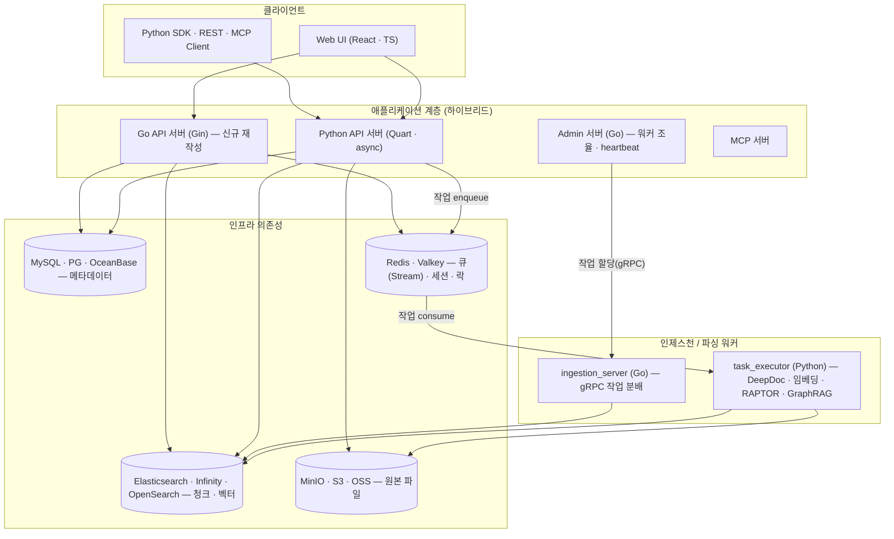
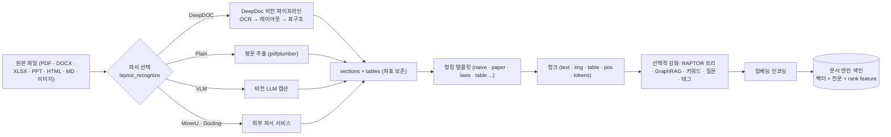
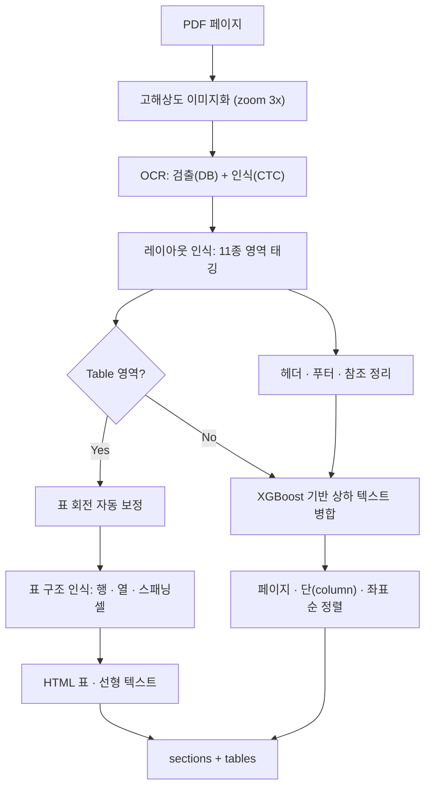
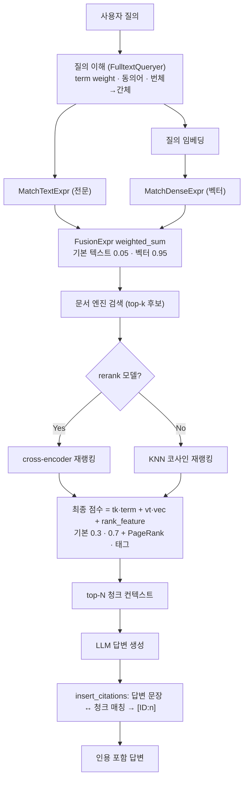

# RAGFlow 심층 분석 — 심층 문서 이해 기반 오픈소스 RAG·에이전트 엔진

> **대상**: https://github.com/infiniflow/ragflow
> **분석 버전**: v0.25.6 (2026-05, commit `be28177`)
> **핵심 정의**: **심층 문서 이해(Deep Document Understanding)** 로 복잡한 포맷의 비정형 데이터에서 고품질 청크를 뽑아내고, 하이브리드 검색·근거 인용·에이전트 워크플로우까지 한 제품으로 묶은 RAG 엔진
> **라이선스**: Apache-2.0
> **주요 언어**: Python(파싱·RAG·에이전트) + Go(API/인제스천 서버, 신규) + C++(토크나이저) + TypeScript(웹 UI)
> **개발사**: InfiniFlow — 자체 AI-native DB `Infinity` 도 함께 개발

---

## 1. 프로젝트 개요

### 1.1 해결하려는 문제

대부분의 RAG 파이프라인은 "**Garbage in, garbage out**" 문제에서 무너진다. PDF·스캔 문서·표·슬라이드·이미지가 섞인 실무 문서를 `PyPDF` 류로 평문 추출하면 표가 깨지고, 단(column)이 뒤섞이고, 헤더/푸터가 본문에 섞이고, 도형 안 텍스트는 사라진다. 이 망가진 텍스트를 아무리 좋은 임베딩·LLM에 넣어도 답이 정확할 수 없다.

RAGFlow의 출발점은 **"Quality in, quality out"** — 즉 **검색 이전의 문서 이해 단계** 자체를 시스템의 1급 시민으로 끌어올린 것이다. 자체 비전 모델(OCR + 레이아웃 인식 + 표 구조 인식)로 문서를 사람이 보듯 해석한 뒤, 문서 종류별 **템플릿 청킹**으로 의미 단위를 보존하고, 청크의 원본 위치(페이지·좌표)를 끝까지 추적해 **클릭 가능한 근거 인용**을 제공한다.

### 1.2 탄생 배경과 진화

RAGFlow는 단순 RAG 라이브러리로 시작했지만, 릴리스 히스토리를 보면 **"RAG 엔진 → RAG+Agent 플랫폼 → 컨텍스트 레이어"** 로 스코프가 계속 확장됐다. 현재 공식 태그라인은 *"a leading open-source RAG engine that fuses cutting-edge RAG with Agent capabilities to create a superior context layer for LLMs"* 이다.

| 버전 | 시점 | 핵심 추가 |
|------|------|-----------|
| v0.8 | 2024-07 | 그래프 기반 **Agentic RAG** 워크플로우 |
| v0.14 | 2024-11 | **Infinity / Elasticsearch** 문서 엔진 선택제, Redis→Valkey |
| v0.15 | 2024-12 | PageRank 스코어, **Helm 차트** 배포 |
| v0.16 | 2025-02 | **GraphRAG** 데이터셋 단위 구축, Tag 데이터셋 |
| v0.17 | 2025-03 | **Deep Research**(에이전트 추론), Tavily 웹검색 |
| v0.18 | 2025-04 | **MCP 서버**, VLM 기반 레이아웃 인식 |
| v0.19 | 2025-05 | **교차 언어 검색**, Code 컴포넌트(Python/JS) |
| **v0.20** | 2025-08 | **Workflow + Agentic Workflow 통합 캔버스**, 멀티 에이전트, 완전한 MCP |
| v0.21 | 2025-10 | **커스텀 인제스천/클렌징 파이프라인**, 동영상 파싱, Admin CLI |
| v0.22 | 2025-11 | **오케스트레이션형 인제스천 파이프라인**, S3·GDrive·Notion·Confluence·Discord 동기화, Docling |
| v0.23 | 2025-12 | 에이전트 **메모리**, 구조화 출력, Webhook 트리거, 부모-자식 청킹 |
| v0.24 | 2026-02 | 메모리 관리 API, gVisor 멀티 샌드박스, "Thinking" 모드 |
| v0.25 | 2026-04~05 | **7종 인제스천 파이프라인 템플릿**, 퍼블리시 가능한 에이전트 앱, 샌드박스 코드 실행, 사용자 메모리, **Ψ-RAG(RAPTOR AHC)**, Browser 컴포넌트 |

핵심 흐름: **(1) 문서 이해 → (2) 하이브리드 검색 → (3) 에이전트 오케스트레이션 → (4) 데이터 인제스천 플랫폼화 + Go 재작성**. 분석 시점(v0.25.6)의 RAGFlow는 단순 RAG 도구가 아니라 **문서 파이프라인 + 검색 + 에이전트 빌더 + LLM 게이트웨이** 를 통합한 제품이다.

---

## 2. 핵심 특징 및 차별점

### 2.1 DeepDoc — 심층 문서 이해 (최대 차별점)

`deepdoc/` 모듈은 RAGFlow를 다른 RAG 프레임워크와 구분 짓는 본질이다. LangChain/LlamaIndex가 문서 파싱을 `unstructured` 같은 외부 라이브러리에 위임하는 반면, RAGFlow는 **자체 ONNX 비전 모델 3종** 으로 문서를 직접 이해한다.

- **OCR** (`deepdoc/vision/ocr.py`): DB(Differentiable Binarization) 텍스트 검출 + CTC 기반 인식. 세로 텍스트 회전 보정, 멀티-GPU 병렬.
- **레이아웃 인식** (`layout_recognizer.py`): Text/Title/Figure/Table/Caption/Header/Footer/Reference/Equation 11종 영역 분류 → 헤더·푸터·참조 제거, 도형/수식 박스 보존.
- **표 구조 인식 TSR** (`table_structure_recognizer.py`): 행/열/스패닝셀 복원 → `<table>` HTML 또는 선형 텍스트로 변환. 표 회전 자동 감지.

### 2.2 템플릿 기반 청킹 (Explainable Chunking)

`rag/app/` 하위에 **문서 종류별 청킹 템플릿** 이 플러그인처럼 존재한다 — `naive`(범용)·`paper`(논문)·`book`·`laws`(법률)·`manual`(매뉴얼)·`qa`·`table`·`resume`(이력서, 자체 NER)·`presentation`·`picture`·`email`·`one`(단일 청크)·`tag` 등. 사용자가 데이터셋마다 청크 방식을 고를 수 있고, 청킹 결과를 **UI에서 시각적으로 확인·수정** 할 수 있다는 점이 "설명 가능한 청킹"의 핵심이다.

### 2.3 근거 인용 (Grounded Citation)

청크는 인덱싱 단계부터 `page_num_int`, `position_int`(좌표) 를 보존한다. 답변 생성 후 `Dealer.insert_citations()` 가 답변 문장을 다시 임베딩해 출처 청크와 하이브리드 유사도를 계산하고 `[ID:n]` 마커를 삽입 → 프론트엔드에서 원본 PDF의 해당 위치를 하이라이트한다. 환각을 줄이는 동시에 **검증 가능성**을 준다.

### 2.4 하이브리드 검색 + 융합 재랭킹

전문(full-text) 검색과 밀집 벡터 검색을 가중 합으로 융합하고, 그 위에 cross-encoder 재랭커, PageRank·태그 기반 rank feature 까지 더한다. (3.4·5.3절 참조)

### 2.5 듀얼 문서 엔진 — Elasticsearch vs Infinity

RAGFlow는 백킹 스토어를 **환경변수 `DOC_ENGINE` 하나로 교체** 할 수 있다 (`elasticsearch`(기본)·`infinity`·`opensearch`·`oceanbase`). `Infinity`는 InfiniFlow가 직접 만든 **AI-native DB** 로, 밀집/희소 벡터·텐서(멀티벡터)·전문 검색을 한 엔진에서 처리하고 RRF·Weighted Sum·ColBERT 텐서 재랭킹을 내장한다.

### 2.6 RAG + Agent 통합 캔버스

v0.20부터 결정형 **Workflow**와 불확실 입력형 **Agentic Workflow**를 하나의 캔버스(DAG)에서 공동 오케스트레이션한다. RAGFlow 자체가 MCP 서버이자 MCP 클라이언트로 동작하고, Deep Research·코드 샌드박스·웹 브라우저 컴포넌트까지 포함한다.

---

## 3. 아키텍처 분석

### 3.1 전체 시스템 구조



### 3.2 인덱싱(인제스천) 데이터 흐름



### 3.3 DeepDoc PDF 파이프라인 (상세)



### 3.4 검색 & 생성 데이터 흐름



### 3.5 Python ↔ Go 하이브리드 경계

분석 시점 RAGFlow는 **성능 임계 경로를 Go/C++로 재작성하는 마이그레이션 중간 단계**다. `build.sh`는 *"RAGFlow Go Server Build Script"* 로, C++ 토크나이저(`librag_tokenizer_c_api.a`)를 빌드한 뒤 cgo로 Go 서버에 링크한다.

| 영역 | 현재 구현 | 비고 |
|------|-----------|------|
| HTTP API 서버 | **Python(Quart)** + **Go(Gin)** 병존 | 프론트가 `/api`(Py) 또는 `/api/v1`(Go)로 라우팅 |
| ORM | Peewee(Py) ↔ GORM(Go) | MySQL/PG/OceanBase 공유 |
| 문서 파싱(DeepDoc) | **Python 전용** | ONNX 비전 모델·XGBoost — 이식 안 됨 |
| LLM 추상화 | Python `rag/llm/` + Go `internal/entity/models/`(70+) | 양쪽에 프로바이더 구현 존재 |
| 인제스천 서버 | Python `task_executor` + Go `ingestion_server`(gRPC) | Go가 분산 작업 분배 |
| 토크나이저 / NLP | Python `rag_tokenizer` + **C++ `internal/cpp/`** (DARTS trie·PCRE2·WordNet) | Go에서 cgo 호출 |
| 에이전트 캔버스 | **Python 전용** | `agent/canvas.py` |

---

## 4. 기술 스택

| 레이어 | 기술 |
|--------|------|
| **언어** | Python ≥3.13, Go 1.25, C++(CMake), TypeScript |
| **Python 웹** | Quart(async) + Flask 확장(login·session·mail·cors), Flasgger(OpenAPI) |
| **Go 웹** | Gin, GORM, go-redis/v9, gRPC + protobuf, Viper, Zap |
| **비전/ML** | ONNX Runtime(GPU/CPU), OpenCV, XGBoost, pdfplumber |
| **문서 엔진** | Elasticsearch 8.x(기본) · Infinity(`infinity-sdk`) · OpenSearch · OceanBase |
| **메타 DB** | MySQL(기본) · PostgreSQL · OceanBase (Peewee / GORM) |
| **큐/캐시** | Redis · Valkey (Redis Streams 기반 작업 큐, 분산 락) |
| **객체 스토리지** | MinIO(기본) · AWS S3 · Aliyun OSS · Azure Blob · GCS (opendal) |
| **그래프/클러스터링** | NetworkX, graspologic(Leiden), UMAP, scikit-learn(GMM·AHC) |
| **LLM 게이트웨이** | `conf/llm_factories.json` — 60+ 프로바이더 메타데이터 |
| **패키지/빌드** | `uv`(Python), `go.mod`, CMake(C++), Docker Compose, Helm |
| **관측** | Langfuse 연동 |

---

## 5. 핵심 코드 분석

### 5.1 DeepDoc 비전 파이프라인 (`deepdoc/`)

**OCR** (`deepdoc/vision/ocr.py`) — `TextDetector`(DB 검출) + `TextRecognizer`(CTC 인식) + `OCR` 오케스트레이터. 모델(`det.onnx`/`rec.onnx`/`ocr.res`)은 HuggingFace `InfiniFlow/deepdoc` 에서 온디맨드 다운로드. `PARALLEL_DEVICES` 로 멀티-GPU, `sorted_boxes()` 로 위→아래·좌→우 정렬, 세로 텍스트는 90°/270° 회전 후 confidence 최대값 채택.

**레이아웃 인식** (`layout_recognizer.py`) — `Recognizer` 기반 `LayoutRecognizer`. ONNX 추론으로 영역을 검출하고 OCR 박스를 IoU 기준으로 영역에 매칭해 `layout_type`/`layoutno` 부여. 본문 외곽(상·하 10% 이내)의 헤더·푸터·참조는 제거하고, 텍스트 없는 figure/equation 영역은 빈 박스로 보존(VLM 캡션 대상). YOLOv10·Ascend NPU 백엔드 변형도 존재.

**표 구조 인식** (`table_structure_recognizer.py`) — 행/열/열헤더/스패닝셀 라벨을 검출 → `construct_table()`이 좌표·행열번호로 셀을 격자에 배치, `__cal_spans()`로 colspan/rowspan 계산. 출력은 `<table>` HTML 또는 `헤더: 값; 헤더: 값` 선형 텍스트 두 형식. `blockType()`이 셀 내용(날짜/숫자/영문/이름)을 분류해 헤더 행을 추론.

**PDF 파서** (`deepdoc/parser/pdf_parser.py`, `RAGFlowPdfParser`) — 위 3종을 묶는 본체.
- `_table_transformer_job()`: 표 영역을 잘라 회전 평가(`_evaluate_table_orientation()`: 4각도 OCR confidence 비교, 0.2 이상 개선 시 채택) 후 TSR 적용.
- `_updown_concat_features()` + XGBoost(`updown_concat_xgb.model`): 인접 텍스트 박스가 한 문장인지(문자폭·높이·세로거리·문장부호·영문 대소문자 패턴 등 29 피처) 판정해 병합.
- `_is_garbled_text()`: PUA 영역(0xE000–0xF8FF)·CID 플레이스홀더·서브셋 폰트 접두사 감지로 깨진 폰트 인코딩 필터링.

보조 파서: `PlainParser`(OCR 없이 pdfplumber), `VisionParser`(VLM), `DocxParser`/`ExcelParser`(이미지 포함)/`HtmlParser`/`MarkdownParser`, 그리고 외부 서비스 연동(`DoclingParser`·`MinerUParser`·`PaddleOCRParser`·`TCADPParser` 등).

### 5.2 청킹 템플릿 (`rag/app/`)

진입점은 각 템플릿의 `chunk()` 함수(예 `rag/app/naive.py`). 파일 확장자·`layout_recognize` 설정으로 파서를 고르고 → `sections, tables` 추출 → 템플릿별 병합 → `tokenize_chunks()` 로 토큰화·메타데이터 부여.

```python
parser_config = {
    "chunk_token_num": 512,          # 목표 청크 크기(토큰)
    "delimiter": "\n!?。；！？",      # 문장/문단 구분자
    "layout_recognize": "DeepDOC",   # 파서 선택
    "overlapped_percent": 10,        # 청크 간 오버랩 %
}
```

- `naive`: `naive_merge()`로 구분자 분리 후 토큰 한도까지 그리디 병합, 표는 `tokenize_table()`로 JSON/마크다운화. 이미지가 있으면 `naive_merge_with_images()`.
- `paper`: 제목·저자·초록을 별도 청크로(초록은 분할 금지), 제목 빈도로 섹션 계층 추정.
- `book`/`manual`/`laws`: bullet/번호 패턴 감지(`bullets_category()`) → `hierarchical_merge()`로 계층 중첩.
- `table`: 행 1개 = 청크 1개(헤더 반복), `resume`: 회사/학교/학위 gazetteer 기반 NER.
- 부모-자식 청킹(v0.23): 작은 자식 청크로 검색하고 큰 부모 청크를 컨텍스트로 제공.

### 5.3 문서 엔진 추상화 & 하이브리드 검색

**추상 인터페이스** — `common/doc_store/doc_store_base.py`의 `DocStoreConnection`(`search/get/insert/update/delete/create_idx`). 백엔드 구현: `rag/utils/es_conn.py`(ES), `infinity_conn.py`, `opensearch_conn.py`, `ob_conn.py`. 선택은 `common/settings.py`의 `DOC_ENGINE`(기본 `elasticsearch`).

질의 표현식은 강타입 객체로 모델링된다:

```python
MatchTextExpr(fields, matching_text, topn)            # 전문 검색
MatchDenseExpr(vector_column_name="q_768_vec", ...)   # 벡터 검색
FusionExpr("weighted_sum", topk, {"weights": "0.05,0.95"})  # 융합
```

**필드 스키마** — 접미사 라우팅: `*_tks`(토큰 텍스트)·`*_kwd`(키워드)·`*_int/_flt`·`*_fea/_feas`(rank feature)·`q_{dim}_vec`(밀집 벡터). ES는 IDF 기반 스크립트 유사도, Infinity는 `rag-coarse`/`rag-fine` 분석기를 명시한다.

**검색 오케스트레이터** — `rag/nlp/search.py`의 `Dealer.retrieval()`:
1. `FulltextQueryer.question()`(`rag/nlp/query.py`)로 질의를 term-weight·동의어가 붙은 문자열로 변환. 동의어는 원 term 가중치의 1/4, bigram은 max 가중치의 2배. 필드 부스트 `title_tks^10`·`important_kwd^30`·`content_ltks^2` 등.
2. 전문 + 벡터 매칭을 `FusionExpr`(기본 텍스트 0.05·벡터 0.95)로 융합 검색.
3. `rerank_mdl` 있으면 cross-encoder 재랭킹, 없으면 ES는 KNN 코사인 2차 호출로 점수 병합.
4. 최종 점수 `sim = tkweight·term + vtweight·vec + rank_feature` (기본 `tkweight=0.3`, `vtweight=0.7`). `rank_feature`에는 `pagerank_fea`(0–10)와 태그 코사인 점수가 더해진다.

ES 경로는 본 검색에서 청크 벡터를 반환하지 않고(대역폭 절약) 인용 계산 시에만 가져오는 최적화를 둔다.

**질의 이해** — `term_weight.py`(NER·문서빈도·불용어), `synonym.py`(커스텀 사전 + WordNet, Redis 캐시), `rag_tokenizer.py`(중/영 토크나이저, Infinity 엔진이면 lexer에 위임).

**인용** — `Dealer.insert_citations()`: 답변을 문장 단위로 분리(코드블록 보존) → 임베딩 → 청크와 `hybrid_similarity()`(기본 tk 0.1·vt 0.9) 계산 → 임계값 0.63에서 0.8배씩 감쇠하며 매칭, 문장당 상위 4개 청크에 `[ID:n]` 삽입.

### 5.4 RAPTOR (`rag/raptor.py`)

재귀적 클러스터링+요약 트리. 리프 청크 → UMAP 차원축소 → **GMM(BIC로 군집수 결정)** 또는 **AHC(Ward 연결, gap heuristic)** 클러스터링 → 클러스터별 LLM 요약 → 요약을 다음 레이어 리프로 승격, 단일 노드까지 반복. 검색 시 트리를 루트부터 유사도 따라 하강.

v0.25에서 **Ψ-RAG(Psi tree)** 가 추가됐다(`_PsiTreeNode`/`_PsiUnionFind`): 대용량 입력을 k-means 버킷(기본 1024)으로 나눈 뒤 버킷 내 리프쌍을 유사도로 랭킹, union-find로 고유사쌍을 병합해 트리를 구성. AHC 모드를 안정화해 인덱스 구축을 가속하고 GMM 대비 Recall@5·평균 F1을 개선했다. LLM 요약·임베딩은 xxhash 키로 Redis에 캐시(24h).

### 5.5 GraphRAG (`rag/graphrag/`)

- **엔티티/관계 추출** (`general/graph_extractor.py`): LLM 프롬프트로 `(entity, type, desc)`·`(src, tgt, rel, desc)` 추출. `<|>`/`##`/`<|COMPLETE|>` 구분자, "gleaning" 루프(기본 5회)로 누락분 재추출.
- **엔티티 해소** (`entity_resolution.py`): 동일 타입 노드쌍을 editdistance로 후보화 → LLM 배치(100쌍) 판정 → union-find 병합 → PageRank 재계산.
- **커뮤니티 탐지** (`leiden.py`): graspologic의 **계층적 Leiden**(기본 max cluster 12). 노드명 정규화로 재현성 확보.
- **커뮤니티 리포트** (`community_reports_extractor.py`): 커뮤니티 서브그래프를 LLM에 넣어 summary·findings·rating 생성.
- **KG 검색** (`search.py`, `KGSearch`): 질의를 LLM으로 타입/엔티티 키워드로 재작성 → 엔티티/관계 밀집 검색 + N-hop 확장 → 문서 집계. 엔티티/관계는 `knowledge_graph_kwd` 필드로 같은 문서 엔진에 저장된다.

### 5.6 에이전트 캔버스 (`agent/canvas.py`)

워크플로우는 JSON DAG로 표현된다 — `components{id:{obj, downstream, upstream}}` + `globals`(`sys.query`·`sys.files`·`sys.history` 등). `Canvas.run()`은 async 제너레이터로 path를 따라 컴포넌트를 실행하며 `workflow_started`/`node_started`/`message`/`node_finished`/`workflow_finished` 이벤트를 스트리밍한다.

- 컴포넌트 간 데이터는 `{component_id@output_key}`·`{sys.*}`·`{env.*}` 변수 참조(정규식 치환)로 전달.
- `_run_batch()`는 ThreadPoolExecutor(최대 5)+세마포어로 병렬 실행, sync 컴포넌트는 executor, async는 `_invoke_async()`.
- 컴포넌트 카탈로그(`agent/component/`): `Begin`·`LLM`·`Message`·`Categorize`(분기)·`Switch`·`Iteration`/`Loop`·`Agent`(tool-use 루프)·`Invoke`(서브 워크플로우)·`UserFillup` 등.
- 툴(`agent/tools/`): `Retrieval`(KB/KG 검색)·`code_exec`(샌드박스)·웹검색(Tavily·DuckDuckGo·Arxiv·PubMed)·SQL·Email·Browser·금융·번역 등.
- 코드 샌드박스(`agent/sandbox/`): `self_managed`·`e2b`·`aliyun`·`local`·`ssh` 백엔드 추상화, gVisor 격리, 산출물은 MinIO 저장.

### 5.7 인제스천 태스크 파이프라인 (`rag/svr/task_executor.py`)

생산자-소비자 구조. API가 파싱 작업을 **Redis Streams** 에 enqueue → `task_executor`가 소비 그룹으로 폴링. `RedisDistributedLock` 으로 동시성 제어. `ParserType`(NAIVE·PAPER·…·KG)별 파서 팩토리 → 청킹 → RAPTOR/GraphRAG 강화 → 임베딩 → 문서 엔진 색인. v0.22+의 **오케스트레이션형 인제스천 파이프라인**(`rag/flow/`)은 parser→chunker→tokenizer 단계를 사용자가 조립·클렌징할 수 있게 한다.

---

## 6. API 및 인터페이스

- **REST API** (`api/apps/`): 데이터셋·문서·청크·대화·에이전트·파일·커넥터·프로바이더·메모리·MCP 등 블루프린트. HTTP/Python 양쪽 SDK 제공.
- **OpenAI 호환 엔드포인트**: `/openai/<chat_id>/chat/completions` — 스트리밍·thinking 모드 지원, `extra_body.reference`로 RAG 인용 포함, `metadata_condition`으로 메타데이터 필터.
- **Python SDK** (`sdk/python/ragflow_sdk/`): `RAGFlow` 클라이언트 → `DataSet`/`Chat`/`Document`/`Chunk`/`Agent`/`Memory`/`Session`. `create_dataset()`·`retrieve()`(재랭킹 옵션) 등.
- **MCP 서버** (`mcp/server/`): 데이터셋 검색을 MCP 툴로 노출(SSE·streamable HTTP). 동시에 에이전트가 MCP 클라이언트로 외부 MCP 서버를 가져올 수 있음.
- **Admin CLI** (`admin/`, `cmd/ragflow_cli.go`): 사용자·프로바이더·모델·데이터셋 운영.

---

## 7. 확장성 및 플러그인

| 확장 포인트 | 방식 |
|-------------|------|
| **문서 파서** | DeepDOC·Plain·VLM 외 MinerU·Docling·PaddleOCR·TCADP·OpenDataLoader 등 백엔드 교체 |
| **청킹 템플릿** | `rag/app/*.py` 템플릿 추가 — 문서 종류별 전략 |
| **LLM 프로바이더** | `conf/llm_factories.json`(60+) + Python `rag/llm/` + Go `internal/entity/models/`(70+). Chat·Embedding·Rerank·Vision·TTS·ASR 분리 |
| **문서 엔진** | `DOC_ENGINE` 으로 ES/Infinity/OpenSearch/OceanBase |
| **객체 스토리지** | opendal 기반 MinIO/S3/OSS/Azure/GCS |
| **에이전트 컴포넌트·툴** | `agent/component/`·`agent/tools/` 플러그인, MCP 임포트 |
| **데이터 소스 커넥터** | S3·Google Drive·Notion·Confluence·Discord + 범용 RESTful 커넥터(v0.25.4) |
| **인제스천 파이프라인** | 7종 프리빌트 템플릿 + 커스텀 오케스트레이션 |
| **코드 샌드박스** | self/e2b/aliyun/local/ssh 프로바이더 |

---

## 8. 성능 특성

- **Infinity 엔진**: 밀집·희소 벡터·전문 검색을 단일 엔진에서 처리, 텐서(ColBERT) 재랭킹 내장. InfiniFlow 벤치마크상 RAG 워크로드에서 가장 빠른 하이브리드 검색을 표방.
- **검색 지연 최적화**: v0.25.5에서 ES 경로의 벡터 fetch·rerank 유사도 계산을 제거해 데이터셋 검색 지연을 50–100% 단축. 메타데이터 필터를 Infinity로 push-down.
- **Ψ-RAG(RAPTOR AHC)**: 인덱스 구축 가속 + Recall@5·F1 개선.
- **Go/C++ 재작성**: API 서버·인제스천을 Go(Gin·goroutine·단일 바이너리)로, 토크나이저를 C++(DARTS trie)로 이전해 Python 대비 처리량·지연·메모리·배포를 개선. 단 현재는 Python/Go 병존(이중 유지보수 비용).
- **멀티-GPU OCR**: `PARALLEL_DEVICES`·GPU 메모리 아레나 제어.
- **알려진 제약**: DeepDoc은 ONNX 비전 추론이 무거워 대량 스캔 PDF는 GPU 권장. 인프라 의존성(ES/MySQL/Redis/MinIO 4종)이 많아 풋프린트가 큼(권장 RAM ≥16GB). 임베딩 모델별 토큰 한도 상이.

---

## 9. 배포 및 운영

**최소 요구사항**: CPU ≥4코어, RAM ≥16GB, Disk ≥50GB, Docker ≥24 / Compose ≥2.26, Python ≥3.13, (샌드박스용) gVisor 선택.

**Docker Compose** (`docker/docker-compose.yml` + `-base.yml`)가 표준 배포 경로:
- `ragflow`(API + 워커, CPU/GPU 이미지) · `mysql` · `elasticsearch`(또는 `infinity`/`opensearch`) · `redis`(Valkey) · `minio`.
- 포트: 80/443(웹), 9380(Py API)·9381(admin)·9382(MCP)·9383/9384(Go) 등.
- 설정: `docker/.env`(이미지·포트·호스트), `docker/service_conf.yaml.template`(DB·Redis·엔진·MinIO).

**Kubernetes**: `helm/` 차트(v0.15+). **OceanBase** 올인원 옵션도 제공. macOS·중국 미러용 compose 변형 포함.

---

## 10. 경쟁·비교 분석

| 항목 | **RAGFlow** | Dify | LangChain/LlamaIndex | Haystack | LightRAG |
|------|-------------|------|----------------------|----------|----------|
| 포지셔닝 | **문서이해 중심 RAG+Agent 제품** | LLMOps/앱 빌더 | RAG 개발 프레임워크(라이브러리) | 엔터프라이즈 검색/QA 프레임워크 | 경량 Graph RAG 라이브러리 |
| 문서 파싱 | **자체 비전 모델(OCR·레이아웃·표)** | 외부 의존 | 외부(unstructured 등) | 컴포넌트형 | 텍스트 위주 |
| 청킹 | **종류별 템플릿 + 시각 편집** | 기본 청킹 | 코드로 직접 | 코드로 직접 | 토큰 기반 |
| 검색 | 하이브리드 + 융합 재랭킹 + PageRank/태그 | 벡터 위주 | 백엔드 선택 | 다양한 retriever | KG + 벡터 |
| 그래프 RAG | GraphRAG(Leiden) | 제한적 | 통합 가능 | 제한적 | **핵심 기능** |
| 에이전트 | 통합 캔버스 + MCP + Deep Research | 강력한 워크플로우 | 코드형 에이전트 | 파이프라인 | 없음 |
| 인용/근거 | **좌표 기반 클릭 인용** | 기본 | 직접 구현 | 기본 | 약함 |
| 형태 | **올인원 제품(UI 포함)** | 올인원 제품(UI) | 라이브러리 | 라이브러리 | 라이브러리 |
| 자체 DB | **Infinity** | 외부 | 외부 | 외부 | 외부 |

**요지**: LangChain/LlamaIndex가 "조립 키트", Haystack이 "검색 파이프라인 프레임워크", LightRAG가 "경량 Graph RAG"라면, RAGFlow는 **즉시 쓸 수 있는 제품형 RAG**다. Dify와 가장 직접 경쟁하지만 — Dify가 LLM 앱/워크플로우 일반에 폭넓다면, RAGFlow는 **"복잡한 문서를 정확히 이해·인용"** 하는 깊이에서 차별화된다. 본 저장소의 인접 분석으로는 [LightRAG](../lightrag/analysis.md)(Graph RAG 경량), [RAG-Anything](../rag-anything/analysis.md)(멀티모달 RAG), [DB-GPT](../db-gpt/analysis.md)·[WrenAI](../wren-ai/analysis.md)(Text-to-SQL) 참조.

---

## 11. 종합 평가

### 강점
- **문서 이해의 깊이**: 자체 OCR·레이아웃·표구조 모델 + 종류별 청킹 템플릿 + 시각 편집은 동종 오픈소스 중 가장 강력. "복잡한 실무 문서"에서 격차가 크다.
- **검증 가능한 RAG**: 좌표 기반 클릭 인용으로 환각·신뢰 문제를 정면 대응.
- **올인원 제품성**: UI·데이터셋 관리·에이전트 빌더·LLM 게이트웨이·MCP·인제스천 파이프라인까지 한 번에. 비개발자도 no-code로 사용 가능.
- **운영 유연성**: 문서 엔진/메타DB/스토리지/LLM 프로바이더가 모두 교체 가능. 자체 DB Infinity로 성능 상한을 직접 통제.
- **빠른 진화**: 2주 단위 릴리스로 RAG 최신 기법(RAPTOR·GraphRAG·Ψ-RAG·Deep Research)을 즉시 흡수.

### 약점 / 리스크
- **무거운 인프라**: ES/MySQL/Redis/MinIO 4종 의존 + 비전 추론으로 진입 풋프린트가 큼. 임베디드/경량 시나리오엔 과함.
- **이중 언어 유지보수**: Python→Go/C++ 마이그레이션 과도기라 같은 기능이 양쪽에 존재(API·LLM 프로바이더). 일관성·디버깅 부담이 일시적으로 증가.
- **수직 통합의 양면성**: 자체 비전 모델·자체 DB는 강점이자 락인 요소. ONNX 모델 다운로드/GPU 의존, Infinity 고유 동작에 대한 이해 필요.
- **스코프 팽창**: RAG+Agent+인제스천 플랫폼+게이트웨이로 넓어지며 "무엇이든 하는 도구"의 복잡도가 증가.

### 적합 / 부적합
- **적합**: 복잡한 포맷(스캔 PDF·표·슬라이드)이 많은 사내 지식베이스, 근거 추적이 중요한 규제/법무/금융 QA, no-code로 RAG 챗봇·에이전트를 빠르게 출시하려는 팀, 자체 호스팅 올인원을 원하는 조직.
- **부적합**: 코드 레벨 세밀 제어가 필요한 커스텀 파이프라인(→ LangChain/LlamaIndex), 초경량/임베디드(→ LightRAG), 단순 텍스트만 다루는 소규모.

### 엔지니어 관점 인사이트
RAGFlow의 핵심 베팅은 **"검색 품질의 병목은 알고리즘이 아니라 문서 이해"** 라는 명제다. 임베딩·재랭킹을 아무리 튜닝해도 입력 청크가 망가져 있으면 한계가 있다는 통찰을, 비전 모델을 1급 시민으로 끌어올려 제품화했다. 여기에 **Go/C++ 재작성** 은 "오픈소스 RAG 도구"에서 **"프로덕션급 컨텍스트 인프라"** 로 가려는 의지의 신호다 — Python의 생산성으로 ML 파이프라인을 유지하되, 지연·처리량이 중요한 API/인제스천/토크나이저를 컴파일 언어로 내려보내는 전형적인 성숙 경로다. InfiniFlow가 RAGFlow(애플리케이션)와 Infinity(DB)를 함께 소유한다는 점은, RAG 스택을 수직 통합해 성능 상한을 직접 통제하려는 전략으로 읽힌다.
