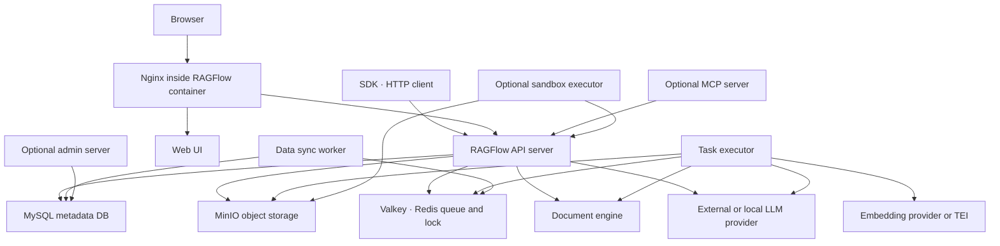
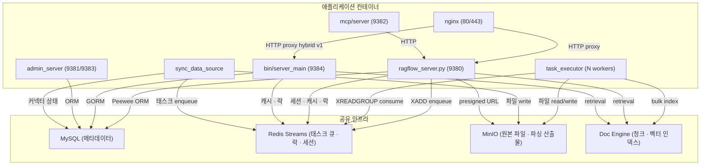
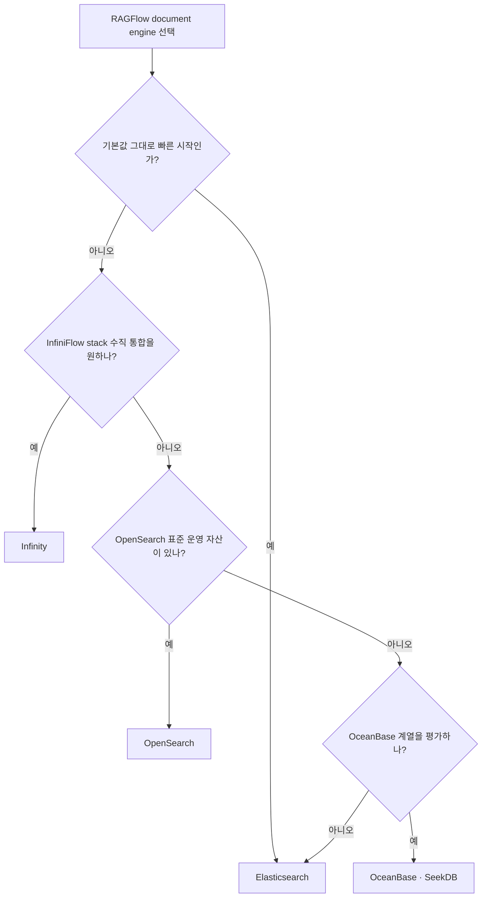

# RAGFlow 필요 인프라 및 셋업 가이드

작성일: 2026-06-07

## 결론 요약

RAGFlow는 단일 RAG 라이브러리가 아니라 **웹 UI/API 서버, 문서 파싱 워커, 검색/벡터 문서 엔진, 메타데이터 DB, 오브젝트 스토리지, 메시지 큐/캐시**가 함께 동작하는 제품형 RAG 플랫폼이다. 기본 Docker Compose 배포에서 필요한 핵심 인프라는 다음이다.

| 역할 | 기본 구현 | 필수 여부 | 용도 |
|---|---|---:|---|
| RAGFlow app | `infiniflow/ragflow:v0.25.6` | 필수 | Web UI, API, task executor, data sync, optional Admin/MCP |
| Metadata DB | MySQL 8.0.39 | 필수 | 사용자, tenant, dataset, document, task, model provider 설정 |
| Object storage | MinIO | 필수 | 업로드 원본 파일, 파싱 산출물, sandbox artifact |
| Message queue/cache | Valkey 8, Redis protocol | 필수 | task queue, distributed lock, session, cache, ID generator |
| Document engine | Elasticsearch 8.11.3 기본 | 필수 | chunk, full-text index, vector index, retrieval |
| Alternative doc engine | Infinity, OpenSearch, OceanBase, SeekDB | 선택 | Elasticsearch 대체 문서/벡터 검색 엔진 |
| Embedding service | 외부 provider 또는 TEI | 사실상 필수 | chunk embedding 생성 |
| LLM provider | OpenAI-compatible, Ollama 등 | 사실상 필수 | chat, metadata extraction, KG 생성, agent 실행 |
| Sandbox executor | sandbox-executor-manager + gVisor | 선택 | Agent CodeExec 컴포넌트의 Python/JavaScript 실행 |
| Nginx | RAGFlow image 내부 | 기본 포함 | Web/API reverse proxy, upload size, HTTPS |
| Kibana | Kibana | 선택 | Elasticsearch 운영/디버깅 |

일반 사용자는 `docker/docker-compose.yml`로 전체 stack을 올리는 것이 가장 빠르다. 개발자는 `docker/docker-compose-base.yml`로 MySQL/MinIO/Redis/doc engine만 띄운 뒤, Python backend와 frontend를 로컬에서 실행한다. Kubernetes 배포는 `helm/` chart가 있으며, Docker Compose 기본값은 `DOC_ENGINE=elasticsearch`, Helm 기본값은 `DOC_ENGINE=infinity`라는 차이가 있다.

## 로컬 분석 기준

- Repo: `.repos/ragflow`
- Commit: `be28177`
- 주요 파일:
  - `.repos/ragflow/docker/docker-compose.yml`
  - `.repos/ragflow/docker/docker-compose-base.yml`
  - `.repos/ragflow/docker/.env`
  - `.repos/ragflow/docker/service_conf.yaml.template`
  - `.repos/ragflow/docker/entrypoint.sh`
  - `.repos/ragflow/helm/values.yaml`

## 전체 아키텍처



### 컴포넌트 단위 역할

`docker/entrypoint.sh`는 컨테이너 시작 시 `service_conf.yaml.template`의 환경변수를 치환해 `conf/service_conf.yaml`을 생성한 뒤, 아래 컴포넌트를 **플래그 기반으로 조건부 기동**한다. 각 컴포넌트를 on/off할 수 있어 역할별 컨테이너 분리 배포의 기반이 된다.

#### nginx (포트 80/443)

컨테이너 내장 nginx는 단순 정적 파일 서버가 아니라 **API 프록시 라우터 겸 업로드 게이트웨이**다.

- 정적 Web UI(React 빌드) 서빙
- `API_PROXY_SCHEME` 환경변수로 세 가지 프록시 모드 전환:
  - `python`(기본): 모든 API → Python 서버(9380)
  - `go`: 모든 API → Go 서버(9384)
  - `hybrid`: `/v1/*` 경로 → Go(9384), 나머지 → Python(9380)
- `client_max_body_size`로 업로드 한도 제어 (`MAX_CONTENT_LENGTH`와 반드시 같이 조정)
- 443 포트 TLS termination 지원 (cert/key 마운트 필요)

#### ragflow_server.py (Python HTTP API, 포트 9380)

Quart(asyncio Flask) 기반 **메인 API 서버**. 컨테이너 안에서 가장 먼저 뜨는 RAGFlow 핵심 프로세스다.

- **REST API 라우팅**: 데이터셋·문서·청크·대화·에이전트·파일·커넥터·프로바이더·메모리 등 Flask 블루프린트
- **OpenAI 호환 엔드포인트**: `/openai/<chat_id>/chat/completions` (스트리밍·thinking 모드, RAG 인용 포함)
- **DB 초기화**: 시작 시 `init_database_tables()` + `init_web_data()`로 MySQL 스키마·시드 데이터 생성/마이그레이션
- **`update_progress` 백그라운드 스레드**: 6초 주기로 `DocumentService.update_progress()` 실행. `RedisDistributedLock("update_progress")`으로 멀티 인스턴스에서도 단일 실행 보장 — 파싱 중인 문서의 진행률을 MySQL에 기록한다.
- **GlobalPluginManager**: 에이전트 플러그인 로드
- `--disable-webserver` 플래그로 API 서버 전체를 끌 수 있다 (Worker 전용 컨테이너 구성 시 사용)

#### task_executor.py (인제스천 워커)

**핵심 비동기 파싱·인덱싱 워커**. 문서 업로드 → 색인 완료까지의 무거운 작업 전체를 담당한다.

동작 방식:
- Redis Streams **소비자 그룹**(XREADGROUP) 폴링. 소비자 ID = `{host_id}_{consumer_id}` — 멀티 워커·멀티 호스트에서 중복 없이 작업 분배
- jemalloc preload로 Python 메모리 단편화 완화
- 무한 재시작 루프(`while true; do ... done`)로 크래시 자동 복구

처리 파이프라인:
1. `ParserType`별 파서 팩토리 → DeepDoc(OCR·레이아웃·표구조) 또는 Plain/VLM/외부 파서
2. 청킹 템플릿 적용 (naive·paper·laws·table 등)
3. 선택적 강화: RAPTOR 트리·GraphRAG·질문 생성·태그
4. 임베딩 인코딩 (외부 embedding provider HTTP 호출)
5. 문서 엔진 bulk index (ES·Infinity 등)
6. MinIO에 파싱 산출물(이미지·중간 결과물) 저장
7. MySQL에 태스크 상태 업데이트

워커 수 제어 플래그:
- `--workers=N`: 단일 컨테이너에서 N개 워커 병렬 실행 (기본 1)
- `--consumer-no-beg=0 --consumer-no-end=4`: 범위 기반 4개 워커
- `--host-id=<id>`: 멀티 컨테이너 분산 시 고유 호스트 식별자 (다르게 줘야 충돌 방지)
- `--disable-taskexecutor`: 워커 없이 API만 실행하는 컨테이너 구성 시 사용

#### sync_data_source.py (데이터 소스 동기화 워커)

외부 커넥터에서 RAGFlow로 파일을 주기적으로 동기화하는 백그라운드 워커. UI에서 설정한 커넥터별 스케줄에 따라 동작한다.

지원 커넥터: S3·GCS·Azure Blob·OSS·**Notion**·**Confluence**·**Discord**·**RSS** 등

역할:
- `ConnectorService`로 활성 커넥터·동기화 설정 조회
- 원격 파일 목록 조회 → 신규/변경 파일 감지 → MinIO 업로드 → DocumentService를 통해 파싱 태스크 enqueue
- `SyncLogsService`로 동기화 이력·오류 기록
- task_executor와 달리 Redis queue가 아닌 **자체 폴링 루프**로 동작

#### admin_server.py / bin/admin_server (Admin API, 포트 9381/9383)

관리자 전용 API 서버. **기본 비활성** — `--enable-adminserver` 플래그로 켜야 한다.

- 사용자 관리(생성·삭제·비밀번호 재설정)
- LLM 프로바이더·모델 인스턴스 관리
- Superuser 초기화(`--init-superuser`)
- MySQL 스키마 마이그레이션(`--init-model-provider-tables`)
- Python 버전(9381) + Go 재작성 버전 `bin/admin_server`(9383)이 hybrid 모드에서 병존

#### bin/server_main (Go HTTP API, 포트 9384)

Python API 서버의 성능 임계 경로를 **Go(Gin)로 재작성** 중인 서버. `API_PROXY_SCHEME=hybrid` 또는 `go` 모드에서 활성화된다.

- Gin 라우터 + GORM(MySQL) + go-redis + gRPC + C++ 토크나이저(cgo)
- 단일 바이너리, goroutine 기반 동시성으로 Python 대비 지연·처리량 우위
- Python API가 완전히 뜬 뒤(`/api/v1/system/healthz` 응답 확인) 순차 기동
- Python과 MySQL/Redis/DocEngine을 공유하며, 직접 RPC 없이 DB 레벨로 통합
- hybrid 모드에서 `/v1/*` 경로를 Go가 처리하고 나머지는 Python으로 fall-through

#### mcp/server/server.py (MCP 서버, 포트 9382)

RAGFlow 데이터셋 검색 기능을 **MCP(Model Context Protocol) 툴**로 외부에 노출하는 서버. **기본 비활성** — `--enable-mcpserver` 플래그로 켜야 한다.

- SSE + Streamable HTTP transport 지원
- Claude Desktop·Continue·Cursor 등 MCP 클라이언트에서 RAGFlow 검색을 툴로 직접 호출 가능
- `--mode`: `self-host`(내부 전용) 또는 `public`(외부 공개) 모드
- `--api-key`: 외부 접근 시 인증

### 컴포넌트 간 통신 구조

컴포넌트 간 직접 RPC는 없다. **공유 인프라(MySQL·Redis·MinIO·DocEngine)를 통한 간접 통신**이 기본 패턴이다.



| 통신 경로 | 프로토콜 | 비고 |
|---|---|---|
| Client → nginx → API | HTTP/HTTPS | API_PROXY_SCHEME에 따라 Python/Go로 라우팅 |
| API → MySQL | Peewee(Py) / GORM(Go) TCP 3306 | 메타데이터 CRUD. max_connections: 900 |
| API → Redis | Redis protocol 6379 | 태스크 enqueue(XADD), 분산 락, 세션, 동의어 캐시 |
| task_executor → Redis | Streams XREADGROUP | consumer group "rag" 기반 작업 소비 |
| task_executor → MinIO | S3 API 9000 | 파일 읽기(원본), 쓰기(파싱 이미지·중간 산출물) |
| task_executor → DocEngine | ES/Infinity REST | bulk index (청크·벡터·메타) |
| task_executor → Embedding | HTTP | 외부 provider API 또는 TEI(6380) |
| sync_data_source → 외부 | HTTPS | S3·Notion·Confluence·Discord API |
| Go API ↔ Python API | 없음 (공유 DB) | 직접 RPC 없이 DB 레벨 통합 |

**Redis Streams 태스크 큐 동작 방식**

API 서버가 문서 업로드·파싱 요청을 받으면 `XADD task_queue * ...`로 Redis Stream에 작업을 추가한다. task_executor들은 `XREADGROUP GROUP rag <consumer_id>`로 폴링 — 여러 워커가 동시에 붙어도 각 태스크는 단 하나의 워커에만 전달된다. 처리 완료 후 `XACK`로 확인, 워커 크래시 시 Pending Entries List에 남아 재할당된다.

## 시스템 요구사항

공식 문서 기준 최소 요구사항:

| 리소스 | 최소 |
|---|---:|
| CPU | 4 cores 이상 |
| RAM | 16 GB 이상 |
| Disk | 50 GB 이상 |
| Docker | 24.0.0 이상 |
| Docker Compose | v2.26.1 이상 |
| Host architecture | 공식 pre-built image는 x86, ARM64 image는 제공하지 않음 |
| Linux kernel setting | Elasticsearch 사용 시 `vm.max_map_count >= 262144` |
| Sandbox | gVisor, Docker 25.0+, Docker API 1.44+ |

실서비스 기준으로는 16GB RAM은 하한에 가깝다. Elasticsearch/OpenSearch 또는 TEI embedding model까지 같은 호스트에서 돌리면 32GB 이상이 현실적이다. `.env`의 기본 `MEM_LIMIT`는 컨테이너별 약 8GB로 잡혀 있고, TEI 기본 모델 `Qwen/Qwen3-Embedding-0.6B`는 주석상 약 25GB RAM/VRAM이 필요하다.

## Docker Compose 서비스 구성

### `docker-compose.yml`

RAGFlow app container를 정의한다.

| Service | Profile | Image | 주요 포트 |
|---|---|---|---|
| `ragflow-cpu` | `cpu` | `${RAGFLOW_IMAGE}` | `80`, `443`, `9380`, `9381`, `9382`, `9384`, `9383` |
| `ragflow-gpu` | `gpu` | `${RAGFLOW_IMAGE}` | `80`, `443`, `9380`, `9381`, `9382` |

기본 command는 CPU service에서 admin server와 model provider migration을 켠다.

```yaml
command:
  - --enable-adminserver
  - --init-model-provider-tables
```

### `docker-compose-base.yml`

RAGFlow 의존 인프라를 정의한다.

| Service | Profile | Image | Host port | Container port | 볼륨 |
|---|---|---|---:|---:|---|
| `es01` | `elasticsearch` | `elasticsearch:${STACK_VERSION}` | `ES_PORT=1200` | `9200` | `esdata01` |
| `opensearch01` | `opensearch` | `opensearchproject/opensearch:2.19.1` | `OS_PORT=1201` | `9201` | `osdata01` |
| `infinity` | `infinity` | `infiniflow/infinity:v0.7.0` | `23817`, `23820`, `5432` | same | `infinity_data` |
| `oceanbase` | `oceanbase` | `oceanbase/oceanbase-ce` | `2881` | `2881` | host path |
| `seekdb` | `seekdb` | `oceanbase/seekdb` | `2881` | `2881` | host path |
| `mysql` | always | `mysql:8.0.39` | `EXPOSE_MYSQL_PORT` | `3306` | `mysql_data` |
| `minio` | always | `pgsty/minio` | `9000`, `9001` | `9000`, `9001` | `minio_data` |
| `redis` | always | `valkey/valkey:8` | `6379` | `6379` | `redis_data` |
| `tei-cpu` | `tei-cpu` | text-embeddings-inference CPU | `6380` | `80` | none |
| `tei-gpu` | `tei-gpu` | text-embeddings-inference GPU | `6380` | `80` | GPU |
| `kibana` | `kibana` | `kibana:${STACK_VERSION}` | `6601` | `5601` | `kibana_data` |
| `sandbox-executor-manager` | `sandbox` | sandbox manager | `9385` | `9385` | Docker socket |

로컬 clone 기준 `.env`에서는 `EXPOSE_MYSQL_PORT=3306`이다. 일부 문서에는 예전 기본값 `5455`가 남아 있으므로, 실제 배포에서는 현재 사용하는 repo의 `docker/.env`를 우선 기준으로 삼아야 한다.

## 핵심 설정 파일

### `docker/.env`

Compose profile, image tag, 포트, 비밀번호, doc engine, batch size를 정한다.

| 변수 | 기본값 | 의미 |
|---|---|---|
| `DOC_ENGINE` | `elasticsearch` | `elasticsearch`, `infinity`, `oceanbase`, `opensearch`, `seekdb` 중 선택 |
| `DEVICE` | `cpu` | DeepDoc/task 실행 장치. `gpu` 설정 가능 |
| `COMPOSE_PROFILES` | `${DOC_ENGINE},${DEVICE}` | 선택된 doc engine과 CPU/GPU service를 결정 |
| `STACK_VERSION` | `8.11.3` | Elasticsearch/Kibana version |
| `MEM_LIMIT` | `8073741824` | 컨테이너별 memory limit |
| `RAGFLOW_IMAGE` | `infiniflow/ragflow:v0.25.6` | RAGFlow app image |
| `SVR_WEB_HTTP_PORT` | `80` | Web UI HTTP |
| `SVR_WEB_HTTPS_PORT` | `443` | Web UI HTTPS |
| `SVR_HTTP_PORT` | `9380` | Python API |
| `ADMIN_SVR_HTTP_PORT` | `9381` | Admin API |
| `SVR_MCP_PORT` | `9382` | MCP server |
| `GO_HTTP_PORT` | `9384` | Go API, hybrid mode |
| `GO_ADMIN_PORT` | `9383` | Go admin, hybrid mode |
| `API_PROXY_SCHEME` | `python` | nginx proxy target. `python`, `go`, `hybrid` |
| `DOC_BULK_SIZE` | `4` | 문서 parsing batch size |
| `EMBEDDING_BATCH_SIZE` | `16` | embedding batch size |
| `REGISTER_ENABLED` | `1` | 사용자 가입 허용 여부 |
| `MAX_CONTENT_LENGTH` | commented | 업로드 파일 크기 제한. nginx 설정도 같이 변경 필요 |
| `HF_ENDPOINT` | commented | Hugging Face mirror |

운영 배포에서는 `ELASTIC_PASSWORD`, `MYSQL_PASSWORD`, `MINIO_PASSWORD`, `REDIS_PASSWORD`, `OPENSEARCH_PASSWORD`를 반드시 변경해야 한다. `.env` 상단에도 기본 비밀번호로 배포하지 말라는 경고가 있다.

### `docker/service_conf.yaml.template`

RAGFlow backend가 실제로 읽는 서비스 설정 템플릿이다. 컨테이너 시작 시 `entrypoint.sh`가 환경변수를 치환해 `conf/service_conf.yaml`을 만든다.

주요 섹션:

- `ragflow`: API host/port
- `admin`: Admin host/port
- `mysql`: metadata DB 연결
- `minio`: object storage 연결
- `es`, `os`, `infinity`, `oceanbase`, `seekdb`: document engine별 연결
- `redis`: queue/cache/session 연결
- `user_default_llm`: 기본 LLM/embedding provider
- optional `s3`, `oss`, `azure`, `opendal`: 외부 object storage
- optional `oauth`, `authentication`, `permission`, `smtp`

## 빠른 Docker 셋업

### 1. OS 설정

Elasticsearch/OpenSearch를 쓰는 Linux host에서는 먼저 `vm.max_map_count`를 확인한다.

```bash
sysctl vm.max_map_count
sudo sysctl -w vm.max_map_count=262144
```

영구 적용:

```bash
echo "vm.max_map_count=262144" | sudo tee -a /etc/sysctl.conf
```

### 2. Repo clone 및 버전 고정

```bash
git clone https://github.com/infiniflow/ragflow.git
cd ragflow
git checkout v0.25.6
cd docker
```

`README.md`는 image tag와 local checkout의 `entrypoint.sh` 버전을 맞추는 것을 권장한다.

### 3. `.env` 수정

최소 수정:

```bash
cp .env .env.local.backup
```

다음 값은 운영 전에 바꾼다.

```env
ELASTIC_PASSWORD=<strong-password>
MYSQL_PASSWORD=<strong-password>
MINIO_PASSWORD=<strong-password>
REDIS_PASSWORD=<strong-password>
REGISTER_ENABLED=0
TZ=Asia/Seoul
```

Elasticsearch 대신 Infinity를 쓰려면:

```env
DOC_ENGINE=infinity
COMPOSE_PROFILES=${DOC_ENGINE},${DEVICE}
```

GPU를 쓰려면:

```env
DEVICE=gpu
COMPOSE_PROFILES=${DOC_ENGINE},${DEVICE}
```

### 4. 기동

```bash
docker compose -f docker-compose.yml up -d
```

로그 확인:

```bash
docker logs -f docker-ragflow-cpu-1
```

정상 기동 후:

```text
http://<server-ip>/
```

API는 기본 `http://<server-ip>:9380`, Admin API는 `:9381`, MCP는 켠 경우 `:9382`를 사용한다.

### 5. LLM 및 embedding 설정

RAGFlow v0.22 이후 Docker image는 embedding model을 포함하지 않는 slim 구조다. 따라서 다음 중 하나가 필요하다.

1. UI Settings에서 외부 LLM/embedding provider API key 설정
2. `service_conf.yaml.template`의 `user_default_llm` 설정
3. TEI profile로 local embedding service 실행
4. Ollama, Xinference, LocalAI 같은 local model server 연결

TEI를 Compose로 같이 띄우려면 `.env`에서 profile을 추가한다.

```env
COMPOSE_PROFILES=${COMPOSE_PROFILES},tei-cpu
TEI_MODEL=BAAI/bge-small-en-v1.5
```

기본 TEI 모델 `Qwen/Qwen3-Embedding-0.6B`는 주석상 25GB RAM/VRAM이 필요하므로, 작은 환경에서는 `BAAI/bge-small-en-v1.5`가 더 현실적이다.

## Document engine 선택



| Engine | 설정 | 장점 | 주의점 |
|---|---|---|---|
| Elasticsearch | `DOC_ENGINE=elasticsearch` | 기본값, 기능 호환 가장 안전 | Elastic 라이선스/운영 리소스, `vm.max_map_count` 필요 |
| Infinity | `DOC_ENGINE=infinity` | InfiniFlow AI-native DB, vector/full-text 통합 | Linux/arm64 공식 지원 제한, 일부 기능 차이 확인 필요 |
| OpenSearch | `DOC_ENGINE=opensearch` | Apache-2.0 계열 ES 대안 | password 정책, SSL/security 설정 확인 |
| OceanBase | `DOC_ENGINE=oceanbase` | OceanBase 기반 문서 저장/검색 실험 | 무거운 DB, memory/disk 요구 큼 |
| SeekDB | `DOC_ENGINE=seekdb` | OceanBase lite 계열 | 운영 성숙도와 RAGFlow 호환성 검증 필요 |

기존 데이터가 있는 상태에서 document engine을 바꾸면 인덱스/볼륨 호환 문제가 생긴다. 공식 switch guide도 `docker compose down -v`를 사용하므로, 이는 데이터를 지우는 작업이다. 운영 데이터가 있으면 먼저 백업한다.

## 개발자용 Source Launch

소스 디버깅은 app container를 쓰지 않고 의존 서비스만 Docker로 띄운다.

```bash
git clone https://github.com/infiniflow/ragflow.git
cd ragflow
pipx install uv
uv sync --python 3.13 --frozen
```

기본 인프라 기동:

```bash
docker compose -f docker/docker-compose-base.yml up -d
```

`/etc/hosts`에 compose service name을 localhost로 매핑한다.

```text
127.0.0.1       es01 infinity mysql minio redis
```

로컬 backend:

```bash
source .venv/bin/activate
export PYTHONPATH=$(pwd)
python rag/svr/task_executor.py -i 1
python api/ragflow_server.py
```

Frontend:

```bash
cd web
npm install
npm run dev
```

이 경로에서는 `docker/service_conf.yaml.template` 또는 `conf/service_conf.yaml`의 host/port가 host에서 접근 가능한 포트와 맞아야 한다. Elasticsearch는 compose 내부 `9200`이지만 host 노출은 `.env`의 `ES_PORT=1200`이다.

## Sandbox 셋업

Agent의 CodeExec 컴포넌트를 쓰려면 sandbox provider가 필요하다. 기본 self-managed 방식은 `sandbox-executor-manager`가 Docker socket을 마운트하고 Python/Node.js runtime container를 관리한다.

필수/권장:

- Linux + gVisor
- Docker 25.0 이상
- Docker Compose v2.26.1 이상
- `SANDBOX_ENABLED=1`
- `COMPOSE_PROFILES=${COMPOSE_PROFILES},sandbox`
- `/etc/hosts`에 `sandbox-executor-manager` 추가

`.env` 예시:

```env
SANDBOX_ENABLED=1
COMPOSE_PROFILES=${COMPOSE_PROFILES},sandbox
SANDBOX_EXECUTOR_MANAGER_POOL_SIZE=3
SANDBOX_MAX_MEMORY=256m
SANDBOX_TIMEOUT=10s
```

보안상 `local` sandbox provider는 신뢰된 개발 환경에서만 사용한다. 운영에서는 gVisor 기반 self-managed 또는 격리된 원격/클라우드 provider를 우선 검토한다.

## Kubernetes Helm 셋업

RAGFlow repo에는 `helm/` chart가 있다.

요구사항:

- Kubernetes 1.24 이상
- Helm 3.10 이상

설치:

```bash
helm upgrade --install ragflow ./helm \
  --namespace ragflow --create-namespace
```

Helm chart 특징:

- 기본 `DOC_ENGINE: infinity`
- MySQL, MinIO, Redis는 `enabled: true`면 in-cluster 배포
- `mysql.enabled=false`, `minio.enabled=false`, `redis.enabled=false`로 외부 managed service 연결 가능
- Elasticsearch/OpenSearch/Infinity 중 선택한 doc engine만 렌더링
- Ingress 설정 지원
- image registry mirror와 imagePullSecret 지원

외부 MySQL/MinIO/Redis 예시:

```yaml
mysql:
  enabled: false
minio:
  enabled: false
redis:
  enabled: false

env:
  MYSQL_HOST: mydb.example.com
  MYSQL_PORT: "3306"
  MYSQL_USER: root
  MYSQL_DBNAME: rag_flow
  MYSQL_PASSWORD: "<password>"
  MINIO_HOST: s3.example.com
  MINIO_PORT: "9000"
  MINIO_ROOT_USER: rag_flow
  MINIO_PASSWORD: "<password>"
  REDIS_HOST: redis.example.com
  REDIS_PORT: "6379"
  REDIS_PASSWORD: "<password>"
```

## 프로덕션 배포 설정

### 역할별 컨테이너 분리

단일 컨테이너가 모든 컴포넌트를 실행하는 기본 구성은 소규모 팀에 충분하지만, 트래픽이 늘면 **API 컨테이너와 Worker 컨테이너를 분리**하는 것이 권장된다. `entrypoint.sh`의 플래그로 역할을 지정한다.

**API 전용 컨테이너** (파싱 워커 없음):

```yaml
command:
  - --disable-taskexecutor
  - --disable-datasync
  - --enable-adminserver
  - --init-model-provider-tables
```

**Worker 전용 컨테이너** (API 없음):

```yaml
command:
  - --disable-webserver
  - --disable-datasync
  - --workers=4
  - --host-id=worker-1
```

여러 Worker 컨테이너를 띄울 때 `--host-id`를 컨테이너마다 다르게 줘야 Redis consumer ID 충돌을 방지한다.

**데이터 동기화 전용 컨테이너** (외부 커넥터 전용):

```yaml
command:
  - --disable-webserver
  - --disable-taskexecutor
```

### 태스크 워커 수평 확장

문서 파싱 처리량의 병목은 거의 항상 task_executor다. GPU 유무에 따라 전략이 다르다.

**CPU 환경**: 워커 수 = CPU 코어 수 / 2 를 시작점으로 조정. 임베딩 provider 외부 호출 I/O 대기가 많으므로 코어 수보다 많이 올려도 효과가 있는 경우가 많다.

```env
# 단일 컨테이너에서 워커 4개
WORKERS=4
```

또는 docker-compose command:

```yaml
command:
  - --disable-webserver
  - --workers=4
  - --host-id=worker-node-1
```

**GPU 환경**: DeepDoc 비전 추론이 GPU를 사용하므로 GPU 1장당 워커 1~2개가 적합. `DEVICE=gpu` + GPU 이미지 사용.

**범위 기반 분배** (컨테이너 여러 개일 때):

```yaml
# worker-1 컨테이너: consumer 0~3 담당
command: ["--disable-webserver", "--consumer-no-beg=0", "--consumer-no-end=4", "--host-id=w1"]

# worker-2 컨테이너: consumer 4~7 담당
command: ["--disable-webserver", "--consumer-no-beg=4", "--consumer-no-end=8", "--host-id=w2"]
```

**파싱·임베딩 배치 크기 튜닝**:

```env
DOC_BULK_SIZE=8          # 문서 파싱 배치 (기본 4). 메모리 여유가 있으면 늘린다
EMBEDDING_BATCH_SIZE=32  # 임베딩 배치 (기본 16). provider 한도 이내로 조정
```

### HTTPS / TLS 설정

**옵션 1: 내장 nginx TLS**

cert/key 파일을 볼륨 마운트하고 `SVR_WEB_HTTPS_PORT=443` 설정.

```yaml
# docker-compose.yml 볼륨 추가
volumes:
  - ./certs/fullchain.pem:/etc/ssl/certs/ragflow.crt:ro
  - ./certs/privkey.pem:/etc/ssl/private/ragflow.key:ro
```

**옵션 2: 외부 reverse proxy (권장)**

프로덕션에서는 Nginx/Caddy/Traefik에서 TLS를 종료하고 RAGFlow 80 포트로 HTTP 포워딩하는 방식이 더 유연하다.

```nginx
server {
    listen 443 ssl;
    server_name ragflow.example.com;
    ssl_certificate     /path/to/fullchain.pem;
    ssl_certificate_key /path/to/privkey.pem;

    location / {
        proxy_pass         http://ragflow-host:80;
        proxy_set_header   Host $host;
        proxy_set_header   X-Real-IP $remote_addr;
        proxy_read_timeout 300s;  # 스트리밍 응답 고려
        client_max_body_size 0;   # 업로드 크기 제한은 ragflow 내부에서 처리
    }
}
```

**파일 업로드 크기 제한**을 늘릴 때는 `.env`와 nginx 설정을 모두 수정해야 한다:

```env
MAX_CONTENT_LENGTH=524288000  # 500MB (bytes)
```

```nginx
# docker/nginx/nginx.conf 내 업로드 관련 서버 블록
client_max_body_size 500m;
```

### 시크릿 관리

기본 `.env`에는 모든 비밀번호가 평문이다. 운영에서는 다음 중 하나를 적용한다.

**방법 1: `.env` 파일 권한 제한 + git 제외**

```bash
chmod 600 docker/.env
# .gitignore에 .env 추가 확인
```

**방법 2: Kubernetes Secret**

```yaml
apiVersion: v1
kind: Secret
metadata:
  name: ragflow-secrets
type: Opaque
stringData:
  MYSQL_PASSWORD: "<strong-password>"
  MINIO_PASSWORD: "<strong-password>"
  ELASTIC_PASSWORD: "<strong-password>"
  REDIS_PASSWORD: "<strong-password>"
```

Deployment에서 `envFrom.secretRef`로 주입한다.

**반드시 변경해야 하는 기본값**:

| 변수 | 기본값 | 비고 |
|---|---|---|
| `ELASTIC_PASSWORD` | `infini_rag_flow` | 변경 필수 |
| `MYSQL_PASSWORD` | `infini_rag_flow` | 변경 필수 |
| `MINIO_PASSWORD` | `infini_rag_flow` | 변경 필수 |
| `REDIS_PASSWORD` | `infini_rag_flow` | 변경 필수 |
| `OPENSEARCH_PASSWORD` | `infini_rag_flow_OS_01` | OpenSearch 사용 시 변경 필수 |
| `REGISTER_ENABLED` | `1` | 프로덕션에서 `0`으로 설정 |

### 관측성 및 로깅

**Langfuse LLM 추적**

RAGFlow UI → Settings → System → Langfuse에서 API key/endpoint를 설정하면 모든 LLM 호출이 추적된다. 자체 호스팅 Langfuse와도 연동 가능.

**컨테이너 로그 설정**

```yaml
# docker-compose.yml
services:
  ragflow-cpu:
    logging:
      driver: "json-file"
      options:
        max-size: "100m"
        max-file: "5"
```

주요 로그 위치 (컨테이너 내부):
- API 서버: stdout / `logs/ragflow_server.log`
- task_executor: stdout / `logs/task_executor.log`
- nginx: `/var/log/nginx/access.log`, `error.log`

**헬스 체크**

```yaml
healthcheck:
  test: ["CMD", "curl", "-f", "http://localhost:9380/api/v1/system/healthz"]
  interval: 30s
  timeout: 10s
  retries: 5
  start_period: 60s
```

Go 서버(hybrid 모드): `http://localhost:9384/api/v1/system/healthz`

### 리소스 튜닝

**컨테이너 메모리 한도**

```env
MEM_LIMIT=16106127360  # 15GB (bytes). 기본 8GB에서 상향 권장
```

컴포넌트별 기준 메모리:

| 컴포넌트 | 기준 메모리 | 비고 |
|---|---|---|
| RAGFlow app (API + worker 1개) | 4~8GB | DeepDoc 비전 추론 포함 시 상한에 가까워짐 |
| Elasticsearch | 4~8GB | JVM heap은 물리 메모리의 50% 이하 권장 |
| MySQL | 1~2GB | |
| MinIO | 512MB~1GB | |
| Redis/Valkey | 512MB~1GB | |
| TEI embedding (모델 크기별) | 1~25GB | 모델 선택이 가장 큰 변수 |

**Elasticsearch JVM 힙**:

```yaml
# docker-compose-base.yml environment
- "ES_JAVA_OPTS=-Xms4g -Xmx4g"  # 물리 메모리의 50% 이하로 설정
```

**임베딩 모델 선택 (TEI 사용 시)**:

| 모델 | 차원 | 메모리 | 적합 환경 |
|---|---:|---|---|
| `BAAI/bge-small-en-v1.5` | 384 | ~1GB | 경량 PoC, 영어 전용 |
| `BAAI/bge-m3` | 1024 | ~4GB | 다국어, 하이브리드 검색 권장 |
| `Qwen/Qwen3-Embedding-0.6B` | 1536 | ~25GB | 고성능, GPU 권장 |

### 외부 Managed Service 연결

프로덕션에서는 MySQL·Redis·MinIO를 관리형 클라우드 서비스로 교체하고 RAGFlow 앱만 컨테이너로 운영하는 패턴이 일반적이다.

```env
MYSQL_HOST=my-rds.example.com
MYSQL_PORT=3306
MYSQL_USER=ragflow
MYSQL_PASSWORD=<password>

REDIS_HOST=my-elasticache.example.com
REDIS_PORT=6379
REDIS_PASSWORD=<password>

MINIO_HOST=s3.amazonaws.com
MINIO_USER=<access-key>
MINIO_PASSWORD=<secret-key>
MINIO_BUCKET=ragflow-prod
```

S3 호환 스토리지(AWS S3, Cloudflare R2 등)는 `service_conf.yaml`의 `s3` 섹션으로 설정한다:

```yaml
s3:
  access_key: 'ACCESS_KEY'
  secret_key: 'SECRET_KEY'
  region: 'us-east-1'
  endpoint_url: 'https://s3.amazonaws.com'
  bucket: 'ragflow-prod'
  prefix_path: 'ragflow/'
  signature_version: 'v4'
  addressing_style: 'path'
```

OAuth/SSO 연동이 필요한 경우 `service_conf.yaml`의 `oauth` 섹션(OAuth2·OIDC·GitHub)을 사용한다.

---

## 운영 체크리스트

### 필수 변경

- 기본 비밀번호 전부 변경
- `REGISTER_ENABLED=0` 검토
- 외부 노출 포트 최소화
- `SVR_WEB_HTTP_PORT`, `SVR_WEB_HTTPS_PORT`와 reverse proxy/Ingress 정책 확정
- `MAX_CONTENT_LENGTH`와 `nginx/nginx.conf`의 `client_max_body_size`를 같이 조정
- MinIO, MySQL, Redis, doc engine 볼륨 백업 정책 수립
- document engine 변경 전 `down -v` 사용 금지

### 권장 구성

| 환경 | 권장 인프라 |
|---|---|
| 로컬 PoC | Docker Compose 기본값, Elasticsearch, MinIO, MySQL, Valkey |
| 개발 | `docker-compose-base.yml` + local Python/API/frontend |
| 작은 팀 내부 서비스 | Compose 또는 Helm, external LLM/embedding, 주기적 volume backup |
| 운영 서비스 | Kubernetes, managed MySQL/S3-compatible storage/Redis, dedicated doc engine, Ingress TLS |
| 민감 데이터 | 외부 LLM 사용 여부 검토, local model server, object storage encryption, access log 관리 |
| Agent CodeExec | gVisor sandbox, 별도 노드/namespace, 제한된 Docker socket 권한 검토 |

## 장애 확인 포인트

| 증상 | 확인할 것 |
|---|---|
| 브라우저 `network abnormal` | `docker logs -f docker-ragflow-cpu-1`에서 API 기동 완료 여부 |
| Elasticsearch 기동 실패 | `vm.max_map_count`, memory, disk watermark |
| 파일 업로드 실패 | `MAX_CONTENT_LENGTH`, nginx `client_max_body_size`, MinIO health |
| 문서 parsing 지연 | task executor worker 수, CPU/GPU, `DOC_BULK_SIZE`, embedding provider latency |
| 검색 결과 없음 | embedding model 일치 여부, document engine index 생성 여부 |
| LLM 호출 실패 | UI Settings 또는 `user_default_llm` API key/base_url |
| Sandbox 실패 | `SANDBOX_ENABLED`, profile, gVisor, Docker API version, executor manager health |

## 참고 자료

- [RAGFlow GitHub](https://github.com/infiniflow/ragflow)
- [RAGFlow official site](https://ragflow.org/)
- [RAGFlow Docker README](https://github.com/infiniflow/ragflow/blob/main/docker/README.md)
- [RAGFlow Configuration docs](https://ragflow.io/docs/dev/configurations)
- [Launch RAGFlow from source](https://ragflow.io/docs/dev/launch_ragflow_from_source)
- [Switch document engine](https://ragflow.io/docs/dev/switch_doc_engine)
- [Sandbox quickstart](https://ragflow.io/docs/dev/sandbox_quickstart)
