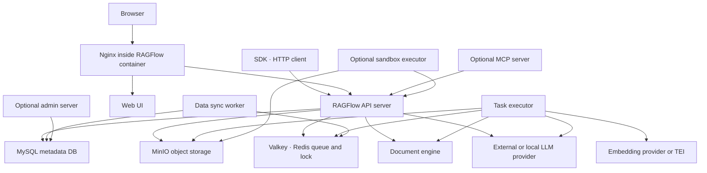
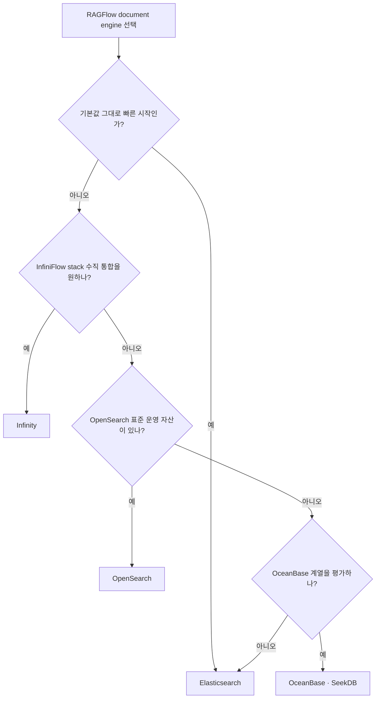

# RAGFlow 필요 인프라 및 셋업 가이드

작성일: 2026-06-07

## 결론 요약

RAGFlow는 단일 RAG 라이브러리가 아니라 **웹 UI/API 서버, 문서 파싱 워커, 검색/벡터 문서 엔진, 메타데이터 DB, 오브젝트 스토리지, 메시지 큐/캐시**가 함께 동작하는 제품형 RAG 플랫폼이다. 기본 Docker Compose 배포에서 필요한 핵심 인프라는 다음이다.

| 역할 | 기본 구현 | 필수 여부 | 용도 |
|---|---|---:|---|
| RAGFlow app | `infiniflow/ragflow:v0.25.6` | 필수 | Web UI, API, task executor, data sync, optional Admin/MCP |
| Metadata DB | MySQL 8.0.39 | 필수 | 사용자, tenant, dataset, document, task, model provider 설정 |
| Object storage | MinIO | 필수 | 업로드 원본 파일, 파싱 산출물, sandbox artifact |
| Message queue/cache | Valkey 8, Redis protocol | 필수 | task queue, distributed lock, session, cache, ID generator |
| Document engine | Elasticsearch 8.11.3 기본 | 필수 | chunk, full-text index, vector index, retrieval |
| Alternative doc engine | Infinity, OpenSearch, OceanBase, SeekDB | 선택 | Elasticsearch 대체 문서/벡터 검색 엔진 |
| Embedding service | 외부 provider 또는 TEI | 사실상 필수 | chunk embedding 생성 |
| LLM provider | OpenAI-compatible, Ollama 등 | 사실상 필수 | chat, metadata extraction, KG 생성, agent 실행 |
| Sandbox executor | sandbox-executor-manager + gVisor | 선택 | Agent CodeExec 컴포넌트의 Python/JavaScript 실행 |
| Nginx | RAGFlow image 내부 | 기본 포함 | Web/API reverse proxy, upload size, HTTPS |
| Kibana | Kibana | 선택 | Elasticsearch 운영/디버깅 |

일반 사용자는 `docker/docker-compose.yml`로 전체 stack을 올리는 것이 가장 빠르다. 개발자는 `docker/docker-compose-base.yml`로 MySQL/MinIO/Redis/doc engine만 띄운 뒤, Python backend와 frontend를 로컬에서 실행한다. Kubernetes 배포는 `helm/` chart가 있으며, Docker Compose 기본값은 `DOC_ENGINE=elasticsearch`, Helm 기본값은 `DOC_ENGINE=infinity`라는 차이가 있다.

## 로컬 분석 기준

- Repo: `.repos/ragflow`
- Commit: `be28177`
- 주요 파일:
  - `.repos/ragflow/docker/docker-compose.yml`
  - `.repos/ragflow/docker/docker-compose-base.yml`
  - `.repos/ragflow/docker/.env`
  - `.repos/ragflow/docker/service_conf.yaml.template`
  - `.repos/ragflow/docker/entrypoint.sh`
  - `.repos/ragflow/helm/values.yaml`

## 전체 아키텍처



### 컨테이너 내부 프로세스

`docker/entrypoint.sh`는 컨테이너 시작 시 `service_conf.yaml.template`의 환경변수를 실제 값으로 치환해 `conf/service_conf.yaml`을 만들고, 다음 프로세스를 조건부로 실행한다.

- nginx
- `api/ragflow_server.py`
- `rag/svr/task_executor.py`
- `rag/svr/sync_data_source.py`
- optional `admin/server/admin_server.py`
- optional MCP server

운영에서 처리량을 늘리려면 task executor를 별도 컨테이너로 분리하거나 `--workers`, `--consumer-no-beg`, `--consumer-no-end` 옵션으로 워커 수를 조정하는 구조를 검토할 수 있다.

## 시스템 요구사항

공식 문서 기준 최소 요구사항:

| 리소스 | 최소 |
|---|---:|
| CPU | 4 cores 이상 |
| RAM | 16 GB 이상 |
| Disk | 50 GB 이상 |
| Docker | 24.0.0 이상 |
| Docker Compose | v2.26.1 이상 |
| Host architecture | 공식 pre-built image는 x86, ARM64 image는 제공하지 않음 |
| Linux kernel setting | Elasticsearch 사용 시 `vm.max_map_count >= 262144` |
| Sandbox | gVisor, Docker 25.0+, Docker API 1.44+ |

실서비스 기준으로는 16GB RAM은 하한에 가깝다. Elasticsearch/OpenSearch 또는 TEI embedding model까지 같은 호스트에서 돌리면 32GB 이상이 현실적이다. `.env`의 기본 `MEM_LIMIT`는 컨테이너별 약 8GB로 잡혀 있고, TEI 기본 모델 `Qwen/Qwen3-Embedding-0.6B`는 주석상 약 25GB RAM/VRAM이 필요하다.

## Docker Compose 서비스 구성

### `docker-compose.yml`

RAGFlow app container를 정의한다.

| Service | Profile | Image | 주요 포트 |
|---|---|---|---|
| `ragflow-cpu` | `cpu` | `${RAGFLOW_IMAGE}` | `80`, `443`, `9380`, `9381`, `9382`, `9384`, `9383` |
| `ragflow-gpu` | `gpu` | `${RAGFLOW_IMAGE}` | `80`, `443`, `9380`, `9381`, `9382` |

기본 command는 CPU service에서 admin server와 model provider migration을 켠다.

```yaml
command:
  - --enable-adminserver
  - --init-model-provider-tables
```

### `docker-compose-base.yml`

RAGFlow 의존 인프라를 정의한다.

| Service | Profile | Image | Host port | Container port | 볼륨 |
|---|---|---|---:|---:|---|
| `es01` | `elasticsearch` | `elasticsearch:${STACK_VERSION}` | `ES_PORT=1200` | `9200` | `esdata01` |
| `opensearch01` | `opensearch` | `opensearchproject/opensearch:2.19.1` | `OS_PORT=1201` | `9201` | `osdata01` |
| `infinity` | `infinity` | `infiniflow/infinity:v0.7.0` | `23817`, `23820`, `5432` | same | `infinity_data` |
| `oceanbase` | `oceanbase` | `oceanbase/oceanbase-ce` | `2881` | `2881` | host path |
| `seekdb` | `seekdb` | `oceanbase/seekdb` | `2881` | `2881` | host path |
| `mysql` | always | `mysql:8.0.39` | `EXPOSE_MYSQL_PORT` | `3306` | `mysql_data` |
| `minio` | always | `pgsty/minio` | `9000`, `9001` | `9000`, `9001` | `minio_data` |
| `redis` | always | `valkey/valkey:8` | `6379` | `6379` | `redis_data` |
| `tei-cpu` | `tei-cpu` | text-embeddings-inference CPU | `6380` | `80` | none |
| `tei-gpu` | `tei-gpu` | text-embeddings-inference GPU | `6380` | `80` | GPU |
| `kibana` | `kibana` | `kibana:${STACK_VERSION}` | `6601` | `5601` | `kibana_data` |
| `sandbox-executor-manager` | `sandbox` | sandbox manager | `9385` | `9385` | Docker socket |

로컬 clone 기준 `.env`에서는 `EXPOSE_MYSQL_PORT=3306`이다. 일부 문서에는 예전 기본값 `5455`가 남아 있으므로, 실제 배포에서는 현재 사용하는 repo의 `docker/.env`를 우선 기준으로 삼아야 한다.

## 핵심 설정 파일

### `docker/.env`

Compose profile, image tag, 포트, 비밀번호, doc engine, batch size를 정한다.

| 변수 | 기본값 | 의미 |
|---|---|---|
| `DOC_ENGINE` | `elasticsearch` | `elasticsearch`, `infinity`, `oceanbase`, `opensearch`, `seekdb` 중 선택 |
| `DEVICE` | `cpu` | DeepDoc/task 실행 장치. `gpu` 설정 가능 |
| `COMPOSE_PROFILES` | `${DOC_ENGINE},${DEVICE}` | 선택된 doc engine과 CPU/GPU service를 결정 |
| `STACK_VERSION` | `8.11.3` | Elasticsearch/Kibana version |
| `MEM_LIMIT` | `8073741824` | 컨테이너별 memory limit |
| `RAGFLOW_IMAGE` | `infiniflow/ragflow:v0.25.6` | RAGFlow app image |
| `SVR_WEB_HTTP_PORT` | `80` | Web UI HTTP |
| `SVR_WEB_HTTPS_PORT` | `443` | Web UI HTTPS |
| `SVR_HTTP_PORT` | `9380` | Python API |
| `ADMIN_SVR_HTTP_PORT` | `9381` | Admin API |
| `SVR_MCP_PORT` | `9382` | MCP server |
| `GO_HTTP_PORT` | `9384` | Go API, hybrid mode |
| `GO_ADMIN_PORT` | `9383` | Go admin, hybrid mode |
| `API_PROXY_SCHEME` | `python` | nginx proxy target. `python`, `go`, `hybrid` |
| `DOC_BULK_SIZE` | `4` | 문서 parsing batch size |
| `EMBEDDING_BATCH_SIZE` | `16` | embedding batch size |
| `REGISTER_ENABLED` | `1` | 사용자 가입 허용 여부 |
| `MAX_CONTENT_LENGTH` | commented | 업로드 파일 크기 제한. nginx 설정도 같이 변경 필요 |
| `HF_ENDPOINT` | commented | Hugging Face mirror |

운영 배포에서는 `ELASTIC_PASSWORD`, `MYSQL_PASSWORD`, `MINIO_PASSWORD`, `REDIS_PASSWORD`, `OPENSEARCH_PASSWORD`를 반드시 변경해야 한다. `.env` 상단에도 기본 비밀번호로 배포하지 말라는 경고가 있다.

### `docker/service_conf.yaml.template`

RAGFlow backend가 실제로 읽는 서비스 설정 템플릿이다. 컨테이너 시작 시 `entrypoint.sh`가 환경변수를 치환해 `conf/service_conf.yaml`을 만든다.

주요 섹션:

- `ragflow`: API host/port
- `admin`: Admin host/port
- `mysql`: metadata DB 연결
- `minio`: object storage 연결
- `es`, `os`, `infinity`, `oceanbase`, `seekdb`: document engine별 연결
- `redis`: queue/cache/session 연결
- `user_default_llm`: 기본 LLM/embedding provider
- optional `s3`, `oss`, `azure`, `opendal`: 외부 object storage
- optional `oauth`, `authentication`, `permission`, `smtp`

## 빠른 Docker 셋업

### 1. OS 설정

Elasticsearch/OpenSearch를 쓰는 Linux host에서는 먼저 `vm.max_map_count`를 확인한다.

```bash
sysctl vm.max_map_count
sudo sysctl -w vm.max_map_count=262144
```

영구 적용:

```bash
echo "vm.max_map_count=262144" | sudo tee -a /etc/sysctl.conf
```

### 2. Repo clone 및 버전 고정

```bash
git clone https://github.com/infiniflow/ragflow.git
cd ragflow
git checkout v0.25.6
cd docker
```

`README.md`는 image tag와 local checkout의 `entrypoint.sh` 버전을 맞추는 것을 권장한다.

### 3. `.env` 수정

최소 수정:

```bash
cp .env .env.local.backup
```

다음 값은 운영 전에 바꾼다.

```env
ELASTIC_PASSWORD=<strong-password>
MYSQL_PASSWORD=<strong-password>
MINIO_PASSWORD=<strong-password>
REDIS_PASSWORD=<strong-password>
REGISTER_ENABLED=0
TZ=Asia/Seoul
```

Elasticsearch 대신 Infinity를 쓰려면:

```env
DOC_ENGINE=infinity
COMPOSE_PROFILES=${DOC_ENGINE},${DEVICE}
```

GPU를 쓰려면:

```env
DEVICE=gpu
COMPOSE_PROFILES=${DOC_ENGINE},${DEVICE}
```

### 4. 기동

```bash
docker compose -f docker-compose.yml up -d
```

로그 확인:

```bash
docker logs -f docker-ragflow-cpu-1
```

정상 기동 후:

```text
http://<server-ip>/
```

API는 기본 `http://<server-ip>:9380`, Admin API는 `:9381`, MCP는 켠 경우 `:9382`를 사용한다.

### 5. LLM 및 embedding 설정

RAGFlow v0.22 이후 Docker image는 embedding model을 포함하지 않는 slim 구조다. 따라서 다음 중 하나가 필요하다.

1. UI Settings에서 외부 LLM/embedding provider API key 설정
2. `service_conf.yaml.template`의 `user_default_llm` 설정
3. TEI profile로 local embedding service 실행
4. Ollama, Xinference, LocalAI 같은 local model server 연결

TEI를 Compose로 같이 띄우려면 `.env`에서 profile을 추가한다.

```env
COMPOSE_PROFILES=${COMPOSE_PROFILES},tei-cpu
TEI_MODEL=BAAI/bge-small-en-v1.5
```

기본 TEI 모델 `Qwen/Qwen3-Embedding-0.6B`는 주석상 25GB RAM/VRAM이 필요하므로, 작은 환경에서는 `BAAI/bge-small-en-v1.5`가 더 현실적이다.

## Document engine 선택



| Engine | 설정 | 장점 | 주의점 |
|---|---|---|---|
| Elasticsearch | `DOC_ENGINE=elasticsearch` | 기본값, 기능 호환 가장 안전 | Elastic 라이선스/운영 리소스, `vm.max_map_count` 필요 |
| Infinity | `DOC_ENGINE=infinity` | InfiniFlow AI-native DB, vector/full-text 통합 | Linux/arm64 공식 지원 제한, 일부 기능 차이 확인 필요 |
| OpenSearch | `DOC_ENGINE=opensearch` | Apache-2.0 계열 ES 대안 | password 정책, SSL/security 설정 확인 |
| OceanBase | `DOC_ENGINE=oceanbase` | OceanBase 기반 문서 저장/검색 실험 | 무거운 DB, memory/disk 요구 큼 |
| SeekDB | `DOC_ENGINE=seekdb` | OceanBase lite 계열 | 운영 성숙도와 RAGFlow 호환성 검증 필요 |

기존 데이터가 있는 상태에서 document engine을 바꾸면 인덱스/볼륨 호환 문제가 생긴다. 공식 switch guide도 `docker compose down -v`를 사용하므로, 이는 데이터를 지우는 작업이다. 운영 데이터가 있으면 먼저 백업한다.

## 개발자용 Source Launch

소스 디버깅은 app container를 쓰지 않고 의존 서비스만 Docker로 띄운다.

```bash
git clone https://github.com/infiniflow/ragflow.git
cd ragflow
pipx install uv
uv sync --python 3.13 --frozen
```

기본 인프라 기동:

```bash
docker compose -f docker/docker-compose-base.yml up -d
```

`/etc/hosts`에 compose service name을 localhost로 매핑한다.

```text
127.0.0.1       es01 infinity mysql minio redis
```

로컬 backend:

```bash
source .venv/bin/activate
export PYTHONPATH=$(pwd)
python rag/svr/task_executor.py -i 1
python api/ragflow_server.py
```

Frontend:

```bash
cd web
npm install
npm run dev
```

이 경로에서는 `docker/service_conf.yaml.template` 또는 `conf/service_conf.yaml`의 host/port가 host에서 접근 가능한 포트와 맞아야 한다. Elasticsearch는 compose 내부 `9200`이지만 host 노출은 `.env`의 `ES_PORT=1200`이다.

## Sandbox 셋업

Agent의 CodeExec 컴포넌트를 쓰려면 sandbox provider가 필요하다. 기본 self-managed 방식은 `sandbox-executor-manager`가 Docker socket을 마운트하고 Python/Node.js runtime container를 관리한다.

필수/권장:

- Linux + gVisor
- Docker 25.0 이상
- Docker Compose v2.26.1 이상
- `SANDBOX_ENABLED=1`
- `COMPOSE_PROFILES=${COMPOSE_PROFILES},sandbox`
- `/etc/hosts`에 `sandbox-executor-manager` 추가

`.env` 예시:

```env
SANDBOX_ENABLED=1
COMPOSE_PROFILES=${COMPOSE_PROFILES},sandbox
SANDBOX_EXECUTOR_MANAGER_POOL_SIZE=3
SANDBOX_MAX_MEMORY=256m
SANDBOX_TIMEOUT=10s
```

보안상 `local` sandbox provider는 신뢰된 개발 환경에서만 사용한다. 운영에서는 gVisor 기반 self-managed 또는 격리된 원격/클라우드 provider를 우선 검토한다.

## Kubernetes Helm 셋업

RAGFlow repo에는 `helm/` chart가 있다.

요구사항:

- Kubernetes 1.24 이상
- Helm 3.10 이상

설치:

```bash
helm upgrade --install ragflow ./helm \
  --namespace ragflow --create-namespace
```

Helm chart 특징:

- 기본 `DOC_ENGINE: infinity`
- MySQL, MinIO, Redis는 `enabled: true`면 in-cluster 배포
- `mysql.enabled=false`, `minio.enabled=false`, `redis.enabled=false`로 외부 managed service 연결 가능
- Elasticsearch/OpenSearch/Infinity 중 선택한 doc engine만 렌더링
- Ingress 설정 지원
- image registry mirror와 imagePullSecret 지원

외부 MySQL/MinIO/Redis 예시:

```yaml
mysql:
  enabled: false
minio:
  enabled: false
redis:
  enabled: false

env:
  MYSQL_HOST: mydb.example.com
  MYSQL_PORT: "3306"
  MYSQL_USER: root
  MYSQL_DBNAME: rag_flow
  MYSQL_PASSWORD: "<password>"
  MINIO_HOST: s3.example.com
  MINIO_PORT: "9000"
  MINIO_ROOT_USER: rag_flow
  MINIO_PASSWORD: "<password>"
  REDIS_HOST: redis.example.com
  REDIS_PORT: "6379"
  REDIS_PASSWORD: "<password>"
```

## 운영 체크리스트

### 필수 변경

- 기본 비밀번호 전부 변경
- `REGISTER_ENABLED=0` 검토
- 외부 노출 포트 최소화
- `SVR_WEB_HTTP_PORT`, `SVR_WEB_HTTPS_PORT`와 reverse proxy/Ingress 정책 확정
- `MAX_CONTENT_LENGTH`와 `nginx/nginx.conf`의 `client_max_body_size`를 같이 조정
- MinIO, MySQL, Redis, doc engine 볼륨 백업 정책 수립
- document engine 변경 전 `down -v` 사용 금지

### 권장 구성

| 환경 | 권장 인프라 |
|---|---|
| 로컬 PoC | Docker Compose 기본값, Elasticsearch, MinIO, MySQL, Valkey |
| 개발 | `docker-compose-base.yml` + local Python/API/frontend |
| 작은 팀 내부 서비스 | Compose 또는 Helm, external LLM/embedding, 주기적 volume backup |
| 운영 서비스 | Kubernetes, managed MySQL/S3-compatible storage/Redis, dedicated doc engine, Ingress TLS |
| 민감 데이터 | 외부 LLM 사용 여부 검토, local model server, object storage encryption, access log 관리 |
| Agent CodeExec | gVisor sandbox, 별도 노드/namespace, 제한된 Docker socket 권한 검토 |

## 장애 확인 포인트

| 증상 | 확인할 것 |
|---|---|
| 브라우저 `network abnormal` | `docker logs -f docker-ragflow-cpu-1`에서 API 기동 완료 여부 |
| Elasticsearch 기동 실패 | `vm.max_map_count`, memory, disk watermark |
| 파일 업로드 실패 | `MAX_CONTENT_LENGTH`, nginx `client_max_body_size`, MinIO health |
| 문서 parsing 지연 | task executor worker 수, CPU/GPU, `DOC_BULK_SIZE`, embedding provider latency |
| 검색 결과 없음 | embedding model 일치 여부, document engine index 생성 여부 |
| LLM 호출 실패 | UI Settings 또는 `user_default_llm` API key/base_url |
| Sandbox 실패 | `SANDBOX_ENABLED`, profile, gVisor, Docker API version, executor manager health |

## 참고 자료

- [RAGFlow GitHub](https://github.com/infiniflow/ragflow)
- [RAGFlow official site](https://ragflow.org/)
- [RAGFlow Docker README](https://github.com/infiniflow/ragflow/blob/main/docker/README.md)
- [RAGFlow Configuration docs](https://ragflow.io/docs/dev/configurations)
- [Launch RAGFlow from source](https://ragflow.io/docs/dev/launch_ragflow_from_source)
- [Switch document engine](https://ragflow.io/docs/dev/switch_doc_engine)
- [Sandbox quickstart](https://ragflow.io/docs/dev/sandbox_quickstart)
