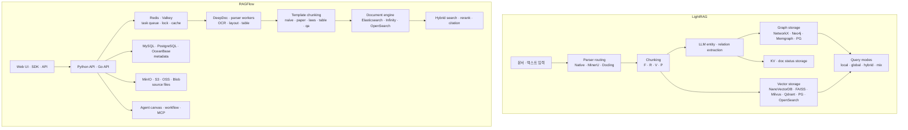

# LightRAG vs RAGFlow 비교 — Graph RAG 엔진과 문서 이해 플랫폼

> 비교 대상:
> - [HKUDS/LightRAG](https://github.com/HKUDS/LightRAG) — 로컬 소스 `_repos/lightrag`, commit `38c482a` (2026-06-09)
> - [infiniflow/ragflow](https://github.com/infiniflow/ragflow) — 로컬 소스 `.repos/ragflow`, commit `d56aeb2` (2026-06-10)
> - 분석 관점: 금융·기업문서·리포트·공시처럼 복잡한 문서를 다루는 서비스에서 어떤 선택이 더 실용적인가

---

## 1. 결론

**LightRAG와 RAGFlow는 같은 RAG 범주에 있지만 제품 철학이 다르다.**

| 한 줄 정의 | LightRAG | RAGFlow |
|---|---|---|
| 본질 | 프로그래머블 Graph-enhanced RAG 엔진 | 문서 이해 중심의 제품형 RAG·Agent 플랫폼 |
| 강점 | KG + vector hybrid retrieval, 낮은 인프라 진입장벽, storage 조합 자유도 | PDF/OCR/table/layout 처리, UI 기반 인제스천·검수, 근거 citation, 운영형 플랫폼 |
| 약점 | 제품형 문서 운영 기능은 제한적, 문서 파싱 품질은 외부 MinerU/Docling 의존 | 인프라가 무겁고 내부 커스터마이징 난도가 높음 |
| 우선 선택 | 자체 서비스에 RAG 엔진을 임베드하고 싶은 팀 | 문서 업로드부터 검색·답변·인용·Agent UI까지 빠르게 운영하려는 팀 |

**증권사 리포트, 기업 공시, 재무 문서처럼 PDF·표·스캔·원문 근거 확인이 중요한 도메인에서는 RAGFlow가 더 즉시적인 선택이다.** DeepDoc, 템플릿 청킹, 페이지·좌표 기반 citation, Web UI가 문서 운영 문제를 직접 해결한다.

반대로 **문서에서 추출한 기업·인물·이벤트·지표 관계를 자체 그래프/온톨로지로 다루고, RAG 엔진을 서비스 내부 로직에 깊게 넣고 싶다면 LightRAG가 더 낫다.** 코드 API와 storage abstraction이 더 가볍고, KG 중심 retrieval 경로가 명확하다.

---

## 2. 아키텍처 차이

LightRAG는 RAG core가 중심이다. 하나의 `LightRAG` 객체가 parser, chunker, graph/vector/KV/doc-status storage를 묶고, `QueryParam.mode`로 검색 경로를 제어한다. API/WebUI는 있지만 본질은 라이브러리형 엔진이다.

RAGFlow는 애초에 플랫폼이다. Web UI, REST/SDK, 문서 파싱 워커, 검색 엔진, 메타 DB, 오브젝트 스토리지, 큐, Agent canvas가 함께 동작한다. 단일 Python 패키지로 가져다 쓰는 라이브러리라기보다 자체 서비스를 띄우는 구조다.

---

## 3. 문서 처리와 청킹

| 관점 | LightRAG | RAGFlow | 판단 |
|---|---|---|---|
| 기본 철학 | KG extraction에 적합한 chunk 생성 | 원문 문서 이해와 근거 보존 | 목적이 다름 |
| 청킹 방식 | `Fix`, `Recursive`, `Vector`, `Paragraph` | 문서 유형별 template chunking | RAGFlow는 업무 문서 유형화에 강함 |
| PDF/OCR/layout | MinerU/Docling 같은 외부 parser 연동 | DeepDoc 자체 OCR·layout·table recognition | RAGFlow 우세 |
| 표 처리 | `Paragraph` chunking과 sidecar 활용 | table template, TSR, UI 검수 | RAGFlow 우세 |
| 청킹 검수 UX | API/WebUI가 있으나 엔진 중심 | 청크 시각화·수정 UX가 핵심 기능 | RAGFlow 우세 |
| KG용 구조화 | entity/relation 추출이 core flow | GraphRAG는 선택적 dataset indexing | LightRAG 우세 |

LightRAG의 2026년 현재 버전은 `P`(Paragraph Semantic) chunking과 MinerU/Docling parser routing을 도입해 문서 구조 대응력이 많이 좋아졌다. 그래도 heavy PDF, 스캔 문서, 복잡한 표·슬라이드·이미지까지 자체적으로 이해하는 쪽은 RAGFlow가 더 깊다.

RAGFlow의 `rag/app/`에는 `naive`, `paper`, `book`, `laws`, `manual`, `qa`, `table`, `resume`, `presentation`, `picture`, `email`, `one`, `tag` 같은 템플릿이 있다. "문서 종류마다 chunking 기준이 다르다"는 운영 현실을 제품 기능으로 만든 셈이다.

---

## 4. 검색과 답변 생성

| 관점 | LightRAG | RAGFlow |
|---|---|---|
| 기본 retrieval | entity vector + relation vector + chunk vector + graph traversal | full-text + dense vector hybrid search |
| Query mode | `naive`, `local`, `global`, `hybrid`, `mix` | dataset/chat 설정 기반 retrieval + rerank |
| Graph RAG | 기본 설계 자체가 KG 중심 | dataset 단위 GraphRAG indexing 옵션 |
| RAPTOR 계열 | 핵심 기능은 아님 | RAPTOR / Psi-RAG 계열 summary tree 지원 |
| Citation | source/reference 지원 | 답변 문장과 청크를 다시 매칭해 citation 삽입 |
| 설명 가능성 | entity/relation/chunk context 확인 | 원문 페이지·좌표 기반 근거 확인 |

LightRAG는 질문을 high-level/low-level keyword로 분해하고, mode에 따라 entity 또는 relation vector search로 시작한 뒤 그래프 이웃을 확장한다. 따라서 "A 기업과 B 기업의 관계", "이 리스크가 어떤 공급망과 연결되는가" 같은 multi-hop 관계 질문에 잘 맞는다.

RAGFlow는 검색 엔진 관점이 더 강하다. Elasticsearch/Infinity/OpenSearch 위에서 full-text와 dense vector를 결합하고, rerank와 citation을 붙인다. "이 문서의 어느 페이지 어느 근거에서 나온 답인가"를 사용자에게 보여주는 업무형 QA에 강하다.

---

## 5. 스토리지와 인프라

| 레이어 | LightRAG | RAGFlow |
|---|---|---|
| App runtime | Python package, FastAPI server optional | Python API + Go API + workers |
| Metadata | KV/doc status backend 선택 | MySQL/PostgreSQL/OceanBase |
| Vector | NanoVectorDB, FAISS, Milvus, Qdrant, PostgreSQL, MongoDB, OpenSearch | Document engine 내부 vector |
| Graph | NetworkX, Neo4j, Memgraph, PostgreSQL, MongoDB, OpenSearch | GraphRAG 옵션, 주 저장소는 document engine |
| Queue/cache | backend별 선택, 단순 구성 가능 | Redis/Valkey 필수 |
| Object storage | local/working_dir 중심 | MinIO/S3/OSS/Azure/GCS |
| 배포 | pip/uv, Docker Compose, API server | Docker Compose, Helm, 다중 서비스 |
| 최소 운영 부담 | 낮음 | 높음 |

LightRAG는 기본 개발 환경에서는 file-backed storage로도 시작할 수 있고, production에서는 PostgreSQL/MongoDB/OpenSearch를 통합 backend로 쓰거나 Milvus+Memgraph 같은 전문 backend를 조합할 수 있다. 인프라 선택권은 넓지만, 운영자가 consistency와 migration을 직접 설계해야 한다.

RAGFlow는 시작부터 인프라가 많다. 기본 Docker Compose만 봐도 RAGFlow app, MySQL, MinIO, Redis/Valkey, Elasticsearch 또는 Infinity/OpenSearch가 필요하다. 대신 플랫폼 기능과 운영 UX를 얻는다.

---

## 6. 확장성과 커스터마이징

| 관점 | LightRAG | RAGFlow | 판단 |
|---|---|---|---|
| 코드 임베딩 | Python API로 직접 사용하기 쉬움 | 서비스 API/SDK를 통해 사용하는 편 | LightRAG |
| storage 확장 | `BaseKVStorage`, `BaseVectorStorage`, `BaseGraphStorage` | document engine adapter 중심, 내부 결합도 높음 | LightRAG |
| parser 확장 | routing과 sidecar 규약에 맞춰 추가 | parser/template/plugin 지점이 많지만 제품 내부 이해 필요 | 상황별 |
| Agent 기능 | RAG 엔진 중심, agent는 외부에서 조립 | Agent canvas, workflow, MCP, sandbox | RAGFlow |
| UI customization | 상대적으로 단순 | 제품 UI가 크고 기능이 많음 | 요구사항별 |
| API 제품화 | 직접 붙이기 쉬움 | 이미 제품 API/SDK 제공 | RAGFlow |

LightRAG는 개발자가 자기 서비스에 RAG 엔진을 심기 좋다. Weaviate 같은 미지원 vector DB도 `BaseVectorStorage`를 구현하고 registry에 등록하면 붙일 수 있다.

RAGFlow는 반대로 "RAG 서비스를 하나 띄우고 그 위에 업무를 얹는" 방식이 자연스럽다. 커스터마이징 가능성은 높지만, Python/Go/TypeScript/검색엔진/DB까지 걸친 제품 전체 구조를 이해해야 한다.

---

## 7. 금융 서비스 관점

| 요구사항 | 더 적합 | 이유 |
|---|---|---|
| 증권사 리포트 PDF 업로드·검색·인용 | RAGFlow | PDF layout, 표, 원문 citation, UI 검수 |
| 기업 공시 원문 근거 확인 | RAGFlow | 페이지·청크 근거 추적 UX가 강함 |
| 기업·임원·산업·이벤트 관계 KG | LightRAG | entity/relation extraction과 graph traversal이 core |
| 자체 valuation/재무 계산 tool 연동 | LightRAG | 엔진을 앱 로직에 넣기 쉬움 |
| 애널리스트용 내부 문서 포털 | RAGFlow | 권한·데이터셋·문서 운영 UX에 가까움 |
| 서비스 백엔드에 얇게 붙는 RAG module | LightRAG | 인프라와 코드 표면이 작음 |
| Agent workflow까지 한 화면에서 구성 | RAGFlow | Agent canvas와 MCP/workflow 기능 |
| Weaviate 등 사내 vector DB 사용 | LightRAG | storage interface 구현 여지가 큼 |

금융 문서 서비스라면 단일 선택보다 역할 분리가 더 현실적이다.

1. **문서 ingestion과 검수 포털**은 RAGFlow가 유리하다.
2. **도메인 KG와 질의 runtime**은 LightRAG 또는 GraphRAG-SDK 같은 graph-native 엔진이 유리하다.
3. **재무 수치 계산**은 둘 다 RAG 내부에 넣기보다 별도 정형 DB와 calculation tool로 분리해야 한다.

---

## 8. 장단점

### LightRAG 장점

- KG + vector retrieval이 core라 multi-hop 관계 질문에 강하다.
- Python code API와 storage abstraction이 단순하다.
- 인프라를 작게 시작할 수 있다.
- vector, graph, KV, doc status backend를 따로 선택할 수 있다.
- MIT 라이선스라 사용 조건이 단순하다.

### LightRAG 약점

- RAGFlow 같은 문서 운영 플랫폼은 아니다.
- 복잡한 PDF/OCR/table 처리는 외부 parser 서비스 품질에 의존한다.
- storage 조합이 자유로운 만큼 production consistency 설계가 필요하다.
- 청크 검수, 원문 좌표 citation, 데이터셋 운영 UX는 상대적으로 약하다.

### RAGFlow 장점

- DeepDoc 기반 문서 이해가 강하다.
- Web UI에서 문서 업로드, 청킹 확인, 검색, citation을 바로 운영할 수 있다.
- Elasticsearch/Infinity/OpenSearch 기반 hybrid retrieval이 제품형으로 묶여 있다.
- Agent workflow, MCP, connector, sandbox 등 앱 플랫폼 기능이 넓다.
- Apache-2.0 라이선스다.

### RAGFlow 약점

- 인프라가 무겁다. 최소 구성도 DB, object storage, queue/cache, document engine이 필요하다.
- 내부 구조가 Python, Go, C++, TypeScript로 넓어 커스터마이징 비용이 크다.
- "내 앱 안의 작은 RAG library"로 쓰기에는 과하다.
- Graph RAG는 core identity라기보다 dataset indexing 옵션에 가깝다.

---

## 9. 선택 가이드

| 상황 | 추천 |
|---|---|
| 빠르게 문서 RAG 포털을 만들고 싶다 | RAGFlow |
| PDF/스캔/표/슬라이드가 많다 | RAGFlow |
| 사용자가 답변 근거를 원문에서 직접 확인해야 한다 | RAGFlow |
| 사내 앱 백엔드에 RAG 엔진을 코드로 심고 싶다 | LightRAG |
| KG 기반 관계 검색이 핵심이다 | LightRAG |
| 인프라를 작게 시작해야 한다 | LightRAG |
| Agent workflow와 RAG를 한 플랫폼에서 운영하고 싶다 | RAGFlow |
| vector/graph DB를 사내 표준에 맞춰 바꿔야 한다 | LightRAG |

**최종 판단**:

- **문서 품질·운영 UX·근거 검증이 핵심이면 RAGFlow**
- **엔진 유연성·KG 검색·서비스 내부 통합이 핵심이면 LightRAG**
- **금융 리서치/공시 서비스는 RAGFlow로 ingestion·citation을 확보하고, LightRAG류 graph runtime을 별도 도메인 KG에 붙이는 hybrid 구조가 가장 실용적**

---

## 10. 참고 소스

- LightRAG GitHub: https://github.com/HKUDS/LightRAG
- RAGFlow GitHub: https://github.com/infiniflow/ragflow
- LightRAG local source: `_repos/lightrag`, commit `38c482a`
- RAGFlow local source: `.repos/ragflow`, commit `d56aeb2`
- 주요 LightRAG 파일: `lightrag/lightrag.py`, `lightrag/base.py`, `lightrag/pipeline.py`, `lightrag/chunker/*.py`, `lightrag/kg/*.py`
- 주요 RAGFlow 파일: `deepdoc/`, `rag/app/*.py`, `rag/nlp/search.py`, `rag/raptor.py`, `agent/canvas.py`, `docker/docker-compose-base.yml`, `helm/values.yaml`
