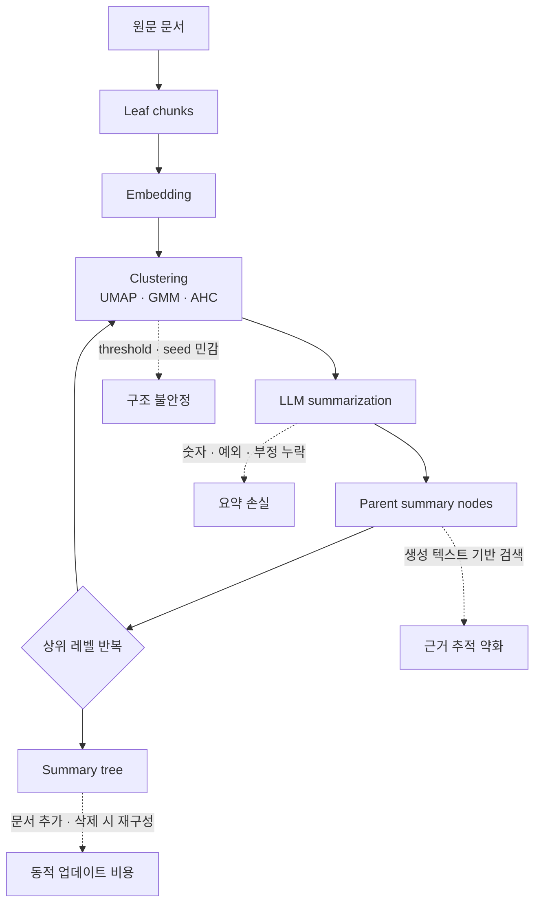

# RAPTOR 방식의 단점과 적용 리스크

> 대상: RAPTOR(Recursive Abstractive Processing for Tree-Organized Retrieval)
> 핵심 소스:
> - 원 논문: [OpenReview ICLR 2024](https://openreview.net/forum?id=GN921JHCRw)
> - 공식 구현: [parthsarthi03/raptor](https://github.com/parthsarthi03/raptor), 로컬 소스 `.repos/raptor`, commit `7da1d48`
> - RAGFlow 구현: `.repos/ragflow/rag/raptor.py`, RAGFlow commit `d56aeb2`
> - RAGFlow RAPTOR 문서: https://ragflow.io/docs/enable_raptor
> - Dynamic datasets 후속 논문: https://arxiv.org/abs/2410.01736
> - Cross-document Tree-RAG 후속 논문: https://arxiv.org/abs/2605.00529

---

## 1. 요약

RAPTOR는 긴 문서를 chunk로 나눈 뒤, chunk embedding을 클러스터링하고, 클러스터를 LLM으로 요약해 상위 summary node를 만들고, 이 과정을 반복해 **요약 트리**를 구축하는 방식이다. 질문 시 leaf chunk뿐 아니라 중간·상위 summary node를 함께 검색해 긴 문서의 전체 맥락을 더 잘 잡는 것이 목적이다.

하지만 실무 관점의 단점도 분명하다.

| 단점 | 영향 | 특히 문제되는 상황 |
|---|---|---|
| 인덱싱 비용 증가 | embedding, clustering, LLM summarization 비용 증가 | 문서가 많거나 자주 업데이트되는 서비스 |
| 요약 손실 | 숫자, 예외, 부정 표현, 근거 문장 누락 가능 | 공시, 계약서, 재무 리포트 |
| 동적 업데이트 어려움 | 문서 추가·삭제 시 클러스터와 요약 트리 재구성 필요 | 매일 문서가 들어오는 운영 서비스 |
| 클러스터링 민감도 | threshold, max cluster, random seed에 따라 트리 품질 변동 | 이질적 문서가 섞인 corpus |
| cross-document multi-hop 한계 | 트리는 연결 구조가 약해 문서 간 관계 추론이 어려움 | 기업·인물·이벤트 관계 검색 |
| provenance 약화 | summary node는 생성 텍스트라 원문 근거 추적이 복잡 | 감사·컴플라이언스·리서치 검증 |
| 단순 질의에는 과함 | flat vector/BM25/hybrid retrieval보다 비용 대비 이득 작음 | 짧은 FAQ, 단일 문서 사실 검색 |

**결론**: RAPTOR는 "긴 문서의 전체 맥락을 요약 계층으로 보강하는 retrieval enhancer"이지, 모든 RAG에 기본으로 켜야 하는 기능은 아니다. 문서가 안정적이고, 긴 문서 요약·multi-step QA가 많고, 추가 인덱싱 비용을 감당할 수 있을 때 효과적이다.

---

## 2. 구조상 발생하는 리스크

RAPTOR의 강점과 단점은 같은 지점에서 나온다. summary tree는 긴 문서의 전체 맥락을 압축하지만, 그 압축이 곧 정보 손실과 운영 복잡도를 만든다.

---

## 3. 단점 상세

### 3.1 인덱싱 비용이 크다

RAPTOR는 일반 RAG보다 인덱싱 단계가 무겁다.

1. 원문 chunk embedding
2. UMAP/GMM 또는 AHC clustering
3. cluster별 LLM 요약
4. summary embedding
5. 상위 레벨에서 2~4 반복
6. leaf와 summary node 모두 저장

RAGFlow 공식 문서도 RAPTOR를 켜면 **memory, computational resources, tokens**가 많이 필요하다고 경고한다. 실제 RAGFlow 구현도 LLM cache, embedding cache, task cancel, timeout, max error 같은 보호 장치를 넣고 있다. 이것은 기능이 가볍지 않다는 신호다.

**실무 영향**:

- 대량 문서 초기 indexing 시간이 길어진다.
- LLM summarization 비용이 추가된다.
- 실패·중단·재시도 처리까지 운영 로직이 필요하다.
- 문서가 매일 들어오는 금융/뉴스/공시 서비스에서는 build backlog가 생길 수 있다.

### 3.2 요약 손실과 요약 환각

RAPTOR의 parent node는 원문이 아니라 LLM이 생성한 요약이다. 이 과정에서 다음이 발생할 수 있다.

- 숫자, 날짜, 단위, 조건이 빠진다.
- "하지 않았다", "제외한다", "단, ..." 같은 부정·예외가 약해진다.
- 여러 chunk의 정보가 자연스럽게 합쳐지며 원문에 없는 연결이 생긴다.
- summary가 검색되면 답변이 원문보다 summary 표현에 끌릴 수 있다.

RAGFlow의 기본 RAPTOR prompt도 "numbers를 조심하고 지어내지 말라"는 식의 지시를 포함한다. 이런 지시가 필요하다는 것 자체가 요약 단계의 정보 왜곡 가능성을 보여준다.

**금융 문서에서는 특히 위험하다.** 공시의 수치, 리스크 문구, 회계 주석, 전망치, 법적 disclaimer는 summary로 대체하면 안 된다. RAPTOR summary는 navigation layer로 쓰고, 최종 답변 근거는 leaf chunk나 원문 citation으로 되돌리는 설계가 필요하다.

### 3.3 동적 데이터셋 업데이트가 어렵다

RAPTOR는 chunk 간 유사도 분포를 보고 cluster를 만들고, 그 cluster를 다시 요약해 트리를 만든다. 따라서 문서 하나를 추가하거나 삭제해도 기존 cluster 경계와 parent summary가 달라질 수 있다.

2024년 dynamic dataset 후속 논문은 이런 recursive-abstractive hierarchy가 문서 추가·삭제가 있는 데이터셋에서 업데이트가 어렵다고 지적한다. 즉 RAPTOR는 정적인 corpus에는 맞지만, 계속 바뀌는 corpus에서는 유지 비용이 커진다.

**실무 영향**:

- 문서별 incremental update가 단순하지 않다.
- stale summary node가 남을 수 있다.
- 삭제 문서의 내용이 parent summary에 남는 문제가 생길 수 있다.
- compliance 관점에서는 "삭제했는데 요약에는 남아 있는" 상태가 치명적이다.

RAGFlow도 RAPTOR chunk cleanup 로직을 별도로 둔다. 운영 구현이 이런 cleanup을 신경 써야 한다는 뜻이다.

### 3.4 클러스터링 품질과 파라미터에 민감하다

공식 RAPTOR 구현은 UMAP 차원 축소와 Gaussian Mixture Model 기반 clustering을 사용한다. RAGFlow도 GMM과 AHC 계열을 지원하고, `threshold`, `max_cluster`, `random_seed`, `max_token` 같은 설정을 노출한다.

문제는 embedding space의 cluster가 항상 문서 의미 구조와 일치하지 않는다는 점이다.

- 같은 문서의 순차 맥락이 semantic clustering에서 분리될 수 있다.
- 문서 유형이 섞이면 cluster가 주제보다 문체·형식에 끌릴 수 있다.
- threshold를 높이면 cluster가 너무 잘게 쪼개지고, 낮추면 잡음이 섞인다.
- random seed에 따라 tree 구조가 달라질 수 있다.

2026년 Tree-RAG 후속 연구도 기존 Tree-RAG가 rigid distribution assumption 때문에 noisy clustering을 만들 수 있다고 지적한다.

### 3.5 Cross-document multi-hop에는 그래프보다 약하다

RAPTOR tree는 주로 "유사한 chunk를 묶어 요약"하는 구조다. 하지만 기업·인물·제품·이벤트·계약·공급망처럼 문서 간 명시적 관계가 중요한 질문은 clustering tree만으로 부족하다.

예를 들어:

- "A 기업의 신규 공급계약이 B 기업의 매출 가이던스에 어떤 영향을 줄 수 있나?"
- "동일 임원이 관여한 여러 공시 이벤트를 연결해줘"
- "반도체 장비 공급망에서 특정 제재가 어떤 고객사에 전파되나?"

이런 질문은 summary tree보다 entity/relation graph가 더 자연스럽다. 2026년 Hierarchical Abstract Tree 논문도 기존 Tree-RAG가 cross-document multi-hop에서 structural isolation, 즉 문서 간 명시적 연결 부족 문제가 있다고 지적한다.

### 3.6 근거 추적이 복잡해진다

RAPTOR parent node는 여러 leaf chunk의 추상 요약이다. 따라서 parent summary가 검색되어 답변에 쓰였을 때, 그 답변의 정확한 원문 근거를 다시 leaf로 내려가 찾아야 한다.

그렇지 않으면:

- citation이 summary node를 가리킨다.
- 사용자는 원문에서 동일 문장을 찾을 수 없다.
- 감사·법무·리서치 검증에서 "생성된 요약"이 근거처럼 보인다.

RAGFlow처럼 citation이 중요한 제품에서는 RAPTOR를 켜더라도 최종 citation은 원문 chunk 중심으로 되돌리는 후처리가 필요하다.

### 3.7 단순 질의에는 비용 대비 이득이 작다

RAPTOR가 강한 영역은 긴 문서의 전체 맥락, multi-step reasoning, broad semantic understanding이다. 반대로 다음에는 과하다.

- 짧은 FAQ
- 제품 매뉴얼의 특정 절차 검색
- "매출액은 얼마인가" 같은 정확한 단일 수치 질문
- 이미 섹션/목차/metadata가 잘 정리된 문서
- full-text 검색이 강한 법률·공시 원문 검색

이런 경우 BM25+dense hybrid, metadata filtering, parent-child chunking, section-aware chunking이 더 단순하고 비용도 낮다.

---

## 4. RAGFlow에서 RAPTOR를 켤 때 주의점

RAGFlow 문서 기준 RAPTOR는 dataset 설정에서 수동으로 켜는 선택 기능이다. 기본 설정 예시는 다음 성격이다.

| 설정 | 의미 | 리스크 |
|---|---|---|
| prompt | cluster 요약 prompt | 도메인별 숫자·법률 문구 보존 지시 필요 |
| max token | summary chunk 최대 토큰 | 너무 낮으면 정보 손실, 너무 높으면 비용 증가 |
| threshold | cluster 유사도 기준 | retrieval 품질과 tree 크기에 직접 영향 |
| max cluster | 최대 cluster 수 | 크면 비용 증가, 작으면 과도한 압축 |
| random seed | cluster 재현성 | 운영 재빌드 결과 재현성에 중요 |

RAGFlow의 RAPTOR는 `scope`, `clustering_method`, `tree_builder`도 다룬다. 최근 구현은 classic `raptor` 외에 `psi` tree builder와 AHC clustering을 지원한다. 이는 원 RAPTOR의 한계를 줄이려는 방향이지만, 동시에 설정 표면이 넓어졌다는 뜻이다.

---

## 5. GraphRAG와의 비교 관점

| 요구사항 | RAPTOR | GraphRAG / KG |
|---|---|---|
| 긴 문서의 전체 요약 맥락 | 강함 | 별도 community summary 필요 |
| 원문 근거의 정확한 위치 | 약함, leaf 추적 필요 | chunk provenance 설계 시 강함 |
| 문서 간 관계 추론 | 약함 | 강함 |
| 엔티티 중심 질의 | 간접적 | 직접적 |
| 업데이트/삭제 | 어려움 | entity/chunk 단위 설계 가능 |
| 비용 | indexing LLM 요약 비용 큼 | extraction 비용 큼, 구조는 더 명시적 |
| 설명 가능성 | summary tree 설명 | entity/relation path 설명 |

RAPTOR와 GraphRAG는 대체재라기보다 보완재에 가깝다. RAPTOR는 hierarchical summary를 잘 만들고, GraphRAG는 entity/relation path를 잘 만든다. 금융/기업 분석에서는 둘 다 쓰더라도 역할을 분리하는 편이 낫다.

---

## 6. 언제 쓰고 언제 피할까

### 쓰기 좋은 경우

- 긴 보고서, 논문, 책처럼 문서 내부의 global context가 중요한 경우
- 질문이 특정 문장 하나보다 "전체 흐름"과 "여러 부분의 종합"을 요구하는 경우
- corpus가 자주 바뀌지 않는 경우
- 요약 비용을 감당할 수 있고 batch indexing 시간이 허용되는 경우
- summary node를 navigation layer로 쓰고 leaf citation을 유지할 수 있는 경우

### 피하거나 신중해야 하는 경우

- 공시, 계약, 약관, 회계 주석처럼 원문 표현이 중요한 경우
- 매일 대량의 문서가 추가·삭제되는 경우
- 삭제 준수, 감사 추적, 정확한 citation이 중요한 경우
- cross-document 관계 추론이 핵심인 경우
- 이미 검색 엔진의 full-text, metadata, section filtering으로 충분한 경우

---

## 7. 엔지니어링 판단

RAPTOR는 "검색 recall을 높이는 요약 계층"이지만, production에서는 **추가 인덱스**로 봐야 한다. 기본 검색 경로를 대체하기보다 다음처럼 붙이는 것이 안전하다.

1. leaf chunk와 원문 citation을 canonical source로 유지한다.
2. RAPTOR summary node는 query expansion 또는 candidate recall 보강용으로 쓴다.
3. 답변 생성 전에는 summary가 가리키는 leaf chunk를 다시 가져온다.
4. 삭제/업데이트가 많은 데이터셋은 RAPTOR를 문서별 scope로 제한하거나 비활성화한다.
5. 숫자·재무·법률 문서에서는 summary prompt와 검증 로직을 별도 설계한다.

한 줄로 정리하면: **RAPTOR는 긴 문서의 추상 맥락 검색에는 좋지만, 동적 데이터·정확한 수치·cross-document 관계·감사 가능한 citation에는 단독으로 쓰기 어렵다.**
