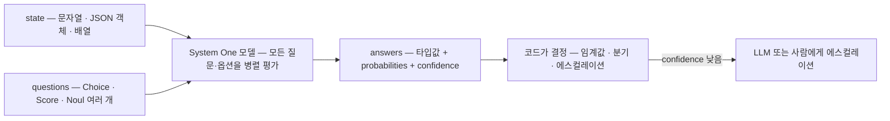
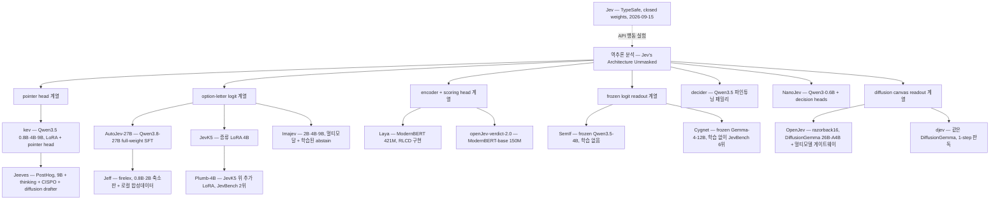
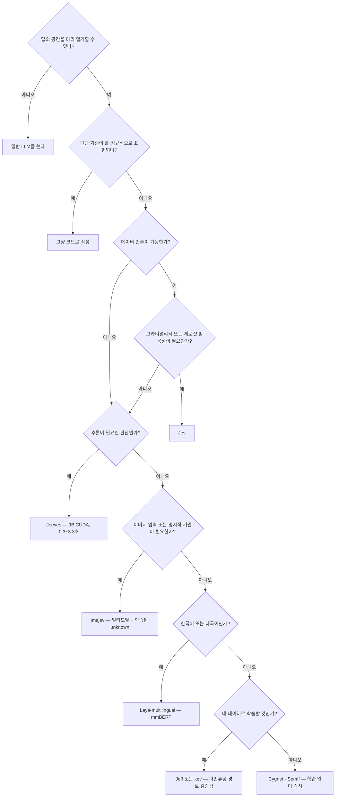

# System One 모델 — Jev와 오픈 구현체 비교 분석

> 조사 기준일: **2026-09-30** · 갱신 **2026-10-08** · Jev 출시 2026-09-15

**System One 모델**은 텍스트를 생성하지 않고 "상태(state) + 타입이 정해진 질문 → 확률이 붙은 타입 안전한 답"만 돌려주는 의사결정 전용 모델이다. TypeSafe AI가 `Jev`로 이 범주를 열었고, 3주 만에 독립 벤치마크 JevBench에만 95개 시스템이 올라왔다. 이 문서는 범주 전체를 개관하고, 오픈소스 비교는 [open-source-comparison.md](open-source-comparison.md)에서 **한눈에** 볼 수 있게 했다.

| 문서 | 내용 |
|---|---|
| **[open-source-comparison.md](open-source-comparison.md)** | **오픈소스 한눈에 비교** — 같은 잣대(JevBench) 점수표, 지능·보정 지도, 구조·기능 매트릭스 |
| [typesafe-jev.md](typesafe-jev.md) | Jev 본체 심층 분석 — RLCD, 프리미티브, API, 성능, 한계 |
| [open-implementations.md](open-implementations.md) | 역추론된 아키텍처 계보, 확률 판독 6갈래, 구현체별 심층 비교(9종), 직접 학습 레시피 |
| [use-cases.md](use-cases.md) | 실제 사용 사례 카탈로그, 독립 검증 결과, 금융 도메인 적용 설계 |

---

## 1. 한눈에 보기

- **정체**: LLM과 같은 사전학습 Transformer를 쓰지만, post-training 목표가 "사람이 선호하는 텍스트"(RLHF)나 "검증 가능한 보상"(RLVR)이 아니라 **"캘리브레이션된 확률"(RLCD)** 이다.
- **인터페이스**: `POST /v1/systemone` — `state` + `questions{choice|score|noul}` → `answers{값 + probabilities + confidence}`. 타입 에러가 구조적으로 불가능.
- **운영 한도**(공식): rate limit **100K tok/s · 40 req/s**, 컨텍스트 요청당 **64k**(state + 가장 긴 질문은 32k), 입력 $0.042/MTok·출력 무료, **영어가 주 학습 언어**. 종단 지연은 측정 환경에 따라 **0.14s ~ 1.9s(P95)** 로 갈린다 — [상세](typesafe-jev.md#7-3-지연latency과-처리량throughput)
- **효용**: 코드 안의 `if`문 자리에 "의미 판단"을 꽂는다. 답의 공간을 미리 열거할 수 있고, 호출량이 많고, 지연이 중요한 자리에서만 이긴다.
- **현재 상태**: Jev는 closed-weight 호스팅 API(early access). 반면 **인터페이스는 사실상 표준이 되어** 오픈 구현체·SDK 10개 언어·게이트웨이 3곳이 같은 계약을 따른다.

## 2. LLM과의 차이

| | 기존 LLM | System One 모델 |
|---|---|---|
| 학습 목표 | RLHF(사람 선호) · RLVR(검증 가능 보상) | **RLCD**(캘리브레이션된 결정) |
| 입력 | 순차 메시지 중심 | **구조화된 프로그램 상태**(JSON) 중심 |
| 출력 | 자유 문자열 → 파싱·검증 필요 | **사전 정의된 타입 값 + 확률분포 + confidence** |
| 샘플링 | 토큰 단위 autoregressive | **단일 forward pass**로 전부 병렬 (Jeeves는 예외) |
| 확률의 의미 | next-token 확률, RLHF 후 과신 경향 | 정답 여부(outcome)에 대해 캘리브레이션 |
| 못 하는 것 | — | 텍스트·코드 생성, 설명, 다단계 추론 |

핵심 트레이드오프: **"생성을 포기한 대가로 속도·비용·타입 안전성·확률의 신뢰성을 얻는다."** 단, 후술할 Jeeves는 이 전제를 의도적으로 깬다.

## 3. 아키텍처 계보

Jev의 내부는 비공개지만, API 행동 실험만으로 구조를 역추론한 글([Jev's Architecture Unmasked](https://archerhume.com/posts/jevs-architecture-unmasked))이 사실상 오픈 구현체들의 설계도가 됐다.

역추론에서 밝혀진 핵심 사실 4가지:

1. `output_tokens`는 생성량이 아니라 **사후 과금 계산값** — 255개 옵션 응답도 2개 옵션과 같은 속도
2. state 360→29,835 토큰은 지연 2배, 질문 1→1,500개는 sublinear(~600ms) → **state는 한 번 인코딩하고 질문을 배치**
3. "비밀 코드" 실험 — 다른 질문에 넣으면 확률 0.00, state에 넣으면 0.90 → **질문 간 attention 격리**
4. 무관한 옵션을 추가하면 기존 옵션의 log-odds가 변함 → **옵션끼리는 상호작용**(순서 효과 존재)

## 4. 전체 비교

> **한눈에 비교 → [open-source-comparison.md](open-source-comparison.md)**
> 독립 벤치마크 JevBench에서 **같은 문항·같은 방식으로 측정한 숫자만으로** 오픈소스 20여 종을 비교한다. 점수표, 지능·보정 지도, 구조·기능 매트릭스, 보드에 없는 프로젝트, 읽을 때 주의할 점까지 한 페이지에 있다.

### 4-1. 요약

JevBench v1.4.2.2 기준(95개 시스템). 모든 축 0~100, 높을수록 좋다. sealed는 비공개 308문항 정답률이며 찍었을 때 29.3%다.

| 순위 | 프로젝트 | 방식 | 종합 | 지능 | 보정 | sealed |
|---:|---|---|---:|---:|---:|---:|
| 1 | Imajev-4B | 학습형 4B, 멀티모달·기권 | 67.37 | 52.22 | 80.35 | 37.0% |
| 2 | Plumb-4B | JevK5 위 추가 LoRA | 65.84 | 52.98 | 75.49 | 38.0% |
| 3 | decider-4b v2 | 학습형 4B | 64.13 | 49.35 | 75.00 | 34.7% |
| **4** | **Jev 1.13.0** | **closed API** | **63.29** | **53.06** | **76.34** | **36.7%** |
| 5 | JevK5 v0.2 | 증류 LoRA 4B | 62.04 | 48.89 | 74.53 | 33.1% |
| 6 | Cygnet | **학습 없음**, frozen Gemma-12B | 61.76 | 49.51 | 74.93 | 33.8% |
| 10 | djev | 학습 없음, 확산 캔버스 | 52.23 | 47.00 | 55.36 | 29.9% |
| 13 | SemIf | 학습 없음, frozen Qwen-4B | 47.69 | 44.44 | 66.76 | 26.3% |
| 29 | OpenJev (razorback16) | 학습 없음, 확산 캔버스 | 36.85 | 45.44 | 54.99 | 28.6% |
| 43 | Laya | 인코더 421M | 30.25 | 36.13 | 63.68 | 30.8% |
| 68 | djev thinking | 확산 + 추론 | 15.20 | 71.62 | 87.78 | 60.1% |
| 37 | *GPT-6 Luna (추론 LLM, 참고)* | — | 33.27 | 97.35 | 93.46 | 95.5% |

세 가지가 핵심이다. 근거와 나머지는 [비교 문서 §5](open-source-comparison.md#5-표에서-읽히는-것)에 있다.

- **품질은 따라잡혔다.** 상위 오픈 4B의 지능·보정은 Jev와 같은 구간이다. 종합 순위 차이는 속도·비용 축에서 난다.
- **구현체가 끌어올리는 것은 지능보다 보정이다.** 학습 없는 raw logit 보정 29.1 → 판독 설계(SemIf) 66.8 → 학습(Imajev) 80.4. 지능은 44~52로 거의 그대로다.
- **보정은 System One만의 강점이 아니다.** 추론 LLM의 보정(93~96)이 Jev(76)보다 높다. System One의 확실한 우위는 속도와 비용이다.

### 4-2. 주변 생태계

| 프로젝트 | 성격 |
|---|---|
| [Cygnet](https://github.com/blockbrain-ai/cygnet-recipe) | frozen Gemma-4-12B-it + one-token option-letter readout을 stock vLLM으로. 학습 없이 JevBench 6위(61.76) |
| Plumb-4B | JevK5 v0.2 + LoRA 추가 학습. JevBench 2위(65.84) — 오픈 구현체 위에 다시 파인튜닝을 얹은 사례 |
| [opendecision](https://github.com/konsumer/opendecision) | LM 헤드 제거 + cross-attention head + LoRA, teacher 대비 KL로 temperature 피팅. `output_tokens = 0` by construction |
| minojev · CUA-S1-FORMS · jevlike-esp32 | 547k~706k 파라미터 초소형. 폼 필드 전용, **ESP32 펌웨어 배포**까지 |
| [laya-mlx](https://github.com/mizorewww/laya-mlx) | Laya 체크포인트의 Apple Silicon MLX 포트, 중앙값 13.4ms |
| system-one-on-snapdragon | Laya·decider·Imajev를 Snapdragon X Elite NPU/GPU/CPU에서 실행 |
| ComfyUI-TypedDecision | ComfyUI 노드로 noul·choice·score 제공 |
| [CLM](https://github.com/Contrastive-LM/CLM) | frozen Qwen3-8B 위에 9.4M 헤드 2개(state·action). 상태와 각 옵션의 임베딩 **코사인 유사도의 softmax**로 답을 낸다 — 판독 방식의 또 다른 갈래(contrastive). JevBench 80위(8.57), Score 질문이 state를 무시하는 이슈가 업스트림에 보고됨 |
| [Codiv](https://codiv.ai) | OpenJev 운영자가 만든 **오픈 System One 모델 호스팅 플랫폼**. 100M 입력 토큰 무료, `https://api.codiv.ai/v1/systemone`. Jev API의 첫 호스팅 대안 |
| [system-one-adapter](https://github.com/typesafe-ai/system-one-adapter-python) | **공식 MIT 어댑터** — 같은 인터페이스를 OpenAI·Anthropic 모델로 구현. 벤치마크 baseline용 |

## 5. 성능 — 어디서 이기고 어디서 지는가

### 5-1. 태스크 성격별 (가장 중요한 표)

| 태스크 성격 | 승자 | 근거 |
|---|---|---|
| **분류 · 감성 · 라우팅** | 소형 오픈 모델 | Jeff-2B: Financial PhraseBank **96.3 vs Jev 77.0** |
| **근거 확인 (grounding)** | 소형 오픈 모델 | Jeff-2B: RAGTruth **88.9 vs Jev 77.3** |
| **추론이 섞인 판단** | Jev 또는 thinking 모델 | BBH: Jeff-2B 68.0 vs **Jev 94.3** / JevBench hard: Jeff 0.533, Jev 0.730, **Jeeves 0.865** |
| **지식 질문** | Jev | MMLU: Jeeves 0.793 vs **Jev 0.900**, MMLU-Pro 0.739 vs **0.840** |
| **고카디널리티 (수십~255 옵션)** | Jev | Banking77: Laya 0.425 vs **Jev 0.870** |
| **태스크 특화 (데이터 있음)** | 소형 특화 모델 | NanoJev ViZDoom Basic **128/128 vs Jev 56/128** |
| **제로샷 범용성** | Jev | 학습 없이 임의 도메인, 언어 커버리지 |

요약하면 **"분류·grounding은 2B로 충분히 이기고, 추론·지식·고카디널리티는 아직 Jev"**, 그리고 **"도메인 데이터가 있으면 소형 특화가 이긴다."**

### 5-2. Jeeves가 바꾼 지점

Jeeves는 "생성을 포기한다"는 전제를 깨고 **reasoning chain을 생성한 뒤 결정**한다. 소형 모델들이 전부 무너졌던 추론 계열을 이걸로 메꿨다.

| JevBench hard (111 public items) | 점수 |
|---|---|
| Jeff-2B (추론 없음) | 0.533 |
| Kev-8B (추론 없음) | 0.451 |
| Jev | 0.730 |
| **Jeeves (추론 있음)** | **0.865** |

그 대가는 지연이며, 같은 체크포인트에서 옵션으로 조절한다.

| 설정 | 정확도(dev 325문항) | 평균 reasoning 토큰 | median / p90 |
|---|---|---|---|
| full thinking | 0.825 | 1,138 | 3.3s / **17.1s** |
| `max_think` 768 + `nothink_threshold` 0.9 | 0.806 | 344 | 2.0s / 5.6s |
| no thinking | 0.775 | 0 | **~0.3s** |

`nothink_threshold`는 "no-think 확신도가 임계값 이상이면 생각을 건너뛴다"는 것으로, **우리가 코드에서 구현하던 confidence 게이트가 모델 안으로 들어온 형태**다.

## 6. 캘리브레이션 — 이 범주의 진짜 쟁점

"확률이 정직하다"가 System One의 핵심 주장이므로, 독립 검증이 가장 중요하다.

| 출처 | 결과 |
|---|---|
| jev-ood-calibration | **in-domain**: OpenBookQA 94.2% ECE 0.024 · CommonsenseQA 88.1% ECE 0.032 · HellaSwag 86.1% ECE 0.029 (우수) |
| 같은 실험 (**OOD** 900건 합성 티켓) | 전체 75.1% **ECE 0.107** · Noul temperature 0.66(과소신) · **Choice 3.29(심한 과신)** · Score 3.40 |
| lindfors.no (노르웨이어 문서 24건) | 확률 0.7~0.9 구간 정답 일치 **97%**, 0.9~1.0 구간 **98%** |
| Archer Hume (MMLU 1,200문항) | ECE **0.031** |
| SemIf (오픈 재현) | authored raw ECE 0.068 → 보정 0.038 (T=1.23) · **WANLI 0.208 → 0.069 (T=2.50)** |
| Jeeves (자체 보고) | JevBench public ECE **0.037** vs Jev 0.049 |
| **JevBench 보정 축 (독립)** | Imajev-4B 80.4 · Hopper 79.1 · **Jev 76.3** · SemIf 66.8 · raw Qwen3-4B logit **29.1** · 추론 LLM **93.5~95.5** |
| **JevBench sealed 308문항 ECE (독립)** | Hopper 0.160 · Imajev 0.172 · **Jev 0.220** · 추론 LLM **0.053~0.098** |

결론이 일관된다: **분포 안에서는 캘리브레이션이 훌륭하고, 분포 밖에서는 Jev든 오픈 재현이든 과신한다.** 따라서 자체 골든셋으로 confidence–정확도 곡선을 그리고 temperature를 다시 맞추는 작업은 선택이 아니라 필수다. 질문 타입별로 보정 방향이 다르다는 점도 중요하다(Choice는 과신, Noul은 과소신).

독립 보드에서 확인되는 두 가지를 덧붙인다. 첫째, **구현체가 끌어올리는 것은 주로 보정이다.** 학습 없이 raw logit을 읽으면 보정이 29.1에 그치지만, 판독 설계(SemIf)만으로 66.8, 학습(Imajev)으로 80.4가 된다. 둘째, **보정은 System One만의 강점이 아니다.** 추론 LLM의 보정 점수가 Jev보다 높고, DeepSeek V4.1 Flash는 모델이 *말로 표현한* 확률로 측정한 값이다. System One의 확실한 우위는 보정이 아니라 **속도·비용·타입 안전성**이다.

## 7. 무엇을 고를 것인가

| 목적 | 선택 | 이유 |
|---|---|---|
| 실시간 라우팅·게이트 (수십 ms) | **Jeff-0.8B** · Laya · Jev | 22~33ms |
| 어려운 판단, 지연 감수 가능 | **Jeeves** | JevBench hard 0.865 |
| 하나로 두 경우 모두 | **Jeeves + `nothink_threshold`** | 쉬운 건 0.3s, 어려운 건 생각 |
| 금융 텍스트 분류·감성 | **Jeff** | Financial PhraseBank 96.3 |
| 이미지 + 기록을 함께 판단 | **Imajev** · AutoJev-27B | Image JevBench 1위 · base64 이미지 지원 |
| **"모르겠다"를 명시적으로 받아야 함** | **Imajev** · Verdict | Imajev는 학습된 `unknown`(21개 기권 문항 중 18개 적중), Verdict는 `__insufficient_evidence__` 후보 |
| Jev API 없이 호스팅 API로 바로 | **OpenJev on Codiv** | `/v1/systemone` 호환, 100M 토큰 무료, 한 엔드포인트에서 5개 모델 선택 |
| 한국어·다국어 | **Laya-multilingual** | Jeff는 영어 전용 |
| 최고 정확도를 로컬에서 | **Imajev-4B** · AutoJev-27B | 독립 보드 1위 · 자체 패널 84.6%(Jev 82.8%) |
| 학습 없이 오늘 확인 | **Cygnet** · SemIf | 학습 없이 JevBench 6위 · 브라우저 WebGPU 데모 |
| RLCD 알고리즘 연구 | **Laya** · [RLCR 논문](https://arxiv.org/abs/2507.16806) | proper scoring rule을 RL 보상으로 쓰는 유일한 공개 구현 (Verdict는 같은 이름이지만 지도학습 손실) |
| 데이터 출처 청결성이 중요 | **Jeff** | 클로즈드 모델 출력 미사용, 소스별 라이선스 명시 |

## 8. 종합 평가

**강점**
- `/v1/systemone`이라는 얇은 계약 하나가 사실상 표준이 되어, **모델을 갈아 끼울 수 있는 구조**가 확보됐다. 벤더 락인 리스크가 이례적으로 낮다.
- 타입 안전성은 수학적 보장이다. 파싱 실패·스키마 이탈이라는 LLM 통합의 만성 문제가 사라진다.
- 반복 평가(judge) 용도에서 LLM 대비 일관성이 압도적이다. LangSmith 실험에서 점수 분산이 LLM judge의 **1/92 ~ 1/913**.
- 비용 구조가 새 용도를 연다. 문서 1,000건 분류 $0.22, 777건 판정 0.7초 등, 기존에는 비용 때문에 시도할 수 없던 워크로드가 가능해진다.

**약점 · 리스크**
- **"0% hallucination"은 타입 안전성을 뜻할 뿐**이다. 유효하지만 틀린 값을 높은 confidence로 낼 수 있고, 그것을 알려주는 유일한 신호가 confidence다.
- **OOD 캘리브레이션이 무너진다.** Choice에서 temperature 3.29가 필요했다는 것은 "0.74 확률이 실제로는 훨씬 낮다"는 뜻이다.
- **추론이 필요한 판단에서 실패 양상이 위험하다.** 포커에서 넛츠를 들고 4배 팟 올인을 62% 선택(솔버는 100% 체크) — 틀리는 게 아니라 *자신 있게* 틀린다.
- Jev 자체는 closed weight · early access · 데이터 외부 전송 전제. 규제 도메인에서는 state 설계가 곧 컴플라이언스 문제가 된다.
- **"보정이 좋다"는 System One 고유의 강점이 아니다.** 독립 보드에서 추론 LLM의 보정(93~96)이 Jev(76)보다 높다. 고유한 우위는 속도·비용·타입 안전성이다.
- 생태계 지표에 거품이 있다. awesome 리스트조차 "같은 날 한 사람이 스캐폴드로 올린 벌크 제출을 주의하라"고 경고한다.

**엔지니어 관점 인사이트**
1. **이 범주의 해자는 아키텍처가 아니다.** 독립 보드에서 오픈 학습형 4B 세 개(Imajev·Plumb·decider)가 Jev보다 종합 상위이고, frozen Gemma-12B(Cygnet)는 학습 없이 6위다. 남는 차별점은 **데이터 · 캘리브레이션 품질 · 단가 · 제로샷 범용성**이다. 반대로 소형 인코더가 자체 벤치에서 보고한 Jev 대비 우위는 독립 보드에서 재현되지 않았다(Verdict 60위, Laya 43위).
2. **System One / System Two의 경계가 인터페이스와 내부 계산으로 분리되기 시작했다.** Jeeves가 증명했듯 계약(타입 출력 + 확률)은 유지하면서 내부에서 생성을 해도 된다. 클라이언트 코드를 바꾸지 않고 22ms ↔ 3.3s 모델을 교체할 수 있다.
3. **명시적 기권(`unknown`)이 캘리브레이션보다 실용적인 안전장치일 수 있다.** OOD에서 확률이 과신되는 것이 구조적 문제라면, "확률을 믿고 임계값을 거는 것"보다 "모델이 모른다고 말하게 학습시키는 것"이 더 견고하다. 현재 명시적 기권 출력을 가진 것은 Imajev와 Verdict뿐이며, 이 범주의 다음 경쟁축이 될 가능성이 높다. JevBench sealed 세트에서 Jev의 ECE가 0.220까지 올라간다는 점이 이 방향의 필요성을 뒷받침한다.
4. **도입 시 첫 작업은 모델 선택이 아니라 골든셋 구축이다.** confidence–정확도 곡선 없이 임계값을 정하는 것은 이 범주에서 가장 흔하고 비싼 실수다.
5. **2단 구성이 현실적인 기본형이다.** 1차는 빠른 학습형 모델(Imajev·decider 등 4B, 분류 특화라면 Jeff, 한국어라면 Laya-multilingual 추가 학습), confidence 미달 시 2차로 thinking 모델(Jeeves) 또는 LLM·사람. 세 계층 모두 같은 API 계약을 쓴다.

---

## 참고 자료

**공식**
- [Introducing System One Models and Jev](https://typesafe.ai/blog/introducing-system-one-models-and-jev) · [TypeSafe 문서](https://docs.typesafe.ai/) · [Workflow evals](https://evals.typesafe.ai/) · [Manifesto](https://typesafe.ai/manifesto)
- [system-one-adapter-python](https://github.com/typesafe-ai/system-one-adapter-python) — LLM으로 같은 인터페이스를 흉내내는 공식 MIT 어댑터

**아키텍처 역추론**
- [Jev's Architecture Unmasked](https://archerhume.com/posts/jevs-architecture-unmasked)

**오픈 구현체**
- [OpenJev (razorback16)](https://github.com/razorback16/openjev) · [Imajev](https://github.com/mohit67890/imajev) · [kev](https://github.com/jaredpalmer/kev) · [Jeff](https://github.com/firelex/jeff) · [Jeeves](https://github.com/PostHog/jeeves) · [Laya](https://github.com/NandhaKishorM/laya) · [SemIf](https://github.com/TheoLeeCJ/SemIf) · [NanoJev](https://github.com/TianyuCodings/NanoJev) · [AutoJev-27B](https://github.com/denis-pplx/autojev) · [decider](https://github.com/Mapika/decider) · [JevK5](https://github.com/allebee/jevk5) · [openJev-verdict-2.0](https://github.com/Heman10x-NGU/openJev-verdict-2.0) · [opendecision](https://github.com/konsumer/opendecision)

**벤치마크 · 검증**
- [JevBench v1](https://github.com/fstandhartinger/jevbench) · [jev-ood-calibration](https://github.com/scienthoon/jev-ood-calibration) · [LangChain — Jev as agent evaluator](https://www.langchain.com/blog/jev-agent-evals-langsmith) · [A first look at Jev](https://lindfors.no/blog/a-first-look-at-typesafes-jev/) · [Jev is the fish at the poker table](https://backnotprop.com/blog/jev-poker/)

**학술 배경**
- [Beyond Binary Rewards (RLCR)](https://arxiv.org/abs/2507.16806) · [GLiClass](https://arxiv.org/abs/2508.07662) · [MiniMax-M1 (CISPO)](https://arxiv.org/abs/2506.13585) · [On Calibration of Modern Neural Networks](https://arxiv.org/abs/1706.04599) · [Orthrus](https://arxiv.org/abs/2605.12825)
