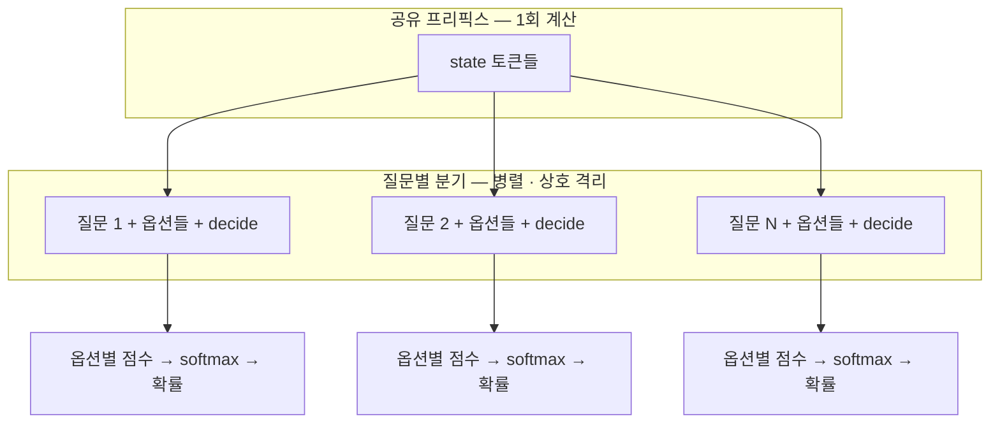
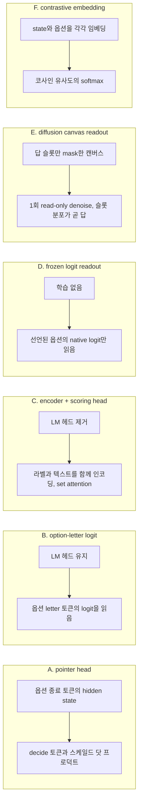
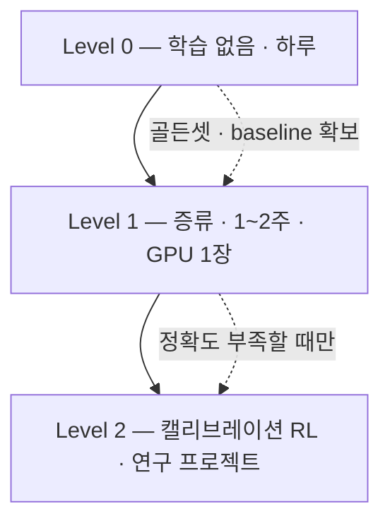

# System One 오픈 구현체 — 아키텍처 계보와 비교

> 조사 기준일 2026-09-30 · 상위 문서: [README](README.md) · 원본 분석: [typesafe-jev.md](typesafe-jev.md)

Jev는 closed weight지만 **인터페이스(`/v1/systemone`)와 행동은 공개**돼 있다. 그 틈으로 2주 만에 오픈 구현체 15종 이상이 나왔고, 그중 일부는 Jev와 대등하거나 특정 축에서 앞선다. 이 문서는 그 구조를 분류하고, 직접 만드는 경로를 정리한다.

## 1. 역추론된 아키텍처

[Jev's Architecture Unmasked](https://archerhume.com/posts/jevs-architecture-unmasked)가 API 행동 실험만으로 구조를 추정했고, 이후 구현체들이 이 설계를 따랐다.

### 1-1. 실험과 근거

| 실험 | 관찰 | 추론 |
|---|---|---|
| 토큰 회계 | 255옵션 응답이 `output_tokens` 2,714를 보고하지만 2옵션과 같은 속도 | `output_tokens`는 **사후 과금 계산값**, 생성량이 아님 |
| state 길이 | 360 → 29,835 토큰에서 지연 약 2배 | state 인코딩이 지배적 |
| 질문 개수 | 1 → 1,500개에서 sublinear, 최장 ~600ms | **state는 1회 인코딩, 질문은 배치** — KV 캐시 공유로 QS → S |
| "비밀 코드" | 다른 질문에 두면 확률 0.00, state에 두면 0.90~0.92 | **질문 간 attention 격리** |
| 무관한 옵션 추가 | 기존 두 옵션의 log-odds가 +0.38 → +0.11로 변함 | **옵션끼리 상호작용** (독립 logit + 고정 temperature가 아님) |
| 옵션 위치 | 참조 카드가 마지막일 때 16/16, 처음·중간일 때 12·11/16 | 결정 표현이 전체 옵션 목록을 볼 수 있는 구조 |

### 1-2. 추정 구조



- **causal decoder, prefill-only**: causal attention은 "어느 위치가 어느 정보를 쓸 수 있나"를 정하지 그 실행 순서를 정하지 않는다. prefill 단계에서는 모든 위치를 동시에 계산할 수 있고, Jev는 **prefill에서 끝나므로** 토큰 단위 순차 의존이 없다.
- **확률 판독**: "91%"라는 텍스트를 생성하는 게 아니라, 결정 위치의 표현을 확률로 매핑하는 작은 함수(head)를 쓴다. constrained decoding과는 다른 **직접 수치 판독**이다.
- **sparse MoE 가설**: 30k 토큰을 ~160ms에 처리하는 속도가 약 10B active 모델에 대응 → dense 70B로는 너무 빠르다. 단 저자도 "측정이 아니라 추론"이라고 명시.

## 2. 확률 판독 방식 — 네 갈래

이 범주의 실질적 설계 선택은 "확률을 어디서 읽느냐"다. 초기 4갈래(A~D)에 이후 확산 모델(E)과 대조 학습 임베딩(F) 방식이 추가됐다.



| 방식 | 대표 | 장점 | 단점 |
|---|---|---|---|
| **A. pointer head** | kev, Jeeves | 옵션 수에 유연(1~255), 옵션 간 상호작용 반영 | 별도 head 학습 필요 |
| **B. option-letter logit** | Jeff, AutoJev, Cygnet | 가장 단순, 베이스 지식 손상 최소 | 옵션 수가 letter 개수에 묶임 |
| **C. encoder + head** | Laya, openJev-verdict | 초저지연(20~35ms), 소형 | 고카디널리티에서 급격히 악화 |
| **D. frozen readout** | SemIf | 학습 0, 즉시 사용 | 품질 상한이 베이스 모델에 고정 |
| **E. diffusion canvas** | OpenJev(razorback16), djev | 병렬 채움이 모델의 **본성** — attention mask 트릭 불필요. `steps`로 답끼리 서로 맞춰가게 할 수 있음 | 학습 없이 쓰면 품질이 베이스에 묶임, GPU 24GB+ |
| **F. contrastive embedding** | CLM | 옵션 임베딩 캐시 가능, 매우 빠름 | 순서 척도(Score)에서 state를 무시하는 문제 보고 |

C의 약점은 수치로 드러난다 — Laya는 typed-decisions 2,000건에서 0.766(Jev 0.727)이지만, **Banking77(77개 라벨)에서는 0.425 대 Jev 0.870**이다. 옵션마다 토큰 예산을 나눠 쓰는 구조라 라벨이 20개를 넘으면 무너진다.

## 3. 구현체별 심층

### 3-1. kev — 재현의 기준점

[github.com/jaredpalmer/kev](https://github.com/jaredpalmer/kev) · Apache-2.0

```text
<state> …state…
<q> instructions <opt> option 1 </opt> <opt> option 2 </opt> … <decide>
<q> instructions <opt> option 1 </opt> <opt> option 2 </opt> … <decide>
```

- attention mask가 "자기 질문 + state"만 읽게 하고, **질문별 position id를 state 직후로 리셋**한다. Qwen3.5의 Gated DeltaNet 레이어는 recurrent라 mask를 무시하므로, 그 경우 질문마다 별도 row로 실행하고 state 캐시를 재사용한다.
- pointer head가 각 옵션의 `</opt>` hidden state를 질문의 `<decide>` hidden state와 비교해 점수를 낸다. `<decide>`가 마지막이라 전체 옵션 목록을 볼 수 있다.
- 학습: LoRA r16 + head만, cross-entropy, 2 epoch. 데이터 `decision-v7` = 공개 데이터셋 10종 10,000 + 생성 정책 896 + 규칙 구조 60종에서 1,680.
- 비용: **0.8B 약 20분, 4B 약 1시간**(H100 1장). Jev 출력을 학습에 쓰지 않았다고 명시.
- 성능: 미학습 소스(new sources) 정확도 Kev-9B 0.812 / Brier 0.291 vs **Jev 0.857 / 0.211**. 저자도 "Jev의 학습 데이터를 모르니 통제된 비교가 아니다"라고 밝힘.
- 특징: 파인튜닝 가이드(JSONL에 `label` 추가), permute/separate 진단 엔드포인트, 체스 데모, confidence 공식 공개(`(p_max − 1/K) / (1 − 1/K)`).

### 3-2. Jeff — 제품화된 파인튜닝 레시피

[github.com/firelex/jeff](https://github.com/firelex/jeff) · MIT(코드) · Apache-2.0(가중치)

AutoJev-27B 레시피의 **소형화 포크**다. 핵심 설계(1 forward pass, trained answer readout, fitted temperature)를 유지하고 학생 모델을 0.8B·2B로 줄였다.

- 학습: **full-weight SFT** 1 epoch, batch 256, **옵션 letter에 대한 cross-entropy**, 그 후 temperature 1개 피팅. 체크포인트는 dev set으로만 선택.
- 데이터 출처 청결성이 차별점이다: 합성 데이터를 **오픈 모델(Qwen3.8-Flash-Next)** 로 생성, **클로즈드 모델 출력은 학습 데이터에 없음**, leak filter 적용, 소스별 라이선스를 `docs/data-sources.md`에 명시. 전 과정 로컬 하드웨어(RTX PRO 6000 1장, 0.8B 2시간 / 2B 3.5시간).
- 성능: 공개 벤치 5종 4,599문항 종합 **83.1(2B) vs Jev 83.0 vs AutoJev-27B 84.9**.

| 벤치마크 | Jeff-2B | Jev | 해석 |
|---|---|---|---|
| Financial PhraseBank | **96.3** | 77.0 | 금융 감성 분류에서 압도 |
| RAGTruth | **88.9** | 77.3 | grounding 검증 |
| WinoGrande | 79.0 | **90.7** | 상식 추론 |
| JudgeBench | 64.6 | **78.6** | 판정 |
| BBH | 68.0 | **94.3** | 다단계 추론 |
| JevBench hard | 53.3 | **73.3** | 어려운 판단 |

- 파인튜닝 증거: 음성 내비게이션 약 11k 예시로 **held-out 31.7% → 95.8%**, GPU 1장 30분 미만, 결정당 ~40ms(M4 Max).
- 실전 조언(README): "**코드로 추론하고 Jeff로 결정하라**" — 옵션 설명에 *결과*를 써야 한다("이 수를 두면 차에 치인다"). 예측을 시키면("2턴 후 차가 온다") 무작위 수준.
- 주의: **영어·텍스트 전용**. 그리고 Jeff-2B가 0.8B보다 게임을 못 한다(더 위험회피적으로 학습됨) — "벤치마크 점수가 실사용을 예측하지 않는다"는 저자 자신의 경고.

### 3-3. Jeeves — 전제를 깬 쪽

[github.com/PostHog/jeeves](https://github.com/PostHog/jeeves) · MIT · 가중치 9B 공개

문제 정의가 정반대다: *"Jev-like 모델은 캘리브레이션된 확률을 주지만 정확도가 낮다. 그래서 많은 파이프라인이 추론 모델을 fallback으로 둔다."* → **추론을 결정 모델 안에 넣자.**

```text
<state> …state…
<q> instructions <opt> option 1 </opt> …
<think>            ← reasoning chain을 실제로 생성
</think>
<q> instructions <opt> option 1 </opt> …   ← 질문 반복 (ablation: 생략하면 성능 하락)
<decide>           ← pointer head → softmax / temperature
```

- 구분자로 Qwen 토크나이저의 **거의 안 쓰이는 rare 토큰**(`<|fim_prefix|>`, `<|box_start|>` 등)을 쓴다. 평문 "State"를 쓰면 성능이 나빠졌다는 ablation이 있다.
- 학습 3단계:
  1. **SFT** — LoRA r16(전 projection) + pointer head, 공개 12개 데이터셋 19,126문항, 2 epoch 596 step(8 GPU). 절반은 베이스 모델에서 샘플링한 reasoning chain 포함.
  2. **CISPO**(MiniMax-M1의 RL) — RL 문항 9,992개 × rollout 8, temperature 1, thinking 2,560토큰 제한. **624 step 스케줄을 402에서 중단** — 그 이후엔 head가 포화된 RL 풀에 over-sharpen되어 캘리브레이션이 악화.
  3. temperature 피팅.
- **diffusion drafter**: Orthrus 기반 speculative decoding을 Qwen3.5의 Gated DeltaNet에 맞게 확장(mask 토큰이 post-convolution K/V에 cross-attend). block 4에서 chain 109 → 176 tok/s(1.6배), 8문항 배치 시 합계 약 960 tok/s.
- 성능: test overall **0.889**(Jev 0.857, Kev-9B 0.822), JevBench public **0.935**(Jev 0.866), **hard 0.865**(Jev 0.730), ECE **0.037**(Jev 0.049). 반대로 MMLU 0.793(Jev 0.900), MMLU-Pro 0.739(Jev 0.840) — 9B에 frontier 지식은 담기지 않는다.
- 제약: **CUDA 전용, FP8 커널은 Hopper 필요**, 학습 8 GPU, p90 17초. 그리고 **language consistency reward를 넣지 않아 reasoning chain은 해석 가능하지 않다** — 설명용으로는 못 쓴다.

### 3-4. Laya — 강화학습 기반 RLCD의 공개 구현

[github.com/NandhaKishorM/laya](https://github.com/NandhaKishorM/laya) · Apache-2.0

- ModernBERT-large 421M(영어) / mmBERT-base 322M(100+ 언어), **non-autoregressive**, 단일 forward pass 약 33ms(T4).
- 학습: **strictly proper scoring rule을 보상으로 쓰는 RL(GRPO 스타일 policy gradient)** — TypeSafe의 RLCD와 가장 가까운 공개 구현. 참고로 Verdict도 "RLCD"라는 이름을 쓰지만 실제 학습은 강화학습이 아니라 **지도학습 손실 `CE + 1.0 × Brier` + 사후 L-BFGS temperature scaling**이다. proper scoring rule을 *보상*으로 쓰는지 *손실*로 쓰는지가 다르다. 파인튜닝 노트북 제공, 2×T4에서 약 30k 문항 4~5시간.
- 성능: typed-decisions 2,000건 **0.766 vs Jev 0.727**. 단 **Banking77 0.425 vs Jev 0.870** — 고카디널리티 붕괴.
- 지연: 단일 32.8~39.5ms(T4), 10문항 배치 72.3ms(문항당 7.2ms), CPU 193~464ms. Apple Silicon MLX 포트(laya-mlx)가 중앙값 13.4ms를 보고.
- **다국어가 필요하면 현재 유일한 실용 선택지**다(Jeff는 영어 전용, kev는 미검증).

### 3-5. SemIf — 학습 없는 baseline

[github.com/TheoLeeCJ/SemIf](https://github.com/TheoLeeCJ/SemIf) · MIT(코드, 가중치는 업스트림)

- frozen Qwen3.5-4B의 native option logit만 읽는다. **학습 0**. 리포명이 OpenJev → SemIf로 변경됐다.
- 속도(3090, 37 state × 21 criteria = 777 decisions): fresh 2.33 dec/s → **serial prefix reuse 10.75 → parallel suffixes 20.03**. 직접 logit 판독 1.023s vs JSON 생성 5.332s(**5.21배**).
- 품질: TypeSafe 공개 케이스 102행 일치도 **0.845 vs Jev 0.883**. Qwen3.8-27B EXL3로 올리면 authored decisions 0.958.
- 백엔드가 가장 넓다: CUDA · MLX · PyTorch/MPS · llama.cpp(CPU/GGUF) · EXL3 · **WebGPU 브라우저 데모**.
- 캘리브레이션 PR이 커뮤니티에서 들어왔다: authored raw ECE 0.068 → 0.038(T=1.23), **WANLI 0.208 → 0.069(T=2.50)**.
- 재현성이 강점: 모델 revision 고정, `prompt_sha256`, row-level 출력, 원시 타이밍, 알려진 실패까지 커밋. BF16 빠른 경로에서 777건 중 5~6건 argmax가 바뀐다는 것도 밝힌다.

### 3-6. Imajev — 멀티모달과 "모르겠다"

[github.com/mohit67890/imajev](https://github.com/mohit67890/imajev) · Apache-2.0 · 가중치 2B·4B·9B 공개

JevBench v1.4.2.2에서 **91개 시스템 중 1위**(67.37), Image JevBench v0.1.3에서 **49개 중 1위**(76.39)다. 두 가지가 차별점이다.

- **이미지 입력**: 사진 + 기록 + 텍스트를 함께 state로 받는다. "사진 대 기록" 및 "사진 두 장" 판단 72k건으로 학습. 텍스트 전용 Jev 요청은 그대로 동작한다.
- **학습된 기권(`unknown`)**: 모든 답에 `unknown` 확률이 따라오고(근거 부재·모순·범위 이탈), 그것이 최댓값이면 `abstained: true`를 반환한다. ImajevBench에서 "정직한 답이 can't tell"인 21문항 중 **18개에서 기권**하고, 답할 수 있는 258문항 중에서는 9개만 잘못 기권한다.

```python
a = r.json()["answers"]["queue"]
# {"choice": "billing", "probabilities": {...}, "confidence": ...,
#  "unknown_probability": ..., "abstained": false}
if a["abstained"] or p < 0.85:
    route_to_human()
```

- 학습: rank-64 LoRA + 256-code readout. phase-3 어댑터(이전 릴리스가 틀린 결정만 모아 재학습)로 ImajevBench 82.4 → 83.9%, JevBench hard 70.3 → 72.1% 개선. **단 같은 변경으로 DecisionBench ECE가 0.024 → 0.069로 악화**됐다고 스스로 기록한다 — 정확도와 캘리브레이션이 상충할 수 있다는 좋은 사례다.
- 지연: JevBench hard 문항 p50 238ms(2B) / 350ms(4B) / 316ms(9B), H100 1장. `--fast --merge-lora` 경로에서 텍스트 결정 **11ms**, 이미지 결정 91ms. 9B는 약 19GB 상주.
- 비용(리더보드 추정): 1,000 결정당 **$0.022** vs Jev $0.040.
- 권장 크기는 4B("거의 항상"), 2B는 지연·메모리 제약 시(단 기권을 덜 한다), 9B는 지식 중심 텍스트 질문.

### 3-7. decider — 파인튜닝 패밀리

[github.com/Mapika/decider](https://github.com/Mapika/decider) · Apache-2.0

Qwen3.5 기반 System One 스타일 모델 패밀리. JevBench **3위**(64.13)로, 속도·비용 축에서 Jev를 앞선다. 다만 Jev는 raw Intelligence에서 앞선다(53.1 vs 49.4). 아키텍처·학습 상세는 이 조사 시점에 확인하지 못했다.

주목할 점은 **decider 위에 다시 파인튜닝을 얹은 파생물이 리더보드 상위에 있다**는 것이다(Plumb-4B = JevK5 v0.2 + LoRA, 2위). 오픈 체크포인트가 다음 레이어의 베이스가 되는 순환이 이미 돌고 있다.

### 3-8. OpenJev (razorback16) — diffusion canvas와 멀티모델 게이트웨이

[github.com/razorback16/openjev](https://github.com/razorback16/openjev) · Apache-2.0 · 2026-09-18 생성

> 같은 이름의 TheoLeeCJ/openjev(현 SemIf)와 **다른 프로젝트**다.

**판독 방식이 새롭다.** [DiffusionGemma 26B-A4B](https://huggingface.co/nvidia/diffusiongemma-26B-A4B-it-NVFP4)(NVIDIA·Google, 이산 확산 언어모델, MoE 총 26B / 활성 4B, NVFP4)를 *쓰는* 게 아니라 *읽는* 데 쓴다. 확산 모델은 매 forward pass에서 캔버스 전체를 동시에 denoise하므로, 답 슬롯만 mask한 캔버스를 한 번 읽으면 모든 질문의 분포가 한꺼번에 나온다. System One의 "병렬 결정"이 attention mask 트릭이 아니라 **모델 구조 자체에 내장**된 셈이다.

```text
canvas in            one read-only pass         answer out
  q1: [?]   ──►      P(yes) 0.001       ──►     noul   0.001
  q2: [?]            P(A) 0.000                 choice "billing"
                     P(B) 0.999                 confidence 0.997
  q3: [?]            P(0) 0.000                 score  1.00
                     P(1) 0.996
```

- 레이블은 각 1토큰(`yes`/`no`, `A`/`B`/`C`, `0`/`1`/`2`). 모델은 슬롯에 아무것도 쓰지 않는다.
- **자기 일관성 재독(re-read) 내장**: 슬롯 엔트로피가 0.1을 넘으면 노이즈를 바꿔 3회 더 읽고 4회를 평균한다. 추가 읽기는 `usage`에 과금되지 않는다.
- `confidence = 1 − H(p)/ln K` — 공식을 공개한 몇 안 되는 구현체.
- 필요한 vLLM 기능(seeded canvas, read-only step 등)을 **업스트림 PR(vllm-project/vllm#57250, 2026-09-22 병합)** 으로 넣었다.

**Jev에 없는 확장 옵션** (요청에 넣지 않으면 Jev와 동일하게 동작):

| 필드 | 효과 |
|---|---|
| `images` | 최대 8장, 장당 약 280 입력 토큰 |
| `steps` 1~8 | denoise 단계 수. 늘리면 답들이 서로를 보며 정착 |
| `samples` 1~32 | 서로 다른 노이즈로 N회 읽어 평균 |
| `think` 0~4096 | 생각을 먼저 쓰고 그 뒤에 답을 읽음 (Jeeves와 같은 방향) |
| `sequential` | 질문 청크를 순서대로 읽어 **뒤 청크가 앞의 답을 보게** 함 — 질문 독립성을 의도적으로 깨는 옵션 |

**멀티모델 게이트웨이이기도 하다.** 한 `/v1/systemone` 엔드포인트 뒤에 5개 모델을 둔다: `openjev-latest`(DiffusionGemma), `laya-1.0`, `verdict-1.4`, `clm-v0.1`, `jevk5-0.2`. `jev-latest` 별칭을 받아들이므로 TypeSafe SDK에서 `TYPESAFE_BASE_URL`만 바꾸면 된다. 운영자가 만든 [Codiv](https://codiv.ai)에서 **무료 호스팅**(100M 입력 토큰)한다 — Jev API의 첫 호스팅 대안이다. 같은 모델로 `/v1/chat/completions` 텍스트 생성도 제공한다.

**생태계에서 가장 자세한 동시성·처리량 벤치** (RTX PRO 6000 Blackwell, 프로덕션 설정, 매 요청 state 앞에 nonce를 넣어 prefix 재사용을 차단한 최악 조건, 3질문):

| state 토큰 | 1개씩 p50 | 동시 16 / 32 / 64에서 req/s | 동시 64에서 p50 / p95 |
|---:|---:|---:|---:|
| 49 | 30ms | 81 / 109 / 130 | 331 / 669ms |
| 2,047 | 83ms | 17.7 / 18.5 / 18.6 | 2.9 / 5.4s |
| 8,191 | 307ms | 3.7 / 3.8 / 3.8 | 15 / 23s |
| 32,767 | 1.7s | 0.6 / 0.6 / 0.6 | 62 / 102s |
| 63,999 | 4.8s | 0.2 / 0.2 / 0.2 | 73 / 126s |

state 약 2K 토큰까지는 동시성이 처리량을 늘리지만, 그 이상에서는 GPU가 prefill에 묶여(2K에서 약 40K tok/s, 64K에서 13K tok/s) **동시성은 큐잉만 늘린다**. vLLM 대기가 120초를 넘으면 `503` + `retry-after`. Mac(MLX)은 3질문 요청 0.2~0.4초, 동시 16에서 약 4 req/s로 로컬 전용이다. 같은 서버에서 Laya는 16질문 10ms, Verdict 7ms(짧은 state).

**품질은 독립 보드에서 중위권이다.** JevBench 29위(36.85, sealed 29.1%). README도 *"답변 품질은 이 모드에서의 DiffusionGemma 품질이다, 직접 평가하라"* 고 명시하며 자체 품질 수치를 내지 않는다. 흥미로운 것은 `think: 512` 모드다 — sealed 정확도 **42.2%로 Jev(36.7%)를 앞서고** Intelligence 58.08(Jev 53.06)이지만, 비용 축 27.82 때문에 종합 70위로 밀린다. 그리고 thinking을 켜면 sealed ECE가 0.394로 **캘리브레이션이 크게 나빠진다** — Jeeves가 공개 문항에서 보고한 "thinking이 캘리브레이션도 개선한다"(ECE 0.037)와 상반되는 독립 관측이다.

**포지션**: 단일 모델보다는 **"오픈 System One 모델들의 서빙 레이어"** 에 가깝다. 모델 선택을 요청의 `model` 필드 하나로 바꿀 수 있고, 동시성 한계를 투명하게 공개하며, 호스팅까지 제공한다. 자체 호스팅 시 운영 기준점으로 쓰기 좋다.

### 3-9. 그 외

| 프로젝트 | 요약 |
|---|---|
| **AutoJev-27B** | Qwen3.8-27B full-weight SFT, H200 1장, 73,000 예시 286 update(ckpt 200). **84.60% / ECE 0.0428 / Brier 0.2203 vs Jev 82.79% / 0.0527 / 0.2540**. 멀티모달(base64 이미지). Jeff의 상류. |
| **NanoJev** | Qwen3-0.6B + decision heads, 18,760문항. **ViZDoom Basic 128/128 vs Jev 56/128**, 50×50 미로 225 시도 vs Jev 2,738. 태스크 특화가 범용을 이기는 사례. |
| **JevK5** | 4B·9B, teacher 2종 증류, `/v1/systemone`, ~13ms(H100). JevBench v1.4에서 76개 중 2위·오픈 1위(62.04 vs Jev 63.29). |
| **openJev-verdict-2.0** | ModernBERT-base 150M, GTX 1660 Ti 8.8시간, typed-decisions 77.10%(Laya 76.60, Jev 72.70), ECE 0.0144, 20~25ms, WebGPU. 단일 자체 데이터셋만 평가한 한계가 있다. |
| **opendecision** | LM 헤드 제거 + cross-attention head + LoRA, teacher 대비 KL 최소화로 temperature 피팅. `/v1/systemone` wire 호환, `output_tokens = 0` by construction. |
| **minojev · CUA-S1-FORMS · jevlike-esp32** | 547k~706k 파라미터 초소형. 폼 필드 FILL/CHECK/CLICK/SKIP 전용, **ESP32 펌웨어 배포**까지. |
| **Cygnet** | frozen Gemma-4-12B-it + one-token option-letter readout을 stock vLLM으로. 학습 없이 JevBench 6위. |

## 4. 직접 만들고 학습하기

### 4-1. 학술적 배경 (모두 공개)

| 조각 | 공개 자료 |
|---|---|
| 단일 forward pass 다중 라벨 | **GLiClass** [arXiv:2508.07662](https://arxiv.org/abs/2508.07662), [코드](https://github.com/knowledgator/gliclass) Apache-2.0 — uni-encoder로 라벨과 텍스트를 한 시퀀스에, cross-encoder 대비 ~10배. `train.py`(focal loss) + `train_rl.py`(멀티라벨 PPO) |
| yes/no logit 판독 | **Qwen3-Reranker** — 마지막 위치의 "yes"/"no" logit 차이를 sigmoid. 그대로 Noul |
| proper scoring rule 기반 RL | **RLCR** [arXiv:2507.16806](https://arxiv.org/abs/2507.16806), [코드](https://github.com/damanimehul/RLCR) — 보상 = 정답성 + **Brier score**. bounded proper scoring rule이라 정직한 확률이 최적 전략 |
| 추론 RL | **CISPO** [MiniMax-M1](https://arxiv.org/abs/2506.13585) — Jeeves가 사용 |
| 사후 캘리브레이션 | **temperature scaling** [Guo et al. 2017](https://arxiv.org/abs/1706.04599), focal loss, label smoothing |
| 게이트에 통계적 보장 | conformal prediction · selective prediction (risk-coverage) |
| 배경 근거 | post-training이 캘리브레이션을 악화시킨다는 문헌 다수 (GPT-4 technical report 이후) |

### 4-2. 난이도별 경로



**Level 0** — `system-one-adapter`(공식 MIT)로 인터페이스를 고정하고 백엔드는 LLM. 또는 GLiClass 체크포인트, Qwen3-Reranker logit readout, SemIf. 목적은 **골든셋 확보와 baseline 수치**다.

**Level 1 — 증류**

```text
1) 태스크 수집: 도메인 질문 20k~200k (라벨 없어도 됨)
2) teacher 라벨링: 큰 모델로 (state, question)별 확률분포 생성
   — teacher에게도 System One 형식을 강제 (system-one-adapter가 이 역할)
3) student 학습: 백본 + LoRA + head, KL(teacher ‖ student)
   — 공개 데이터로 부트스트랩 가능 (MNLI · WANLI · UTCD 등)
4) 캘리브레이션: 홀드아웃에서 temperature 피팅 → ECE · Brier · reliability diagram
5) 평가: 정확도뿐 아니라 risk-coverage 곡선 (confidence 임계값별 커버리지-정확도)
```

실측 비용 감각(공개 레시피 기준): kev 0.8B 약 20분·4B 약 1시간(H100 1장), Jeff 0.8B 2시간·2B 3.5시간(워크스테이션 GPU 1장), Laya 2×T4 4~5시간, openJev-verdict GTX 1660 Ti 8.8시간. **실제 돈은 teacher 라벨링 API 비용에서 나간다.**

**Level 2 — 캘리브레이션 RL**

```python
# 개념 스케치 — RLCR / Laya 방식
p = student(state, question)          # 옵션 확률분포
brier = ((p - onehot(y)) ** 2).sum()  # bounded proper scoring rule
reward = correct(p.argmax(), y) - lam * brier
# GLiClass train_rl.py(PPO), RLCR 레포, Laya의 GRPO 구현을 참고
```

Jeeves의 교훈 하나: **RL을 너무 오래 돌리면 head가 over-sharpen되어 캘리브레이션이 망가진다.** 624 step 스케줄을 402에서 멈춘 이유가 그것이다. 정확도와 ECE를 함께 모니터링하고 조기 중단해야 한다.

### 4-3. 재현되지 않는 부분

1. **데이터** — TypeSafe는 2년 스텔스 동안 전량 자체 제작했다. 오픈 데이터로는 도메인 커버리지가 얇아진다.
2. **백본 규모** — "neither small nor an LLM". 4B로 0.845까지는 가지만 마지막 구간은 규모·데이터 싸움이다.
3. **서빙 최적화** — 70~500ms, $0.042/MTok는 모델만의 결과가 아니다.
4. **아키텍처 원문** — 논문 "예정" 상태. 현재 공개된 것은 모두 역추론이다.

역으로, **0.845 대 0.883**(SemIf, 학습 0)과 **84.60% 대 82.79%**(AutoJev-27B, H200 1장)라는 숫자가 이 영역의 진입 장벽을 말해준다. 해자는 구조가 아니라 데이터·캘리브레이션·단가다.
