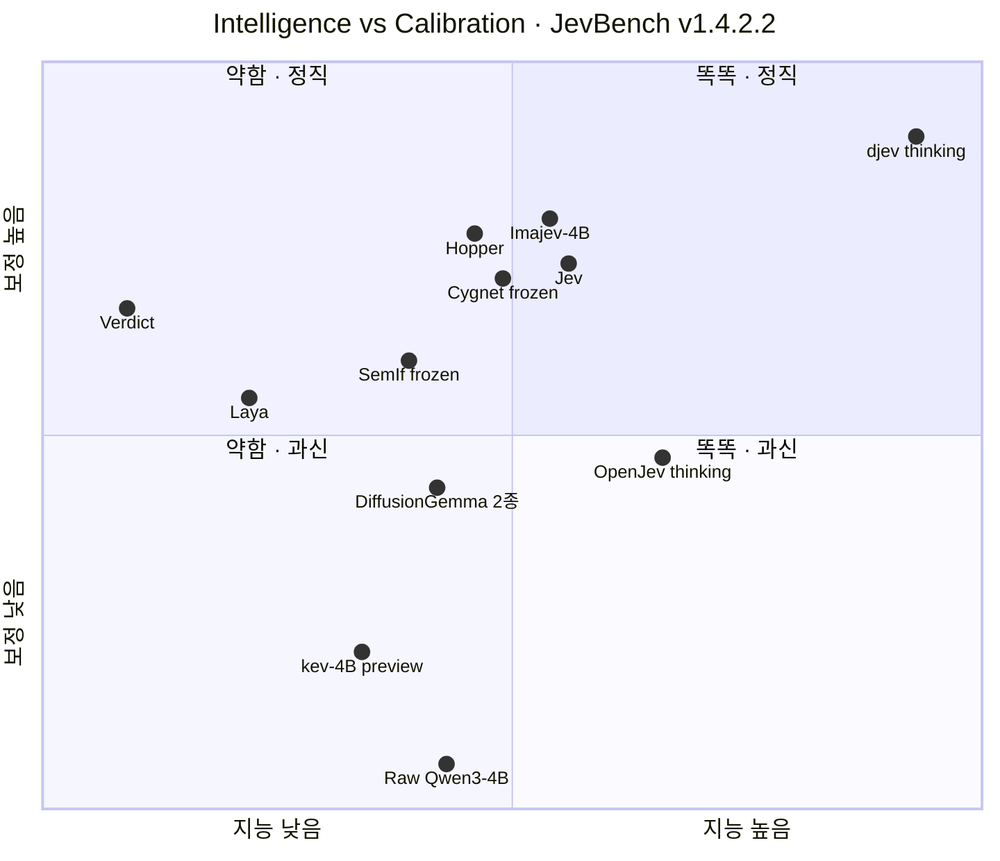

# System One 오픈소스 한눈에 비교

> 기준일 **2026-10-08** · 기준 데이터 [JevBench v1.4.2.2](https://github.com/fstandhartinger/jevbench) · 상위 문서: [README](README.md)

Jev 출시 3주 만에 독립 벤치마크 JevBench에 **95개 시스템**이 올라왔다. 이 문서는 그중 의미 있는 오픈소스를 **같은 문항·같은 방식으로 측정한 숫자만으로** 비교한다. 프로젝트마다 자체 벤치마크가 달라 직접 비교가 불가능했던 기존 표의 한계를 없애는 것이 목적이다. 보드에 없는 프로젝트는 [§4](#4-보드에-없는-프로젝트--자체-보고-수치)에 따로 모았다.

---

## 1. 점수표

모든 축은 0~100이고 **높을수록 좋다.** 굵은 글씨는 Jev 계열(참고용 LLM 제외) 안에서 열별 최고값이다.

| 축 | 의미 |
|---|---|
| **종합** | 지능·보정·속도·비용 4축의 등가중 조화평균. 지능·속도·비용이 50 미만이면 감점 |
| **지능** | 우연 수준을 뺀 정답률. 기존 고정 문항 80% + 새 비공개(sealed) 308문항 20%. 공개·비공개 정답률 차이가 크면 감점 |
| **보정** | 확률이 실제 정답률과 맞는 정도 (캘리브레이션) |
| **속도 · 비용** | 응답 속도와 1,000건당 추정 비용을 점수로 환산 (실제 지연은 [typesafe-jev.md §7-3](typesafe-jev.md#7-3-지연latency과-처리량throughput)) |
| **sealed** | 공개되지 않은 308문항의 정답률. **찍었을 때 29.3%** |

| 순위 | 프로젝트 | 베이스 · 크기 | 종합 | 지능 | 보정 | 속도 | 비용 | sealed |
|---:|---|---|---:|---:|---:|---:|---:|---:|
| | **기준선** | | | | | | | |
| 4 | [Jev 1.13.0](typesafe-jev.md) (TypeSafe, closed) | 비공개 | 63.29 | 53.06 | 76.34 | 83.27 | 51.97 | 36.7% |
| 37 | GPT-6 Luna — *추론 LLM, 참고* | — | 33.27 | 97.35 | 93.46 | 72.59 | 36.05 | 95.5% |
| 22 | Raw Qwen3-4B direct logit — *학습 없는 대조군* | Qwen3-4B | 40.95 | 46.39 | 29.10 | 87.55 | 59.68 | 27.3% |
| | **A. 디코더 + 학습한 head·LoRA** | | | | | | | |
| 1 | [Imajev-4B](https://github.com/mohit67890/imajev) | Qwen3.5-4B | **67.37** | 52.22 | 80.35 | 90.60 | 59.72 | 37.0% |
| 2 | [Plumb-4B](https://github.com/crh225/plumb) | JevK5 + LoRA (Qwen3.5-4B) | 65.84 | 52.98 | 75.49 | 93.49 | 55.77 | 38.0% |
| 3 | [decider-4b v2](https://github.com/Mapika/decider) | Qwen3.5-4B | 64.13 | 49.35 | 75.00 | 92.93 | 60.92 | 34.7% |
| 5 | [JevK5 v0.2](https://github.com/allebee/jevk5) | Qwen3.5-4B 증류 LoRA | 62.04 | 48.89 | 74.53 | 91.09 | 59.52 | 33.1% |
| 7 | [Hopper](https://huggingface.co/HopitAI/hopper) | Qwen3.5-4B + LoRA | 59.43 | 48.00 | 79.06 | 86.81 | 58.73 | 34.1% |
| 8 | [Winnow-12B](https://huggingface.co/EldanRing/Winnow-12B) (Q8 GGUF) | Gemma-4-12B + LoRA | 55.58 | 48.30 | 64.81 | 82.33 | 52.92 | 33.1% |
| 9 | [reflex 4B](https://github.com/kshetrajna12/reflex) | Qwen3.5-4B + LoRA | 53.99 | 47.46 | 70.41 | 67.97 | 59.68 | 28.2% |
| 11 | [Jev-Omni](https://huggingface.co/akhilaaa3/Jev-Omni) (커뮤니티) | Gemma-4-12B 병합 | 51.34 | 46.75 | 64.09 | 81.54 | 53.02 | 32.1% |
| 18 | [Malkuth-4B](https://github.com/newfull5/malkuth) | kev 추가 학습 | 44.45 | 43.15 | 61.49 | 88.33 | 61.53 | 23.4% |
| 30 | [kev 4B](https://github.com/jaredpalmer/kev) *(research preview)* | Qwen3-4B + LoRA | 36.14 | 42.08 | 39.64 | 75.74 | 61.77 | 22.4% |
| | **B. 디코더 frozen — 학습 없음** | | | | | | | |
| 6 | [Cygnet](https://github.com/blockbrain-ai/cygnet-recipe) | Gemma-4-12B-it | 61.76 | 49.51 | 74.93 | 90.67 | 52.83 | 33.8% |
| 13 | [SemIf](https://github.com/TheoLeeCJ/SemIf) (구 OpenJev) | Qwen3.5-4B | 47.69 | 44.44 | 66.76 | 83.70 | 59.47 | 26.3% |
| | **C. 확산 캔버스 — 학습 없음** | | | | | | | |
| 10 | [djev](https://github.com/Davipar/djev-dev) | DiffusionGemma 26B-A4B | 52.23 | 47.00 | 55.36 | 91.36 | 57.58 | 29.9% |
| 29 | [OpenJev](https://github.com/razorback16/openjev) (razorback16) | DiffusionGemma 26B-A4B | 36.85 | 45.44 | 54.99 | 83.18 | 45.49 | 28.6% |
| 68 | djev — *thinking* | DiffusionGemma 26B-A4B | 15.20 | **71.62** | **87.78** | 75.15 | 26.85 | **60.1%** |
| 70 | OpenJev — *thinking* | DiffusionGemma 26B-A4B | 14.83 | 58.08 | 58.10 | 76.06 | 27.82 | 42.2% |
| | **D. 인코더 + head** | | | | | | | |
| 43 | [Laya](https://github.com/NandhaKishorM/laya) | ModernBERT-large 421M | 30.25 | 36.13 | 63.68 | 71.06 | **86.20** | 30.8% |
| 60 | [Verdict 1.4](https://github.com/Heman10x-NGU/Verdict-open-jev) | ModernBERT-base 151M | 19.00 | 29.41 | 72.03 | 78.09 | 82.36 | 27.9% |
| | **E. 임베딩 대조 · 리랭커** | | | | | | | |
| 20 | [Qwen3-Reranker-4B](https://huggingface.co/Qwen/Qwen3-Reranker-4B) — *기성 리랭커* | Qwen3-4B | 43.49 | 44.62 | 65.22 | 78.72 | 49.15 | 29.9% |
| 80 | [CLM-8B](https://github.com/Contrastive-LM/CLM) | Qwen3-8B frozen + 헤드 | 8.57 | 22.35 | 39.81 | **93.57** | 78.43 | 24.0% |

## 2. 지도 — 지능과 보정

표의 두 품질 축만 떼어 위치를 찍었다. 오른쪽 위로 갈수록 "답을 잘 맞히고, 자기 확신도도 정직하다."

- 가로축은 지능 25~75, 세로축은 보정 25~95 구간이다. 가운데 선은 **지능 50, 보정 60**.
- "DiffusionGemma 2종"은 djev(47.0, 55.4)와 OpenJev(45.4, 55.0)가 거의 같은 자리에 있어 한 점으로 합쳤다.
- 추론 LLM(GPT-6 Luna 97.4, 93.5 · DeepSeek V4.1 Flash 94.0, 95.5)은 그림의 오른쪽 위 바깥에 있다.
- 숫자는 [§1 점수표](#1-점수표)가 기준이다.

## 3. 구조와 기능

### 3-1. 구조

| 프로젝트 | 베이스 · 크기 | 학습 방식 | 확률을 읽는 방식 | 지연 · 하드웨어 (자체 보고) | 라이선스 |
|---|---|---|---|---|---|
| **Jev** | 비공개 | RLCD (비공개) | 비공개 (prefill-only 추정) | 서버 57~218ms · 종단 P50 0.14~1.5s · API 전용 | closed |
| **Imajev** | Qwen3.5 2B·4B·9B | LoRA r64 + 256-code readout, 멀티모달 72k | 옵션 코드 + **학습된 `unknown`** | p50 238~350ms, fast path 11ms (H100) | Apache-2.0 |
| **Plumb-4B** | JevK5 v0.2 + LoRA | JevK5 위에 hard-mined LoRA. teacher(Qwen3.8-27B) 합성 + MNLI·WANLI·BoolQ replay, **벤치 오염 감사 코드 공개** | JevK5 계승 | — | Apache-2.0 |
| **decider** | Qwen3.5 2B·4B·35B-A3B | 학습한 decision head | decision head | — | Apache-2.0 |
| **JevK5** | Qwen3.5-4B · 9B | 큰 모델(Qwen3.6-27B)에서 증류한 LoRA | 옵션 letter logit, T=1.532 | ~13ms (H100) | Apache-2.0 |
| **Hopper** | Qwen3.5-4B | LoRA | — | — | 구성요소별 상이 |
| **Cygnet** | Gemma-4-12B-it | **없음** | 옵션 letter 1토큰 판독 (stock vLLM) | — | shim MIT · 가중치 Apache |
| **kev** | Qwen3.5 0.8B·4B·9B | LoRA r16 + pointer head | pointer head | 수십 ms (H100) ~ 2s (Mac) | Apache-2.0 |
| **Jeff** | Qwen3.5 0.8B·2B, Gemma4-E2B | full-weight SFT + temperature | 옵션 letter logit | **22ms** (RTX PRO 6000) · 28ms (M4) · 463ms (CPU) | MIT · 가중치 Apache |
| **Jeeves** | Qwen3.5-9B | SFT + **CISPO(RL)**, thinking | pointer head + reasoning chain | 0.3s ~ 3.3s (H100) | MIT |
| **AutoJev-27B** | Qwen3.8-27B | full-weight SFT 73k | 옵션 letter logit | 미공개 · ~49GiB | MIT · 가중치 Apache |
| **SemIf** | Qwen3.5-4B | **없음** | native 옵션 logit | ~50ms/건 (3090) | MIT |
| **djev** | DiffusionGemma 26B-A4B | **없음** | 확산 캔버스 1-step 판독 | — | Apache-2.0 |
| **OpenJev** | DiffusionGemma 26B-A4B | **없음** | 확산 캔버스 + 자동 재독 | 30ms (49tok) ~ 1.7s (32k tok), RTX PRO 6000 | Apache-2.0 |
| **Laya** | ModernBERT-large 421M · mmBERT 322M | **RL + proper scoring rule 보상** | 옵션 marker head | 33ms (T4) · CPU 193~464ms | Apache-2.0 |
| **Verdict** | ModernBERT-base 151M | 지도학습 CE + Brier + 사후 temperature | GLiClass head | 7ms (16질문, 짧은 state) | Apache-2.0 |
| **NanoJev** | Qwen3-0.6B | decision heads, 18,760문항 | set attention + sigmoid | — | 미표기 |
| **CLM** | Qwen3-8B frozen + 9.4M 헤드 2개 | 헤드만 학습 | 임베딩 코사인 softmax | 99ms (3090, FP8) | Apache-2.0 |
| **[Jevlike](../jevlike/README.md)** | Tiny 41k 또는 HF 인코더 | 선택기 head 학습 | 후보 attention head | **0.1ms** (Tiny, CPU, [#38 실측](../decision-model-comparison/performance-and-cost.md)) | — |

### 3-2. 기능

| 프로젝트 | 학습 코드 | `/v1/systemone` 호환 | 다국어 | 이미지 | 기권 출력 | 추론(thinking) | CPU · Mac |
|---|:-:|:-:|:-:|:-:|:-:|:-:|:-:|
| Jev | ✗ | ✓ 원본 | △ 영어 우선 (공식) | ✗ (공식: text only) | ✗ | ✗ | ✗ |
| Imajev | ✓ | ✓ | ? | **✓** | **✓** `unknown` | ✗ | △ |
| JevK5 | △ | ✓ | ? | ✗ | ✗ | ✗ | ✗ |
| Plumb | ✓ | ? | ? | ✗ | ✗ | ✗ | ✗ |
| Cygnet | — 없음 | ? | ? | ✗ | ✗ | ✗ | ✗ |
| kev | ✓ | ✓ | △ | ✗ | ✗ | ✗ | △ Mac |
| Jeff | ✓ | ✓ | **✗ 영어 전용** | ✗ | ✗ | ✗ | ✓ |
| Jeeves | ✓ | ✓ | ✗ | ✗ | ✗ | **✓** | ✗ |
| AutoJev-27B | ✓ | ✓ | ? | ✓ | ✗ | ✗ | ✗ |
| SemIf | — 없음 | ✗ | ✗ | ✗ | ✗ | ✗ | ✓ llama.cpp · WebGPU |
| djev | — 없음 | ? | ? | **✓** | ✗ | **✓** | ✗ |
| OpenJev | — 없음 | ✓ | ? | **✓** | ✗ | **✓** | △ MLX |
| Laya | ✓ | ✗ | **✓ mmBERT 100+ 언어** | ✗ | ✗ | ✗ | ✓ |
| Verdict | ✓ | ✗ | ✗ | ✗ | **✓** `__insufficient_evidence__` | ✗ | ✓ WebGPU |
| CLM | — | ✗ | ? | ✗ | ✗ | ✗ | ✗ |

✓ 지원 · △ 부분 · ✗ 미지원 · ? 확인 못 함 · — 해당 없음

## 4. 보드에 없는 프로젝트 — 자체 보고 수치

JevBench에 아직 올라오지 않아 **위 표와 같은 잣대로 비교할 수 없는** 주요 프로젝트다. 숫자는 각자 자기 벤치마크에서 낸 것이다.

| 프로젝트 | 대표 수치 (자체 보고) | 왜 주목할 만한가 |
|---|---|---|
| [Jeff](https://github.com/firelex/jeff) (firelex) | 공개 벤치 5종 종합 83.1 (2B, Jev 83.0) · Financial PhraseBank **96.3** (Jev 77.0) | 금융 감성 분류에서 압도적. 클로즈드 모델 출력을 학습에 쓰지 않음. 파인튜닝으로 31.7% → 95.8% 실증 |
| [Jeeves](https://github.com/PostHog/jeeves) (PostHog) | JevBench hard 공개 문항 **0.865** (Jev 0.730) · ECE 0.037 | thinking + RL로 추론 계열 문항을 뚫음. `nothink_threshold`로 쉬운 건 0.3s |
| [AutoJev-27B](https://github.com/denis-pplx/autojev) | 84.60% · ECE 0.0428 (Jev 82.79% · 0.0527) | Jeff의 상류 레시피. H200 1장으로 학습 |
| [NanoJev](https://github.com/TianyuCodings/NanoJev) | ViZDoom Basic 128/128 (Jev 56/128) | 태스크 특화 0.6B가 범용 Jev를 이기는 사례 |
| [Laya-multilingual](https://github.com/NandhaKishorM/laya) | 한국어 MASSIVE 의도 20지선다 **45~49%** (영어 Laya 10~11%) | 사실상 유일한 다국어 선택지. 단 학습 없이는 부족 ([#38 분석](../decision-model-comparison/kev-vs-laya.md)) |
| [kev](https://github.com/jaredpalmer/kev) Qwen3.5 정식판 | 미학습 소스 0.812 / 0.837 (9B, Jev 0.857) | 보드의 kev 행은 Qwen3·Qwen2.5 기반 preview다. 정식판은 미측정 |
| Imajev 2B · 9B | Image JevBench 2B 6위 | 보드 텍스트 부문엔 4B만 측정됨 |

## 5. 표에서 읽히는 것

**① 품질은 이미 따라잡혔다. Jev가 앞서는 건 범용성이다.**
상위 오픈 4B(Imajev·Plumb·decider·JevK5)는 지능 49~53, 보정 75~80으로 Jev(53.1, 76.3)와 같은 구간이다. 종합 순위 차이는 대부분 속도·비용 축에서 난다. 종합 점수에 잘 드러나지 않는 Jev의 우위는 고카디널리티(Banking77 77지선다에서 Jev 0.870 vs Laya 0.425, Laya 자체 측정), 학습 없는 제로샷 범용성, 호스팅 운영이다.

**② 학습과 판독 설계는 "지능"보다 "보정"을 끌어올린다.**
같은 4B급에서 지능은 거의 그대로인데 보정이 크게 달라진다.

| | 학습 | 지능 | 보정 | sealed ECE |
|---|---|---:|---:|---:|
| Raw Qwen3-4B logit | 없음, 판독 설계도 없음 | 46.4 | **29.1** | 0.629 |
| SemIf | 없음, 판독만 설계 | 44.4 | **66.8** | 0.293 |
| Imajev-4B | 학습 | 52.2 | **80.4** | 0.172 |

모델을 학습 없이 그대로 읽으면 확률을 믿을 수 없다. System One 구현체가 하는 일의 핵심은 정답률을 올리는 것보다 **확률을 믿을 수 있게 만드는 것**이다.

**③ 같은 가중치라도 서빙 방식이 종합 점수를 가른다.**
djev와 OpenJev는 둘 다 DiffusionGemma를 학습 없이 쓴다. 지능(47.0 vs 45.4)과 보정(55.4 vs 55.0)은 거의 같다. 종합 15점 차이(52.23 vs 36.85)는 **속도(91.4 vs 83.2)와 비용(57.6 vs 45.5)** 에서 나온다. 답의 품질이 아니라 서빙 구성이 순위를 갈랐다는 뜻이다. 어느 구성 요소 때문인지(OpenJev의 불확실 시 최대 4회 재독, 양자화·측정 환경 등)는 보드 자료만으로는 가릴 수 없다.

**④ 공개되지 않은 어려운 문항의 벽은 추론(thinking)만 넘는다.**
one-pass 모델의 sealed 정확도는 모두 22~38%로, 찍었을 때(29.3%)와 크게 다르지 않다. thinking을 켠 djev가 60.1%, OpenJev가 42.2%다. 보정이 따라오는지는 구현에 달렸다 — djev thinking은 보정 **87.8로 Jev 계열 최고**인 반면, OpenJev thinking은 58.1에 그친다. 두 thinking 변형 모두 비용 축(약 27) 때문에 종합 순위는 68·70위다.

**⑤ 보정은 System One만의 강점이 아니다.**
이 보드에서 추론 LLM은 보정도 더 좋다. GPT-6 Luna 93.5, DeepSeek V4.1 Flash 95.5로 Jev(76.3)보다 높고, DeepSeek은 모델이 **말로 표현한 확률**(verbalized)로 측정된 값이다. sealed 문항 ECE도 0.05~0.10으로 Jev(0.22)보다 낮다. 지금 확실한 System One의 우위는 **속도와 비용**이다.

**⑥ 소형 인코더는 빠르고 싸지만 판단력이 약하다.**
Laya·Verdict는 비용 82~86으로 가장 저렴하지만 지능 29~36, 공개 문항 정답률 58%다. 기성 리랭커인 Qwen3-Reranker-4B(43.49, 20위)가 이들보다 위다. 자체 벤치마크에서는 Jev를 앞선다고 보고하지만(Laya 0.766 vs 0.727, Verdict 77.1% vs 72.7%) 독립 보드에서는 43위·60위다. 자체 데이터셋에서의 우위가 일반화되지 않았다는 뜻이다.

**⑦ 학습 없이도 상위권에 갈 수 있다.**
Cygnet은 Gemma-4-12B-it을 **학습하지 않고** 옵션 letter 한 토큰만 읽어 6위(61.76)다. 판독 설계만으로 학습형 4B와 같은 구간에 들어간다.

**⑧ 오픈 체크포인트 위에 다시 학습이 쌓이고 있다.**
Plumb-4B는 JevK5 위에 LoRA를 더해 2위가 됐고, Malkuth는 kev를 추가 학습했다. 기반 모델 → 증류 → 추가 학습으로 이어지는 계층이 생겼다.

## 6. 목적별 선택

| 목적 | 추천 | 근거 |
|---|---|---|
| 로컬에서 Jev급 품질 | **Imajev-4B** · Plumb-4B · decider-4b | 보드 1~3위, 지능·보정이 Jev와 같은 구간 |
| 확률을 가장 믿어야 함 | **Imajev-4B** · Hopper | 보정 80.4 · 79.1, sealed ECE 0.17 · 0.16 |
| "모르겠다"를 명시적으로 받아야 함 | **Imajev** · Verdict | 학습된 `unknown` · `__insufficient_evidence__` |
| 학습 없이 바로 | **Cygnet** · SemIf | 6위 · 13위, 판독 설계만으로 |
| 어려운 판단, 지연 감수 | **djev thinking** · Jeeves | sealed 60.1% · JevBench hard 0.865 (Jeeves 자체 보고) |
| 이미지 입력 | **Imajev** · djev · OpenJev | Image JevBench 1위 · 확산 모델 기본 지원 |
| CPU·초저비용 | Laya · Verdict · Jevlike | 비용 82~86 · Tiny 0.1ms. 판단력은 약함 |
| 한국어 | **Laya-multilingual** 추가 학습 | 유일한 다국어. 고정 21개 클래스라면 [#38](../decision-model-comparison/financial-playbook-routing.md) 결론대로 mmBERT-small 분류기 먼저 |
| 금융 감성 분류 | **Jeff** | Financial PhraseBank 96.3 (자체 보고) |
| 호스팅 API, Jev 대안 | **OpenJev on [Codiv](https://codiv.ai)** | `/v1/systemone` 호환, 5개 모델, 무료 1억 토큰 |

## 7. 읽을 때 주의할 점

- **종합 점수는 속도·비용에 강하게 끌린다.** 4축 조화평균에 지능·속도·비용 50 미만 감점이 붙는다. 추론 LLM이 지능 94~97인데도 37위·85위인 이유다.
- **sealed 세트는 "one-pass 결정 모델에게" 어려운 세트다.** 추론 LLM은 95%를 맞힌다. 평가자도 sealed 정확도의 작은 차이로 우열을 단정하지 말라고 적었다.
- **kev 행은 research preview**(Qwen3·Qwen2.5 기반)다. 현재 Qwen3.5 정식판은 측정되지 않았다.
- **보드의 `jeff`는 firelex/jeff가 아니다.** Logan Markewich의 GLiFormer 400M(42위, 30.58)이다.
- **Malkuth는 CC-BY-NC-4.0**(비상업·연구용)이다. 상업 서비스에는 쓸 수 없다.
- **공개 절반은 학습에 쓰일 수 있다.** 평가자도 공개 문항으로 학습·선택될 여지를 인정한다. 공개 정확도보다 sealed 정확도가 일반화에 가깝다.

### 이름이 겹치는 프로젝트

| 이름 | 서로 다른 프로젝트 |
|---|---|
| **openjev** | TheoLeeCJ/openjev(→ **SemIf**) · **razorback16/openjev** · S1LV3RJ1NX/openjev · openjev-sglang(47위). [#38의 Jevlike vs OpenJev](../decision-model-comparison/jevlike-vs-openjev.md)에서 말하는 OpenJev는 **SemIf**다 |
| **jeff** | **firelex/jeff** · Logan Markewich의 jeff (GLiFormer 400M) |
| **verdict** | Heman10x의 Verdict · Manavarya09의 verdict-small (84위) |
| **Jev-Omni** | TypeSafe 제품이 아니라 커뮤니티 모델(akhilaaa3, Gemma-4-12B 병합) |

## 8. 관련 문서

- [README](README.md) — System One 개요, 아키텍처 계보, 캘리브레이션, 종합 평가
- [typesafe-jev.md](typesafe-jev.md) — Jev 본체: API, 공식 한도, 지연·처리량, 공식 실패 모드
- [open-implementations.md](open-implementations.md) — 구현체별 심층 분석, 판독 방식 6갈래, 직접 학습 레시피
- [use-cases.md](use-cases.md) — 실사용 사례, 독립 검증, 금융 적용 설계
- [decision-model-comparison](../decision-model-comparison/README.md) — 한국어 금융 라우팅 관점의 1:1 비교 (Kev vs Laya, Jevlike vs mmBERT 등)
- [jevlike](../jevlike/README.md) — 가변 후보 선택기 Jevlike 분석·학습·데모

## 참고 자료

- [JevBench v1.4.2.2 결과 원본](https://github.com/fstandhartinger/jevbench/tree/main/results/v1.4.2.2) · [v1.4 측정 방법](https://github.com/fstandhartinger/jevbench/blob/main/docs/METHOD-v1.4.md) · [라이브 보드](https://benchmarkheaven.com/jev-models)
- 구현체: [Imajev](https://github.com/mohit67890/imajev) · [Plumb](https://github.com/crh225/plumb) · [decider](https://github.com/Mapika/decider) · [JevK5](https://github.com/allebee/jevk5) · [Hopper](https://huggingface.co/HopitAI/hopper) · [Winnow-12B](https://huggingface.co/EldanRing/Winnow-12B) · [reflex](https://github.com/kshetrajna12/reflex) · [Jev-Omni](https://huggingface.co/akhilaaa3/Jev-Omni) · [Malkuth](https://github.com/newfull5/malkuth) · [kev](https://github.com/jaredpalmer/kev) · [Cygnet](https://github.com/blockbrain-ai/cygnet-recipe) · [SemIf](https://github.com/TheoLeeCJ/SemIf) · [djev](https://github.com/Davipar/djev-dev) · [OpenJev](https://github.com/razorback16/openjev) · [Laya](https://github.com/NandhaKishorM/laya) · [Verdict](https://github.com/Heman10x-NGU/Verdict-open-jev) · [CLM](https://github.com/Contrastive-LM/CLM) · [Jeff](https://github.com/firelex/jeff) · [Jeeves](https://github.com/PostHog/jeeves) · [AutoJev](https://github.com/denis-pplx/autojev) · [NanoJev](https://github.com/TianyuCodings/NanoJev)
