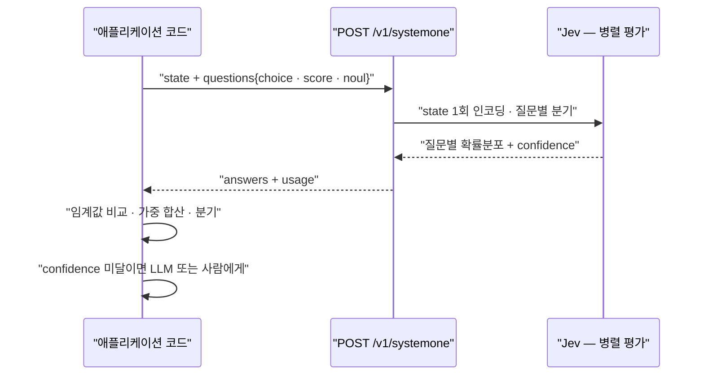
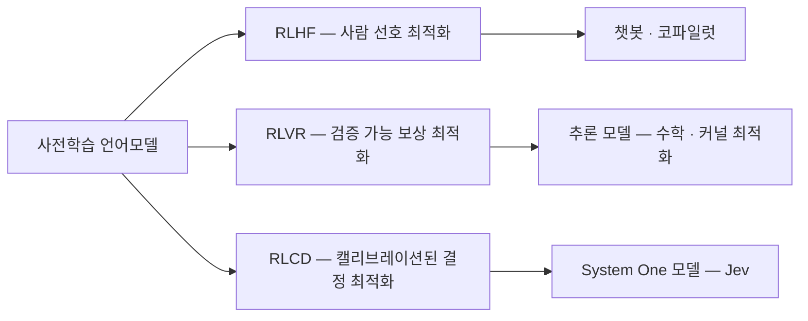

# TypeSafe AI — Jev 심층 분석

> 조사 기준일 2026-09-30 · 모델 버전 `jev-1.13.0` (`jev-latest`) · 상위 문서: [README](README.md)

## 1. 프로젝트 개요

**TypeSafe AI**는 2024년 중반 샌프란시스코에서 설립됐다. 창업자는 **Diogo Almeida**(CEO, OpenAI에서 InstructGPT·RLHF 공동 발명, 전 Google Brain), **Sasha Sheng**(COO, 전 Meta/FAIR), **Erik Gafni**(CTO, 연쇄 창업자). 투자 규모는 비공개다.

핵심 문제의식은 한 문장으로 요약된다.

> *"모델은 몇 년째 채팅에서 초인적인데, 자동화는 어디 있나?"*

TypeSafe의 진단은 **RLHF가 "사람이 선호하는 텍스트"를 최적화하기 때문에 구조적으로 어시스턴트용이고 자동화용이 아니라는 것**이다. 그 결과 (1) 과신과 헛소리가 보상되고, (2) mode dropping이 일어나고, (3) 파싱 실패·타입 에러가 남아 사람이 루프 안에 계속 있어야 한다.

- 회사 슬로건: **"Build Prod, Not God"** — AGI 경쟁이 아니라 "DB 쿼리처럼 의존 가능한 지능 프리미티브"를 만든다.
- 자기 규정: *"We are primarily a data research lab."* 학습 데이터를 전량 자체 제작하며, **고객 데이터로는 학습하지 않는다**("would not train on your data even if you asked").
- 이름 유래: 모델 범주명은 Kahneman의 System 1(빠른 직관). `Jev`는 **William Stanley Jevons** — 지능 단가가 한 자릿수 떨어질 때마다 수요는 그 이상 늘어난다는 제번스 역설에 대한 베팅.

## 2. 핵심 특징 및 차별점

| 항목 | 내용 |
|---|---|
| 출력 | `choice` · `score` · `noul` 세 프리미티브. 전부 확률분포 + confidence 동반 |
| 타입 안전성 | 사전 정의된 값 공간 밖으로 나갈 수 없음 — **"mathematically impossible"** |
| 샘플링 | 한 요청의 모든 질문·옵션을 **병렬**로 평가. 질문을 추가해도 지연이 거의 증가하지 않음 |
| 가격 | 입력 **$0.042/MTok** ($42/십억 토큰), **출력 무료**("too cheap to meter") |
| 지연 | 70~500ms (자체 발표). 서비스는 미국 서부 |
| 제약 | Choice 옵션 최대 **255**개, Score 레벨 **2~10**개. 컨텍스트 **요청당 64k**(state + 전체 질문), **32k**(state + 가장 긴 질문 1개) |
| Rate limit | **100K tokens/sec · 40 requests/sec** (둘 중 먼저 걸리는 쪽에서 `429`). 공식 문서가 "수요가 많아 예고 없이 변경될 수 있다"고 명시 |
| 언어 | **영어가 주 학습 언어**. CJK 포함 타 언어는 처리되나 정확도가 낮음 — 공식 문서가 자체 콘텐츠로 테스트할 것을 권고 |
| 학습 | **zero-shot** — 파인튜닝 메뉴 없음. 맞춤화는 `instructions`·`criteria`·`state` 설계로 |

## 3. 아키텍처 분석

### 3-1. 요청 흐름



설계 포인트:

- **질문 상호 독립**: 같은 요청의 질문들은 동일한 `state`를 보지만 서로의 답을 보지 못한다. 따라서 context-rot이 없고, 질문 추가·삭제가 다른 답을 바꾸지 않는다. 의존 관계가 있으면 코드에서 2차 요청을 보내야 한다.
- **Score 레벨도 개별 평가**: 문서가 명시하듯 "모델은 레벨 번호나 이웃 레벨을 보지 않는다." 그래서 레벨 설명은 *정도*("보통 수준")가 아니라 *상황*("기능은 고장났지만 우회책 있음")으로 써야 한다.
- **`confidence`는 파생값**: 확률분포의 뾰족함을 0~1로 축약한 통계량. Noul에는 없다(값 자체가 확신도).

### 3-2. RLHF · RLVR · RLCD



TypeSafe가 밝힌 RLCD의 출력 계약:

- 모델은 텍스트를 생성하지 않는다
- 결정과 확률을 반환한다
- **높은 확률은 실제로 더 높은 정답률에 대응해야 한다** (집단 수준 캘리브레이션: 0.8을 부여한 것들은 약 80% 맞음)

RLHF의 문제로 지목한 것은 **sycophancy·확신 있는 hallucination**, 그리고 **mode dropping**(선호 최적화가 특정 스타일로 분포를 좁히는 현상, mode collapse의 약한 형태)이다. 이 진단은 문헌상 근거가 있다 — post-training(SFT/RLHF/DPO)이 사전학습 모델의 캘리브레이션을 악화시킨다는 것은 GPT-4 technical report 이후 반복 확인된 현상이다.

### 3-3. 역추론된 내부 구조

가중치·아키텍처·파라미터 수는 비공개다(CEO: *"close to the chest for now"*, 논문은 예정). 다만 API 행동만으로 상당 부분이 밝혀졌다 — 상세는 [open-implementations.md](open-implementations.md#1-역추론된-아키텍처)에 정리.

## 4. 기술 스택 · 접근 경로

| 경로 | 내용 |
|---|---|
| HTTP | `POST https://api.typesafe.ai/v1/systemone`, `Authorization: Bearer` |
| Python SDK | `pip install typesafe-sdk` — `TypeSafeClient` / `AsyncTypeSafeClient`, `Choice`/`Score`/`Noul` |
| JS SDK | `TypeSafeClient`, `choice()`/`score()`/`noul()` 함수형 API |
| Playground | `console.typesafe.ai/playground` |
| 에이전트 스킬 | `claude plugin marketplace add typesafe-ai/skills` 또는 `npx skills add typesafe-ai/skills` |
| 게이트웨이 | OpenRouter(beta) · Cloudflare AI Gateway · Vercel AI Gateway |
| 프레임워크 | pydantic-ai, LangChain(`TypeSafeClassifier`)·LangSmith, LlamaIndex(DocJev), AutoGPT, Dify, Arize Phoenix·OpenInference, Cline, elizaOS, rig(Rust), Flyte |
| 오픈소스 어댑터 | `system-one-adapter`(MIT) — 같은 인터페이스를 OpenAI·Anthropic 모델로 구현. 벤치마크 비교용 |

에러 코드는 표준적이다: `401`, `422`(스키마 검증 실패), `429`, `529`(과부하). SDK가 지수 백오프를 기본 제공한다.

## 5. API 및 인터페이스

### 5-1. 프리미티브

| | **Choice** | **Score** | **Noul** |
|---|---|---|---|
| 질문 | 옵션 중 하나 | 순서 있는 척도 위 위치 | 참/거짓 |
| `criteria` | `{옵션: 설명 or null}` | `[레벨 설명, ...]` (순서 = 번호) | 선택적 `{true, false}` |
| 반환 | `choice`, `probabilities`, `confidence` | `score`, `legend`, `probabilities`, `confidence` | `noul` (0~1) |
| 제한 | 옵션 ~255 | 레벨 2~10 | — |
| 코드 매핑 | `match` / 분기 | 임계값, 가중 합산 | `if` |

`instructions`·`criteria` 값에는 문자열 외에 **JSON 객체·배열**을 넣을 수 있다. 실무에서 유용한 두 패턴:

- **경계 명확화**: 옵션 설명을 `{covers, does_not_cover, examples}` 객체로 주면 인접 옵션 혼동이 줄어든다
- **택소노미 워킹**: 깊은 분류 체계는 레벨마다 Choice 하나씩, 옵션 값에 하위 트리를 넣어 코드에서 트리를 내려간다. 확률이 비슷하면 여러 분기를 살리는 beam search도 가능

### 5-2. 요청 · 응답

```json
{
  "state": "Hi, I've been trying to connect my Stripe account for 3 days and it keeps failing. I'm losing sales. Please help ASAP.",
  "model": "jev-latest",
  "questions": {
    "department": {
      "type": "choice",
      "instructions": "Which team should handle this",
      "criteria": {
        "billing": "Payment or subscription issues",
        "technical": "Bugs or integration problems",
        "sales": "Pricing or account questions"
      }
    },
    "frustration": {
      "type": "score",
      "instructions": "How frustrated the customer appears",
      "criteria": ["Calm, just stating facts", "Frustrated but civil", "Very angry, strong language"]
    },
    "is_urgent": {
      "type": "noul",
      "instructions": "The message conveys urgency or time-sensitivity"
    }
  }
}
```

```json
{
  "model": "jev-latest",
  "answers": {
    "department":  { "type": "choice", "choice": "technical",
                     "probabilities": {"billing": 0.159, "technical": 0.84, "sales": 0.001},
                     "confidence": 0.596 },
    "frustration": { "type": "score", "score": 1.035,
                     "legend": {"0": "Calm, just stating facts", "1": "Frustrated but civil", "2": "Very angry, strong language"},
                     "confidence": 0.842 },
    "is_urgent":   { "type": "noul", "noul": 0.999 }
  },
  "usage": { "input_tokens": 312, "output_tokens": 48 }
}
```

`score`는 확률 가중 평균이라 레벨 사이 값이 나온다. 같은 1.0이 "전부 레벨 1"일 수도, "레벨 0과 2 반반"일 수도 있으므로 `probabilities`를 함께 읽어야 한다.

### 5-3. 상태(state) 설계

`state`는 문자열·객체·배열 모두 가능하다. 문서 권고는 **대부분의 경우 객체**로, 각 부분에 이름을 붙이는 것이다. 질문의 `instructions`에서 백틱 경로로 특정 필드를 지목한다.

```python
questions = {
    "refund_requested": {"type": "noul",
        "instructions": "Does `ticket.messages[0].text` request a refund?"},
    "policy_supports_refund": {"type": "noul",
        "instructions": "Does `refund_policy` support the refund requested in "
                        "`ticket.messages[0].text`, given `order.charges`?"},
}
```

## 6. 확장성 및 패턴

공식 문서가 정리한 네 가지 패턴은 그대로 설계 가이드로 쓸 수 있다.

| 패턴 | 내용 | 이득 |
|---|---|---|
| **Speculative fan-out** | 필요할지 모르는 질문까지 한 요청에 전부 넣고, 코드가 쓸 것만 고른다 | 비용·속도 |
| **Confidence-gated routing** | 답(what)과 확신도(whether)를 분리된 두 축으로 쓴다 | 신뢰성·안전성 |
| **Composite scoring** | 복합 판단을 원자적 Score 여러 개로 쪼개고 **가중치는 코드에서** 결정 | 비용·신뢰성·속도 |
| **Intent routing** | 의도 분류 후 결정론적 로직·전문 LLM·사람으로 분기 | 비용·속도 |

Speculative fan-out의 근거 수치: 13개 질문을 1콜에 묶으면 13콜 대비 **11.5배 저렴, 9.6배 빠르며 답은 동일**하다.

위험도에 따라 임계값을 달리 두는 것이 confidence-gated routing의 핵심이다.

```python
action = response.answers["action"]
if action.confidence < 0.5:
    route_to_human(msg)                     # 모델이 모르겠다고 말한 경우
elif action.choice == "check_balance":
    show_balance()                          # 저위험, 되돌릴 수 있음
elif action.choice == "approve_transfer":
    confirm_then_execute() if action.confidence > 0.9 else ask_user_to_confirm()
```

## 7. 성능 특성

### 7-1. 자체 발표 (workflow evals, 4개 워크플로 711 케이스)

정답 라벨은 GPT-6 Astra와 Claude Fable 5.1(high thinking)의 평균이다.

| 시스템 | 평균 정확도 | 케이스당 비용 | 케이스당 시간 |
|---|---|---|---|
| **Jev** (workflow) | 67.8% | **$0.0004** | **0.4s** |
| Opus 5 (workflow) | 73.1% | $0.1761 | 37.8s |
| sol (workflow) | 74.1% | $0.0836 | 23.3s |
| Sonnet 5 (workflow) | 67.8% | $0.1174 | 78.1s |
| Haiku 4.5 (workflow) | 53.6% | $0.0195 | 12.5s |

홈페이지의 "193.6배 빠름, 444.6배 저렴"은 여기서 나온 상한 수치다. 회사 스스로 밝힌 편향: 워크플로를 자사 팀이 작성했고, 참조 답이 OpenAI·Anthropic 모델이며, hallucination 0%는 실측이 아니라 스키마 보장에서 나온 값이다.

### 7-2. 독립 측정

| 항목 | 수치 |
|---|---|
| MMLU-Pro | 84.6% (Archer Hume) |
| MMLU 1,200문항 ECE | 0.031 |
| in-domain ECE | OpenBookQA 0.024 · CommonsenseQA 0.032 · HellaSwag 0.029 |
| **OOD ECE** | **0.107** (Choice에 temperature 3.29 필요) |
| 반복 평가 일관성 | 500회 pass/fail 100% 일치, 점수 분산 LLM judge의 1/92~1/913 (LangSmith) |
| 평가 단가 | $0.00035/건, 0.44s/call (LangSmith) · 문서 1,000건 $0.22 (lindfors.no) |
| JevBench v1.4.2.2 | 95개 시스템 중 **4위** (63.29) — 등가중 조화평균 지표. Intelligence 53.06 · Calibration 76.34 · Speed 83.27 · Cost 51.97 |
| **JevBench sealed 308문항** | **36.7%** (우연 기준선 29.3%) · **ECE 0.220**. 같은 문항에서 GPT-6 Luna 95.5% / ECE 0.098, DeepSeek V4.1 Flash 94.8% / ECE 0.053. 유형별 약점: temporal_numeric 28.6%, long_policy 27.5%, ambiguous_abstain 29.7% — 공식 jaggedness와 일치 |

### 7-3. 지연(latency)과 처리량(throughput)

공개된 latency 수치가 서로 3배 이상 갈리는데, **무엇을 재는지가 다르기 때문**이다. 세 층위를 구분해야 한다.

**층위 1 — 서버가 보고하는 upstream duration** (독립 측정, `jev-1.13.0`, 단일 계정·리전)

| state 길이 (질문 1개) | 중앙값 | | 질문 개수 (짧은 state) | 중앙값 |
|---|---|---|---|---|
| 360 tok | 57.5ms (44~79) | | 1개 | 86.5ms |
| 1,869 tok | 84ms | | 25개 | 72ms |
| 9,796 tok | 89ms | | 100개 | 82ms |
| 15,071 tok | 153ms | | 500개 | 181ms |
| 20,423 tok | 185ms | | 1,000개 | 453.5ms |
| 29,835 tok | 218ms (211~244) | | 1,500개 | 610ms |

두 축 모두 작업량에 따라 늘지만 **sublinear**다. state를 80배 늘려도 4배, 질문을 1,500배 늘려도 7배다. 이것이 "state를 1회 인코딩하고 질문을 배치한다"는 구조의 직접적 증거다.

**층위 2 — 같은 지역, 워밍업 후 SDK 왕복** (60회 교차 실행, 짧은 티켓)

| | p50 | p90 |
|---|---|---|
| 질문 1개 | 143ms | 191ms |
| 질문 10개 | 157ms | 206ms |

같은 조건에서 자체 GH200으로 서빙한 Qwen3.8-27B-FP8 비교값: 10개 boolean을 JSON 1콜로 467ms, 10개 1-token 병렬 호출 713ms.

**층위 3 — 임의 위치에서의 종단 지연** (108 요청, 3라운드)

| 지표 | 값 |
|---|---|
| 평균 | 1,531ms |
| **P50** | **1,475ms** |
| **P95** | **1,902ms** |
| 최대 | 2,426ms |
| API 오류 | 0 / 108 |

측정자의 결론은 인용할 만하다: *"이 결과는 커뮤니티에 흔한 sub-second 홍보와 명확히 다르다. 네트워크·게이트웨이·큐잉·콜드스타트가 포함된 값이며, 온라인 서비스 용량 계획은 모델 서버의 추론 시간이 아니라 **로컬에서 API까지의 종단 P95**를 기준으로 해야 한다."*

**그 외 맥락별 관측치**

| 출처 | 값 |
|---|---|
| TypeSafe 자체 발표 | 70~500ms |
| 자체 workflow evals | 케이스당 0.4s (4워크플로 평균) |
| LangSmith 평가 실험 | 0.44s/call |
| 노르웨이어 문서 분류 | 문서당 중앙값 0.32s |
| 공개 Doom 런 | 호출당 114~212ms (네트워크 포함) |
| 에이전트 툴콜 게이트(SIEGE) | 150~300ms |
| Every.to | 37문서 × 21질문 = 777판정을 0.7초 미만 (동시 요청) |

**처리량 계산**

공식 한도는 **40 req/s**와 **100K tok/s**이고, 둘 중 먼저 걸리는 쪽에서 `429`가 난다. 요청당 입력이 2,500 토큰이면 두 한도가 동시에 포화되고, 그보다 짧으면 **요청 수 한도(40 req/s)가 먼저 걸린다**.

여기서 중요한 설계 결론이 나온다. 초당 40건은 대량 분류에 낮은 한도지만, **판정 처리량은 요청 수가 아니라 요청당 질문 수로 결정된다.** 단일 요청에 1,500질문을 담아 610ms에 받으면 그 요청만으로 약 2,460 decisions/s다. 즉 [speculative fan-out](https://docs.typesafe.ai/patterns/fan-out)은 비용 절감 기법이기도 하지만 **rate limit 설계의 핵심**이며, 지연이 질문 수에 거의 무감하다는 성질과 정확히 맞물린다.

실측 지속 처리량 사례는 Doom 데모의 **초당 10쿼리**(약 $7/시간)가 유일하게 공개된 값이다.

**공개되지 않은 것**

- 공식 p95·p99, SLA, 리전 정보(현재 미국 서부 1곳으로 추정)
- 동시성 거동, 콜드스타트, 피크 시간 테일 지연
- `429`·`529` 발생 후 회복 거동
- 롱컨텍스트에서의 지연·정확도 동시 변화

Jev가 공개하지 않은 **동시성 거동의 참고치**로는 같은 범주의 오픈 서버 [OpenJev](open-implementations.md#3-8-openjev-razorback16--diffusion-canvas와-멀티모델-게이트웨이)가 공개한 벤치가 있다. state 2K 토큰을 넘으면 GPU가 prefill에 묶여 동시성을 올려도 처리량은 늘지 않고 큐잉만 늘어난다 — prefill-only 구조의 일반적 성질이므로 Jev 용량 계획에도 같은 형태를 가정하는 것이 안전하다.

rate limit이 "예고 없이 변경될 수 있다"고 공식적으로 명시된 상태이므로, 용량 계획은 문서 수치를 상수로 두지 말고 **자체 환경에서 종단 P95를 직접 측정**해야 한다.

### 7-4. 알려진 제약

TypeSafe는 `jev-1.13` 기준 **공식 "jaggedness" 문서**로 9개 실패 모드를 스스로 공개한다. 독립 검증에서 나온 실패 사례들과 정확히 겹친다.

| # | 실패 모드 | 공식 권고 |
|---|---|---|
| 1 | **문자 그대로 읽음** — 의도가 아니라 쓰인 문장에 답한다. 부정·범위 한정어를 액면가로 해석 | 조건을 정확히 쓰고 경계 케이스를 criteria에 넣는다. 해석이 불가피하면 두 개의 문자적 질문으로 분리 |
| 2 | **수치·계산** — 계산기가 아니다. **셀 수 없다**(글자·출현 횟수·목록 항목), 대상이 커지면 오차도 커진다. hex/RGB 같은 수치 표현은 영어 이름보다 나쁘다 | 산술은 코드에. 세려면 항목마다 Noul 하나씩 묻고 코드에서 합산 |
| 3 | **날짜·시간 비교** — 날짜를 순서 있는 양이 아니라 텍스트로 읽는다. 선후·간격·구간 포함 판정이 불안정 | 추출(판단)은 모델, 산술은 코드. 날짜 각 부분은 닫힌 집합이므로 Choice로 추출하고 "명시 안 됨" 옵션을 둔다 |
| 4 | **간접 참조(indirection)** — 참조를 여러 번 거치는 판단에 약함 | hop을 줄이고 관련 state를 직접 가리킨다 |
| 5 | **무관한 내용이 많은 큰 state** | 먼저 필터링해 질문에 필요한 것만 보낸다 |
| 6 | 적대적 콘텐츠 | 정밀한 프롬프트 + 배포 전 엣지 케이스 테스트 |
| 7 | instructions와 criteria가 모순될 때 | 둘을 정렬시킨다 |
| 8 | 상식적 구조 불변식 | 한 방향으로만 묻고, 항등식은 코드에서 강제 |
| 9 | 생성 | 생성 모델을 쓴다 |

특히 **Score의 기대값으로 두 레벨 사이의 정확한 수치를 복원하지 말라**고 명시한다. 임계값 통과 판정에는 쓸 수 있지만 레벨 간 보간으로 실제 숫자를 재구성하는 것은 수치 캘리브레이션이 약해 불가능하다.

그 밖에 독립 검증에서 확인된 제약:

- **추론 불가**: 다단계 추론이나 역추론이 필요한 판단에서 자신 있게 틀린다. 포커에서 넛츠를 들고 4배 팟 올인을 62% 선택(솔버는 100% 체크).
- **컨텍스트 예산**: 요청당 64k(state + 전체 질문), state + 가장 긴 질문 하나는 32k. 긴 문서는 청크 → map-reduce로.
- **설명 없음**: 왜 그 답인지 알려면 별도 LLM 호출이 필요하다.
- **비영어권 정확도가 공식적으로 낮다.** 문서가 "영어가 주 학습 언어이고 CJK를 포함한 타 언어는 동등하게 처리되지 않는다. 비영어 워크로드에 의존하기 전에 자체 콘텐츠로 테스트하고 confidence 라우팅에 특히 주의하라"고 명시한다.

## 8. 배포 및 운영

호스팅 API 전용이다. 다운로드·self-host·on-prem 경로는 공개되지 않았고, 서비스는 **early access 대기열** 상태다. 오픈소스로 공개된 것은 모델이 아니라 주변부(어댑터, 에이전트 스킬, 쿠크북)다.

운영상 고려사항:
- **데이터 외부 전송이 전제**다. 규제 도메인에서는 `state`에 무엇을 담을지가 곧 컴플라이언스 결정이 된다(개인정보 마스킹·최소화).
- 가격 지속성은 미검증이다. 회사도 *"can't prove it isn't subsidized"*라고 인정하며, 장기적으로 내려갈 것으로 기대한다고만 밝혔다.
- 대안 경로가 존재한다: `system-one-adapter`로 LLM 백엔드, 또는 오픈 구현체(kev·Jeff·Jeeves·JevK5)의 `/v1/systemone` 호환 서버로 교체 가능.

## 9. 경쟁 · 비교 분석

| 대안 | 트레이드오프 |
|---|---|
| **LLM + structured output** | 유연하고 추론 가능하나 느리고 비싸며 파싱·재시도 필요. constrained decoding도 여전히 토큰 단위 생성이고, logprob는 RLHF 후 과신 경향 |
| **LLM logprob 읽기** | Jev와 가장 가까운 LLM 사용법이지만 질문 1개 = forward pass 1회, 옵션이 단일 토큰이어야 안정적 |
| **BERT류 학습 분류기** | 더 싸고 감사 가능하나 라벨링·재학습 필요, 분포 밖에서 약함. Jev는 zero-shot으로 이 자리를 노림 |
| **cross-encoder 리랭커** | 검색 랭킹에서는 강하나 범용 판단에서는 약함(SemIf 측정: 리랭커 0.560 vs 직접 logit 0.845) |
| **LLM-as-judge** | 설명이 풍부하나 고비용·고지연·저일관성 |
| **오픈 System One 구현체** | 주권·단가·파인튜닝에서 유리, 추론·고카디널리티·제로샷 범용성에서 열세 — [open-source-comparison.md](open-source-comparison.md)(같은 잣대 비교) · [open-implementations.md](open-implementations.md) 참조 |

## 10. 종합 평가

**적합한 용도**: 답의 공간을 열거할 수 있고, 판단 기준이 자연어로만 표현되며, 호출량이 많거나 지연이 중요한 자리. 구체적으로 라우팅·분류·rubric 채점·검증·가드레일·리랭킹·반복 평가.

**부적합한 용도**: 생성(글·코드), 다단계 추론, "왜"에 대한 설명이 결과물인 일, 컨텍스트 예산을 넘는 긴 문서 단일 처리, 오답 비용이 큰데 골든셋 검증을 하지 않은 경우.

**가장 중요한 실무 결론**: `confidence`를 신뢰하려면 자체 데이터로 confidence–정확도 곡선을 그려야 한다. in-domain에서는 캘리브레이션이 우수하지만 OOD에서는 과신하며, **질문 타입별로 보정 방향이 다르다**(Choice 과신, Noul 과소신). TypeSafe가 캘리브레이션 곡선을 공개하지 않았으므로, 이 측정은 도입 측의 몫이다.
