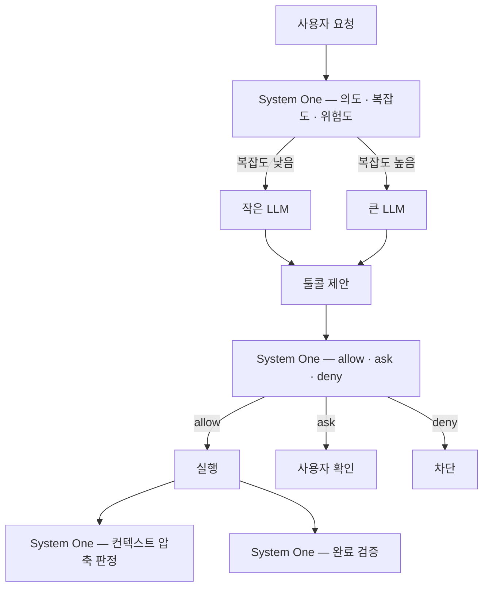
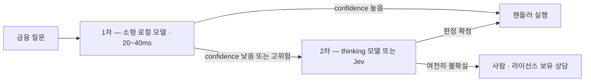

# System One 모델 활용 사례와 검증 결과

> 조사 기준일 2026-09-30 · 상위 문서: [README](README.md)

Jev 출시(2026-09-15) 이후 2주간 축적된 **실제 사용 사례**, **독립 검증 결과**, 그리고 **금융 도메인 적용 설계**를 정리한다. 무엇이 실제로 작동했고 무엇이 실패했는지에 초점을 둔다.

## 1. 적합성 판단 기준

도입 후보를 걸러내는 세 가지 질문. 셋 다 "예"여야 의미가 있다.

1. **답의 공간을 미리 열거할 수 있나?** (카테고리·등급·예/아니오) — 자유 텍스트·코드·설명이 필요하면 탈락
2. **판단 기준이 코드가 아니라 자연어로만 표현되나?** — 룰·정규식으로 되면 그냥 코드로
3. **호출량이 많거나 지연이 중요한가?** — 하루 10번 부르는 일이면 LLM으로 충분

## 2. 실제 사용 사례 — 카테고리별

커뮤니티 트래커가 집계한 공개 사례는 220~287건 수준이다. 그중 **코딩 에이전트 하네스**가 압도적으로 큰 클러스터다.

### 2-1. 코딩 에이전트 하네스

답 공간이 열거 가능하고 초당 여러 번 호출되는 자리라 가장 잘 맞는다.

| 패턴 | 하는 일 | 측정치 |
|---|---|---|
| **툴콜 안전 게이트** | `Choice(allow / ask / deny)`로 매 툴콜을 심사 | 승인 판정 **8.7배 빠름, 프롬프트 4.4배 감소** (Hermes 에이전트 PoC) |
| **모델 · effort 라우팅** | 요청당 Choice 하나로 (model, effort) 쌍 선택 | LiteLLM 라우터, Codex/Claude 프록시 등 다수 |
| **컨텍스트 압축** | 요약 대신 "이 툴콜 결과가 아직 필요한가" Noul → verbatim 보존 | Claude Code·Codex·Pi 플러그인 |
| **완료 검증 (Stop hook)** | "구현 완료? 테스트 충분? 사람 필요?" | 에이전트가 조기 종료하는 것을 막음 |
| **코드 리뷰 · 커밋 훅** | 31개 Clean Code smell Boolean, 시크릿·파괴 명령 탐지, 커밋 메시지-diff 일치 | pre-commit에서 서브초 |

LangChain은 공식 가이드에서 **모델 라우팅 + 툴 리스크 게이팅** 두 가지를 하네스에 넣는 방법을 문서화했다.



### 2-2. 브라우저 · 컴퓨터 사용

- **browser-use/jev-ultrafast**: 매 사이클 `operation`(CLICK/TYPE/SCROLL/DONE…) + `target`(번호 매긴 요소) 두 Choice를 결정하고, 텍스트 입력이 필요할 때만 소형 LLM을 호출한다. 스크린샷 없이 구조화된 DOM 상태만 쓴다.
  - Google Flights 6회 교차 실행: 중앙값 **9.450s → 7.092s (-25%)**, 브라우저 프로토콜 호출 **1,092 → 101 (-91%)**
  - 한계: shadow root·iframe·canvas·업로드·팝업 탭 미지원, 3회 반복 외 신뢰성 벤치 없음, DONE 판정은 독립 검증 필요
- Cline 공식 플러그인, Codex Computer Use 결정 레이어, macOS 접근성 트리 기반 음성 제어 등.

### 2-3. 평가 (LLM-as-judge 대체) — 가장 설득력 있는 결과

LangChain/LangSmith가 에이전트 응답 5건을 100회씩 반복 채점했다.

| 판정자 | pass/fail 정확도 | 케이스별 점수 분산 | 500회 비용 |
|---|---|---|---|
| **Jev** | **100%** (500/500) | **0.0000149** | **$0.34** |
| GPT-5.6 Terra | 99.8% | 913배 | — |
| GPT-5.6 Luna | 96.4% | 433배 | — |
| Claude Sonnet 4.6 | 80.0% | 92배 | $28.17 |

Jev는 0.44s/call, $0.00035/평가. 결론은 "코드 기반 eval과 LLM judge에 이은 **제3의 형태**"이며, 저자들도 "싼 비용이 실수를 증폭할 수 있다"고 경고했다. Vercel의 eve 엔진은 Jev를 기본 evaluate 모델로 채택했다.

**반복 일관성이 정확도보다 중요한 용도**에서 이 범주가 가장 강하다는 근거다.

### 2-4. 검색 · 리랭킹 · 데이터

- 리랭킹 쿠크북: BM25 후보 30개를 쿼리-후보 쌍 Noul로 재정렬 → top-1 5%→18%, top-10 38%→62%
- **반례**: 카탈로그 33,047건·실제 쿼리 164개·채점 쌍 9,831개 측정에서 "Jev 리랭킹은 공짜 이득이 아니다"는 보고. 검색 품질 개선은 파이프라인 전체를 봐야 한다.
- semantic grep 계열: 코드 청크·diff hunk·CSV 행마다 Noul (한 요청에 16개씩)
- **SQL 안에서**: `sqlite-jev`(C 확장), `jevql`(Postgres) — `SELECT … WHERE jev_noul(body, '환불 요청인가') > 0.8`
- 문서 파이프라인: LlamaIndex `DocJev` — 자연어 규칙으로 문서 분류·서브문서 경계 탐지
- 데이터 큐레이션: 합성 JSONL·Parquet 행을 Noul로 필터링, 애매한 것만 감사 샘플로 분리

### 2-5. 게임 · 로봇 — 경계를 드러낸 실험

Doom, Pokémon Red(분기점만 모델, 나머지는 코드), Mario, StarCraft, Minecraft, 체스(Stockfish 채점), MuJoCo 드론 2.5Hz, SO-101 로봇팔 등.

가장 유용한 결과는 **실패 사례**다. 포커 실험에서:

- 팟 오즈가 명확한 상황(15 outs, 필요 equity 30%, 보유 33%)에서는 솔버와 63% 일치, 해당 케이스는 94% 콜(솔버 96%)
- 그러나 **넛츠를 들고 4배 팟 올인에 맞서 16회 중 62% 쇼브**(솔버는 100% 체크). "강한 핸드가 베팅으로 오히려 손실을 낸다"는 역추론을 못 한다

→ **System One은 전술적 판단은 하지만 전략적 역추론은 못 한다.** 그리고 실패 방식이 "모르겠다"가 아니라 "자신 있게 틀림"이라 위험하다.

### 2-6. 기타 도메인

Discord·Twitch 모더레이션, 스팸 분류(TF-IDF 대비 벤치), 연방 motion-to-dismiss 판결 예측, DOM 요소 단위 광고 차단, YouTube 스폰서 구간 스킵, Home Assistant, 이력서 스크리닝(정책 변경 시 재채점이 사실상 무료), 배송 예외 트리아지, 오픈소스 이슈·PR 트리아지, 논문 스크리닝.

## 3. 독립 검증 결과

### 3-1. 캘리브레이션

| 출처 | 설정 | 결과 |
|---|---|---|
| jev-ood-calibration | 공개 벤치 3종 | OpenBookQA 94.2% ECE 0.024 · CommonsenseQA 88.1% ECE 0.032 · HellaSwag 86.1% ECE 0.029 — 단 저자는 "학습 데이터에 있었을 가능성이 있어 **in-domain 캘리브레이션으로 읽어야 한다**"고 명시 |
| 같은 실험 | **900건 규칙 생성 합성 티켓**(모델이 알 수 없는 조직 정책 포함) | 전체 75.1% **ECE 0.107**(노이즈 하한의 4.4배). Noul 91.7% T=0.66(과소신) · **Choice 89.0% T=3.29(심한 과신)** · Score 44.7% T=3.40. 총 API 비용 $0.06, 재현 가능 |
| lindfors.no | 노르웨이어 정부 공청회 문서 24건 | 스탠스 20/24, 응답자 유형 21/23, 순서 척도 19/24(DeepSeek 14/24). **확률 0.7~0.9 구간 97% 일치, 0.9~1.0 구간 98%**. 중앙값 0.32s, 문서 1,000건당 **$0.22**(DeepSeek 무추론 $1.31 / 추론 $3.08) |
| Archer Hume | MMLU 1,200문항 | ECE 0.031 (단 1,200건 중 990건이 0.9~1.0 구간에 몰림) |
| Every.to | 자기 글 37편 × 21문항 | **777개 판정 0.7초 미만, 약 $0.0025**. 별도 비교에서 Jev 0.35s vs Fable 5.1 8.83s(약 25배), 결함 탐지 6/7 vs 7/7 |

**일관된 결론**: in-domain 캘리브레이션은 우수하고 OOD에서는 무너진다. 그리고 **질문 타입별로 보정 방향이 반대**다(Choice 과신, Noul 과소신) — "하나의 캘리브레이션"이 아니라 타입별 사후 처리가 필요하다는 뜻이다. 오픈 재현체에서도 같은 현상이 확인된다(SemIf: WANLI temperature 2.50).

### 3-2. 커뮤니티 벤치마크

[JevBench](https://github.com/fstandhartinger/jevbench) v1.4.2.2에서 Jev 1.13.0은 95개 시스템 중 **4위**(63.29)다. 상위는 Imajev-4B 67.37, Plumb-4B 65.84, decider-4b v2 64.13.

읽는 방법에 주의가 필요하다:
- 점수는 Intelligence · Calibration · Speed · Cost 4축의 **등가중 조화평균** → 값싸고 빠른 로컬 4B가 구조적으로 유리
- Jev는 raw Intelligence에서 decider-4b v2를 앞선다(53.1 vs 49.4)
- 308개 fresh sealed 문항에서는 JevK5 33.1%, **Jev 36.7%** 로 모두 낮고, 평가자 스스로 "비정상적으로 어려운 세트"라고 밝혔다
- 공개 절반은 학습·선택에 쓸 수 있어 오버피팅 여지가 있다(평가자도 인정)

→ "오픈이 Jev를 추월했다"가 아니라 **"등가중 종합 지표에서 로컬 4B가 경쟁력을 갖췄다"**가 정확하다.

### 3-3. 요약 — 검증된 것과 과대평가된 것

| | 항목 |
|---|---|
| **검증됨** | 에이전트 툴콜 게이트 · 모델 라우팅 · 반복 평가(judge) · 분류·감성·grounding · in-domain 캘리브레이션 · 단가·지연 |
| **조건부** | 리랭킹(파이프라인 전체를 봐야 함) · 컨텍스트 압축 · 브라우저 자동화(신뢰성 벤치 부족) |
| **과대평가** | 시장 방향 예측 · 전략 게임 · 다단계 추론 판단 · OOD confidence를 그대로 신뢰하는 것 |

## 4. 금융 도메인 적용 설계

### 4-1. 사례로 확인된 범위

| 프로젝트 | 용법 | 결과 |
|---|---|---|
| ai-hedge-fund | 투자자 페르소나 프롬프트 + 재무 스냅샷을 state로, `direction` Choice(bullish/bearish/neutral) + 방향별 `strength` Score(5레벨). **모델의 confidence와 "투자 확신도"를 코드에서 명시적으로 분리** | 텍스트 논지 없이 시그널만 생성 |
| 홍콩 주식 T+1 방향 예측 | 30일 OHLCV + 지수 + 월간 수익률 → 3분류 | **120건 중 54건(45%)** — 무작위 수준. 저자 스스로 "단일 응답으로 거래하지 않는다"고 명시 |
| 크립토 롱/숏 | 매 라운드 Choice로 포지션 | 성과 미보고 |
| 뉴스·공청회 문서 분류 | 스탠스·응답자 유형·논거 분류 | 0.7~0.9 구간 97% 일치, 문서 1,000건 $0.22 |
| 금융 문장 감성 | Financial PhraseBank | Jeff-2B **96.3 vs Jev 77.0** |

**교훈이 선명하다**: 시장 방향 예측에는 무의미하고(당연하다), **증거 → 구조화된 판단**(공시 스탠스 분류, 이벤트 분류, 컴플라이언스 체크, 감성 분류)에는 강하다.

### 4-2. 설계 예시 — 금융 질문 라우팅

의도 분류만 하지 않고, **규제 판단·긴급도·복잡도를 한 요청에** 함께 묻는 것이 핵심이다. 질문을 추가해도 지연이 거의 늘지 않는다(speculative fan-out).

```json
{
  "state": {
    "user_message": "삼성전자 지금 들어가도 될까요? 3천만원 정도 여유자금이 있는데 반도체 전망이 어떤지 궁금해요.",
    "recent_messages": ["안녕하세요, 계좌 개설한 지 얼마 안 됐어요.", "주식은 처음이라 잘 몰라요."],
    "account": {"investor_profile": "안정추구형", "experience_years": 0, "holdings_count": 0}
  },
  "model": "jev-latest",
  "questions": {
    "intent": {
      "type": "choice",
      "instructions": "`user_message`의 주된 요청은 무엇인가?",
      "criteria": {
        "market_info": "시세, 종목 정보, 뉴스, 공시, 업종 전망 등 단순 정보 조회",
        "advice":      "특정 종목·상품의 매수/매도 여부, 투자 시점, 포트폴리오 구성에 대한 추천 요청",
        "trade":       "주문 실행, 정정, 취소, 체결 확인 등 실제 매매 요청",
        "account":     "계좌 개설, 입출금, 이체, 인증 등 계좌 관리",
        "portfolio":   "본인 보유 자산의 수익률, 비중, 손익 현황 조회",
        "tax_fee":     "양도세, 배당소득세, 수수료 관련 문의",
        "other":       "위 항목에 해당하지 않는 질문"
      }
    },
    "solicitation_risk": {
      "type": "noul",
      "instructions": "`user_message`에 답하려면 특정 종목의 매수·매도를 권유하거나 투자 판단을 대신 내려줘야 하는가?",
      "criteria": {
        "true":  "\"사도 될까요\", \"어디에 넣을까요\"처럼 답변이 곧 투자 권유가 되는 경우",
        "false": "사실 조회, 개념 설명, 절차 안내처럼 권유 없이 답할 수 있는 경우"
      }
    },
    "beginner_signal": {
      "type": "noul",
      "instructions": "`recent_messages`와 `account`로 볼 때 사용자가 투자 초보자인가?"
    },
    "urgency": {
      "type": "score",
      "instructions": "`user_message`의 시간 민감도",
      "criteria": [
        "시간 제약 없음 — 일반적인 궁금증",
        "오늘 중 처리를 원함 — 장중 매매, 당일 입출금 등",
        "즉시 대응 필요 — 미체결·오주문·해킹 의심·출금 불가 등 손실이 진행 중"
      ]
    },
    "complexity": {
      "type": "score",
      "instructions": "이 질문에 제대로 답하려면 얼마나 깊은 분석이 필요한가?",
      "criteria": [
        "단일 사실 조회로 끝남 — 현재가, 수수료율, 절차 안내",
        "몇 가지 정보를 조합해야 함 — 종목 비교, 최근 뉴스 요약",
        "여러 자료를 종합한 추론이 필요 — 업종 전망, 포트폴리오 재구성, 세금 시뮬레이션"
      ]
    }
  }
}
```

라우팅 로직은 코드가 소유한다.

```python
a = client.system_one(state=state, questions=questions).answers
intent, conf = a["intent"].choice, a["intent"].confidence

# 1) 규제 가드가 최우선 — 의도와 무관하게
if a["solicitation_risk"].noul > 0.8:
    return route("licensed_advisor_flow", beginner=a["beginner_signal"].noul > 0.7)

# 2) 긴급 건은 사람에게
if a["urgency"].score > 1.5:
    return route("human_oncall")

# 3) 의도가 불확실하면 되묻기 — 경계 케이스를 코드가 흡수
if conf < 0.5:
    top2 = sorted(a["intent"].probabilities.items(), key=lambda kv: -kv[1])[:2]
    return ask_clarify(options=[k for k, _ in top2])

# 4) 확실한 의도는 핸들러로, 무거운 질문만 큰 모델로
model = "big" if a["complexity"].score > 1.5 else "small"
return dispatch(intent, model=model)
```

설계 포인트:

- **`other` 옵션은 필수** — 없으면 잡담도 억지로 배정되고 confidence만 낮아진다
- **경계가 겹치는 옵션은 criteria 문장으로 분리** — `market_info`("전망이 어떤가")와 `advice`("들어가도 되나")는 실제로 자주 겹치므로, 낮은 confidence는 되묻기로 처리한다
- **규제 판단을 라우팅과 분리** — 의도가 `market_info`로 분류돼도 권유 위험을 놓치지 않는다
- **복잡도 Score로 모델 라우팅** — 값싼 판정 하나로 뒤에 붙는 LLM 비용을 제어한다
- **한국어는 미검증** — 공식 문서·쿠크북·벤치마크가 전부 영어다. 다국어가 필요하면 Laya-multilingual(mmBERT) 또는 자체 파인튜닝이 현실적이다

### 4-3. 권장 구성 — 2단 게이트



세 계층 모두 `/v1/systemone` 계약을 쓰므로 클라이언트 코드는 하나로 유지된다. 데이터 반출이 제약이면 1·2차를 모두 로컬 오픈 모델로 둘 수 있다.

## 5. 도입 검증 순서

```text
① 골든셋 구축: 대상 판정 하나를 고르고 정답 300건 (한국어면 직접 라벨링)
② baseline 측정: LLM + structured output / 오픈 소형 모델 / Jev를 같은 질문으로
   — 이 단계만으로도 "프롬프트→파싱" 코드가 "질문 정의→분기" 코드로 정리되는 효과
③ 캘리브레이션 곡선: confidence 구간별 정확도, ECE · Brier · risk-coverage
   — 질문 타입별로 따로. 아무도 공개하지 않은 수치이므로 여기가 가장 가치 있는 산출물
④ 임계값 결정: 위험도별로 다른 값. 미달 시 에스컬레이션 경로 구현
⑤ 필요하면 파인튜닝: 수백~수천 건으로도 큰 이득 (음성 내비 사례 31.7% → 95.8%)
```

③을 건너뛰고 임계값을 감으로 정하는 것이 이 범주에서 가장 흔하고 비싼 실수다.

---

## 참고 자료

- [LangChain — Can Jev Be a Better Agent Evaluator?](https://www.langchain.com/blog/jev-agent-evals-langsmith) · [Building a Harness with Jev](https://www.langchain.com/blog/building-a-harness-with-jev)
- [browser-use/jev-ultrafast](https://github.com/browser-use/jev-ultrafast) · [DocJev (LlamaIndex)](https://github.com/jerryjliu/docjev)
- [jev-ood-calibration](https://github.com/scienthoon/jev-ood-calibration) · [JevBench v1](https://github.com/fstandhartinger/jevbench)
- [A first look at TypeSafe's Jev](https://lindfors.no/blog/a-first-look-at-typesafes-jev/) · [Mini-Vibe Check (Every.to)](https://every.to/also-true-for-humans/mini-vibe-check-typesafe-s-jev-judged-everything-i-ve-written-in-0-7-seconds) · [Jev is the fish at the poker table](https://backnotprop.com/blog/jev-poker/)
- [ai-hedge-fund Jev contract](https://github.com/virattt/ai-hedge-fund/blob/main/hedge_fund/llm/contract.py) · [jev_stock](https://github.com/sosopop/jev_stock)
- [awesome-jev (yibie)](https://github.com/yibie/awesome-jev) · [awesome-typesafe](https://github.com/AbdelStark/awesome-typesafe) — 사례 카탈로그. 단 두 리스트 모두 "같은 날 벌크 제출된 프로젝트를 주의하라"고 경고한다
