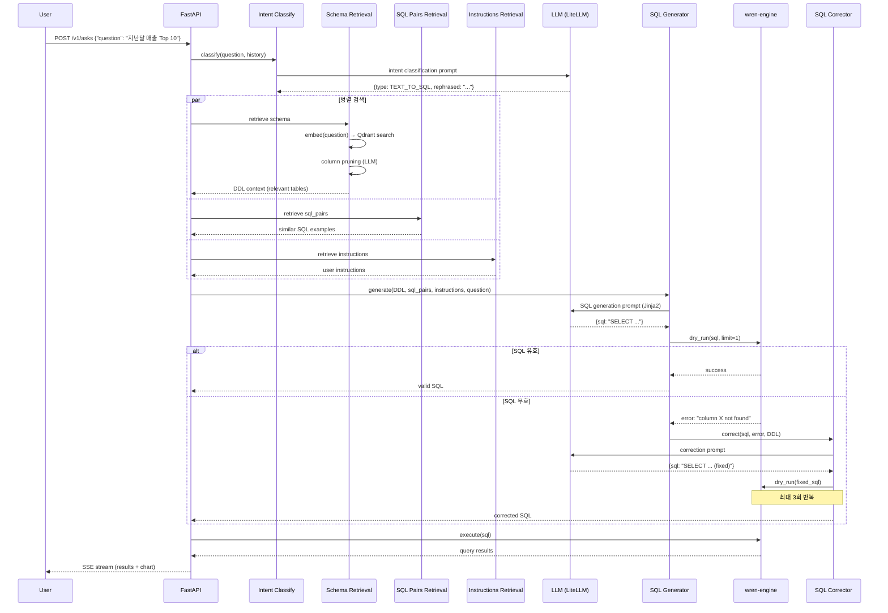
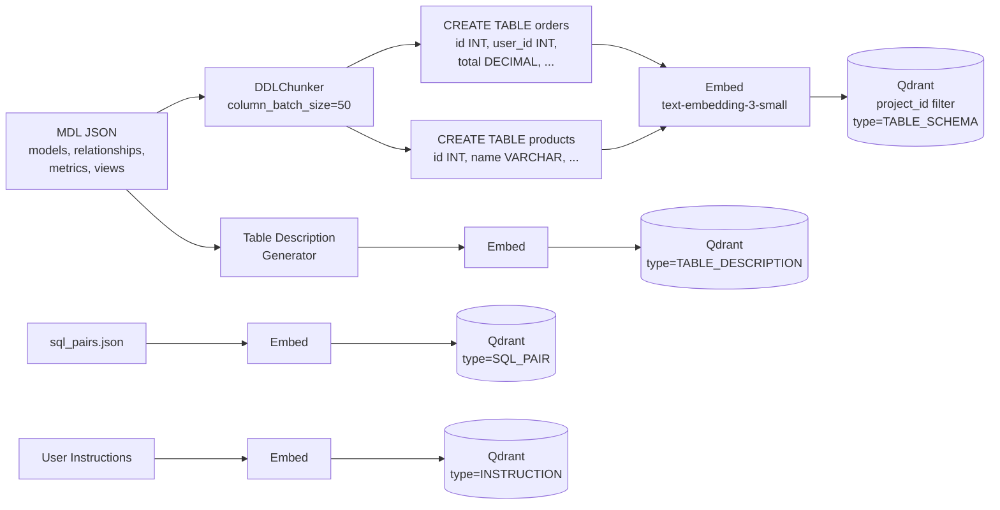

# WrenAI 심층 분석 — Generative BI / Text-to-SQL 플랫폼

> **대상**: https://github.com/Canner/WrenAI
> **핵심 정의**: 자연어 → SQL 변환을 **시맨틱 레이어(MDL)** 로 고정하여 LLM 환각을 방지하는 Generative BI 플랫폼
> **라이선스**: AGPL-3.0
> **주요 언어**: Python (AI Service), TypeScript (UI), Rust (Engine), Go (Launcher)

---

## 1. 프로젝트 개요

### 1.1 해결하려는 문제

LLM 에게 "지난 달 매출 상위 10개 제품" 을 물으면 SQL 을 생성하지만, 그 SQL 이 **의미적으로 맞다는 보장이 없다** — 잘못된 테이블 조인, 틀린 메트릭 정의, 엉뚱한 필터를 쓸 수 있다. 이걸 "Text-to-SQL 환각" 이라고 부른다.

WrenAI 는 **Model Definition Language(MDL)** 라는 시맨틱 레이어를 도입해, 비즈니스 용어(매출, 고객 수, 활성 사용자) 와 실제 테이블/컬럼의 매핑을 한 곳에 정의하고, LLM 이 SQL 을 생성할 때 이 정의를 *반드시* 참조하도록 강제한다.

### 1.2 핵심 컨셉

```
사용자 질문 (자연어)
    → RAG 검색 (관련 테이블/컬럼/메트릭/예시 SQL 검색)
        → LLM SQL 생성 (시맨틱 레이어 기반 프롬프트)
            → SQL 검증 (dry-run / dry-plan)
                → 실패 시 자동 보정 (최대 3회)
                    → wren-engine 으로 실행 (MDL 기반 조인/메트릭 해석)
                        → 결과 반환 + 차트 생성
```

### 1.3 시스템 구성

| 컴포넌트 | 언어 | 역할 |
|----------|------|------|
| **wren-ai-service** | Python (FastAPI) | AI 파이프라인 — RAG 검색, LLM 생성, SQL 검증/보정 |
| **wren-engine** | Rust | SQL 실행 엔진 — MDL 해석, 조인 경로 검증, 쿼리 계획 |
| **wren-ui** | TypeScript (Next.js) | 프론트엔드 — 시맨틱 모델링 UI, 자연어 입력, 결과 시각화 |
| **wren-launcher** | Go | Docker Compose 오케스트레이터 — 로컬 개발/배포 |
| **wren-mdl** | JSON Schema | 시맨틱 레이어 정의 — 테이블, 관계, 메트릭, 뷰 |

---

## 2. 핵심 특징 및 차별점

### 2.1 MDL (Model Definition Language) — 시맨틱 레이어

WrenAI 의 **가장 중요한 차별점**. MDL 은 다음을 정의한다:

- **Models**: 테이블 + 컬럼 (이름, 타입, isCalculated, expression, 관계, isHidden)
- **Relationships**: 외래 키 관계 (ONE_TO_MANY, MANY_TO_ONE, ONE_TO_ONE) + 조인 조건
- **Metrics**: 집계 측정값 (SUM(revenue), COUNT(DISTINCT user_id) 등) + 차원
- **Views**: 기본 테이블 위의 SQL 뷰
- **Column-level access control**: 행 수준 보안 (EQUALS, NOT_EQUALS, GREATER_THAN 등의 연산자 + 세션 속성)

**MDL 이 풀어주는 문제**:
- "매출" 이라고 하면 LLM 이 `revenue` 테이블의 `amount` 컬럼을 쓸지, `orders` 의 `total_price` 를 쓸지 모른다 → MDL 의 `metrics` 가 정확히 정의
- 다대다 관계에서 어떤 조인 경로를 쓸지 → MDL 의 `relationships` 가 유일한 경로를 강제
- "활성 사용자" 의 정의가 팀마다 다름 → MDL 에 한 번 정의하면 모든 쿼리에 일관 적용

### 2.2 Haystack + Hamilton 기반 RAG 파이프라인

- **Haystack 2.7.0**: 문서 관리, 벡터 검색, 임베딩
- **Hamilton 1.69.0**: 비동기 데이터플로우 DAG — 파이프라인 각 단계를 순수 함수로 정의하고 DAG 로 조합
- **Qdrant**: 벡터 스토어 — 스키마 임베딩, SQL 예시, 사용자 지시사항 저장

### 2.3 LiteLLM 기반 멀티 프로바이더

- **LiteLLM 1.75.2**: OpenAI, Anthropic, Gemini, DeepSeek, Ollama, Azure/Vertex/Bedrock 통합
- Router 패턴: 모델 fallback + 로드 밸런싱
- 지수 백오프 재시도 (최대 3회, 60초 타임아웃)

### 2.4 SQL 생성 → 검증 → 자동 보정 루프

```
SQL 생성 → dry-run 검증 → 실패 시 에러 메시지 + 스키마로 재프롬프트 → 최대 3회 반복
```

두 가지 검증 모드:
- **Dry-Run**: 실제 엔진에서 `LIMIT 1` + `dry_run=True` 로 실행 → 구문 + 의미 검증
- **Dry-Plan**: wren-engine 의 쿼리 계획 단계만 실행 → MDL 조인/메트릭 의미 검증 (데이터 접근 없이)

### 2.5 15+ 데이터소스 지원

BigQuery, Snowflake, PostgreSQL, MySQL, DuckDB, Databricks, ClickHouse, MSSQL, Trino, Oracle, Canner Enterprise 등.

### 2.6 Langfuse Observability

모든 LLM 호출, 파이프라인 실행, 토큰 사용량, 에러를 Langfuse 로 추적. `@observe` 데코레이터 기반.

---

## 3. 아키텍처 분석

### 3.1 전체 시스템 구조

```mermaid
flowchart TB
    subgraph Frontend["wren-ui (Next.js)"]
        UI[시맨틱 모델링 UI<br/>자연어 질의<br/>결과 시각화]
    end

    subgraph AIService["wren-ai-service (Python/FastAPI)"]
        direction TB
        API[FastAPI REST API<br/>POST /v1/asks<br/>GET /v1/asks/{id}/result]

        subgraph Pipelines["파이프라인"]
            direction TB
            IC[Intent Classification<br/>TEXT_TO_SQL / GENERAL /<br/>USER_GUIDE / MISLEADING]
            RET[Schema Retrieval<br/>Qdrant 벡터 검색<br/>+ Column Pruning]
            SQLP[SQL Pairs Retrieval<br/>유사 예시 SQL]
            INST[Instructions Retrieval<br/>사용자 지시사항]
            REASON[SQL Generation Reasoning<br/>Chain-of-Thought]
            GEN[SQL Generation<br/>Jinja2 프롬프트<br/>+ Structured Output]
            VAL[SQL Validation<br/>dry-run / dry-plan]
            CORR[SQL Correction<br/>최대 3회 재시도]
            CHART[Chart Generation<br/>Vega-Lite JSON]
        end

        subgraph Providers["프로바이더"]
            LLM_P[LLM Provider<br/>LiteLLM Router]
            EMB_P[Embedder Provider<br/>AsyncTextEmbedder]
            DOC_P[DocumentStore Provider<br/>Qdrant]
            ENG_P[Engine Provider<br/>wren-engine HTTP]
        end

        subgraph Indexing["인덱싱 파이프라인"]
            IDX_S[Schema Indexing<br/>MDL → DDL → 벡터]
            IDX_T[Table Description<br/>테이블 요약 벡터]
            IDX_Q[SQL Pairs Indexing<br/>예시 SQL 벡터]
            IDX_I[Instructions Indexing<br/>사용자 지시사항 벡터]
        end
    end

    subgraph Engine["wren-engine (Rust)"]
        QP[Query Planner<br/>MDL 조인 해석]
        EXEC[SQL Executor<br/>데이터소스 실행]
    end

    subgraph VectorDB["Qdrant"]
        VS[(벡터 스토어<br/>스키마/SQL/지시사항)]
    end

    subgraph DataSources["데이터소스 (15+)"]
        BQ[BigQuery]
        SF[Snowflake]
        PG[PostgreSQL]
        DK[DuckDB]
        ETC[...]
    end

    UI -->|GraphQL| API
    API --> IC --> RET & SQLP & INST
    RET --> GEN
    SQLP --> GEN
    INST --> GEN
    REASON --> GEN
    GEN --> VAL
    VAL -->|실패| CORR --> VAL
    VAL -->|성공| CHART
    GEN --> LLM_P
    CORR --> LLM_P
    RET --> EMB_P
    RET --> DOC_P
    DOC_P --> VS
    Indexing --> VS
    VAL --> ENG_P --> Engine
    Engine --> DataSources
```

### 3.2 Text-to-SQL 파이프라인 상세 흐름



### 3.3 인덱싱 파이프라인 — MDL → 벡터



---

## 4. 기술 스택

| 영역 | 기술 |
|------|------|
| AI 파이프라인 프레임워크 | Haystack 2.7.0 + Hamilton 1.69.0 |
| LLM 추상화 | LiteLLM 1.75.2 (Router + fallback) |
| 벡터 스토어 | Qdrant (haystack-qdrant 7.0.0) |
| 토큰 카운팅 | tiktoken (o200k_base, cl100k_base) |
| SQL 파싱 | sqlparse |
| API 프레임워크 | FastAPI + Uvicorn |
| 프론트엔드 | Next.js + Apollo GraphQL |
| 쿼리 엔진 | Rust (wren-engine) |
| Observability | Langfuse |
| 배포 | Docker Compose (via wren-launcher Go CLI) |

### 핵심 의존성 특징

- **Haystack + Hamilton 조합**: Haystack 은 문서 관리/벡터 검색 전담, Hamilton 은 비동기 DAG 실행 전담. 둘을 결합한 것은 "Haystack 의 파이프라인은 동기적이고 무거운" 문제를 Hamilton 의 경량 비동기 DAG 로 보완하는 전략.
- **LiteLLM**: GoClaw 가 직접 구현한 것과 달리 WrenAI 는 LiteLLM 에 의존. 앞선 분석에서 지적한 "Schema 정규화" 나 "Signature Passback" 문제는 WrenAI 에서는 관련 없다 — Text-to-SQL 은 tool_use 를 쓰지 않고, thinking block 도 필요 없기 때문.
- **Qdrant**: 임베딩 기반 검색에 특화. pgvector 대비 전용 벡터 DB 라 검색 성능이 유리하지만, 별도 인프라가 필요.

---

## 5. 핵심 코드 분석

### 5.1 Provider 추상화 — 데코레이터 기반 등록

```python
# core/provider.py (simplified)
class LLMProvider:
    def get_generator(self) -> Callable:
        """Returns async callable for LLM completion"""
        ...

class EmbedderProvider:
    def get_text_embedder(self) -> Component:
        """Returns Haystack text embedder component"""
    def get_document_embedder(self) -> Component:
        """Returns Haystack document embedder component"""

class DocumentStoreProvider:
    def get_store(self, dataset_name: str) -> DocumentStore:
        """Returns Haystack-compatible document store"""
    def get_retriever(self, document_store: DocumentStore) -> Component:
        """Returns vector retriever for the store"""
```

```python
# providers/llm/litellm.py
@provider("litellm_llm")
class LitellmLLMProvider(LLMProvider):
    def __init__(self, model: str, api_key_name: str, api_base: str = None,
                 context_window_size: int = 128000, fallback_model_list: list = None):
        self._router = litellm.Router(
            model_list=[{"model_name": model, ...}],
            fallbacks=fallback_model_list,
            retry_after=60,
            num_retries=3,
        )
    def get_generator(self):
        async def _generate(prompt, system_prompt=None, history=None, **kwargs):
            messages = self._build_messages(prompt, system_prompt, history)
            response = await self._router.acompletion(messages=messages, **self._model_kwargs)
            return response.choices[0].message.content
        return _generate
```

프로바이더는 `@provider("name")` 데코레이터로 등록되고, 설정 YAML 에서 이름으로 인스턴스화된다.

### 5.2 SQL 생성 파이프라인 — Hamilton DAG

```python
# pipelines/generation/sql_generation.py (simplified)
class SQLGeneration(BasicPipeline):
    def __init__(self, llm_provider, engine, **kwargs):
        self._driver = AsyncDriver(
            sql_generation_module,  # Hamilton 모듈
            config={"llm_provider": llm_provider, "engine": engine},
        )

    async def run(self, query, contexts, sql_samples, instructions, project_id, ...):
        result = await self._driver.execute(
            ["post_process"],       # 최종 노드
            inputs={
                "query": query,
                "contexts": contexts,       # 검색된 DDL
                "sql_samples": sql_samples, # 유사 SQL 예시
                "instructions": instructions,
                "project_id": project_id,
                "has_calculated_field": has_calculated_field,
                "sql_knowledge": sql_knowledge,  # 메트릭/함수 지식
            },
        )
        return result
```

Hamilton 모듈 내부의 함수들:

```python
# sql_generation module functions

@observe(name="prompt")
def prompt(query, contexts, sql_samples, instructions, sql_knowledge, ...) -> str:
    """Jinja2 프롬프트 빌드: 스키마 DDL + 예시 SQL + 지시사항 + 질문"""
    return render_template("sql_generation.jinja2", ...)

@observe(name="generate")
async def generate(prompt, llm_provider, ...) -> dict:
    """LLM 호출 — structured output (JSON with 'sql' key)"""
    generator = llm_provider.get_generator()
    return await generator(prompt, response_format={"type": "json_schema", ...})

@observe(name="post_process")
async def post_process(generation_result, engine, ...) -> dict:
    """dry-run 검증 + 유효/무효 분류"""
    sql = clean_generation_result(generation_result["sql"])
    success, data, metadata = await engine.execute_sql(sql, dry_run=True, limit=1)
    if success:
        return {"valid": True, "sql": sql}
    else:
        return {"valid": False, "sql": sql, "error": metadata.get("error")}
```

### 5.3 SQL 보정 루프

```python
# pipelines/generation/sql_correction.py (simplified)
class SQLCorrection(BasicPipeline):
    async def run(self, invalid_sql, error_message, contexts, instructions, ...):
        correction_prompt = render_template("sql_correction.jinja2",
            invalid_sql=invalid_sql,
            error=error_message,
            schema=contexts,
            instructions=instructions,
        )
        # System prompt: "Fix syntax error, figure out root cause using schema"
        corrected = await self._generator(correction_prompt, system_prompt=CORRECTION_SYSTEM)
        corrected_sql = clean_generation_result(corrected["sql"])

        # Re-validate
        success, _, metadata = await self._engine.execute_sql(corrected_sql, dry_run=True)
        if success:
            return {"valid": True, "sql": corrected_sql}
        return {"valid": False, "sql": corrected_sql, "error": metadata.get("error")}
```

보정은 `AskService` 에서 최대 `max_sql_correction_retries` (기본 3) 회 반복:

```python
# web/v1/services/ask.py (simplified logic)
for retry in range(max_retries):
    result = await sql_correction.run(
        invalid_sql=result["sql"],
        error_message=result["error"],
        contexts=contexts,
        instructions=instructions,
    )
    if result["valid"]:
        break
```

### 5.4 스키마 검색 — 2-Phase Retrieval

```python
# pipelines/retrieval/db_schema_retrieval.py (simplified)
class DBSchemaRetrieval(BasicPipeline):
    async def run(self, query, history, project_id):
        # Phase 1: 테이블 수준 검색
        query_text = f"{' '.join(history)} {query}"
        embedding = await self._embedder.run(query_text)
        tables = await self._retriever.run(
            query_embedding=embedding,
            filters={"project_id": project_id, "type": "TABLE_DESCRIPTION"},
            top_k=self._table_retrieval_size,  # 기본 10
        )

        # Phase 2: 컬럼 프루닝 (토큰 초과 시)
        table_ddls = [build_table_ddl(t) for t in tables]
        total_tokens = count_tokens(table_ddls)

        if total_tokens > self._context_window_size * 0.7:
            # LLM 에게 "이 질문에 필요한 테이블과 컬럼만 골라라" 요청
            pruned = await self._column_pruner.run(
                query=query,
                table_ddls=table_ddls,
            )
            return pruned
        return table_ddls
```

### 5.5 Qdrant 벡터 스토어 — 비동기 확장

```python
# providers/document_store/qdrant.py
class AsyncQdrantDocumentStore(QdrantDocumentStore):
    """Haystack QdrantDocumentStore 의 비동기 확장"""
    async def awrite_documents(self, documents, policy=DuplicatePolicy.OVERWRITE):
        points = convert_haystack_documents_to_qdrant_points(documents)
        await self._client.upsert(collection_name=self._collection, points=points)

    async def adelete_documents(self, filters):
        qdrant_filter = self._convert_filter(filters)
        await self._client.delete(collection_name=self._collection, points_selector=qdrant_filter)
```

### 5.6 Engine 인터페이스 — SQL 검증

```python
# core/engine.py
class Engine(ABC):
    @abstractmethod
    async def execute_sql(self, sql: str, session=None, dry_run=False, **kwargs):
        """Returns (success: bool, data: Optional[Dict], metadata: Dict)"""

class WrenEngine(Engine):
    async def execute_sql(self, sql, session=None, dry_run=False, **kwargs):
        endpoint = f"{self._base_url}/v1/mdl/dry-run" if dry_run else f"{self._base_url}/v1/mdl/query"
        async with httpx.AsyncClient() as client:
            response = await client.post(endpoint, json={"sql": sql, "limit": kwargs.get("limit", 500)},
                                         timeout=self._timeout)
        if response.status_code == 200:
            return True, response.json(), {}
        return False, None, {"error": response.text}
```

---

## 6. API 및 인터페이스

### 6.1 AI Service REST API

| Endpoint | Method | 설명 |
|----------|--------|------|
| `/v1/asks` | POST | 질문 제출 → query_id 반환 (비동기 long-polling) |
| `/v1/asks/{query_id}/result` | GET | 결과 폴링 (SSE JSON 스트리밍) |
| `/v1/asks/{query_id}` | PATCH | 실행 중단 |
| `/v1/asks/{query_id}/feedbacks` | POST | 사용자 피드백 기록 |
| `/v1/charts/{sql}` | GET | SQL → Vega-Lite 차트 스펙 생성 |
| `/v1/sql-pairs` | POST | SQL 예시 인덱싱 |
| `/v1/instructions` | POST | 사용자 지시사항 인덱싱 |
| `/v1/semantics-preparation` | POST | MDL 재인덱싱 트리거 |

### 6.2 MDL Schema (핵심 필드)

```json
{
  "catalog": "my_catalog",
  "schema": "public",
  "models": [{
    "name": "orders",
    "columns": [
      {"name": "id", "type": "INT"},
      {"name": "total_price", "type": "DECIMAL", "isCalculated": false},
      {"name": "monthly_revenue", "type": "DECIMAL", "isCalculated": true,
       "expression": "SUM(total_price)"}
    ]
  }],
  "relationships": [{
    "name": "orders_users",
    "models": ["orders", "users"],
    "joinType": "MANY_TO_ONE",
    "condition": "orders.user_id = users.id"
  }],
  "metrics": [{
    "name": "total_revenue",
    "baseObject": "orders",
    "dimension": [{"name": "order_date", "type": "DATE"}],
    "measure": [{"name": "revenue", "type": "DECIMAL", "expression": "SUM(total_price)"}]
  }],
  "views": [...]
}
```

---

## 7. 확장성 및 플러그인

| 확장 축 | 매커니즘 |
|---------|----------|
| **LLM Provider** | `@provider("name")` 데코레이터 + YAML 설정 |
| **Embedder** | 동일 provider 패턴 (OpenAI, LiteLLM, 커스텀) |
| **벡터 스토어** | DocumentStoreProvider 인터페이스 (Qdrant 외 확장 가능) |
| **데이터소스** | wren-engine 에서 connector 추가 |
| **파이프라인** | Hamilton 모듈 추가 → DAG 자동 조합 |
| **평가** | DSPy 통합 (프롬프트 최적화), deepeval (품질 메트릭) |

---

## 8. 성능 특성

### 8.1 지연시간 구성

| 단계 | 예상 지연 | 비고 |
|------|-----------|------|
| Intent Classification | 0.5-1s | LLM 1회 호출 (비활성 시 0ms) |
| Schema Retrieval | 0.3-0.8s | 임베딩 + Qdrant 검색 |
| Column Pruning | 1-2s | LLM 1회 (큰 스키마만) |
| SQL Pairs + Instructions | 0.2-0.5s | Qdrant 검색 (병렬) |
| SQL Generation | 1-3s | LLM 1회 |
| SQL Validation (dry-run) | 0.2-0.5s | wren-engine HTTP |
| SQL Correction | 1-3s × 최대 3회 | LLM + dry-run 반복 |
| **총 (정상)** | **~3-5s** | 보정 없이 |
| **총 (보정 포함)** | **~6-15s** | 최대 3회 보정 시 |

### 8.2 토큰 효율

- **Column Pruning**: 큰 스키마에서 불필요한 컬럼 제거 → 토큰 절약
- **DDL Chunking**: `column_batch_size=50` 으로 분할 → 토큰 초과 방지
- **tiktoken 기반 토큰 카운팅**: 정확한 예산 관리 (o200k_base / cl100k_base)

### 8.3 알려진 제약

- **Column Pruning 비용**: 10K+ 컬럼 스키마에서 LLM 추가 호출 필요
- **보정 오버헤드**: 최대 3회 × LLM 호출 → 느린 프롬프트에서 15초+
- **Qdrant 의존**: 별도 서버 필요 (내장 벡터 DB 아님)
- **Dry-Run 지연**: 모든 SQL 을 엔진으로 검증 → 쿼리당 200-500ms 추가
- **컨텍스트 윈도우 압력**: 복잡한 스키마는 토큰 초과 위험; 프루닝 fallback 시 SQL 품질 저하

---

## 9. 배포 및 운영

- **Docker Compose**: `wren-launcher` 가 4개 서비스(ui, ai-service, engine, qdrant) 를 오케스트레이션
- **설정**: YAML + 환경변수 + `.env.dev` 계층적 오버라이드
- **캐시**: 쿼리 결과 TTL 캐시 (기본 3600초, maxsize 1M)
- **Observability**: Langfuse 통합 (LLM 호출, 토큰, 비용, 에러 추적)

---

## 10. 경쟁/비교 분석

### 10.1 vs 범용 Text-to-SQL (DIN-SQL, C3, DAIL-SQL)

| 축 | WrenAI | 학술 Text-to-SQL |
|---|---|---|
| **시맨틱 레이어** | ✅ MDL — 비즈니스 용어 정의 | ❌ 스키마만 |
| **검증 루프** | ✅ dry-run + 자동 보정 | ❌ 단발성 |
| **멀티턴** | ✅ 대화 이력 기반 follow-up | ❌ 단일 질문 |
| **실행 엔진** | ✅ wren-engine (MDL 해석) | ❌ raw SQL 직접 실행 |
| **프로덕션** | ✅ Docker, 15+ 데이터소스 | ❌ 벤치마크 전용 |

### 10.2 vs 상용 BI AI (ThoughtSpot, Tableau AI, Looker)

| 축 | WrenAI | 상용 BI AI |
|---|---|---|
| **오픈소스** | ✅ AGPL-3.0 | ❌ |
| **시맨틱 레이어** | MDL (자체) | 각 사 독자 (LookML, ThoughtSpot TML) |
| **LLM 선택** | 어떤 LLM 이든 (LiteLLM) | 벤더 종속 |
| **셀프호스팅** | ✅ Docker | 부분적 |
| **가격** | 무료 (OSS) | 고가 |
| **데이터소스** | 15+ | 더 많음 |

### 10.3 vs AI 에이전트 (Claude Code, GoClaw, OpenCode)

| 축 | WrenAI | AI 에이전트들 |
|---|---|---|
| **목적** | 자연어 → SQL (BI) | 범용 에이전트 (코딩, 대화) |
| **루프** | SQL 생성 → 검증 → 보정 (최대 3회) | ReAct / 8-stage pipeline (무한) |
| **도구** | SQL 실행 단일 도구 | 다수 도구 (파일, 웹, 메모리 등) |
| **컨텍스트** | DDL + 메트릭 (구조화) | 자유 텍스트 대화 |
| **메모리** | ❌ (세션 기반만) | ✅ (3-tier, compaction 등) |
| **시맨틱 레이어** | ✅ MDL | ❌ |

---

## 11. 종합 평가

### 강점

1. **MDL 시맨틱 레이어가 핵심 차별점**: "LLM 이 생성한 SQL 이 의미적으로 맞는가?" 를 구조적으로 해결한다. 다른 Text-to-SQL 도구들이 프롬프트 엔지니어링으로만 해결하려는 문제를 *아키텍처 레벨* 에서 풀었다.

2. **검증 + 자동 보정 루프**: SQL 을 생성만 하고 끝이 아니라, dry-run 으로 검증하고 실패 시 자동 보정한다. 프로덕션에서 "잘못된 SQL 이 사용자에게 노출되는 것" 을 적극 방지.

3. **RAG 의 교과서적 구현**: 테이블 검색 → 컬럼 프루닝 → SQL 예시 검색 → 지시사항 검색 을 병렬로 실행하고, 결과를 프롬프트에 조합하는 구조가 깔끔하다.

4. **Hamilton DAG 패턴**: Airflow 같은 무거운 워크플로우 대신 경량 비동기 DAG 를 쓴 것은 현명한 선택. 각 단계가 순수 함수라 테스트성이 높다.

5. **LiteLLM 선택의 합리성**: Text-to-SQL 은 tool_use 나 thinking passback 이 필요 없으므로 LiteLLM 의 한계가 문제되지 않는다. 멀티 프로바이더 지원 비용을 최소화하는 합리적 선택.

6. **Rust 실행 엔진**: wren-engine 이 MDL 해석과 SQL 실행을 분리해 성능과 안전성을 모두 확보.

### 약점/리스크

1. **Qdrant 운영 부담**: 별도 벡터 DB 서버가 필요. 소규모 배포에서는 pgvector 가 더 간단할 수 있다.

2. **보정 루프의 비효율**: 최대 3회 LLM 호출이 추가되는 보정은 비용과 지연 모두 부담. 적응형 전략(예: 에러 패턴 기반 프롬프트 개선)이 없다.

3. **Column Pruning 의 이중 비용**: 큰 스키마에서 "어떤 컬럼이 필요한지" 를 LLM 에게 묻는 것 자체가 토큰을 소모한다. 스키마가 매우 크면 (1000+ 테이블) 이 단계만으로 context window 를 초과할 수 있다.

4. **멀티턴 한계**: 대화 이력을 참조하지만, 에이전트 수준의 메모리(세션 간 지속, 사용자 선호 학습) 는 없다.

5. **MDL 유지보수**: MDL 을 정확히 정의하고 업데이트하는 것은 *사람의 작업*. 스키마가 자주 바뀌는 환경에서는 MDL 동기화가 병목이 될 수 있다.

### 적합 사례

- 데이터 분석 팀이 반복적으로 SQL 을 작성하는 환경
- 비즈니스 용어와 SQL 의 매핑이 명확한 도메인 (매출, 재고, 고객)
- 셀프호스팅이 필요하고 LLM 선택의 자유가 중요한 조직
- BI 도구에 자연어 인터페이스를 추가하고 싶은 경우

### 부적합 사례

- 스키마가 수천 테이블 규모로 방대하고 자주 변경되는 환경
- 실시간 대화형 분석 (지연 5-15초가 부담)
- SQL 이 아닌 NoSQL/GraphQL 환경
- 에이전트 수준의 자율 작업이 필요한 경우

---

## 12. 엔지니어 관점 인사이트

### 12.1 "시맨틱 레이어는 프롬프트 엔지니어링의 상위 호환"

Text-to-SQL 에서 프롬프트를 아무리 잘 짜도 LLM 은 "매출이 orders.total_price 의 합인지, revenue.amount 의 합인지" 를 *추측* 할 수밖에 없다. MDL 은 이 추측을 *정의* 로 대체한다. 이것은 에이전트 시스템 일반에도 적용 가능한 교훈이다 — "LLM 이 판단해야 하는 범위를 줄일수록 환각이 줄어든다."

### 12.2 "검증 루프는 보정보다 방지가 효율적"

WrenAI 의 보정 루프(최대 3회)는 비용이 높다. GoClaw 의 "budget nudge" 나 opencode 의 "max-steps reminder" 처럼 **생성 단계에서 품질을 높이는 것** 이 보정 횟수를 줄이는 가장 효과적인 방법이다. WrenAI 도 `sql_generation_reasoning` (Chain-of-Thought) 옵션이 있지만 기본 비활성 — 이를 활성화하면 보정 빈도가 줄어들 가능성이 높다.

### 12.3 "RAG 검색의 병렬화는 표준 패턴"

테이블 검색, SQL 예시 검색, 지시사항 검색을 **병렬로** 실행하는 것은 총 지연을 줄이는 핵심. 에이전트 시스템에서도 "컨텍스트 로드" 단계를 병렬화하면 첫 토큰 지연을 크게 줄일 수 있다. GoClaw 의 ContextStage 가 이를 잘 보여준다.

### 12.4 "Hamilton DAG 는 agent pipeline 에도 적용 가능"

WrenAI 가 Haystack 파이프라인 대신 Hamilton 비동기 DAG 를 선택한 이유는 "가벼움 + 순수 함수 + 쉬운 테스트". 에이전트 루프를 while-loop 로 짜는 대신 Hamilton 스타일의 함수 DAG 로 구성하면 GoClaw 의 8-stage pipeline 과 비슷한 가독성/테스트성을 더 적은 boilerplate 로 달성할 수 있다.

### 12.5 "LiteLLM 의 적절한 사용 범위"

WrenAI 는 LiteLLM 을 "텍스트 생성 + 임베딩" 용도로만 쓴다. tool_use, thinking passback, schema 정규화 같은 복잡한 기능이 필요 없기 때문에 LiteLLM 의 한계가 문제되지 않는다. **"내 use case 에 LiteLLM 으로 충분한가?"** 를 판단하는 기준:
- tool_use + thinking → LiteLLM 부족 (직접 구현 또는 SDK 필요)
- 텍스트 생성 + 임베딩만 → LiteLLM 충분
- 멀티 프로바이더 Schema 정규화 필요 → LiteLLM 부족
