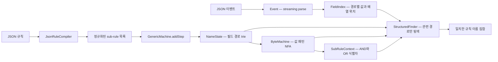
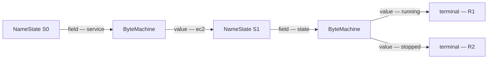
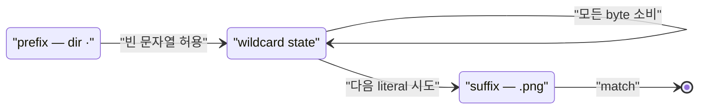
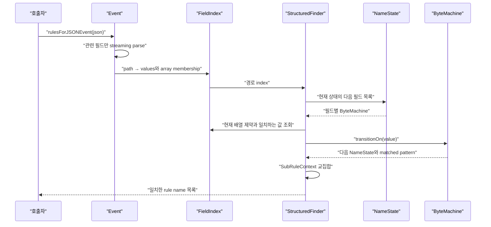
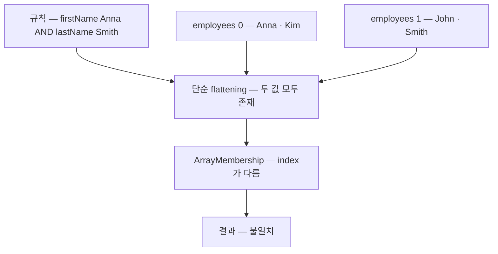
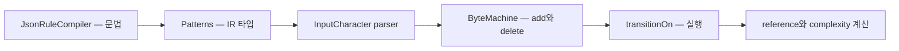

# AWS Event Ruler 코드 레벨 분석

> 분석 기준: `main`의 [`337e8d9`](https://github.com/aws/event-ruler/tree/337e8d99026d3f6687f783535f157be8bf4ebbb7) (2026-07-21), 라이브러리 버전 `2.0.1`  
> 확인일: 2026-08-06 · 라이선스: Apache-2.0 · 언어: Java 8+

관련 문서: [실시간 이벤트 룰 필터링·라우팅 기술 지도](realtime-rule-filtering-routing-landscape.md)

## 0. 결론부터: 무엇을 만든 프로젝트인가

Event Ruler는 **많은 JSON 규칙을 하나의 공유 자동자에 미리 컴파일하고, 들어오는 이벤트를 그 자동자에 한 번 통과시켜 일치하는 모든 규칙 이름을 찾는 라이브러리**다.

일반적인 구현은 `규칙 수 R × 이벤트 크기 E`만큼 각 규칙을 반복 평가한다. Event Ruler는 다음 두 축을 분리한다.

1. `NameState`: 어떤 **필드 경로**를 다음에 볼지 결정하는 상위 trie
2. `ByteMachine`: 해당 필드의 여러 **값 패턴**을 UTF-8 byte 단위로 동시에 평가하는 하위 NFA

여기에 `SubRuleContext`라는 분기 ID를 교집합으로 좁혀 가며 **필드 간 AND**와 `$or` 분기를 보존한다. 핵심은 “규칙을 하나씩 실행”하는 것이 아니라, **규칙들이 공유하는 필드·문자열 prefix를 하나의 실행 경로로 합친다**는 데 있다.



이 설계는 AWS가 2016년 CloudWatch Events에 처음 적용했고, 이후 EventBridge의 이벤트 패턴 매칭 기반으로 사용해 온 구조다. 프로젝트는 2022년에 오픈소스로 공개됐다([AWS Open Source Blog](https://aws.amazon.com/blogs/opensource/open-sourcing-event-ruler/)).

---

## 1. Problem Statement

### 해결하려는 문제

이벤트 라우터에는 다음 형태의 작업이 반복된다.

```text
이벤트 1개 × 등록된 규칙 수십만 개 → 일치하는 규칙 모두 반환
```

규칙을 독립적인 predicate로 저장하면 규칙 수가 증가할수록 매칭 비용도 거의 선형으로 증가한다. 하지만 실제 규칙은 `source`, `detail-type`, `region` 같은 필드와 값 prefix를 많이 공유한다. Event Ruler는 이 중복을 컴파일 시점에 합친다.

### 의도적으로 하지 않는 것

Event Ruler는 범용 룰 엔진이나 CEP 엔진이 아니다.

- 매치 뒤 action을 실행하는 agenda가 없다.
- 이벤트 간 시간 window, join, aggregation이 없다.
- broker, persistence, 분산 실행, rule registry를 제공하지 않는다.
- 입력 JSON 한 건과 정적 패턴 집합 사이의 **고속 multi-match**에 집중한다.

즉, EventBridge 전체가 아니라 EventBridge 안의 “이 이벤트는 어느 rule로 가야 하는가?”를 푸는 핵심 라이브러리다.

---

## 2. 사용자가 보는 규칙 모델

다음 규칙은 `source`가 `aws.ec2`이고, `detail.state`가 `running` 또는 `stopped`인 이벤트를 뜻한다.

```json
{
  "source": ["aws.ec2"],
  "detail": {
    "state": ["running", "stopped"]
  }
}
```

논리 규칙은 단순하다.

- 서로 다른 필드: AND
- 한 필드의 배열 안 패턴: OR
- `$or`: 여러 sub-rule로 분기
- 중첩 object: dotted path로 평탄화

예를 들어 다음 `$or` 규칙은 컴파일 후 두 개의 map이 된다.

```json
{
  "source": ["aws.ec2"],
  "$or": [
    { "detail": { "state": ["running"] } },
    { "detail": { "state": ["stopped"] } }
  ]
}
```

```text
sub-rule 0 = { detail.state: [running], source: [aws.ec2] }
sub-rule 1 = { detail.state: [stopped], source: [aws.ec2] }
```

이 변환은 [`JsonRuleCompiler.compile`](https://github.com/aws/event-ruler/blob/337e8d99026d3f6687f783535f157be8bf4ebbb7/src/main/software/amazon/event/ruler/JsonRuleCompiler.java#L124-L159)과 재귀적인 [`writeRules`](https://github.com/aws/event-ruler/blob/337e8d99026d3f6687f783535f157be8bf4ebbb7/src/main/software/amazon/event/ruler/JsonRuleCompiler.java#L321-L388)가 수행한다. Jackson streaming parser를 사용하므로 규칙 전체를 DOM으로 만든 뒤 다시 순회하지 않는다.

### 연산자

현재 EventBridge 이벤트 패턴 문법과 거의 같은 연산자를 제공한다([공식 연산자 문서](https://docs.aws.amazon.com/eventbridge/latest/userguide/eb-create-pattern-operators.html)).

| 분류 | 예 | 내부 처리 핵심 |
|---|---|---|
| exact | `"running"` | UTF-8 byte trie, tail shortcut |
| prefix / suffix | `{ "prefix": "prod-" }` | 정방향 / 역방향 byte 탐색 |
| equals-ignore-case | `{ "equals-ignore-case": "ready" }` | 각 Java char의 대·소문자 UTF-8 후보 집합 |
| wildcard | `{ "wildcard": "dir/*.png" }` | `*`를 all-byte self-loop NFA로 변환 |
| anything-but | `{ "anything-but": ["bad"] }` | 낙관적 match 뒤 금지 패턴 실패 집합 차감 |
| numeric | `{ "numeric": [">=", 10, "<", 20] }` | 숫자를 정렬 보존 byte 문자열로 변환 후 range trie |
| CIDR | `{ "cidr": "10.0.0.0/24" }` | IP를 고정 길이 hex로 정규화 후 range 처리 |
| exists | `{ "exists": false }` | 값 자동자가 아니라 필드 존재 여부 전이 |

연산자 JSON을 `Patterns` 하위 타입으로 바꾸는 분기점은 [`processMatchExpression`](https://github.com/aws/event-ruler/blob/337e8d99026d3f6687f783535f157be8bf4ebbb7/src/main/software/amazon/event/ruler/JsonRuleCompiler.java#L396-L558)이다.

---

## 3. 컴파일 아키텍처: 두 층의 자동자

### 3.1 상위 층 — `NameState`

[`NameState`](https://github.com/aws/event-ruler/blob/337e8d99026d3f6687f783535f157be8bf4ebbb7/src/main/software/amazon/event/ruler/NameState.java#L20-L45)는 다음 정보를 가진다.

```java
Map<String, ByteMachine> valueTransitions;
Map<String, NameMatcher<NameState>> mustNotExistMatchers;
Map<String, NameState> keyToNextNameState;
```

- key는 `detail.state` 같은 평탄화된 필드 경로다.
- 일반 값 조건은 `ByteMachine`으로 간다.
- `exists:false`는 값이 아니라 **필드 부재**가 조건이므로 별도의 `NameMatcher`로 간다.
- 다음 `NameState`에는 그다음 필드 조건이 연결된다.

규칙의 필드 key는 추가 전에 정렬된다([`addPatternRule`](https://github.com/aws/event-ruler/blob/337e8d99026d3f6687f783535f157be8bf4ebbb7/src/main/software/amazon/event/ruler/GenericMachine.java#L214-L231)). 입력 JSON의 필드 순서와 무관하게 같은 필드 집합이 같은 trie 경로를 공유하게 만드는 결정이다.

### 3.2 하위 층 — `ByteMachine`

[`ByteMachine`](https://github.com/aws/event-ruler/blob/337e8d99026d3f6687f783535f157be8bf4ebbb7/src/main/software/amazon/event/ruler/ByteMachine.java#L45-L83)은 한 필드에 등록된 여러 값 패턴을 동시에 처리하는 byte NFA다.

```text
NameState
  └─ "service" → ByteMachine
                    ├─ e → c → 2 → next NameState
                    ├─ l → a → m → b → d → a → next NameState
                    └─ s → 3 → next NameState
```

문자열이 아니라 byte 단위인 이유는 JSON 문자열의 실제 직렬화와 가깝고, trie transition을 작은 정수 공간에서 효율적으로 표현할 수 있기 때문이다. 다만 ignore-case와 suffix는 Unicode 경계를 보존하기 위한 별도 로직이 필요하다.

### 3.3 같은 prefix는 한 번만 걷는다

다음 두 규칙을 생각해 보자.

```json
R1 = { "service": ["ec2"], "state": ["running"] }
R2 = { "service": ["ec2"], "state": ["stopped"] }
```



`service=ec2`는 규칙마다 다시 평가되지 않는다. `state` 값도 `r`과 `s`가 갈라지는 지점 전까지는 내부 byte trie의 구조를 공유할 수 있다. 실제 재귀 삽입 코드는 [`GenericMachine.addStep`](https://github.com/aws/event-ruler/blob/337e8d99026d3f6687f783535f157be8bf4ebbb7/src/main/software/amazon/event/ruler/GenericMachine.java#L559-L701)이다.

### 3.4 공유 때문에 생기는 논리 혼선을 `SubRuleContext`로 막는다

자동자 노드를 과감히 공유하면 다음 문제가 생긴다.

```text
R1 = A=x AND B=y
R2 = A=p AND B=q
```

노드 도달 여부만 보면 `A=x`와 `B=q`를 조합해 존재하지 않는 rule을 만들 수 있다. Event Ruler는 각 컴파일 branch에 고유한 [`SubRuleContext`](https://github.com/aws/event-ruler/blob/337e8d99026d3f6687f783535f157be8bf4ebbb7/src/main/software/amazon/event/ruler/SubRuleContext.java#L8-L25)를 부여한다.

- 첫 조건에서 가능한 sub-rule ID 집합을 만든다.
- 다음 조건마다 그 패턴에 등록된 ID와 교집합을 취한다.
- 마지막 필드의 terminal ID까지 남은 경우만 rule name을 반환한다.

따라서 상태 공유와 논리적 branch identity가 분리된다. 같은 rule name에 `$or` branch가 여러 개면 서로 다른 `SubRuleContext`가 같은 rule name을 가리킨다.

---

## 4. 값 자동자의 핵심 기술

### 4.1 `ByteState`와 구간 압축

[`ByteState`](https://github.com/aws/event-ruler/blob/337e8d99026d3f6687f783535f157be8bf4ebbb7/src/main/software/amazon/event/ruler/ByteState.java#L16-L23)는 하나의 NFA 상태다. transition 저장소는 상태 크기에 맞춰 바뀐다.

- 전이가 없으면 `null`
- 전이가 하나면 단일 entry
- 전이가 많아지면 [`ByteMap`](https://github.com/aws/event-ruler/blob/337e8d99026d3f6687f783535f157be8bf4ebbb7/src/main/software/amazon/event/ruler/ByteMap.java#L18-L29)

`ByteMap`은 각 byte를 256칸 배열로 저장하지 않고, `NavigableMap`에 **전이가 달라지는 경계**를 저장한다. 그래서 `0x00..0x7F`처럼 넓은 범위가 같은 목적지로 가는 wildcard와 numeric range를 압축할 수 있다.

### 4.2 exact와 `ShortcutTransition`

정확 일치 문자열을 모두 상태로 만들면 긴 고유 문자열이 메모리를 많이 쓴다. Event Ruler는 갈림길이 없는 나머지 tail을 [`ShortcutTransition`](https://github.com/aws/event-ruler/blob/337e8d99026d3f6687f783535f157be8bf4ebbb7/src/main/software/amazon/event/ruler/ShortcutTransition.java)으로 한 번에 저장한다.

나중에 같은 prefix를 가진 새 패턴이 들어오면 shortcut을 필요한 지점까지 풀어 일반 상태로 확장한다([`extendShortcutTransition`](https://github.com/aws/event-ruler/blob/337e8d99026d3f6687f783535f157be8bf4ebbb7/src/main/software/amazon/event/ruler/ByteMachine.java#L1376-L1435)). 이는 radix tree의 path compression과 비슷한 최적화다.

### 4.3 wildcard는 비결정성의 비용을 받아들인다

`dir/*.png`의 `*`는 다음 두 전이로 내려간다.



wildcard 상태가 모든 byte를 소비하면서 동시에 다음 literal 전이도 시도하므로 NFA의 active state가 늘 수 있다. 특히 literal prefix가 반복되는 pattern은 실행 경로가 급격히 증가한다. 프로젝트가 `Machine.evaluateComplexity`를 제공하는 이유다.

중요한 구현 선택은 all-byte self-loop를 기존 공유 상태가 아니라 **wildcard 전용 상태**에 둔다는 점이다. 공유 상태에 loop를 달면 같은 prefix를 쓰는 다른 exact/prefix 규칙까지 오염되기 때문이다. 구현은 [`ByteMachine`의 wildcard 삽입 경로](https://github.com/aws/event-ruler/blob/337e8d99026d3f6687f783535f157be8bf4ebbb7/src/main/software/amazon/event/ruler/ByteMachine.java#L1872-L1939)에 있다.

### 4.4 `anything-but`은 성공을 열거하지 않는다

“이 값들만 아니면 모두 성공”을 순진하게 자동자로 만들면 거의 모든 byte에 성공 전이가 필요하다. Event Ruler는 반대로 처리한다.

1. anything-but pattern을 일단 성공 후보로 둔다.
2. exact/prefix/suffix/wildcard 금지 패턴에 실제로 걸린 후보를 `failedAnythingButs`에 모은다.
3. 마지막에 `전체 anything-but 후보 - 실패 후보`를 반환한다.

이 집합 차감은 [`doTransitionOn`](https://github.com/aws/event-ruler/blob/337e8d99026d3f6687f783535f157be8bf4ebbb7/src/main/software/amazon/event/ruler/ByteMachine.java#L461-L570)에 있다. 보수적인 부정 조건을 희소한 실패 경로로 바꾼 설계다.

### 4.5 숫자를 문자열 비교 가능한 표현으로 바꾼다

숫자 비교를 rule마다 runtime에 `BigDecimal.compareTo`로 수행하지 않는다. [`ComparableNumber.generate`](https://github.com/aws/event-ruler/blob/337e8d99026d3f6687f783535f157be8bf4ebbb7/src/main/software/amazon/event/ruler/ComparableNumber.java#L49-L110)는 다음 순서로 숫자를 정규화한다.

```text
JSON number
  → BigDecimal parse
  → 값 손실 없이 표현 가능한 double인지 검증
  → IEEE-754 sign 영역을 flip · complement
  → unsigned 사전식 순서가 숫자 순서와 같아지는 고정 길이 Base128 문자열
```

핵심 invariant는 다음이다.

```text
a < b  ⇔  ComparableNumber(a) lexicographically < ComparableNumber(b)
```

그래서 numeric range도 byte trie의 구간 전이로 컴파일할 수 있다([`addRangePattern`](https://github.com/aws/event-ruler/blob/337e8d99026d3f6687f783535f157be8bf4ebbb7/src/main/software/amazon/event/ruler/ByteMachine.java#L1220-L1370)). 대신 binary64로 정확히 round-trip하지 않는 정밀도는 거부한다.

### 4.6 CIDR도 같은 range 엔진을 재사용한다

[`CIDR`](https://github.com/aws/event-ruler/blob/337e8d99026d3f6687f783535f157be8bf4ebbb7/src/main/software/amazon/event/ruler/CIDR.java)은 IPv4/IPv6를 고정 길이 대문자 hex로 정규화하고 CIDR block을 inclusive low/high `Range`로 바꾼다. IP literal을 정규식으로 먼저 검사해 `InetAddress`가 hostname을 DNS 조회하는 경로도 차단한다.

즉 numeric과 CIDR은 겉보기에는 다른 operator지만, 내부에서는 둘 다 **사전식 순서를 보존하는 정규화 + byte range 자동자**라는 기반 기술을 공유한다.

---

## 5. 이벤트 실행 경로

공개 API의 주 실행점은 [`GenericMachine.rulesForJSONEvent`](https://github.com/aws/event-ruler/blob/337e8d99026d3f6687f783535f157be8bf4ebbb7/src/main/software/amazon/event/ruler/GenericMachine.java#L85-L100)다. 2.0부터 `StructuredFinder`가 기본이다.



### 5.1 파싱 단계에서 무관한 subtree를 건너뛴다

규칙이 사용하는 field path는 reference count로 관리된다. [`Event`](https://github.com/aws/event-ruler/blob/337e8d99026d3f6687f783535f157be8bf4ebbb7/src/main/software/amazon/event/ruler/Event.java#L123-L151)는 JSON streaming parse 중 `machine.isFieldStepUsed(stepName)`이 false인 subtree를 만들지 않는다.

이 최적화는 이벤트가 매우 커도 규칙이 보는 필드가 적다면 parse 이후의 객체·값 수를 제한한다. [`Path.name`](https://github.com/aws/event-ruler/blob/337e8d99026d3f6687f783535f157be8bf4ebbb7/src/main/software/amazon/event/ruler/Path.java#L31-L51)도 dotted path 문자열 생성을 memoize한다. 주석이 이 부분을 bottleneck으로 명시한다.

### 5.2 `StructuredFinder`는 event가 아니라 machine 경로를 걷는다

이전 `ACFinder`는 한 `NameState`에 도달할 때마다 남아 있는 event field를 queue에 다시 넣었다. 큰 배열에서 step 조합이 늘어날 수 있다.

현재 [`StructuredFinder`](https://github.com/aws/event-ruler/blob/337e8d99026d3f6687f783535f157be8bf4ebbb7/src/main/software/amazon/event/ruler/StructuredFinder.java#L12-L28)는 반대로 동작한다.

1. 이벤트를 dotted path 기반 `FieldIndex`로 만든다.
2. 현재 `NameState`가 가진 field transition만 열거한다.
3. index에서 해당 path의 값만 직접 조회한다.
4. 값 자동자와 배열 제약을 통과한 다음 상태만 재귀 탐색한다.
5. 등록된 모든 rule name이 이미 match되면 조기 종료한다.

코드에 명시된 복잡도는 다음과 같다.

```text
O(F + Σ Vᵢ)

F  = 파싱된 event field 수
Vᵢ = i번째 machine path에서 검사하는 event value 수
```

하나의 배열 원소가 `N`개이고 rule field가 `K`개면 `O(N×K)`, 서로 독립인 sibling 배열 크기가 `N`, `M`이면 cross product 없이 `O(N+M)`을 목표로 한다.

---

## 6. 배열 일관성이 왜 별도 핵심 문제인가

다음 이벤트를 보자.

```json
{
  "employees": [
    { "firstName": "Anna", "lastName": "Kim" },
    { "firstName": "John", "lastName": "Smith" }
  ]
}
```

규칙이 `firstName=Anna AND lastName=Smith`라면 전체 문서에는 두 값이 모두 존재하지만, **같은 배열 원소에는 존재하지 않는다**. 단순 flattening은 이를 잘못 match할 수 있다.



`Event`는 각 값에 `arrayId → elementIndex`를 붙인다. 탐색 중 [`ArrayMembership.checkArrayConsistency`](https://github.com/aws/event-ruler/blob/337e8d99026d3f6687f783535f157be8bf4ebbb7/src/main/software/amazon/event/ruler/ArrayMembership.java#L73-L109)가 기존 제약과 새 값의 membership을 merge한다.

- 공유하는 `arrayId`의 index가 같으면 계속한다.
- 하나라도 다르면 `null`을 반환해 해당 탐색 branch를 버린다.
- 서로 다른 sibling array의 ID는 독립 제약으로 함께 유지한다.

이것이 단순한 JSONPath filter와 Event Ruler의 구조적 매칭 사이에서 가장 놓치기 쉬운 차이다.

---

## 7. 동적 add · delete와 동시성

### 업데이트 모델

- `addPatternRule`과 delete 계열은 `synchronized`로 writer를 직렬화한다.
- 조회에 노출되는 핵심 map은 `ConcurrentHashMap`을 사용한다.
- rule name과 원본 rule JSON을 별도 registry로 저장하지 않고, 자동자 노드에 pattern별 reference를 기록한다.
- delete하려면 호출자가 rule name과 삭제할 rule expression을 알고 있어야 한다.

### 보장 수준

이 구조는 immutable snapshot이나 linearizable read를 제공하지 않는다. update 도중 reader는 일부만 만들어진 경로를 볼 수 있다. `SubRuleContext`가 terminal까지 연결되지 않은 중간 상태의 오탐을 막지만, **동시 add/delete 중인 rule은 일시적으로 누락될 수 있다**.

현재 [`StructuredFinder`](https://github.com/aws/event-ruler/blob/337e8d99026d3f6687f783535f157be8bf4ebbb7/src/main/software/amazon/event/ruler/StructuredFinder.java#L44-L60)는 탐색 중 concurrent modification에서 예외를 외부로 던지지 않고 partial result를 반환한다. 따라서 강한 snapshot semantics가 필요한 시스템은 machine 교체, versioning 또는 외부 read/write 조정이 필요하다.

### 메모리와 실행 시간의 선택지

```java
Machine machine = Machine.builder()
    .withAdditionalNameStateReuse(true)
    .build();
```

[`withAdditionalNameStateReuse`](https://github.com/aws/event-ruler/blob/337e8d99026d3f6687f783535f157be8bf4ebbb7/src/main/software/amazon/event/ruler/GenericMachine.java#L804-L813)를 켜면 같은 key subsequence가 하나의 `NameState`를 강제로 공유한다.

- 장점: 일부 패턴 조합에서 state 수와 메모리를 크게 줄인다.
- 비용: 한 state가 더 많은 sub-rule ID를 가지므로 교집합·순회 비용이 증가할 수 있다.

기본값이 false인 이유는 메모리 최소화가 항상 latency 최소화와 같지 않기 때문이다.

---

## 8. 공개 API와 실제 사용 시 주의점

### 여러 event를 처리할 때

```java
Machine machine = Machine.builder()
    .withAdditionalNameStateReuse(true)
    .withOverridesForDuplicateRules(false)
    .build();

machine.addRule("ec2-running", ruleJson);
List<String> matched = machine.rulesForJSONEvent(eventJson);
machine.deleteRule("ec2-running", ruleJson);
```

`Machine`은 [`GenericMachine<String>`의 얇은 subtype](https://github.com/aws/event-ruler/blob/337e8d99026d3f6687f783535f157be8bf4ebbb7/src/main/software/amazon/event/ruler/Machine.java#L14-L28)이다. rule 이름 타입이 다른 사용자는 `GenericMachine<T>`를 직접 쓸 수 있지만, 삽입 후 rule name 객체를 변경해서는 안 된다.

### 단건 convenience API의 함정

[`Ruler.matchesRule`](https://github.com/aws/event-ruler/blob/337e8d99026d3f6687f783535f157be8bf4ebbb7/src/main/software/amazon/event/ruler/Ruler.java#L40-L44)은 호출마다 새 `Machine`을 만들고 rule 하나를 컴파일한다. 반복 traffic에서는 이 API가 아니라 `Machine`을 재사용해야 컴파일 비용 공유라는 프로젝트의 장점을 얻는다.

### 주요 제약

- rule 하나의 flattened field 수는 최대 256개다.
- dotted path를 내부 key로 쓰므로 JSON key 자체에 `.`가 들어간 경우 nested path와 모호해질 수 있다.
- duplicate path는 호환성을 위해 기본적으로 마지막 값을 덮어쓴다. 새 시스템은 `withOverridesForDuplicateRules(false)`가 안전하다.
- numeric은 정확한 binary64 round-trip 범위로 제한된다.
- match 결과 순서는 API contract가 아니다. 내부 `HashSet`에서 목록을 만든다.
- wildcard 복잡도는 규칙 수보다 훨씬 큰 latency 변수가 될 수 있다.
- operator 추가용 plugin SPI는 없다.

---

## 9. 성능을 정확히 해석하기

README의 “matching time is independent of the number of rules”는 **규칙 수가 늘어도 동일한 field path와 prefix를 공유하면 event를 rule마다 처음부터 다시 읽지 않는다**는 설계 설명으로 이해해야 한다. 엄밀한 `O(1)` 보장은 아니다.

실제 비용은 다음 항에 좌우된다.

```text
T ≈ event parse F
  + relevant path value ΣVᵢ
  + active NFA transitions A
  + SubRuleContext set operations C
  + output rule count M
```

- 새로운 field path와 새로운 pattern prefix가 많으면 machine 크기와 branching이 증가한다.
- wildcard가 반복 prefix를 만나면 `A`가 커진다.
- 동일 state에 sub-rule이 과도하게 모이면 `C`가 커진다.
- 실제 match rule이 매우 많으면 결과를 쓰는 비용 `M`은 피할 수 없다.

프로젝트 README가 공개한 2019 MacBook 기준 microbenchmark에서는 단순 패턴이 대략 20만 events/s 이상, numeric이 12만 이상, 복잡한 array가 3.5만 이상으로 보고됐다. wildcard complexity가 1에서 100으로 증가할 때 약 14만에서 1,250 events/s로 떨어진 표도 있다. 이는 **현재 하드웨어의 보장치가 아니라 operator별 상대 비용과 wildcard 위험을 보여 주는 프로젝트 자체 측정**으로 봐야 한다([README benchmark](https://github.com/aws/event-ruler/blob/337e8d99026d3f6687f783535f157be8bf4ebbb7/README.md#performance)).

### 용량 계획 때 측정해야 할 것

테스트 event를 평균 크기 하나로만 만들지 말고 다음 분포를 따로 측정해야 한다.

- distinct field path 수
- path당 값 수와 nested array 깊이
- exact 대비 wildcard · anything-but · numeric 비율
- wildcard complexity 상위 percentile
- machine의 `NameState`, `ByteState`, sub-rule reference 수
- event 하나가 반환하는 match 수 분포
- update와 read가 겹치는 비율

---

## 10. 기술 스택과 모듈 지도

| 영역 | 구현 / 기술 |
|---|---|
| 언어·빌드 | Java 8 target, Maven |
| JSON | Jackson Core · Databind streaming parser |
| 숫자 파싱 | FastDoubleParser |
| 자동자 | `NameState` trie + `ByteMachine` NFA |
| 값 transition | `ByteState`, `ByteMap`, compound transition |
| 규칙 IR | `Patterns` 계층, `Range`, `AnythingBut` 계층 |
| 구조적 event | `Event`, `Field`, `Value`, `ArrayMembership` |
| 실행기 | `StructuredFinder` 기본, `ACFinder` 호환 경로 |
| 진단 API | `MachineComplexityEvaluator`, `MachineConfiguration` |

권장 코드 읽기 순서는 다음과 같다.

1. [`Machine`](https://github.com/aws/event-ruler/blob/337e8d99026d3f6687f783535f157be8bf4ebbb7/src/main/software/amazon/event/ruler/Machine.java) — 공개 진입점
2. [`JsonRuleCompiler`](https://github.com/aws/event-ruler/blob/337e8d99026d3f6687f783535f157be8bf4ebbb7/src/main/software/amazon/event/ruler/JsonRuleCompiler.java) — JSON 문법과 IR
3. [`GenericMachine.addStep`](https://github.com/aws/event-ruler/blob/337e8d99026d3f6687f783535f157be8bf4ebbb7/src/main/software/amazon/event/ruler/GenericMachine.java#L559-L701) — 규칙 공유 구조 생성
4. [`NameState`](https://github.com/aws/event-ruler/blob/337e8d99026d3f6687f783535f157be8bf4ebbb7/src/main/software/amazon/event/ruler/NameState.java) — field layer
5. [`ByteMachine.transitionOn`](https://github.com/aws/event-ruler/blob/337e8d99026d3f6687f783535f157be8bf4ebbb7/src/main/software/amazon/event/ruler/ByteMachine.java#L88-L123) — value layer 실행
6. [`StructuredFinder.walk`](https://github.com/aws/event-ruler/blob/337e8d99026d3f6687f783535f157be8bf4ebbb7/src/main/software/amazon/event/ruler/StructuredFinder.java#L67-L120) — 전체 match loop
7. [`ArrayMembership`](https://github.com/aws/event-ruler/blob/337e8d99026d3f6687f783535f157be8bf4ebbb7/src/main/software/amazon/event/ruler/ArrayMembership.java) — array correctness

---

## 11. 확장성: 연산자를 하나 추가한다면

Event Ruler에는 독립 plugin interface가 없다. 새 `MatchType`을 추가하려면 대체로 다음을 함께 수정해야 한다.



이 결합은 확장을 어렵게 하지만 hot loop가 virtual plugin callback과 임의 object allocation을 피하게 한다. 성능 중심의 작은 core라는 프로젝트 성격에는 일관된 선택이다.

비교적 안전한 확장 전략은 다음 순서다.

1. 기존 operator가 표현 가능한 경우 compiler sugar로 낮춘다.
2. 사전식 순서를 보존하는 정규화가 가능하면 `Range` 엔진을 재사용한다.
3. 문자열 언어라면 기존 `InputCharacter`와 NFA transition으로 표현한다.
4. 위 두 방식이 안 될 때만 새로운 runtime matcher를 넣는다.

---

## 12. 경쟁·비교 분석

| 프로젝트 | 주 목적 | 실행 모델 | Event Ruler 대비 |
|---|---|---|---|
| [Quamina](https://github.com/timbray/quamina) | Go의 고속 JSON pattern multi-match | field/value automaton, EventBridge 스타일 pattern | 가장 가까운 대안. Go 생태계와 concurrency 모델이 다름 |
| [Drools](https://docs.drools.org/latest/drools-docs/drools/rule-engine/index.html) | 사실·규칙·action을 포함한 범용 rule engine | Phreak · Rete 계열 working memory와 agenda | 추론·action은 훨씬 강하지만 단건 JSON routing에는 무거움 |
| [Esper](https://www.espertech.com/esper/esper-faq/) | 스트림 CEP | EPL query, window, join, temporal pattern | 시간 관계와 aggregation 가능. Event Ruler의 범위 밖 |
| JSONPath · JMESPath | JSON 한 건에서 projection · filter | 표현식별 tree traversal | ad-hoc query에 단순. 대규모 공유 rule set의 multi-match는 핵심 목표가 아님 |
| 직접 작성한 predicate map | 소수 규칙 routing | rule별 함수 호출 | 구현은 쉽지만 rule 공유·array semantics·동적 compiler를 직접 해결해야 함 |

### 선택 기준

- **Event Ruler 적합**: EventBridge 호환 JSON pattern, rule이 많음, event 한 건을 여러 rule과 동시에 비교, Java embedding, 동적 add/delete 필요
- **Quamina 적합**: 같은 문제를 Go에서 해결
- **Drools 적합**: 조건뿐 아니라 fact propagation, 우선순위, action orchestration 필요
- **Esper 적합**: 여러 event 사이의 시간 window, sequence, join이 문제의 중심
- **JSONPath/JMESPath 적합**: rule 수가 적고 projection까지 필요하며 컴파일된 multi-match가 중요하지 않음

---

## 13. 종합 평가

### 강점

- field path와 value prefix를 공유하는 이중 자동자로 rule 수 증가를 흡수한다.
- exact부터 numeric, CIDR, wildcard, anything-but까지 서로 다른 연산자를 byte transition이라는 공통 실행 모델로 낮춘다.
- streaming parse와 relevant-field pruning으로 큰 event의 불필요한 materialization을 줄인다.
- `ArrayMembership`가 nested array의 동일 원소 조건을 정확히 보존한다.
- rule add/delete가 machine 전체 재빌드 없이 가능하다.
- 2.0의 `StructuredFinder`가 큰 배열에서 event-field queue의 조합 폭발을 제거했다.

### 약점과 리스크

- `ByteMachine` 내부는 shortcut, compound transition, wildcard NFA, 부정 패턴까지 얽혀 있어 수정 난도가 높다.
- “규칙 수 독립”이라는 설명은 공유도가 높을 때의 특성이지 최악 시간 복잡도 보장이 아니다.
- wildcard는 규칙 하나도 큰 active-state fan-out을 만들 수 있다.
- dotted path의 `.` 모호성, duplicate path 기본 override는 비신뢰 규칙 입력에서 주의가 필요하다.
- 동시 update 중 read는 snapshot 일관성이 없고 partial result가 가능하다.
- plugin SPI, persistence, metrics surface, 분산 실행은 외부 시스템의 책임이다.

### 엔지니어 관점의 핵심 인사이트

Event Ruler의 가장 재사용할 만한 아이디어는 “JSON rule engine”이라는 표면 API가 아니다. 핵심은 다음 세 가지다.

1. **고차원 조건을 field trie와 value automaton으로 분해한다.**
2. **구조를 공유하되 branch identity는 별도 ID 집합으로 보존한다.**
3. **operator를 runtime callback으로 남기지 않고 정렬 보존 encoding과 NFA로 compile한다.**

이 세 선택 덕분에 실행 시점의 작업이 “각 rule 해석”에서 “공유 그래프 탐색”으로 바뀐다. 반대로 이 설계가 맞지 않는 영역, 즉 시간 관계·action·분산 상태는 과감히 다루지 않는다. 범위를 좁힌 것이 가장 큰 성능 최적화다.

---

## 참고 자료

- [AWS Event Ruler repository](https://github.com/aws/event-ruler)
- [분석 기준 source commit `337e8d9`](https://github.com/aws/event-ruler/tree/337e8d99026d3f6687f783535f157be8bf4ebbb7)
- [Event Ruler README와 benchmark](https://github.com/aws/event-ruler/blob/337e8d99026d3f6687f783535f157be8bf4ebbb7/README.md)
- [AWS Open Source Blog — Open sourcing Event Ruler](https://aws.amazon.com/blogs/opensource/open-sourcing-event-ruler/)
- [Amazon EventBridge event pattern](https://docs.aws.amazon.com/eventbridge/latest/userguide/eb-event-patterns.html)
- [Amazon EventBridge comparison operators](https://docs.aws.amazon.com/eventbridge/latest/userguide/eb-create-pattern-operators.html)
- [AWS announcement — Event Ruler in EventBridge](https://aws.amazon.com/about-aws/whats-new/2024/02/amazon-eventbridge-event-bus-matching-event-ruler/)
- [Event Ruler releases](https://github.com/aws/event-ruler/releases)
- [Quamina](https://github.com/timbray/quamina)
- [Drools rule engine documentation](https://docs.drools.org/latest/drools-docs/drools/rule-engine/index.html)
- [Esper FAQ](https://www.espertech.com/esper/esper-faq/)
